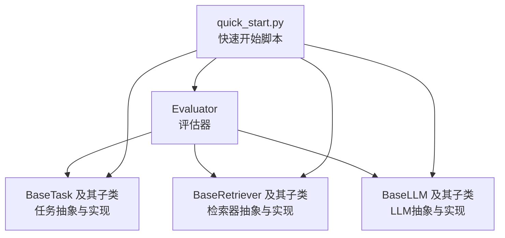
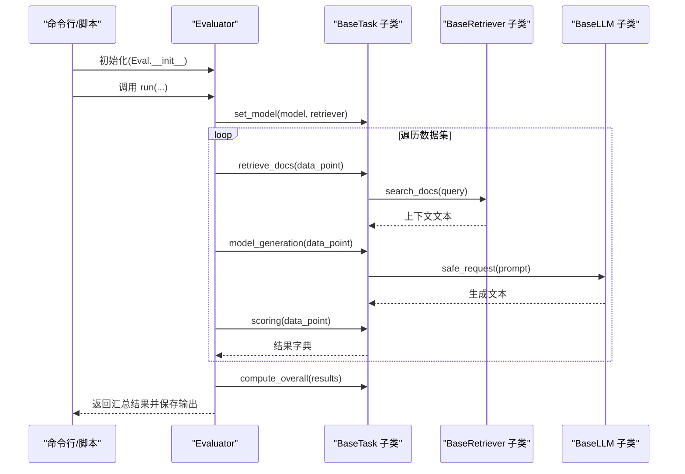
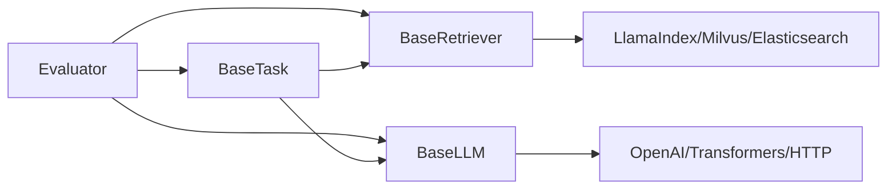

# API参考

<cite>
**本文引用的文件**
- [evaluator.py](file://evaluator.py)
- [quick_start.py](file://quick_start.py)
- [src/tasks/base.py](file://src/tasks/base.py)
- [src/retrievers/base.py](file://src/retrievers/base.py)
- [src/llms/base.py](file://src/llms/base.py)
- [src/llms/api_model.py](file://src/llms/api_model.py)
- [src/llms/local_model.py](file://src/llms/local_model.py)
- [src/llms/remote_model.py](file://src/llms/remote_model.py)
- [src/retrievers/bm25.py](file://src/retrievers/bm25.py)
- [src/retrievers/hybrid.py](file://src/retrievers/hybrid.py)
- [src/taks/summary.py](file://src/taks/summary.py)
- [src/taks/continue_writing.py](file://src/taks/continue_writing.py)
- [src/taks/hallucinated_modified.py](file://src/taks/hallucinated_modified.py)
- [src/taks/quest_answer.py](file://src/taks/quest_answer.py)
- [src/datasets/base.py](file://src/datasets/base.py)
</cite>

## 目录
1. [简介](#简介)
2. [项目结构](#项目结构)
3. [核心组件](#核心组件)
4. [架构总览](#架构总览)
5. [详细组件分析](#详细组件分析)
6. [依赖分析](#依赖分析)
7. [性能考虑](#性能考虑)
8. [故障排查指南](#故障排查指南)
9. [结论](#结论)
10. [附录](#附录)

## 简介
本API参考面向CRUD-RAG评估框架，覆盖Evaluator、BaseTask、BaseRetriever、BaseLLM等核心类的接口规范与行为说明。文档提供参数类型、返回值格式、异常处理策略、默认值、使用示例路径、最佳实践与性能优化建议，并给出版本兼容性与迁移注意事项。

## 项目结构
项目采用分层与功能模块化组织：评估器位于根目录，核心能力分布在src子包中，包括任务（tasks）、检索器（retrievers）、大语言模型（llms）、数据集（datasets）等。快速开始脚本提供端到端调用示例。

图表来源
- [evaluator.py:13-192](file://evaluator.py#L13-L192)
- [quick_start.py:1-110](file://quick_start.py#L1-L110)

章节来源
- [evaluator.py:13-192](file://evaluator.py#L13-L192)
- [quick_start.py:1-110](file://quick_start.py#L1-L110)

## 核心组件
本节概述Evaluator、BaseTask、BaseRetriever、BaseLLM四大核心类的职责与接口要点。

- Evaluator：负责加载数据集、并发执行任务生成与打分、汇总结果并持久化输出。
- BaseTask：定义任务生命周期（检索上下文、模型生成、评分、整体统计），并可选集成QA评测与BERT Score。
- BaseRetriever：封装向量检索与BM25检索，支持Milvus/Elasticsearch后端、索引构建与增量添加。
- BaseLLM：统一LLM请求接口，提供安全请求包装与参数更新机制；具体实现包括OpenAI API、本地推理与远程推理。

章节来源
- [evaluator.py:13-192](file://evaluator.py#L13-L192)
- [src/tasks/base.py:13-74](file://src/tasks/base.py#L13-L74)
- [src/retrievers/base.py:16-142](file://src/retrievers/base.py#L16-L142)
- [src/llms/base.py:6-47](file://src/llms/base.py#L6-L47)

## 架构总览
下图展示Evaluator在一次评估运行中的关键交互流程。

图表来源
- [evaluator.py:118-151](file://evaluator.py#L118-L151)
- [src/tasks/base.py:34-72](file://src/tasks/base.py#L34-L72)
- [src/retrievers/base.py:133-140](file://src/retrievers/base.py#L133-L140)
- [src/llms/base.py:38-46](file://src/llms/base.py#L38-L46)

## 详细组件分析

### Evaluator 类 API
- 职责
  - 统一管理任务、模型、检索器与数据集，执行批量评分与结果汇总。
  - 支持多线程批处理、断点续跑、结果持久化与总体指标计算。
- 关键接口
  - 构造函数
    - 参数
      - task: BaseTask 实例
      - model: BaseLLM 实例
      - retriever: BaseRetriever 实例
      - dataset: list[dict]，每项需包含唯一标识字段（如ID）
      - output_dir: str，默认“./output”
      - num_threads: int，默认40
    - 行为
      - 初始化锁、线程数
      - 基于检索集合名与top-k构造输出目录与文件名
      - 调用 task.set_model(model, retriever)
    - 异常
      - 输出目录创建失败会抛出系统级异常
  - task_generation(data_point)
    - 行为
      - 使用锁保护检索过程
      - 调用 task.retrieve_docs 获取上下文并写入 data_point
      - 调用 task.model_generation 生成文本
    - 返回
      - 生成文本字符串
    - 异常
      - 捕获异常并记录警告，释放锁，返回空字符串
  - multithread_batch_scoring(dataset, sort=True, show_progress_bar=False, contain_original_data=False) -> list[dict]
    - 行为
      - 若输出文件存在则读取已评估结果并去无效项
      - 多线程执行 task_generation 与 task.scoring
      - 过滤无效结果，按ID排序（可选）
    - 返回
      - list[dict]，每项包含 id 与评分字典，可选包含原始数据
    - 异常
      - 单条数据处理异常会被记录并跳过
  - batch_scoring(dataset, sort=True, show_progress_bar=False, contain_original_data=False)
    - 行为
      - 单线程遍历数据集，逻辑同上
    - 返回
      - 同上
  - run(sort=True, show_progress_bar=False, contain_original_data=True) -> dict
    - 行为
      - 调用 multithread_batch_scoring 获取 results
      - 调用 task.compute_overall 计算总体指标
      - 可选保存RAGQuestEval的参考答案
      - 写入 info、overall、results 到输出文件
    - 返回
      - dict，包含 info、overall、results 字段
    - 异常
      - 总体指标计算异常会被捕获并置空
  - save_output(output: dict) -> None
    - 行为
      - 将结果以JSON格式写入文件
  - read_output() -> dict
    - 行为
      - 从输出文件读取JSON
  - remove_invalid(results: list[dict]) -> list[dict]
    - 行为
      - 过滤 results 中 valid=False 的项
- 使用示例（路径）
  - 快速开始脚本中初始化与运行评估的示例：[quick_start.py:106-108](file://quick_start.py#L106-L108)
- 默认值与配置
  - num_threads 默认40
  - contain_original_data 默认True（run中）
  - 输出目录基于 retriever.collection_name 与 similarity_top_k 动态生成
- 错误处理
  - 多处使用 try/except 记录警告并跳过无效项
  - 对外部服务调用通过 safe_request 包装异常
- 性能与并发
  - ThreadPoolExecutor 并发处理数据点
  - 支持断点续跑，避免重复计算

章节来源
- [evaluator.py:13-192](file://evaluator.py#L13-L192)
- [quick_start.py:106-108](file://quick_start.py#L106-L108)

### BaseTask 抽象类 API
- 职责
  - 定义任务生命周期：设置模型与检索器、检索上下文、模型生成、评分、总体统计。
  - 可选启用RAGQuestEval与BERT Score。
- 关键接口
  - __init__(output_dir='./output', quest_eval_model="gpt-3.5-turbo", use_quest_eval=False, use_bert_score=False)
    - 行为
      - 确保输出目录存在
      - 条件创建 QuestEval 实例
  - set_model(model, retriever) -> None
    - 行为
      - 由 Evaluator 在 run 开始时调用注入模型与检索器
  - retrieve_docs(obj: dict) -> str
    - 行为
      - 从输入对象提取查询文本并调用检索器搜索
  - model_generation(obj: dict) -> str
    - 行为
      - 读取模板并拼接上下文，调用模型安全请求
  - _read_prompt_template(filename: str)
    - 行为
      - 从 src/prompts 读取模板内容
  - scoring(data_point: dict) -> dict
    - 返回
      - 必须包含 metrics（数值指标）、log（日志信息）、valid（布尔有效性）
  - compute_overall(results: list[dict]) -> dict
    - 行为
      - 计算平均指标，按需聚合QuestEval/BERT Score
- 使用示例（路径）
  - 任务实现示例：摘要任务、继续写作、幻觉修正、问答任务
    - [src/taks/summary.py:32-121](file://src/taks/summary.py#L32-L121)
    - [src/taks/continue_writing.py:33-119](file://src/taks/continue_writing.py#L33-L119)
    - [src/taks/hallucinated_modified.py:34-124](file://src/taks/hallucinated_modified.py#L34-L124)
    - [src/taks/quest_answer.py:34-134](file://src/taks/quest_answer.py#L34-L134)

章节来源
- [src/tasks/base.py:13-74](file://src/tasks/base.py#L13-L74)
- [src/taks/summary.py:32-121](file://src/taks/summary.py#L32-L121)
- [src/taks/continue_writing.py:33-119](file://src/taks/continue_writing.py#L33-L119)
- [src/taks/hallucinated_modified.py:34-124](file://src/taks/hallucinated_modified.py#L34-L124)
- [src/taks/quest_answer.py:34-134](file://src/taks/quest_answer.py#L34-L134)

### BaseRetriever 抽象类 API
- 职责
  - 提供向量检索与索引管理（Milvus后端），支持分块索引与增量添加。
- 关键接口
  - __init__(docs_directory: str, embed_model, embed_dim=768, chunk_size=128, chunk_overlap=0, collection_name="docs", construct_index=False, add_index=False, similarity_top_k=2)
    - 行为
      - 根据 construct_index 或 add_index 决定构建或加载索引
      - 创建 VectorIndexRetriever 与 RetrieverQueryEngine
  - construct_index()
    - 行为
      - 分批处理节点，写入 Milvus，避免单次超大数据导致失败
  - add_index()
    - 行为
      - 从指定目录加载文档并分批构建索引
  - load_index_from_milvus()
    - 行为
      - 从 Milvus 加载已有索引
  - search_docs(query_text: str) -> str
    - 行为
      - 查询并清洗响应文本，去除文件路径等冗余信息
- 使用示例（路径）
  - 基类使用：[src/retrievers/base.py:16-142](file://src/retrievers/base.py#L16-L142)
  - BM25检索器：[src/retrievers/bm25.py:14-92](file://src/retrievers/bm25.py#L14-L92)
  - 混合检索器（RRF融合）：[src/retrievers/hybrid.py:13-81](file://src/retrievers/hybrid.py#L13-L81)

章节来源
- [src/retrievers/base.py:16-142](file://src/retrievers/base.py#L16-L142)
- [src/retrievers/bm25.py:14-92](file://src/retrievers/bm25.py#L14-L92)
- [src/retrievers/hybrid.py:13-81](file://src/retrievers/hybrid.py#L13-L81)

### BaseLLM 抽象类 API
- 职责
  - 统一LLM参数与请求接口，提供安全请求包装与参数更新。
- 关键接口
  - __init__(model_name="gpt-3.5-turbo", temperature=1.0, max_new_tokens=1024, top_p=0.9, top_k=5, **more_params)
    - 行为
      - 将传入参数合并到 params 字典
  - update_params(inplace=True, **params)
    - 行为
      - 原地或复制更新参数并返回自身或新实例
  - request(query: str) -> str
    - 行为
      - 抽象方法，由具体实现完成实际请求
  - safe_request(query: str) -> str
    - 行为
      - 包装 request，捕获异常并返回空字符串
- 具体实现
  - OpenAI API：GPT
    - 请求方式：chat.completions.create
    - 参数映射：model、messages、temperature、max_tokens、top_p
    - 可选报告token消耗
    - 参考：[src/llms/api_model.py:12-33](file://src/llms/api_model.py#L12-L33)
  - 本地推理：Qwen_7B_Chat、Baichuan2_13B_Chat、ChatGLM3_6B_Chat、Qwen_14B_Chat
    - 请求方式：transformers 本地生成
    - 参数映射：temperature、max_new_tokens、top_p、top_k
    - 参考：[src/llms/local_model.py:11-114](file://src/llms/local_model.py#L11-L114)
  - 远程推理：Baichuan2_13B_Chat、ChatGLM2_6B_Chat、Qwen_14B_Chat、GPT
    - 请求方式：HTTP POST
    - 参数映射：prompt/queries、temperature、max_new_tokens、top_p、top_k
    - 参考：[src/llms/remote_model.py:14-111](file://src/llms/remote_model.py#L14-L111)

章节来源
- [src/llms/base.py:6-47](file://src/llms/base.py#L6-L47)
- [src/llms/api_model.py:12-33](file://src/llms/api_model.py#L12-L33)
- [src/llms/local_model.py:11-114](file://src/llms/local_model.py#L11-L114)
- [src/llms/remote_model.py:14-111](file://src/llms/remote_model.py#L14-L111)

### 任务实现类 API（示例）
以下为典型任务实现的关键方法与返回结构，便于理解评分与统计逻辑。

- Summary
  - retrieve_docs：从 event 字段检索上下文
  - model_generation：读取摘要模板，拼接事件与上下文，调用模型安全请求
  - scoring：计算BLEU、ROUGE-L、BERT Score、QA F1/Recall等指标
  - compute_overall：按样本均值计算总体指标，条件聚合QA指标
  - 参考：[src/taks/summary.py:32-121](file://src/taks/summary.py#L32-L121)
- ContinueWriting
  - 与 Summary 类似，针对 continuation 文本进行评估
  - 参考：[src/taks/continue_writing.py:33-119](file://src/taks/continue_writing.py#L33-L119)
- HalluModified
  - 针对幻觉修正场景，特殊处理特定返回值
  - 参考：[src/taks/hallucinated_modified.py:34-124](file://src/taks/hallucinated_modified.py#L34-L124)
- QuestAnswer（含1/2/3文档变体）
  - 面向问答任务，结合QA评测指标
  - 参考：[src/taks/quest_answer.py:34-134](file://src/taks/quest_answer.py#L34-L134)

章节来源
- [src/taks/summary.py:32-121](file://src/taks/summary.py#L32-L121)
- [src/taks/continue_writing.py:33-119](file://src/taks/continue_writing.py#L33-L119)
- [src/taks/hallucinated_modified.py:34-124](file://src/taks/hallucinated_modified.py#L34-L124)
- [src/taks/quest_answer.py:34-134](file://src/taks/quest_answer.py#L34-L134)

## 依赖分析
- 组件耦合
  - Evaluator 依赖 BaseTask、BaseRetriever、BaseLLM 的具体实现
  - Task 依赖 Retriever 的 search_docs 与 LLM 的 safe_request
  - Retriever 依赖 LlamaIndex/Milvus/Elasticsearch
  - LLM 实现依赖 OpenAI/Transformers/HTTP客户端
- 外部依赖
  - LlamaIndex、LangChain、Milvus、Elasticsearch、OpenAI Python SDK、Transformers、Requests
- 循环依赖
  - 未发现直接循环导入；各模块通过接口契约解耦

图表来源
- [evaluator.py:13-192](file://evaluator.py#L13-L192)
- [src/tasks/base.py:13-74](file://src/tasks/base.py#L13-L74)
- [src/retrievers/base.py:16-142](file://src/retrievers/base.py#L16-L142)
- [src/llms/base.py:6-47](file://src/llms/base.py#L6-L47)

章节来源
- [evaluator.py:13-192](file://evaluator.py#L13-L192)
- [src/tasks/base.py:13-74](file://src/tasks/base.py#L13-L74)
- [src/retrievers/base.py:16-142](file://src/retrievers/base.py#L16-L142)
- [src/llms/base.py:6-47](file://src/llms/base.py#L6-L47)

## 性能考虑
- 并发与吞吐
  - 使用 ThreadPoolExecutor 执行多线程批处理，num_threads 默认40；可根据CPU核数与服务限流调整
- I/O与索引
  - 索引构建与增量添加采用分批写入，避免单次超大数据导致内存与网络压力
- 缓存与断点续跑
  - 评估结果文件自动断点续跑，跳过已有效结果，减少重复开销
- 模型与检索
  - 检索 top_k 增大可提升召回但增加生成成本；合理平衡
  - 使用 safe_request 降低外部服务波动对整体流程的影响
- 最佳实践
  - 控制 batch size 与线程数，避免触发服务限流
  - 优先使用本地或内网部署的LLM以降低延迟
  - 对长文档进行分段检索，提高相关性与效率

## 故障排查指南
- 常见异常与处理
  - 检索器初始化失败
    - 现象：无法连接Milvus/Elasticsearch或索引不存在
    - 排查：确认服务地址、端口、集合名与维度配置
    - 参考：[src/retrievers/base.py:121-131](file://src/retrievers/base.py#L121-L131)
  - LLM请求异常
    - 现象：openai/transformers/HTTP请求失败
    - 排查：检查密钥、URL、Token、网络连通性
    - 参考：[src/llms/api_model.py:17-32](file://src/llms/api_model.py#L17-L32)，[src/llms/remote_model.py:14-111](file://src/llms/remote_model.py#L14-L111)
  - 评估中断或部分失败
    - 现象：个别样本评分为空或无效
    - 处理：Evaluator 已内置异常捕获与跳过逻辑；可在日志中定位问题样本
    - 参考：[evaluator.py:98-100](file://evaluator.py#L98-L100)
  - 输出文件损坏或缺失
    - 现象：断点续跑读取失败
    - 处理：删除不完整输出文件或修复JSON格式
    - 参考：[evaluator.py:114-116](file://evaluator.py#L114-L116)
- 日志与调试
  - 使用 loguru 输出关键信息与警告，便于定位问题
  - 可开启 contain_original_data 以便回溯原始输入

章节来源
- [src/retrievers/base.py:121-131](file://src/retrievers/base.py#L121-L131)
- [src/llms/api_model.py:17-32](file://src/llms/api_model.py#L17-L32)
- [src/llms/remote_model.py:14-111](file://src/llms/remote_model.py#L14-L111)
- [evaluator.py:98-100](file://evaluator.py#L98-L100)
- [evaluator.py:114-116](file://evaluator.py#L114-L116)

## 结论
CRUD-RAG提供了清晰的评估流水线：通过Evaluator编排任务、检索与模型，利用Task实现多样化的评估目标，借助Retriever与LLM实现可插拔的检索与生成能力。本文档总结了核心API的接口规范、参数与默认值、异常处理策略、使用示例与最佳实践，帮助开发者高效、稳定地使用该框架。

## 附录

### 快速开始与参数配置
- 快速开始脚本提供从命令行解析参数并组装评估流程的示例
  - 模型选择：GPT/Qwen系列本地/远程
  - 检索器选择：基础向量、BM25、混合（RRF）、混合重排
  - 任务选择：摘要、继续写作、幻觉修正、问答（1/2/3文档）
  - 参考：[quick_start.py:14-110](file://quick_start.py#L14-L110)

章节来源
- [quick_start.py:14-110](file://quick_start.py#L14-L110)

### 数据集接口（扩展）
- BaseDataset 抽象接口
  - __init__(path)
  - __len__() -> int
  - __getitem__(key: int | slice) -> dict | list[dict]
  - load() -> list[dict]
  - 参考：[src/datasets/base.py:4-20](file://src/datasets/base.py#L4-L20)

章节来源
- [src/datasets/base.py:4-20](file://src/datasets/base.py#L4-L20)