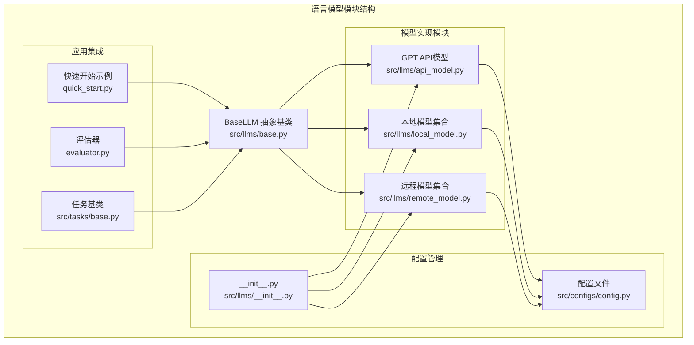
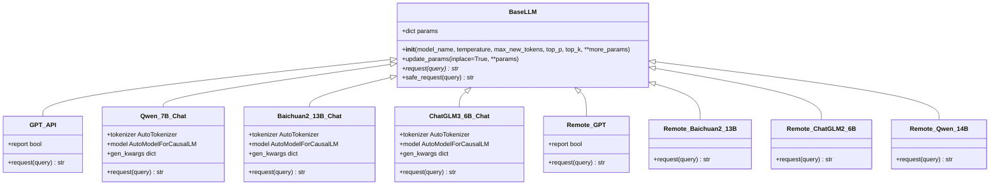
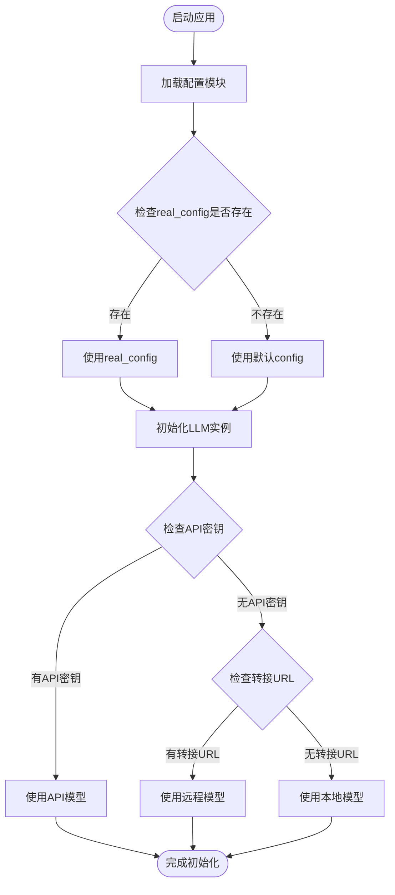
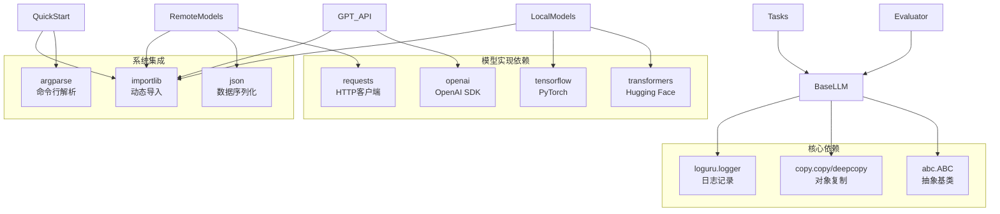

# BaseLLM基类API

<cite>
**本文档引用的文件**
- [src/llms/base.py](file://src/llms/base.py)
- [src/llms/api_model.py](file://src/llms/api_model.py)
- [src/llms/local_model.py](file://src/llms/local_model.py)
- [src/llms/remote_model.py](file://src/llms/remote_model.py)
- [src/llms/__init__.py](file://src/llms/__init__.py)
- [src/configs/config.py](file://src/configs/config.py)
- [quick_start.py](file://quick_start.py)
- [evaluator.py](file://evaluator.py)
- [src/tasks/base.py](file://src/tasks/base.py)
</cite>

## 目录
1. [简介](#简介)
2. [项目结构](#项目结构)
3. [核心组件](#核心组件)
4. [架构概览](#架构概览)
5. [详细组件分析](#详细组件分析)
6. [依赖分析](#依赖分析)
7. [性能考虑](#性能考虑)
8. [故障排除指南](#故障排除指南)
9. [结论](#结论)
10. [附录](#附录)

## 简介
BaseLLM是本项目中所有语言模型的抽象基类，为统一的模型接口设计提供了基础框架。该抽象基类定义了标准化的初始化参数、推理参数配置、请求处理机制以及安全异常处理策略。通过继承BaseLLM，项目实现了多种不同类型的模型集成，包括本地部署的Qwen系列、Baichuan系列和ChatGLM系列大模型，以及基于OpenAI API的云端GPT模型和基于远程服务的转接模型。

BaseLLM的设计遵循了面向对象编程的最佳实践，通过抽象方法确保所有具体实现都必须提供完整的请求处理能力，同时通过参数更新机制支持运行时的动态配置调整。该架构为开发者提供了清晰的扩展点，便于集成新的模型类型或替换现有的模型实现。

## 项目结构
本项目的语言模型相关代码主要集中在src/llms目录下，采用模块化的设计思路，将不同类型的模型实现分离到独立的文件中，通过统一的抽象基类进行管理。

**图表来源**
- [src/llms/base.py:1-47](file://src/llms/base.py#L1-L47)
- [src/llms/api_model.py:1-33](file://src/llms/api_model.py#L1-L33)
- [src/llms/local_model.py:1-114](file://src/llms/local_model.py#L1-L114)
- [src/llms/remote_model.py:1-111](file://src/llms/remote_model.py#L1-L111)

**章节来源**
- [src/llms/base.py:1-47](file://src/llms/base.py#L1-L47)
- [src/llms/__init__.py:1-13](file://src/llms/__init__.py#L1-L13)

## 核心组件
BaseLLM抽象基类是整个语言模型系统的核心，它定义了所有具体模型实现必须遵循的接口规范。该类提供了统一的初始化机制、参数管理功能、请求处理抽象方法以及安全异常处理策略。

### 初始化参数配置
BaseLLM的构造函数接受以下关键参数：
- **model_name**: 模型标识符，默认值为"gpt-3.5-turbo"
- **temperature**: 控制生成随机性的温度参数，默认值为1.0
- **max_new_tokens**: 最大新生成标记数，默认值为1024
- **top_p**: Nucleus采样概率阈值，默认值为0.9
- **top_k**: Top-K采样的候选数量，默认值为5
- **more_params**: 额外的参数字典，支持任意键值对的扩展

这些参数通过params字典进行统一管理，为后续的模型请求提供标准化的配置基础。

### 参数更新机制
BaseLLM提供了灵活的参数更新功能，支持两种模式：
- **就地更新(inplace=True)**: 直接修改当前对象的参数，返回self
- **复制更新(inplace=False)**: 创建新对象的深拷贝，更新后返回新对象

这种设计允许开发者在不破坏原有配置的情况下进行参数调整，为多模型对比实验提供了便利。

### 安全请求处理
safe_request方法提供了异常安全的请求处理机制，自动捕获并记录模型调用过程中的异常，确保系统的稳定性。当发生异常时，该方法会返回空字符串，避免程序中断。

**章节来源**
- [src/llms/base.py:6-46](file://src/llms/base.py#L6-L46)

## 架构概览
BaseLLM系统采用了分层架构设计，通过抽象基类定义统一接口，具体的模型实现负责特定的技术细节。这种设计模式确保了系统的可扩展性和可维护性。

**图表来源**
- [src/llms/base.py:6-46](file://src/llms/base.py#L6-L46)
- [src/llms/api_model.py:12-32](file://src/llms/api_model.py#L12-L32)
- [src/llms/local_model.py:11-113](file://src/llms/local_model.py#L11-L113)
- [src/llms/remote_model.py:14-110](file://src/llms/remote_model.py#L14-L110)

## 详细组件分析

### BaseLLM抽象基类详解
BaseLLM作为所有语言模型的抽象基类，定义了统一的接口规范和行为约定。其核心设计体现了以下特点：

#### 参数管理系统
BaseLLM通过params字典集中管理所有模型相关的配置参数，包括基础参数和扩展参数。这种设计确保了：
- 参数的一致性验证
- 运行时的动态调整能力
- 统一的序列化和传输格式

#### 请求处理抽象
request方法作为抽象方法，要求所有子类必须实现完整的请求处理逻辑。这种强制约束确保了：
- 接口的一致性
- 功能的完整性
- 扩展的灵活性

#### 异常处理策略
safe_request方法提供了统一的异常处理机制，通过try-catch块捕获可能发生的异常，并进行适当的日志记录和错误恢复。

### 具体模型实现分析

#### API模型实现（GPT）
API模型通过OpenAI官方SDK进行实现，具有以下特征：
- 支持自定义API基础URL
- 实现了详细的令牌消耗统计
- 提供可选的报告功能
- 遵循OpenAI的Chat Completions API规范

#### 本地模型实现
本地模型通过Hugging Face Transformers库实现，支持多种主流中文大模型：
- **Qwen系列**: 包括7B和14B参数版本
- **Baichuan系列**: 13B参数版本
- **ChatGLM系列**: 6B参数版本

这些实现具有以下共同特点：
- 使用CUDA加速推理
- 支持bf16精度以节省显存
- 实现了统一的生成参数配置
- 提供了系统提示词的预处理

#### 远程模型实现
远程模型通过HTTP请求与外部服务进行交互，适用于需要通过网关或代理访问的场景：
- 支持自定义认证令牌
- 实现了统一的JSON请求格式
- 提供了灵活的头部配置
- 支持多种远程服务提供商

**章节来源**
- [src/llms/api_model.py:12-32](file://src/llms/api_model.py#L12-L32)
- [src/llms/local_model.py:11-113](file://src/llms/local_model.py#L11-L113)
- [src/llms/remote_model.py:14-110](file://src/llms/remote_model.py#L14-L110)

### 配置管理机制
系统通过配置文件实现模型参数的集中管理，支持开发环境和生产环境的切换：

**图表来源**
- [src/llms/__init__.py:1-13](file://src/llms/__init__.py#L1-L13)
- [src/configs/config.py:1-14](file://src/configs/config.py#L1-L14)

**章节来源**
- [src/llms/__init__.py:1-13](file://src/llms/__init__.py#L1-L13)
- [src/configs/config.py:1-14](file://src/configs/config.py#L1-L14)

## 依赖分析
BaseLLM系统的依赖关系相对简单且清晰，主要依赖于标准库和第三方库：

**图表来源**
- [src/llms/base.py:1-5](file://src/llms/base.py#L1-L5)
- [src/llms/api_model.py:1-10](file://src/llms/api_model.py#L1-L10)
- [src/llms/local_model.py:1-9](file://src/llms/local_model.py#L1-L9)
- [src/llms/remote_model.py:1-6](file://src/llms/remote_model.py#L1-L6)

### 外部依赖关系
系统对外部依赖的管理体现了良好的解耦设计：
- **配置管理**: 通过importlib实现配置文件的动态导入
- **模型选择**: 基于条件判断自动选择合适的模型实现
- **日志记录**: 使用loguru提供统一的日志管理
- **HTTP通信**: 通过requests库处理远程模型的网络请求

**章节来源**
- [src/llms/base.py:1-5](file://src/llms/base.py#L1-L5)
- [src/llms/api_model.py:1-10](file://src/llms/api_model.py#L1-L10)
- [src/llms/local_model.py:1-9](file://src/llms/local_model.py#L1-L9)
- [src/llms/remote_model.py:1-6](file://src/llms/remote_model.py#L1-L6)

## 性能考虑
BaseLLM系统在设计时充分考虑了性能优化和资源管理的最佳实践：

### 内存管理
- **GPU内存优化**: 本地模型实现中使用了bf16精度以减少显存占用
- **设备映射**: 通过device_map="auto"实现模型在可用设备间的智能分配
- **模型状态**: 本地模型在初始化时设置为eval模式以禁用梯度计算

### 计算效率
- **批量处理**: 通过ThreadPoolExecutor实现多线程并发处理
- **结果缓存**: 评估器支持结果的断点续跑和缓存机制
- **参数共享**: gen_kwargs字典避免了重复的参数传递

### 网络优化
- **连接复用**: 远程模型请求中使用keep-alive头保持连接
- **超时控制**: 可通过配置文件调整请求超时时间
- **重试机制**: safe_request方法提供基本的异常恢复能力

## 故障排除指南
BaseLLM系统提供了多层次的错误处理和调试支持：

### 常见问题诊断
1. **模型初始化失败**: 检查配置文件中的路径设置是否正确
2. **API调用异常**: 验证API密钥和基础URL配置
3. **本地模型加载失败**: 确认模型权重文件的完整性和兼容性
4. **远程服务连接超时**: 检查网络连接和服务器状态

### 调试技巧
- **启用详细日志**: 通过loguru的logger配置获取更详细的执行信息
- **参数验证**: 使用update_params方法逐步调整参数进行测试
- **最小化复现**: 创建简单的测试用例隔离问题范围

**章节来源**
- [src/llms/base.py:38-45](file://src/llms/base.py#L38-L45)
- [evaluator.py:154-156](file://evaluator.py#L154-L156)

## 结论
BaseLLM抽象基类为整个语言模型系统提供了坚实的架构基础，通过统一的接口设计和灵活的扩展机制，成功整合了多种不同类型的模型实现。该设计不仅保证了代码的可维护性和可扩展性，还为开发者提供了清晰的集成指导和最佳实践参考。

系统的核心优势体现在：
- **统一的抽象接口**: 确保所有模型实现的一致性
- **灵活的参数管理**: 支持运行时的动态配置调整
- **完善的异常处理**: 提供稳定可靠的错误恢复机制
- **清晰的扩展点**: 便于集成新的模型类型和技术方案

对于开发者而言，BaseLLM不仅是一个技术实现，更是理解和扩展现代语言模型集成架构的优秀范例。

## 附录

### API参考手册

#### BaseLLM类
- **构造函数**: 接受model_name、temperature、max_new_tokens、top_p、top_k等参数
- **update_params()**: 更新模型参数，支持就地和复制两种模式
- **request()**: 抽象方法，子类必须实现的具体请求处理逻辑
- **safe_request()**: 安全的请求包装方法，自动处理异常

#### 具体模型类
- **GPT**: 支持OpenAI API和远程转接服务
- **Qwen_7B_Chat/Qwen_14B_Chat**: 支持阿里云Qwen系列本地模型
- **Baichuan2_13B_Chat**: 支持百川智能Baichuan系列本地模型
- **ChatGLM3_6B_Chat**: 支持智谱AI ChatGLM系列本地模型

### 集成指南
1. **继承BaseLLM**: 创建新的模型类并实现request方法
2. **参数配置**: 在构造函数中调用super().__init__()设置基础参数
3. **依赖声明**: 在__init__.py中注册新的模型类
4. **配置支持**: 在config.py中添加必要的配置项
5. **测试验证**: 编写单元测试确保接口兼容性

### 性能优化建议
- 合理设置temperature和top_p参数以平衡生成质量和速度
- 根据硬件条件选择合适的模型大小和精度
- 使用多线程处理提高批量请求的吞吐量
- 实现适当的缓存机制减少重复计算
- 监控资源使用情况及时调整配置参数