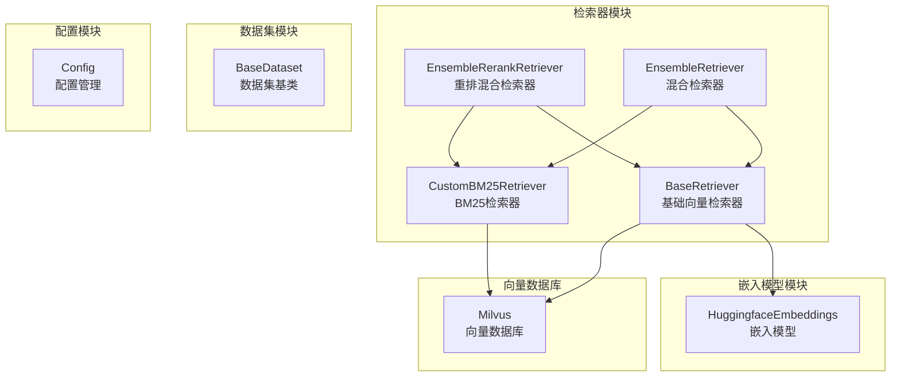
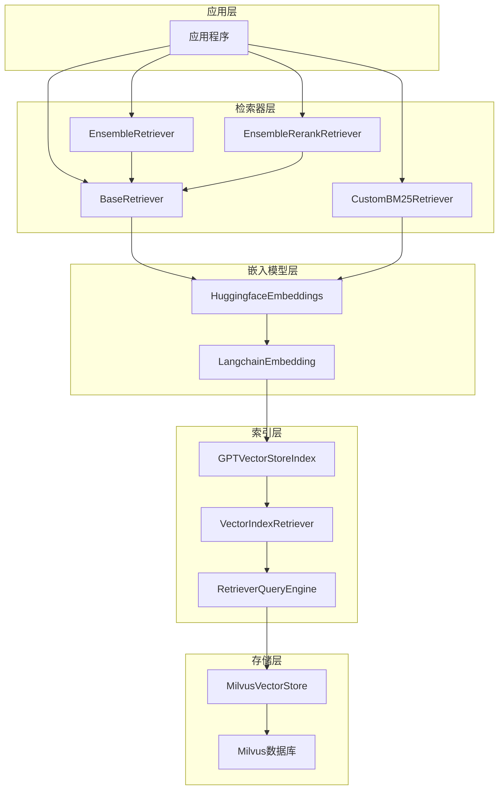
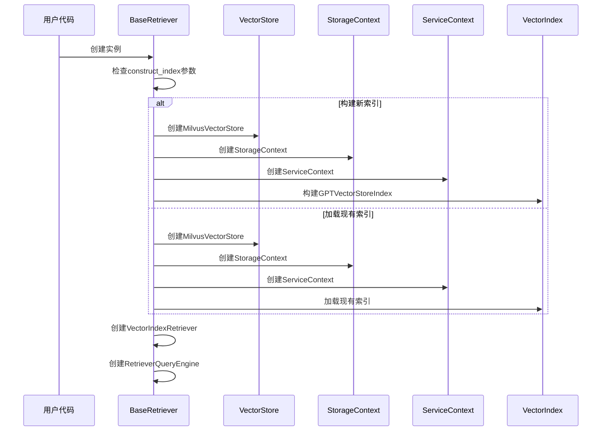
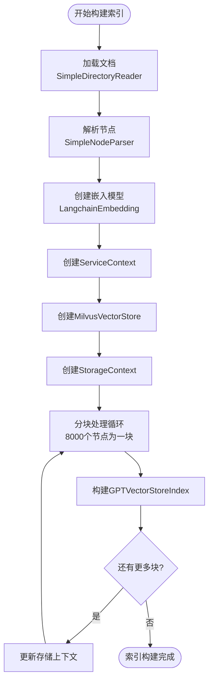
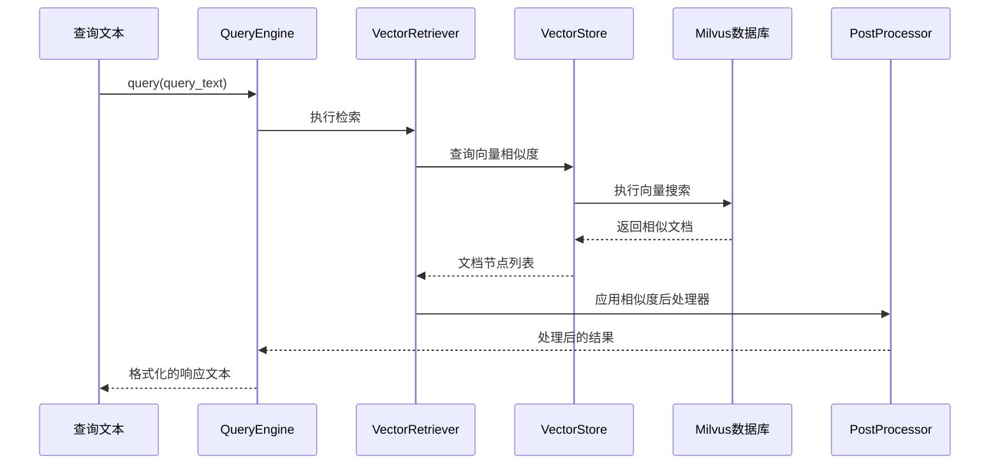
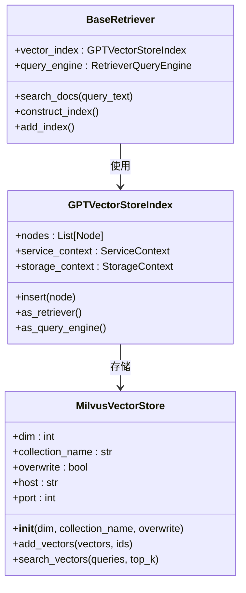
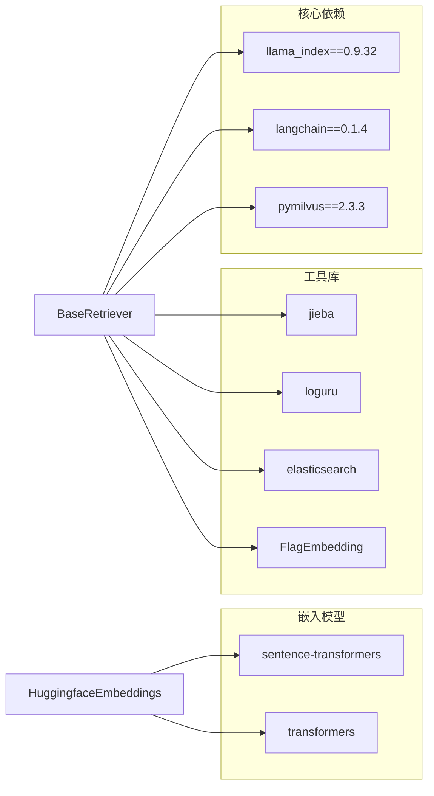
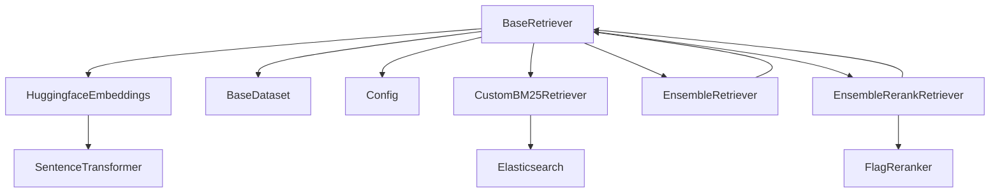
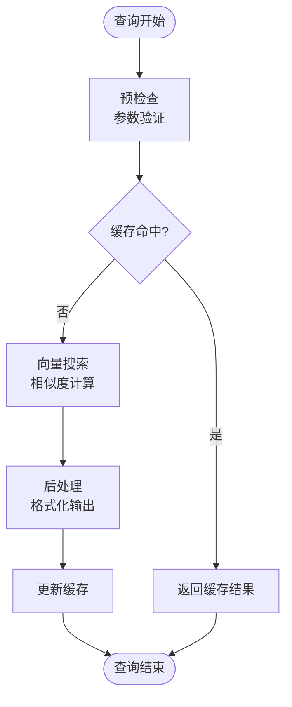
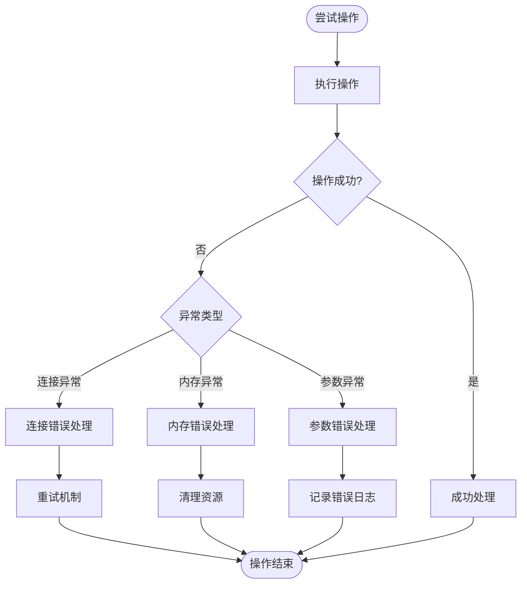

# BaseRetriever基类API

<cite>
**本文档引用的文件**
- [src/retrievers/base.py](file://src/retrievers/base.py)
- [src/retrievers/__init__.py](file://src/retrievers/__init__.py)
- [src/retrievers/bm25.py](file://src/retrievers/bm25.py)
- [src/retrievers/hybrid.py](file://src/retrievers/hybrid.py)
- [src/retrievers/hybrid_rerank.py](file://src/retrievers/hybrid_rerank.py)
- [src/embeddings/base.py](file://src/embeddings/base.py)
- [src/datasets/base.py](file://src/datasets/base.py)
- [src/configs/config.py](file://src/configs/config.py)
- [quick_start.py](file://quick_start.py)
- [requirements.txt](file://requirements.txt)
- [README.md](file://README.md)
- [README.zh_CN.md](file://README.zh_CN.md)
</cite>

## 目录
1. [简介](#简介)
2. [项目结构](#项目结构)
3. [核心组件](#核心组件)
4. [架构概览](#架构概览)
5. [详细组件分析](#详细组件分析)
6. [依赖关系分析](#依赖关系分析)
7. [性能考虑](#性能考虑)
8. [故障排除指南](#故障排除指南)
9. [结论](#结论)
10. [附录](#附录)

## 简介

BaseRetriever是CRUD-RAG项目中的抽象基类，用于构建和管理向量检索系统。该类基于LlamaIndex框架，集成了Milvus向量数据库，提供了完整的文档索引构建、相似度检索和向量查询功能。BaseRetriever支持多种文档格式（txt、json等），具有灵活的配置选项和强大的扩展能力。

该项目专注于中文检索增强生成（RAG）任务，特别针对CRUD基准数据集进行了优化。通过BaseRetriever，开发者可以轻松构建高性能的向量检索系统，支持大规模文档的快速检索和相似性匹配。

## 项目结构

CRUD-RAG项目的整体架构采用模块化设计，主要包含以下核心模块：



**图表来源**
- [src/retrievers/base.py:16-142](file://src/retrievers/base.py#L16-L142)
- [src/retrievers/bm25.py:14-92](file://src/retrievers/bm25.py#L14-L92)
- [src/retrievers/hybrid.py:13-81](file://src/retrievers/hybrid.py#L13-L81)
- [src/retrievers/hybrid_rerank.py:26-81](file://src/retrievers/hybrid_rerank.py#L26-L81)

**章节来源**
- [src/retrievers/base.py:1-142](file://src/retrievers/base.py#L1-L142)
- [src/retrievers/__init__.py:1-4](file://src/retrievers/__init__.py#L1-L4)

## 核心组件

### BaseRetriever类概述

BaseRetriever是整个检索系统的核心抽象基类，继承自ABC（抽象基类）。该类提供了完整的向量检索功能，包括文档索引构建、相似度检索和向量查询等核心方法。

#### 主要特性
- **向量化文档处理**：支持多种文档格式的自动解析和向量化
- **Milvus集成**：原生支持Milvus向量数据库，提供高性能存储和查询
- **可配置参数**：丰富的构造函数参数，支持灵活的配置选项
- **批量索引**：针对Milvus限制的分块索引策略
- **查询引擎**：内置查询引擎，支持复杂的检索操作

**章节来源**
- [src/retrievers/base.py:16-55](file://src/retrievers/base.py#L16-L55)

## 架构概览

BaseRetriever的架构设计体现了现代RAG系统的最佳实践，采用了分层架构和插件化设计：



**图表来源**
- [src/retrievers/base.py:1-142](file://src/retrievers/base.py#L1-L142)
- [src/embeddings/base.py:14-88](file://src/embeddings/base.py#L14-L88)

## 详细组件分析

### BaseRetriever构造函数详解

BaseRetriever的构造函数提供了丰富的配置选项，支持从零开始构建索引或从现有索引加载。

#### 构造函数参数

| 参数名 | 类型 | 默认值 | 描述 |
|--------|------|--------|------|
| docs_directory | str | - | 文档目录路径 |
| embed_model | Embeddings | - | 嵌入模型实例 |
| embed_dim | int | 768 | 嵌入维度 |
| chunk_size | int | 128 | 文档分块大小 |
| chunk_overlap | int | 0 | 分块重叠大小 |
| collection_name | str | "docs" | Milvus集合名称 |
| construct_index | bool | False | 是否构建新索引 |
| add_index | bool | False | 是否添加索引 |
| similarity_top_k | int | 2 | 返回的最相似文档数量 |

#### 初始化流程



**图表来源**
- [src/retrievers/base.py:17-55](file://src/retrievers/base.py#L17-L55)

**章节来源**
- [src/retrievers/base.py:17-55](file://src/retrievers/base.py#L17-L55)

### 文档索引构建方法

BaseRetriever提供了两种主要的文档索引构建方法：`construct_index()`和`add_index()`。

#### construct_index()方法

该方法用于从头开始构建新的向量索引，适用于首次使用或需要重建索引的场景。



**图表来源**
- [src/retrievers/base.py:56-87](file://src/retrievers/base.py#L56-L87)

#### add_index()方法

该方法用于向现有索引中添加新的文档，适用于增量更新场景。

**章节来源**
- [src/retrievers/base.py:56-119](file://src/retrievers/base.py#L56-L119)

### 相似度检索方法

BaseRetriever的核心功能是提供高效的相似度检索，主要通过`search_docs()`方法实现。

#### search_docs()方法

该方法接收查询文本，返回最相似的文档内容。



**图表来源**
- [src/retrievers/base.py:133-141](file://src/retrievers/base.py#L133-L141)

**章节来源**
- [src/retrievers/base.py:133-141](file://src/retrievers/base.py#L133-L141)

### 与Milvus向量数据库的集成

BaseRetriever与Milvus的集成是其核心功能之一，提供了高性能的向量存储和查询能力。

#### Milvus配置选项

| 配置项 | 类型 | 默认值 | 描述 |
|--------|------|--------|------|
| dim | int | embed_dim | 向量维度 |
| collection_name | str | collection_name | 集合名称 |
| overwrite | bool | True/False | 是否覆盖现有集合 |
| host | str | localhost | Milvus服务器地址 |
| port | int | 19530 | Milvus服务器端口 |

#### 连接和查询流程



**图表来源**
- [src/retrievers/base.py:67-70](file://src/retrievers/base.py#L67-L70)
- [src/retrievers/base.py:121-131](file://src/retrievers/base.py#L121-L131)

**章节来源**
- [src/retrievers/base.py:67-87](file://src/retrievers/base.py#L67-L87)
- [src/retrievers/base.py:121-131](file://src/retrievers/base.py#L121-L131)

## 依赖关系分析

### 外部依赖

BaseRetriever依赖于多个关键库来实现其功能：



**图表来源**
- [requirements.txt:1-13](file://requirements.txt#L1-L13)

### 内部依赖关系

BaseRetriever与其他模块之间的依赖关系如下：



**图表来源**
- [src/retrievers/base.py:1-14](file://src/retrievers/base.py#L1-L14)
- [src/retrievers/bm25.py:1-12](file://src/retrievers/bm25.py#L1-L12)
- [src/retrievers/hybrid.py:11-11](file://src/retrievers/hybrid.py#L11-L11)
- [src/retrievers/hybrid_rerank.py:12-12](file://src/retrievers/hybrid_rerank.py#L12-L12)

**章节来源**
- [requirements.txt:1-13](file://requirements.txt#L1-L13)
- [src/retrievers/__init__.py:1-4](file://src/retrievers/__init__.py#L1-L4)

## 性能考虑

### 索引构建优化

BaseRetriever在索引构建过程中采用了多项优化策略：

1. **分块处理**：将大量文档分批处理（每批8000个节点），避免内存溢出
2. **增量存储**：每次处理后更新存储上下文，确保数据一致性
3. **并行处理**：利用多线程提高处理速度

### 查询性能优化



### 最佳实践建议

1. **合理设置chunk_size**：根据文档长度和内存限制选择合适的分块大小
2. **优化similarity_top_k**：平衡召回率和查询性能
3. **使用增量索引**：对于频繁更新的数据集，使用add_index()方法
4. **监控内存使用**：定期检查内存使用情况，避免内存泄漏
5. **索引维护**：定期重建索引以保持查询性能

**章节来源**
- [src/retrievers/base.py:74-78](file://src/retrievers/base.py#L74-L78)
- [src/retrievers/base.py:112-116](file://src/retrievers/base.py#L112-L116)

## 故障排除指南

### 常见问题及解决方案

#### Milvus连接问题

**问题描述**：无法连接到Milvus数据库
**可能原因**：
- Milvus服务未启动
- 网络连接问题
- 配置参数错误

**解决方案**：
1. 确认Milvus服务已启动
2. 检查网络连接和防火墙设置
3. 验证配置参数（主机、端口、集合名）

#### 内存不足问题

**问题描述**：索引构建过程中出现内存不足
**解决方案**：
1. 减小chunk_size参数
2. 增加系统内存
3. 使用更高效的嵌入模型

#### 查询性能问题

**问题描述**：查询响应时间过长
**解决方案**：
1. 优化similarity_top_k参数
2. 检查索引完整性
3. 考虑使用缓存机制

### 错误处理机制

BaseRetriever实现了完善的错误处理机制：



**章节来源**
- [src/retrievers/base.py:1-14](file://src/retrievers/base.py#L1-L14)
- [src/retrievers/base.py:37-43](file://src/retrievers/base.py#L37-L43)

## 结论

BaseRetriever作为CRUD-RAG项目的核心组件，提供了完整而强大的向量检索功能。通过精心设计的架构和优化的实现，它能够高效地处理大规模文档的索引和检索任务。

### 主要优势

1. **模块化设计**：清晰的职责分离和良好的扩展性
2. **性能优化**：针对Milvus的专门优化和分块处理策略
3. **易用性强**：简洁的API设计和丰富的配置选项
4. **稳定性高**：完善的错误处理和异常恢复机制

### 发展方向

未来可以在以下方面进一步改进：
1. 支持更多的向量数据库后端
2. 增强缓存机制以提高查询性能
3. 提供更详细的监控和诊断功能
4. 优化内存使用和资源管理

## 附录

### API参考

#### BaseRetriever类方法

| 方法名 | 参数 | 返回值 | 描述 |
|--------|------|--------|------|
| __init__ | docs_directory, embed_model, embed_dim, chunk_size, chunk_overlap, collection_name, construct_index, add_index, similarity_top_k | None | 构造函数 |
| construct_index | - | None | 构建新的向量索引 |
| add_index | - | None | 向现有索引添加文档 |
| load_index_from_milvus | - | None | 从Milvus加载现有索引 |
| search_docs | query_text: str | str | 执行相似度检索 |

#### 使用示例

```python
# 基本使用
retriever = BaseRetriever(
    docs_path, 
    embed_model=embeddings, 
    embed_dim=768,
    chunk_size=128,
    chunk_overlap=0,
    construct_index=True,
    collection_name="docs_collection",
    similarity_top_k=8
)

# 执行检索
result = retriever.search_docs("查询文本")
```

### 配置建议

1. **嵌入模型选择**：根据任务需求选择合适的预训练模型
2. **索引参数调优**：根据数据规模调整chunk_size和similarity_top_k
3. **硬件资源配置**：确保足够的内存和存储空间
4. **监控和维护**：建立定期检查和维护机制

**章节来源**
- [quick_start.py:61-67](file://quick_start.py#L61-L67)
- [README.md:76-105](file://README.md#L76-L105)
- [README.zh_CN.md:80-109](file://README.zh_CN.md#L80-L109)