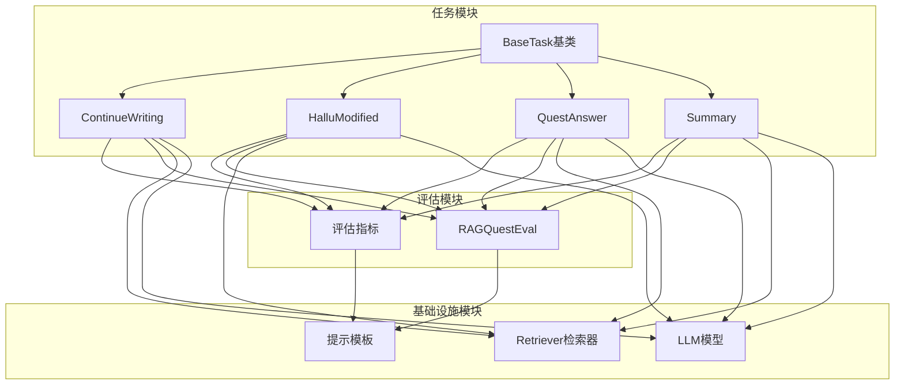
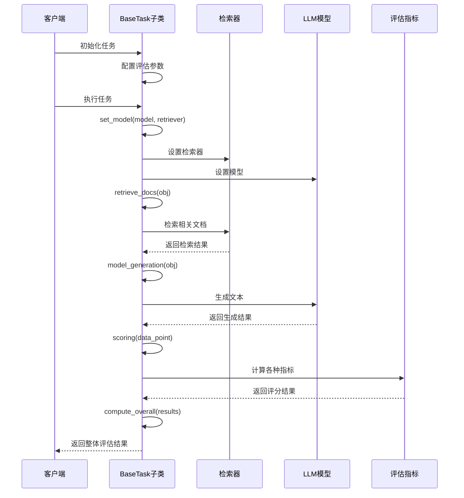
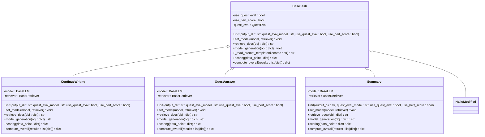
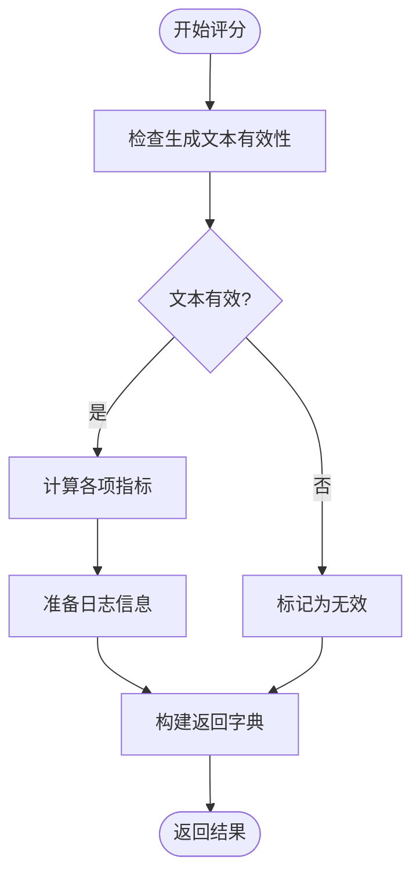
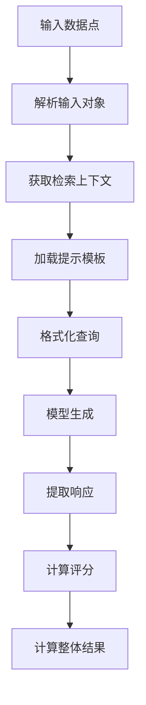
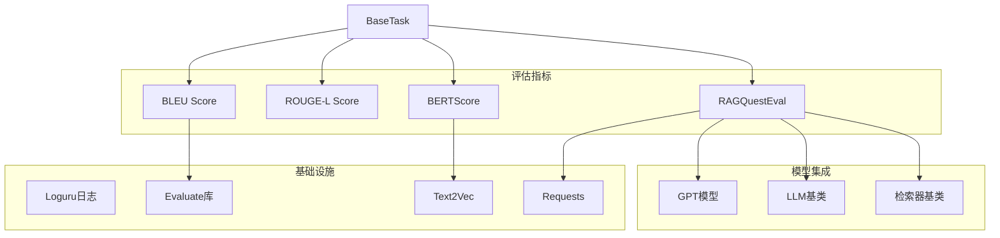
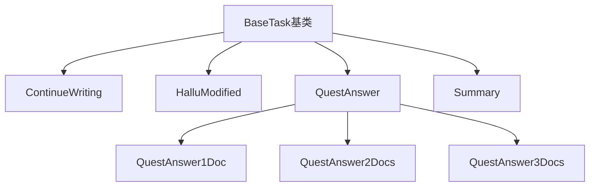

# BaseTask基类API

<cite>
**本文档引用的文件**
- [src/tasks/base.py](file://src/tasks/base.py)
- [src/tasks/continue_writing.py](file://src/tasks/continue_writing.py)
- [src/tasks/hallucinated_modified.py](file://src/tasks/hallucinated_modified.py)
- [src/tasks/quest_answer.py](file://src/tasks/quest_answer.py)
- [src/tasks/summary.py](file://src/tasks/summary.py)
- [src/metric/common.py](file://src/metric/common.py)
- [src/metric/quest_eval.py](file://src/metric/quest_eval.py)
- [src/retrievers/base.py](file://src/retrievers/base.py)
- [src/llms/base.py](file://src/llms/base.py)
- [src/prompts/continue_writing.txt](file://src/prompts/continue_writing.txt)
- [README.md](file://README.md)
</cite>

## 目录
1. [简介](#简介)
2. [项目结构](#项目结构)
3. [核心组件](#核心组件)
4. [架构概览](#架构概览)
5. [详细组件分析](#详细组件分析)
6. [依赖分析](#依赖分析)
7. [性能考虑](#性能考虑)
8. [故障排除指南](#故障排除指南)
9. [结论](#结论)
10. [附录](#附录)

## 简介

BaseTask是CRUD-RAG项目中的抽象基类，为所有RAG评估任务提供统一的接口规范和实现框架。该基类定义了RAG系统的核心工作流程，包括文档检索、模型生成、评分计算和整体结果汇总等关键步骤。

CRUD-RAG是一个针对大语言模型检索增强生成(RAG)系统的综合性中文基准测试，包含多个预定义的任务类型和评估指标。BaseTask基类确保了不同任务之间的一致性和可扩展性。

## 项目结构

CRUD-RAG项目采用模块化设计，主要包含以下核心模块：

**图表来源**
- [src/tasks/base.py:13-74](file://src/tasks/base.py#L13-L74)
- [src/tasks/continue_writing.py:13-119](file://src/tasks/continue_writing.py#L13-L119)
- [src/tasks/quest_answer.py:14-134](file://src/tasks/quest_answer.py#L14-L134)

**章节来源**
- [README.md:27-68](file://README.md#L27-L68)

## 核心组件

### BaseTask抽象基类

BaseTask是所有RAG任务的抽象基类，定义了统一的接口规范和基础功能。该类采用Python的ABC(抽象基类)机制，确保子类必须实现特定的方法。

#### 构造函数参数配置

BaseTask的构造函数提供了灵活的初始化选项：

| 参数名 | 类型 | 默认值 | 描述 |
|--------|------|--------|------|
| output_dir | str | './output' | 输出目录路径，用于保存评估结果 |
| quest_eval_model | str | "gpt-3.5-turbo" | RAGQuestEval评估使用的模型名称 |
| use_quest_eval | bool | False | 是否启用RAGQuestEval评估指标 |
| use_bert_score | bool | False | 是否启用BERTScore语义相似度评估 |

#### 核心方法接口规范

BaseTask定义了以下抽象方法，子类必须实现：

1. **set_model()** - 模型设置方法
2. **retrieve_docs()** - 文档检索方法  
3. **model_generation()** - 模型生成方法
4. **scoring()** - 评分计算方法
5. **compute_overall()** - 整体结果计算方法

#### 辅助方法

BaseTask还提供了以下实用方法：

- **_read_prompt_template()** - 提示模板读取方法
- 内置的日志记录支持

**章节来源**
- [src/tasks/base.py:14-74](file://src/tasks/base.py#L14-L74)

## 架构概览

BaseTask基类的设计遵循了职责分离和开闭原则，为不同的RAG任务提供了统一的执行框架：

**图表来源**
- [src/tasks/base.py:34-72](file://src/tasks/base.py#L34-L72)
- [src/tasks/continue_writing.py:33-119](file://src/tasks/continue_writing.py#L33-L119)

## 详细组件分析

### BaseTask类详细分析

#### 类结构图

**图表来源**
- [src/tasks/base.py:13-74](file://src/tasks/base.py#L13-L74)
- [src/tasks/continue_writing.py:13-119](file://src/tasks/continue_writing.py#L13-L119)
- [src/tasks/quest_answer.py:14-134](file://src/tasks/quest_answer.py#L14-L134)
- [src/tasks/summary.py:12-121](file://src/tasks/summary.py#L12-L121)

#### 构造函数详细说明

BaseTask的构造函数实现了以下功能：

1. **输出目录验证和创建**：检查output_dir是否存在且为目录，不存在则自动创建
2. **评估指标配置**：根据use_quest_eval和use_bert_score参数决定是否启用相应的评估指标
3. **QuestEval实例化**：当启用RAGQuestEval时，创建QuestEval实例并配置相关参数

#### set_model()方法实现要求

set_model()方法用于设置任务所需的模型和检索器。子类必须：
- 将传入的model和retriever保存为实例变量
- 确保后续方法可以访问这些组件

#### retrieve_docs()方法实现要求

retrieve_docs()方法负责从检索器中获取相关文档：
- 接收包含查询信息的字典对象
- 返回格式化的检索结果字符串
- 子类应根据具体任务类型解析输入字典中的查询字段

#### model_generation()方法实现要求

model_generation()方法执行实际的文本生成：
- 使用模板和检索到的上下文生成响应
- 返回生成的文本内容
- 子类应实现具体的生成逻辑

#### scoring()方法返回值规范

scoring()方法必须返回标准化的字典格式：

**图表来源**
- [src/tasks/base.py:52-65](file://src/tasks/base.py#L52-L65)

scoring()方法的返回字典必须包含：
- **metrics**：包含数值型评估结果的字典（如准确率、召回率、BLEU、ROUGE等）
- **log**：包含字符串型日志信息的字典（如模型输出、时间戳等）
- **valid**：布尔值，指示评估是否有效

#### compute_overall()方法实现要求

compute_overall()方法负责计算整体评估结果：
- 接收scoring()方法返回的结果列表
- 计算平均值和其他统计信息
- 返回标准化的整体结果字典

**章节来源**
- [src/tasks/base.py:34-72](file://src/tasks/base.py#L34-L72)

### 具体子类实现示例

#### ContinueWriting任务实现

ContinueWriting任务专注于新闻续写任务：

**图表来源**
- [src/tasks/continue_writing.py:37-119](file://src/tasks/continue_writing.py#L37-L119)

#### QuestAnswer任务实现

QuestAnswer任务实现问答生成任务，包含多个变体：

| 任务变体 | 继承关系 | 特殊配置 |
|----------|----------|----------|
| QuestAnswer | BaseTask | 基础问答任务 |
| QuestAnswer1Doc | QuestAnswer | 1个文档上下文 |
| QuestAnswer2Docs | QuestAnswer | 2个文档上下文 |
| QuestAnswer3Docs | QuestAnswer | 3个文档上下文 |

#### Summary任务实现

Summary任务专注于摘要生成任务，具有独特的整体计算逻辑：
- 包含BERTScore的特殊处理
- 对QuestEval指标进行单独的平均计算

**章节来源**
- [src/tasks/continue_writing.py:13-119](file://src/tasks/continue_writing.py#L13-L119)
- [src/tasks/quest_answer.py:14-134](file://src/tasks/quest_answer.py#L14-L134)
- [src/tasks/summary.py:12-121](file://src/tasks/summary.py#L12-L121)

## 依赖分析

### 外部依赖关系

BaseTask及其子类依赖于以下外部组件：

**图表来源**
- [src/tasks/base.py:6-11](file://src/tasks/base.py#L6-L11)
- [src/metric/common.py:7-10](file://src/metric/common.py#L7-L10)
- [src/metric/quest_eval.py:10-11](file://src/metric/quest_eval.py#L10-L11)

### 内部依赖关系

BaseTask类之间的继承关系清晰明确，所有子类都遵循相同的接口规范：

**图表来源**
- [src/tasks/base.py:13-74](file://src/tasks/base.py#L13-L74)
- [src/tasks/quest_answer.py:122-134](file://src/tasks/quest_answer.py#L122-L134)

**章节来源**
- [src/tasks/base.py:1-12](file://src/tasks/base.py#L1-L12)
- [src/metric/common.py:1-11](file://src/metric/common.py#L1-L11)

## 性能考虑

### 评估指标性能优化

1. **缓存策略**：RAGQuestEval使用文件缓存存储问题生成结果，避免重复计算
2. **异常处理**：所有评估指标函数都包含异常捕获机制，确保系统稳定性
3. **批量处理**：compute_overall()方法支持批量结果处理，提高计算效率

### 内存管理

1. **模型实例化**：QuestEval模型在构造时一次性实例化，避免重复创建
2. **临时文件**：输出结果以文件形式保存，减少内存占用
3. **迭代处理**：整体计算采用迭代方式，避免大量中间结果堆积

### 并发处理

虽然BaseTask本身不直接支持并发，但其设计允许在上层应用中实现并发执行多个任务实例。

## 故障排除指南

### 常见问题及解决方案

#### 1. 提示模板未找到

**问题描述**：_read_prompt_template()方法返回空字符串
**解决方法**：
- 检查src/prompts/目录下是否存在对应的模板文件
- 确认文件路径和文件名正确
- 验证文件权限设置

#### 2. QuestEval评估失败

**问题描述**：RAGQuestEval评估过程中出现异常
**解决方法**：
- 检查网络连接状态
- 验证API密钥配置
- 查看日志文件获取详细错误信息

#### 3. 输出目录权限问题

**问题描述**：构造函数无法创建或访问输出目录
**解决方法**：
- 检查目录权限设置
- 确认磁盘空间充足
- 避免使用特殊字符作为目录名

#### 4. 评估指标计算异常

**问题描述**：BLEU、ROUGE或BERTScore计算失败
**解决方法**：
- 检查输入文本格式
- 验证依赖库版本兼容性
- 查看异常捕获日志

**章节来源**
- [src/tasks/base.py:47-50](file://src/tasks/base.py#L47-L50)
- [src/tasks/continue_writing.py:58-64](file://src/tasks/continue_writing.py#L58-L64)
- [src/metric/common.py:13-20](file://src/metric/common.py#L13-L20)

## 结论

BaseTask基类为CRUD-RAG项目提供了强大而灵活的RAG任务框架。通过统一的接口规范和标准化的实现模式，它确保了不同任务之间的一致性和可扩展性。

该基类的主要优势包括：
1. **标准化接口**：统一的任务执行流程和数据格式
2. **灵活配置**：支持多种评估指标和模型配置
3. **易于扩展**：清晰的继承结构便于添加新任务类型
4. **健壮性**：完善的异常处理和日志记录机制

对于开发者而言，基于BaseTask创建新的RAG任务相对简单，只需要关注具体的业务逻辑实现，而无需关心底层的框架细节。

## 附录

### 开发者最佳实践

1. **继承规范**：确保子类正确实现所有抽象方法
2. **参数验证**：在构造函数中验证输入参数的有效性
3. **错误处理**：使用异常捕获机制处理潜在错误
4. **日志记录**：合理使用Loguru进行调试和监控
5. **资源管理**：及时释放不需要的资源和文件句柄

### 扩展指导

#### 创建自定义任务的步骤

1. **继承BaseTask**：创建新的任务类并继承BaseTask
2. **实现必需方法**：实现set_model()、retrieve_docs()、model_generation()、scoring()、compute_overall()
3. **配置评估指标**：根据任务需求选择合适的评估指标
4. **测试验证**：编写单元测试验证实现正确性
5. **文档更新**：更新相关文档和README文件

#### 性能优化建议

1. **缓存策略**：对重复计算的结果进行缓存
2. **异步处理**：对于耗时操作考虑使用异步处理
3. **批量操作**：尽量使用批量处理减少I/O操作
4. **内存优化**：及时清理不需要的数据结构