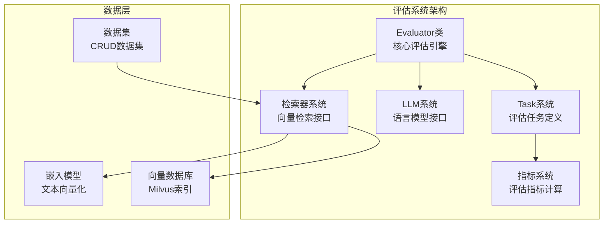
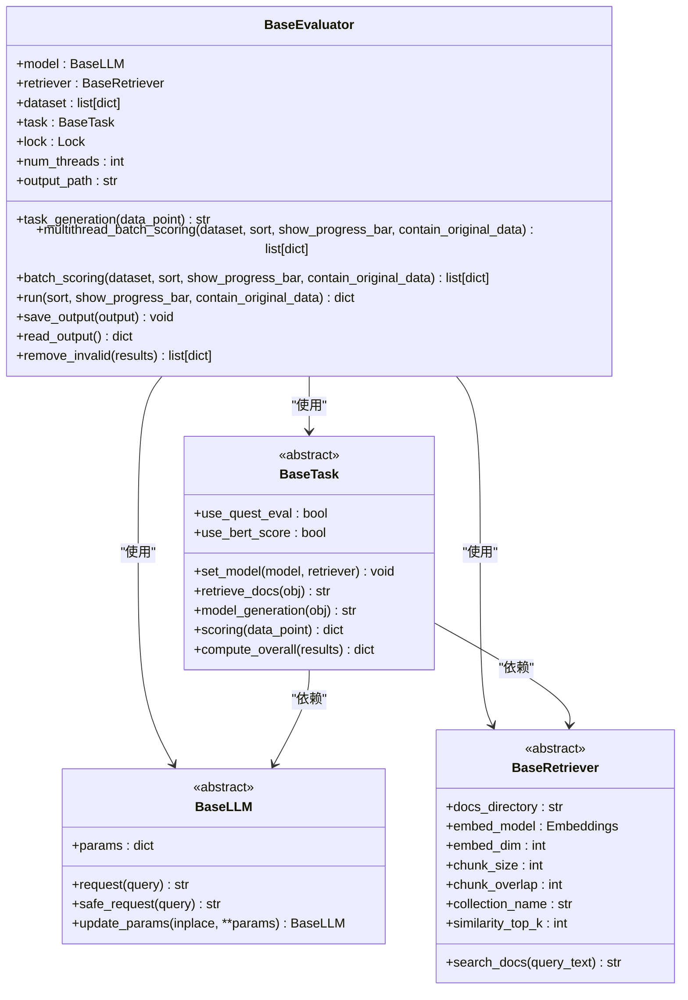
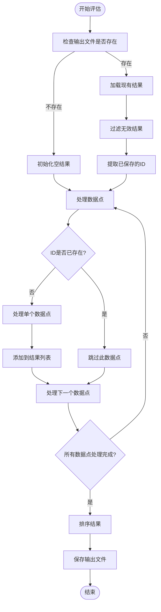
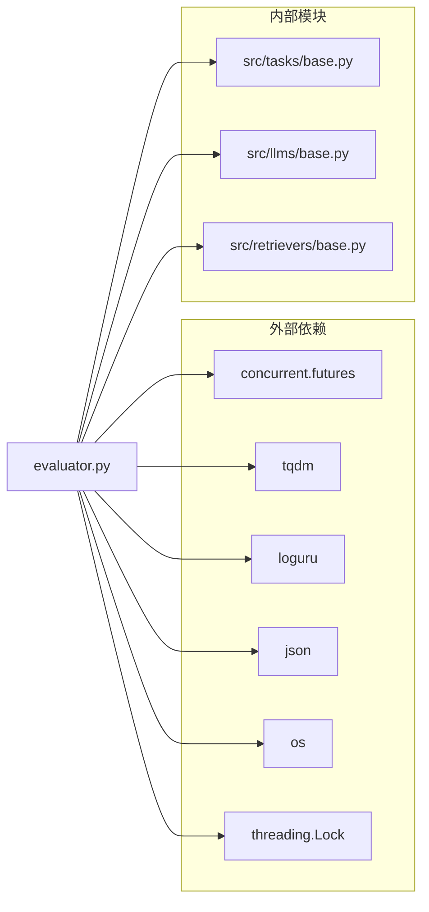
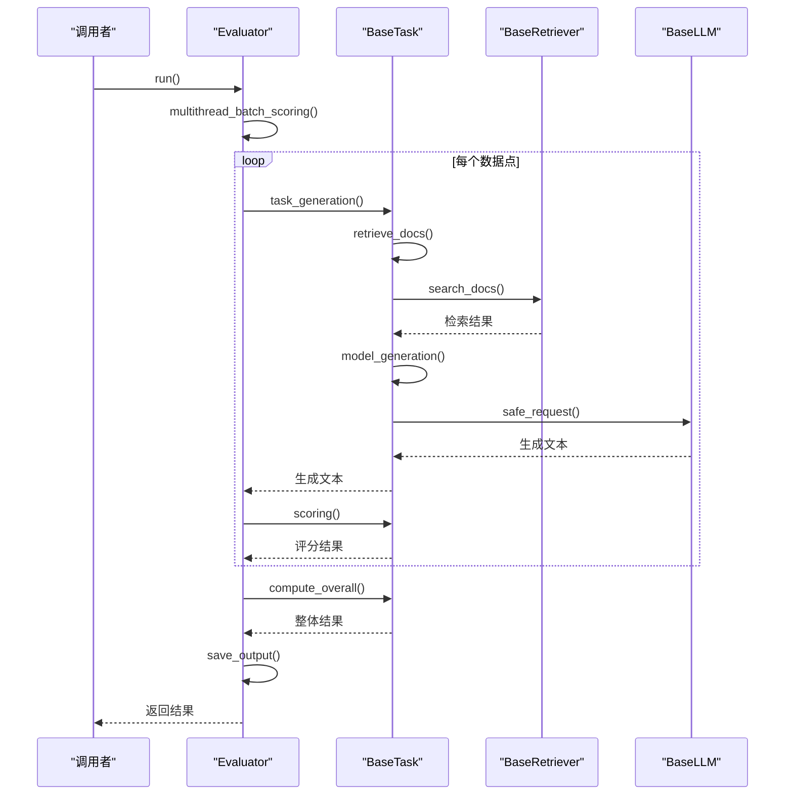

# Evaluator类API

<cite>
**本文档引用的文件**
- [evaluator.py](file://evaluator.py)
- [quick_start.py](file://quick_start.py)
- [README.md](file://README.md)
- [src/tasks/base.py](file://src/tasks/base.py)
- [src/tasks/summary.py](file://src/tasks/summary.py)
- [src/tasks/continue_writing.py](file://src/tasks/continue_writing.py)
- [src/tasks/hallucinated_modified.py](file://src/tasks/hallucinated_modified.py)
- [src/tasks/quest_answer.py](file://src/tasks/quest_answer.py)
- [src/llms/base.py](file://src/llms/base.py)
- [src/retrievers/base.py](file://src/retrievers/base.py)
- [requirements.txt](file://requirements.txt)
</cite>

## 目录
1. [简介](#简介)
2. [项目结构](#项目结构)
3. [核心组件](#核心组件)
4. [架构概览](#架构概览)
5. [详细组件分析](#详细组件分析)
6. [依赖分析](#依赖分析)
7. [性能考虑](#性能考虑)
8. [故障排除指南](#故障排除指南)
9. [结论](#结论)
10. [附录](#附录)

## 简介
Evaluator类是CRUD-RAG基准测试系统的核心评估引擎，专门用于批量评估检索增强生成（RAG）系统的性能。该类提供了完整的评估流程控制、并发处理和进度监控功能，支持多种评估任务和指标计算。

CRUD-RAG是一个针对大语言模型检索增强生成系统的综合性中文基准测试，包含超过80,000条新闻文档的数据集，用于评估RAG系统的各种能力。

## 项目结构
CRUD-RAG项目的整体架构采用模块化设计，主要包含以下核心模块：



**图表来源**
- [evaluator.py:13-41](file://evaluator.py#L13-L41)
- [src/tasks/base.py:13-36](file://src/tasks/base.py#L13-L36)
- [src/llms/base.py:6-23](file://src/llms/base.py#L6-L23)
- [src/retrievers/base.py:16-54](file://src/retrievers/base.py#L16-L54)

**章节来源**
- [README.md:27-68](file://README.md#L27-L68)
- [evaluator.py:13-41](file://evaluator.py#L13-L41)

## 核心组件
Evaluator类作为整个评估系统的核心，负责协调各个组件的工作流程。其主要职责包括：

### 构造函数参数详解
Evaluator类的构造函数接受四个必需参数和一个可选参数：

- **task** (BaseTask): 评估任务实例，定义具体的评估场景和指标计算方式
- **model** (BaseLLM): 大语言模型实例，负责生成文本和回答问题
- **retriever** (BaseRetriever): 检索器实例，负责从向量数据库中检索相关文档
- **dataset** (list[dict]): 评估数据集，包含待评估的样本数据
- **output_dir** (str, 可选): 结果输出目录，默认为'./output'

### 主要属性说明
- **model**: 存储传入的语言模型实例
- **retriever**: 存储传入的检索器实例
- **dataset**: 存储评估数据集
- **task**: 存储评估任务实例
- **lock**: 线程锁，用于并发安全
- **num_threads**: 线程池大小，默认40
- **output_path**: 结果输出文件路径

**章节来源**
- [evaluator.py:14-41](file://evaluator.py#L14-L41)

## 架构概览
Evaluator类采用分层架构设计，通过抽象基类定义统一接口，具体实现类提供特定功能：



**图表来源**
- [evaluator.py:13-192](file://evaluator.py#L13-L192)
- [src/tasks/base.py:13-74](file://src/tasks/base.py#L13-L74)
- [src/llms/base.py:6-47](file://src/llms/base.py#L6-L47)
- [src/retrievers/base.py:16-142](file://src/retrievers/base.py#L16-L142)

## 详细组件分析

### 核心评估方法

#### run() 方法
run()方法执行完整的评估流程，包括数据预处理、批量评分和结果汇总：

**方法签名**: `run(sort=True, show_progress_bar=False, contain_original_data=True) -> dict`

**参数说明**:
- **sort**: 是否按ID排序结果，默认True
- **show_progress_bar**: 是否显示进度条，默认False  
- **contain_original_data**: 是否包含原始数据，默认True

**返回值**: 包含评估信息的字典，字段包括：
- **info**: 任务和模型配置信息
- **overall**: 整体评估结果
- **results**: 详细的评估结果列表

**评估流程**:
1. 构建评估信息字典
2. 调用multithread_batch_scoring()进行批量评分
3. 移除无效结果
4. 计算整体指标
5. 保存评估结果到JSON文件

**章节来源**
- [evaluator.py:118-151](file://evaluator.py#L118-L151)

#### multithread_batch_scoring() 方法
多线程批量评分方法，支持并发处理和断点续评：

**方法签名**: `multithread_batch_scoring(dataset, sort=True, show_progress_bar=False, contain_original_data=False) -> list[dict]`

**核心特性**:
- 使用ThreadPoolExecutor进行并发处理
- 支持断点续评（自动跳过已评估的样本）
- 进度监控和错误处理
- 可选包含原始数据到结果中

**并发处理机制**:
- 默认40个线程
- 使用Lock确保线程安全
- 异常捕获和日志记录

**章节来源**
- [evaluator.py:56-107](file://evaluator.py#L56-L107)

#### batch_scoring() 方法
单线程批量评分方法，适用于调试和小规模数据集：

**方法签名**: `batch_scoring(dataset, sort=True, show_progress_bar=False, contain_original_data=False)`

**适用场景**:
- 小规模数据集评估
- 调试模式
- 需要精确控制的场景

**章节来源**
- [evaluator.py:158-191](file://evaluator.py#L158-L191)

### 数据处理和结果管理

#### task_generation() 方法
统一的任务执行流程，封装了检索、生成和评分的完整过程：

**方法签名**: `task_generation(data_point) -> str`

**处理流程**:
1. 获取线程锁
2. 调用task.retrieve_docs()检索相关文档
3. 释放线程锁
4. 设置retrieve_context到data_point
5. 调用task.model_generation()生成文本

**错误处理**: 捕获异常并记录警告信息，返回空字符串

**章节来源**
- [evaluator.py:42-54](file://evaluator.py#L42-L54)

#### 结果存储和读取
Evaluator类提供了完整的结果持久化机制：

**save_output()**: 将评估结果保存为JSON文件
**read_output()**: 从JSON文件读取评估结果
**remove_invalid()**: 过滤无效的评估结果

**章节来源**
- [evaluator.py:109-116](file://evaluator.py#L109-L116)
- [evaluator.py:153-156](file://evaluator.py#L153-L156)

### 评估流程控制

#### 断点续评机制
Evaluator类内置了智能的断点续评功能：



**图表来源**
- [evaluator.py:68-107](file://evaluator.py#L68-L107)

**章节来源**
- [evaluator.py:68-107](file://evaluator.py#L68-L107)

## 依赖分析

### 外部依赖关系
Evaluator类依赖于多个外部库和内部模块：



**图表来源**
- [evaluator.py:1-11](file://evaluator.py#L1-L11)
- [requirements.txt:1-13](file://requirements.txt#L1-L13)

### 内部模块交互
Evaluator类与各组件的交互关系：



**图表来源**
- [evaluator.py:118-151](file://evaluator.py#L118-L151)
- [src/tasks/base.py:34-72](file://src/tasks/base.py#L34-L72)

**章节来源**
- [requirements.txt:1-13](file://requirements.txt#L1-13)
- [evaluator.py:118-151](file://evaluator.py#L118-L151)

## 性能考虑

### 并发处理优化
Evaluator类采用了多线程并发处理来提高评估效率：

**线程池配置**:
- 默认40个线程，可根据硬件配置调整
- 使用ThreadPoolExecutor管理线程生命周期
- 线程安全的锁机制防止竞态条件

**内存管理**:
- 分批处理数据点，避免内存溢出
- 及时清理无效结果
- 断点续评减少重复计算

### I/O性能优化
**文件操作优化**:
- 使用二进制模式读写JSON文件
- 缓存输出路径避免重复计算
- 增量更新结果文件

**网络I/O优化**:
- LLM请求使用safe_request()进行异常处理
- 检索器查询优化，减少不必要的网络往返

### 最佳实践建议

#### 线程数配置
根据CPU核心数和内存容量合理配置线程数：
- 单核CPU: num_threads = 1-2
- 四核CPU: num_threads = 8-16  
- 八核CPU: num_threads = 20-40

#### 内存使用控制
- 对于大规模数据集，建议使用batch_scoring()方法
- 定期检查磁盘空间，避免输出文件过大
- 合理设置similarity_top_k参数

#### 错误恢复策略
- 利用断点续评功能自动恢复中断的评估
- 监控日志输出，及时发现异常
- 定期备份评估结果

**章节来源**
- [evaluator.py:28-29](file://evaluator.py#L28-L29)
- [evaluator.py:102-103](file://evaluator.py#L102-L103)

## 故障排除指南

### 常见问题及解决方案

#### 评估结果为空
**症状**: run()方法返回的结果列表为空
**可能原因**:
- 数据集格式不正确
- 检索器配置错误
- LLM请求失败

**解决方法**:
1. 检查数据点格式，确保包含'ID'字段
2. 验证检索器的collection_name和similarity_top_k配置
3. 检查LLM的API密钥和网络连接

#### 线程死锁
**症状**: 评估过程卡住不动
**可能原因**: 线程锁未正确释放
**解决方法**:
- 确保所有异常分支都释放锁
- 检查task_generation()方法中的异常处理

#### 内存不足
**症状**: 评估过程中出现MemoryError
**解决方法**:
- 减少num_threads参数
- 使用batch_scoring()替代multithread_batch_scoring()
- 分批处理大数据集

#### 文件权限错误
**症状**: 无法保存或读取结果文件
**解决方法**:
- 检查output_dir目录的写权限
- 确保磁盘空间充足
- 避免同时运行多个Evaluator实例

**章节来源**
- [evaluator.py:49-53](file://evaluator.py#L49-L53)
- [evaluator.py:98-100](file://evaluator.py#L98-L100)

## 结论
Evaluator类为CRUD-RAG基准测试系统提供了强大而灵活的评估框架。其设计充分考虑了性能、可靠性和平滑的用户体验。通过合理的配置和使用，开发者可以高效地评估各种RAG系统的性能，并获得准确可靠的评估结果。

该类的主要优势包括：
- 完整的断点续评功能
- 灵活的并发处理机制  
- 丰富的错误处理和恢复能力
- 标准化的结果格式和存储

## 附录

### 使用示例

#### 基本使用流程
```python
# 创建评估器实例
evaluator = BaseEvaluator(task, model, retriever, dataset)

# 执行完整评估
results = evaluator.run(
    sort=True,
    show_progress_bar=True,
    contain_original_data=True
)

# 查看结果
print(results['overall'])
```

#### 高级配置示例
```python
# 自定义线程数和输出目录
evaluator = BaseEvaluator(
    task=task,
    model=model, 
    retriever=retriever,
    dataset=dataset,
    output_dir='./custom_output',
    num_threads=50
)

# 批量评估（非并发）
results = evaluator.batch_scoring(
    dataset=dataset,
    sort=True,
    show_progress_bar=True
)
```

### API参考表

#### 构造函数
| 参数名 | 类型 | 必需 | 默认值 | 描述 |
|--------|------|------|--------|------|
| task | BaseTask | 是 | - | 评估任务实例 |
| model | BaseLLM | 是 | - | 语言模型实例 |
| retriever | BaseRetriever | 是 | - | 检索器实例 |
| dataset | list[dict] | 是 | - | 评估数据集 |
| output_dir | str | 否 | './output' | 输出目录 |

#### 主要方法

##### run()
| 参数名 | 类型 | 默认值 | 描述 |
|--------|------|--------|------|
| sort | bool | True | 是否按ID排序 |
| show_progress_bar | bool | False | 是否显示进度条 |
| contain_original_data | bool | True | 是否包含原始数据 |

##### multithread_batch_scoring()
| 参数名 | 类型 | 默认值 | 描述 |
|--------|------|--------|------|
| dataset | list[dict] | - | 评估数据集 |
| sort | bool | True | 是否按ID排序 |
| show_progress_bar | bool | False | 是否显示进度条 |
| contain_original_data | bool | False | 是否包含原始数据 |

##### batch_scoring()
| 参数名 | 类型 | 默认值 | 描述 |
|--------|------|--------|------|
| dataset | list[dict] | - | 评估数据集 |
| sort | bool | True | 是否按ID排序 |
| show_progress_bar | bool | False | 是否显示进度条 |
| contain_original_data | bool | False | 是否包含原始数据 |

#### 返回值格式
评估结果采用标准化的字典格式：
```json
{
  "info": {
    "task": "TaskName",
    "llm": "ModelConfig"
  },
  "overall": {
    "metric1": value1,
    "metric2": value2,
    "num": count
  },
  "results": [
    {
      "id": "sample_id",
      "metrics": {
        "bleu-avg": 0.85,
        "rouge-L": 0.78,
        "length": 120
      },
      "log": {
        "generated_text": "generated content",
        "ground_truth_text": "reference content",
        "evaluateDatetime": "2024-01-01 12:00:00"
      },
      "valid": true
    }
  ]
}
```

**章节来源**
- [evaluator.py:118-151](file://evaluator.py#L118-L151)
- [evaluator.py:56-107](file://evaluator.py#L56-L107)
- [evaluator.py:158-191](file://evaluator.py#L158-L191)