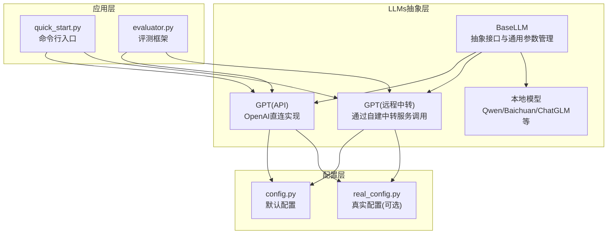
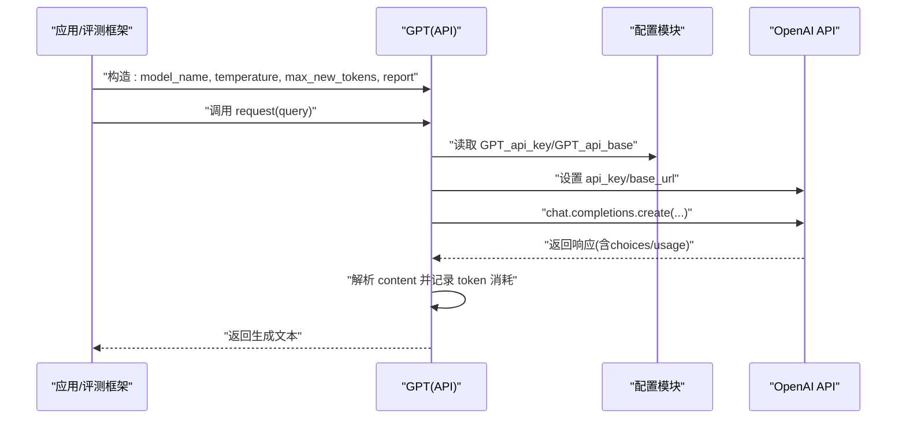
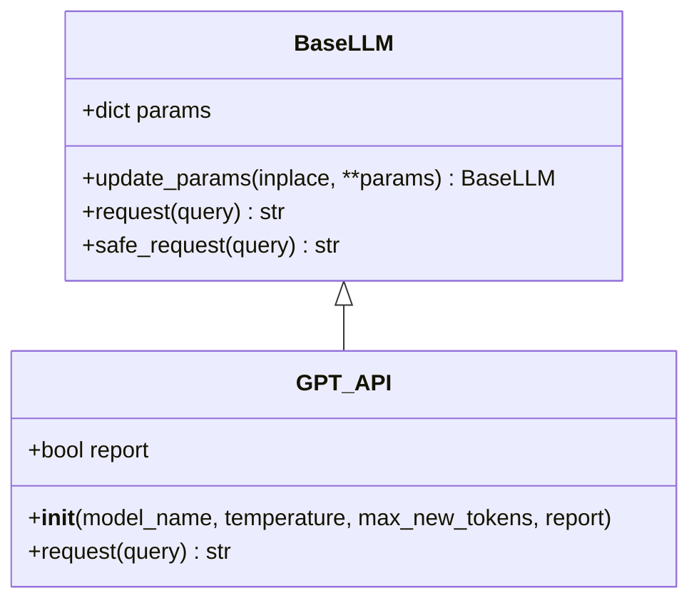
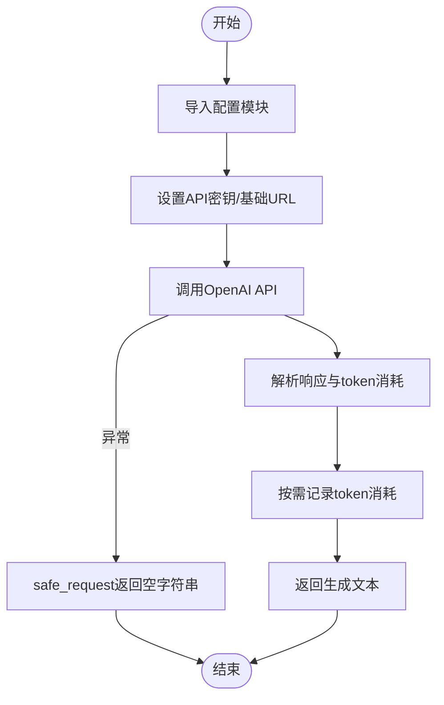
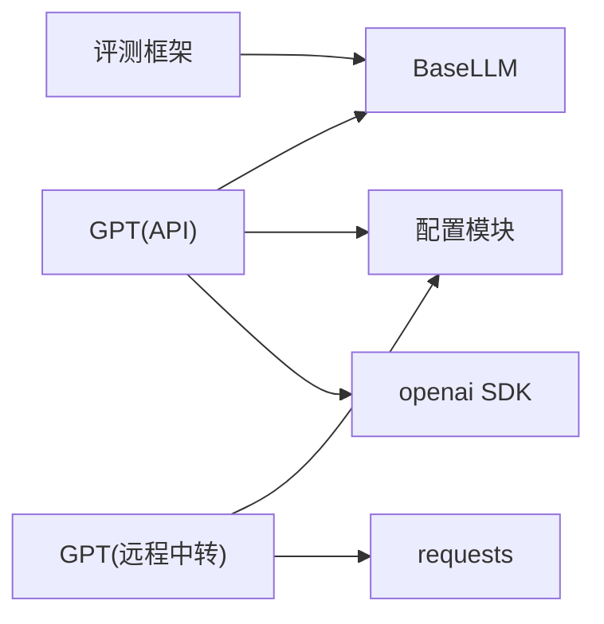

# GPT API模型

<cite>
**本文引用的文件**
- [api_model.py](file://src/llms/api_model.py)
- [base.py](file://src/llms/base.py)
- [config.py](file://src/configs/config.py)
- [__init__.py](file://src/llms/__init__.py)
- [remote_model.py](file://src/llms/remote_model.py)
- [local_model.py](file://src/llms/local_model.py)
- [quick_start.py](file://quick_start.py)
- [README.md](file://README.md)
- [evaluator.py](file://evaluator.py)
</cite>

## 目录
1. [简介](#简介)
2. [项目结构](#项目结构)
3. [核心组件](#核心组件)
4. [架构总览](#架构总览)
5. [详细组件分析](#详细组件分析)
6. [依赖关系分析](#依赖关系分析)
7. [性能考虑](#性能考虑)
8. [故障排除指南](#故障排除指南)
9. [结论](#结论)
10. [附录](#附录)

## 简介
本文件面向开发者，系统化地说明GPT API模型的使用方式与实现细节，覆盖以下主题：
- GPT类的构造函数参数、初始化过程与配置方法
- request方法的调用流程、参数传递与响应处理
- OpenAI API密钥配置、基础URL设置与认证机制
- 温度参数、最大新令牌数、top_p等模型参数的作用与设置方法
- 完整的API调用示例与错误处理策略
- token消耗统计与日志记录功能
- 集成最佳实践与常见问题排查

## 项目结构
该项目采用模块化分层设计，LLM抽象层位于src/llms目录，配置信息位于src/configs，入口脚本位于根目录。与GPT API相关的文件包括：
- 抽象基类：src/llms/base.py
- OpenAI直连实现：src/llms/api_model.py
- 远程中转实现：src/llms/remote_model.py
- 配置文件：src/configs/config.py
- 模块导出与条件加载：src/llms/__init__.py
- 快速开始示例：quick_start.py
- 评测框架：evaluator.py

图表来源
- [base.py:6-47](file://src/llms/base.py#L6-L47)
- [api_model.py:12-32](file://src/llms/api_model.py#L12-L32)
- [remote_model.py:83-110](file://src/llms/remote_model.py#L83-L110)
- [config.py:1-14](file://src/configs/config.py#L1-L14)
- [__init__.py:1-12](file://src/llms/__init__.py#L1-L12)
- [quick_start.py:54-57](file://quick_start.py#L54-L57)
- [evaluator.py:14-40](file://evaluator.py#L14-L40)

章节来源
- [README.md:40-67](file://README.md#L40-L67)
- [base.py:6-47](file://src/llms/base.py#L6-L47)
- [api_model.py:12-32](file://src/llms/api_model.py#L12-L32)
- [remote_model.py:83-110](file://src/llms/remote_model.py#L83-L110)
- [config.py:1-14](file://src/configs/config.py#L1-L14)
- [__init__.py:1-12](file://src/llms/__init__.py#L1-L12)
- [quick_start.py:54-57](file://quick_start.py#L54-L57)
- [evaluator.py:14-40](file://evaluator.py#L14-L40)

## 核心组件
本节聚焦GPT类（OpenAI直连）与抽象基类BaseLLM，说明其职责、参数与行为。

- BaseLLM
  - 负责统一管理模型参数字典params，支持更新参数的inplace与非inplace两种模式
  - 提供安全请求方法safe_request，捕获异常并返回空字符串，便于上层容错
  - 定义抽象方法request，具体实现由子类提供

- GPT(API)
  - 继承BaseLLM，构造时接收model_name、temperature、max_new_tokens、report等参数
  - 初始化时将report标志保存到实例，用于控制token消耗日志输出
  - request方法负责：
    - 从配置模块读取API密钥与基础URL
    - 设置openai.api_key与openai.base_url
    - 调用openai.chat.completions.create发起请求
    - 解析响应内容choices[0].message.content
    - 记录usage.total_tokens并按需打印日志

章节来源
- [base.py:6-47](file://src/llms/base.py#L6-L47)
- [api_model.py:12-32](file://src/llms/api_model.py#L12-L32)

## 架构总览
下图展示GPT API调用在运行时的关键交互路径，包括配置加载、参数传递与响应解析。

图表来源
- [api_model.py:17-32](file://src/llms/api_model.py#L17-L32)
- [config.py:1-14](file://src/configs/config.py#L1-L14)
- [base.py:38-45](file://src/llms/base.py#L38-L45)

## 详细组件分析

### GPT类（OpenAI直连）
- 构造函数参数
  - model_name: 字符串，默认值来自基类；用于指定OpenAI模型名称
  - temperature: 浮点数，默认1.0；控制生成随机性
  - max_new_tokens: 整数，默认1024；限制最大新生成token数量
  - report: 布尔值，默认False；是否打印token消耗日志
- 初始化过程
  - 调用父类构造，将上述参数写入self.params
  - 保存report标志
- request方法
  - 从配置模块导入真实配置或回退到默认配置
  - 设置openai.api_key与openai.base_url（若配置了基础URL）
  - 调用openai.chat.completions.create，传入model、messages、temperature、max_tokens、top_p
  - 解析choices[0].message.content作为结果
  - 读取usage.total_tokens并按report标志输出日志
  - 返回生成文本

图表来源
- [base.py:6-47](file://src/llms/base.py#L6-L47)
- [api_model.py:12-32](file://src/llms/api_model.py#L12-L32)

章节来源
- [api_model.py:12-32](file://src/llms/api_model.py#L12-L32)
- [base.py:6-47](file://src/llms/base.py#L6-L47)

### 参数与配置详解
- 模型参数
  - model_name：OpenAI模型标识，如"gpt-3.5-turbo"
  - temperature：采样温度，越低越确定，越高越发散
  - max_new_tokens：最大新生成token数
  - top_p：核采样概率质量阈值，与top_k共同影响采样多样性
  - top_k：候选采样数量上限
  - 其他参数可通过**more_params传入并存储在params中
- 配置项
  - GPT_api_key：OpenAI API密钥
  - GPT_api_base：OpenAI基础URL（可选），用于替换默认端点
  - GPT_transit_url/token/user：当未配置API Key时，可使用远程中转服务
- 加载逻辑
  - 优先尝试加载真实配置real_config.py；若不存在则回退到默认config.py
  - 在__init__与request中均会动态导入配置模块

章节来源
- [base.py:7-23](file://src/llms/base.py#L7-L23)
- [api_model.py:7-10](file://src/llms/api_model.py#L7-L10)
- [api_model.py:17-27](file://src/llms/api_model.py#L17-L27)
- [config.py:1-14](file://src/configs/config.py#L1-L14)
- [__init__.py:1-12](file://src/llms/__init__.py#L1-L12)

### 调用流程与错误处理
- 调用流程
  - 应用层通过quick_start.py或评测框架调用GPT实例
  - GPT.request执行配置读取、参数设置、API调用与响应解析
  - 使用BaseLLM.safe_request可自动捕获异常并返回空字符串
- 错误处理策略
  - 在BaseLLM.safe_request中捕获异常并记录warning日志
  - 评测框架evaluator.py在多线程场景中对异常进行捕获与跳过
  - 若使用远程中转实现，可在网络层增加重试与超时策略（建议）

图表来源
- [api_model.py:17-32](file://src/llms/api_model.py#L17-L32)
- [base.py:38-45](file://src/llms/base.py#L38-L45)
- [evaluator.py:76-100](file://evaluator.py#L76-L100)

章节来源
- [base.py:38-45](file://src/llms/base.py#L38-L45)
- [evaluator.py:76-100](file://evaluator.py#L76-L100)

### 远程中转实现对比
当未配置GPT_api_key时，系统会加载远程中转实现（remote_model.py中的GPT）。其与API直连实现的主要差异：
- 请求方式：通过HTTP POST调用自建中转服务
- 认证：使用token与User-Agent头
- 响应解析：从JSON中提取choices[0].message.content与usage.total_tokens

章节来源
- [remote_model.py:83-110](file://src/llms/remote_model.py#L83-L110)
- [__init__.py:7-10](file://src/llms/__init__.py#L7-L10)

### 本地模型实现（参考）
虽然本节重点是GPT API，但为完整性提供本地模型的参数参考：
- 本地模型类（如Qwen_7B_Chat）通过transformers加载本地权重
- 生成参数包括temperature、max_new_tokens、top_p、top_k
- 适用于离线部署与隐私保护场景

章节来源
- [local_model.py:11-33](file://src/llms/local_model.py#L11-L33)

## 依赖关系分析
- 组件耦合
  - GPT(API)与BaseLLM强耦合（继承关系）
  - GPT与配置模块弱耦合（运行时动态导入）
  - 评测框架与GPT通过BaseLLM接口解耦
- 外部依赖
  - openai SDK用于直连调用
  - requests用于远程中转调用
  - loguru用于日志记录
- 可能的循环依赖
  - 当前结构清晰，未发现循环导入

图表来源
- [api_model.py:1-5](file://src/llms/api_model.py#L1-L5)
- [remote_model.py:1-6](file://src/llms/remote_model.py#L1-L6)
- [evaluator.py:8-11](file://evaluator.py#L8-L11)

章节来源
- [api_model.py:1-5](file://src/llms/api_model.py#L1-L5)
- [remote_model.py:1-6](file://src/llms/remote_model.py#L1-L6)
- [evaluator.py:8-11](file://evaluator.py#L8-L11)

## 性能考虑
- 并发与吞吐
  - 评测框架使用ThreadPoolExecutor并发处理数据点，建议根据API速率限制调整线程数
  - 对于高并发场景，建议在GPT.request外层增加限流与重试
- Token消耗
  - 响应中包含usage.total_tokens，可用于成本估算与配额监控
  - 合理设置temperature与max_new_tokens以平衡质量与成本
- 日志与可观测性
  - report=True时打印token消耗，便于调试与成本追踪
  - 建议结合更细粒度的日志级别与指标上报

## 故障排除指南
- 无法连接OpenAI
  - 检查GPT_api_key是否正确设置
  - 如需代理或自定义端点，设置GPT_api_base
- 请求失败
  - 使用BaseLLM.safe_request包裹调用，避免异常中断
  - 评测框架已内置异常捕获，确认日志中warning信息
- 远程中转不可用
  - 确认GPT_transit_url/token/user配置正确
  - 检查网络连通性与服务端状态
- 输出为空
  - 检查temperature与max_new_tokens设置
  - 确认输入query格式与长度符合要求

章节来源
- [base.py:38-45](file://src/llms/base.py#L38-L45)
- [evaluator.py:76-100](file://evaluator.py#L76-L100)
- [remote_model.py:88-110](file://src/llms/remote_model.py#L88-L110)

## 结论
GPT API模型通过抽象基类与条件加载机制，提供了灵活的OpenAI直连与远程中转两种调用方式。开发者只需关注参数配置与调用流程，即可快速集成到评测与应用系统中。建议在生产环境中配合限流、重试与日志监控，确保稳定性与可观测性。

## 附录

### API调用示例（命令行）
- 使用quick_start.py启动评测，选择GPT模型并设置参数
- 示例参数包括model_name、temperature、max_new_tokens等

章节来源
- [quick_start.py:54-57](file://quick_start.py#L54-L57)
- [README.md:87-105](file://README.md#L87-L105)

### 配置文件说明
- 默认配置项
  - GPT_api_key：OpenAI API密钥
  - GPT_api_base：OpenAI基础URL
  - GPT_transit_url/token/user：远程中转服务配置
- 加载顺序
  - 优先加载real_config.py，不存在则回退到config.py

章节来源
- [config.py:1-14](file://src/configs/config.py#L1-L14)
- [__init__.py:1-12](file://src/llms/__init__.py#L1-L12)