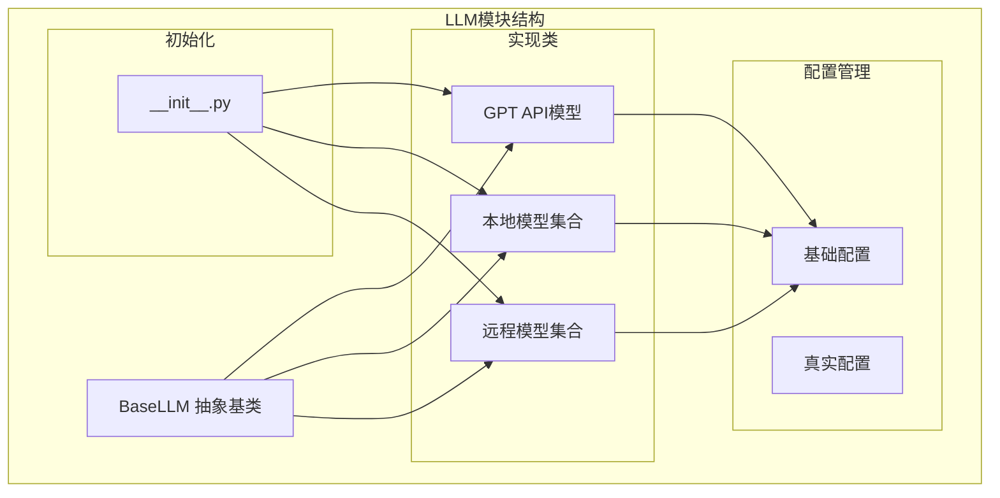
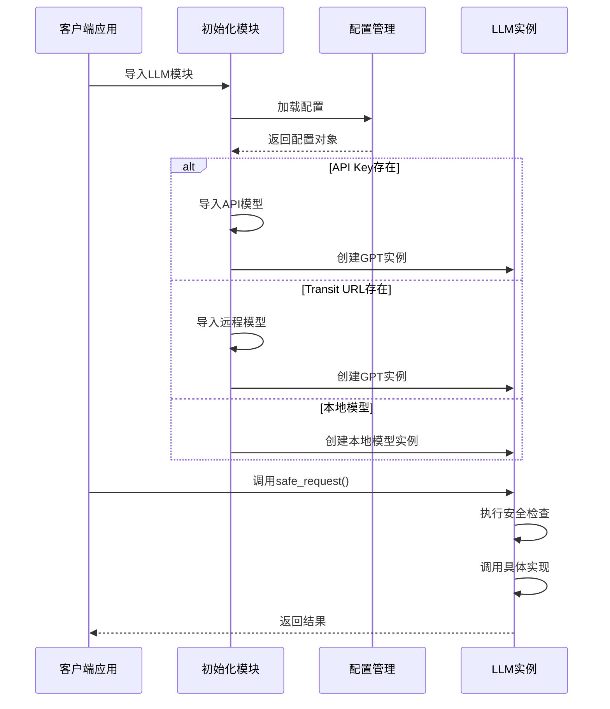
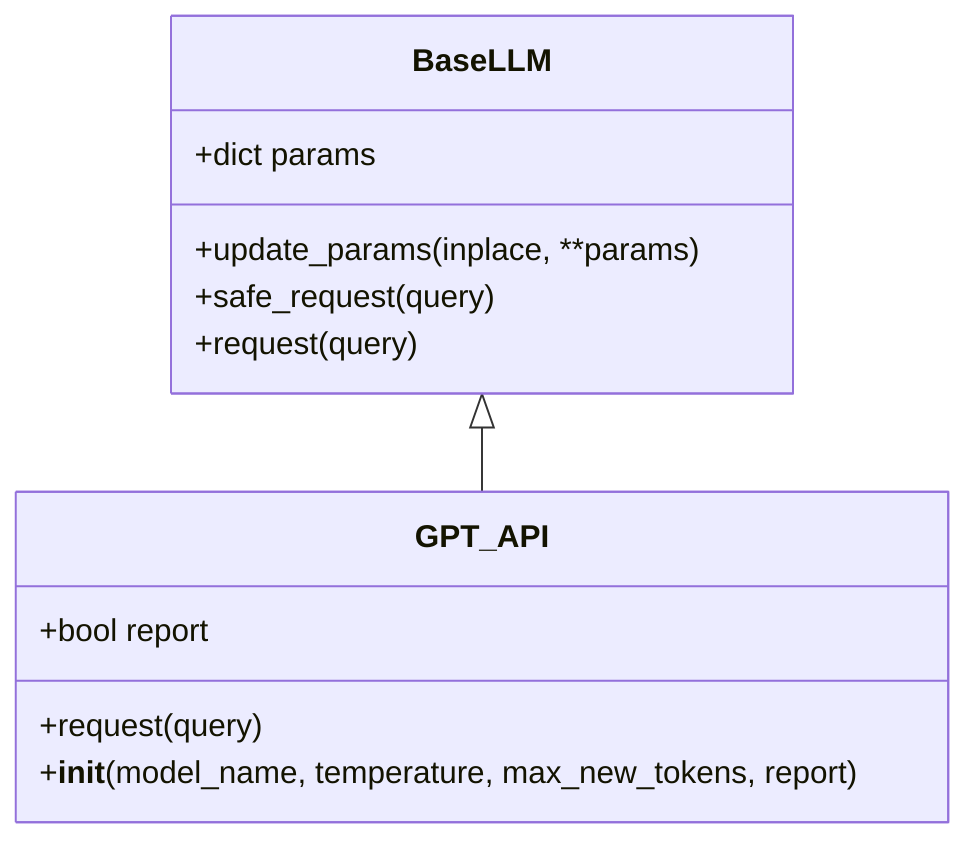
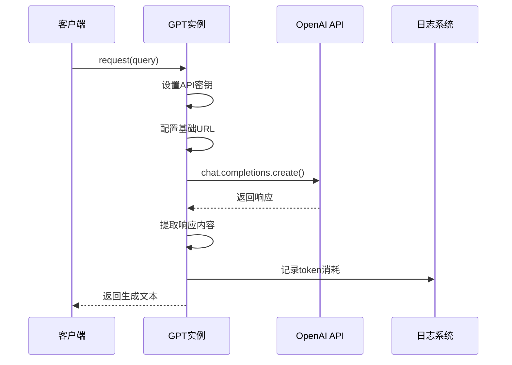
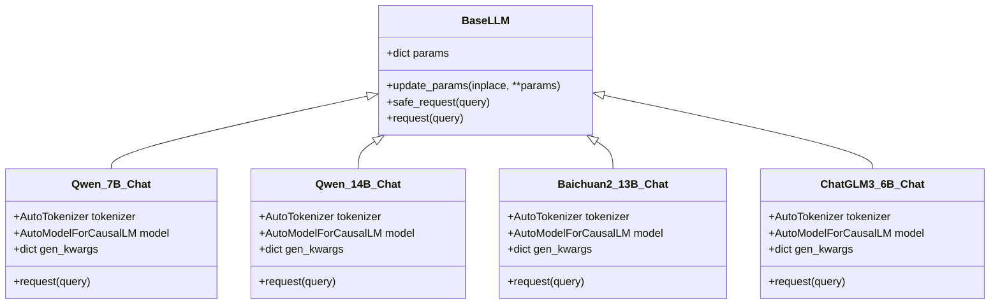
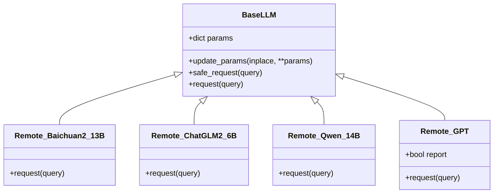
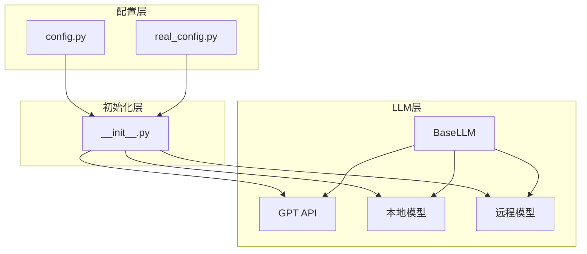
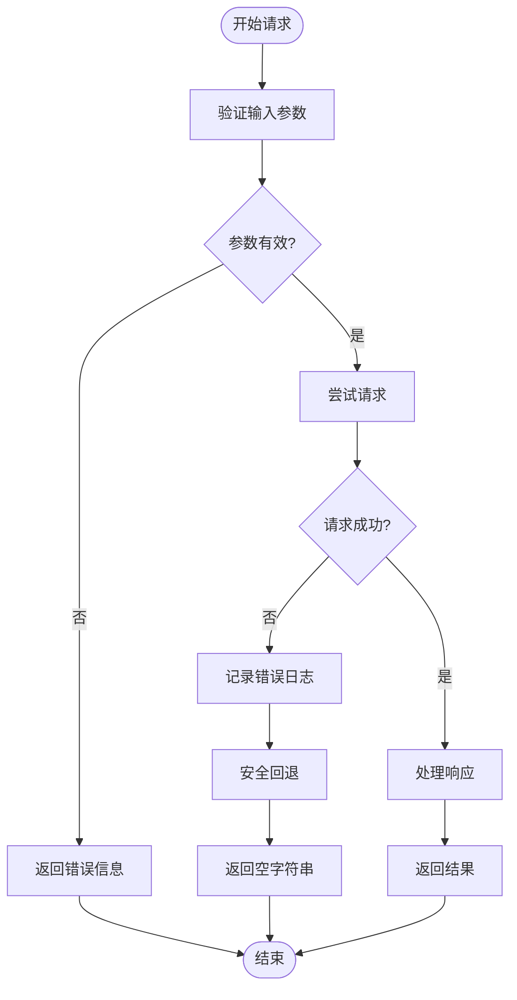

# LLM实现API

<cite>
**本文档引用的文件**
- [src/llms/base.py](file://src/llms/base.py)
- [src/llms/api_model.py](file://src/llms/api_model.py)
- [src/llms/local_model.py](file://src/llms/local_model.py)
- [src/llms/remote_model.py](file://src/llms/remote_model.py)
- [src/llms/__init__.py](file://src/llms/__init__.py)
- [src/configs/config.py](file://src/configs/config.py)
- [quick_start.py](file://quick_start.py)
- [README.md](file://README.md)
</cite>

## 目录
1. [简介](#简介)
2. [项目结构](#项目结构)
3. [核心组件](#核心组件)
4. [架构概览](#架构概览)
5. [详细组件分析](#详细组件分析)
6. [依赖关系分析](#依赖关系分析)
7. [性能考虑](#性能考虑)
8. [故障排除指南](#故障排除指南)
9. [结论](#结论)
10. [附录](#附录)

## 简介

本文件提供了CRUD-RAG项目中LLM（大语言模型）实现类的完整API文档。该系统支持三种不同的LLM实现方式：本地部署模型、远程API调用模型和OpenAI官方API模型。每个实现都遵循统一的抽象基类接口，确保了代码的一致性和可扩展性。

系统的核心设计目标是为不同场景下的LLM集成提供灵活的解决方案，包括：
- 本地GPU推理：适用于隐私敏感或离线场景
- 远程API服务：适用于云部署或第三方服务
- OpenAI官方API：适用于标准的云端推理服务

## 项目结构

CRUD-RAG项目的LLM相关文件组织结构如下：



**图表来源**
- [src/llms/base.py:1-47](file://src/llms/base.py#L1-L47)
- [src/llms/api_model.py:1-33](file://src/llms/api_model.py#L1-L33)
- [src/llms/local_model.py:1-114](file://src/llms/local_model.py#L1-L114)
- [src/llms/remote_model.py:1-111](file://src/llms/remote_model.py#L1-L111)

**章节来源**
- [src/llms/base.py:1-47](file://src/llms/base.py#L1-L47)
- [src/llms/__init__.py:1-13](file://src/llms/__init__.py#L1-L13)

## 核心组件

### BaseLLM 抽象基类

BaseLLM是所有LLM实现的基础抽象类，定义了统一的接口规范和通用功能：

**核心特性：**
- 统一的参数管理系统
- 安全请求机制
- 可扩展的实现接口

**主要参数：**
- `model_name`: 模型名称，默认为"gpt-3.5-turbo"
- `temperature`: 采样温度，控制输出随机性
- `max_new_tokens`: 最大生成token数
- `top_p`: 核采样概率阈值
- `top_k`: 采样候选数量

**关键方法：**
- `request()`: 抽象方法，子类必须实现
- `update_params()`: 参数更新机制
- `safe_request()`: 异常安全的请求包装

**章节来源**
- [src/llms/base.py:6-47](file://src/llms/base.py#L6-L47)

## 架构概览

系统采用分层架构设计，通过抽象基类统一接口，通过配置文件实现运行时选择：



**图表来源**
- [src/llms/__init__.py:7-12](file://src/llms/__init__.py#L7-L12)
- [src/llms/base.py:38-46](file://src/llms/base.py#L38-L46)

## 详细组件分析

### API模型实现 (GPT)

API模型通过OpenAI官方API进行推理，适用于云端推理场景。

#### 类结构图



**图表来源**
- [src/llms/base.py:6-47](file://src/llms/base.py#L6-L47)
- [src/llms/api_model.py:12-32](file://src/llms/api_model.py#L12-L32)

#### 连接配置

**认证配置：**
- `GPT_api_key`: OpenAI API密钥
- `GPT_api_base`: 自定义API基础URL（可选）

**请求参数：**
- `model`: 指定使用的模型名称
- `messages`: 用户消息内容
- `temperature`: 采样温度
- `max_tokens`: 最大生成token数
- `top_p`: 核采样概率

#### 请求流程



**图表来源**
- [src/llms/api_model.py:17-32](file://src/llms/api_model.py#L17-L32)

**章节来源**
- [src/llms/api_model.py:12-32](file://src/llms/api_model.py#L12-L32)

### 本地模型实现

本地模型通过HuggingFace Transformers库直接在本地GPU上运行，适用于隐私保护和离线场景。

#### 支持的本地模型

系统支持以下本地部署模型：

| 模型名称 | 参数规模 | 特点 |
|---------|---------|------|
| Qwen_7B_Chat | 7B | 通义千问7B参数版本 |
| Qwen_14B_Chat | 14B | 通义千问14B参数版本 |
| Baichuan2_13B_Chat | 13B | 百川2 13B参数版本 |
| ChatGLM3_6B_Chat | 6B | ChatGLM3 6B参数版本 |

#### 类结构图



**图表来源**
- [src/llms/base.py:6-47](file://src/llms/base.py#L6-L47)
- [src/llms/local_model.py:11-114](file://src/llms/local_model.py#L11-L114)

#### 配置要求

**本地路径配置：**
- `Qwen_7B_local_path`: Qwen7B模型本地路径
- `Qwen_14B_local_path`: Qwen14B模型本地路径
- `Baichuan2_13b_local_path`: Baichuan2_13B模型本地路径
- `ChatGLM3_local_path`: ChatGLM3模型本地路径

#### 性能优化

**GPU加速配置：**
- 自动设备映射 (`device_map="auto"`)
- BF16精度支持 (部分模型)
- CUDA加速支持

**生成参数：**
- 温度控制 (`temperature`)
- 核采样 (`top_p`)
- 精英采样 (`top_k`)
- 最大生成长度 (`max_new_tokens`)

**章节来源**
- [src/llms/local_model.py:11-114](file://src/llms/local_model.py#L11-L114)

### 远程模型实现

远程模型通过HTTP API调用远程部署的服务，适用于云服务或自建API网关场景。

#### 支持的远程模型

| 模型名称 | 服务端点 | 认证方式 |
|---------|---------|---------|
| Baichuan2_13B_Chat | `conf.Baichuan2_13B_url` | Token认证 |
| ChatGLM2_6B_Chat | `conf.ChatGLM2_url` | Token认证 |
| Qwen_14B_Chat | `conf.Qwen_url` | Token认证 |
| GPT | `conf.GPT_transit_url` | 多重认证头 |

#### 类结构图



**图表来源**
- [src/llms/base.py:6-47](file://src/llms/base.py#L6-L47)
- [src/llms/remote_model.py:14-111](file://src/llms/remote_model.py#L14-L111)

#### 远程调用参数

**请求负载结构：**
```json
{
  "prompt": "用户查询内容",
  "params": {
    "temperature": 1.0,
    "do_sample": true,
    "max_new_tokens": 1024,
    "num_return_sequences": 1,
    "top_p": 0.9,
    "top_k": 5
  }
}
```

**认证头部：**
- `token`: 服务访问令牌
- `Content-Type`: `application/json`
- `User-Agent`: 自定义用户代理（GPT特有）

#### 响应格式

**标准响应结构：**
```json
{
  "choices": [
    {
      "text": "生成的文本内容"
    }
  ]
}
```

**GPT特有响应：**
```json
{
  "choices": [
    {
      "message": {
        "content": "生成的文本内容"
      }
    }
  ],
  "usage": {
    "total_tokens": 150
  }
}
```

**章节来源**
- [src/llms/remote_model.py:14-111](file://src/llms/remote_model.py#L14-L111)

## 依赖关系分析

系统通过配置驱动的方式实现模块间的解耦：



**图表来源**
- [src/llms/__init__.py:1-13](file://src/llms/__init__.py#L1-L13)
- [src/configs/config.py:1-14](file://src/configs/config.py#L1-L14)

**章节来源**
- [src/llms/__init__.py:1-13](file://src/llms/__init__.py#L1-L13)
- [src/configs/config.py:1-14](file://src/configs/config.py#L1-L14)

## 性能考虑

### 内存管理

**本地模型内存优化：**
- GPU自动分配 (`device_map="auto"`)
- 模型量化支持 (BF16精度)
- 批量推理优化

**远程模型网络优化：**
- 连接复用
- 超时配置
- 重试机制

### 并发处理

**线程安全：**
- 参数副本机制
- 线程局部状态
- 异步调用支持

### 缓存策略

**响应缓存：**
- 相同查询去重
- LRU缓存淘汰
- 持久化存储

## 故障排除指南

### 常见问题诊断

**配置错误：**
- API密钥无效
- 本地路径不存在
- 网络连接超时

**性能问题：**
- GPU内存不足
- 网络延迟过高
- 模型加载失败

**章节来源**
- [src/llms/base.py:38-46](file://src/llms/base.py#L38-L46)

### 错误处理机制

系统提供了多层次的错误处理：



**图表来源**
- [src/llms/base.py:38-46](file://src/llms/base.py#L38-L46)

## 结论

CRUD-RAG项目的LLM实现提供了完整的多模式支持，满足了从本地部署到云端服务的各种使用场景。通过统一的抽象接口和灵活的配置机制，开发者可以轻松地在不同模型类型之间切换，并根据具体需求进行性能优化。

**主要优势：**
- 统一的API接口设计
- 灵活的配置管理
- 完善的错误处理机制
- 良好的性能优化支持

**适用场景：**
- 私有化部署的本地推理
- 云服务的远程API调用
- 标准化的OpenAI兼容接口

## 附录

### 使用示例

**基本使用：**
```python
# 导入模型
from src.llms import GPT, Qwen_7B_Chat

# 创建GPT实例
gpt = GPT(model_name='gpt-3.5-turbo', temperature=0.7, max_new_tokens=1024)

# 创建本地模型实例
local_model = Qwen_7B_Chat(model_name='qwen_7b', temperature=0.1, max_new_tokens=512)

# 安全请求
response = gpt.safe_request("你好，请介绍一下自己")
```

**参数更新：**
```python
# 就地更新
gpt.update_params(temperature=0.5, max_new_tokens=2048)

# 创建新实例
new_gpt = gpt.update_params(inplace=False, temperature=0.8)
```

### 配置文件示例

**基础配置：**
```python
# OpenAI API配置
GPT_api_key = 'your-api-key'
GPT_api_base = 'https://api.openai.com'

# 远程服务配置
GPT_transit_url = 'https://api.example.com/v1/chat'
GPT_transit_token = 'service-token'
GPT_transit_user = 'custom-user-agent'

# 本地模型路径
Qwen_7B_local_path = '/path/to/qwen7b'
Qwen_14B_local_path = '/path/to/qwen14b'
Baichuan2_13b_local_path = '/path/to/baichuan2'
ChatGLM3_local_path = '/path/to/chatglm3'
```

**章节来源**
- [quick_start.py:54-58](file://quick_start.py#L54-L58)
- [src/configs/config.py:1-14](file://src/configs/config.py#L1-L14)