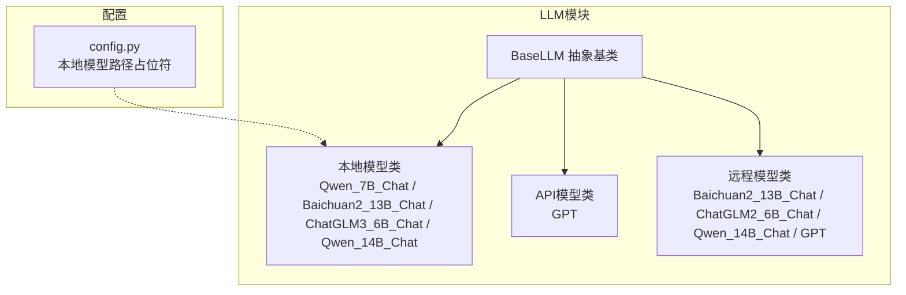
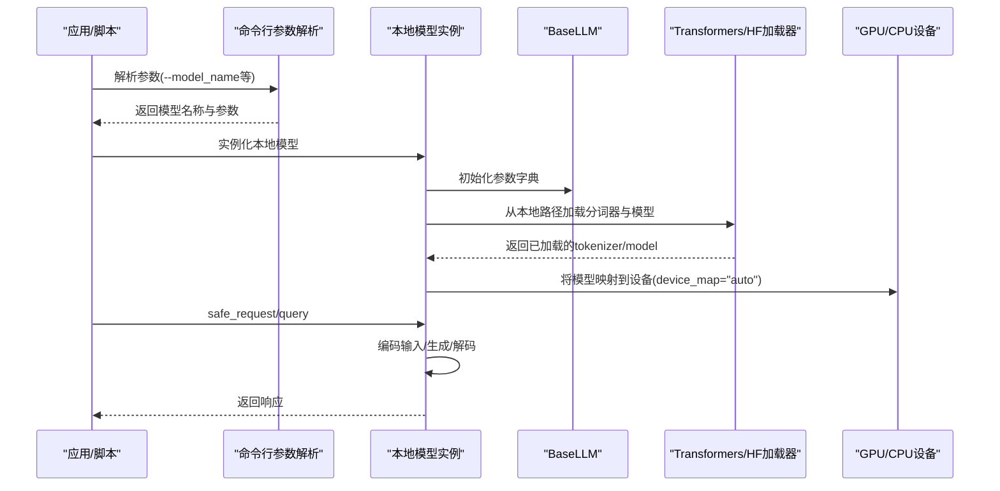
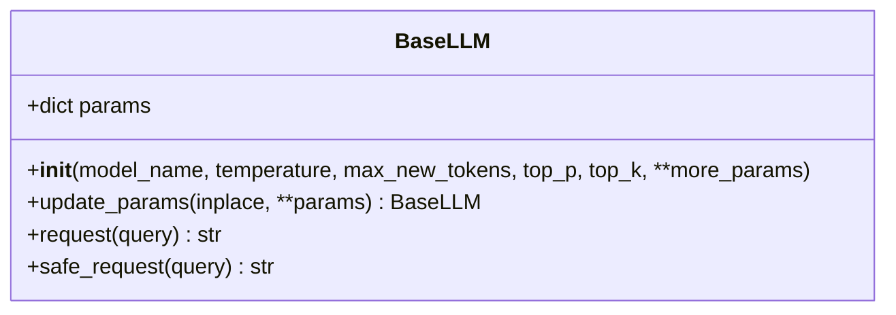
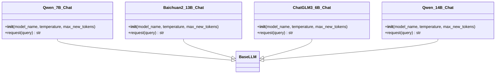
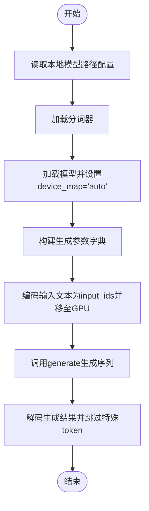
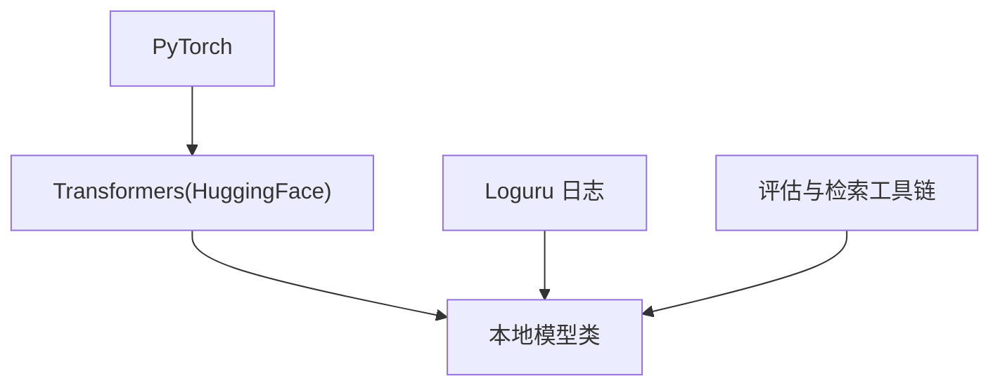

# 本地模型

<cite>
**本文引用的文件**
- [src/llms/local_model.py](file://src/llms/local_model.py)
- [src/llms/base.py](file://src/llms/base.py)
- [src/llms/api_model.py](file://src/llms/api_model.py)
- [src/llms/remote_model.py](file://src/llms/remote_model.py)
- [src/configs/config.py](file://src/configs/config.py)
- [quick_start.py](file://quick_start.py)
- [README.md](file://README.md)
- [requirements.txt](file://requirements.txt)
</cite>

## 目录
1. [简介](#简介)
2. [项目结构](#项目结构)
3. [核心组件](#核心组件)
4. [架构总览](#架构总览)
5. [详细组件分析](#详细组件分析)
6. [依赖分析](#依赖分析)
7. [性能考量](#性能考量)
8. [故障排查指南](#故障排查指南)
9. [结论](#结论)
10. [附录](#附录)

## 简介
本文件面向开发者，系统化梳理本地模型实现（LocalModel）的设计目的、适用场景、部署要求与使用方法。基于仓库中的本地模型类，文档覆盖以下主题：
- 设计目的：在本地设备上直接加载与运行大语言模型，避免网络请求与远程API调用，降低延迟与隐私风险。
- 适用场景：离线环境、内网部署、数据隐私敏感任务、低延迟推理需求。
- 部署要求：CUDA/GPU可用性、模型权重文件路径、Python依赖安装。
- 加载机制：通过AutoTokenizer与AutoModelForCausalLM从本地路径加载；device_map自动分配到GPU/CPU。
- 推理过程：编码输入文本、生成输出、解码响应。
- 资源管理：显存占用、批处理与并发控制建议。
- 与远程API模型的区别：本地模型无需网络，但需要本地硬件资源；远程模型无需本地资源但受网络与服务稳定性影响。
- 最佳实践：模型路径配置、参数调优、错误处理与日志记录。

## 项目结构
本地模型位于src/llms/local_model.py，继承自BaseLLM抽象基类，统一了温度、采样上限等参数，并提供安全请求封装。配置文件src/configs/config.py定义了各本地模型的权重路径占位符，实际部署时需在真实配置中填入有效路径。

图表来源
- [src/llms/local_model.py:11-114](file://src/llms/local_model.py#L11-L114)
- [src/llms/base.py:6-47](file://src/llms/base.py#L6-L47)
- [src/llms/api_model.py:12-33](file://src/llms/api_model.py#L12-L33)
- [src/llms/remote_model.py:14-111](file://src/llms/remote_model.py#L14-L111)
- [src/configs/config.py:11-14](file://src/configs/config.py#L11-L14)

章节来源
- [README.md:47-50](file://README.md#L47-L50)
- [src/llms/local_model.py:11-114](file://src/llms/local_model.py#L11-L114)
- [src/llms/base.py:6-47](file://src/llms/base.py#L6-L47)
- [src/configs/config.py:11-14](file://src/configs/config.py#L11-L14)

## 核心组件
- BaseLLM：定义统一的参数字典与安全请求接口，便于不同模型实现共享通用行为。
- 本地模型类族：Qwen_7B_Chat、Baichuan2_13B_Chat、ChatGLM3_6B_Chat、Qwen_14B_Chat，均继承BaseLLM，负责从本地路径加载分词器与模型，并执行生成推理。
- 配置：config.py提供本地模型权重路径占位符，实际部署时需在真实配置中填写。

章节来源
- [src/llms/base.py:6-47](file://src/llms/base.py#L6-L47)
- [src/llms/local_model.py:11-114](file://src/llms/local_model.py#L11-L114)
- [src/configs/config.py:11-14](file://src/configs/config.py#L11-L14)

## 架构总览
本地模型的调用流程如下：应用通过命令行或脚本选择本地模型实例，BaseLLM提供统一的参数与安全请求封装，具体模型类负责加载本地权重并进行推理。

图表来源
- [quick_start.py:54-57](file://quick_start.py#L54-L57)
- [src/llms/local_model.py:11-114](file://src/llms/local_model.py#L11-L114)
- [src/llms/base.py:25-47](file://src/llms/base.py#L25-L47)

## 详细组件分析

### BaseLLM 抽象基类
- 参数管理：构造函数接收模型名、温度、最大新词数、top-p、top-k等参数，保存在params字典中；update_params支持原地或深拷贝更新。
- 安全请求：safe_request包装request，捕获异常并返回空字符串，便于上层容错。
- 抽象接口：request为子类必须实现的方法。

图表来源
- [src/llms/base.py:6-47](file://src/llms/base.py#L6-L47)

章节来源
- [src/llms/base.py:6-47](file://src/llms/base.py#L6-L47)

### 本地模型类族（Qwen_7B_Chat / Baichuan2_13B_Chat / ChatGLM3_6B_Chat / Qwen_14B_Chat）
- 继承关系：均继承BaseLLM，复用参数管理与安全请求能力。
- 加载机制：
  - 从配置读取本地权重路径。
  - 使用AutoTokenizer.from_pretrained加载分词器（部分模型禁用fast tokenizer）。
  - 使用AutoModelForCausalLM.from_pretrained加载模型，device_map="auto"自动分配到可用设备。
  - 部分模型使用bfloat16以节省显存。
- 推理过程：
  - 编码输入文本为input_ids并移动到GPU。
  - 调用model.generate按gen_kwargs生成序列。
  - 解码生成结果，跳过特殊token。
- 参数字典：包含temperature、do_sample、max_new_tokens、top_p、top_k等。

图表来源
- [src/llms/local_model.py:11-114](file://src/llms/local_model.py#L11-L114)
- [src/llms/base.py:6-47](file://src/llms/base.py#L6-L47)

章节来源
- [src/llms/local_model.py:11-114](file://src/llms/local_model.py#L11-L114)

### 模型加载与推理流程图

图表来源
- [src/llms/local_model.py:14-25](file://src/llms/local_model.py#L14-L25)
- [src/llms/local_model.py:27-33](file://src/llms/local_model.py#L27-L33)
- [src/llms/local_model.py:39-53](file://src/llms/local_model.py#L39-L53)
- [src/llms/local_model.py:55-60](file://src/llms/local_model.py#L55-L60)
- [src/llms/local_model.py:66-80](file://src/llms/local_model.py#L66-L80)
- [src/llms/local_model.py:82-87](file://src/llms/local_model.py#L82-L87)
- [src/llms/local_model.py:93-104](file://src/llms/local_model.py#L93-L104)
- [src/llms/local_model.py:106-112](file://src/llms/local_model.py#L106-L112)

## 依赖分析
- Python依赖：torch、transformers等用于模型加载与推理；loguru用于日志；llama_index、langchain、milvus等用于检索与评估流水线。
- 运行时依赖：CUDA驱动与GPU显存，device_map="auto"可自动分配到GPU；若无GPU则回退到CPU。
- 配置依赖：本地模型路径需在配置中正确填写，否则加载失败。

图表来源
- [requirements.txt:1-13](file://requirements.txt#L1-L13)
- [src/llms/local_model.py:1-3](file://src/llms/local_model.py#L1-L3)

章节来源
- [requirements.txt:1-13](file://requirements.txt#L1-L13)
- [src/llms/local_model.py:1-3](file://src/llms/local_model.py#L1-L3)

## 性能考量
- 显存占用：大模型（如Qwen_14B、Baichuan2_13B）对显存要求较高，建议使用bfloat16以降低显存占用；确保GPU显存充足。
- 推理速度：device_map="auto"可利用多卡或GPU加速；若显存不足，可考虑降低max_new_tokens或batch_size。
- 批处理与并发：本地模型未内置批处理逻辑，建议在上层调用处控制并发度，避免显存溢出。
- 输入长度：长上下文会显著增加显存与时间开销，合理设置max_new_tokens与输入长度。
- 硬件加速：优先使用CUDA/GPU；若无GPU，device_map仍可工作，但速度较慢。

## 故障排查指南
- 无法加载模型：检查本地权重路径是否正确填写；确认transformers版本兼容；确保trust_remote_code为True。
- 显存不足：尝试降低max_new_tokens、使用bfloat16、减少并发；必要时切换更小模型。
- CUDA不可用：device_map会自动回退到CPU；若出现OOM，建议关闭模型或减少批大小。
- 安全请求：safe_request会在异常时记录警告并返回空字符串，便于定位问题。

章节来源
- [src/llms/base.py:38-47](file://src/llms/base.py#L38-L47)
- [src/llms/local_model.py:17-18](file://src/llms/local_model.py#L17-L18)
- [src/llms/local_model.py:45-46](file://src/llms/local_model.py#L45-L46)

## 结论
本地模型通过统一的BaseLLM接口与具体的模型类实现，提供了在本地设备上高效、可控的推理能力。其优势在于隐私保护、低延迟与离线可用；劣势在于对硬件资源要求高。结合合理的参数配置与资源管理策略，可在多种场景下稳定运行。

## 附录

### 部署与配置步骤
- 安装依赖：参考requirements.txt安装所需包。
- 准备模型权重：在config.py中填写各本地模型的权重路径占位符。
- 启动向量数据库：根据README指引启动Milvus服务。
- 运行示例：使用quick_start.py选择本地模型并执行评估流程。

章节来源
- [README.md:70-105](file://README.md#L70-L105)
- [quick_start.py:54-57](file://quick_start.py#L54-L57)
- [src/configs/config.py:11-14](file://src/configs/config.py#L11-L14)

### 与远程API模型的区别与选择标准
- 本地模型：无需网络，隐私与可控性强，但需本地硬件资源；适合离线、内网、高隐私场景。
- 远程API模型：无需本地资源，易于扩展，但受网络与服务稳定性影响；适合快速集成与弹性扩展场景。
- 选择标准：根据硬件条件、隐私要求、网络状况与性能目标综合权衡。

章节来源
- [src/llms/api_model.py:12-33](file://src/llms/api_model.py#L12-L33)
- [src/llms/remote_model.py:14-111](file://src/llms/remote_model.py#L14-L111)