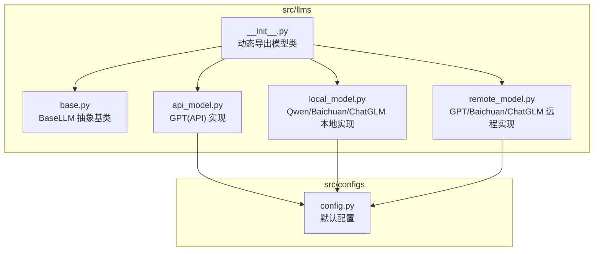
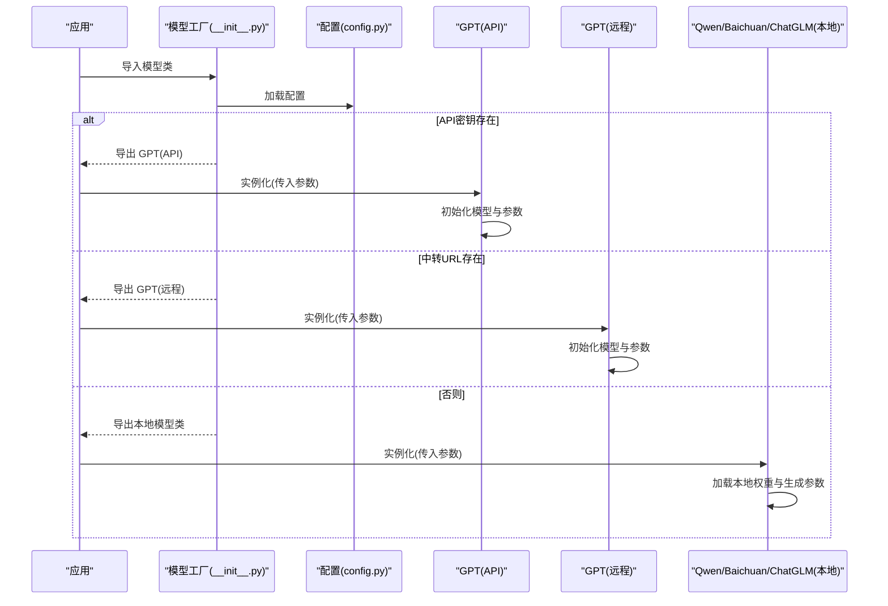
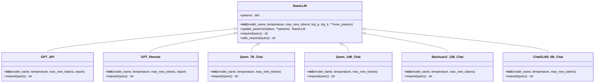
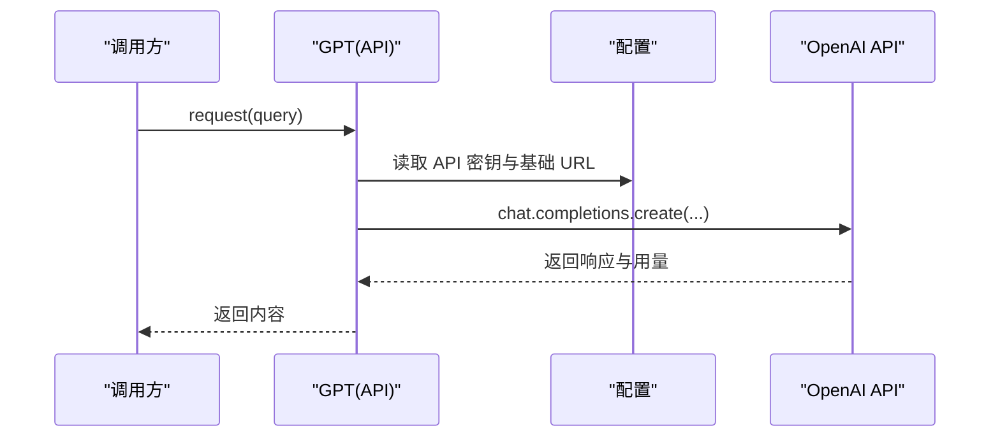
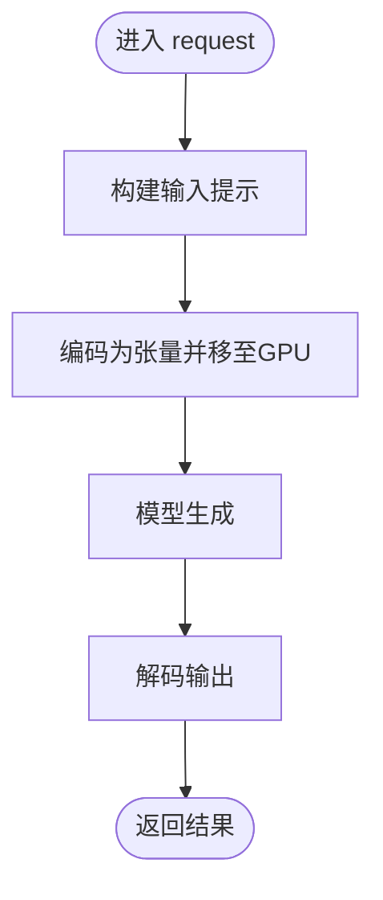
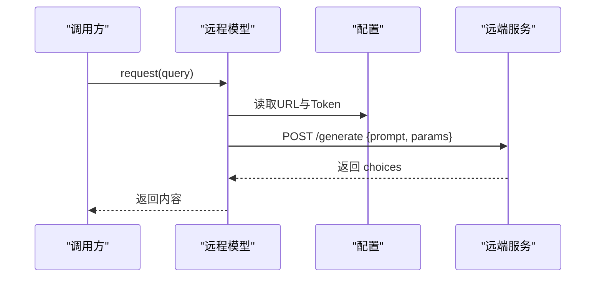
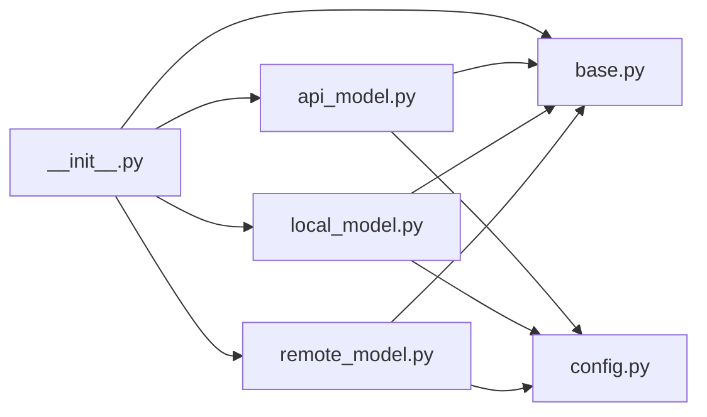

# 模型工厂与初始化

<cite>
**本文引用的文件**
- [src/llms/__init__.py](file://src/llms/__init__.py)
- [src/llms/base.py](file://src/llms/base.py)
- [src/llms/api_model.py](file://src/llms/api_model.py)
- [src/llms/local_model.py](file://src/llms/local_model.py)
- [src/llms/remote_model.py](file://src/llms/remote_model.py)
- [src/configs/config.py](file://src/configs/config.py)
- [quick_start.py](file://quick_start.py)
- [README.md](file://README.md)
</cite>

## 目录
1. [简介](#简介)
2. [项目结构](#项目结构)
3. [核心组件](#核心组件)
4. [架构总览](#架构总览)
5. [详细组件分析](#详细组件分析)
6. [依赖分析](#依赖分析)
7. [性能考虑](#性能考虑)
8. [故障排查指南](#故障排查指南)
9. [结论](#结论)
10. [附录](#附录)

## 简介
本文件聚焦于“模型工厂”与“初始化机制”的设计与实现，围绕以下目标展开：
- 解释 __init__.py 中的模型工厂设计模式与动态导入机制
- 详细记录 BaseLLM 抽象接口与继承规范
- 描述模型注册、实例化与生命周期管理流程
- 统一不同模型类型的接口设计与参数传递机制
- 提供模型工厂扩展方法与自定义模型集成指导
- 说明配置文件加载、环境变量处理与默认参数设置
- 为开发者提供模型系统架构的理解与自定义扩展的完整指南

## 项目结构
本项目的 LLM 子系统位于 src/llms 目录，包含统一的抽象基类与多种具体实现（本地、远程、API），并通过 __init__.py 实现按条件动态导出，形成“模型工厂”的外观与入口。

图表来源
- [src/llms/__init__.py:1-13](file://src/llms/__init__.py#L1-L13)
- [src/llms/base.py:1-47](file://src/llms/base.py#L1-L47)
- [src/llms/api_model.py:1-33](file://src/llms/api_model.py#L1-L33)
- [src/llms/local_model.py:1-114](file://src/llms/local_model.py#L1-L114)
- [src/llms/remote_model.py:1-111](file://src/llms/remote_model.py#L1-L111)
- [src/configs/config.py:1-14](file://src/configs/config.py#L1-L14)

章节来源
- [src/llms/__init__.py:1-13](file://src/llms/__init__.py#L1-L13)
- [src/llms/base.py:1-47](file://src/llms/base.py#L1-L47)
- [src/llms/api_model.py:1-33](file://src/llms/api_model.py#L1-L33)
- [src/llms/local_model.py:1-114](file://src/llms/local_model.py#L1-L114)
- [src/llms/remote_model.py:1-111](file://src/llms/remote_model.py#L1-L111)
- [src/configs/config.py:1-14](file://src/configs/config.py#L1-L14)

## 核心组件
- 模型工厂入口：通过 __init__.py 动态选择性导出模型类，依据配置决定使用 API、远程或本地模型。
- 抽象基类 BaseLLM：定义统一的初始化参数、参数更新策略、请求接口与安全请求封装。
- 具体实现：
  - API 模式：GPT（OpenAI Chat Completions）
  - 本地模式：Qwen_7B_Chat、Qwen_14B_Chat、Baichuan2_13B_Chat、ChatGLM3_6B_Chat
  - 远程模式：GPT、Baichuan2_13B_Chat、ChatGLM2_6B_Chat、Qwen_14B_Chat
- 配置模块：config.py 提供默认占位符，实际部署时可替换为 real_config 或通过环境变量注入。

章节来源
- [src/llms/__init__.py:1-13](file://src/llms/__init__.py#L1-L13)
- [src/llms/base.py:1-47](file://src/llms/base.py#L1-L47)
- [src/llms/api_model.py:1-33](file://src/llms/api_model.py#L1-L33)
- [src/llms/local_model.py:1-114](file://src/llms/local_model.py#L1-L114)
- [src/llms/remote_model.py:1-111](file://src/llms/remote_model.py#L1-L111)
- [src/configs/config.py:1-14](file://src/configs/config.py#L1-L14)

## 架构总览
模型工厂采用“条件导出 + 统一抽象”的架构：
- 条件导出：根据配置中的 API 密钥或中转 URL 决定导出 API 或远程模型；本地模型始终可用。
- 统一抽象：所有具体模型均继承 BaseLLM，确保一致的参数体系与请求接口。
- 生命周期：初始化阶段完成模型加载与参数绑定；运行期通过 request 接口进行推理；异常由 safe_request 处理。

图表来源
- [src/llms/__init__.py:1-13](file://src/llms/__init__.py#L1-L13)
- [src/llms/api_model.py:1-33](file://src/llms/api_model.py#L1-L33)
- [src/llms/remote_model.py:1-111](file://src/llms/remote_model.py#L1-L111)
- [src/llms/local_model.py:1-114](file://src/llms/local_model.py#L1-L114)
- [src/configs/config.py:1-14](file://src/configs/config.py#L1-L14)

## 详细组件分析

### 模型工厂与动态导入机制（__init__.py）
- 动态导入配置：优先尝试加载真实配置模块，失败回退到默认配置模块。
- 条件导出：
  - 若存在 API 密钥，则导出 API 版本的 GPT 类；
  - 若存在中转 URL，则导出远程版本的 GPT 类；
  - 无论何种条件，均导出本地模型类集合。
- 设计意义：在不修改上层调用代码的前提下，自动适配不同部署形态（API、远程、本地）。

章节来源
- [src/llms/__init__.py:1-13](file://src/llms/__init__.py#L1-L13)

### BaseLLM 抽象接口与继承规范
- 参数体系：
  - 统一构造函数接收模型名、温度、最大新 token 数、top-p、top-k，并支持额外关键字参数。
  - 所有参数保存在内部 params 字典中，便于集中管理与后续更新。
- 参数更新：
  - update_params 支持原地更新与深拷贝后返回新对象两种模式，满足链式调用与不可变配置场景。
- 请求接口：
  - request 为抽象方法，子类必须实现具体逻辑。
  - safe_request 对 request 调用进行异常捕获与日志记录，保证鲁棒性。
- 继承规范：
  - 子类需调用父类构造函数以继承参数体系；
  - 在子类 __init__ 中完成模型加载与生成参数绑定；
  - 在 request 中实现具体的推理逻辑并返回字符串结果。

图表来源
- [src/llms/base.py:1-47](file://src/llms/base.py#L1-L47)
- [src/llms/api_model.py:1-33](file://src/llms/api_model.py#L1-L33)
- [src/llms/remote_model.py:1-111](file://src/llms/remote_model.py#L1-L111)
- [src/llms/local_model.py:1-114](file://src/llms/local_model.py#L1-L114)

章节来源
- [src/llms/base.py:1-47](file://src/llms/base.py#L1-L47)

### API 模型（GPT）
- 初始化：继承 BaseLLM，保存 report 标志用于日志输出。
- 请求流程：
  - 从配置读取 API 密钥与基础 URL；
  - 使用 OpenAI Chat Completions 接口生成文本；
  - 记录消耗的 token 并按需输出日志。
- 参数映射：将 BaseLLM 的 params 字典映射到 OpenAI 的对应字段。

图表来源
- [src/llms/api_model.py:1-33](file://src/llms/api_model.py#L1-L33)
- [src/configs/config.py:1-14](file://src/configs/config.py#L1-L14)

章节来源
- [src/llms/api_model.py:1-33](file://src/llms/api_model.py#L1-L33)

### 本地模型（Qwen/Baichuan/ChatGLM）
- 初始化：
  - 从配置读取本地路径；
  - 使用 Transformers 加载分词器与模型；
  - 将 BaseLLM 的 params 映射为生成参数字典。
- 请求流程：
  - 将输入拼接为模型期望的格式；
  - 使用 generate 生成序列并解码返回。
- 注意事项：
  - 本地模型通常需要 GPU 支持；
  - 不同模型对输入格式可能略有差异（例如 Qwen 的系统提示）。

图表来源
- [src/llms/local_model.py:1-114](file://src/llms/local_model.py#L1-L114)

章节来源
- [src/llms/local_model.py:1-114](file://src/llms/local_model.py#L1-L114)

### 远程模型（GPT/Baichuan/ChatGLM/Qwen）
- 初始化：继承 BaseLLM，准备请求头与负载。
- 请求流程：
  - 构造 JSON 负载，包含 prompt 与生成参数；
  - 发送 POST 请求到配置中的 URL；
  - 解析响应并返回结果。
- 参数映射：将 BaseLLM 的 params 字典映射到远程服务的参数结构。

图表来源
- [src/llms/remote_model.py:1-111](file://src/llms/remote_model.py#L1-L111)
- [src/configs/config.py:1-14](file://src/configs/config.py#L1-L14)

章节来源
- [src/llms/remote_model.py:1-111](file://src/llms/remote_model.py#L1-L111)

### 配置文件加载与默认参数设置
- 配置加载：
  - __init__.py 优先尝试加载真实配置模块，失败则回退到默认配置模块；
  - 各模型实现同样遵循该策略，确保在不同环境下稳定运行。
- 默认参数：
  - BaseLLM 提供合理的默认值（如模型名、温度、最大新 token 数、top-p、top-k）；
  - 子类可在自身 __init__ 中覆盖或补充特定参数。
- 环境变量处理：
  - 当前实现直接从配置模块读取键值；
  - 建议在真实部署中通过环境变量注入配置模块，以避免硬编码。

章节来源
- [src/llms/__init__.py:1-13](file://src/llms/__init__.py#L1-L13)
- [src/llms/base.py:1-47](file://src/llms/base.py#L1-L47)
- [src/llms/api_model.py:1-33](file://src/llms/api_model.py#L1-L33)
- [src/llms/local_model.py:1-114](file://src/llms/local_model.py#L1-L114)
- [src/llms/remote_model.py:1-111](file://src/llms/remote_model.py#L1-L111)
- [src/configs/config.py:1-14](file://src/configs/config.py#L1-L14)

### 模型注册、实例化与生命周期管理
- 注册方式：通过 __init__.py 的条件导出实现“注册”，无需显式注册表。
- 实例化流程：
  - 上层调用方导入所需模型类；
  - 传入参数（包括 BaseLLM 的统一参数与子类特有参数）；
  - 子类在 __init__ 中完成模型加载与参数绑定。
- 生命周期：
  - 初始化阶段：加载权重、构建生成参数；
  - 运行阶段：request 执行推理；
  - 异常阶段：safe_request 捕获并记录错误。

章节来源
- [src/llms/__init__.py:1-13](file://src/llms/__init__.py#L1-L13)
- [src/llms/base.py:1-47](file://src/llms/base.py#L1-L47)
- [src/llms/api_model.py:1-33](file://src/llms/api_model.py#L1-L33)
- [src/llms/local_model.py:1-114](file://src/llms/local_model.py#L1-L114)
- [src/llms/remote_model.py:1-111](file://src/llms/remote_model.py#L1-L111)

### 统一接口设计与参数传递机制
- 统一接口：所有模型均实现 request(query) -> str，确保上层调用一致性。
- 参数传递：
  - BaseLLM 统一接收模型名、温度、最大新 token 数、top-p、top-k 及更多参数；
  - 子类将 params 字典映射到各自框架的参数键名；
  - update_params 支持运行时参数调整，满足不同任务需求。
- 安全请求：safe_request 包裹 request，避免异常中断流程。

章节来源
- [src/llms/base.py:1-47](file://src/llms/base.py#L1-L47)
- [src/llms/api_model.py:1-33](file://src/llms/api_model.py#L1-L33)
- [src/llms/local_model.py:1-114](file://src/llms/local_model.py#L1-L114)
- [src/llms/remote_model.py:1-111](file://src/llms/remote_model.py#L1-L111)

### 扩展方法与自定义模型集成指导
- 新增模型步骤：
  - 新建文件并在其中定义类，继承 BaseLLM；
  - 在 __init__ 中完成模型加载与生成参数绑定；
  - 在 request 中实现推理逻辑并返回字符串；
  - 在 __init__.py 中添加导出语句，使模型可被工厂识别。
- 参数约定：
  - 保持与 BaseLLM 相同的参数命名风格；
  - 如需额外参数，在子类 __init__ 中声明并写入 params。
- 配置接入：
  - 在配置模块中新增键值，供模型读取；
  - 若需环境变量注入，建议在真实配置模块中读取环境变量。
- 测试与验证：
  - 在 quick_start.py 中增加模型选择分支，验证集成效果；
  - 使用小规模数据集进行回归测试。

章节来源
- [src/llms/base.py:1-47](file://src/llms/base.py#L1-L47)
- [src/llms/__init__.py:1-13](file://src/llms/__init__.py#L1-L13)
- [quick_start.py:1-110](file://quick_start.py#L1-L110)

## 依赖分析
- 模块耦合：
  - __init__.py 仅依赖配置模块与各模型实现，耦合度低；
  - 各模型实现依赖 BaseLLM 与配置模块，形成清晰的层次。
- 外部依赖：
  - API 模型依赖 OpenAI SDK；
  - 本地模型依赖 Transformers 与 PyTorch；
  - 远程模型依赖 HTTP 客户端与 JSON 解析。
- 循环依赖：
  - 未发现循环依赖，结构清晰。

图表来源
- [src/llms/__init__.py:1-13](file://src/llms/__init__.py#L1-L13)
- [src/llms/base.py:1-47](file://src/llms/base.py#L1-L47)
- [src/llms/api_model.py:1-33](file://src/llms/api_model.py#L1-L33)
- [src/llms/local_model.py:1-114](file://src/llms/local_model.py#L1-L114)
- [src/llms/remote_model.py:1-111](file://src/llms/remote_model.py#L1-L111)
- [src/configs/config.py:1-14](file://src/configs/config.py#L1-L14)

章节来源
- [src/llms/__init__.py:1-13](file://src/llms/__init__.py#L1-L13)
- [src/llms/base.py:1-47](file://src/llms/base.py#L1-L47)
- [src/llms/api_model.py:1-33](file://src/llms/api_model.py#L1-L33)
- [src/llms/local_model.py:1-114](file://src/llms/local_model.py#L1-L114)
- [src/llms/remote_model.py:1-111](file://src/llms/remote_model.py#L1-L111)
- [src/configs/config.py:1-14](file://src/configs/config.py#L1-L14)

## 性能考虑
- 本地模型：
  - 使用 device_map 自动分配设备，减少显存占用；
  - 生成参数中启用采样与 top-k/top-p 控制多样性与稳定性。
- API 模型：
  - 合理设置温度与最大 token 数，平衡质量与成本；
  - 使用 report 标志控制日志输出频率。
- 远程模型：
  - 控制请求头与负载大小，避免超时；
  - 适当设置重试与超时策略（可在子类中增强）。
- 参数更新：
  - 使用 update_params 的深拷贝模式，避免共享状态引发竞态。

## 故障排查指南
- 配置问题：
  - 确认配置模块中 API 密钥、基础 URL、远程 URL、Token、本地路径等键值正确；
  - 若使用真实配置模块，请确保其可被 importlib 正确导入。
- API 模型：
  - 检查 OpenAI SDK 版本与网络连通性；
  - 关注返回的用量信息，防止超额使用。
- 本地模型：
  - 确认 CUDA 可用且显存充足；
  - 检查模型权重路径与 trust_remote_code 设置。
- 远程模型：
  - 验证远程服务可达性与认证头；
  - 检查负载结构与参数映射是否匹配服务端要求。
- 异常处理：
  - 使用 safe_request 获取异常日志，定位问题根因。

章节来源
- [src/llms/api_model.py:1-33](file://src/llms/api_model.py#L1-L33)
- [src/llms/local_model.py:1-114](file://src/llms/local_model.py#L1-L114)
- [src/llms/remote_model.py:1-111](file://src/llms/remote_model.py#L1-L111)
- [src/llms/base.py:1-47](file://src/llms/base.py#L1-L47)

## 结论
本模型工厂通过“条件导出 + 统一抽象”的设计，实现了在不同部署形态下的无缝切换与一致的使用体验。BaseLLM 提供了清晰的接口与参数体系，使得新增模型只需关注推理实现与参数映射。配合配置模块与快速启动脚本，开发者可以高效地完成模型集成与评估流程。

## 附录
- 快速开始示例展示了如何在命令行参数中选择模型与运行流程，便于验证模型工厂与初始化机制的有效性。

章节来源
- [quick_start.py:1-110](file://quick_start.py#L1-L110)
- [README.md:70-105](file://README.md#L70-L105)