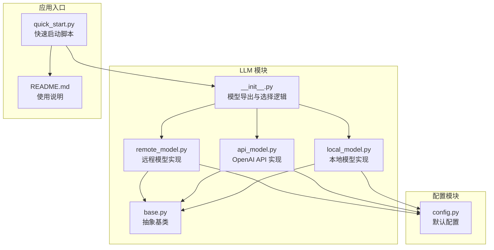
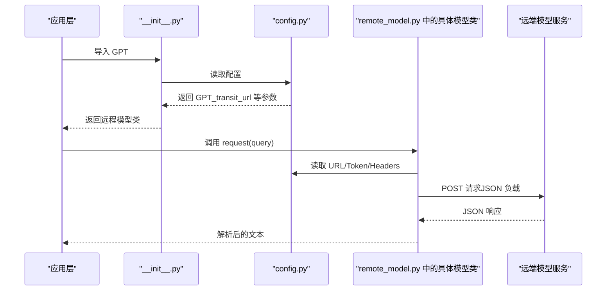
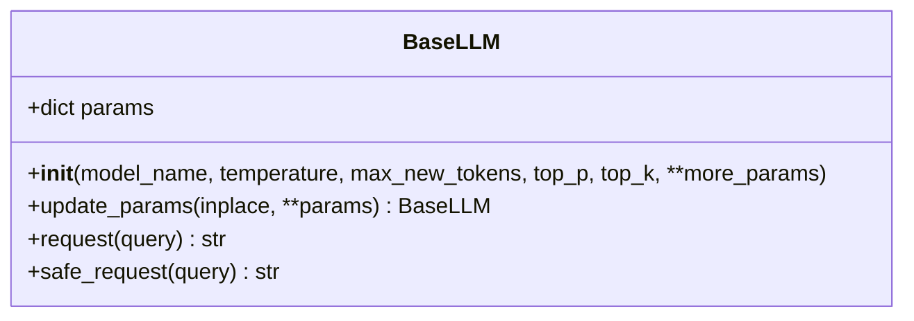
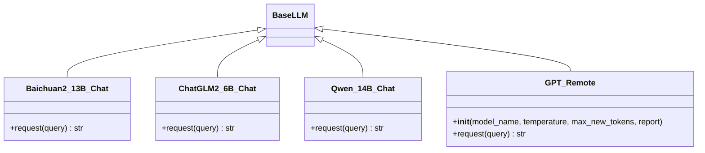
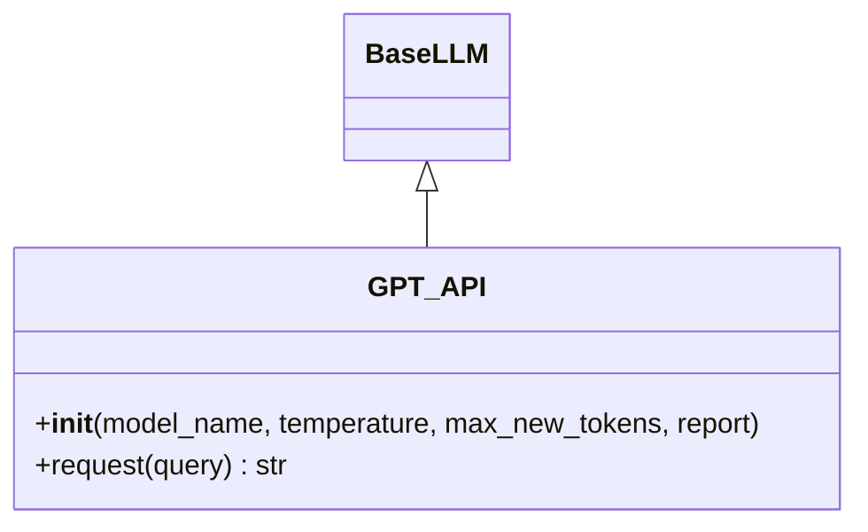
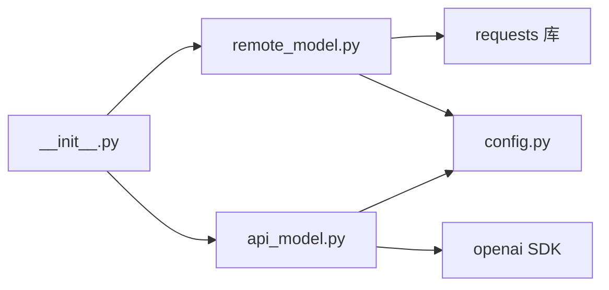
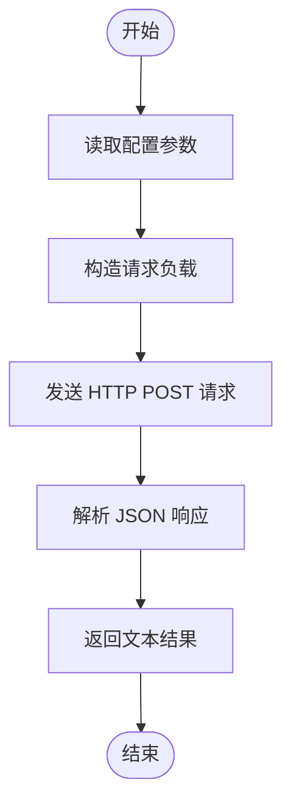

# 远程模型

<cite>
**本文引用的文件**
- [src/llms/remote_model.py](file://src/llms/remote_model.py)
- [src/llms/base.py](file://src/llms/base.py)
- [src/llms/api_model.py](file://src/llms/api_model.py)
- [src/llms/local_model.py](file://src/llms/local_model.py)
- [src/llms/__init__.py](file://src/llms/__init__.py)
- [src/configs/config.py](file://src/configs/config.py)
- [quick_start.py](file://quick_start.py)
- [README.md](file://README.md)
- [requirements.txt](file://requirements.txt)
</cite>

## 目录
1. [简介](#简介)
2. [项目结构](#项目结构)
3. [核心组件](#核心组件)
4. [架构总览](#架构总览)
5. [详细组件分析](#详细组件分析)
6. [依赖关系分析](#依赖关系分析)
7. [性能考量](#性能考量)
8. [故障排查指南](#故障排查指南)
9. [结论](#结论)
10. [附录：配置与调用示例](#附录配置与调用示例)

## 简介
本文件面向“远程模型”实现，系统性梳理 RemoteModel 类（在当前仓库中以具体模型类形式体现）的设计理念、网络通信机制与分布式处理能力。文档覆盖以下主题：
- 远程模型的连接建立、请求发送与响应接收流程
- 网络配置参数、超时设置与重试机制
- 远程服务发现、负载均衡与故障转移策略
- 配置示例与调用方法
- 与本地模型的性能差异与适用场景
- 远程模型部署与管理的完整指导

## 项目结构
远程模型相关代码位于 src/llms 子模块，配合配置模块 src/configs 提供统一的参数来源；入口模块根据配置自动选择使用 OpenAI API 或远程转发接口。

图表来源
- [src/llms/remote_model.py:1-111](file://src/llms/remote_model.py#L1-L111)
- [src/llms/api_model.py:1-33](file://src/llms/api_model.py#L1-L33)
- [src/llms/local_model.py:1-114](file://src/llms/local_model.py#L1-L114)
- [src/llms/base.py:1-47](file://src/llms/base.py#L1-L47)
- [src/llms/__init__.py:1-13](file://src/llms/__init__.py#L1-L13)
- [src/configs/config.py:1-14](file://src/configs/config.py#L1-L14)
- [quick_start.py:1-110](file://quick_start.py#L1-L110)
- [README.md:1-120](file://README.md#L1-L120)

章节来源
- [src/llms/remote_model.py:1-111](file://src/llms/remote_model.py#L1-L111)
- [src/llms/__init__.py:1-13](file://src/llms/__init__.py#L1-L13)
- [src/configs/config.py:1-14](file://src/configs/config.py#L1-L14)
- [quick_start.py:1-110](file://quick_start.py#L1-L110)
- [README.md:1-120](file://README.md#L1-L120)

## 核心组件
- 抽象基类 BaseLLM：定义统一的参数体系与安全请求接口，提供可选的异常兜底处理。
- 远程模型实现（remote_model.py）：封装对远端 API 的 HTTP 请求，支持多模型适配。
- OpenAI API 实现（api_model.py）：通过官方 SDK 调用 OpenAI 接口。
- 本地模型实现（local_model.py）：加载本地权重进行推理。
- 模型导出与选择（__init__.py）：依据配置动态选择 GPT 使用路径（OpenAI API 或远程转发）。
- 配置（config.py）：集中存放远程访问所需的 URL、Token、用户代理等参数。

章节来源
- [src/llms/base.py:6-47](file://src/llms/base.py#L6-L47)
- [src/llms/remote_model.py:14-111](file://src/llms/remote_model.py#L14-L111)
- [src/llms/api_model.py:12-33](file://src/llms/api_model.py#L12-L33)
- [src/llms/local_model.py:11-114](file://src/llms/local_model.py#L11-L114)
- [src/llms/__init__.py:1-13](file://src/llms/__init__.py#L1-L13)
- [src/configs/config.py:1-14](file://src/configs/config.py#L1-L14)

## 架构总览
远程模型的调用链路由“配置选择 + 请求封装 + 响应解析”构成。当配置中存在远程转发 URL 时，系统优先使用远程模型类；否则回退到 OpenAI API。

图表来源
- [src/llms/__init__.py:7-10](file://src/llms/__init__.py#L7-L10)
- [src/configs/config.py:7-9](file://src/configs/config.py#L7-L9)
- [src/llms/remote_model.py:88-110](file://src/llms/remote_model.py#L88-L110)

## 详细组件分析

### 抽象基类 BaseLLM
- 统一参数字典 params，包含模型名、温度、最大新词数、top-p、top-k 等。
- 提供 update_params 支持原地或深拷贝更新。
- 提供 safe_request 异常兜底，避免单次请求失败影响整体流程。

图表来源
- [src/llms/base.py:6-47](file://src/llms/base.py#L6-L47)

章节来源
- [src/llms/base.py:6-47](file://src/llms/base.py#L6-L47)

### 远程模型类族（remote_model.py）
- Baichuan2_13B_Chat、ChatGLM2_6B_Chat、Qwen_14B_Chat、GPT（远程转发）均继承自 BaseLLM。
- 共同点：
  - 从配置模块读取 URL、Token、Headers。
  - 将查询与采样参数打包为 JSON 负载，通过 HTTP POST 发送。
  - 解析远端返回的 JSON，提取所需字段作为结果。
- 差异点：
  - 不同模型的 URL 来源不同（分别对应 Baichuan2_13B_url、ChatGLM2_url、Qwen_url、GPT_transit_url）。
  - GPT（远程转发）额外携带 model 名称、消息数组、最大 token 数与 top_p。

图表来源
- [src/llms/remote_model.py:14-111](file://src/llms/remote_model.py#L14-L111)
- [src/llms/base.py:6-47](file://src/llms/base.py#L6-L47)

章节来源
- [src/llms/remote_model.py:14-111](file://src/llms/remote_model.py#L14-L111)

### OpenAI API 模型（api_model.py）
- 通过 openai SDK 调用，支持自定义 base_url 与 api_key。
- 与远程转发版本共享参数结构，便于替换。

图表来源
- [src/llms/api_model.py:12-33](file://src/llms/api_model.py#L12-L33)
- [src/llms/base.py:6-47](file://src/llms/base.py#L6-L47)

章节来源
- [src/llms/api_model.py:12-33](file://src/llms/api_model.py#L12-L33)

### 本地模型对比（local_model.py）
- 加载本地权重，直接在本地 GPU/CPU 上生成文本。
- 与远程模型对比，具备更低延迟与更强隐私性，但需要较大的硬件资源与存储空间。

章节来源
- [src/llms/local_model.py:11-114](file://src/llms/local_model.py#L11-L114)

### 模型导出与选择（__init__.py）
- 根据配置是否提供 GPT_api_key 或 GPT_transit_url 决定导入远程模型还是 OpenAI API 版本。
- 该机制实现了“零代码变更”的运行时切换。

章节来源
- [src/llms/__init__.py:1-13](file://src/llms/__init__.py#L1-L13)

## 依赖关系分析
- 远程模型依赖 requests 库进行 HTTP 通信。
- 配置模块提供统一的参数来源，支持 real_config 与 config 两套方案（后者为默认）。
- __init__.py 在运行时决定使用哪种实现，体现了“配置即编排”的设计思想。

图表来源
- [src/llms/remote_model.py:1-6](file://src/llms/remote_model.py#L1-L6)
- [src/llms/api_model.py:1-5](file://src/llms/api_model.py#L1-L5)
- [src/llms/__init__.py:1-13](file://src/llms/__init__.py#L1-L13)
- [src/configs/config.py:1-14](file://src/configs/config.py#L1-L14)

章节来源
- [src/llms/remote_model.py:1-6](file://src/llms/remote_model.py#L1-L6)
- [src/llms/api_model.py:1-5](file://src/llms/api_model.py#L1-L5)
- [src/llms/__init__.py:1-13](file://src/llms/__init__.py#L1-L13)
- [src/configs/config.py:1-14](file://src/configs/config.py#L1-L14)

## 性能考量
- 延迟与吞吐
  - 远程模型受网络 RTT、远端服务并发限制与序列化开销影响，通常高于本地模型。
  - 本地模型在 GPU/CPU 上直接计算，延迟更低，适合低延迟场景。
- 资源占用
  - 远程模型无需本地显存与 CPU 占用，适合资源受限环境。
  - 本地模型需要较大显存与存储，适合高吞吐与离线推理。
- 可扩展性
  - 远程模型可通过横向扩展远端服务提升吞吐，但需关注网络瓶颈与队列排队。
  - 本地模型可通过多卡/多机扩展，但成本更高且需维护复杂度。
- 安全与合规
  - 远程模型可能涉及数据外传，需评估合规风险。
  - 本地模型完全在本地执行，更易满足隐私要求。

[本节为通用性能讨论，不直接分析特定文件]

## 故障排查指南
- 常见问题与定位
  - 无法连接远端服务：检查 URL 是否正确、Token 是否有效、网络连通性。
  - 请求失败或超时：确认远端服务状态、限流策略与超时阈值。
  - 参数不生效：核对参数键名与远端期望格式是否一致。
  - 返回格式异常：检查远端返回结构是否符合解析预期。
- 日志与告警
  - BaseLLM.safe_request 提供异常兜底与日志输出，便于定位问题。
  - GPT（远程转发）在启用 report 时会记录 token 消耗，有助于成本控制与限流监控。
- 配置校验
  - 确认 config.py 中的 GPT_transit_url/GPT_transit_token/GPT_transit_user 是否填写。
  - 若使用 OpenAI API，请确保 GPT_api_key 与 GPT_api_base 正确配置。

章节来源
- [src/llms/base.py:38-47](file://src/llms/base.py#L38-L47)
- [src/llms/remote_model.py:88-110](file://src/llms/remote_model.py#L88-L110)
- [src/configs/config.py:7-9](file://src/configs/config.py#L7-L9)

## 结论
- 远程模型通过统一的 BaseLLM 接口与灵活的配置选择，实现了对多种远端服务的透明接入。
- 在资源受限、隐私敏感或需要弹性扩展的场景下，远程模型更具优势；在低延迟与高吞吐的本地推理场景下，本地模型更合适。
- 通过合理的超时与重试策略、完善的日志与监控，可显著提升远程模型的稳定性与可观测性。

[本节为总结性内容，不直接分析特定文件]

## 附录：配置与调用示例

### 配置项清单（来自 config.py）
- GPT_api_key：OpenAI API 密钥（可选）
- GPT_api_base：OpenAI API 基础地址（可选）
- GPT_transit_url：远程转发服务 URL（可选）
- GPT_transit_token：远程转发服务 Token（可选）
- GPT_transit_user：远程转发服务 User-Agent（可选）
- Qwen_7B_local_path/Qwen_14B_local_path/Baichuan2_13b_local_path/ChatGLM3_local_path：本地模型路径（可选）

章节来源
- [src/configs/config.py:1-14](file://src/configs/config.py#L1-L14)

### 运行时选择逻辑（来自 __init__.py）
- 若配置了 GPT_api_key，则使用 OpenAI API 版本。
- 否则若配置了 GPT_transit_url，则使用远程转发版本。
- 否则不启用 GPT。

章节来源
- [src/llms/__init__.py:7-10](file://src/llms/__init__.py#L7-L10)

### 快速开始调用（来自 quick_start.py）
- 通过命令行参数选择模型名称与采样参数，自动构建 LLM 实例并运行评测流程。
- 示例命令行参数包括模型名、温度、最大新词数、数据集路径、检索器类型等。

章节来源
- [quick_start.py:54-57](file://quick_start.py#L54-L57)
- [quick_start.py:17-20](file://quick_start.py#L17-L20)
- [README.md:87-105](file://README.md#L87-L105)

### 远程模型调用流程（来自 remote_model.py）
- 读取配置中的 URL、Token、Headers
- 构造 JSON 负载（包含 prompt/params 或 model/messages 等）
- 发送 HTTP POST 请求
- 解析 JSON 响应并返回文本

图表来源
- [src/llms/remote_model.py:88-110](file://src/llms/remote_model.py#L88-L110)

### 与本地模型的差异与适用场景
- 本地模型：低延迟、高隐私、高资源消耗，适合离线推理与严格隐私场景。
- 远程模型：按需弹性扩展、降低本地资源压力，适合在线服务与多租户场景。

章节来源
- [src/llms/local_model.py:11-114](file://src/llms/local_model.py#L11-L114)
- [src/llms/remote_model.py:14-111](file://src/llms/remote_model.py#L14-L111)

### 部署与管理建议
- 服务端
  - 明确服务发现方式（域名/IP/负载均衡器），确保 URL 稳定可用。
  - 设置合理的超时与重试策略，避免长尾请求阻塞。
  - 开启访问鉴权与速率限制，防止滥用。
- 客户端
  - 将 Token 与 URL 等敏感信息置于安全配置文件中，避免硬编码。
  - 对请求进行幂等性与去重处理，减少重复调用。
  - 建立监控与告警，跟踪成功率、延迟与错误类型。

[本节为通用实践建议，不直接分析特定文件]