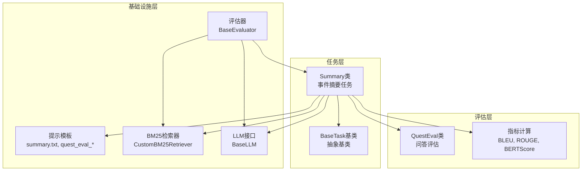
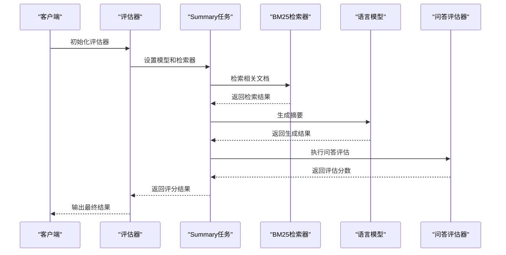
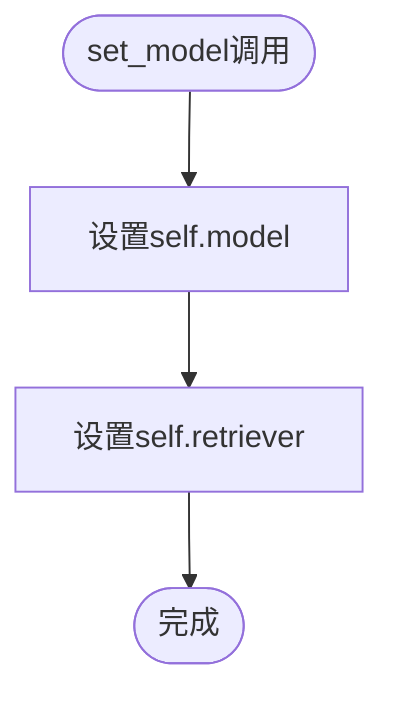
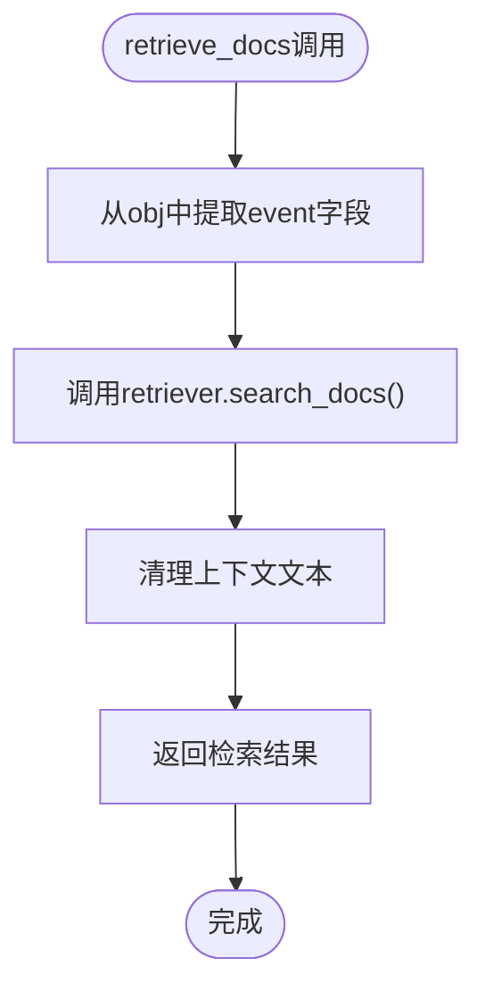
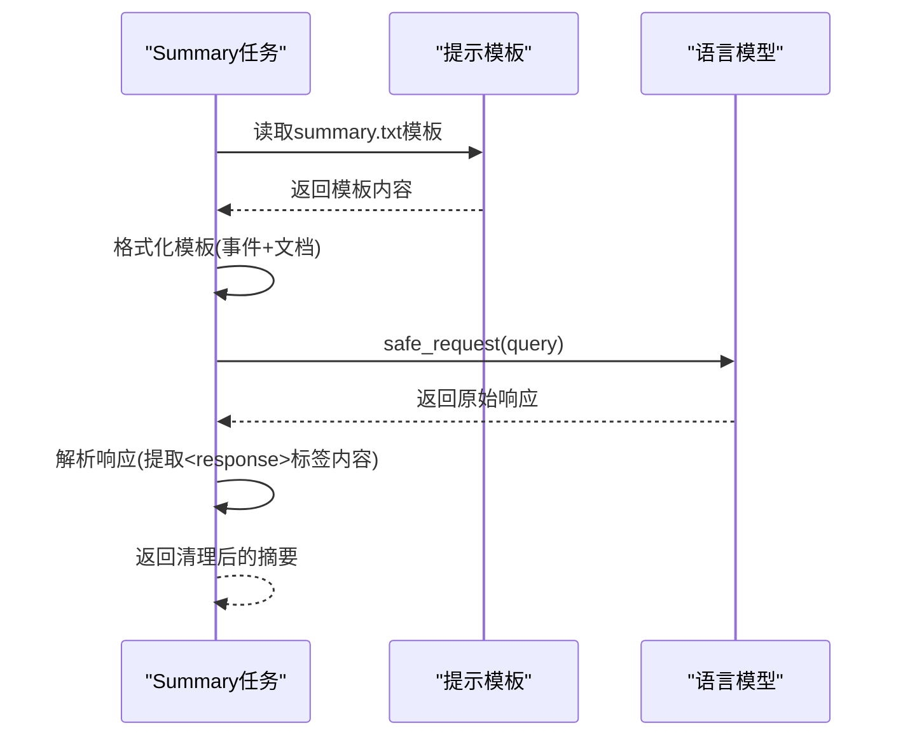
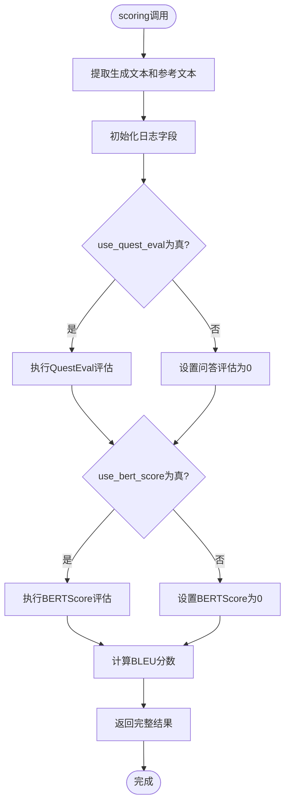
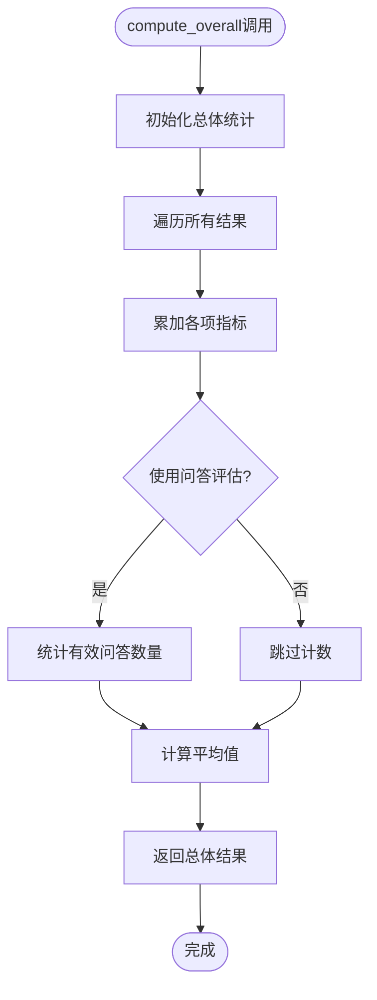
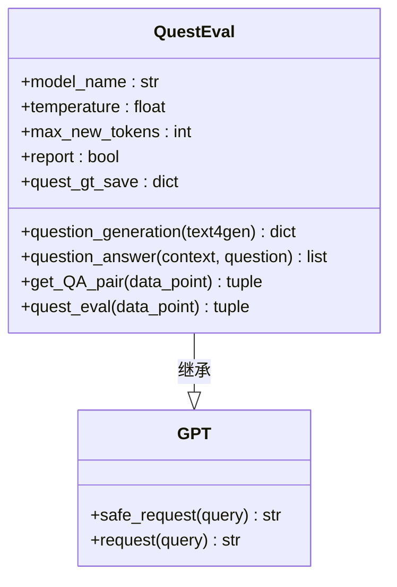
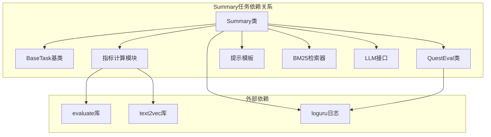

# 事件摘要任务API

<cite>
**本文档引用的文件**
- [src/tasks/summary.py](file://src/tasks/summary.py)
- [src/tasks/base.py](file://src/tasks/base.py)
- [src/metric/quest_eval.py](file://src/metric/quest_eval.py)
- [src/metric/common.py](file://src/metric/common.py)
- [src/prompts/summary.txt](file://src/prompts/summary.txt)
- [src/prompts/quest_eval_gen.txt](file://src/prompts/quest_eval_gen.txt)
- [src/prompts/quest_eval_answer.txt](file://src/prompts/quest_eval_answer.txt)
- [src/retrievers/bm25.py](file://src/retrievers/bm25.py)
- [src/llms/base.py](file://src/llms/base.py)
- [evaluator.py](file://evaluator.py)
- [quick_start.py](file://quick_start.py)
- [data/crud_split/split_merged.json](file://data/crud_split/split_merged.json)
</cite>

## 目录
1. [简介](#简介)
2. [项目结构](#项目结构)
3. [核心组件](#核心组件)
4. [架构概览](#架构概览)
5. [详细组件分析](#详细组件分析)
6. [依赖关系分析](#依赖关系分析)
7. [性能考量](#性能考量)
8. [故障排除指南](#故障排除指南)
9. [结论](#结论)
10. [附录](#附录)

## 简介
本文档详细说明事件摘要任务类的API，重点涵盖Summary类的构造函数参数、set_model方法、retrieve_docs方法、model_generation方法和scoring方法的具体实现。同时记录事件摘要任务的特殊配置选项use_quest_eval和use_bert_score参数的作用，解释任务的数据处理流程，包括查询文本提取、文档检索、模型生成和评估计算。提供完整的使用示例，展示如何初始化任务、配置参数和执行评估。说明与BaseTask基类的关系和继承实现，并包含错误处理和性能优化建议。

## 项目结构
事件摘要任务位于src/tasks目录下，采用面向对象设计，继承自BaseTask基类。项目整体结构如下：
- 任务定义：src/tasks/summary.py
- 基类定义：src/tasks/base.py
- 评估指标：src/metric/common.py, src/metric/quest_eval.py
- 提示模板：src/prompts/summary.txt, src/prompts/quest_eval_gen.txt, src/prompts/quest_eval_answer.txt
- 检索器：src/retrievers/bm25.py
- LLM接口：src/llms/base.py
- 评估器：evaluator.py
- 快速启动脚本：quick_start.py
- 数据集：data/crud_split/split_merged.json



**图表来源**
- [src/tasks/summary.py:12-121](file://src/tasks/summary.py#L12-L121)
- [src/tasks/base.py:13-74](file://src/tasks/base.py#L13-L74)
- [src/metric/quest_eval.py:23-152](file://src/metric/quest_eval.py#L23-L152)

**章节来源**
- [src/tasks/summary.py:1-121](file://src/tasks/summary.py#L1-L121)
- [src/tasks/base.py:1-74](file://src/tasks/base.py#L1-L74)

## 核心组件
事件摘要任务的核心组件包括：

### Summary类
Summary类继承自BaseTask，专门用于生成事件摘要。该类实现了完整的任务生命周期，包括文档检索、模型生成和评估计算。

### BaseTask基类
BaseTask提供任务的基础框架，定义了抽象方法和通用功能，包括：
- 构造函数参数配置
- 模型设置方法
- 文档检索接口
- 生成接口
- 评分接口
- 总体统计计算

### QuestEval评估器
QuestEval类实现了基于问答的评估机制，通过生成问题并比较答案相似度来评估摘要质量。

### 指标计算模块
提供多种评估指标的计算功能，包括BLEU、ROUGE-L和BERTScore等。

**章节来源**
- [src/tasks/summary.py:12-121](file://src/tasks/summary.py#L12-L121)
- [src/tasks/base.py:13-74](file://src/tasks/base.py#L13-L74)
- [src/metric/quest_eval.py:23-152](file://src/metric/quest_eval.py#L23-L152)

## 架构概览
事件摘要任务采用分层架构设计，各组件职责清晰分离：



**图表来源**
- [evaluator.py:13-192](file://evaluator.py#L13-L192)
- [src/tasks/summary.py:32-98](file://src/tasks/summary.py#L32-L98)
- [src/retrievers/bm25.py:70-92](file://src/retrievers/bm25.py#L70-L92)

## 详细组件分析

### Summary类API详解

#### 构造函数参数
Summary类的构造函数支持以下参数：

| 参数名 | 类型 | 默认值 | 作用 |
|--------|------|--------|------|
| output_dir | str | './output' | 输出目录路径 |
| quest_eval_model | str | "gpt-3.5-turbo" | 问答评估使用的模型名称 |
| use_quest_eval | bool | False | 是否启用问答评估 |
| use_bert_score | bool | False | 是否启用BERTScore评估 |

当use_quest_eval为True时，会初始化QuestEval实例，用于执行基于问答的评估。

**章节来源**
- [src/tasks/summary.py:13-31](file://src/tasks/summary.py#L13-L31)

#### set_model方法
set_model方法用于设置任务使用的模型和检索器：



**图表来源**
- [src/tasks/summary.py:32-34](file://src/tasks/summary.py#L32-L34)

**章节来源**
- [src/tasks/summary.py:32-34](file://src/tasks/summary.py#L32-L34)

#### retrieve_docs方法
retrieve_docs方法负责从输入数据中提取查询文本并进行文档检索：



**图表来源**
- [src/tasks/summary.py:36-40](file://src/tasks/summary.py#L36-L40)

该方法的关键步骤包括：
1. 从输入字典中提取事件描述作为查询文本
2. 调用检索器的search_docs方法获取相关文档
3. 清理返回的上下文文本，移除特定格式标记

**章节来源**
- [src/tasks/summary.py:36-40](file://src/tasks/summary.py#L36-L40)

#### model_generation方法
model_generation方法使用提示模板和检索到的文档生成摘要：



**图表来源**
- [src/tasks/summary.py:42-50](file://src/tasks/summary.py#L42-L50)
- [src/prompts/summary.txt:1-16](file://src/prompts/summary.txt#L1-L16)

该方法的实现细节：
1. 读取src/prompts/summary.txt模板文件
2. 使用事件描述和检索到的文档格式化模板
3. 通过模型的安全请求接口生成响应
4. 解析响应文本，提取<response>标签内的内容

**章节来源**
- [src/tasks/summary.py:42-50](file://src/tasks/summary.py#L42-L50)

#### scoring方法
scoring方法执行综合评估，计算多种指标并返回结果：



**图表来源**
- [src/tasks/summary.py:61-98](file://src/tasks/summary.py#L61-L98)

scoring方法返回的完整结果结构：
- metrics字典：包含BLEU-avg、BLEU-1、BLEU-2、BLEU-3、BLEU-4、ROUGE-L、BERTScore、QA_avg_F1、QA_recall、长度等指标
- log字典：包含生成文本、参考文本、问答评估详情、评估时间等日志信息
- valid布尔值：指示评估是否有效

**章节来源**
- [src/tasks/summary.py:61-98](file://src/tasks/summary.py#L61-L98)

#### compute_overall方法
compute_overall方法计算所有样本的总体统计结果：



**图表来源**
- [src/tasks/summary.py:100-121](file://src/tasks/summary.py#L100-L121)

**章节来源**
- [src/tasks/summary.py:100-121](file://src/tasks/summary.py#L100-L121)

### QuestEval类分析
QuestEval类实现了基于问答的评估机制，包含以下核心功能：

#### 问答生成和回答


**图表来源**
- [src/metric/quest_eval.py:23-152](file://src/metric/quest_eval.py#L23-L152)

**章节来源**
- [src/metric/quest_eval.py:23-152](file://src/metric/quest_eval.py#L23-L152)

### 指标计算模块
指标计算模块提供了多种评估指标的实现：

#### BLEU分数计算
BLEU分数计算函数支持惩罚因子控制，返回平均BLEU分数和各阶精度。

#### ROUGE-L分数计算
ROUGE-L分数计算基于最长公共子序列，适用于摘要评估。

#### BERTScore计算
BERTScore使用中文文本向量相似度计算，需要连接Hugging Face网络。

**章节来源**
- [src/metric/common.py:23-86](file://src/metric/common.py#L23-L86)

## 依赖关系分析



**图表来源**
- [src/tasks/summary.py:1-11](file://src/tasks/summary.py#L1-L11)
- [src/metric/common.py:7-10](file://src/metric/common.py#L7-L10)

**章节来源**
- [src/tasks/summary.py:1-11](file://src/tasks/summary.py#L1-L11)
- [src/metric/common.py:1-117](file://src/metric/common.py#L1-L117)

## 性能考量
事件摘要任务在性能方面有以下特点和优化建议：

### 并发处理
- 评估器使用ThreadPoolExecutor进行并发处理，默认线程数为40
- 支持多线程批量评分，提高处理效率
- 实现了结果缓存和断点续评功能

### 缓存策略
- QuestEval会缓存生成的问题和答案对
- 评估结果会保存到JSON文件中
- 支持从已保存的结果继续评估

### 内存管理
- 使用生成器和迭代器处理大数据集
- 合理的异常处理避免内存泄漏
- 及时释放不再使用的资源

### 网络优化
- LLM接口提供安全请求包装，处理网络异常
- QuestEval的网络请求包含重试机制
- 指标计算模块的网络请求有异常捕获

## 故障排除指南

### 常见问题和解决方案

#### 模型请求失败
**问题**：LLM请求失败导致生成为空
**解决方案**：检查网络连接、API密钥配置和模型可用性

#### 检索器连接失败
**问题**：Elasticsearch连接异常
**解决方案**：验证ES服务器状态、端口配置和认证信息

#### 问答评估异常
**问题**：QuestEval执行过程中抛出异常
**解决方案**：检查提示模板文件是否存在，验证JSON格式正确性

#### 指标计算错误
**问题**：BLEU或BERTScore计算失败
**解决方案**：确认evaluate库和text2vec库安装正确，检查网络连接

**章节来源**
- [evaluator.py:82-100](file://evaluator.py#L82-L100)
- [src/tasks/summary.py:38-40](file://src/tasks/summary.py#L38-L40)

## 结论
事件摘要任务API提供了完整的事件摘要生成和评估解决方案。通过继承BaseTask基类，Summary类实现了标准化的任务接口，支持灵活的配置选项和多种评估指标。系统采用模块化设计，各组件职责清晰，便于扩展和维护。通过合理的并发处理和缓存策略，系统能够在保证质量的同时提高处理效率。建议在实际使用中根据具体需求调整参数配置，并结合错误处理机制确保系统的稳定性。

## 附录

### 使用示例
以下是一个完整的使用示例，展示如何初始化事件摘要任务并执行评估：

```python
# 初始化模型和检索器
llm = GPT(model_name='gpt-3.5-turbo', temperature=0.1, max_new_tokens=1280)
embed_model = HuggingfaceEmbeddings(model_name='sentence-transformers/bge-base-zh-v1.5')
retriever = CustomBM25Retriever(
    docs_path='data/80000_docs',
    embed_model=embed_model,
    similarity_top_k=8
)

# 初始化事件摘要任务
task = Summary(
    output_dir='./output',
    quest_eval_model='gpt-3.5-turbo',
    use_quest_eval=True,
    use_bert_score=True
)

# 设置模型和检索器
task.set_model(llm, retriever)

# 准备测试数据
test_data = [
    {
        "event": "2023年7月28日，美国堪萨斯州的心脏地带三州银行因资不抵债宣告倒闭",
        "summary": "2023年7月28日，堪萨斯州的心脏地带三州银行因资不抵债宣告倒闭。FDIC接管并将其存款、贷款等资产转至梦想第一银行。",
        "ID": "test_id_001"
    }
]

# 执行评估
for data_point in test_data:
    # 检索文档
    retrieve_context = task.retrieve_docs(data_point)
    data_point["retrieve_context"] = retrieve_context
    
    # 生成摘要
    generated_text = task.model_generation(data_point)
    data_point["generated_text"] = generated_text
    
    # 计算评分
    result = task.scoring(data_point)
    print(f"评估结果: {result}")
```

### 配置参数说明

#### 任务配置参数
- **output_dir**：输出目录，用于保存评估结果和缓存文件
- **quest_eval_model**：问答评估使用的模型名称
- **use_quest_eval**：是否启用基于问答的评估
- **use_bert_score**：是否启用BERTScore评估

#### 检索器配置参数
- **docs_directory**：文档存储目录
- **embed_model**：嵌入模型
- **chunk_size**：文档分块大小
- **chunk_overlap**：分块重叠大小
- **collection_name**：Elasticsearch索引名称
- **similarity_top_k**：返回的相似文档数量

#### LLM配置参数
- **model_name**：模型名称
- **temperature**：温度参数，控制随机性
- **max_new_tokens**：最大生成长度
- **top_p**：核采样参数
- **top_k**：Top-k采样参数

### 数据格式要求
事件摘要任务期望的数据格式包含以下字段：
- **event**：事件描述文本
- **summary**：参考摘要文本
- **ID**：数据点唯一标识符
- **text**：完整文档内容
- **title**：文档标题
- **url**：文档链接
- **time**：发布时间

**章节来源**
- [data/crud_split/split_merged.json:1-200](file://data/crud_split/split_merged.json#L1-L200)