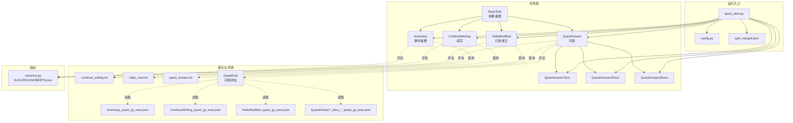
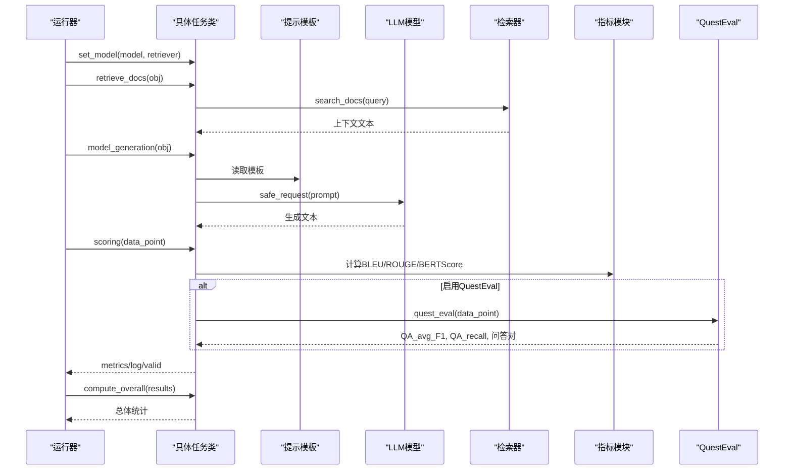
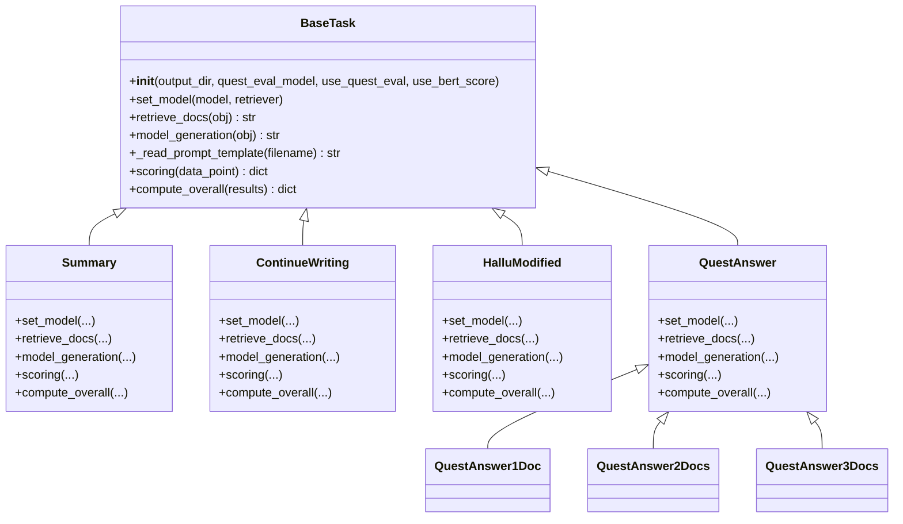
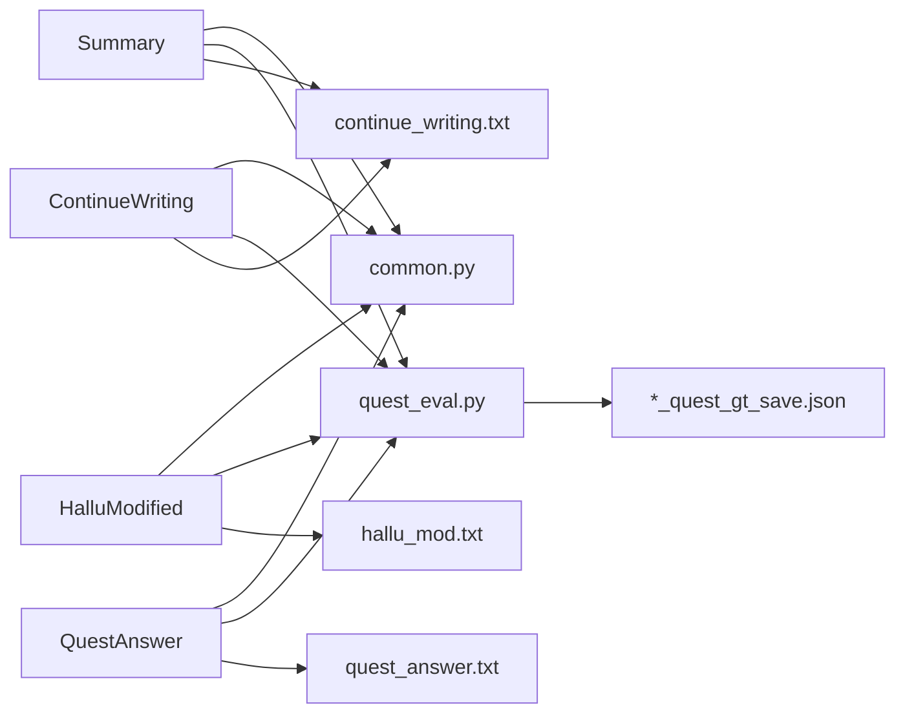

# 具体任务API

<cite>
**本文引用的文件**
- [src/tasks/base.py](file://src/tasks/base.py)
- [src/tasks/summary.py](file://src/tasks/summary.py)
- [src/tasks/continue_writing.py](file://src/tasks/continue_writing.py)
- [src/tasks/hallucinated_modified.py](file://src/tasks/hallucinated_modified.py)
- [src/tasks/quest_answer.py](file://src/tasks/quest_answer.py)
- [src/prompts/continue_writing.txt](file://src/prompts/continue_writing.txt)
- [src/prompts/hallu_mod.txt](file://src/prompts/hallu_mod.txt)
- [src/prompts/quest_answer.txt](file://src/prompts/quest_answer.txt)
- [src/metric/common.py](file://src/metric/common.py)
- [src/metric/quest_eval.py](file://src/metric/quest_eval.py)
- [src/quest_eval/Summary_quest_gt_save.json](file://src/quest_eval/Summary_quest_gt_save.json)
- [src/quest_eval/ContinueWriting_quest_gt_save.json](file://src/quest_eval/ContinueWriting_quest_gt_save.json)
- [src/quest_eval/HalluModified_quest_gt_save.json](file://src/quest_eval/HalluModified_quest_gt_save.json)
- [src/quest_eval/QuestAnswer1Doc_quest_gt_save.json](file://src/quest_eval/QuestAnswer1Doc_quest_gt_save.json)
- [src/quest_eval/QuestAnswer2Docs_quest_gt_save.json](file://src/quest_eval/QuestAnswer2Docs_quest_gt_save.json)
- [src/quest_eval/QuestAnswer3Docs_quest_gt_save.json](file://src/quest_eval/QuestAnswer3Docs_quest_gt_save.json)
- [src/configs/config.py](file://src/configs/config.py)
- [quick_start.py](file://quick_start.py)
- [data/crud_split/split_merged.json](file://data/crud_split/split_merged.json)
</cite>

## 目录
1. [简介](#简介)
2. [项目结构](#项目结构)
3. [核心组件](#核心组件)
4. [架构总览](#架构总览)
5. [详细组件分析](#详细组件分析)
6. [依赖分析](#依赖分析)
7. [性能考量](#性能考量)
8. [故障排查指南](#故障排查指南)
9. [结论](#结论)
10. [附录](#附录)

## 简介
本文面向开发者，系统化梳理 CRUD_RAG 仓库中“具体任务实现类”的API与使用方法，覆盖以下任务类：
- Summary 事件摘要任务
- ContinueWriting 续写任务
- HalluModified 幻觉修正任务
- QuestAnswer 问答任务（含 QuestAnswer1Doc、QuestAnswer2Docs、QuestAnswer3Docs）

文档内容包括：
- 任务类的构造参数、关键方法与职责边界
- 提示模板接口与数据处理流程
- 评估指标计算与整体统计逻辑
- 使用示例与最佳实践
- 任务间的差异与选择指导
- 扩展与定制建议

## 项目结构
与“具体任务API”直接相关的目录与文件：
- 任务实现：src/tasks/*.py
- 提示模板：src/prompts/*.txt
- 评估指标：src/metric/*.py
- 评测问题集缓存：src/quest_eval/*.json
- 示例数据：data/crud_split/split_merged.json
- 启动入口：quick_start.py
- 配置：src/configs/config.py

图表来源
- [src/tasks/base.py:13-74](file://src/tasks/base.py#L13-L74)
- [src/tasks/summary.py:12-121](file://src/tasks/summary.py#L12-L121)
- [src/tasks/continue_writing.py:13-119](file://src/tasks/continue_writing.py#L13-L119)
- [src/tasks/hallucinated_modified.py:14-124](file://src/tasks/hallucinated_modified.py#L14-L124)
- [src/tasks/quest_answer.py:14-134](file://src/tasks/quest_answer.py#L14-L134)
- [src/prompts/continue_writing.txt:1-18](file://src/prompts/continue_writing.txt#L1-L18)
- [src/prompts/hallu_mod.txt:1-23](file://src/prompts/hallu_mod.txt#L1-L23)
- [src/prompts/quest_answer.txt:1-15](file://src/prompts/quest_answer.txt#L1-L15)
- [src/metric/common.py:23-117](file://src/metric/common.py#L23-L117)
- [src/metric/quest_eval.py:23-152](file://src/metric/quest_eval.py#L23-L152)
- [src/quest_eval/Summary_quest_gt_save.json:1-200](file://src/quest_eval/Summary_quest_gt_save.json#L1-L200)
- [src/quest_eval/ContinueWriting_quest_gt_save.json](file://src/quest_eval/ContinueWriting_quest_gt_save.json)
- [src/quest_eval/HalluModified_quest_gt_save.json](file://src/quest_eval/HalluModified_quest_gt_save.json)
- [src/quest_eval/QuestAnswer1Doc_quest_gt_save.json](file://src/quest_eval/QuestAnswer1Doc_quest_gt_save.json)
- [src/quest_eval/QuestAnswer2Docs_quest_gt_save.json](file://src/quest_eval/QuestAnswer2Docs_quest_gt_save.json)
- [src/quest_eval/QuestAnswer3Docs_quest_gt_save.json](file://src/quest_eval/QuestAnswer3Docs_quest_gt_save.json)
- [quick_start.py:91-109](file://quick_start.py#L91-L109)
- [src/configs/config.py:1-14](file://src/configs/config.py#L1-L14)
- [data/crud_split/split_merged.json:1-200](file://data/crud_split/split_merged.json#L1-L200)

章节来源
- [src/tasks/base.py:13-74](file://src/tasks/base.py#L13-L74)
- [quick_start.py:91-109](file://quick_start.py#L91-L109)

## 核心组件
本节概述“具体任务实现类”的通用接口与职责，便于理解各任务类的共同点与差异。

- 抽象基类 BaseTask
  - 关键职责
    - 统一初始化：输出目录、是否启用 QuestEval、是否启用 BERTScore
    - 设置模型与检索器：set_model(model, retriever)
    - 文档检索：retrieve_docs(obj: dict) -> str
    - 模型生成：model_generation(obj: dict) -> str
    - 提示模板读取：_read_prompt_template(filename: str)
    - 单样本评分：scoring(data_point: dict) -> dict
    - 整体统计：compute_overall(results: list[dict]) -> dict
  - 关键参数
    - output_dir: 输出目录（不存在则自动创建）
    - quest_eval_model: QuestEval 使用的模型名称
    - use_quest_eval: 是否启用 QuestEval 问答评估
    - use_bert_score: 是否启用 BERTScore 语义相似度

- 评估指标
  - BLEU（支持多阶精度与 brevity penalty）
  - ROUGE-L
  - BERTScore（基于本地缓存的相似度模型）
  - QuestEval：基于问题生成与答案匹配的 F1 与召回

章节来源
- [src/tasks/base.py:13-74](file://src/tasks/base.py#L13-L74)
- [src/metric/common.py:23-117](file://src/metric/common.py#L23-L117)
- [src/metric/quest_eval.py:23-152](file://src/metric/quest_eval.py#L23-L152)

## 架构总览
下面的序列图展示了“任务类 + 提示模板 + 指标模块 + QuestEval”的典型调用链：

图表来源
- [src/tasks/base.py:34-74](file://src/tasks/base.py#L34-L74)
- [src/tasks/summary.py:42-98](file://src/tasks/summary.py#L42-L98)
- [src/tasks/continue_writing.py:43-99](file://src/tasks/continue_writing.py#L43-L99)
- [src/tasks/hallucinated_modified.py:44-103](file://src/tasks/hallucinated_modified.py#L44-L103)
- [src/tasks/quest_answer.py:44-100](file://src/tasks/quest_answer.py#L44-L100)
- [src/metric/common.py:23-117](file://src/metric/common.py#L23-L117)
- [src/metric/quest_eval.py:92-129](file://src/metric/quest_eval.py#L92-L129)

## 详细组件分析

### Summary 事件摘要任务
- 类定义与继承
  - 继承自 BaseTask，实现摘要生成与评分
- 关键方法
  - set_model(model, retriever): 保存模型与检索器实例
  - retrieve_docs(obj: dict) -> str: 从 obj["event"] 检索上下文
  - model_generation(obj: dict) -> str: 使用模板生成摘要
  - scoring(data_point: dict) -> dict: 计算 BLEU、ROUGE-L、BERTScore、QA_avg_F1、QA_recall、长度
  - compute_overall(results: list[dict]) -> dict: 计算平均指标与有效样本数
- 特殊参数
  - output_dir、quest_eval_model、use_quest_eval、use_bert_score
- 数据字段约定
  - 输入 obj: event, retrieve_context
  - 输出 data_point: generated_text, summary（或 ground_truth_text）
- 提示模板
  - 模板文件：src/prompts/continue_writing.txt
  - 模板格式：包含检索到的文档与事件描述，返回摘要
- 评估指标
  - BLEU/ROUGE-L/BERTScore 由 common.py 提供
  - QuestEval 由 quest_eval.py 提供，读取对应任务的 JSON 缓存
- 使用示例（命令行）
  - --task event_summary
  - 参见 quick_start.py 的任务映射与执行流程
- 最佳实践
  - 确保检索器 top_k 与 chunk 规模适配摘要场景
  - 若启用 QuestEval，建议提供真实 ID 以复用问答对缓存
  - 评估时注意 valid 字段过滤空输出

章节来源
- [src/tasks/summary.py:12-121](file://src/tasks/summary.py#L12-L121)
- [src/prompts/continue_writing.txt:1-18](file://src/prompts/continue_writing.txt#L1-L18)
- [src/metric/common.py:23-117](file://src/metric/common.py#L23-L117)
- [src/metric/quest_eval.py:64-129](file://src/metric/quest_eval.py#L64-L129)
- [src/quest_eval/Summary_quest_gt_save.json:1-200](file://src/quest_eval/Summary_quest_gt_save.json#L1-L200)
- [quick_start.py:91-109](file://quick_start.py#L91-L109)

### ContinueWriting 续写任务
- 类定义与继承
  - 继承自 BaseTask，实现续写生成与评分
- 关键方法
  - retrieve_docs(obj: dict) -> str: 从 obj["beginning"] 检索上下文
  - model_generation(obj: dict) -> str: 使用模板续写
  - scoring(data_point: dict) -> dict: 计算 BLEU、ROUGE-L、BERTScore、QA_avg_F1、QA_recall、长度
  - compute_overall(results: list[dict]) -> dict: 计算平均指标与有效样本数
- 特殊参数
  - output_dir、quest_eval_model、use_quest_eval、use_bert_score
- 数据字段约定
  - 输入 obj: beginning, retrieve_context
  - 输出 data_point: generated_text, continuing（或 ground_truth_text）
- 提示模板
  - 模板文件：src/prompts/continue_writing.txt
  - 模板格式：包含检索到的文档与已写文本，返回续写
- 评估指标
  - BLEU/ROUGE-L/BERTScore 由 common.py 提供
  - QuestEval 由 quest_eval.py 提供，读取对应任务的 JSON 缓存
- 使用示例（命令行）
  - --task continuing_writing
  - 参见 quick_start.py 的任务映射与执行流程
- 最佳实践
  - 续写长度与原文长度相当，避免重复内容
  - 注意模板中“不要出现已经写好的文本内容”的约束

章节来源
- [src/tasks/continue_writing.py:13-119](file://src/tasks/continue_writing.py#L13-L119)
- [src/prompts/continue_writing.txt:1-18](file://src/prompts/continue_writing.txt#L1-L18)
- [src/metric/common.py:23-117](file://src/metric/common.py#L23-L117)
- [src/metric/quest_eval.py:64-129](file://src/metric/quest_eval.py#L64-L129)
- [src/quest_eval/ContinueWriting_quest_gt_save.json](file://src/quest_eval/ContinueWriting_quest_gt_save.json)
- [quick_start.py:91-109](file://quick_start.py#L91-L109)

### HalluModified 幻觉修正任务
- 类定义与继承
  - 继承自 BaseTask，实现幻觉文本修正与评分
- 关键方法
  - retrieve_docs(obj: dict) -> str: 从 obj["newsBeginning"] 检索上下文
  - model_generation(obj: dict) -> str: 使用模板修正幻觉
  - scoring(data_point: dict) -> dict: 计算 BLEU、ROUGE-L、BERTScore、QA_avg_F1、QA_recall、长度
  - compute_overall(results: list[dict]) -> dict: 计算平均指标与有效样本数
- 特殊参数
  - output_dir、quest_eval_model、use_quest_eval、use_bert_score
- 数据字段约定
  - 输入 obj: newsBeginning, hallucinatedContinuation, retrieve_context
  - 输出 data_point: generated_text, hallucinatedMod（或 ground_truth_text）
- 提示模板
  - 模板文件：src/prompts/hallu_mod.txt
  - 模板格式：包含新闻开头、幻觉续写与检索到的文档，返回修正文本
- 评估指标
  - BLEU/ROUGE-L/BERTScore 由 common.py 提供
  - QuestEval 由 quest_eval.py 提供，读取对应任务的 JSON 缓存
- 使用示例（命令行）
  - --task hallu_modified
  - 参见 quick_start.py 的任务映射与执行流程
- 最佳实践
  - 模板强调“不要引入新的、无关的信息”
  - 对于特定异常值（如请求失败标识），直接返回该字符串以避免无效生成

章节来源
- [src/tasks/hallucinated_modified.py:14-124](file://src/tasks/hallucinated_modified.py#L14-L124)
- [src/prompts/hallu_mod.txt:1-23](file://src/prompts/hallu_mod.txt#L1-L23)
- [src/metric/common.py:23-117](file://src/metric/common.py#L23-L117)
- [src/metric/quest_eval.py:64-129](file://src/metric/quest_eval.py#L64-L129)
- [src/quest_eval/HalluModified_quest_gt_save.json](file://src/quest_eval/HalluModified_quest_gt_save.json)
- [quick_start.py:91-109](file://quick_start.py#L91-L109)

### QuestAnswer 问答任务
- 类定义与继承
  - 继承自 BaseTask，实现问答生成与评分
  - 提供 QuestAnswer1Doc、QuestAnswer2Docs、QuestAnswer3Docs 三种变体
- 关键方法
  - retrieve_docs(obj: dict) -> str: 从 obj["questions"] 检索上下文
  - model_generation(obj: dict) -> str: 使用模板回答问题
  - scoring(data_point: dict) -> dict: 计算 BLEU、ROUGE-L、BERTScore、QA_avg_F1、QA_recall、长度
  - compute_overall(results: list[dict]) -> dict: 计算平均指标与有效样本数
- 特殊参数
  - output_dir、quest_eval_model、use_quest_eval、use_bert_score
- 数据字段约定
  - 输入 obj: questions, retrieve_context
  - 输出 data_point: generated_text, answers（或 ground_truth_text）
- 提示模板
  - 模板文件：src/prompts/quest_answer.txt
  - 模板格式：包含问题与检索到的文档，返回答案
- 评估指标
  - BLEU/ROUGE-L/BERTScore 由 common.py 提供
  - QuestEval 由 quest_eval.py 提供，读取对应任务的 JSON 缓存
- 使用示例（命令行）
  - --task quest_answer
  - 参见 quick_start.py 的任务映射与执行流程
- 最佳实践
  - 不同变体适用于不同上下文文档数量（1/2/3），按数据准备选择
  - QuestEval 依赖问题集缓存，确保 ID 与缓存匹配

章节来源
- [src/tasks/quest_answer.py:14-134](file://src/tasks/quest_answer.py#L14-L134)
- [src/prompts/quest_answer.txt:1-15](file://src/prompts/quest_answer.txt#L1-L15)
- [src/metric/common.py:23-117](file://src/metric/common.py#L23-L117)
- [src/metric/quest_eval.py:64-129](file://src/metric/quest_eval.py#L64-L129)
- [src/quest_eval/QuestAnswer1Doc_quest_gt_save.json](file://src/quest_eval/QuestAnswer1Doc_quest_gt_save.json)
- [src/quest_eval/QuestAnswer2Docs_quest_gt_save.json](file://src/quest_eval/QuestAnswer2Docs_quest_gt_save.json)
- [src/quest_eval/QuestAnswer3Docs_quest_gt_save.json](file://src/quest_eval/QuestAnswer3Docs_quest_gt_save.json)
- [quick_start.py:91-109](file://quick_start.py#L91-L109)

### 类关系图（代码级）

图表来源
- [src/tasks/base.py:13-74](file://src/tasks/base.py#L13-L74)
- [src/tasks/summary.py:12-121](file://src/tasks/summary.py#L12-L121)
- [src/tasks/continue_writing.py:13-119](file://src/tasks/continue_writing.py#L13-L119)
- [src/tasks/hallucinated_modified.py:14-124](file://src/tasks/hallucinated_modified.py#L14-L124)
- [src/tasks/quest_answer.py:14-134](file://src/tasks/quest_answer.py#L14-L134)

## 依赖分析
- 任务类对指标模块的依赖
  - BLEU/ROUGE-L/BERTScore：src/metric/common.py
  - QuestEval：src/metric/quest_eval.py
- 任务类对提示模板的依赖
  - src/prompts/continue_writing.txt
  - src/prompts/hallu_mod.txt
  - src/prompts/quest_answer.txt
- 任务类对问题集缓存的依赖
  - src/quest_eval/*_quest_gt_save.json
- 运行入口对任务类的依赖
  - quick_start.py 的任务映射与执行流程

图表来源
- [src/tasks/summary.py:5-10](file://src/tasks/summary.py#L5-L10)
- [src/tasks/continue_writing.py:6-11](file://src/tasks/continue_writing.py#L6-L11)
- [src/tasks/hallucinated_modified.py:6-11](file://src/tasks/hallucinated_modified.py#L6-L11)
- [src/tasks/quest_answer.py:6-11](file://src/tasks/quest_answer.py#L6-L11)
- [src/metric/common.py:7-10](file://src/metric/common.py#L7-L10)
- [src/metric/quest_eval.py:10-11](file://src/metric/quest_eval.py#L10-L11)
- [src/prompts/continue_writing.txt:1-18](file://src/prompts/continue_writing.txt#L1-L18)
- [src/prompts/hallu_mod.txt:1-23](file://src/prompts/hallu_mod.txt#L1-L23)
- [src/prompts/quest_answer.txt:1-15](file://src/prompts/quest_answer.txt#L1-L15)
- [src/quest_eval/Summary_quest_gt_save.json:1-200](file://src/quest_eval/Summary_quest_gt_save.json#L1-L200)

章节来源
- [src/tasks/summary.py:5-10](file://src/tasks/summary.py#L5-L10)
- [src/tasks/continue_writing.py:6-11](file://src/tasks/continue_writing.py#L6-L11)
- [src/tasks/hallucinated_modified.py:6-11](file://src/tasks/hallucinated_modified.py#L6-L11)
- [src/tasks/quest_answer.py:6-11](file://src/tasks/quest_answer.py#L6-L11)
- [src/metric/common.py:7-10](file://src/metric/common.py#L7-L10)
- [src/metric/quest_eval.py:10-11](file://src/metric/quest_eval.py#L10-L11)

## 性能考量
- 指标计算
  - BLEU/ROUGE-L/BERTScore 均为批处理计算，注意输入文本编码与分词策略
  - QuestEval 依赖外部模型与缓存，建议离线生成并复用问题集缓存
- 生成稳定性
  - 温度与最大生成长度对续写与问答一致性影响显著，建议在 quick_start.py 中统一设置
- I/O 与缓存
  - 任务输出与指标统计建议落盘，避免重复计算
  - QuestEval 缓存文件按任务命名，避免跨任务混淆

## 故障排查指南
- 提示模板缺失
  - 现象：日志报错提示模板未找到
  - 排查：确认模板文件路径与名称正确
  - 参考：_read_prompt_template 的实现
- QuestEval 问答对为空
  - 现象：QA_avg_F1 与 QA_recall 为 0
  - 排查：确认 ground_truth_text 可被正确解析为问题集；检查缓存文件是否存在
  - 参考：quest_eval.py 的问题生成与缓存读取逻辑
- 生成为空或异常
  - 现象：valid 为 False 或生成文本为空
  - 排查：检查模型 safe_request 返回格式与截断逻辑
  - 参考：各任务类的 model_generation 与 _read_prompt_template
- 配置问题
  - 现象：QuestEval 无法连接或认证失败
  - 排查：检查 src/configs/config.py 中的 API 配置
  - 参考：QuestEval 继承自 GPT 的初始化

章节来源
- [src/tasks/base.py:47-60](file://src/tasks/base.py#L47-L60)
- [src/metric/quest_eval.py:13-21](file://src/metric/quest_eval.py#L13-L21)
- [src/configs/config.py:1-14](file://src/configs/config.py#L1-L14)

## 结论
- 四类任务均遵循 BaseTask 的统一接口，便于替换与扩展
- 提示模板与 QuestEval 缓存是任务效果的关键因素
- 指标体系覆盖文本质量与问答一致性，适合新闻类任务评估
- 建议优先在统一入口 quick_start.py 中配置参数，按需启用 QuestEval 与 BERTScore

## 附录

### 任务差异与选择指导
- Summary：面向事件摘要，适合需要简洁、准确总结的场景
- ContinueWriting：面向续写，适合新闻或长文本延续
- HalluModified：面向幻觉修正，适合对既有文本进行纠偏
- QuestAnswer：面向问答，适合多文档问答与事实核查

### 完整使用示例（命令行）
- 初始化模型与检索器
  - 参考 quick_start.py 的模型与检索器初始化
- 选择任务
  - --task event_summary | continuing_writing | hallu_modified | quest_answer
- 启用评估
  - --quest_eval 启用 QuestEval
  - --bert_score_eval 启用 BERTScore
- 运行
  - python quick_start.py --task ... --quest_eval --bert_score_eval

章节来源
- [quick_start.py:54-109](file://quick_start.py#L54-L109)
- [data/crud_split/split_merged.json:1-200](file://data/crud_split/split_merged.json#L1-L200)