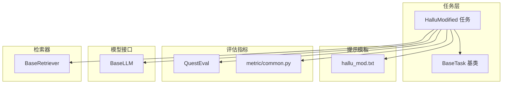
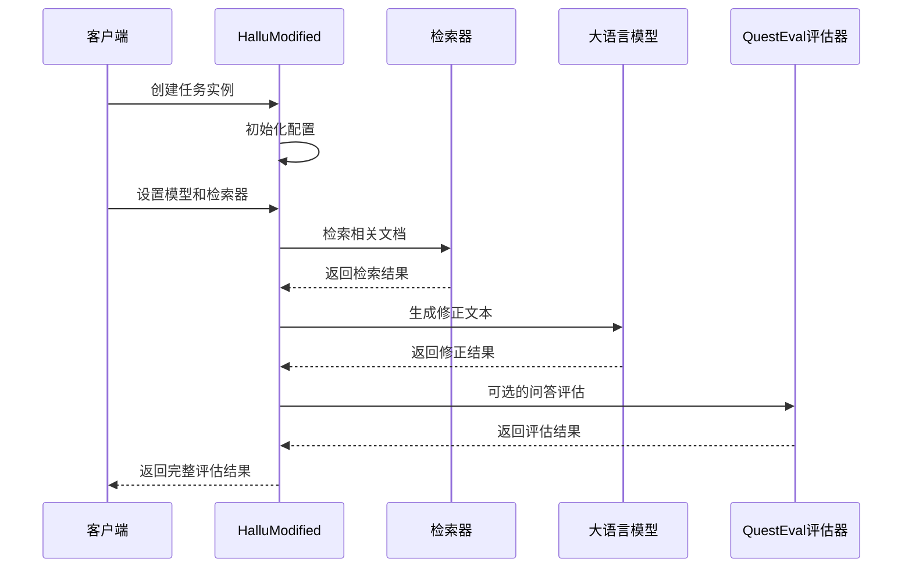
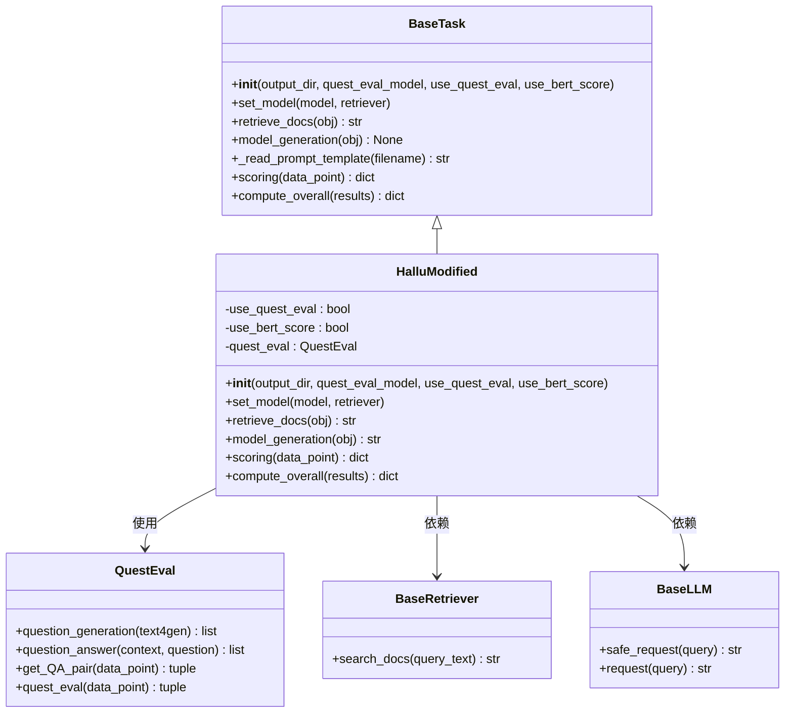
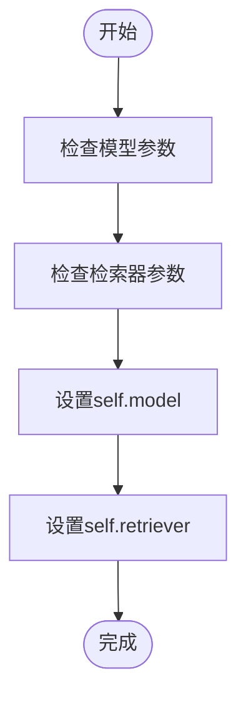
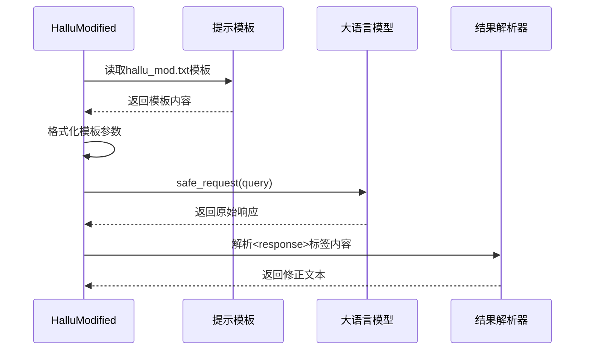
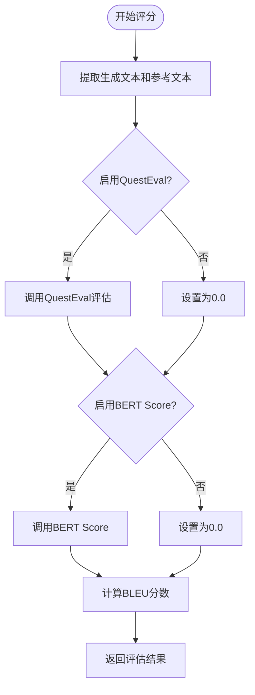
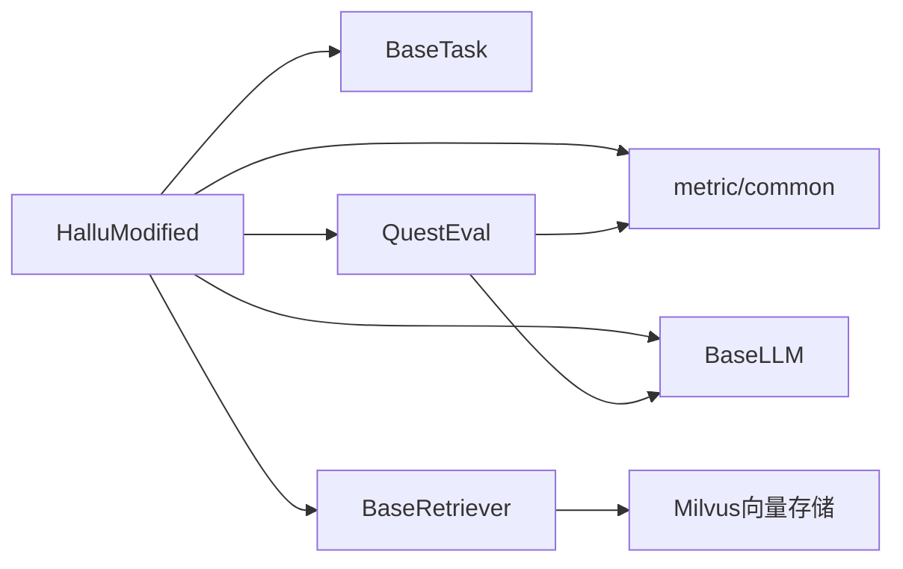

# 幻觉修正任务API

<cite>
**本文档引用的文件**
- [src/tasks/hallucinated_modified.py](file://src/tasks/hallucinated_modified.py)
- [src/tasks/base.py](file://src/tasks/base.py)
- [src/prompts/hallu_mod.txt](file://src/prompts/hallu_mod.txt)
- [src/metric/quest_eval.py](file://src/metric/quest_eval.py)
- [src/metric/common.py](file://src/metric/common.py)
- [src/llms/base.py](file://src/llms/base.py)
- [src/retrievers/base.py](file://src/retrievers/base.py)
- [src/quest_eval/HalluModified_quest_gt_save.json](file://src/quest_eval/HalluModified_quest_gt_save.json)
- [quick_start.py](file://quick_start.py)
- [README.md](file://README.md)
</cite>

## 目录
1. [简介](#简介)
2. [项目结构](#项目结构)
3. [核心组件](#核心组件)
4. [架构概览](#架构概览)
5. [详细组件分析](#详细组件分析)
6. [依赖关系分析](#依赖关系分析)
7. [性能考虑](#性能考虑)
8. [故障排除指南](#故障排除指南)
9. [结论](#结论)
10. [附录](#附录)

## 简介
幻觉修正任务类（HallucinatedModified）是CRUD-RAG基准测试框架中的一个专门任务，用于检测和修正大型语言模型生成文本中的幻觉信息。该任务通过检索相关文档来识别事实性错误，并生成更准确的修正版本。

## 项目结构
CRUD-RAG项目采用模块化设计，将不同功能组件分离到独立的包中：

**图表来源**
- [src/tasks/hallucinated_modified.py:14-124](file://src/tasks/hallucinated_modified.py#L14-L124)
- [src/tasks/base.py:13-74](file://src/tasks/base.py#L13-L74)

**章节来源**
- [src/tasks/hallucinated_modified.py:1-124](file://src/tasks/hallucinated_modified.py#L1-L124)
- [src/tasks/base.py:1-74](file://src/tasks/base.py#L1-L74)

## 核心组件
HalluModified类继承自BaseTask基类，实现了专门的幻觉检测和修正功能。其核心特性包括：

### 主要功能模块
- **幻觉检测**: 通过检索相关文档来识别事实性错误
- **修正建议生成**: 基于检索到的可靠信息生成修正版本
- **多指标评估**: 支持BLEU、ROUGE、BERT Score和QuestEval等多种评估指标
- **灵活配置**: 支持可选的QuestEval评估和BERT Score计算

### 关键配置选项
- `use_quest_eval`: 启用QuestEval问答评估机制
- `use_bert_score`: 启用BERT语义相似度评估
- `quest_eval_model`: QuestEval使用的模型名称
- `output_dir`: 输出目录路径

**章节来源**
- [src/tasks/hallucinated_modified.py:15-32](file://src/tasks/hallucinated_modified.py#L15-L32)
- [src/tasks/base.py:14-31](file://src/tasks/base.py#L14-L31)

## 架构概览
HalluModified任务采用分层架构设计，各组件职责清晰分离：

**图表来源**
- [src/tasks/hallucinated_modified.py:34-55](file://src/tasks/hallucinated_modified.py#L34-L55)
- [src/retrievers/base.py:133-140](file://src/retrievers/base.py#L133-L140)
- [src/llms/base.py:38-45](file://src/llms/base.py#L38-L45)

## 详细组件分析

### HalluModified类结构分析

**图表来源**
- [src/tasks/hallucinated_modified.py:14-124](file://src/tasks/hallucinated_modified.py#L14-L124)
- [src/tasks/base.py:13-74](file://src/tasks/base.py#L13-L74)
- [src/metric/quest_eval.py:23-152](file://src/metric/quest_eval.py#L23-L152)

### 构造函数详解

#### 参数说明
- `output_dir` (str): 输出目录，默认为'./output'
- `quest_eval_model` (str): QuestEval使用的模型名称，默认为"gpt-3.5-turbo"
- `use_quest_eval` (bool): 是否启用QuestEval评估，默认为False
- `use_bert_score` (bool): 是否启用BERT Score评估，默认为False

#### 初始化流程
1. 验证并创建输出目录
2. 根据配置决定是否初始化QuestEval评估器
3. 设置评估标志位

**章节来源**
- [src/tasks/hallucinated_modified.py:15-32](file://src/tasks/hallucinated_modified.py#L15-L32)
- [src/tasks/base.py:22-31](file://src/tasks/base.py#L22-L31)

### set_model方法

该方法负责设置任务所需的模型和检索器组件：

**图表来源**
- [src/tasks/hallucinated_modified.py:34-36](file://src/tasks/hallucinated_modified.py#L34-L36)

**章节来源**
- [src/tasks/hallucinated_modified.py:34-36](file://src/tasks/hallucinated_modified.py#L34-L36)

### retrieve_docs方法

此方法执行文档检索功能，返回与输入查询相关的上下文信息：

#### 处理流程
1. 从输入对象提取新闻开头文本
2. 调用检索器搜索相关文档
3. 清理检索结果格式
4. 返回标准化的上下文字符串

#### 数据处理细节
- 输入格式: `{"newsBeginning": "..."}`
- 输出格式: 标准化的检索文档字符串
- 格式清理: 移除特定的上下文信息标记

**章节来源**
- [src/tasks/hallucinated_modified.py:38-42](file://src/tasks/hallucinated_modified.py#L38-L42)

### model_generation方法

这是核心的修正生成逻辑，实现幻觉检测和修正：

**图表来源**
- [src/tasks/hallucinated_modified.py:44-55](file://src/tasks/hallucinated_modified.py#L44-L55)
- [src/prompts/hallu_mod.txt:1-23](file://src/prompts/hallu_mod.txt#L1-L23)

#### 方法实现细节
1. **错误处理**: 检查OpenAI请求失败的情况
2. **模板加载**: 动态读取hallu_mod.txt模板文件
3. **参数格式化**: 将输入数据格式化到模板中
4. **模型调用**: 使用安全请求方法避免异常中断
5. **结果解析**: 提取XML标签内的修正内容

**章节来源**
- [src/tasks/hallucinated_modified.py:44-55](file://src/tasks/hallucinated_modified.py#L44-L55)

### scoring方法

实现综合评估功能，计算多种质量指标：

**图表来源**
- [src/tasks/hallucinated_modified.py:66-103](file://src/tasks/hallucinated_modified.py#L66-L103)

#### 评估指标说明
- **BLEU分数**: 多精度级别的BLEU评分
- **ROUGE-L**: 基于最长公共子序列的召回率
- **BERT Score**: 语义相似度评分
- **QuestEval F1**: 基于问答对的F1分数
- **QuestEval召回率**: 问答对的召回率

**章节来源**
- [src/tasks/hallucinated_modified.py:66-103](file://src/tasks/hallucinated_modified.py#L66-L103)

### compute_overall方法

计算整体评估统计信息：

#### 统计计算逻辑
1. 初始化统计字典
2. 累加各项指标值
3. 计算平均值
4. 特殊处理QuestEval指标（按有效样本数计算）

**章节来源**
- [src/tasks/hallucinated_modified.py:105-122](file://src/tasks/hallucinated_modified.py#L105-L122)

## 依赖关系分析

### 外部依赖
- **QuestEval**: 基于GPT的问答评估系统
- **评估库**: BLEU、ROUGE等文本评估指标
- **BERT模型**: 语义相似度计算
- **Milvus向量数据库**: 文档检索

### 内部依赖关系

**图表来源**
- [src/tasks/hallucinated_modified.py:4-11](file://src/tasks/hallucinated_modified.py#L4-L11)
- [src/metric/quest_eval.py:10-11](file://src/metric/quest_eval.py#L10-L11)

**章节来源**
- [src/tasks/hallucinated_modified.py:1-12](file://src/tasks/hallucinated_modified.py#L1-L12)

## 性能考虑

### 计算复杂度分析
- **检索阶段**: O(n log n)，其中n为文档数量
- **模型生成**: O(m)，其中m为生成文本长度
- **评估阶段**: O(p)，其中p为评估样本数

### 优化建议
1. **缓存机制**: 利用QuestEval的预生成问答对
2. **批处理**: 对多个样本进行批量处理
3. **内存管理**: 合理控制生成文本大小
4. **并发处理**: 使用多线程提高处理效率

## 故障排除指南

### 常见问题及解决方案

#### 1. QuestEval评估失败
- **症状**: 评估返回0.0分数
- **原因**: GPT API调用失败或网络问题
- **解决方案**: 检查API密钥配置和网络连接

#### 2. 模型生成为空
- **症状**: 返回空字符串或错误信息
- **原因**: OpenAI请求失败或提示模板缺失
- **解决方案**: 验证模型配置和提示模板文件

#### 3. 检索结果不准确
- **症状**: 检索到的文档与主题无关
- **原因**: 检索参数设置不当
- **解决方案**: 调整similarity_top_k参数

**章节来源**
- [src/tasks/hallucinated_modified.py:45-46](file://src/tasks/hallucinated_modified.py#L45-L46)
- [src/metric/quest_eval.py:121-127](file://src/metric/quest_eval.py#L121-L127)

## 结论
HalluModified任务类提供了完整的幻觉检测和修正解决方案，通过结合检索增强和多指标评估，能够有效识别和修正大语言模型生成中的事实性错误。其模块化设计使得功能扩展和维护变得简单，同时提供了灵活的配置选项以适应不同的应用场景。

## 附录

### 使用示例

#### 基本使用流程
1. 创建HalluModified实例
2. 设置模型和检索器
3. 准备数据样本
4. 执行评估和修正
5. 分析评估结果

#### 配置选项说明
- `--task hallu_modified`: 指定使用幻觉修正任务
- `--quest_eval`: 启用QuestEval评估
- `--bert_score_eval`: 启用BERT Score评估
- `--retrieve_top_k`: 设置检索文档数量

**章节来源**
- [quick_start.py:94-102](file://quick_start.py#L94-L102)
- [README.md:85-105](file://README.md#L85-L105)

### 技术细节

#### 幻觉检测算法
- **基于检索的方法**: 通过相关文档验证事实准确性
- **问答对生成**: 自动从参考文本生成问答对
- **语义匹配**: 使用BERT进行语义相似度比较

#### 修正策略
- **约束生成**: 在提示中明确禁止引入无关信息
- **上下文驱动**: 基于检索到的相关文档进行修正
- **格式控制**: 严格控制输出格式确保可解析性