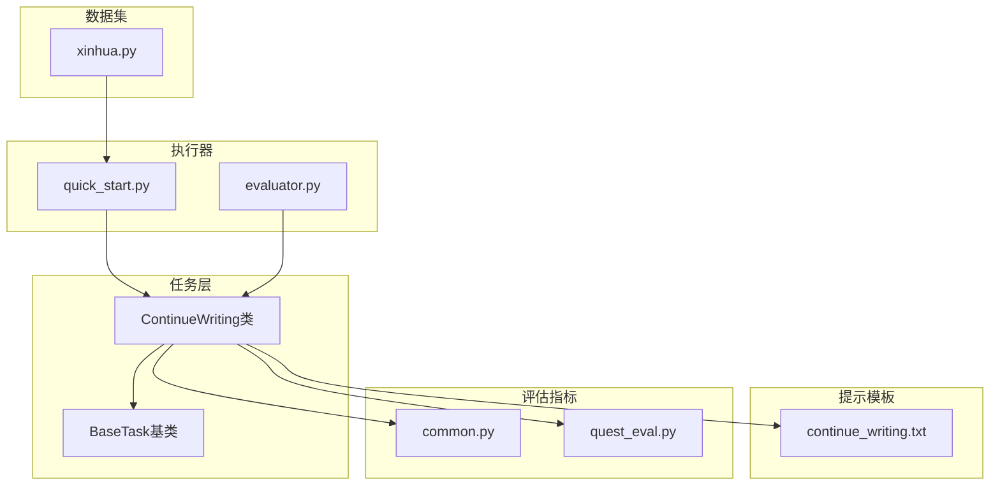
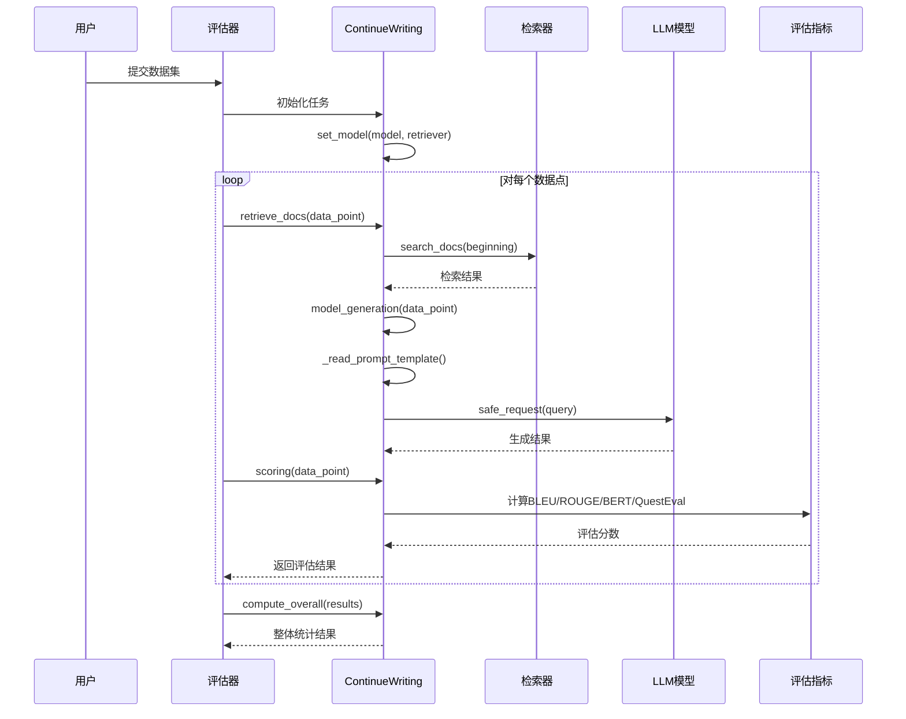
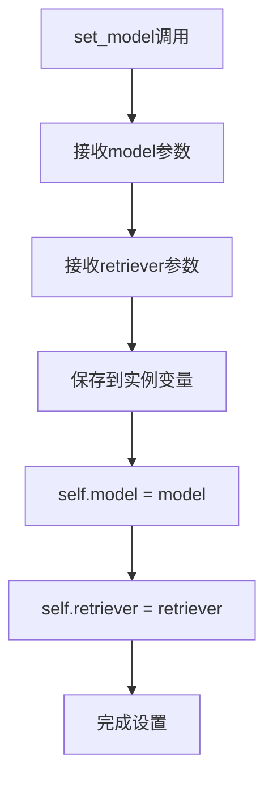
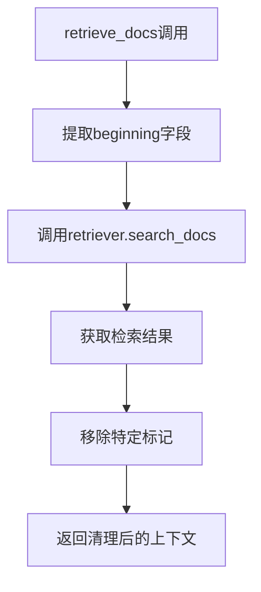
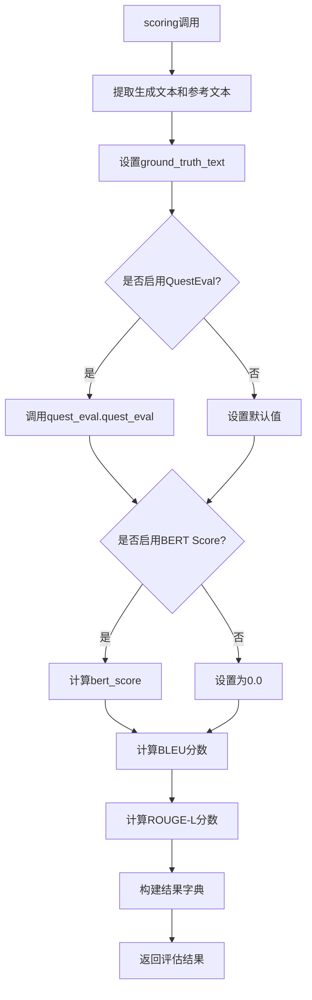
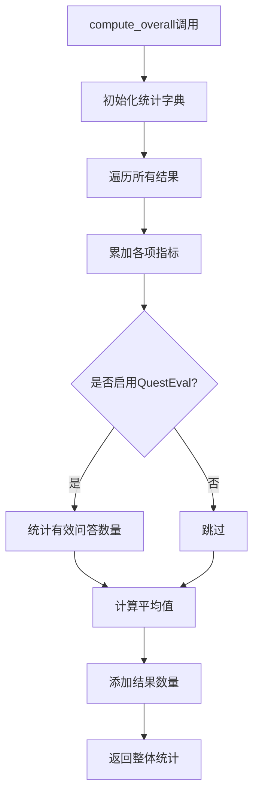
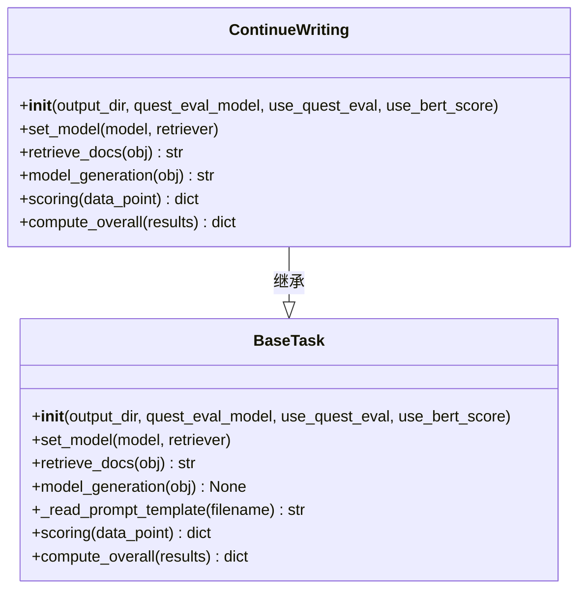
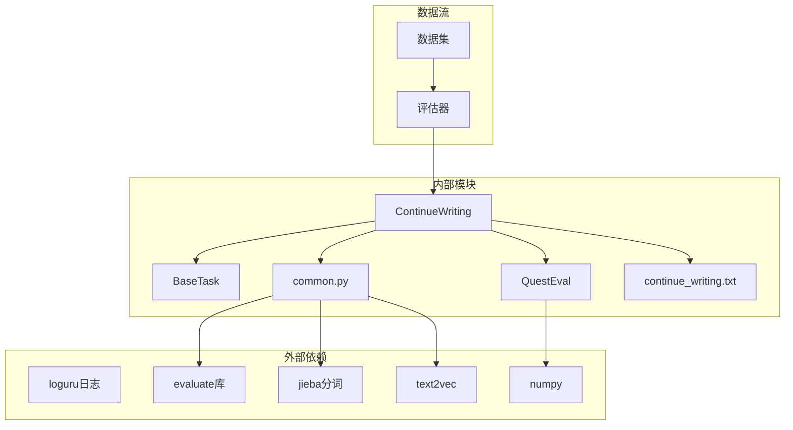

# 继续写作任务API

<cite>
**本文档引用的文件**
- [src/tasks/continue_writing.py](file://src/tasks/continue_writing.py)
- [src/tasks/base.py](file://src/tasks/base.py)
- [src/prompts/continue_writing.txt](file://src/prompts/continue_writing.txt)
- [src/metric/common.py](file://src/metric/common.py)
- [src/metric/quest_eval.py](file://src/metric/quest_eval.py)
- [quick_start.py](file://quick_start.py)
- [evaluator.py](file://evaluator.py)
- [src/datasets/xinhua.py](file://src/datasets/xinhua.py)
</cite>

## 目录
1. [简介](#简介)
2. [项目结构](#项目结构)
3. [核心组件](#核心组件)
4. [架构概览](#架构概览)
5. [详细组件分析](#详细组件分析)
6. [依赖关系分析](#依赖关系分析)
7. [性能考虑](#性能考虑)
8. [故障排除指南](#故障排除指南)
9. [结论](#结论)
10. [附录](#附录)

## 简介

继续写作任务类（ContinueWriting）是CRUD-RAG框架中的一个专门任务类，用于处理新闻续写场景。该类继承自BaseTask基类，实现了针对中文新闻续写的完整工作流程，包括文档检索、提示模板构建、模型生成和质量评估等功能。

该任务类支持多种评估指标，包括BLEU、ROUGE-L、BERT Score和基于问答的质量评估（QuestEval），能够对生成的续写文本进行全面的质量分析。

## 项目结构

继续写作任务在CRUD-RAG项目中的组织结构如下：



**图表来源**
- [src/tasks/continue_writing.py:1-119](file://src/tasks/continue_writing.py#L1-L119)
- [src/tasks/base.py:1-74](file://src/tasks/base.py#L1-L74)
- [src/prompts/continue_writing.txt:1-18](file://src/prompts/continue_writing.txt#L1-L18)

**章节来源**
- [src/tasks/continue_writing.py:1-119](file://src/tasks/continue_writing.py#L1-L119)
- [src/tasks/base.py:1-74](file://src/tasks/base.py#L1-L74)

## 核心组件

继续写作任务的核心组件包括：

### 继承关系
- **父类**: BaseTask（抽象基类）
- **子类**: ContinueWriting（具体实现）

### 主要功能模块
1. **文档检索模块**: 基于查询文本检索相关文档
2. **提示模板模块**: 构建适合中文新闻续写的提示模板
3. **模型生成模块**: 调用LLM进行文本续写
4. **质量评估模块**: 多维度评估生成质量
5. **结果汇总模块**: 计算整体评估指标

**章节来源**
- [src/tasks/continue_writing.py:13-119](file://src/tasks/continue_writing.py#L13-L119)
- [src/tasks/base.py:13-74](file://src/tasks/base.py#L13-L74)

## 架构概览

继续写作任务采用分层架构设计，实现了清晰的关注点分离：



**图表来源**
- [src/tasks/continue_writing.py:33-119](file://src/tasks/continue_writing.py#L33-L119)
- [evaluator.py:42-191](file://evaluator.py#L42-L191)

## 详细组件分析

### ContinueWriting类详细分析

#### 构造函数参数详解

| 参数名 | 类型 | 默认值 | 描述 |
|--------|------|--------|------|
| output_dir | str | './output' | 输出目录路径 |
| quest_eval_model | str | "gpt-3.5-turbo" | QuestEval使用的模型名称 |
| use_quest_eval | bool | False | 是否启用问答质量评估 |
| use_bert_score | bool | False | 是否启用BERT相似度评估 |

**章节来源**
- [src/tasks/continue_writing.py:14-31](file://src/tasks/continue_writing.py#L14-L31)

#### set_model方法

该方法负责设置任务所需的模型和检索器组件：



**图表来源**
- [src/tasks/continue_writing.py:33-35](file://src/tasks/continue_writing.py#L33-L35)

**章节来源**
- [src/tasks/continue_writing.py:33-35](file://src/tasks/continue_writing.py#L33-L35)

#### retrieve_docs方法

该方法实现文档检索功能，处理输入数据点并返回检索到的上下文：



**图表来源**
- [src/tasks/continue_writing.py:37-41](file://src/tasks/continue_writing.py#L37-L41)

**章节来源**
- [src/tasks/continue_writing.py:37-41](file://src/tasks/continue_writing.py#L37-L41)

#### model_generation方法

该方法负责生成续写文本，包含提示模板构建和模型调用：

```mermaid
flowchart TD
A[model_generation调用] --> B[读取提示模板]
B --> C[格式化模板参数]
C --> D[beginning_text = obj["beginning"]]
D --> E[search_documents = obj["retrieve_context"]]
E --> F[调用model.safe_request]
F --> G[解析响应内容]
G --> H[提取<response>标签内容]
H --> I[返回清理后的结果]
```

**图表来源**
- [src/tasks/continue_writing.py:43-51](file://src/tasks/continue_writing.py#L43-L51)

**章节来源**
- [src/tasks/continue_writing.py:43-51](file://src/tasks/continue_writing.py#L43-L51)

#### scoring方法

该方法实现多维度的质量评估，返回详细的评估结果：



**图表来源**
- [src/tasks/continue_writing.py:62-99](file://src/tasks/continue_writing.py#L62-L99)

**章节来源**
- [src/tasks/continue_writing.py:62-99](file://src/tasks/continue_writing.py#L62-L99)

#### compute_overall方法

该方法计算整体评估统计结果：



**图表来源**
- [src/tasks/continue_writing.py:101-119](file://src/tasks/continue_writing.py#L101-L119)

**章节来源**
- [src/tasks/continue_writing.py:101-119](file://src/tasks/continue_writing.py#L101-L119)

### BaseTask基类分析

BaseTask作为抽象基类，提供了通用的任务接口定义：



**图表来源**
- [src/tasks/base.py:13-74](file://src/tasks/base.py#L13-L74)
- [src/tasks/continue_writing.py:13-119](file://src/tasks/continue_writing.py#L13-L119)

**章节来源**
- [src/tasks/base.py:13-74](file://src/tasks/base.py#L13-L74)

### 评估指标实现分析

#### BLEU评分
- 使用jieba分词器进行中文分词
- 支持BLEU-1到BLEU-4的多级别评分
- 包含惩罚机制处理短文本问题

#### ROUGE-L评分
- 基于最长公共子序列的召回率计算
- 适用于摘要和续写任务的长度评估

#### BERT Score
- 使用text2vec相似度模型
- 计算语义层面的文本相似度
- 需要网络连接到Hugging Face

#### QuestEval评估
- 基于问答对的质量评估
- 自动从参考文本生成问题
- 计算问答F1分数和召回率

**章节来源**
- [src/metric/common.py:23-86](file://src/metric/common.py#L23-L86)
- [src/metric/quest_eval.py:23-152](file://src/metric/quest_eval.py#L23-L152)

## 依赖关系分析

继续写作任务的依赖关系图：



**图表来源**
- [src/tasks/continue_writing.py:1-11](file://src/tasks/continue_writing.py#L1-L11)
- [src/metric/common.py:7-10](file://src/metric/common.py#L7-L10)
- [src/metric/quest_eval.py:1-11](file://src/metric/quest_eval.py#L1-L11)

**章节来源**
- [src/tasks/continue_writing.py:1-11](file://src/tasks/continue_writing.py#L1-L11)
- [src/metric/common.py:1-117](file://src/metric/common.py#L1-L117)
- [src/metric/quest_eval.py:1-152](file://src/metric/quest_eval.py#L1-L152)

## 性能考虑

### 文本生成质量最佳实践

1. **提示模板优化**
   - 使用明确的指令指导模型生成连贯的续写文本
   - 控制续写长度与原文相当，避免过度扩展
   - 强调避免重复原文内容的重要性

2. **检索质量控制**
   - 选择合适的检索器参数（top_k等）
   - 确保检索到的文档与查询主题高度相关
   - 合理处理检索结果的格式化

3. **模型参数调优**
   - 温度参数控制生成多样性（建议0.1-0.3）
   - 最大新令牌数控制输出长度（建议1280左右）
   - 上下文窗口大小限制影响检索文档数量

4. **评估指标选择**
   - BLEU适合短文本的精确匹配评估
   - ROUGE-L适合长文本的语义相似度评估
   - BERT Score适合语义层面的深度相似度
   - QuestEval适合事实准确性的综合评估

### 性能优化建议

1. **批量处理**
   - 使用多线程并发处理多个数据点
   - 实现断点续评功能，避免重复计算

2. **内存管理**
   - 合理控制生成文本的长度
   - 及时释放不需要的大对象

3. **缓存策略**
   - 缓存QuestEval生成的问题集合
   - 缓存BERT相似度计算结果

**章节来源**
- [quick_start.py:14-51](file://quick_start.py#L14-L51)
- [evaluator.py:158-191](file://evaluator.py#L158-L191)

## 故障排除指南

### 常见问题及解决方案

1. **提示模板未找到**
   - 检查src/prompts/continue_writing.txt文件是否存在
   - 确认文件路径和权限设置正确

2. **QuestEval初始化失败**
   - 检查配置文件加载是否成功
   - 确认网络连接正常（BERT Score需要网络访问）

3. **模型调用异常**
   - 检查模型参数配置
   - 验证API密钥和权限设置
   - 监控请求频率限制

4. **评估结果为空**
   - 检查生成文本的有效性
   - 验证数据点格式的正确性
   - 确认评估指标计算的异常处理

### 调试技巧

1. **启用详细日志**
   ```python
   # 在quick_start.py中添加
   import logging
   logging.basicConfig(level=logging.DEBUG)
   ```

2. **检查中间结果**
   - 打印检索到的上下文内容
   - 验证提示模板的格式化结果
   - 监控生成文本的长度和质量

3. **逐步调试**
   - 单独测试retrieve_docs方法
   - 测试model_generation方法的输出
   - 验证scoring方法的计算逻辑

**章节来源**
- [src/tasks/continue_writing.py:53-60](file://src/tasks/continue_writing.py#L53-L60)
- [src/metric/quest_eval.py:13-28](file://src/metric/quest_eval.py#L13-L28)
- [evaluator.py:76-107](file://evaluator.py#L76-L107)

## 结论

继续写作任务类（ContinueWriting）是一个功能完整、设计良好的文本生成任务实现。它通过清晰的分层架构、完善的错误处理机制和全面的评估指标，为中文新闻续写任务提供了可靠的解决方案。

该类的主要优势包括：
- **模块化设计**: 清晰的功能分离，便于维护和扩展
- **灵活配置**: 支持多种评估指标和模型配置
- **健壮性**: 完善的错误处理和异常恢复机制
- **可扩展性**: 基于BaseTask的继承架构，易于添加新的评估指标

在实际应用中，建议根据具体的业务需求调整模型参数和评估指标权重，以获得最佳的生成效果。

## 附录

### 使用示例

#### 基本使用流程

```python
# 1. 创建ContinueWriting任务实例
task = ContinueWriting(
    output_dir='./output',
    use_quest_eval=True,
    use_bert_score=True
)

# 2. 设置模型和检索器
task.set_model(model, retriever)

# 3. 处理单个数据点
data_point = {
    "ID": "test_001",
    "beginning": "这是一个新闻开头...",
    "continuing": "这是期望的续写内容..."
}

# 4. 执行文档检索
retrieve_context = task.retrieve_docs(data_point)

# 5. 生成续写文本
generated_text = task.model_generation({
    **data_point,
    "retrieve_context": retrieve_context
})

# 6. 评估生成质量
evaluation_result = task.scoring({
    "generated_text": generated_text,
    "continuing": data_point["continuing"],
    "ID": data_point["ID"]
})
```

#### 命令行使用

```bash
# 基本继续写作任务
python quick_start.py --task continuing_writing --model_name qwen7b

# 启用QuestEval评估
python quick_start.py --task continuing_writing --model_name gpt-3.5-turbo --quest_eval

# 启用BERT Score评估
python quick_start.py --task continuing_writing --model_name gpt-3.5-turbo --bert_score_eval
```

#### 数据格式要求

继续写作任务期望的数据点包含以下字段：
- `ID`: 数据点唯一标识符
- `beginning`: 需要续写的起始文本
- `continuing`: 期望的续写参考文本
- `type`: 数据类型标识（doc/gen/kno/num）

**章节来源**
- [quick_start.py:91-110](file://quick_start.py#L91-L110)
- [src/datasets/xinhua.py:32-54](file://src/datasets/xinhua.py#L32-L54)