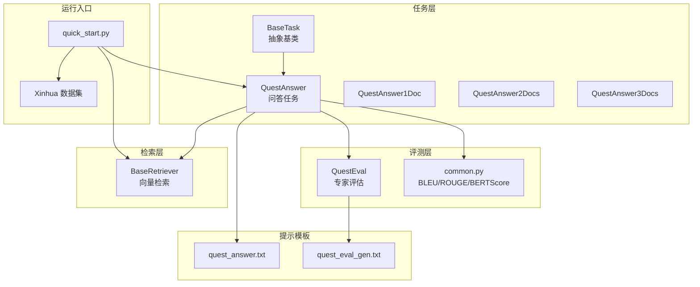
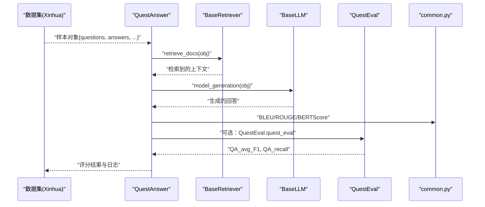
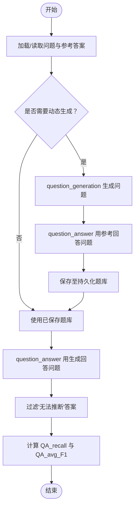
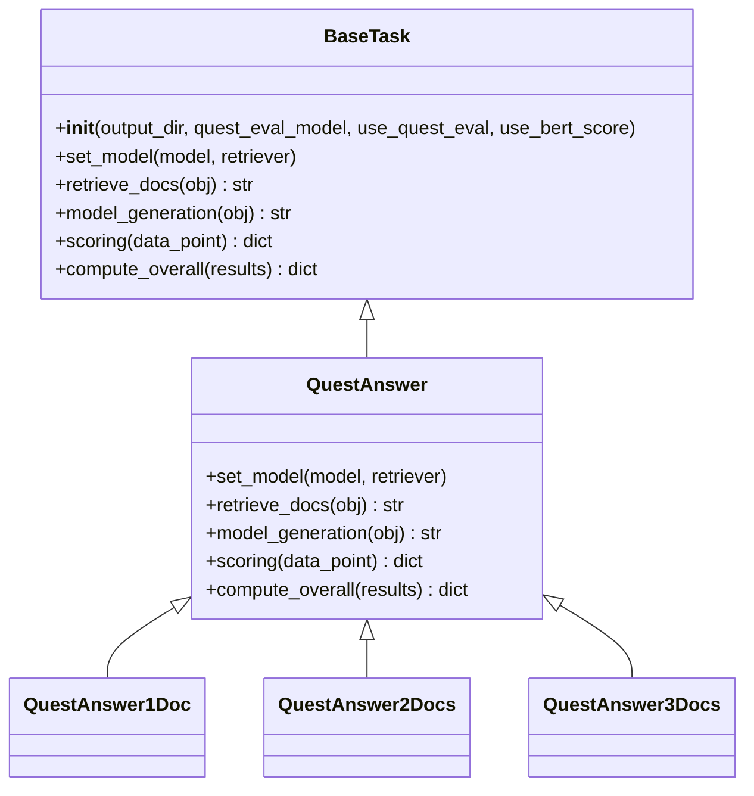
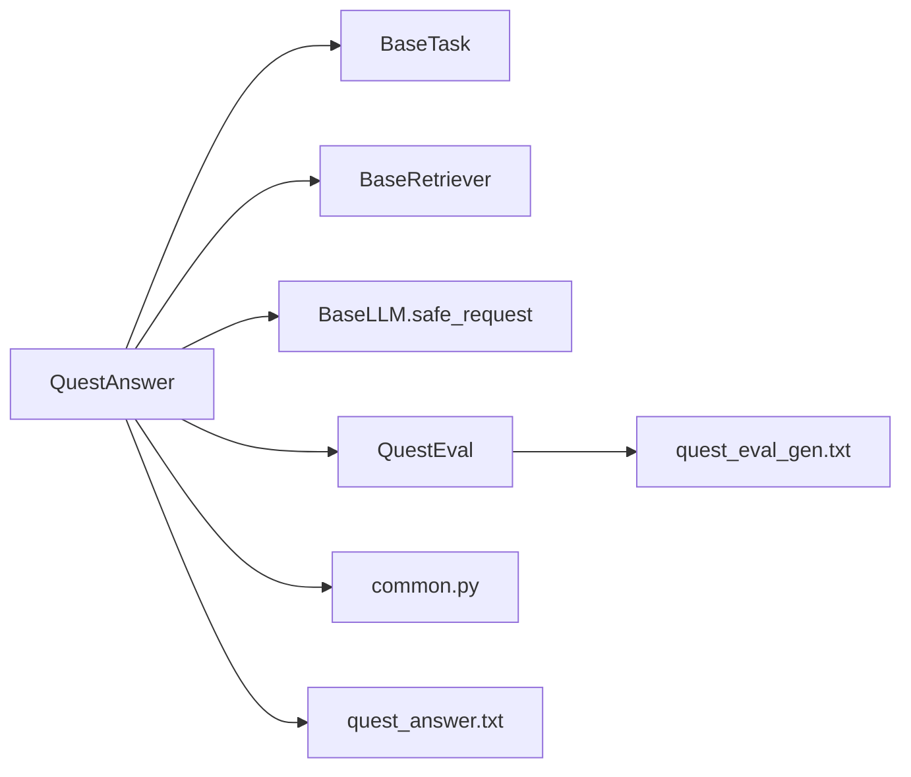

# 问答系统任务API

<cite>
**本文引用的文件**
- [src/tasks/quest_answer.py](file://src/tasks/quest_answer.py)
- [src/tasks/base.py](file://src/tasks/base.py)
- [src/metric/quest_eval.py](file://src/metric/quest_eval.py)
- [src/metric/common.py](file://src/metric/common.py)
- [src/retrievers/base.py](file://src/retrievers/base.py)
- [src/llms/base.py](file://src/llms/base.py)
- [src/prompts/quest_answer.txt](file://src/prompts/quest_answer.txt)
- [src/prompts/quest_eval_gen.txt](file://src/prompts/quest_eval_gen.txt)
- [quick_start.py](file://quick_start.py)
- [src/datasets/xinhua.py](file://src/datasets/xinhua.py)
</cite>

## 目录
1. [简介](#简介)
2. [项目结构](#项目结构)
3. [核心组件](#核心组件)
4. [架构总览](#架构总览)
5. [详细组件分析](#详细组件分析)
6. [依赖分析](#依赖分析)
7. [性能考虑](#性能考虑)
8. [故障排查指南](#故障排查指南)
9. [结论](#结论)
10. [附录](#附录)

## 简介
本文件面向问答系统任务类的API文档，重点围绕 QuestAnswer 及其变体 QuestAnswer1Doc/2Docs/3Docs 的实现与使用，详细说明：
- 构造函数参数与初始化流程
- set_model 方法用于注入模型与检索器
- retrieve_docs 多文档检索流程
- model_generation 问答对生成流程
- scoring 评分与指标聚合逻辑
- 特殊配置项 quest_eval_model 的作用与影响
- 与 BaseTask 的继承关系与职责划分
- 问答质量评估与答案准确性验证的技术细节
- 完整使用示例与最佳实践

## 项目结构
与问答任务直接相关的模块与文件如下：
- 任务层：src/tasks/quest_answer.py、src/tasks/base.py
- 评测层：src/metric/quest_eval.py、src/metric/common.py
- 检索层：src/retrievers/base.py
- 提示模板：src/prompts/quest_answer.txt、src/prompts/quest_eval_gen.txt
- 快速开始与数据集：quick_start.py、src/datasets/xinhua.py

**图表来源**
- [src/tasks/quest_answer.py:14-134](file://src/tasks/quest_answer.py#L14-L134)
- [src/tasks/base.py:13-74](file://src/tasks/base.py#L13-L74)
- [src/metric/quest_eval.py:23-152](file://src/metric/quest_eval.py#L23-L152)
- [src/metric/common.py:23-86](file://src/metric/common.py#L23-L86)
- [src/retrievers/base.py:16-142](file://src/retrievers/base.py#L16-L142)
- [src/prompts/quest_answer.txt:1-15](file://src/prompts/quest_answer.txt#L1-L15)
- [src/prompts/quest_eval_gen.txt:1-10](file://src/prompts/quest_eval_gen.txt#L1-L10)
- [quick_start.py:102-108](file://quick_start.py#L102-L108)
- [src/datasets/xinhua.py:32-54](file://src/datasets/xinhua.py#L32-L54)

**章节来源**
- [src/tasks/quest_answer.py:14-134](file://src/tasks/quest_answer.py#L14-L134)
- [src/tasks/base.py:13-74](file://src/tasks/base.py#L13-L74)
- [src/metric/quest_eval.py:23-152](file://src/metric/quest_eval.py#L23-L152)
- [src/metric/common.py:23-86](file://src/metric/common.py#L23-L86)
- [src/retrievers/base.py:16-142](file://src/retrievers/base.py#L16-L142)
- [src/prompts/quest_answer.txt:1-15](file://src/prompts/quest_answer.txt#L1-L15)
- [src/prompts/quest_eval_gen.txt:1-10](file://src/prompts/quest_eval_gen.txt#L1-L10)
- [quick_start.py:102-108](file://quick_start.py#L102-L108)
- [src/datasets/xinhua.py:32-54](file://src/datasets/xinhua.py#L32-L54)

## 核心组件
- QuestAnswer：问答任务的核心实现，负责检索、生成与评分。
- QuestAnswer1Doc/2Docs/3Docs：基于 QuestAnswer 的具体变体，用于控制检索上下文的文档数量。
- BaseTask：抽象基类，定义通用接口与基础能力（如 QuestEval 初始化、通用评分框架）。
- QuestEval：专家评估器，基于外部大模型生成问题与答案，计算 QA_avg_F1 与 QA_recall。
- BaseRetriever：向量检索器，提供多文档检索能力。
- BaseLLM：语言模型抽象，提供安全请求接口 safe_request。

**章节来源**
- [src/tasks/quest_answer.py:14-134](file://src/tasks/quest_answer.py#L14-L134)
- [src/tasks/base.py:13-74](file://src/tasks/base.py#L13-L74)
- [src/metric/quest_eval.py:23-152](file://src/metric/quest_eval.py#L23-L152)
- [src/retrievers/base.py:16-142](file://src/retrievers/base.py#L16-L142)
- [src/llms/base.py:6-47](file://src/llms/base.py#L6-L47)

## 架构总览
问答系统任务的端到端流程如下：
- 数据加载：通过 Xinhua 数据集读取问答样本（包含问题、答案、可选检索上下文）。
- 检索：使用 BaseRetriever 对问题进行向量检索，得到多段上下文。
- 生成：将问题与检索上下文拼接到提示模板，调用模型生成回答。
- 评分：计算 BLEU、ROUGE-L、BERTScore；若启用专家评估，则调用 QuestEval 计算 QA_avg_F1 与 QA_recall。
- 聚合：对结果进行整体统计与平均。

**图表来源**
- [src/datasets/xinhua.py:32-54](file://src/datasets/xinhua.py#L32-L54)
- [src/tasks/quest_answer.py:38-101](file://src/tasks/quest_answer.py#L38-L101)
- [src/retrievers/base.py:133-140](file://src/retrievers/base.py#L133-L140)
- [src/llms/base.py:38-45](file://src/llms/base.py#L38-L45)
- [src/metric/quest_eval.py:92-129](file://src/metric/quest_eval.py#L92-L129)
- [src/metric/common.py:23-86](file://src/metric/common.py#L23-L86)

## 详细组件分析

### QuestAnswer 类 API 详解
- 构造函数
  - 参数
    - output_dir: 输出目录，默认为 "./output"，不存在则自动创建
    - quest_eval_model: 专家评估使用的模型名称，默认 "gpt-3.5-turbo"
    - use_quest_eval: 是否启用专家评估，默认 False
    - use_bert_score: 是否启用 BERTScore，默认 False
  - 行为
    - 初始化 QuestEval（当 use_quest_eval 为真）
    - 初始化指标开关
  - 注意
    - QuestAnswer1Doc/2Docs/3Docs 仅复用该初始化逻辑，不额外扩展

- set_model(model, retriever)
  - 作用：注入模型与检索器实例，供后续流程使用
  - 参数
    - model: 实现 BaseLLM 接口的语言模型
    - retriever: 实现 BaseRetriever 接口的检索器

- retrieve_docs(obj: dict) -> str
  - 输入：样本对象，要求包含键 "questions"
  - 流程
    - 从对象中提取问题
    - 调用 retriever.search_docs 获取检索结果
    - 清洗检索结果字符串（去除特定前缀）
  - 返回：清洗后的检索上下文字符串

- model_generation(obj: dict)
  - 输入：样本对象，要求包含键 "questions" 与 "retrieve_context"
  - 流程
    - 读取提示模板 quest_answer.txt
    - 使用模板格式化问题与检索上下文
    - 调用模型 safe_request 发送请求
    - 解析响应，提取 <response>...</response> 区间内的文本作为最终回答
  - 返回：生成的回答文本（去空白）

- scoring(data_point: dict) -> dict
  - 输入：包含 "generated_text" 与 "answers" 的字典
  - 流程
    - 若启用专家评估：调用 QuestEval.quest_eval 计算 QA_avg_F1 与 QA_recall，并返回 quest_eval_save
    - 若启用 BERTScore：调用 bert_score 计算相似度
    - 计算 BLEU-avg/1/2/3/4 与 ROUGE-L
    - 记录生成长度与评估时间戳
  - 返回：包含 metrics、log、valid 的字典

- compute_overall(results: list[dict]) -> dict
  - 输入：多个样本的评分结果
  - 流程
    - 对各项指标求和并计算平均
    - 当启用专家评估时，仅对有效问答样本（quest_eval_save 中 questions_gt 非空）计算 QA_avg_F1 与 QA_recall 的平均值
  - 返回：包含各项指标均值与样本数的汇总字典

- 继承关系
  - QuestAnswer 继承自 BaseTask，复用其初始化与通用评分框架
  - QuestAnswer1Doc/2Docs/3Docs 通过 super() 调用父类初始化，保持一致行为

**章节来源**
- [src/tasks/quest_answer.py:14-134](file://src/tasks/quest_answer.py#L14-L134)
- [src/tasks/base.py:13-74](file://src/tasks/base.py#L13-L74)
- [src/metric/quest_eval.py:92-129](file://src/metric/quest_eval.py#L92-L129)
- [src/metric/common.py:23-86](file://src/metric/common.py#L23-L86)

### 专家评估 QuestEval 技术细节
- 角色与输入
  - 输入：样本对象，包含 "generated_text" 与 "ground_truth_text"
  - 输出：问题列表、基于参考文本生成的答案、基于生成文本生成的答案
- 关键步骤
  - 从预置或持久化的题库中获取问题与参考答案（若缺失则动态生成）
  - 过滤“无法推断”的答案，计算召回率与平均 F1
- 指标
  - QA_recall：有效问题回答中“无法推断”比例的补集
  - QA_avg_F1：有效问题下参考答案与生成答案的词粒度 F1 平均值
- 异常处理
  - 任何异常都会记录警告并返回空结构，保证评分流程稳定

**图表来源**
- [src/metric/quest_eval.py:73-129](file://src/metric/quest_eval.py#L73-L129)

**章节来源**
- [src/metric/quest_eval.py:23-152](file://src/metric/quest_eval.py#L23-L152)

### 提示模板与数据处理
- quest_answer.txt
  - 用途：将问题与检索上下文拼接，引导模型在 <response>...</response> 区间内输出答案
  - 位置：src/prompts/quest_answer.txt
- quest_eval_gen.txt
  - 用途：指导专家评估器从参考文本中抽取关键信息并生成问题
  - 位置：src/prompts/quest_eval_gen.txt

**章节来源**
- [src/prompts/quest_answer.txt:1-15](file://src/prompts/quest_answer.txt#L1-L15)
- [src/prompts/quest_eval_gen.txt:1-10](file://src/prompts/quest_eval_gen.txt#L1-L10)

### 与 BaseTask 的关系与继承实现
- BaseTask 定义了统一的初始化、评分框架与通用接口
- QuestAnswer 复用 BaseTask 的 QuestEval 初始化逻辑，并覆盖检索、生成与评分细节
- QuestAnswer1Doc/2Docs/3Docs 通过继承保持一致的接口与行为

**图表来源**
- [src/tasks/base.py:13-74](file://src/tasks/base.py#L13-L74)
- [src/tasks/quest_answer.py:14-134](file://src/tasks/quest_answer.py#L14-L134)

**章节来源**
- [src/tasks/base.py:13-74](file://src/tasks/base.py#L13-L74)
- [src/tasks/quest_answer.py:14-134](file://src/tasks/quest_answer.py#L14-L134)

## 依赖分析
- QuestAnswer 依赖
  - BaseTask：继承与通用初始化
  - BaseRetriever：检索多文档上下文
  - BaseLLM.safe_request：安全地调用模型生成回答
  - QuestEval：可选的专家评估
  - common.py：BLEU、ROUGE-L、BERTScore
  - 提示模板：quest_answer.txt
- QuestEval 依赖
  - BaseLLM（继承自 GPT）：调用外部模型生成问题与答案
  - 提示模板：quest_eval_gen.txt
  - 预置题库：src/quest_eval/{task}_quest_gt_save.json

**图表来源**
- [src/tasks/quest_answer.py:14-134](file://src/tasks/quest_answer.py#L14-L134)
- [src/tasks/base.py:13-74](file://src/tasks/base.py#L13-L74)
- [src/retrievers/base.py:16-142](file://src/retrievers/base.py#L16-L142)
- [src/llms/base.py:6-47](file://src/llms/base.py#L6-L47)
- [src/metric/quest_eval.py:23-152](file://src/metric/quest_eval.py#L23-L152)
- [src/metric/common.py:23-86](file://src/metric/common.py#L23-L86)
- [src/prompts/quest_answer.txt:1-15](file://src/prompts/quest_answer.txt#L1-L15)
- [src/prompts/quest_eval_gen.txt:1-10](file://src/prompts/quest_eval_gen.txt#L1-L10)

**章节来源**
- [src/tasks/quest_answer.py:14-134](file://src/tasks/quest_answer.py#L14-L134)
- [src/tasks/base.py:13-74](file://src/tasks/base.py#L13-L74)
- [src/metric/quest_eval.py:23-152](file://src/metric/quest_eval.py#L23-L152)
- [src/metric/common.py:23-86](file://src/metric/common.py#L23-L86)
- [src/retrievers/base.py:16-142](file://src/retrievers/base.py#L16-L142)
- [src/llms/base.py:6-47](file://src/llms/base.py#L6-L47)
- [src/prompts/quest_answer.txt:1-15](file://src/prompts/quest_answer.txt#L1-L15)
- [src/prompts/quest_eval_gen.txt:1-10](file://src/prompts/quest_eval_gen.txt#L1-L10)

## 性能考虑
- 检索效率
  - BaseRetriever.search_docs 会返回多段上下文，建议合理设置 similarity_top_k 控制检索数量
  - 向量化索引构建与增量添加可能耗时较长，首次运行时建议开启构建流程
- 生成稳定性
  - BaseLLM.safe_request 提供异常兜底，避免单次请求失败导致整体中断
- 评测开销
  - 启用 QuestEval 会额外调用外部模型生成问题与答案，带来显著延迟
  - BERTScore 需要网络连接与本地缓存，建议在网络可用环境下使用
- 批处理与并发
  - quick_start.py 支持多线程执行，可通过 --num_threads 调整并发度

**章节来源**
- [src/retrievers/base.py:133-140](file://src/retrievers/base.py#L133-L140)
- [src/llms/base.py:38-45](file://src/llms/base.py#L38-L45)
- [quick_start.py:102-108](file://quick_start.py#L102-L108)

## 故障排查指南
- 专家评估未生效
  - 检查 use_quest_eval 是否为 True
  - 确认 quest_eval_model 可用且配置正确
  - 查看 QuestEval.quest_eval 的异常日志
- BERTScore 为 0 或报错
  - 确认网络可达与本地缓存可用
  - 检查输入文本是否为空
- 生成回答为空
  - 检查提示模板是否存在
  - 确认模型 safe_request 返回非空
- 检索结果异常
  - 检查 similarity_top_k 设置
  - 确认向量化索引已成功构建或加载

**章节来源**
- [src/tasks/quest_answer.py:63-101](file://src/tasks/quest_answer.py#L63-L101)
- [src/metric/quest_eval.py:92-129](file://src/metric/quest_eval.py#L92-L129)
- [src/metric/common.py:75-86](file://src/metric/common.py#L75-L86)
- [src/retrievers/base.py:133-140](file://src/retrievers/base.py#L133-L140)

## 结论
QuestAnswer 将检索、生成与评分整合为统一的任务流，支持灵活的评估策略（BLEU/ROUGE/BERTScore 与专家评估）。通过与 BaseTask 的继承关系，实现了良好的可扩展性与一致性。结合快速开始脚本与数据集封装，用户可以便捷地构建问答系统并进行专业评估。

## 附录

### 使用示例（命令行）
- 构建向量化索引（首次运行）
  - python quick_start.py --task quest_answer --construct_index
- 运行问答任务（可选启用专家评估与 BERTScore）
  - python quick_start.py --task quest_answer --quest_eval --bert_score_eval
- 指定检索器与集合名称
  - --retriever_name base --collection_name docs_80k_chuncksize_128_0 --retrieve_top_k 8
- 指定模型与温度
  - --model_name gpt-3.5-turbo --temperature 0.1 --max_new_tokens 1280

**章节来源**
- [quick_start.py:102-108](file://quick_start.py#L102-L108)
- [src/datasets/xinhua.py:32-54](file://src/datasets/xinhua.py#L32-L54)

### quest_eval_model 参数说明
- 作用：指定专家评估所使用的模型名称（例如 "gpt-3.5-turbo"）
- 影响：决定 QuestEval 在生成问题与回答时的推理能力与风格
- 注意：该参数由 BaseTask 初始化 QuestEval 时传入，QuestAnswer 通过构造函数透传

**章节来源**
- [src/tasks/base.py:27-31](file://src/tasks/base.py#L27-L31)
- [src/tasks/quest_answer.py:28-32](file://src/tasks/quest_answer.py#L28-L32)