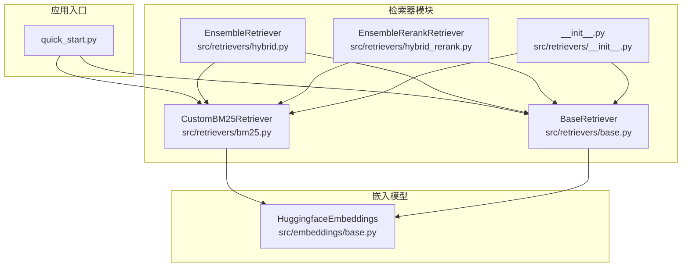
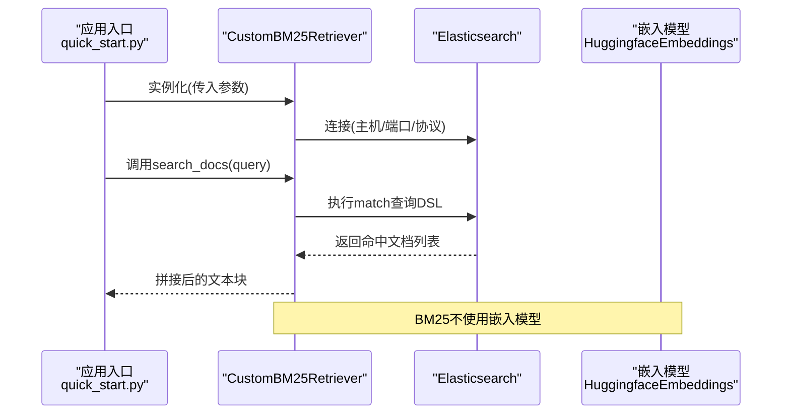
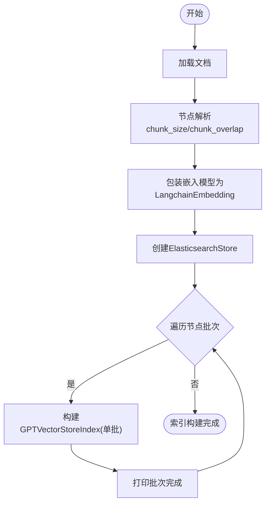
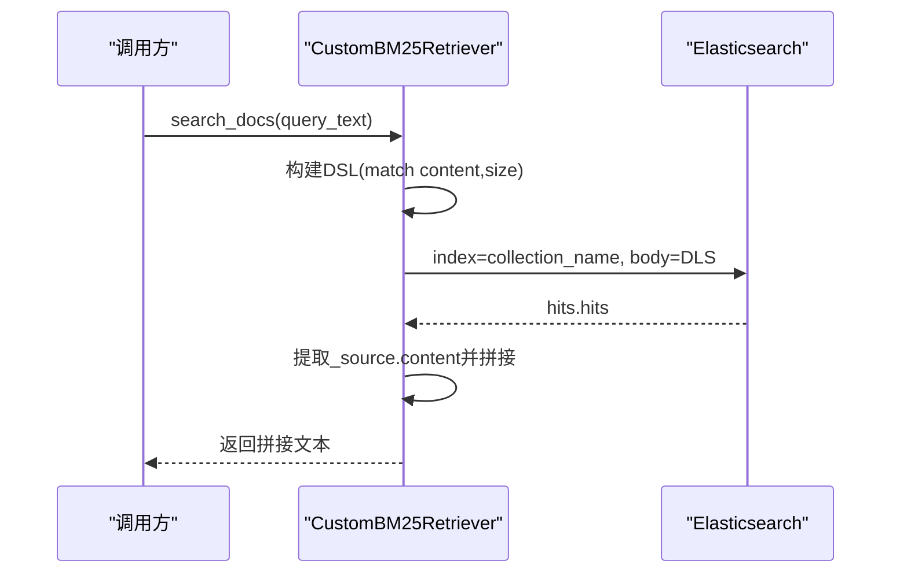
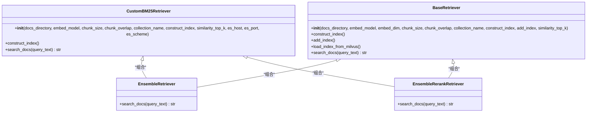

# BM25检索器API

<cite>
**本文引用的文件**
- [bm25.py](file://src/retrievers/bm25.py)
- [base.py](file://src/retrievers/base.py)
- [__init__.py](file://src/retrievers/__init__.py)
- [quick_start.py](file://quick_start.py)
- [config.py](file://src/configs/config.py)
- [base.py](file://src/embeddings/base.py)
- [hybrid.py](file://src/retrievers/hybrid.py)
- [hybrid_rerank.py](file://src/retrievers/hybrid_rerank.py)
- [README.md](file://README.md)
</cite>

## 目录
1. [简介](#简介)
2. [项目结构](#项目结构)
3. [核心组件](#核心组件)
4. [架构总览](#架构总览)
5. [详细组件分析](#详细组件分析)
6. [依赖关系分析](#依赖关系分析)
7. [性能考量](#性能考量)
8. [故障排查指南](#故障排查指南)
9. [结论](#结论)
10. [附录](#附录)

## 简介
本文件面向开发者，系统化地介绍BM25检索器的API与实现细节，重点覆盖以下方面：
- CustomBM25Retriever类的构造参数、初始化流程与核心方法
- BM25关键词检索的实现原理、Elasticsearch集成方式与索引构建流程
- search_docs方法的查询参数、返回格式与性能优化建议
- 配置选项、适用场景与与其他检索策略的对比
- Elasticsearch连接配置、索引管理与查询DSL构建
- 完整使用指南与最佳实践

## 项目结构
BM25检索器位于src/retrievers子模块中，并通过统一入口导出；其在快速启动脚本中被直接实例化使用；嵌入模型来自src/embeddings子模块；混合检索策略（Ensemble）与重排序（Rerank）策略会组合BM25与向量检索结果。

图表来源
- [bm25.py:14-92](file://src/retrievers/bm25.py#L14-L92)
- [base.py:16-142](file://src/retrievers/base.py#L16-L142)
- [__init__.py:1-4](file://src/retrievers/__init__.py#L1-L4)
- [quick_start.py:61-89](file://quick_start.py#L61-L89)
- [base.py:14-88](file://src/embeddings/base.py#L14-L88)
- [hybrid.py:13-81](file://src/retrievers/hybrid.py#L13-L81)
- [hybrid_rerank.py:26-81](file://src/retrievers/hybrid_rerank.py#L26-L81)

章节来源
- [bm25.py:14-92](file://src/retrievers/bm25.py#L14-L92)
- [base.py:16-142](file://src/retrievers/base.py#L16-L142)
- [__init__.py:1-4](file://src/retrievers/__init__.py#L1-L4)
- [quick_start.py:61-89](file://quick_start.py#L61-L89)
- [base.py:14-88](file://src/embeddings/base.py#L14-L88)
- [hybrid.py:13-81](file://src/retrievers/hybrid.py#L13-L81)
- [hybrid_rerank.py:26-81](file://src/retrievers/hybrid_rerank.py#L26-L81)

## 核心组件
- CustomBM25Retriever：基于Elasticsearch的BM25关键词检索器，支持按需构建索引与执行关键词匹配查询。
- BaseRetriever：基于向量存储（Milvus）的语义检索器，用于与BM25进行混合或重排序策略对比。
- EnsembleRetriever：将BM25与向量检索结果合并，采用RRF融合策略。
- EnsembleRerankRetriever：在混合基础上引入交叉编码重排序，进一步提升排序质量。

章节来源
- [bm25.py:14-92](file://src/retrievers/bm25.py#L14-L92)
- [base.py:16-142](file://src/retrievers/base.py#L16-L142)
- [hybrid.py:13-81](file://src/retrievers/hybrid.py#L13-L81)
- [hybrid_rerank.py:26-81](file://src/retrievers/hybrid_rerank.py#L26-L81)

## 架构总览
BM25检索器通过Elasticsearch实现关键词匹配，不依赖向量嵌入；其与向量检索器共同构成混合检索策略，可选地进行重排序以提升最终召回质量。

图表来源
- [bm25.py:41-90](file://src/retrievers/bm25.py#L41-L90)
- [quick_start.py:68-73](file://quick_start.py#L68-L73)
- [base.py:14-88](file://src/embeddings/base.py#L14-L88)

## 详细组件分析

### CustomBM25Retriever类
- 类型：抽象基类实现，封装BM25检索逻辑
- 关键职责：
  - 初始化Elasticsearch客户端
  - 可选地从文档目录构建索引（基于节点切分）
  - 执行关键词匹配查询并返回拼接后的文本

#### 构造函数参数
- docs_directory: 文档根路径（字符串）
- embed_model: 嵌入模型接口（LangChain Embeddings），用于兼容性与服务上下文构建（BM25内部未直接使用）
- chunk_size: 节点切分大小，默认128
- chunk_overlap: 节点重叠大小，默认0
- collection_name: Elasticsearch索引名称，默认“docs_80k”
- construct_index: 是否在初始化时构建索引，默认False
- similarity_top_k: 查询返回前K个文档，默认2
- es_host: Elasticsearch主机地址，默认“localhost”
- es_port: Elasticsearch端口，默认9221
- es_scheme: Elasticsearch访问协议，默认“http”

章节来源
- [bm25.py:14-42](file://src/retrievers/bm25.py#L14-L42)

#### 初始化流程
- 若construct_index为True，则调用construct_index()构建索引
- 创建Elasticsearch客户端实例，打印连接成功信息

章节来源
- [bm25.py:38-42](file://src/retrievers/bm25.py#L38-L42)

#### 索引构建流程（construct_index）
- 读取文档目录数据
- 使用SimpleNodeParser按chunk_size与chunk_overlap切分节点
- 包装嵌入模型为LangchainEmbedding
- 创建ElasticsearchStore存储后端
- 分批（每批8000节点）构建GPTVectorStoreIndex并写入Elasticsearch
- 输出阶段性完成提示

图表来源
- [bm25.py:44-68](file://src/retrievers/bm25.py#L44-L68)

章节来源
- [bm25.py:44-68](file://src/retrievers/bm25.py#L44-L68)

#### 查询方法（search_docs）
- 输入：query_text（字符串）
- 处理：
  - 将查询文本封装为QueryBundle
  - 构建Elasticsearch DSL：match查询content字段，size为similarity_top_k
  - 执行search请求，遍历hits提取_source.content
  - 将命中文档按换行符拼接为单一字符串
- 返回：拼接后的文本（字符串）

图表来源
- [bm25.py:70-90](file://src/retrievers/bm25.py#L70-L90)

章节来源
- [bm25.py:70-90](file://src/retrievers/bm25.py#L70-L90)

#### Elasticsearch集成与索引管理
- 连接配置：es_host、es_port、es_scheme
- 存储后端：ElasticsearchStore
- 索引命名：collection_name
- 索引构建：通过GPTVectorStoreIndex写入ElasticsearchStore
- 查询DSL：match(content=query_text)，size=similarity_top_k

章节来源
- [bm25.py:41-57](file://src/retrievers/bm25.py#L41-L57)
- [bm25.py:74-81](file://src/retrievers/bm25.py#L74-L81)

#### 与其他检索策略的对比
- 与BaseRetriever（向量检索）对比：
  - BM25：关键词匹配，无需嵌入，适合事实性、术语性检索
  - 向量检索：语义相似度，适合长程语义理解
- 与EnsembleRetriever（RRF融合）对比：
  - BM25作为独立策略，可与向量检索组合，提升召回多样性
- 与EnsembleRerankRetriever（重排序）对比：
  - BM25先检索，再由交叉编码器对候选集合进行重排序

章节来源
- [hybrid.py:13-81](file://src/retrievers/hybrid.py#L13-L81)
- [hybrid_rerank.py:26-81](file://src/retrievers/hybrid_rerank.py#L26-L81)

### 使用示例与最佳实践
- 快速启动脚本中可通过--retriever_name选择bm25，其余参数如--docs_path、--chunk_size、--chunk_overlap、--construct_index、--collection_name、--retrieve_top_k等与CustomBM25Retriever构造参数一一对应。
- 首次运行需要构建索引（--construct_index），后续可省略该参数以避免重复构建。
- 若仅做BM25检索，无需提供向量相关参数；若与向量检索组合，可在混合策略中统一配置。

章节来源
- [quick_start.py:68-73](file://quick_start.py#L68-L73)
- [README.md:86-105](file://README.md#L86-L105)

## 依赖关系分析
- CustomBM25Retriever依赖：
  - LlamaIndex：GPTVectorStoreIndex、SimpleDirectoryReader、SimpleNodeParser、ElasticsearchStore、ServiceContext、StorageContext、QueryBundle
  - Elasticsearch Python客户端：Elasticsearch
  - LangChain嵌入模型接口：Embeddings
- 与BaseRetriever的关系：
  - 共同作为检索器基类，但BM25不使用向量存储，而是直接使用Elasticsearch
- 与混合策略的关系：
  - EnsembleRetriever与EnsembleRerankRetriever均会实例化CustomBM25Retriever与BaseRetriever，并进行融合或重排序

图表来源
- [bm25.py:14-92](file://src/retrievers/bm25.py#L14-L92)
- [base.py:16-142](file://src/retrievers/base.py#L16-L142)
- [hybrid.py:13-81](file://src/retrievers/hybrid.py#L13-L81)
- [hybrid_rerank.py:26-81](file://src/retrievers/hybrid_rerank.py#L26-L81)

章节来源
- [bm25.py:14-92](file://src/retrievers/bm25.py#L14-L92)
- [base.py:16-142](file://src/retrievers/base.py#L16-L142)
- [hybrid.py:13-81](file://src/retrievers/hybrid.py#L13-L81)
- [hybrid_rerank.py:26-81](file://src/retrievers/hybrid_rerank.py#L26-L81)

## 性能考量
- 索引构建批处理：节点按8000条一批写入，避免一次性写入导致内存压力与超时
- 查询返回数量：similarity_top_k控制返回文档数，影响下游处理与显示效果
- Elasticsearch连接：es_host/es_port/es_scheme应与实际部署一致，确保低延迟访问
- 文本拼接：search_docs将命中文档按换行拼接，注意可能引入噪声，建议在上层任务中进行清洗或截断
- 适用场景：BM25更适合关键词精确匹配与术语检索，不适合长程语义理解；与向量检索结合可兼顾准确与泛化

章节来源
- [bm25.py:60-68](file://src/retrievers/bm25.py#L60-L68)
- [bm25.py:70-90](file://src/retrievers/bm25.py#L70-L90)

## 故障排查指南
- Elasticsearch连接失败
  - 检查es_host、es_port、es_scheme是否正确
  - 确认Elasticsearch服务已启动且网络可达
- 索引构建异常
  - 确认docs_directory存在且包含可读取的文档
  - 检查chunk_size与chunk_overlap设置是否合理
  - 确保ElasticsearchStore可用且索引名合法
- 查询无结果
  - 检查collection_name是否与构建时一致
  - 确认content字段存在于文档映射中
  - 调整similarity_top_k以扩大返回范围
- 与混合策略联用
  - 确保BM25与向量检索共享相同的docs_directory与collection_name（在混合策略中）

章节来源
- [bm25.py:41-57](file://src/retrievers/bm25.py#L41-L57)
- [bm25.py:74-81](file://src/retrievers/bm25.py#L74-L81)

## 结论
CustomBM25Retriever提供了轻量、高效的关键词检索能力，通过Elasticsearch实现快速匹配；其与向量检索器结合后，可在准确性与语义理解之间取得平衡。开发者可根据任务需求选择单独使用BM25或与混合/重排序策略配合，以获得更优的召回与排序效果。

## 附录

### API参考：CustomBM25Retriever
- 构造函数
  - 参数：docs_directory、embed_model、chunk_size、chunk_overlap、collection_name、construct_index、similarity_top_k、es_host、es_port、es_scheme
  - 行号参考：[bm25.py:14-42](file://src/retrievers/bm25.py#L14-L42)
- 方法
  - construct_index：构建索引（按批写入）
    - 行号参考：[bm25.py:44-68](file://src/retrievers/bm25.py#L44-L68)
  - search_docs：执行关键词匹配查询并返回拼接文本
    - 行号参考：[bm25.py:70-90](file://src/retrievers/bm25.py#L70-L90)

### 配置与运行
- 快速启动参数（BM25相关）
  - --retriever_name: bm25
  - --docs_path: 文档目录
  - --chunk_size: 默认128
  - --chunk_overlap: 默认0
  - --construct_index: 首次构建索引
  - --collection_name: 默认“docs_80k”
  - --retrieve_top_k: 默认2
  - 行号参考：[quick_start.py:68-73](file://quick_start.py#L68-L73)
- Elasticsearch连接配置
  - es_host、es_port、es_scheme
  - 行号参考：[bm25.py:24-26](file://src/retrievers/bm25.py#L24-L26)
- 嵌入模型
  - HuggingfaceEmbeddings用于兼容服务上下文，BM25内部不直接使用
  - 行号参考：[base.py:14-88](file://src/embeddings/base.py#L14-L88)

### 与其他检索策略的对比
- 与BaseRetriever（向量检索）对比
  - 行号参考：[base.py:16-142](file://src/retrievers/base.py#L16-L142)
- 与EnsembleRetriever（RRF融合）对比
  - 行号参考：[hybrid.py:13-81](file://src/retrievers/hybrid.py#L13-L81)
- 与EnsembleRerankRetriever（重排序）对比
  - 行号参考：[hybrid_rerank.py:26-81](file://src/retrievers/hybrid_rerank.py#L26-L81)