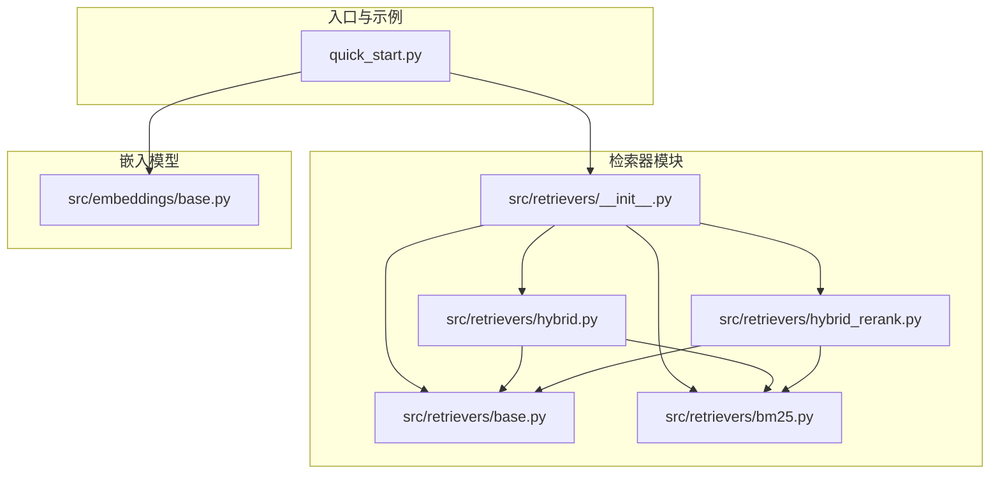
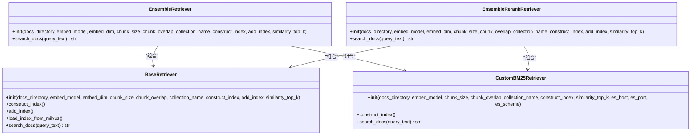
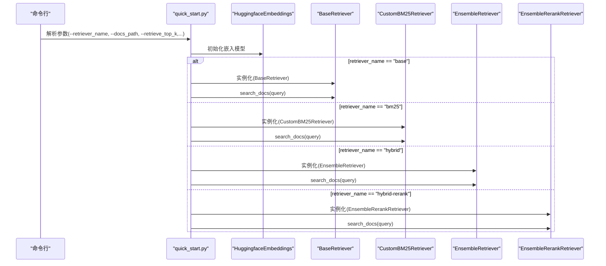

# 检索器实现API

<cite>
**本文引用的文件**
- [src/retrievers/__init__.py](file://src/retrievers/__init__.py)
- [src/retrievers/base.py](file://src/retrievers/base.py)
- [src/retrievers/bm25.py](file://src/retrievers/bm25.py)
- [src/retrievers/hybrid.py](file://src/retrievers/hybrid.py)
- [src/retrievers/hybrid_rerank.py](file://src/retrievers/hybrid_rerank.py)
- [src/embeddings/base.py](file://src/embeddings/base.py)
- [quick_start.py](file://quick_start.py)
- [README.md](file://README.md)
- [README.zh_CN.md](file://README.zh_CN.md)
</cite>

## 目录
1. [简介](#简介)
2. [项目结构](#项目结构)
3. [核心组件](#核心组件)
4. [架构总览](#架构总览)
5. [详细组件分析](#详细组件分析)
6. [依赖分析](#依赖分析)
7. [性能考虑](#性能考虑)
8. [故障排查指南](#故障排查指南)
9. [结论](#结论)
10. [附录](#附录)

## 简介
本文件面向开发者与研究者，系统化梳理 CRUD-RAG 项目中的检索器实现类及其API，重点覆盖以下三类检索器：
- 基于向量相似度的检索器：BaseRetriever
- 基于 BM25 的检索器：CustomBM25Retriever
- 混合检索与重排序检索器：EnsembleRetriever、EnsembleRerankRetriever

文档将从类结构、构造参数、核心方法、处理流程、性能特征、适用场景、扩展接口与自定义实现等方面进行深入说明，并提供不同策略的对比分析与选择建议。

## 项目结构
检索器相关代码位于 src/retrievers 目录，包含抽象基类与三种具体实现；同时通过 src/embeddings 提供嵌入模型封装，quick_start.py 展示了如何在命令行参数中选择不同的检索器。

图表来源
- [src/retrievers/__init__.py:1-4](file://src/retrievers/__init__.py#L1-L4)
- [src/retrievers/base.py:16-142](file://src/retrievers/base.py#L16-L142)
- [src/retrievers/bm25.py:14-92](file://src/retrievers/bm25.py#L14-L92)
- [src/retrievers/hybrid.py:13-81](file://src/retrievers/hybrid.py#L13-L81)
- [src/retrievers/hybrid_rerank.py:26-81](file://src/retrievers/hybrid_rerank.py#L26-L81)
- [src/embeddings/base.py:14-88](file://src/embeddings/base.py#L14-L88)
- [quick_start.py:11-89](file://quick_start.py#L11-L89)

章节来源
- [src/retrievers/__init__.py:1-4](file://src/retrievers/__init__.py#L1-L4)
- [quick_start.py:11-89](file://quick_start.py#L11-L89)

## 核心组件
本节概述三大检索器类的职责与共同点：
- BaseRetriever：基于向量索引的检索器，支持从 Milvus 构建或加载索引，提供 search_docs 查询接口。
- CustomBM25Retriever：基于 Elasticsearch 的 BM25 检索器，支持构建索引与查询。
- EnsembleRetriever：混合检索器，融合 BM25 与向量检索结果，采用 Reciprocal Rank Fusion（RRF）融合策略。
- EnsembleRerankRetriever：在混合检索基础上增加重排序，使用 bge-rerank 对候选文档进行重排。

章节来源
- [src/retrievers/base.py:16-142](file://src/retrievers/base.py#L16-L142)
- [src/retrievers/bm25.py:14-92](file://src/retrievers/bm25.py#L14-L92)
- [src/retrievers/hybrid.py:13-81](file://src/retrievers/hybrid.py#L13-L81)
- [src/retrievers/hybrid_rerank.py:26-81](file://src/retrievers/hybrid_rerank.py#L26-L81)

## 架构总览
下图展示了检索器之间的继承与组合关系，以及与嵌入模型的协作方式。

图表来源
- [src/retrievers/base.py:16-142](file://src/retrievers/base.py#L16-L142)
- [src/retrievers/bm25.py:14-92](file://src/retrievers/bm25.py#L14-L92)
- [src/retrievers/hybrid.py:13-81](file://src/retrievers/hybrid.py#L13-L81)
- [src/retrievers/hybrid_rerank.py:26-81](file://src/retrievers/hybrid_rerank.py#L26-L81)

## 详细组件分析

### BaseRetriever（向量检索器）
- 类型：抽象基类（ABC），实际使用时由具体子类或直接实例化。
- 主要职责
  - 构建/加载 Milvus 向量索引
  - 使用 LlamaIndex 的 VectorIndexRetriever 和 RetrieverQueryEngine 组装查询引擎
  - 提供 search_docs 接口返回拼接后的检索文本
- 关键参数
  - docs_directory：文档目录路径
  - embed_model：嵌入模型对象（LangChain Embeddings）
  - embed_dim：嵌入维度，默认 768
  - chunk_size/chunk_overlap：分块大小与重叠
  - collection_name：Milvus 集合名
  - construct_index/add_index：是否构建或追加索引
  - similarity_top_k：返回 Top-K 文档数
- 处理流程
  - 初始化阶段：根据 construct_index 决定构建或加载索引；随后创建 VectorIndexRetriever 与 RetrieverQueryEngine
  - 查询阶段：query_engine.query 返回响应，解析并拼接文档文本
- 性能与特点
  - 向量检索适合语义匹配，召回质量高但对索引构建与查询延迟敏感
  - 分批索引写入（8000 条/批）以规避 Milvus 限制
- 适用场景
  - 中文长文本语义检索、多模态文档检索
- 扩展与自定义
  - 可替换向量存储后端（当前为 Milvus）
  - 可调整分块策略与相似度阈值
- 代码片段路径
  - [构造与索引管理:37-87](file://src/retrievers/base.py#L37-L87)
  - [查询引擎装配:46-54](file://src/retrievers/base.py#L46-L54)
  - [查询与结果拼接:133-140](file://src/retrievers/base.py#L133-L140)

章节来源
- [src/retrievers/base.py:16-142](file://src/retrievers/base.py#L16-L142)

### CustomBM25Retriever（BM25 检索器）
- 类型：独立检索器，不依赖向量索引，直接使用 Elasticsearch
- 主要职责
  - 构建 Elasticsearch 索引（基于文档内容字段）
  - 执行 match 查询，返回 Top-K 文档
- 关键参数
  - docs_directory、embed_model、chunk_size、chunk_overlap、collection_name、construct_index、similarity_top_k
  - es_host/es_port/es_scheme：Elasticsearch 连接参数
- 处理流程
  - 构建阶段：读取文档、分块、嵌入（用于索引构建）、写入 Elasticsearch
  - 查询阶段：match 查询 content 字段，按 size 返回 Top-K
- 性能与特点
  - BM25 适合关键词匹配与事实检索，召回速度快
  - 依赖 Elasticsearch 服务可用性
- 适用场景
  - 结构化/半结构化文档检索、事实类问答
- 扩展与自定义
  - 可替换查询 DSL 或字段映射
- 代码片段路径
  - [构造与索引构建:44-68](file://src/retrievers/bm25.py#L44-L68)
  - [查询执行:70-90](file://src/retrievers/bm25.py#L70-L90)

章节来源
- [src/retrievers/bm25.py:14-92](file://src/retrievers/bm25.py#L14-L92)

### EnsembleRetriever（混合检索器）
- 类型：融合检索器，结合 BM25 与向量检索结果
- 主要职责
  - 并行调用 BM25 与向量检索器
  - 去重合并候选集合
  - 使用 RRF（Reciprocal Rank Fusion）融合打分，输出 Top-K 文档
- 关键参数
  - weights：融合权重列表（默认 [0.5, 0.5]）
  - c：RRF 调节常数（默认 60）
  - top_k：最终返回 Top-K
  - 其余参数与 BaseRetriever 一致
- 处理流程
  - 获取两路检索结果（BM25 与向量）
  - 合并去重，计算 RRF 分数，按分数降序取前 top_k
- 性能与特点
  - RRF 融合兼顾关键词与语义，提升召回与排序平衡
  - 计算复杂度随候选集合规模增长
- 适用场景
  - 需要兼顾关键词与语义的通用检索
- 扩展与自定义
  - 可调整 weights 与 c，或替换为其他融合策略
- 代码片段路径
  - [初始化与组合检索器:38-48](file://src/retrievers/hybrid.py#L38-L48)
  - [RRF 融合与排序:50-80](file://src/retrievers/hybrid.py#L50-L80)

章节来源
- [src/retrievers/hybrid.py:13-81](file://src/retrievers/hybrid.py#L13-L81)

### EnsembleRerankRetriever（混合+重排序检索器）
- 类型：在混合检索基础上引入重排序
- 主要职责
  - 并行调用 BM25 与向量检索器
  - 去重合并候选集合
  - 使用 bge-rerank 对候选进行交叉编码重排，输出 Top-K 文档
- 关键参数
  - weights、c、top_k 与上述一致
  - 依赖 FlagReranker 模型（sentence-transformers/bge-rerank-base）
- 处理流程
  - 获取两路检索结果并去重
  - 调用 bge_rerank_result 对候选进行重排，返回 top_n
- 性能与特点
  - 重排显著提升排序质量，但会增加推理开销
  - 适合对排序精度要求较高的场景
- 适用场景
  - 对排序质量要求高的问答与摘要任务
- 扩展与自定义
  - 可更换重排模型或自定义重排函数
- 代码片段路径
  - [初始化与组合检索器:51-61](file://src/retrievers/hybrid_rerank.py#L51-L61)
  - [重排函数与调用:15-24](file://src/retrievers/hybrid_rerank.py#L15-L24)
  - [融合与重排主流程:63-80](file://src/retrievers/hybrid_rerank.py#L63-L80)

章节来源
- [src/retrievers/hybrid_rerank.py:26-81](file://src/retrievers/hybrid_rerank.py#L26-L81)

### 检索器调用序列（以 quick_start 为例）
下图展示命令行参数如何选择不同检索器并驱动评估流程。

图表来源
- [quick_start.py:61-89](file://quick_start.py#L61-L89)
- [src/embeddings/base.py:14-88](file://src/embeddings/base.py#L14-L88)
- [src/retrievers/base.py:16-142](file://src/retrievers/base.py#L16-L142)
- [src/retrievers/bm25.py:14-92](file://src/retrievers/bm25.py#L14-L92)
- [src/retrievers/hybrid.py:13-81](file://src/retrievers/hybrid.py#L13-L81)
- [src/retrievers/hybrid_rerank.py:26-81](file://src/retrievers/hybrid_rerank.py#L26-L81)

## 依赖分析
- 检索器依赖关系
  - EnsembleRetriever 与 EnsembleRerankRetriever 组合 BaseRetriever 与 CustomBM25Retriever
  - 混合检索器共享嵌入模型与文档分块策略
- 外部依赖
  - Milvus：向量索引存储
  - Elasticsearch：BM25 索引与查询
  - LlamaIndex：索引构建、查询引擎与节点处理
  - FlagEmbedding：bge-rerank 重排
- 代码片段路径
  - [__init__.py 导出:1-4](file://src/retrievers/__init__.py#L1-L4)
  - [混合检索器组合:38-48](file://src/retrievers/hybrid.py#L38-L48)
  - [混合+重排组合:51-61](file://src/retrievers/hybrid_rerank.py#L51-L61)

章节来源
- [src/retrievers/__init__.py:1-4](file://src/retrievers/__init__.py#L1-L4)
- [src/retrievers/hybrid.py:38-48](file://src/retrievers/hybrid.py#L38-L48)
- [src/retrievers/hybrid_rerank.py:51-61](file://src/retrievers/hybrid_rerank.py#L51-L61)

## 性能考虑
- 索引构建
  - BaseRetriever 与 CustomBM25Retriever 均采用分批写入（约 8000 条/批）以适配 Milvus/Elasticsearch 限制
  - 首次构建耗时较长，建议仅在首次运行时开启 --construct_index
- 查询延迟
  - 向量检索受嵌入模型与 Milvus 性能影响
  - BM25 查询依赖 Elasticsearch，需关注网络与索引规模
  - RRF 融合与重排会增加额外计算成本
- 参数调优
  - similarity_top_k/top_k：影响召回数量与下游任务质量
  - weights/c：控制 RRF 融合偏向（BM25/向量）
  - chunk_size/chunk_overlap：影响分块粒度与召回质量
- 代码片段路径
  - [分批索引写入:74-78](file://src/retrievers/base.py#L74-L78)
  - [分批索引写入（BM25）:61-66](file://src/retrievers/bm25.py#L61-L66)
  - [RRF 参数:27-28](file://src/retrievers/hybrid.py#L27-L28)

章节来源
- [src/retrievers/base.py:74-78](file://src/retrievers/base.py#L74-L78)
- [src/retrievers/bm25.py:61-66](file://src/retrievers/bm25.py#L61-L66)
- [src/retrievers/hybrid.py:27-28](file://src/retrievers/hybrid.py#L27-L28)

## 故障排查指南
- Milvus 连接失败
  - 确认已启动 milvus-lite 服务
  - 检查 collection_name 与 embed_dim 是否匹配
  - 参考：[索引加载:121-131](file://src/retrievers/base.py#L121-L131)
- Elasticsearch 连接失败
  - 检查 es_host、es_port、es_scheme
  - 确认 Elasticsearch 已启动且可访问
  - 参考：[ES 客户端初始化:41-42](file://src/retrievers/bm25.py#L41-L42)
- 重排模型不可用
  - 确保安装 FlagEmbedding 与 bge-rerank 模型
  - 参考：[重排函数:15-24](file://src/retrievers/hybrid_rerank.py#L15-L24)
- 命令行参数错误
  - 检查 --retriever_name 是否为 base/bm25/hybrid/hybrid-rerank
  - 参考：[参数解析与实例化:61-89](file://quick_start.py#L61-L89)
- README 参考
  - [快速开始与依赖说明:70-105](file://README.md#L70-L105)
  - [中文快速开始:74-109](file://README.zh_CN.md#L74-L109)

章节来源
- [src/retrievers/base.py:121-131](file://src/retrievers/base.py#L121-L131)
- [src/retrievers/bm25.py:41-42](file://src/retrievers/bm25.py#L41-L42)
- [src/retrievers/hybrid_rerank.py:15-24](file://src/retrievers/hybrid_rerank.py#L15-L24)
- [quick_start.py:61-89](file://quick_start.py#L61-L89)
- [README.md:70-105](file://README.md#L70-L105)
- [README.zh_CN.md:74-109](file://README.zh_CN.md#L74-L109)

## 结论
- BaseRetriever 适合语义检索场景，具备良好的召回能力，但对索引与查询性能有较高要求
- CustomBM25Retriever 适合关键词与事实检索，查询速度快，依赖 Elasticsearch
- EnsembleRetriever 通过 RRF 融合兼顾关键词与语义，适用于通用检索
- EnsembleRerankRetriever 在混合检索基础上引入重排，显著提升排序质量，适合对排序精度要求高的任务
- 建议根据任务类型与性能预算选择合适策略，并结合参数调优与分批索引策略获得最佳效果

## 附录
- 检索器选择与使用建议
  - 通用检索：优先 EnsembleRetriever（RRF 融合）
  - 高排序精度：优先 EnsembleRerankRetriever（重排）
  - 事实/关键词检索：优先 CustomBM25Retriever
  - 语义检索：优先 BaseRetriever
- 自定义扩展
  - 新增检索器：继承抽象基类并在 __init__ 中完成索引构建/加载与 search_docs 实现
  - 替换融合策略：在 EnsembleRetriever 中替换 RRF 逻辑
  - 替换重排模型：在 EnsembleRerankRetriever 中替换 bge_rerank_result 的实现
- 代码片段路径
  - [检索器导出:1-4](file://src/retrievers/__init__.py#L1-L4)
  - [嵌入模型封装:14-88](file://src/embeddings/base.py#L14-L88)
  - [命令行集成:61-89](file://quick_start.py#L61-L89)

章节来源
- [src/retrievers/__init__.py:1-4](file://src/retrievers/__init__.py#L1-L4)
- [src/embeddings/base.py:14-88](file://src/embeddings/base.py#L14-L88)
- [quick_start.py:61-89](file://quick_start.py#L61-L89)