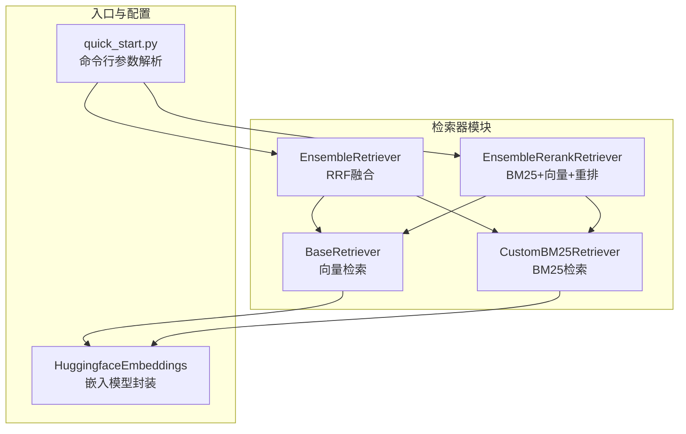
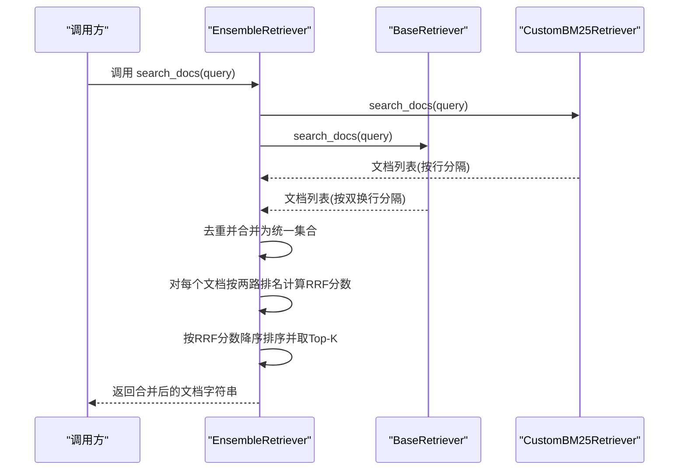
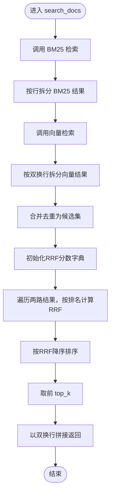
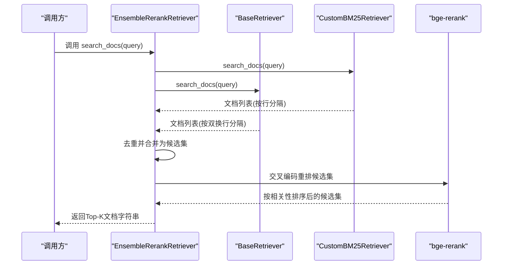
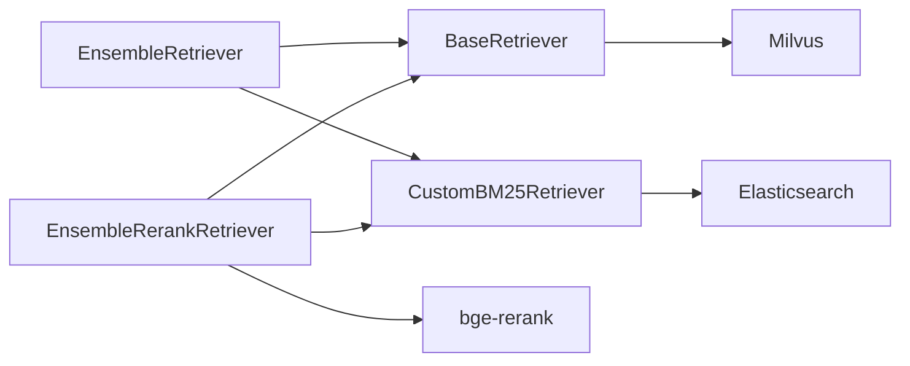

# 混合检索器API

<cite>
**本文引用的文件**
- [src/retrievers/hybrid.py](file://src/retrievers/hybrid.py)
- [src/retrievers/bm25.py](file://src/retrievers/bm25.py)
- [src/retrievers/base.py](file://src/retrievers/base.py)
- [src/retrievers/hybrid_rerank.py](file://src/retrievers/hybrid_rerank.py)
- [src/retrievers/__init__.py](file://src/retrievers/__init__.py)
- [quick_start.py](file://quick_start.py)
- [README.md](file://README.md)
- [src/embeddings/base.py](file://src/embeddings/base.py)
- [requirements.txt](file://requirements.txt)
</cite>

## 目录
1. [简介](#简介)
2. [项目结构](#项目结构)
3. [核心组件](#核心组件)
4. [架构总览](#架构总览)
5. [详细组件分析](#详细组件分析)
6. [依赖分析](#依赖分析)
7. [性能考量](#性能考量)
8. [故障排查指南](#故障排查指南)
9. [结论](#结论)
10. [附录](#附录)

## 简介
本文件面向开发者与研究者，系统化梳理混合检索器（EnsembleRetriever）的API设计与实现细节，涵盖：
- 构造函数参数与初始化流程
- 向量检索与BM25检索的融合机制
- 混合策略的权重分配、RRF排序与结果合并算法
- search_docs方法的查询处理流程与返回格式
- 多模态检索策略与可选的重排（rerank）增强
- 配置参数、调优建议与适用场景分析
- 性能优化方法与常见问题排查

## 项目结构
与混合检索器直接相关的模块位于 src/retrievers 目录，包含基础向量检索器、BM25检索器与两种混合策略实现；同时通过 quick_start.py 提供命令行入口以选择不同检索器。

图表来源
- [src/retrievers/base.py:16-142](file://src/retrievers/base.py#L16-L142)
- [src/retrievers/bm25.py:14-92](file://src/retrievers/bm25.py#L14-L92)
- [src/retrievers/hybrid.py:13-81](file://src/retrievers/hybrid.py#L13-L81)
- [src/retrievers/hybrid_rerank.py:26-81](file://src/retrievers/hybrid_rerank.py#L26-L81)
- [quick_start.py:59-89](file://quick_start.py#L59-L89)
- [src/embeddings/base.py:14-88](file://src/embeddings/base.py#L14-L88)

章节来源
- [src/retrievers/__init__.py:1-4](file://src/retrievers/__init__.py#L1-L4)
- [quick_start.py:59-89](file://quick_start.py#L59-L89)

## 核心组件
- EnsembleRetriever：基于RRF（Reciprocal Rank Fusion）的两路检索融合，支持向量检索与BM25检索的加权合并。
- EnsembleRerankRetriever：在EnsembleRetriever基础上增加跨模态重排（bge-rerank），进一步提升相关性排序质量。
- BaseRetriever：基于Milvus向量数据库的向量检索实现，负责构建/加载索引与执行查询。
- CustomBM25Retriever：基于Elasticsearch的BM25检索实现，负责构建/加载索引与执行关键词匹配查询。

章节来源
- [src/retrievers/hybrid.py:13-81](file://src/retrievers/hybrid.py#L13-L81)
- [src/retrievers/hybrid_rerank.py:26-81](file://src/retrievers/hybrid_rerank.py#L26-L81)
- [src/retrievers/base.py:16-142](file://src/retrievers/base.py#L16-L142)
- [src/retrievers/bm25.py:14-92](file://src/retrievers/bm25.py#L14-L92)

## 架构总览
混合检索器通过组合两个独立的检索器（向量与BM25）输出候选文档集合，再进行去重与融合排序，最终返回Top-K文档字符串。可选的重排策略在融合后对候选集合进行交叉编码重排，进一步提升排序质量。

图表来源
- [src/retrievers/hybrid.py:50-81](file://src/retrievers/hybrid.py#L50-L81)
- [src/retrievers/base.py:133-142](file://src/retrievers/base.py#L133-L142)
- [src/retrievers/bm25.py:70-92](file://src/retrievers/bm25.py#L70-L92)

## 详细组件分析

### EnsembleRetriever（RRF融合）
- 构造函数参数
  - docs_directory：文档目录路径
  - embed_model：嵌入模型实例（LangChain Embeddings接口）
  - embed_dim：向量维度，默认768
  - chunk_size/chunk_overlap：文本切片大小与重叠
  - collection_name：Milvus集合名称
  - construct_index/add_index：是否构建或追加索引
  - similarity_top_k：每路检索返回Top-K
- 初始化流程
  - 创建向量检索器 BaseRetriever
  - 创建BM25检索器 CustomBM25Retriever
  - 内部维护权重数组 weights、融合常数 c、返回Top-K数量 top_k
- 查询处理流程（search_docs）
  - 分别调用两路检索器，得到两组文档字符串
  - 将两路结果按各自分隔符拆分为列表
  - 合并去重后形成候选集合
  - 对每个文档，按两路排名计算 RRF 分数：weight × (1/(rank + c))
  - 按RRF分数降序排序，取前 top_k 文档
  - 以双换行拼接返回

图表来源
- [src/retrievers/hybrid.py:50-81](file://src/retrievers/hybrid.py#L50-L81)

章节来源
- [src/retrievers/hybrid.py:13-81](file://src/retrievers/hybrid.py#L13-L81)

### EnsembleRerankRetriever（BM25+向量+重排）
- 在EnsembleRetriever基础上引入跨模态重排器（bge-rerank），先融合两路候选，再对候选集合进行重排。
- 关键差异
  - 使用 bge_rerank_result 对候选集合进行交叉编码打分
  - 重排后仍取前 top_k 并以双换行拼接返回
- 适用场景
  - 对排序精度要求更高、可接受额外推理开销的任务

图表来源
- [src/retrievers/hybrid_rerank.py:63-81](file://src/retrievers/hybrid_rerank.py#L63-L81)
- [src/retrievers/hybrid_rerank.py:15-24](file://src/retrievers/hybrid_rerank.py#L15-L24)

章节来源
- [src/retrievers/hybrid_rerank.py:26-81](file://src/retrievers/hybrid_rerank.py#L26-L81)

### BaseRetriever（向量检索）
- 功能概述
  - 支持从本地目录构建Milvus索引或从现有集合加载索引
  - 使用向量检索器与查询引擎执行查询
  - 输出格式为“响应文本”中提取的文档片段，并去除文件路径等无关字段
- 关键点
  - 构建索引时按固定块大小分批处理，避免内存压力
  - 查询返回的文本按特定分隔符拆分并清洗

章节来源
- [src/retrievers/base.py:16-142](file://src/retrievers/base.py#L16-L142)

### CustomBM25Retriever（BM25检索）
- 功能概述
  - 基于Elasticsearch的match查询执行BM25检索
  - 可选构建索引或连接已有索引
  - 返回命中内容的拼接字符串
- 关键点
  - DSL查询使用match对content字段进行全文匹配
  - 返回结果按换行拼接

章节来源
- [src/retrievers/bm25.py:14-92](file://src/retrievers/bm25.py#L14-L92)

### 搜索流程与返回格式
- 输入：query_text（字符串）
- 输出：由候选文档组成的字符串，文档间以双换行分隔
- 处理要点
  - 两路检索结果分别按不同分隔符拆分
  - 合并去重后进行RRF融合或重排
  - 最终按顺序取Top-K并拼接返回

章节来源
- [src/retrievers/hybrid.py:50-81](file://src/retrievers/hybrid.py#L50-L81)
- [src/retrievers/hybrid_rerank.py:63-81](file://src/retrievers/hybrid_rerank.py#L63-L81)
- [src/retrievers/base.py:133-142](file://src/retrievers/base.py#L133-L142)
- [src/retrievers/bm25.py:70-92](file://src/retrievers/bm25.py#L70-L92)

## 依赖分析
- 组件耦合
  - EnsembleRetriever/EnsembleRerankRetriever 依赖 BaseRetriever 与 CustomBM25Retriever
  - EnsembleRerankRetriever 依赖 bge-rerank 重排器
- 外部依赖
  - 向量检索：Milvus、LlamaIndex、LangChain Embeddings
  - BM25检索：Elasticsearch
  - 重排：FlagEmbedding（bge-rerank）

图表来源
- [src/retrievers/hybrid.py:38-48](file://src/retrievers/hybrid.py#L38-L48)
- [src/retrievers/hybrid_rerank.py:51-61](file://src/retrievers/hybrid_rerank.py#L51-L61)
- [src/retrievers/base.py:67-70](file://src/retrievers/base.py#L67-L70)
- [src/retrievers/bm25.py:55-57](file://src/retrievers/bm25.py#L55-L57)
- [requirements.txt:1-13](file://requirements.txt#L1-L13)

章节来源
- [requirements.txt:1-13](file://requirements.txt#L1-L13)

## 性能考量
- 检索路径
  - 向量检索：依赖Milvus索引，查询速度较快但需构建索引；可通过增大 similarity_top_k 与 chunk_size 来提升召回，但会增加内存与I/O压力
  - BM25检索：依赖Elasticsearch，关键词匹配快速；match查询简单高效，适合粗排
- 融合策略
  - RRF融合：通过权重与常数 c 控制不同路的贡献，c越大越平滑；可结合任务调参
  - 重排策略：bge-rerank显著提升排序质量，但会引入额外推理成本，建议在Top-K较小且资源充足时启用
- 数据预处理
  - 切片大小与重叠：chunk_size/chunk_overlap 影响召回与上下文完整性，建议在构建索引时统一设置
- 批处理与并发
  - 构建索引时按固定步长分批写入Milvus，避免单次内存压力过大
- 硬件与服务
  - Milvus与Elasticsearch的部署与资源配额直接影响吞吐与延迟

章节来源
- [src/retrievers/base.py:74-87](file://src/retrievers/base.py#L74-L87)
- [src/retrievers/bm25.py:61-66](file://src/retrievers/bm25.py#L61-L66)
- [src/retrievers/hybrid.py:27-29](file://src/retrievers/hybrid.py#L27-L29)
- [src/retrievers/hybrid_rerank.py:40-41](file://src/retrievers/hybrid_rerank.py#L40-L41)

## 故障排查指南
- 索引未构建或集合名不一致
  - 症状：向量检索无结果或报错
  - 排查：确认是否传入 construct_index 或 add_index；检查 collection_name 是否与构建时一致
- Elasticsearch连接失败
  - 症状：BM25检索初始化报错
  - 排查：确认 es_host/es_port/es_scheme 配置正确，Elasticsearch服务可用
- 重排依赖缺失
  - 症状：EnsembleRerankRetriever初始化时报错
  - 排查：安装 FlagEmbedding 与 bge-rerank 模型
- 返回格式异常
  - 症状：返回字符串不符合预期
  - 排查：确认两路检索的分隔符与后续合并逻辑一致；检查去重与排序步骤

章节来源
- [src/retrievers/base.py:37-44](file://src/retrievers/base.py#L37-L44)
- [src/retrievers/bm25.py:38-42](file://src/retrievers/bm25.py#L38-L42)
- [src/retrievers/hybrid_rerank.py:15-24](file://src/retrievers/hybrid_rerank.py#L15-L24)
- [requirements.txt:11-11](file://requirements.txt#L11-L11)

## 结论
- EnsembleRetriever 提供轻量高效的两路检索融合，适合大多数召回与排序需求
- EnsembleRerankRetriever 在精度上更优，适合对排序质量敏感的应用
- 参数调优重点在于：两路权重、RRF常数 c、Top-K数量、切片参数与外部服务配置
- 建议优先在小规模Top-K下验证效果，再逐步扩大规模与引入重排

## 附录

### API参考：EnsembleRetriever
- 类名：EnsembleRetriever
- 构造函数参数
  - docs_directory：文档目录路径
  - embed_model：嵌入模型实例
  - embed_dim：向量维度，默认768
  - chunk_size/chunk_overlap：切片大小与重叠
  - collection_name：Milvus集合名
  - construct_index/add_index：是否构建/追加索引
  - similarity_top_k：每路Top-K
- 方法
  - search_docs(query_text: str) -> str：执行两路检索、去重、RRF融合与Top-K返回

章节来源
- [src/retrievers/hybrid.py:13-81](file://src/retrievers/hybrid.py#L13-L81)

### API参考：EnsembleRerankRetriever
- 类名：EnsembleRerankRetriever
- 构造函数参数
  - 与 EnsembleRetriever 相同
- 方法
  - search_docs(query_text: str) -> str：执行两路检索、去重、重排与Top-K返回

章节来源
- [src/retrievers/hybrid_rerank.py:26-81](file://src/retrievers/hybrid_rerank.py#L26-L81)

### 配置与调优建议
- 基础参数
  - retriever_name：选择 base/bm25/hybrid/hybrid-rerank
  - retrieve_top_k：控制两路检索返回数量，影响RRF融合范围
  - chunk_size/chunk_overlap：影响召回粒度与上下文长度
  - collection_name：确保与构建索引一致
- 融合策略
  - weights：两路权重，建议在验证集上搜索最优组合
  - c：RRF平滑常数，较大值更平滑，较小值更关注高排名
- 外部依赖
  - Milvus/Elasticsearch服务可用性与资源配额
  - bge-rerank 模型下载与缓存路径

章节来源
- [quick_start.py:37-89](file://quick_start.py#L37-L89)
- [README.md:70-105](file://README.md#L70-L105)

### 适用场景分析
- Enriched recall + moderate precision：EnsembleRetriever
- High precision ranking：EnsembleRerankRetriever
- 低延迟/低成本：仅BM25或仅向量检索（通过命令行参数切换）

章节来源
- [quick_start.py:74-89](file://quick_start.py#L74-L89)