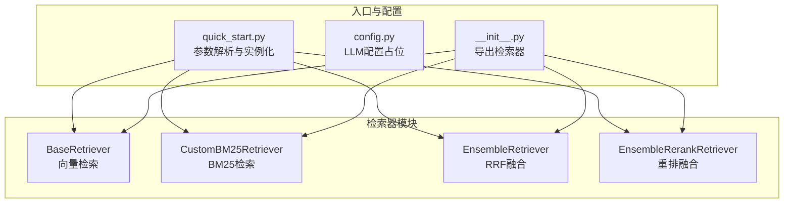
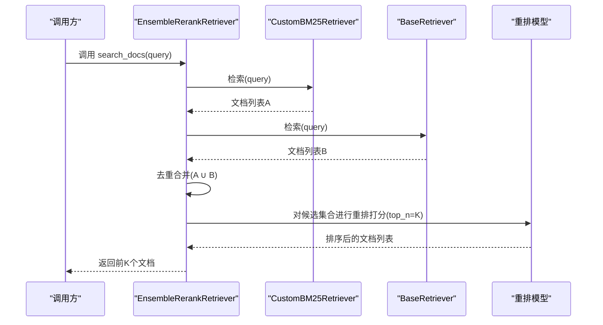
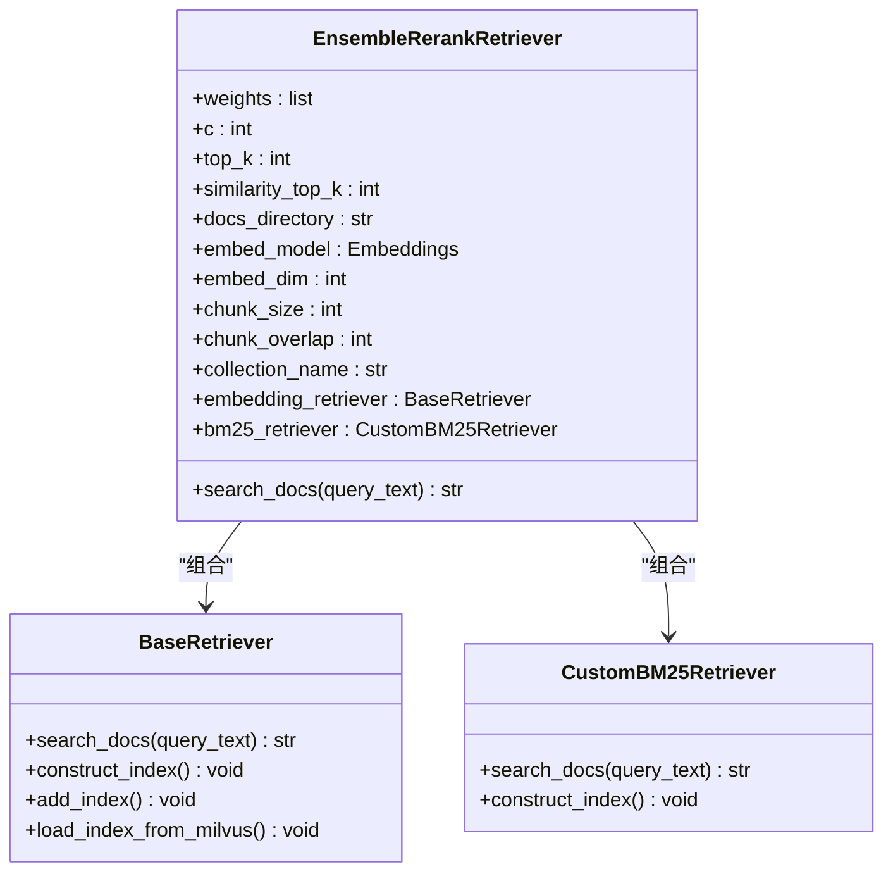
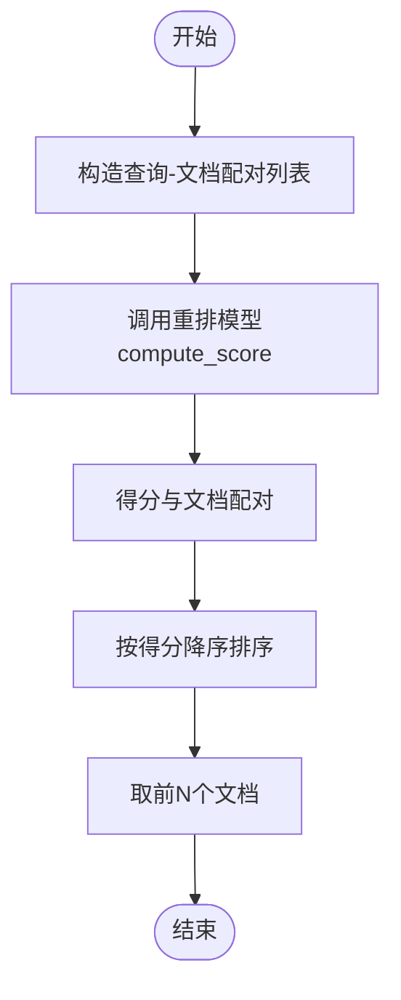
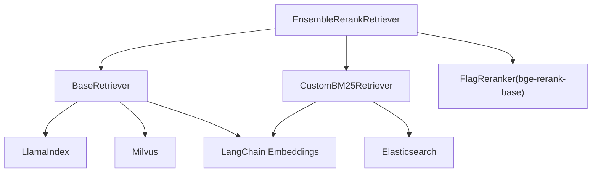

# 混合重排检索器API

<cite>
**本文引用的文件**
- [hybrid_rerank.py](file://src/retrievers/hybrid_rerank.py)
- [hybrid.py](file://src/retrievers/hybrid.py)
- [base.py](file://src/retrievers/base.py)
- [bm25.py](file://src/retrievers/bm25.py)
- [__init__.py](file://src/retrievers/__init__.py)
- [quick_start.py](file://quick_start.py)
- [config.py](file://src/configs/config.py)
- [README.md](file://README.md)
</cite>

## 目录
1. [简介](#简介)
2. [项目结构](#项目结构)
3. [核心组件](#核心组件)
4. [架构总览](#架构总览)
5. [详细组件分析](#详细组件分析)
6. [依赖关系分析](#依赖关系分析)
7. [性能考量](#性能考量)
8. [故障排查指南](#故障排查指南)
9. [结论](#结论)
10. [附录](#附录)

## 简介
本文件面向开发者，系统化阐述混合重排检索器（EnsembleRerankRetriever）的API设计与实现细节。重点包括：
- 构造函数参数与初始化流程
- 初始检索与重排序的两阶段检索机制
- 重排序算法实现原理、相关性评分计算与最终结果生成
- search_docs 方法的查询处理、多轮检索策略与重排序优化
- 配置参数、性能特点与适用场景
- 重排序模型选择、评分标准与阈值设置
- 与基础混合检索器（EnsembleRetriever）的对比分析与选择指导
- 完整使用指南与调优建议

## 项目结构
本项目采用按功能模块划分的目录结构，检索器相关代码位于 src/retrievers 目录中，包含基础向量检索、BM25检索以及两种混合检索方案（RRF融合与重排融合）。入口脚本 quick_start.py 提供了完整的运行示例与参数配置。

图表来源
- [quick_start.py:61-87](file://quick_start.py#L61-L87)
- [__init__.py:1-4](file://src/retrievers/__init__.py#L1-L4)

章节来源
- [README.md:27-68](file://README.md#L27-L68)
- [quick_start.py:14-52](file://quick_start.py#L14-L52)

## 核心组件
- EnsembleRerankRetriever：混合重排检索器，基于两路检索结果进行去重合并后，使用重排模型进行相关性重排序，输出前K个文档。
- EnsembleRetriever：基础混合检索器，采用RRF（Reciprocal Rank Fusion）融合两路检索结果，输出前K个文档。
- BaseRetriever：基于向量索引的检索器，支持从Milvus加载或构建索引，并通过查询引擎返回文本块。
- CustomBM25Retriever：基于Elasticsearch的BM25检索器，支持构建索引与查询。

章节来源
- [hybrid_rerank.py:26-80](file://src/retrievers/hybrid_rerank.py#L26-L80)
- [hybrid.py:13-80](file://src/retrievers/hybrid.py#L13-L80)
- [base.py:16-142](file://src/retrievers/base.py#L16-L142)
- [bm25.py:14-92](file://src/retrievers/bm25.py#L14-L92)

## 架构总览
混合重排检索器在两阶段内完成检索与重排序：
- 第一阶段：分别调用BM25检索器与向量检索器，得到各自的候选文档列表。
- 第二阶段：对两路结果进行去重合并，使用重排模型对候选集合进行相关性打分与排序，取前K个文档作为最终结果。

图表来源
- [hybrid_rerank.py:63-80](file://src/retrievers/hybrid_rerank.py#L63-L80)
- [bm25.py:70-90](file://src/retrievers/bm25.py#L70-L90)
- [base.py:133-140](file://src/retrievers/base.py#L133-L140)

## 详细组件分析

### EnsembleRerankRetriever 类
- 角色定位：混合重排检索器，负责两阶段检索与重排序。
- 关键属性
  - weights：两路检索权重，默认[0.5, 0.5]（用于RRF时使用；重排模式下不参与RRF）
  - c：RRF融合常数，默认60（用于RRF时使用；重排模式下不参与RRF）
  - top_k：最终输出的文档数量
  - similarity_top_k：各子检索器返回的候选数量
  - 其他：文档目录、嵌入模型、分块大小、重叠大小、集合名等
- 初始化流程
  - 创建向量检索器（BaseRetriever）
  - 创建BM25检索器（CustomBM25Retriever）
  - 设置相似度top_k、集合名等参数
- 查询处理流程（search_docs）
  - 分别调用BM25与向量检索器，得到两路文档列表
  - 将两路结果合并去重，形成候选集合
  - 使用重排模型对候选集合进行相关性打分与排序
  - 返回前K个文档

图表来源
- [hybrid_rerank.py:26-61](file://src/retrievers/hybrid_rerank.py#L26-L61)
- [base.py:16-55](file://src/retrievers/base.py#L16-L55)
- [bm25.py:14-42](file://src/retrievers/bm25.py#L14-L42)

章节来源
- [hybrid_rerank.py:26-80](file://src/retrievers/hybrid_rerank.py#L26-L80)
- [base.py:16-55](file://src/retrievers/base.py#L16-L55)
- [bm25.py:14-42](file://src/retrievers/bm25.py#L14-L42)

### 重排算法与评分计算
- 重排模型：使用 FlagReranker 的 bge-rerank-base 模型，对查询与候选文档的每一对进行相关性打分。
- 打分流程
  - 构造查询-文档配对列表
  - 调用 compute_score 计算得分
  - 将得分与对应文档进行配对并按降序排序
  - 取前N个文档作为重排结果
- 评分标准
  - 得分越高表示查询与文档的相关性越强
  - 该模型针对中文场景进行了优化，适合中文问答与检索任务

图表来源
- [hybrid_rerank.py:15-24](file://src/retrievers/hybrid_rerank.py#L15-L24)

章节来源
- [hybrid_rerank.py:15-24](file://src/retrievers/hybrid_rerank.py#L15-L24)

### 与基础混合检索器（EnsembleRetriever）的对比
- 检索策略
  - EnsembleRetriever：采用RRF融合两路检索结果，不进行二次重排
  - EnsembleRerankRetriever：先去重合并两路结果，再进行重排模型打分
- 适用场景
  - EnsembleRetriever：追求速度与简单融合，适合对召回质量要求适中且对延迟敏感的场景
  - EnsembleRerankRetriever：追求更高的相关性排序质量，适合对检索精度要求较高且可接受额外推理开销的场景
- 参数一致性
  - 两者均支持相似度top_k、集合名、分块大小与重叠等参数
  - EnsembleRerankRetriever额外引入重排模型与top_k控制最终输出数量

章节来源
- [hybrid.py:13-80](file://src/retrievers/hybrid.py#L13-L80)
- [hybrid_rerank.py:26-80](file://src/retrievers/hybrid_rerank.py#L26-L80)

### 与基础检索器的关系
- BaseRetriever：提供向量检索能力，支持从Milvus加载或构建索引，查询后返回文本块。
- CustomBM25Retriever：提供BM25检索能力，支持Elasticsearch索引构建与查询。
- EnsembleRerankRetriever 组合上述两类检索器，实现混合检索与重排。

章节来源
- [base.py:16-142](file://src/retrievers/base.py#L16-L142)
- [bm25.py:14-92](file://src/retrievers/bm25.py#L14-L92)

## 依赖关系分析
- 外部依赖
  - FlagEmbedding：提供重排模型（bge-rerank-base）
  - LlamaIndex：向量检索与索引管理
  - LangChain Embeddings：嵌入模型封装
  - Elasticsearch：BM25检索的后端
  - Milvus：向量检索的后端
- 内部依赖
  - EnsembleRerankRetriever 依赖 BaseRetriever 与 CustomBM25Retriever
  - quick_start.py 通过 __init__.py 导出的检索器类进行实例化

图表来源
- [hybrid_rerank.py:11-12](file://src/retrievers/hybrid_rerank.py#L11-L12)
- [base.py:3-13](file://src/retrievers/base.py#L3-L13)
- [bm25.py:3-11](file://src/retrievers/bm25.py#L3-L11)

章节来源
- [hybrid_rerank.py:11-12](file://src/retrievers/hybrid_rerank.py#L11-L12)
- [base.py:3-13](file://src/retrievers/base.py#L3-L13)
- [bm25.py:3-11](file://src/retrievers/bm25.py#L3-L11)

## 性能考量
- 检索阶段
  - 向量检索与BM25检索均受 similarity_top_k 控制，增大该值会提升召回但增加延迟
  - 分块大小与重叠影响索引构建与查询效率，需根据数据规模与内存资源权衡
- 重排阶段
  - 重排模型的计算复杂度与候选集合大小成正比，top_k 越大，重排耗时越高
  - 候选集合经去重合并后，实际重排样本数量可能小于两路独立返回数量之和
- 存储与索引
  - Milvus与Elasticsearch的可用性直接影响检索性能
  - 首次构建索引耗时较长，后续复用可显著降低延迟

章节来源
- [base.py:56-87](file://src/retrievers/base.py#L56-L87)
- [bm25.py:44-68](file://src/retrievers/bm25.py#L44-L68)
- [README.md:20-24](file://README.md#L20-L24)

## 故障排查指南
- 重排模型不可用
  - 现象：重排阶段报错或无法加载模型
  - 排查：确认已安装 FlagEmbedding 并正确下载 bge-rerank-base 模型
- Elasticsearch 连接失败
  - 现象：BM25检索初始化时报连接错误
  - 排查：检查 es_host、es_port、es_scheme 配置是否正确
- Milvus 连接失败
  - 现象：向量检索初始化时报连接错误
  - 排查：确认 Milvus 服务已启动，集合名与维度配置一致
- 索引未构建
  - 现象：首次运行耗时过长或检索为空
  - 排查：确保传入 --construct_index 或在配置中启用索引构建
- 输出为空或质量差
  - 现象：search_docs 返回空或相关性不佳
  - 排查：调整 similarity_top_k、top_k、分块大小与重叠，尝试不同嵌入模型

章节来源
- [bm25.py:41-42](file://src/retrievers/bm25.py#L41-L42)
- [base.py:121-131](file://src/retrievers/base.py#L121-L131)
- [README.md:76-86](file://README.md#L76-L86)

## 结论
混合重排检索器在保持两路检索优势的同时，通过重排模型进一步提升相关性排序质量，适合对检索精度有更高要求的应用场景。与基础混合检索器相比，其在准确性上具有优势，但会带来额外的推理成本。合理配置 similarity_top_k、top_k、分块参数与嵌入模型，可在性能与效果之间取得平衡。

## 附录

### API参考：EnsembleRerankRetriever
- 构造函数参数
  - docs_directory：文档目录路径
  - embed_model：嵌入模型对象
  - embed_dim：嵌入维度，默认768
  - chunk_size：分块大小，默认128
  - chunk_overlap：分块重叠大小，默认0
  - collection_name：集合名称，默认“docs”
  - construct_index：是否构建索引，默认False
  - add_index：是否追加索引，默认False
  - similarity_top_k：各子检索器返回的候选数量，默认2
- 属性
  - weights：两路检索权重，默认[0.5, 0.5]
  - c：RRF融合常数，默认60（重排模式下不参与RRF）
  - top_k：最终输出的文档数量
  - similarity_top_k：各子检索器返回的候选数量
  - embedding_retriever：向量检索器实例
  - bm25_retriever：BM25检索器实例
- 方法
  - search_docs(query_text: str) -> str：执行两阶段检索与重排，返回前K个文档

章节来源
- [hybrid_rerank.py:26-61](file://src/retrievers/hybrid_rerank.py#L26-L61)
- [hybrid_rerank.py:63-80](file://src/retrievers/hybrid_rerank.py#L63-L80)

### 使用示例与参数说明
- 在 quick_start.py 中可通过 --retriever_name 选择检索器类型，其中 "hybrid-rerank" 对应 EnsembleRerankRetriever
- 常用参数
  - --docs_path：检索数据库路径
  - --chunk_size/--chunk_overlap：分块大小与重叠
  - --collection_name：集合名
  - --construct_index/--add_index：索引构建与追加
  - --retrieve_top_k：最终输出的文档数量（top_k）

章节来源
- [quick_start.py:37-87](file://quick_start.py#L37-L87)

### 重排模型与评分标准
- 模型：bge-rerank-base（FlagReranker）
- 评分方式：对查询与每个候选文档进行配对打分，按得分降序排序，取前N个
- 适用场景：中文问答与检索任务，强调相关性排序

章节来源
- [hybrid_rerank.py:15-24](file://src/retrievers/hybrid_rerank.py#L15-L24)

### 与基础混合检索器的选择指导
- 选择 EnsembleRetriever 当：
  - 追求低延迟与简单融合
  - 对召回质量要求适中
- 选择 EnsembleRerankRetriever 当：
  - 追求更高的相关性排序质量
  - 可接受额外推理开销
  - 数据集与任务偏向中文问答与检索

章节来源
- [hybrid.py:13-80](file://src/retrievers/hybrid.py#L13-L80)
- [hybrid_rerank.py:26-80](file://src/retrievers/hybrid_rerank.py#L26-L80)