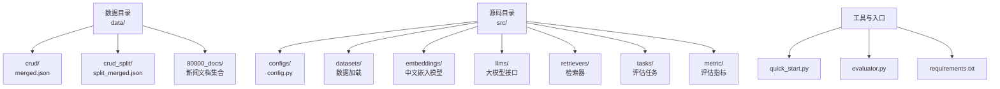
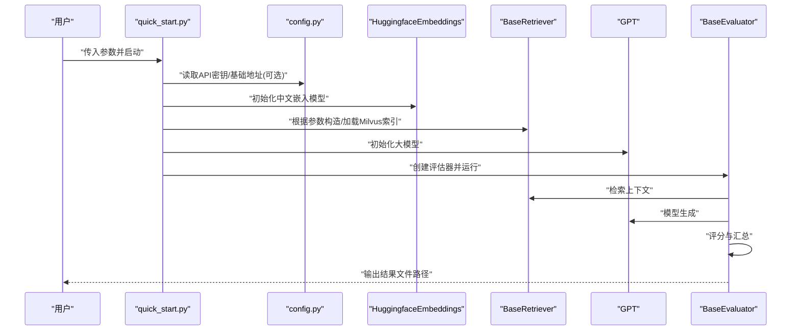
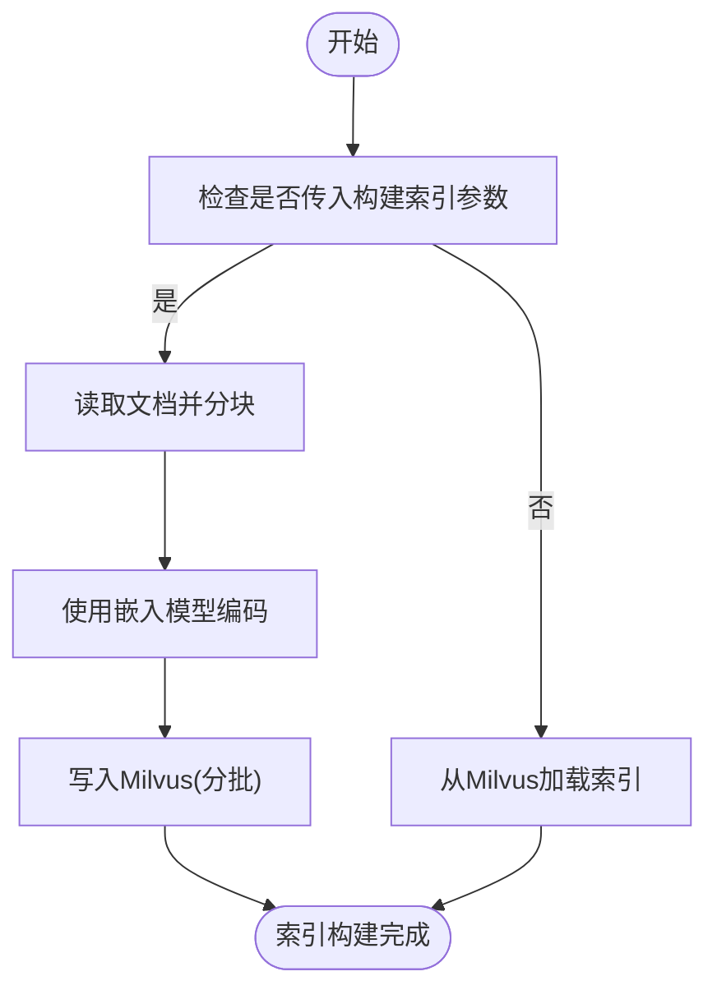
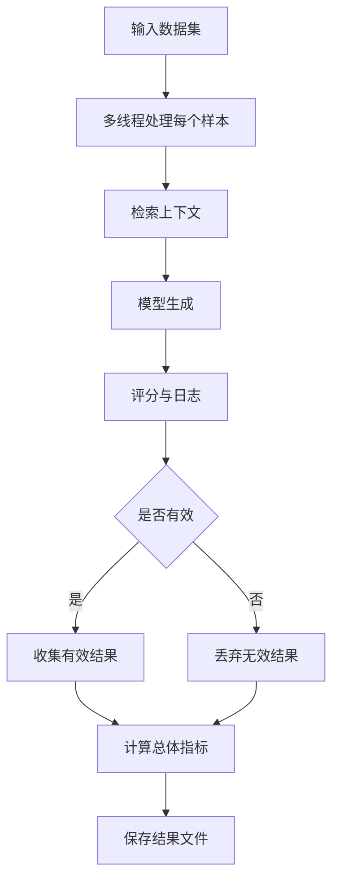
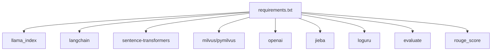

# 快速开始

<cite>
**本文引用的文件**
- [README.md](file://README.md)
- [README.zh_CN.md](file://README.zh_CN.md)
- [quick_start.py](file://quick_start.py)
- [requirements.txt](file://requirements.txt)
- [src/configs/config.py](file://src/configs/config.py)
- [src/embeddings/base.py](file://src/embeddings/base.py)
- [src/retrievers/base.py](file://src/retrievers/base.py)
- [src/llms/api_model.py](file://src/llms/api_model.py)
- [evaluator.py](file://evaluator.py)
</cite>

## 目录
1. [简介](#简介)
2. [项目结构](#项目结构)
3. [核心组件](#核心组件)
4. [架构总览](#架构总览)
5. [详细组件分析](#详细组件分析)
6. [依赖分析](#依赖分析)
7. [性能考虑](#性能考虑)
8. [故障排查指南](#故障排查指南)
9. [结论](#结论)
10. [附录](#附录)

## 简介
本指南面向首次接触 CRUD-RAG 的用户，帮助你在约 30 分钟内完成环境准备、Milvus 向量数据库配置、中文嵌入模型准备与安装，并成功运行第一个实验。你将了解：
- Python 版本与依赖安装
- Milvus 服务启动与向量索引构建
- 中文嵌入模型 bge-base-zh-v1.5 的下载与配置
- 快速运行示例与参数说明
- 常见问题与故障排查

## 项目结构
CRUD-RAG 的核心由以下部分组成：
- 数据：包含基准数据集与检索语料库
- 源码：包含配置、数据加载、嵌入、检索、LLM、任务与评估等模块
- 快速入口：通过命令行参数驱动的统一入口脚本

图示来源
- [README.md:27-68](file://README.md#L27-L68)
- [README.zh_CN.md:28-72](file://README.zh_CN.md#L28-L72)

章节来源
- [README.md:27-68](file://README.md#L27-L68)
- [README.zh_CN.md:28-72](file://README.zh_CN.md#L28-L72)

## 核心组件
- 快速入口脚本：解析命令行参数，初始化 LLM、嵌入模型、检索器与任务，驱动评估执行
- 评估器：负责多线程批量评分、结果持久化与总体指标计算
- 检索器：基于 Milvus 的向量检索，支持首次构建索引与增量添加
- 嵌入模型：默认使用中文句子级嵌入模型 bge-base-zh-v1.5
- LLM 接口：支持 OpenAI GPT 与本地/远程模型的统一抽象
- 配置：OpenAI API 密钥、基础地址与本地模型路径等

章节来源
- [quick_start.py:14-110](file://quick_start.py#L14-L110)
- [evaluator.py:13-192](file://evaluator.py#L13-L192)
- [src/retrievers/base.py:16-142](file://src/retrievers/base.py#L16-L142)
- [src/embeddings/base.py:14-88](file://src/embeddings/base.py#L14-L88)
- [src/llms/api_model.py:12-33](file://src/llms/api_model.py#L12-L33)
- [src/configs/config.py:1-14](file://src/configs/config.py#L1-L14)

## 架构总览
下面的序列图展示了从命令行到最终输出的整体流程。

图示来源
- [quick_start.py:54-108](file://quick_start.py#L54-L108)
- [src/llms/api_model.py:17-32](file://src/llms/api_model.py#L17-L32)
- [src/retrievers/base.py:37-54](file://src/retrievers/base.py#L37-L54)
- [evaluator.py:118-151](file://evaluator.py#L118-L151)

## 详细组件分析

### 环境准备与依赖安装
- 安装依赖
  - 使用提供的依赖清单进行安装，确保网络可访问 PyPI
  - 参考命令：[README.md:71-74](file://README.md#L71-L74)，[README.zh_CN.md:75-78](file://README.zh_CN.md#L75-L78)
- Python 版本
  - 项目未显式声明最低版本；请确保 Python 3.8+ 可用，以兼容依赖包
- Milvus 服务
  - 启动 Milvus 服务，以便检索器连接并构建/查询向量索引
  - 参考命令：[README.md:76-79](file://README.md#L76-L79)，[README.zh_CN.md:80-83](file://README.zh_CN.md#L80-L83)

章节来源
- [README.md:70-84](file://README.md#L70-L84)
- [README.zh_CN.md:74-89](file://README.zh_CN.md#L74-L89)

### 中文嵌入模型配置（bge-base-zh-v1.5）
- 默认模型名称
  - 默认使用中文句子级嵌入模型，名称为：sentence-transformers/bge-base-zh-v1.5
  - 参考定义：[src/embeddings/base.py:12](file://src/embeddings/base.py#L12)
- 模型下载与放置
  - 首次运行前需将模型下载至本地缓存目录，确保后续加载可用
  - 参考说明：[README.md:81](file://README.md#L81)，[README.zh_CN.md:85](file://README.zh_CN.md#L85)

章节来源
- [src/embeddings/base.py:12](file://src/embeddings/base.py#L12)
- [README.md:81](file://README.md#L81)
- [README.zh_CN.md:85](file://README.zh_CN.md#L85)

### Milvus 向量数据库配置与索引构建
- 首次构建索引
  - 通过命令行参数开启“构建索引”，检索器会读取文档、分块、嵌入并写入 Milvus
  - 索引构建过程分批处理，避免单次写入过大导致失败
  - 参考实现：[src/retrievers/base.py:56-87](file://src/retrievers/base.py#L56-L87)
- 加载已有索引
  - 若已存在索引，直接从 Milvus 加载，跳过构建阶段
  - 参考实现：[src/retrievers/base.py:37-44](file://src/retrievers/base.py#L37-L44)
- 增量添加索引
  - 支持将新文档增量加入现有集合
  - 参考实现：[src/retrievers/base.py:89-119](file://src/retrievers/base.py#L89-L119)

图示来源
- [src/retrievers/base.py:37-87](file://src/retrievers/base.py#L37-L87)
- [src/retrievers/base.py:89-119](file://src/retrievers/base.py#L89-L119)

章节来源
- [src/retrievers/base.py:37-119](file://src/retrievers/base.py#L37-L119)

### LLM 与配置
- OpenAI GPT 接口
  - 通过配置文件中的 API Key 与可选的基础地址发起请求
  - 参考实现：[src/llms/api_model.py:17-32](file://src/llms/api_model.py#L17-L32)，[src/configs/config.py:1-14](file://src/configs/config.py#L1-L14)
- 其他模型
  - 项目同时支持本地/远程模型的抽象接口，便于扩展

章节来源
- [src/llms/api_model.py:12-33](file://src/llms/api_model.py#L12-L33)
- [src/configs/config.py:1-14](file://src/configs/config.py#L1-L14)

### 评估流程与输出
- 多线程批量评分
  - 评估器按数据点并发生成、打分并持久化结果
  - 支持断点续跑：若输出文件存在则自动跳过已评估样本
  - 参考实现：[evaluator.py:56-107](file://evaluator.py#L56-L107)，[evaluator.py:158-191](file://evaluator.py#L158-L191)
- 总体指标计算
  - 对有效结果进行总体统计并保存
  - 参考实现：[evaluator.py:134-149](file://evaluator.py#L134-L149)

图示来源
- [evaluator.py:56-107](file://evaluator.py#L56-L107)
- [evaluator.py:134-149](file://evaluator.py#L134-L149)

章节来源
- [evaluator.py:56-191](file://evaluator.py#L56-L191)

### 快速运行示例（从零到一）
- 步骤概览
  1) 安装依赖：[README.md:71-74](file://README.md#L71-L74)，[README.zh_CN.md:75-78](file://README.zh_CN.md#L75-L78)
  2) 启动 Milvus：[README.md:76-79](file://README.md#L76-L79)，[README.zh_CN.md:80-83](file://README.zh_CN.md#L80-L83)
  3) 准备中文嵌入模型：[README.md:81](file://README.md#L81)，[README.zh_CN.md:85](file://README.zh_CN.md#L85)
  4) 修改配置（如需）：[README.md:83](file://README.md#L83)，[README.zh_CN.md:87](file://README.zh_CN.md#L87)
  5) 运行快速入口脚本（首次需构建索引）：[README.md:85-105](file://README.md#L85-L105)，[README.zh_CN.md:89-109](file://README.zh_CN.md#L89-L109)
- 关键参数说明（节选）
  - 模型相关：--model_name、--temperature、--max_new_tokens
  - 数据集相关：--data_path、--shuffle
  - 嵌入与索引：--embedding_name、--embedding_dim、--docs_path、--docs_type、--chunk_size、--chunk_overlap、--construct_index、--add_index、--collection_name
  - 检索器：--retriever_name、--retrieve_top_k
  - 任务与评估：--task、--num_threads、--show_progress_bar、--contain_original_data、--quest_eval、--bert_score_eval
  - 参考定义：[quick_start.py:16-50](file://quick_start.py#L16-L50)

章节来源
- [README.md:70-105](file://README.md#L70-L105)
- [README.zh_CN.md:74-109](file://README.zh_CN.md#L74-L109)
- [quick_start.py:16-50](file://quick_start.py#L16-L50)

## 依赖分析
- 主要第三方库
  - llama_index、langchain：RAG 框架与向量化
  - sentence-transformers：中文嵌入模型
  - milvus/pymilvus：向量数据库
  - openai：OpenAI GPT 接口
  - jieba、loguru、evaluate、rouge_score 等：分词、日志、评估指标
- 依赖清单参考：[requirements.txt:1-13](file://requirements.txt#L1-L13)

图示来源
- [requirements.txt:1-13](file://requirements.txt#L1-L13)

章节来源
- [requirements.txt:1-13](file://requirements.txt#L1-L13)

## 性能考虑
- 并发与线程数
  - 通过 --num_threads 控制评估并发度，建议根据 CPU 与内存资源调整
  - 参考实现：[evaluator.py:15](file://evaluator.py#L15)，[quick_start.py:47](file://quick_start.py#L47)
- 索引构建批次
  - Milvus 写入采用分批策略，避免单次节点过多导致超时或内存压力
  - 参考实现：[src/retrievers/base.py:74-87](file://src/retrievers/base.py#L74-L87)，[src/retrievers/base.py:112-119](file://src/retrievers/base.py#L112-L119)
- 检索 Top-K
  - --retrieve_top_k 影响召回数量与延迟，建议结合任务效果权衡
  - 参考实现：[quick_start.py:38](file://quick_start.py#L38)，[src/retrievers/base.py:27](file://src/retrievers/base.py#L27)

章节来源
- [evaluator.py:15](file://evaluator.py#L15)
- [quick_start.py:38-47](file://quick_start.py#L38-L47)
- [src/retrievers/base.py:74-119](file://src/retrievers/base.py#L74-L119)

## 故障排查指南
- 无法连接 Milvus
  - 确认服务已启动且端口可用
  - 参考命令：[README.md:76-79](file://README.md#L76-L79)，[README.zh_CN.md:80-83](file://README.zh_CN.md#L80-L83)
- 构建索引耗时长或失败
  - 首次构建索引通常耗时较长，属于正常现象
  - 若中途失败，检查磁盘空间与内存，适当降低 --chunk_size 或 --num_threads
  - 参考说明：[README.md:23](file://README.md#L23)，[src/retrievers/base.py:74-87](file://src/retrievers/base.py#L74-L87)
- 嵌入模型加载失败
  - 确保中文嵌入模型已下载至本地缓存目录
  - 参考说明：[README.md:81](file://README.md#L81)，[README.zh_CN.md:85](file://README.zh_CN.md#L85)
- OpenAI 请求异常
  - 检查配置文件中的 API Key 与基础地址是否正确
  - 参考实现：[src/llms/api_model.py:18-21](file://src/llms/api_model.py#L18-L21)，[src/configs/config.py:2-3](file://src/configs/config.py#L2-L3)
- 输出文件未生成或为空
  - 检查 --data_path 与 --docs_path 是否正确
  - 确认已正确传入 --construct_index（首次运行）
  - 参考实现：[quick_start.py:22-35](file://quick_start.py#L22-L35)，[evaluator.py:118-151](file://evaluator.py#L118-L151)

章节来源
- [README.md:23](file://README.md#L23)
- [README.md:76-81](file://README.md#L76-L81)
- [README.zh_CN.md:80-85](file://README.zh_CN.md#L80-L85)
- [src/llms/api_model.py:18-21](file://src/llms/api_model.py#L18-L21)
- [src/configs/config.py:2-3](file://src/configs/config.py#L2-L3)
- [quick_start.py:22-35](file://quick_start.py#L22-L35)
- [evaluator.py:118-151](file://evaluator.py#L118-L151)

## 结论
按照本指南，你可以在 30 分钟内完成环境准备、Milvus 启动、中文嵌入模型就绪与首次运行。建议首次运行时保留 --construct_index 参数以完成索引构建；后续复用时可移除该参数以提升速度。遇到问题时，优先检查 Milvus 连接、嵌入模型缓存与 OpenAI 配置。

## 附录
- 常用命令与路径
  - 安装依赖：[README.md:71-74](file://README.md#L71-L74)，[README.zh_CN.md:75-78](file://README.zh_CN.md#L75-L78)
  - 启动 Milvus：[README.md:76-79](file://README.md#L76-L79)，[README.zh_CN.md:80-83](file://README.zh_CN.md#L80-L83)
  - 运行快速入口：[README.md:85-105](file://README.md#L85-L105)，[README.zh_CN.md:89-109](file://README.zh_CN.md#L89-L109)
- 参数一览（节选）
  - 模型：--model_name、--temperature、--max_new_tokens
  - 数据与索引：--data_path、--docs_path、--docs_type、--chunk_size、--chunk_overlap、--construct_index、--add_index、--collection_name
  - 检索器：--retriever_name、--retrieve_top_k
  - 任务与评估：--task、--num_threads、--show_progress_bar、--contain_original_data、--quest_eval、--bert_score_eval
  - 参考定义：[quick_start.py:16-50](file://quick_start.py#L16-L50)

章节来源
- [README.md:70-105](file://README.md#L70-L105)
- [README.zh_CN.md:74-109](file://README.zh_CN.md#L74-L109)
- [quick_start.py:16-50](file://quick_start.py#L16-L50)