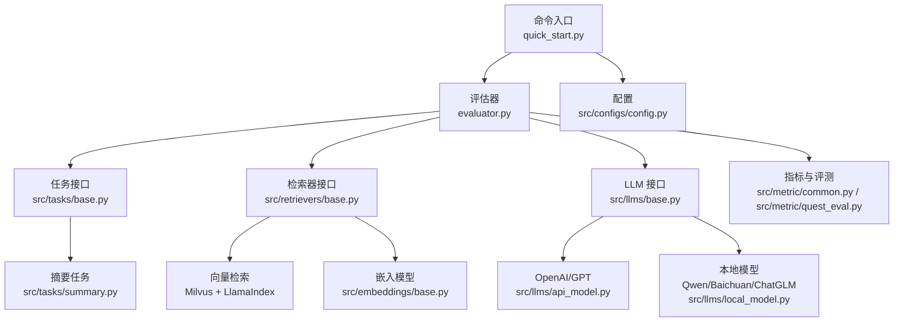
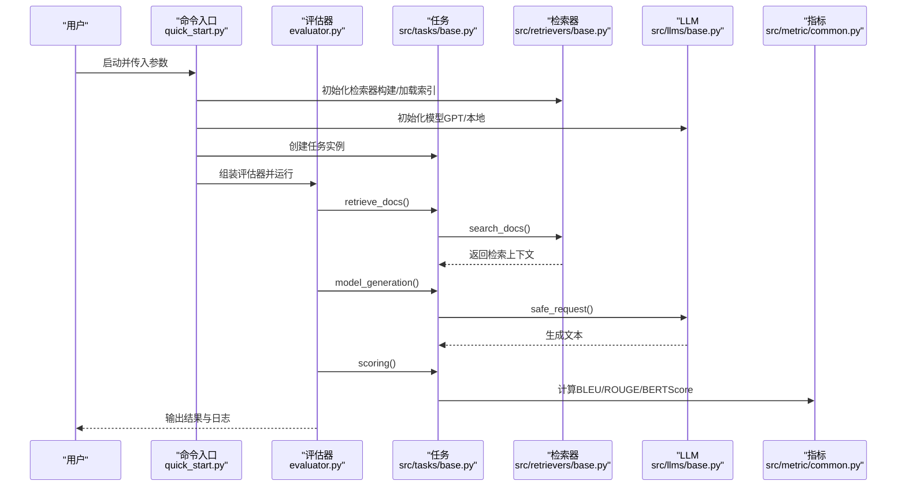
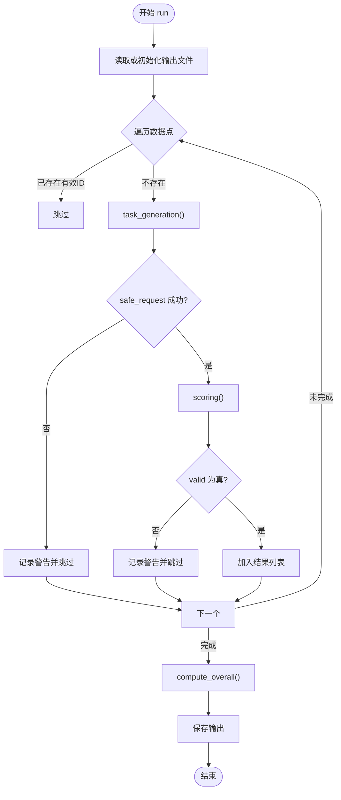
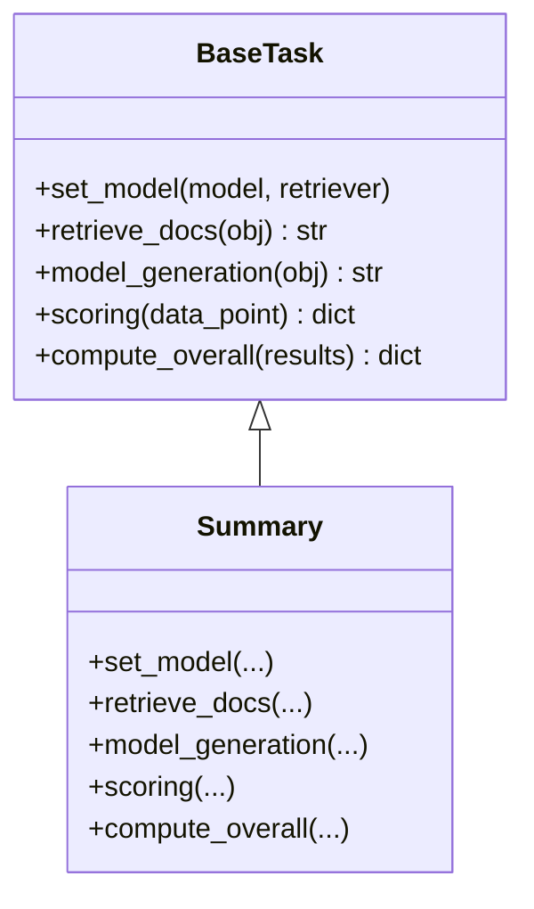
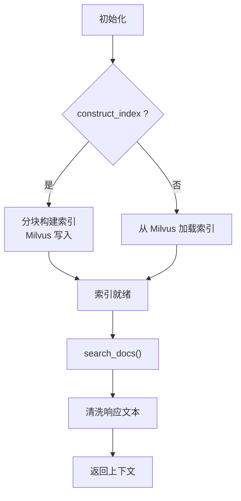
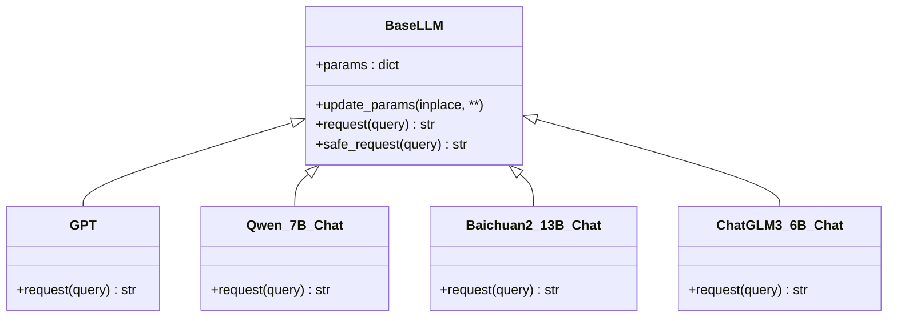
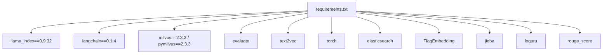

# 故障排查与FAQ

<cite>
**本文引用的文件**   
- [README.md](file://README.md)
- [README.zh_CN.md](file://README.zh_CN.md)
- [requirements.txt](file://requirements.txt)
- [quick_start.py](file://quick_start.py)
- [evaluator.py](file://evaluator.py)
- [src/configs/config.py](file://src/configs/config.py)
- [src/llms/base.py](file://src/llms/base.py)
- [src/llms/api_model.py](file://src/llms/api_model.py)
- [src/llms/local_model.py](file://src/llms/local_model.py)
- [src/embeddings/base.py](file://src/embeddings/base.py)
- [src/retrievers/base.py](file://src/retrievers/base.py)
- [src/tasks/base.py](file://src/tasks/base.py)
- [src/tasks/summary.py](file://src/tasks/summary.py)
- [src/metric/common.py](file://src/metric/common.py)
- [src/metric/quest_eval.py](file://src/metric/quest_eval.py)
</cite>

## 目录
1. [简介](#简介)
2. [项目结构](#项目结构)
3. [核心组件](#核心组件)
4. [架构总览](#架构总览)
5. [详细组件分析](#详细组件分析)
6. [依赖分析](#依赖分析)
7. [性能考虑](#性能考虑)
8. [故障排查指南](#故障排查指南)
9. [结论](#结论)
10. [附录](#附录)

## 简介
本文件面向使用 CRUD-RAG 的研究者与工程师，提供系统性的故障排查与常见问题解答（FAQ）。内容覆盖安装、配置、运行、性能优化、兼容性与版本问题、日志与调试技巧等，并给出可操作的检查清单与修复步骤，帮助不同技术背景的用户快速定位并解决问题。

## 项目结构
CRUD-RAG 采用模块化设计：数据集、嵌入、检索器、大语言模型、任务与指标、评估器等模块清晰分离，便于独立排查与替换。

图表来源
- [quick_start.py:1-110](file://quick_start.py#L1-L110)
- [evaluator.py:1-192](file://evaluator.py#L1-L192)
- [src/tasks/base.py:1-74](file://src/tasks/base.py#L1-L74)
- [src/tasks/summary.py:1-121](file://src/tasks/summary.py#L1-L121)
- [src/retrievers/base.py:1-142](file://src/retrievers/base.py#L1-L142)
- [src/llms/base.py:1-47](file://src/llms/base.py#L1-L47)
- [src/llms/api_model.py:1-33](file://src/llms/api_model.py#L1-L33)
- [src/llms/local_model.py:1-114](file://src/llms/local_model.py#L1-L114)
- [src/embeddings/base.py:1-88](file://src/embeddings/base.py#L1-L88)
- [src/metric/common.py:1-117](file://src/metric/common.py#L1-L117)
- [src/metric/quest_eval.py:1-152](file://src/metric/quest_eval.py#L1-L152)
- [src/configs/config.py:1-14](file://src/configs/config.py#L1-L14)

章节来源
- [README.md:27-68](file://README.md#L27-L68)
- [quick_start.py:1-110](file://quick_start.py#L1-L110)

## 核心组件
- 评估器：负责多线程批处理、结果缓存与续跑、总体指标计算与输出保存。
- 任务：定义检索上下文、模型生成、评分与总体统计。
- 检索器：基于 Milvus 的向量检索，支持首次构建索引与增量追加索引。
- LLM：统一抽象接口，分别对接 OpenAI API 与本地模型（Qwen/Baichuan/ChatGLM）。
- 嵌入模型：SentenceTransformer/CrossEncoder，封装为 LangChain Embeddings。
- 指标：BLEU、ROUGE-L、BERTScore、RAGQuestEval（需调用外部模型）。

章节来源
- [evaluator.py:13-192](file://evaluator.py#L13-L192)
- [src/tasks/base.py:13-74](file://src/tasks/base.py#L13-L74)
- [src/retrievers/base.py:16-142](file://src/retrievers/base.py#L16-L142)
- [src/llms/base.py:6-47](file://src/llms/base.py#L6-L47)
- [src/embeddings/base.py:14-88](file://src/embeddings/base.py#L14-L88)
- [src/metric/common.py:13-117](file://src/metric/common.py#L13-L117)
- [src/metric/quest_eval.py:23-152](file://src/metric/quest_eval.py#L23-L152)

## 架构总览
下图展示从命令入口到最终输出的端到端流程，以及关键异常处理点。

图表来源
- [quick_start.py:54-108](file://quick_start.py#L54-L108)
- [evaluator.py:42-151](file://evaluator.py#L42-L151)
- [src/tasks/base.py:38-65](file://src/tasks/base.py#L38-L65)
- [src/retrievers/base.py:133-141](file://src/retrievers/base.py#L133-L141)
- [src/llms/base.py:38-45](file://src/llms/base.py#L38-L45)
- [src/metric/common.py:23-86](file://src/metric/common.py#L23-L86)

## 详细组件分析

### 评估器（BaseEvaluator）
- 多线程批处理：使用线程池并发执行数据点处理，支持进度条与续跑。
- 结果缓存与去重：按 ID 去重，避免重复计算；异常时记录警告并跳过无效项。
- 输出目录组织：按集合名与 topK、模型类名自动组织输出路径。
- 异常兜底：所有子流程均通过安全请求与异常捕获，保证整体稳定性。

图表来源
- [evaluator.py:56-151](file://evaluator.py#L56-L151)

章节来源
- [evaluator.py:13-192](file://evaluator.py#L13-L192)

### 任务（BaseTask 与 Summary）
- 检索上下文：从检索器获取 top-k 文档，清洗无关片段。
- 模型生成：读取模板拼接提示词，调用 LLM 安全请求。
- 评分：支持 BLEU、ROUGE-L、BERTScore、RAGQuestEval（需外部模型）。
- 总体统计：按样本数平均，剔除不可判定问题后计算召回与F1。

图表来源
- [src/tasks/base.py:13-74](file://src/tasks/base.py#L13-L74)
- [src/tasks/summary.py:12-121](file://src/tasks/summary.py#L12-L121)

章节来源
- [src/tasks/base.py:13-74](file://src/tasks/base.py#L13-L74)
- [src/tasks/summary.py:36-98](file://src/tasks/summary.py#L36-L98)

### 检索器（BaseRetriever）
- 首次构建索引：分块批量写入 Milvus，避免单次超大数据导致失败。
- 加载已有索引：直接连接 Milvus 集合进行查询。
- 查询处理：解析响应文本，过滤文件路径等冗余信息，返回干净上下文。

图表来源
- [src/retrievers/base.py:37-88](file://src/retrievers/base.py#L37-L88)
- [src/retrievers/base.py:121-141](file://src/retrievers/base.py#L121-L141)

章节来源
- [src/retrievers/base.py:16-142](file://src/retrievers/base.py#L16-L142)

### LLM 抽象与实现
- 抽象接口：统一参数管理与安全请求方法，屏蔽具体实现差异。
- OpenAI 实现：动态读取配置，支持自定义 base_url 与 API Key。
- 本地模型：Qwen/Baichuan/ChatGLM 等，自动设备映射与生成参数。

图表来源
- [src/llms/base.py:6-47](file://src/llms/base.py#L6-L47)
- [src/llms/api_model.py:12-33](file://src/llms/api_model.py#L12-L33)
- [src/llms/local_model.py:11-114](file://src/llms/local_model.py#L11-L114)

章节来源
- [src/llms/base.py:6-47](file://src/llms/base.py#L6-L47)
- [src/llms/api_model.py:17-32](file://src/llms/api_model.py#L17-L32)
- [src/llms/local_model.py:27-87](file://src/llms/local_model.py#L27-L87)

### 嵌入模型（HuggingfaceEmbeddings）
- 自动判断交叉编码器或双向编码器，按类型初始化。
- 支持缓存目录与张量化输出，确保与下游 Milvus 写入兼容。

章节来源
- [src/embeddings/base.py:25-53](file://src/embeddings/base.py#L25-L53)
- [src/embeddings/base.py:61-73](file://src/embeddings/base.py#L61-L73)

### 指标与评测（common/quest_eval）
- 通用指标：BLEU、ROUGE-L、BERTScore，均带有异常捕获装饰器。
- RAGQuestEval：基于外部模型生成问题与答案，计算词粒度 F1 与召回，支持保存问答对。

章节来源
- [src/metric/common.py:13-117](file://src/metric/common.py#L13-L117)
- [src/metric/quest_eval.py:34-129](file://src/metric/quest_eval.py#L34-L129)

## 依赖分析
- Python 包：llama_index、langchain、milvus/pymilvus、evaluate、text2vec、torch、elasticsearch、FlagEmbedding、jieba、loguru、rouge_score 等。
- 版本注意：项目中固定了部分依赖版本，升级需谨慎以避免不兼容。

图表来源
- [requirements.txt:1-13](file://requirements.txt#L1-L13)

章节来源
- [requirements.txt:1-13](file://requirements.txt#L1-L13)

## 性能考虑
- 并发与吞吐：评估器默认多线程批处理，合理设置线程数以匹配 CPU/IO 能力。
- 索引构建：分块写入 Milvus，避免一次性超大数据导致内存与网络压力过大。
- 模型选择：本地模型需 GPU 设备映射与合适温度/采样参数；远程 API 受速率限制影响。
- 指标开销：BERTScore 与 RAGQuestEval 需要额外网络请求，建议按需启用。

章节来源
- [evaluator.py:102-107](file://evaluator.py#L102-L107)
- [src/retrievers/base.py:74-87](file://src/retrievers/base.py#L74-L87)
- [src/metric/common.py:78-85](file://src/metric/common.py#L78-L85)
- [src/metric/quest_eval.py:34-53](file://src/metric/quest_eval.py#L34-L53)

## 故障排查指南

### 一、安装与环境问题
- 缺少依赖包
  - 现象：导入报错或功能缺失。
  - 排查：确认 requirements.txt 中依赖均已安装，版本尽量与固定版本一致。
  - 参考：[requirements.txt:1-13](file://requirements.txt#L1-L13)
- 模型缓存与路径
  - 现象：嵌入模型加载失败或跨平台路径不一致。
  - 排查：设置缓存目录变量或在配置中指定本地模型路径。
  - 参考：[src/embeddings/base.py:18-20](file://src/embeddings/base.py#L18-L20)
- 本地模型路径未配置
  - 现象：本地模型初始化失败。
  - 排查：在配置文件中填写对应本地模型路径。
  - 参考：[src/configs/config.py:11-14](file://src/configs/config.py#L11-L14)

章节来源
- [requirements.txt:1-13](file://requirements.txt#L1-L13)
- [src/embeddings/base.py:18-20](file://src/embeddings/base.py#L18-L20)
- [src/configs/config.py:11-14](file://src/configs/config.py#L11-L14)

### 二、配置与参数问题
- API Key/代理配置
  - 现象：调用 OpenAI 失败或被拦截。
  - 排查：在配置文件中填入 API Key 与可选 base_url 或中转地址。
  - 参考：[src/llms/api_model.py:18-27](file://src/llms/api_model.py#L18-L27)，[src/configs/config.py:2-3](file://src/configs/config.py#L2-L3)
- 检索集合名与 topK
  - 现象：查询无结果或结果异常。
  - 排查：确认集合名与构建时一致；调整 topK 以平衡召回与质量。
  - 参考：[src/retrievers/base.py:34-35](file://src/retrievers/base.py#L34-L35)，[quick_start.py:38-39](file://quick_start.py#L38-L39)
- 任务与指标开关
  - 现象：指标缺失或评测异常。
  - 排查：按需开启 quest_eval 或 bert_score，确保模板与问答对存在。
  - 参考：[quick_start.py:42-44](file://quick_start.py#L42-L44)，[src/tasks/summary.py:66-70](file://src/tasks/summary.py#L66-L70)

章节来源
- [src/llms/api_model.py:18-27](file://src/llms/api_model.py#L18-L27)
- [src/configs/config.py:2-3](file://src/configs/config.py#L2-L3)
- [src/retrievers/base.py:34-35](file://src/retrievers/base.py#L34-L35)
- [quick_start.py:38-39](file://quick_start.py#L38-L39)
- [quick_start.py:42-44](file://quick_start.py#L42-L44)
- [src/tasks/summary.py:66-70](file://src/tasks/summary.py#L66-L70)

### 三、运行与索引问题
- 首次构建索引耗时长
  - 现象：构建过程缓慢或中断。
  - 排查：确保 Milvus 服务可用；分块写入策略已启用；监控磁盘与内存占用。
  - 参考：[src/retrievers/base.py:74-87](file://src/retrievers/base.py#L74-L87)，[README.md:23](file://README.md#L23)
- 增量追加索引
  - 现象：新增文档未被检索到。
  - 排查：使用追加索引参数重新构建；确认文档类型与分块参数。
  - 参考：[quick_start.py:33-34](file://quick_start.py#L33-L34)，[src/retrievers/base.py:89-119](file://src/retrievers/base.py#L89-L119)
- Milvus 连接失败
  - 现象：无法加载或写入集合。
  - 排查：确认服务启动、网络连通、集合名与维度一致。
  - 参考：[src/retrievers/base.py:121-131](file://src/retrievers/base.py#L121-L131)

章节来源
- [src/retrievers/base.py:74-87](file://src/retrievers/base.py#L74-L87)
- [README.md:23](file://README.md#L23)
- [quick_start.py:33-34](file://quick_start.py#L33-L34)
- [src/retrievers/base.py:89-119](file://src/retrievers/base.py#L89-L119)
- [src/retrievers/base.py:121-131](file://src/retrievers/base.py#L121-L131)

### 四、模型与生成问题
- API 请求失败
  - 现象：返回空字符串或特定错误标识。
  - 排查：检查 API Key、速率限制、网络代理；评估器会跳过无效结果。
  - 参考：[evaluator.py:82-83](file://evaluator.py#L82-L83)，[src/llms/api_model.py:18-27](file://src/llms/api_model.py#L18-L27)
- 本地模型推理异常
  - 现象：显存不足或生成卡死。
  - 排查：降低温度/采样参数、减少最大新 token、确认设备映射。
  - 参考：[src/llms/local_model.py:17-25](file://src/llms/local_model.py#L17-L25)，[src/llms/local_model.py:56-60](file://src/llms/local_model.py#L56-L60)
- 提示词模板缺失
  - 现象：任务生成为空。
  - 排查：确认模板文件存在且路径正确。
  - 参考：[src/tasks/summary.py:52-59](file://src/tasks/summary.py#L52-L59)

章节来源
- [evaluator.py:82-83](file://evaluator.py#L82-L83)
- [src/llms/api_model.py:18-27](file://src/llms/api_model.py#L18-L27)
- [src/llms/local_model.py:17-25](file://src/llms/local_model.py#L17-L25)
- [src/llms/local_model.py:56-60](file://src/llms/local_model.py#L56-L60)
- [src/tasks/summary.py:52-59](file://src/tasks/summary.py#L52-L59)

### 五、评测与指标问题
- RAGQuestEval 无法生成问答对
  - 现象：指标为零或问答对为空。
  - 排查：确认外部模型可用；检查模板与缓存问答对文件是否存在。
  - 参考：[src/metric/quest_eval.py:34-53](file://src/metric/quest_eval.py#L34-L53)，[src/metric/quest_eval.py:30-33](file://src/metric/quest_eval.py#L30-L33)
- BERTScore 评测失败
  - 现象：网络请求异常导致分数为零。
  - 排查：检查网络连通与缓存路径。
  - 参考：[src/metric/common.py:78-85](file://src/metric/common.py#L78-L85)

章节来源
- [src/metric/quest_eval.py:34-53](file://src/metric/quest_eval.py#L34-L53)
- [src/metric/quest_eval.py:30-33](file://src/metric/quest_eval.py#L30-L33)
- [src/metric/common.py:78-85](file://src/metric/common.py#L78-L85)

### 六、日志与调试技巧
- 日志级别：使用 loguru 输出关键信息与警告，便于定位异常。
- 关键日志点：
  - LLM 安全请求：当请求异常时会记录警告并返回空字符串。
  - 指标计算：异常会被捕获并记录，不影响整体流程。
  - 评估器：输出保存路径与结果概览。
- 建议：
  - 在开发阶段开启详细日志，逐步缩小范围。
  - 使用小样本快速验证流程，再扩大规模。

章节来源
- [src/llms/base.py:38-45](file://src/llms/base.py#L38-L45)
- [src/metric/common.py:13-21](file://src/metric/common.py#L13-L21)
- [evaluator.py:149-151](file://evaluator.py#L149-L151)

### 七、兼容性与版本问题
- 依赖版本固定：如 llama_index==0.9.32、langchain==0.1.4、milvus==2.3.3 等。
- 升级建议：先在隔离环境中测试，确保检索、嵌入与 Milvus 交互正常后再推广。
- 注意事项：不同版本的 LlamaIndex/Pydantic/Transformers 可能导致导入或行为差异。

章节来源
- [requirements.txt:1-13](file://requirements.txt#L1-L13)

### 八、常见问题速查表
- 问：第一次运行很慢怎么办？
  - 答：这是构建向量索引的必要过程，建议在稳定网络与充足资源环境下运行，完成后可复用索引。
  - 参考：[README.md:23](file://README.md#L23)
- 问：如何切换到本地模型？
  - 答：在配置中填写本地模型路径，并在命令行选择对应模型名称。
  - 参考：[src/configs/config.py:11-14](file://src/configs/config.py#L11-L14)，[quick_start.py:17](file://quick_start.py#L17)
- 问：如何只追加索引而不重建？
  - 答：使用追加索引参数，确保文档类型与分块参数一致。
  - 参考：[quick_start.py:33-34](file://quick_start.py#L33-L34)，[src/retrievers/base.py:89-119](file://src/retrievers/base.py#L89-L119)

章节来源
- [README.md:23](file://README.md#L23)
- [src/configs/config.py:11-14](file://src/configs/config.py#L11-L14)
- [quick_start.py:33-34](file://quick_start.py#L33-L34)
- [src/retrievers/base.py:89-119](file://src/retrievers/base.py#L89-L119)

## 结论
通过模块化架构与完善的异常处理，CRUD-RAG 在复杂实验场景中具备较好的鲁棒性。建议用户遵循“小步快跑”的调试策略：先验证数据与索引，再接入模型与评测，最后扩展并发与指标。遇到问题时，优先检查配置、依赖版本与 Milvus 连接状态，结合日志定位根因。

## 附录

### A. 快速检查清单
- 环境与依赖
  - Python 与虚拟环境是否就绪
  - 依赖是否完整安装（参考 requirements.txt）
- 配置
  - API Key/base_url 是否正确
  - 本地模型路径是否填写
- 数据与索引
  - 检索文档路径与类型是否正确
  - 集合名与维度是否一致
  - 首次构建是否完成，或使用追加索引
- 模型与任务
  - 模型参数（温度、采样、最大新 token）是否合理
  - 任务模板是否存在
- 指标与评测
  - RAGQuestEval 与 BERTScore 是否按需启用
  - 网络连通性是否正常

章节来源
- [requirements.txt:1-13](file://requirements.txt#L1-L13)
- [src/configs/config.py:2-3](file://src/configs/config.py#L2-L3)
- [src/configs/config.py:11-14](file://src/configs/config.py#L11-L14)
- [quick_start.py:29-35](file://quick_start.py#L29-L35)
- [src/retrievers/base.py:34-35](file://src/retrievers/base.py#L34-L35)
- [src/tasks/summary.py:52-59](file://src/tasks/summary.py#L52-L59)
- [src/metric/quest_eval.py:34-53](file://src/metric/quest_eval.py#L34-L53)
- [src/metric/common.py:78-85](file://src/metric/common.py#L78-L85)

### B. 社区支持与问题反馈
- 仓库 Issues 页面可用于提交问题与建议。
- 建议在反馈中附带：
  - Python/依赖版本
  - 操作系统与硬件信息
  - 关键日志与最小可复现实例

章节来源
- [README.md:10](file://README.md#L10)