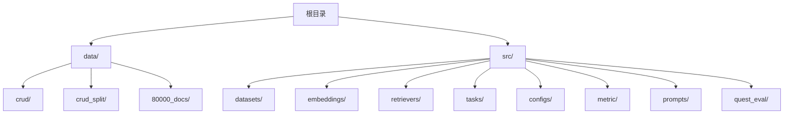
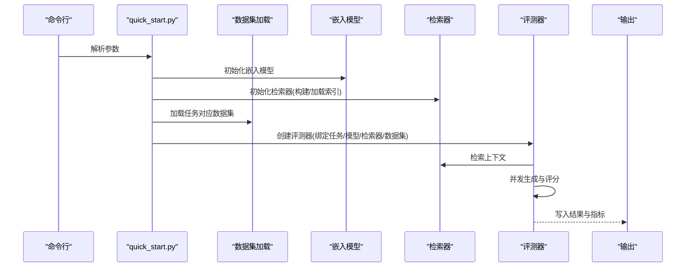
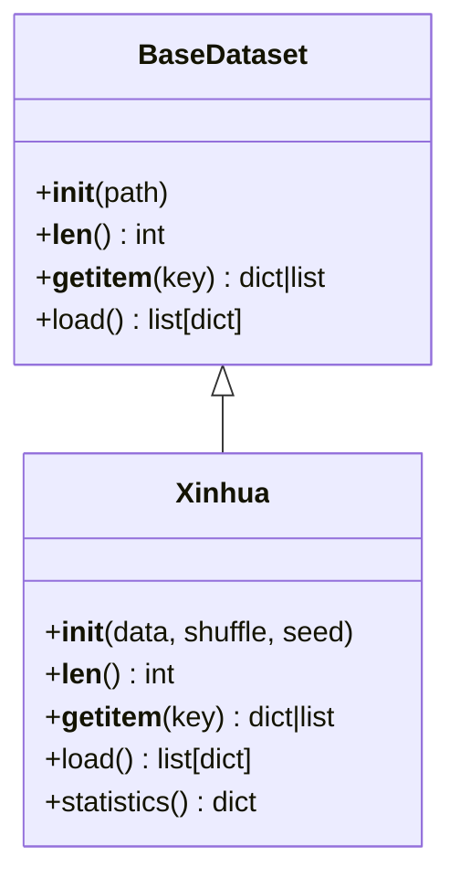
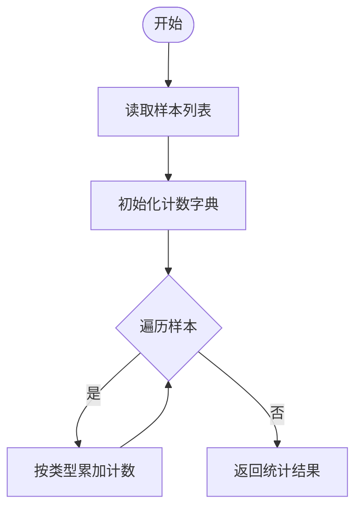
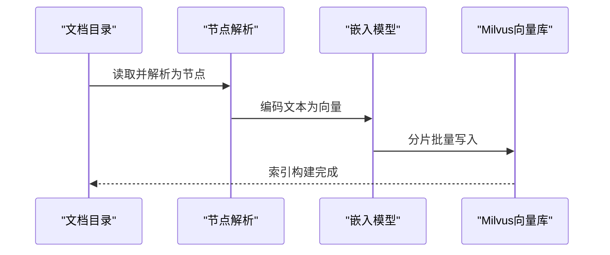
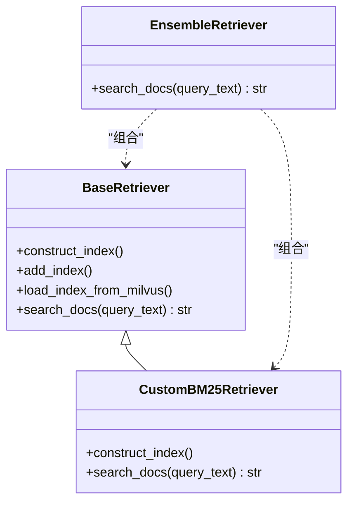
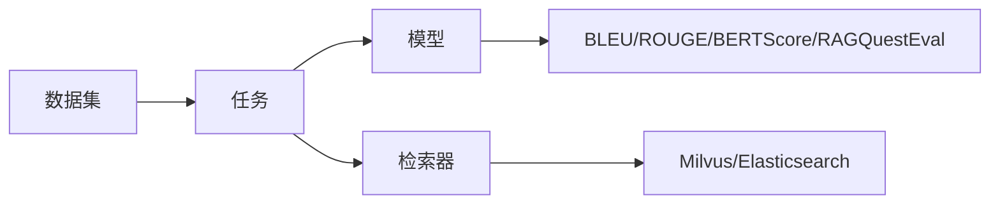

# 数据集与文档库

<cite>
**本文引用的文件**   
- [README.md](file://README.md)
- [quick_start.py](file://quick_start.py)
- [src/datasets/base.py](file://src/datasets/base.py)
- [src/datasets/xinhua.py](file://src/datasets/xinhua.py)
- [src/embeddings/base.py](file://src/embeddings/base.py)
- [src/retrievers/base.py](file://src/retrievers/base.py)
- [src/retrievers/bm25.py](file://src/retrievers/bm25.py)
- [src/retrievers/hybrid.py](file://src/retrievers/hybrid.py)
- [src/tasks/base.py](file://src/tasks/base.py)
- [evaluator.py](file://evaluator.py)
- [src/quest_eval/HalluModified_quest_gt_save.json](file://src/quest_eval/HalluModified_quest_gt_save.json)
- [src/quest_eval/QuestAnswer1Doc_quest_gt_save.json](file://src/quest_eval/QuestAnswer1Doc_quest_gt_save.json)
- [src/quest_eval/QuestAnswer2Docs_quest_gt_save.json](file://src/quest_eval/QuestAnswer2Docs_quest_gt_save.json)
- [src/quest_eval/QuestAnswer3Docs_quest_gt_save.json](file://src/quest_eval/QuestAnswer3Docs_quest_gt_save.json)
- [src/quest_eval/Summary_quest_gt_save.json](file://src/quest_eval/Summary_quest_gt_save.json)
- [data/crud_split/split_merged.json](file://data/crud_split/split_merged.json)
</cite>

## 目录
1. [简介](#简介)
2. [项目结构](#项目结构)
3. [核心组件](#核心组件)
4. [架构总览](#架构总览)
5. [详细组件分析](#详细组件分析)
6. [依赖分析](#依赖分析)
7. [性能考量](#性能考量)
8. [故障排查指南](#故障排查指南)
9. [结论](#结论)
10. [附录](#附录)

## 简介
本文件面向CRUD-RAG项目的数据集与文档库，系统阐述以下内容：
- 数据集组织结构与格式规范：完整CRUD数据集与论文实验数据集的差异与用途
- 80,000+新闻文档的构建与质量控制
- 文档库索引策略与存储优化
- 数据预处理与标准化流程
- 数据集统计与分布特征
- 扩展与定制数据集的方法
- 数据访问与使用最佳实践

## 项目结构
仓库采用按功能域划分的目录结构，数据与代码分离，便于实验复现与扩展。

图示来源
- [README.md:27-68](file://README.md#L27-L68)

章节来源
- [README.md:27-68](file://README.md#L27-L68)

## 核心组件
- 数据集加载与任务适配：抽象基类与具体实现，支持多种任务类型的数据装载与统计
- 向量化嵌入：统一的SentenceTransformer封装，支持交叉编码器与双向编码器
- 检索器：向量检索（Milvus）、BM25（Elasticsearch）、混合检索（RRF融合）
- 评测管线：批处理、并发、断点续跑、指标汇总与输出

章节来源
- [src/datasets/base.py:1-20](file://src/datasets/base.py#L1-L20)
- [src/datasets/xinhua.py:1-54](file://src/datasets/xinhua.py#L1-L54)
- [src/embeddings/base.py:1-88](file://src/embeddings/base.py#L1-L88)
- [src/retrievers/base.py:1-142](file://src/retrievers/base.py#L1-L142)
- [src/retrievers/bm25.py:1-92](file://src/retrievers/bm25.py#L1-L92)
- [src/retrievers/hybrid.py:1-81](file://src/retrievers/hybrid.py#L1-L81)
- [src/tasks/base.py:1-74](file://src/tasks/base.py#L1-L74)
- [evaluator.py:1-192](file://evaluator.py#L1-L192)

## 架构总览
整体运行流程：命令行参数解析 → 初始化模型与嵌入 → 构建/加载检索索引 → 任务适配 → 并发评测 → 结果写盘。

图示来源
- [quick_start.py:14-109](file://quick_start.py#L14-L109)
- [evaluator.py:13-41](file://evaluator.py#L13-L41)
- [src/retrievers/base.py:16-54](file://src/retrievers/base.py#L16-L54)
- [src/datasets/xinhua.py:32-53](file://src/datasets/xinhua.py#L32-L53)

## 详细组件分析

### 数据集：组织结构与格式规范
- 数据集文件
  - 完整CRUD数据集：合并后的单一JSON，包含多个任务类型的样本集合
  - 论文实验数据集：按任务拆分后的JSON，便于对照实验
- 数据样本字段
  - 事件/摘要/正文/时间/链接/标题/样本ID等
- 任务适配
  - 支持“全部任务”与“特定任务”两类加载
  - 提供统计接口，统计各类别样本数量

图示来源
- [src/datasets/base.py:4-19](file://src/datasets/base.py#L4-L19)
- [src/datasets/xinhua.py:8-30](file://src/datasets/xinhua.py#L8-L30)

章节来源
- [src/datasets/base.py:1-20](file://src/datasets/base.py#L1-L20)
- [src/datasets/xinhua.py:1-54](file://src/datasets/xinhua.py#L1-L54)
- [data/crud_split/split_merged.json:1-689](file://data/crud_split/split_merged.json#L1-L689)

### 数据集统计与分布特征
- 统计维度
  - 按样本类型（如事件摘要、继续写作、问答等）统计数量
- 实现要点
  - 遍历样本列表，按类型键计数
  - 返回类型到数量的映射字典

图示来源
- [src/datasets/xinhua.py:25-29](file://src/datasets/xinhua.py#L25-L29)

章节来源
- [src/datasets/xinhua.py:25-29](file://src/datasets/xinhua.py#L25-L29)

### 80,000+新闻文档的构建与质量控制
- 文档来源与规模
  - 80,000+新闻文档用于构建RAG检索库
- 构建流程
  - 读取目录文档 → 分块（节点解析）→ 向量化嵌入 → Milvus向量数据库入库
  - 分片批量入库，规避单次写入限制
- 质量控制
  - 分块大小与重叠参数可配置，平衡召回与噪声
  - 断点续跑：若输出文件存在则跳过已评估样本
  - 并发线程可控，支持进度条可视化

图示来源
- [src/retrievers/base.py:56-87](file://src/retrievers/base.py#L56-L87)
- [src/embeddings/base.py:58-73](file://src/embeddings/base.py#L58-L73)

章节来源
- [src/retrievers/base.py:16-142](file://src/retrievers/base.py#L16-L142)
- [src/embeddings/base.py:14-88](file://src/embeddings/base.py#L14-L88)

### 文档库索引策略与存储优化
- 索引策略
  - 向量检索：基于Sentence-BERT的向量索引，Milvus存储
  - BM25检索：基于Elasticsearch的关键词检索
  - 混合检索：RRF（Reciprocal Rank Fusion）融合向量与BM25结果
- 存储优化
  - 分片批量入库，降低单次写入压力
  - 可选择仅构建索引或增量添加索引
  - 支持从Milvus加载已有索引，避免重复构建

图示来源
- [src/retrievers/base.py:16-142](file://src/retrievers/base.py#L16-L142)
- [src/retrievers/bm25.py:14-92](file://src/retrievers/bm25.py#L14-L92)
- [src/retrievers/hybrid.py:13-81](file://src/retrievers/hybrid.py#L13-L81)

章节来源
- [src/retrievers/base.py:16-142](file://src/retrievers/base.py#L16-L142)
- [src/retrievers/bm25.py:14-92](file://src/retrievers/bm25.py#L14-L92)
- [src/retrievers/hybrid.py:13-81](file://src/retrievers/hybrid.py#L13-L81)

### 数据预处理与标准化方法
- 文本分块
  - 使用SimpleNodeParser按chunk_size与chunk_overlap进行节点切分
- 嵌入标准化
  - 双向编码器输出向量归一化，便于相似度计算
- 评测流水线
  - 评测器支持并发、断点续跑、进度条与原始数据保留选项

章节来源
- [src/retrievers/base.py:59-61](file://src/retrievers/base.py#L59-L61)
- [src/embeddings/base.py:68-73](file://src/embeddings/base.py#L68-L73)
- [evaluator.py:56-107](file://evaluator.py#L56-L107)

### 数据访问与使用最佳实践
- 参数化配置
  - 通过命令行参数控制模型、嵌入、索引、检索与评测
- 检索器选择
  - base/bm25/hybrid/hybrid-rerank四种策略，按需求选择
- 输出组织
  - 结果按检索集合名与top-k命名，便于对比与复现实验

章节来源
- [quick_start.py:14-109](file://quick_start.py#L14-L109)
- [evaluator.py:31-39](file://evaluator.py#L31-L39)

## 依赖分析
- 组件耦合
  - 评测器与任务、模型、检索器松耦合，通过接口交互
  - 数据集与任务解耦，通过任务名称映射加载
- 外部依赖
  - 向量库：Milvus
  - 嵌入模型：sentence-transformers
  - 检索：Elasticsearch（BM25）

图示来源
- [evaluator.py:13-41](file://evaluator.py#L13-L41)
- [src/tasks/base.py:13-36](file://src/tasks/base.py#L13-L36)
- [src/retrievers/base.py:16-54](file://src/retrievers/base.py#L16-L54)

章节来源
- [evaluator.py:1-192](file://evaluator.py#L1-L192)
- [src/tasks/base.py:1-74](file://src/tasks/base.py#L1-L74)
- [src/retrievers/base.py:1-142](file://src/retrievers/base.py#L1-L142)

## 性能考量
- 并发与吞吐
  - 评测器支持多线程，显著提升批处理速度
- 索引构建
  - 分片批量入库，避免内存与写入瓶颈
- 检索效率
  - top-k参数控制召回规模，平衡精度与延迟
- 模型与嵌入
  - 嵌入模型可更换，建议根据任务规模与延迟要求选择

## 故障排查指南
- 索引构建失败
  - 确认Milvus服务状态与端口可用
  - 检查文档目录与文件类型是否正确
- 检索结果为空
  - 调整chunk_size与overlap，或切换检索器策略
  - 校验collection_name与相似度阈值
- 评测中断
  - 使用断点续跑参数，避免重复计算
  - 检查模型API密钥与网络连通性

章节来源
- [src/retrievers/base.py:37-44](file://src/retrievers/base.py#L37-L44)
- [evaluator.py:68-74](file://evaluator.py#L68-L74)

## 结论
本项目在数据集与文档库层面提供了清晰的结构化设计与可扩展的检索体系。通过统一的数据集接口、标准化的预处理与嵌入、以及多策略检索器，能够高效支撑多样化的评测任务。建议在实际使用中结合业务场景调整分块参数、检索策略与并发度，以获得更优的性能与稳定性。

## 附录

### 数据集与评测问答对文件
- HalluModified问答对
- QuestAnswer1/2/3问答对
- Summary问答对

章节来源
- [src/quest_eval/HalluModified_quest_gt_save.json](file://src/quest_eval/HalluModified_quest_gt_save.json)
- [src/quest_eval/QuestAnswer1Doc_quest_gt_save.json](file://src/quest_eval/QuestAnswer1Doc_quest_gt_save.json)
- [src/quest_eval/QuestAnswer2Docs_quest_gt_save.json](file://src/quest_eval/QuestAnswer2Docs_quest_gt_save.json)
- [src/quest_eval/QuestAnswer3Docs_quest_gt_save.json](file://src/quest_eval/QuestAnswer3Docs_quest_gt_save.json)
- [src/quest_eval/Summary_quest_gt_save.json](file://src/quest_eval/Summary_quest_gt_save.json)