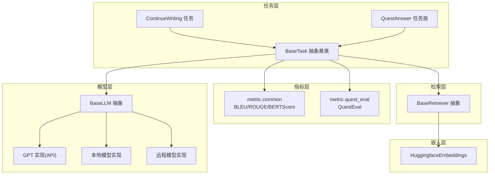
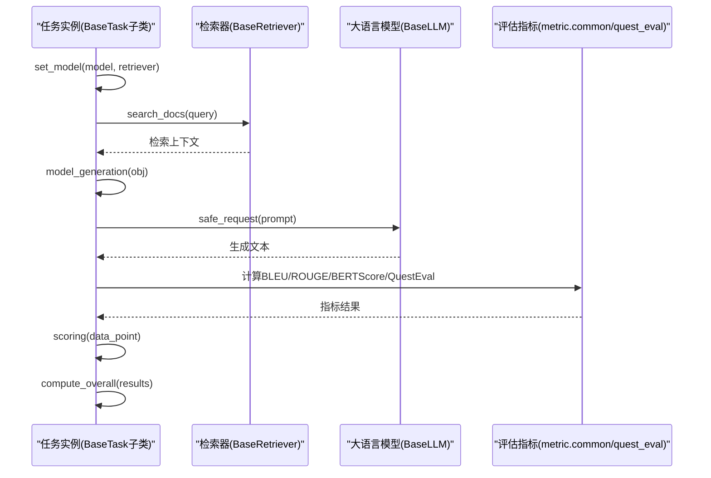
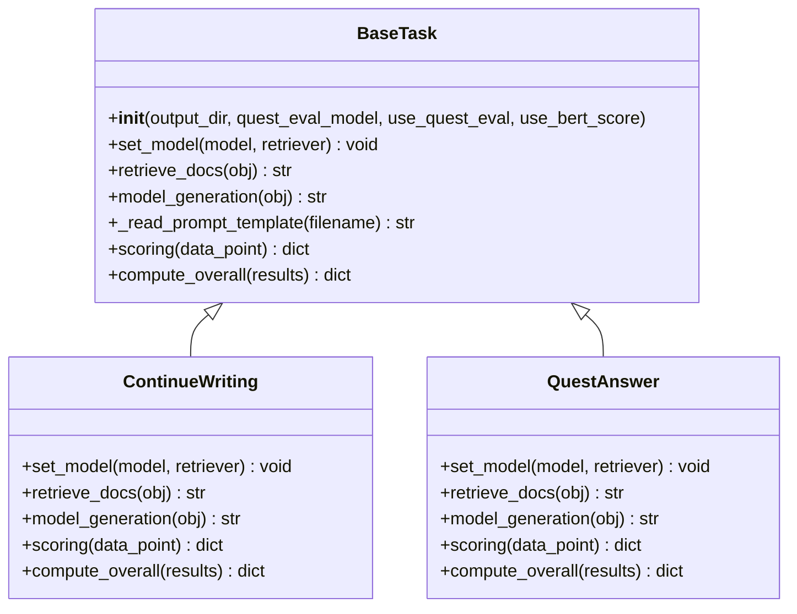
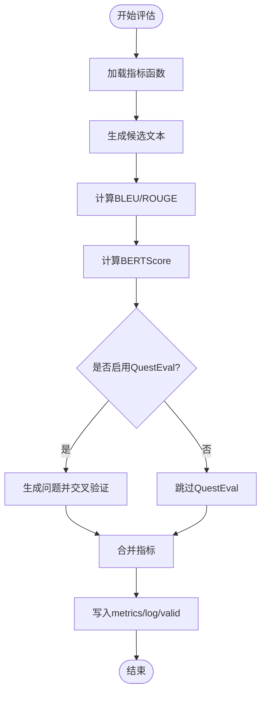
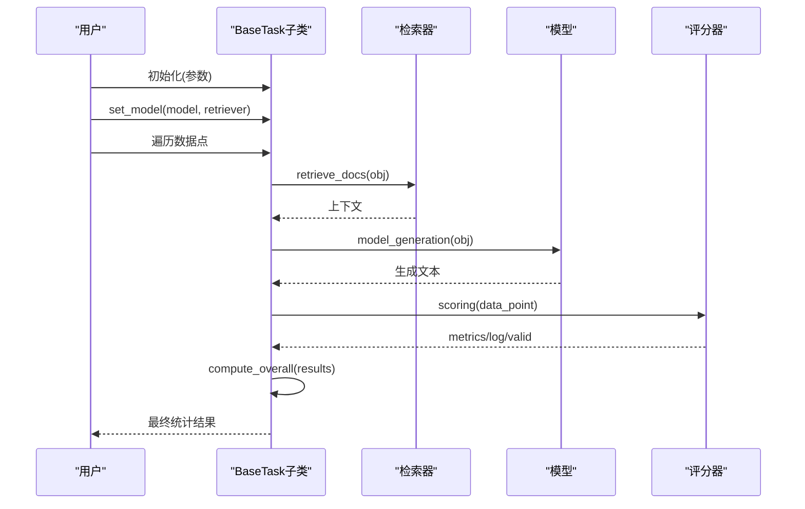
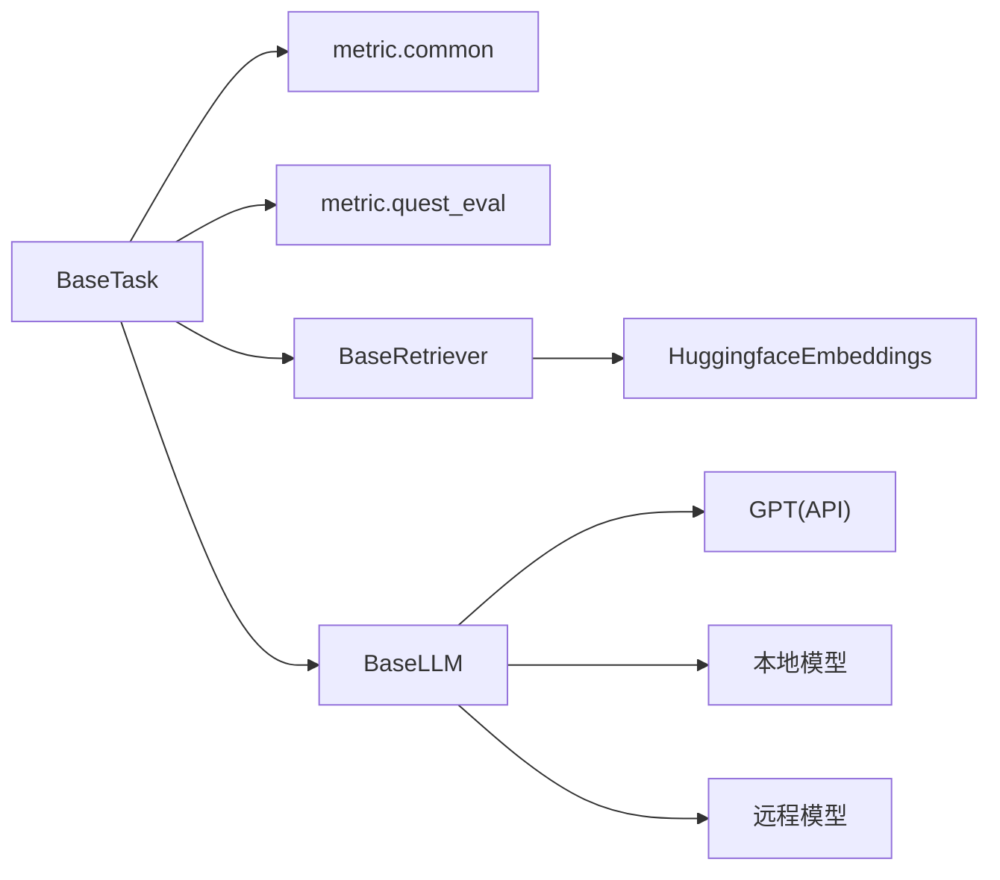

# BaseTask基类设计

<cite>
**本文档引用的文件**
- [src/tasks/base.py](file://src/tasks/base.py)
- [src/tasks/continue_writing.py](file://src/tasks/continue_writing.py)
- [src/tasks/quest_answer.py](file://src/tasks/quest_answer.py)
- [src/metric/common.py](file://src/metric/common.py)
- [src/metric/quest_eval.py](file://src/metric/quest_eval.py)
- [src/retrievers/base.py](file://src/retrievers/base.py)
- [src/llms/base.py](file://src/llms/base.py)
- [src/llms/api_model.py](file://src/llms/api_model.py)
- [src/embeddings/base.py](file://src/embeddings/base.py)
- [README.md](file://README.md)
</cite>

## 目录
1. [简介](#简介)
2. [项目结构](#项目结构)
3. [核心组件](#核心组件)
4. [架构总览](#架构总览)
5. [详细组件分析](#详细组件分析)
6. [依赖关系分析](#依赖关系分析)
7. [性能考虑](#性能考虑)
8. [故障排查指南](#故障排查指南)
9. [结论](#结论)
10. [附录：扩展与最佳实践](#附录扩展与最佳实践)

## 简介
本文件围绕CRUD-RAG中的BaseTask抽象基类进行系统化设计文档编写，目标是帮助读者深入理解其设计理念、架构模式、任务生命周期管理（初始化参数配置、模型设置、文档检索、模型生成、评分计算）、标准化评估流程与接口规范，并掌握BLEU、ROUGE、BERTScore、RAGQuestEval等指标的集成方式。同时提供任务扩展指南与最佳实践，便于基于BaseTask派生自定义评估任务。

## 项目结构
CRUD-RAG采用按职责分层的模块化组织方式：
- tasks：任务抽象与具体任务实现（如ContinueWriting、QuestAnswer）
- metric：评估指标实现（common中通用指标，quest_eval中QuestEval）
- retrievers：检索器抽象与实现（向量索引构建、查询引擎）
- llms：大语言模型抽象与多实现（本地、远程、OpenAI API）
- embeddings：嵌入模型封装（SentenceTransformer/CrossEncoder）
- configs：配置加载（运行时从real_config或config导入）

图表来源
- [src/tasks/base.py:13-74](file://src/tasks/base.py#L13-L74)
- [src/tasks/continue_writing.py:13-119](file://src/tasks/continue_writing.py#L13-L119)
- [src/tasks/quest_answer.py:14-134](file://src/tasks/quest_answer.py#L14-L134)
- [src/metric/common.py:23-86](file://src/metric/common.py#L23-L86)
- [src/metric/quest_eval.py:23-152](file://src/metric/quest_eval.py#L23-L152)
- [src/retrievers/base.py:16-142](file://src/retrievers/base.py#L16-L142)
- [src/llms/base.py:6-47](file://src/llms/base.py#L6-L47)
- [src/llms/api_model.py:12-33](file://src/llms/api_model.py#L12-L33)
- [src/embeddings/base.py:14-88](file://src/embeddings/base.py#L14-L88)

章节来源
- [README.md:27-68](file://README.md#L27-L68)

## 核心组件
本节聚焦BaseTask抽象基类及其典型子类，阐述其职责边界、接口契约与生命周期方法。

- BaseTask抽象基类
  - 职责：定义统一的任务生命周期与评估接口；提供可选的QuestEval与BERTScore指标开关；提供模板读取辅助方法；定义scoring与compute_overall的标准返回结构。
  - 关键方法：
    - 初始化参数：output_dir、quest_eval_model、use_quest_eval、use_bert_score
    - set_model：注入模型与检索器实例
    - retrieve_docs：根据数据点对象检索上下文
    - model_generation：基于模板与检索结果生成文本
    - _read_prompt_template：读取提示词模板
    - scoring：返回metrics、log、valid三元组
    - compute_overall：对一批结果进行整体统计
  - 设计要点：通过抽象方法强制子类实现具体流程；通过标志位控制是否启用QuestEval与BERTScore，避免不必要的开销。

- 典型子类示例
  - ContinueWriting：面向续写任务，结合检索上下文与提示模板生成续写文本，并计算BLEU、ROUGE、BERTScore与QuestEval指标。
  - QuestAnswer：面向问答任务族，支持单/双/三篇文档场景的变体，复用相同的指标计算与整体统计逻辑。

章节来源
- [src/tasks/base.py:13-74](file://src/tasks/base.py#L13-L74)
- [src/tasks/continue_writing.py:13-119](file://src/tasks/continue_writing.py#L13-L119)
- [src/tasks/quest_answer.py:14-134](file://src/tasks/quest_answer.py#L14-L134)

## 架构总览
BaseTask作为任务编排的核心，向上承接数据点与输出目录，向下协调检索器与大语言模型，同时集成多种评估指标。其标准接口确保不同任务在统一框架下执行，便于横向对比与扩展。

图表来源
- [src/tasks/base.py:34-74](file://src/tasks/base.py#L34-L74)
- [src/tasks/continue_writing.py:33-119](file://src/tasks/continue_writing.py#L33-L119)
- [src/tasks/quest_answer.py:34-134](file://src/tasks/quest_answer.py#L34-L134)
- [src/retrievers/base.py:133-142](file://src/retrievers/base.py#L133-L142)
- [src/llms/base.py:38-47](file://src/llms/base.py#L38-L47)
- [src/metric/common.py:23-86](file://src/metric/common.py#L23-L86)
- [src/metric/quest_eval.py:92-152](file://src/metric/quest_eval.py#L92-L152)

## 详细组件分析

### BaseTask抽象基类
- 设计模式：模板方法模式 + 策略模式
  - 模板方法：set_model、retrieve_docs、model_generation、scoring、compute_overall构成固定流程骨架
  - 策略模式：子类重写具体步骤，如retrieve_docs与model_generation的实现策略
- 生命周期管理
  - 初始化阶段：校验并创建输出目录；按需初始化QuestEval实例
  - 执行阶段：set_model注入依赖；retrieve_docs获取上下文；model_generation生成文本；scoring产出指标与日志；compute_overall汇总统计
- 接口规范
  - scoring必须返回包含metrics、log、valid的字典
  - compute_overall接收results列表，返回聚合指标字典
  - 可选指标：BLEU、ROUGE、BERTScore、QuestEval

图表来源
- [src/tasks/base.py:13-74](file://src/tasks/base.py#L13-L74)
- [src/tasks/continue_writing.py:13-119](file://src/tasks/continue_writing.py#L13-L119)
- [src/tasks/quest_answer.py:14-134](file://src/tasks/quest_answer.py#L14-L134)

章节来源
- [src/tasks/base.py:13-74](file://src/tasks/base.py#L13-L74)

### 评估指标集成机制
- BLEU/ROUGE/BERTScore
  - 通过metric.common提供的函数实现，支持中文分词与向量化相似度计算
  - 在scoring中直接调用，返回多粒度BLEU与ROUGE-L分数及BERTScore
- QuestEval
  - 通过metric.quest_eval中的QuestEval类实现，基于GPT生成问题并交叉验证生成文本与参考文本的答案一致性
  - 支持保存/加载问题与答案集，避免重复生成
  - 返回平均F1与召回率，并记录详细问答对信息用于后续分析

图表来源
- [src/metric/common.py:23-86](file://src/metric/common.py#L23-L86)
- [src/metric/quest_eval.py:92-152](file://src/metric/quest_eval.py#L92-L152)
- [src/tasks/continue_writing.py:62-119](file://src/tasks/continue_writing.py#L62-L119)
- [src/tasks/quest_answer.py:63-134](file://src/tasks/quest_answer.py#L63-L134)

章节来源
- [src/metric/common.py:23-86](file://src/metric/common.py#L23-L86)
- [src/metric/quest_eval.py:23-152](file://src/metric/quest_eval.py#L23-L152)
- [src/tasks/continue_writing.py:62-119](file://src/tasks/continue_writing.py#L62-L119)
- [src/tasks/quest_answer.py:63-134](file://src/tasks/quest_answer.py#L63-L134)

### 任务生命周期管理
- 初始化参数配置
  - output_dir：输出目录，不存在则自动创建
  - quest_eval_model：QuestEval使用的模型名称
  - use_quest_eval/use_bert_score：控制是否启用对应指标
- 模型设置
  - set_model接收模型与检索器实例，供后续检索与生成使用
- 文档检索
  - retrieve_docs根据输入对象提取查询语句，调用检索器search_docs获取上下文
- 模型生成
  - model_generation读取提示词模板，拼接检索上下文与输入，调用模型safe_request生成文本
- 评分计算
  - scoring返回metrics、log、valid三元组；compute_overall对指标进行平均或加权统计

图表来源
- [src/tasks/base.py:14-74](file://src/tasks/base.py#L14-L74)
- [src/retrievers/base.py:133-142](file://src/retrievers/base.py#L133-L142)
- [src/llms/base.py:38-47](file://src/llms/base.py#L38-L47)
- [src/tasks/continue_writing.py:33-119](file://src/tasks/continue_writing.py#L33-L119)
- [src/tasks/quest_answer.py:34-134](file://src/tasks/quest_answer.py#L34-L134)

章节来源
- [src/tasks/base.py:14-74](file://src/tasks/base.py#L14-L74)
- [src/tasks/continue_writing.py:33-119](file://src/tasks/continue_writing.py#L33-L119)
- [src/tasks/quest_answer.py:34-134](file://src/tasks/quest_answer.py#L34-L134)

### 评估指标集成详解
- BLEU
  - 使用evaluate库与中文分词器，计算多阶精确率与brevity_penalty修正后的BLEU分数
- ROUGE-L
  - 基于最长公共子序列的长度比值，衡量长序列相似性
- BERTScore
  - 使用text2vec相似度模型计算中文文本语义相似度
- QuestEval
  - 通过GPT生成问题，再分别用参考文本与生成文本回答，计算F1与召回率
  - 对“无法推断”的答案进行过滤，提升评估稳定性

章节来源
- [src/metric/common.py:23-86](file://src/metric/common.py#L23-L86)
- [src/metric/quest_eval.py:92-152](file://src/metric/quest_eval.py#L92-L152)

### 任务扩展指南
- 继承BaseTask并实现以下方法：
  - set_model：保存模型与检索器实例
  - retrieve_docs：从数据点中提取查询并调用检索器search_docs
  - model_generation：读取提示词模板，拼接上下文与输入，调用模型safe_request生成文本
  - scoring：计算指标并返回metrics、log、valid
  - compute_overall：对results进行聚合统计
- 提示词模板
  - 将模板文件置于src/prompts目录，使用_read_prompt_template读取
- 输出目录
  - 自动创建output_dir，用于保存中间结果与日志
- 指标选择
  - 根据任务特性选择BLEU/ROUGE/BERTScore/QuestEval组合

章节来源
- [src/tasks/base.py:13-74](file://src/tasks/base.py#L13-L74)
- [src/tasks/continue_writing.py:53-61](file://src/tasks/continue_writing.py#L53-L61)
- [src/tasks/quest_answer.py:54-61](file://src/tasks/quest_answer.py#L54-L61)

## 依赖关系分析
- 组件耦合
  - BaseTask与metric.common、metric.quest_eval存在功能耦合，但通过标志位解耦
  - BaseTask与retrievers.base、llms.base形成弱依赖，便于替换实现
- 外部依赖
  - evaluate、jieba、numpy、requests等第三方库
  - HuggingFace BLEU/ROUGE缓存、text2vec中文相似度模型
- 循环依赖
  - 未发现循环导入；各模块职责清晰，接口边界明确

图表来源
- [src/tasks/base.py:6-11](file://src/tasks/base.py#L6-L11)
- [src/retrievers/base.py:16-142](file://src/retrievers/base.py#L16-L142)
- [src/llms/base.py:6-47](file://src/llms/base.py#L6-L47)
- [src/llms/api_model.py:12-33](file://src/llms/api_model.py#L12-L33)
- [src/embeddings/base.py:14-88](file://src/embeddings/base.py#L14-L88)

章节来源
- [src/tasks/base.py:6-11](file://src/tasks/base.py#L6-L11)
- [src/retrievers/base.py:16-142](file://src/retrievers/base.py#L16-L142)
- [src/llms/base.py:6-47](file://src/llms/base.py#L6-L47)
- [src/llms/api_model.py:12-33](file://src/llms/api_model.py#L12-L33)
- [src/embeddings/base.py:14-88](file://src/embeddings/base.py#L14-L88)

## 性能考虑
- 指标计算
  - BLEU/ROUGE：计算开销较小，适合批量评估
  - BERTScore：依赖网络或本地模型，首次加载较慢，建议缓存或离线预处理
  - QuestEval：依赖外部GPT服务，耗时较长，建议批量化与并发控制
- 检索与生成
  - 向量索引构建与Milvus交互为瓶颈，应一次性构建并复用
  - 模型请求需注意并发与速率限制，合理设置温度与最大token数
- I/O与存储
  - 输出目录与中间文件较多，建议定期清理与归档

## 故障排查指南
- QuestEval异常
  - 现象：返回空问答对或指标为0
  - 排查：确认GPT可用性、提示词模板是否存在、问题集文件是否正确加载
- BERTScore失败
  - 现象：返回0或警告
  - 排查：检查text2vec模型路径与网络连通性
- 指标计算异常
  - 现象：BLEU/ROUGE计算报错
  - 排查：确认中文分词器可用、输入文本非空且格式正确
- 模型请求异常
  - 现象：模型调用抛出异常
  - 排查：使用BaseLLM.safe_request进行容错包装，查看日志与token用量

章节来源
- [src/metric/quest_eval.py:121-127](file://src/metric/quest_eval.py#L121-L127)
- [src/metric/common.py:13-21](file://src/metric/common.py#L13-L21)
- [src/llms/base.py:38-47](file://src/llms/base.py#L38-L47)

## 结论
BaseTask以抽象基类形式定义了CRUD-RAG评估体系的统一范式，通过明确的生命周期与接口规范，实现了检索、生成、评分与统计的标准化流水线。借助BLEU、ROUGE、BERTScore与QuestEval等指标的灵活集成，既保证了评估的多样性，又维持了扩展的便利性。遵循本文的最佳实践，可快速派生新任务并稳定落地到实际评测场景。

## 附录：扩展与最佳实践
- 快速上手
  - 继承BaseTask，仅需实现set_model、retrieve_docs、model_generation、scoring与compute_overall
  - 将提示词模板放入src/prompts，使用_read_prompt_template读取
- 参数建议
  - use_quest_eval：仅在需要语义问答一致性时开启
  - use_bert_score：在中文语义相似度评估中优先使用
  - 温度与最大token：根据任务复杂度调整，降低噪声与截断
- 并发与稳定性
  - 对QuestEval与模型请求进行限流与重试
  - 分批处理数据点，避免内存峰值过高
- 数据与日志
  - 保留generated_text、ground_truth_text与quest_eval_save等关键字段，便于回溯与二次分析