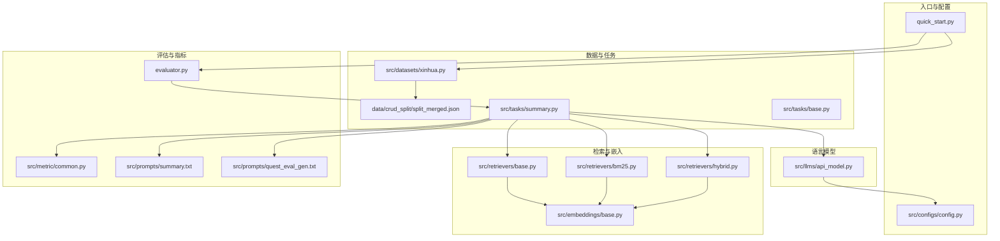
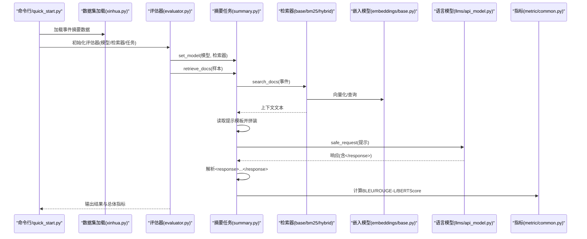
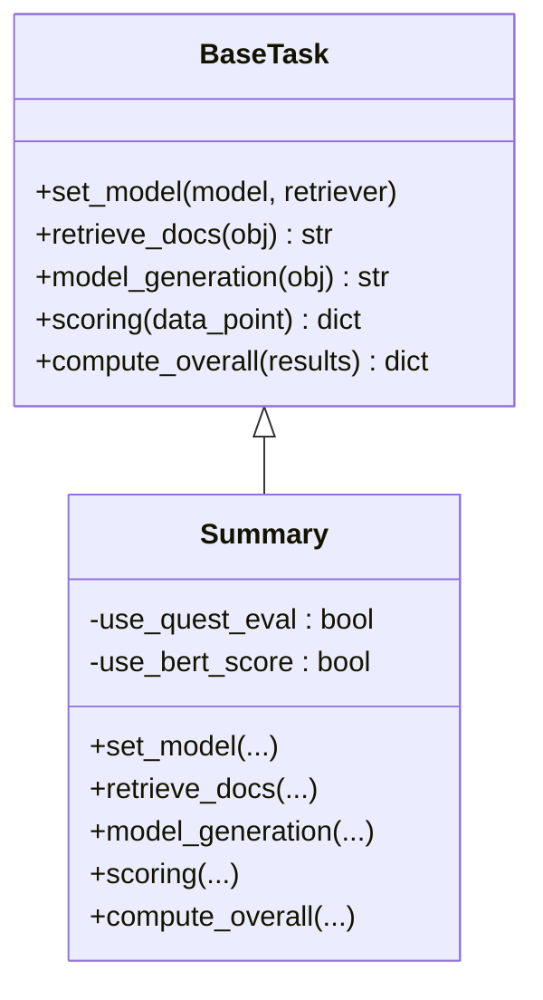
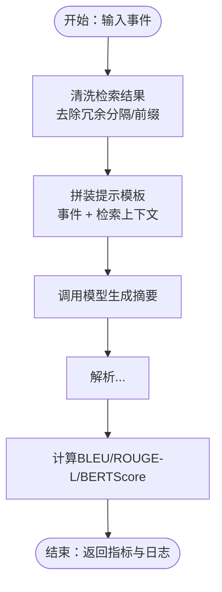
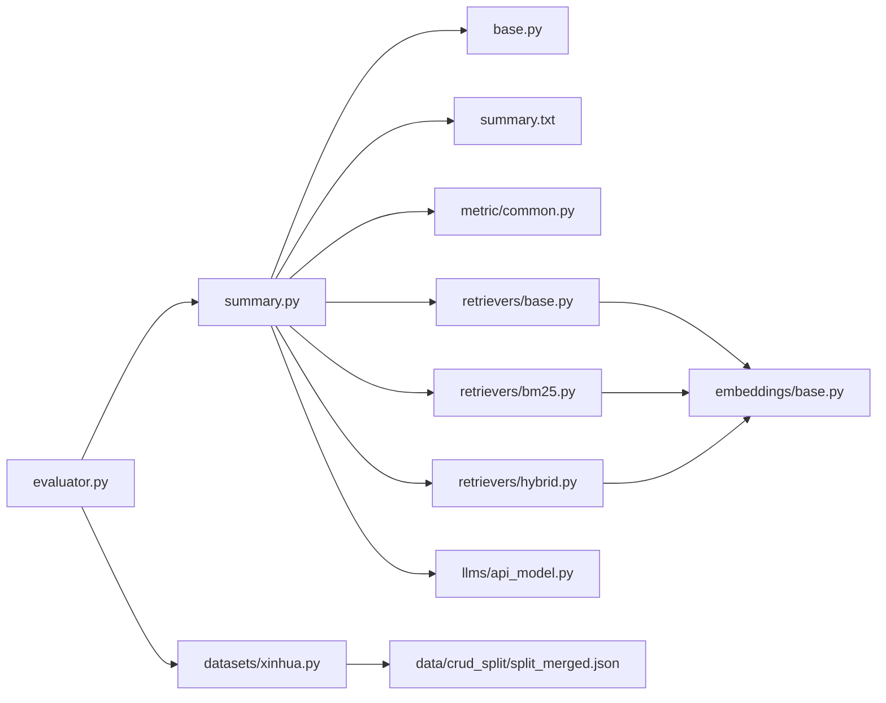

# 事件摘要任务

<cite>
**本文引用的文件**
- [README.md](file://README.md)
- [quick_start.py](file://quick_start.py)
- [evaluator.py](file://evaluator.py)
- [src/tasks/base.py](file://src/tasks/base.py)
- [src/tasks/summary.py](file://src/tasks/summary.py)
- [src/prompts/summary.txt](file://src/prompts/summary.txt)
- [src/prompts/quest_eval_gen.txt](file://src/prompts/quest_eval_gen.txt)
- [src/datasets/xinhua.py](file://src/datasets/xinhua.py)
- [data/crud_split/split_merged.json](file://data/crud_split/split_merged.json)
- [src/retrievers/base.py](file://src/retrievers/base.py)
- [src/retrievers/bm25.py](file://src/retrievers/bm25.py)
- [src/retrievers/hybrid.py](file://src/retrievers/hybrid.py)
- [src/embeddings/base.py](file://src/embeddings/base.py)
- [src/llms/api_model.py](file://src/llms/api_model.py)
- [src/configs/config.py](file://src/configs/config.py)
- [src/metric/common.py](file://src/metric/common.py)
</cite>

## 目录
1. [简介](#简介)
2. [项目结构](#项目结构)
3. [核心组件](#核心组件)
4. [架构总览](#架构总览)
5. [详细组件分析](#详细组件分析)
6. [依赖分析](#依赖分析)
7. [性能考量](#性能考量)
8. [故障排除指南](#故障排除指南)
9. [结论](#结论)
10. [附录](#附录)

## 简介
本文件面向CRUD-RAG的“事件摘要任务”，系统阐述基于检索增强生成（RAG）的新闻事件摘要生成流程与实现细节。文档聚焦以下方面：
- 算法原理与实现：事件查询、上下文检索、提示模板设计、模型调用、结果解析与评分。
- 提示模板设计：如何通过结构化模板约束输出格式，确保摘要稳定可解析。
- 模型调用流程：从参数配置到API请求、响应解析与异常处理。
- 结果优化策略：上下文清洗、输出截断、长度控制与多指标评估。
- 使用示例：不同检索器、模型与评估指标组合下的摘要生成与评估。
- 评估指标：BLEU、ROUGE-L、BERTScore与RAGQuestEval的应用与计算方法。
- 性能优化与常见问题：索引构建、并发与缓存、错误恢复与重试。

## 项目结构
CRUD-RAG采用模块化设计，围绕“数据集-检索器-语言模型-任务-评估器”的流水线组织代码。事件摘要任务位于tasks模块，结合prompt模板、metrics与retriever实现端到端摘要生成与评估。

图表来源
- [quick_start.py:1-110](file://quick_start.py#L1-L110)
- [src/tasks/summary.py:1-121](file://src/tasks/summary.py#L1-L121)
- [src/retrievers/base.py:1-142](file://src/retrievers/base.py#L1-L142)
- [src/retrievers/bm25.py:1-92](file://src/retrievers/bm25.py#L1-L92)
- [src/retrievers/hybrid.py:1-81](file://src/retrievers/hybrid.py#L1-L81)
- [src/embeddings/base.py:1-88](file://src/embeddings/base.py#L1-L88)
- [src/llms/api_model.py:1-33](file://src/llms/api_model.py#L1-L33)
- [src/metric/common.py:1-117](file://src/metric/common.py#L1-L117)
- [src/prompts/summary.txt:1-16](file://src/prompts/summary.txt#L1-L16)
- [src/prompts/quest_eval_gen.txt:1-10](file://src/prompts/quest_eval_gen.txt#L1-L10)
- [src/datasets/xinhua.py:1-54](file://src/datasets/xinhua.py#L1-L54)
- [data/crud_split/split_merged.json:1-200](file://data/crud_split/split_merged.json#L1-L200)

章节来源
- [README.md:27-120](file://README.md#L27-L120)
- [quick_start.py:1-110](file://quick_start.py#L1-L110)

## 核心组件
- 任务基类与摘要任务
  - BaseTask定义了统一接口：设置模型与检索器、检索上下文、模型生成、评分与整体统计。
  - Summary继承BaseTask，实现事件摘要的检索、提示拼装、模型调用与结果解析、指标计算与汇总。
- 数据集加载
  - Xinhua封装事件摘要数据，提供随机打乱、切片与统计功能；get_task_datasets按任务类型返回对应数据集。
- 检索器
  - BaseRetriever：基于Milvus向量库的嵌入检索，支持分块索引与增量添加。
  - CustomBM25Retriever：基于Elasticsearch的BM25检索，支持索引构建与查询DSL。
  - EnsembleRetriever：融合BM25与向量检索的RRF重排，提升召回多样性。
- 语言模型
  - GPT（OpenAI ChatCompletion）：读取配置文件中的API密钥与代理，构造消息并调用API，记录token消耗。
- 评估与指标
  - BLEU、ROUGE-L、BERTScore：中文分词器与HuggingFace evaluate集成，支持惩罚与异常捕获。
  - RAGQuestEval：基于GPT的问答式评估，生成问题并计算F1与召回，用于RAG下游质量评估。

章节来源
- [src/tasks/base.py:1-74](file://src/tasks/base.py#L1-L74)
- [src/tasks/summary.py:1-121](file://src/tasks/summary.py#L1-L121)
- [src/datasets/xinhua.py:1-54](file://src/datasets/xinhua.py#L1-L54)
- [src/retrievers/base.py:1-142](file://src/retrievers/base.py#L1-L142)
- [src/retrievers/bm25.py:1-92](file://src/retrievers/bm25.py#L1-L92)
- [src/retrievers/hybrid.py:1-81](file://src/retrievers/hybrid.py#L1-L81)
- [src/llms/api_model.py:1-33](file://src/llms/api_model.py#L1-L33)
- [src/metric/common.py:1-117](file://src/metric/common.py#L1-L117)

## 架构总览
事件摘要任务的端到端流程如下：

图表来源
- [quick_start.py:54-110](file://quick_start.py#L54-L110)
- [src/tasks/summary.py:32-50](file://src/tasks/summary.py#L32-L50)
- [src/retrievers/base.py:133-141](file://src/retrievers/base.py#L133-L141)
- [src/retrievers/bm25.py:70-92](file://src/retrievers/bm25.py#L70-L92)
- [src/retrievers/hybrid.py:50-81](file://src/retrievers/hybrid.py#L50-L81)
- [src/llms/api_model.py:17-33](file://src/llms/api_model.py#L17-L33)
- [src/metric/common.py:24-86](file://src/metric/common.py#L24-L86)

## 详细组件分析

### 事件摘要任务（Summary）
- 职责
  - 设置模型与检索器。
  - 从样本中提取事件，调用检索器获取上下文，清洗检索结果。
  - 读取提示模板，拼装事件与上下文，调用模型生成摘要。
  - 解析模型输出，限定在<response>标签内；计算多种指标并汇总。
- 关键实现要点
  - 检索上下文清洗：去除检索引擎返回中的多余分隔与前缀，保留可读文本。
  - 提示模板：要求模型将摘要写在<response>标签内，便于稳定解析。
  - 指标计算：BLEU、ROUGE-L、BERTScore；可选RAGQuestEval与BERTScore开关。
  - 整体统计：对指标求平均，对QuestEval按有效问答计数归一化。

图表来源
- [src/tasks/base.py:13-74](file://src/tasks/base.py#L13-L74)
- [src/tasks/summary.py:12-121](file://src/tasks/summary.py#L12-L121)

章节来源
- [src/tasks/summary.py:12-121](file://src/tasks/summary.py#L12-L121)
- [src/tasks/base.py:13-74](file://src/tasks/base.py#L13-L74)

### 提示模板设计（summary.txt）
- 设计目标
  - 明确角色（新闻工作者）与任务（基于事件与上下文生成摘要）。
  - 强制输出格式：要求将摘要置于<response>与</response>之间，便于稳定解析。
  - 示例与上下文：模板包含示例与“事件”“检索到的文档”占位符，便于模型理解结构化输入。
- 使用方式
  - Summary在model_generation中读取模板并format填充事件与检索到的上下文。

章节来源
- [src/prompts/summary.txt:1-16](file://src/prompts/summary.txt#L1-L16)
- [src/tasks/summary.py:42-50](file://src/tasks/summary.py#L42-L50)

### 检索器与嵌入（Retriever & Embeddings）
- BaseRetriever
  - 基于LlamaIndex与Milvus向量库，支持分块索引与增量添加；查询时通过向量相似度返回Top-K文档。
  - 对检索结果进行清洗，去除文件路径等冗余信息。
- CustomBM25Retriever
  - 基于Elasticsearch的BM25检索，支持索引构建与DSL查询；适合关键词匹配与快速检索。
- EnsembleRetriever
  - 融合BM25与向量检索，采用RRF重排，提升召回多样性与稳定性。
- Embeddings
  - 基于SentenceTransformer的bi-encoder，支持批量编码与归一化，适配向量检索。

图表来源
- [src/tasks/summary.py:36-50](file://src/tasks/summary.py#L36-L50)
- [src/retrievers/base.py:133-141](file://src/retrievers/base.py#L133-L141)
- [src/retrievers/bm25.py:70-92](file://src/retrievers/bm25.py#L70-L92)
- [src/retrievers/hybrid.py:50-81](file://src/retrievers/hybrid.py#L50-L81)

章节来源
- [src/retrievers/base.py:16-142](file://src/retrievers/base.py#L16-L142)
- [src/retrievers/bm25.py:14-92](file://src/retrievers/bm25.py#L14-L92)
- [src/retrievers/hybrid.py:13-81](file://src/retrievers/hybrid.py#L13-L81)
- [src/embeddings/base.py:14-88](file://src/embeddings/base.py#L14-L88)

### 语言模型与配置（GPT与配置）
- GPT（OpenAI）
  - 从配置模块导入API密钥与base_url，构造用户消息，调用chat.completions接口。
  - 记录token消耗，便于成本与用量监控。
- 配置
  - 支持OpenAI API Key与可选代理Base URL；支持本地模型路径配置（用于其他任务）。

章节来源
- [src/llms/api_model.py:12-33](file://src/llms/api_model.py#L12-L33)
- [src/configs/config.py:1-14](file://src/configs/config.py#L1-L14)

### 评估与指标（BLEU/ROUGE-BERTScore/RAGQuestEval）
- BLEU
  - 使用中文分词器与evaluate库，支持惩罚项与精度分解；可选是否应用brevity penalty。
- ROUGE-L
  - 使用evaluate库的rougeL指标，中文分词器预处理。
- BERTScore
  - 使用本地缓存的Chinese文本相似度模型，计算生成与参考之间的相似度。
- RAGQuestEval
  - 基于GPT生成问题并评估问答一致性，支持F1与召回统计；可选开启以提升RAG质量评估维度。

章节来源
- [src/metric/common.py:24-86](file://src/metric/common.py#L24-L86)
- [src/tasks/summary.py:61-99](file://src/tasks/summary.py#L61-L99)
- [src/prompts/quest_eval_gen.txt:1-10](file://src/prompts/quest_eval_gen.txt#L1-L10)

### 数据集与示例（Xinhua与split_merged.json）
- Xinhua
  - 封装事件摘要数据，支持随机打乱与统计；按任务类型返回对应数据集列表。
- split_merged.json
  - 包含事件、摘要、原文、URL、标题等字段，事件摘要任务直接使用该数据。

章节来源
- [src/datasets/xinhua.py:8-54](file://src/datasets/xinhua.py#L8-L54)
- [data/crud_split/split_merged.json:1-200](file://data/crud_split/split_merged.json#L1-L200)

## 依赖分析
- 组件耦合
  - Summary依赖BaseTask接口、Prompt模板、Retriever、LLM与Metrics。
  - Retriever依赖Embeddings与向量数据库（Milvus/Elasticsearch）。
  - LLM依赖配置模块与OpenAI API。
  - Metrics独立于任务，提供通用评估函数。
- 并发与缓存
  - 评估器使用线程池并发处理样本，支持断点续跑与结果去重。
- 可能的循环依赖
  - 当前模块间为单向依赖，未见循环导入。

图表来源
- [src/tasks/summary.py:1-121](file://src/tasks/summary.py#L1-L121)
- [src/tasks/base.py:1-74](file://src/tasks/base.py#L1-L74)
- [src/retrievers/base.py:1-142](file://src/retrievers/base.py#L1-L142)
- [src/retrievers/bm25.py:1-92](file://src/retrievers/bm25.py#L1-L92)
- [src/retrievers/hybrid.py:1-81](file://src/retrievers/hybrid.py#L1-L81)
- [src/embeddings/base.py:1-88](file://src/embeddings/base.py#L1-L88)
- [src/llms/api_model.py:1-33](file://src/llms/api_model.py#L1-L33)
- [src/metric/common.py:1-117](file://src/metric/common.py#L1-L117)
- [src/datasets/xinhua.py:1-54](file://src/datasets/xinhua.py#L1-L54)
- [evaluator.py:1-192](file://evaluator.py#L1-L192)

章节来源
- [evaluator.py:13-192](file://evaluator.py#L13-L192)
- [src/tasks/summary.py:1-121](file://src/tasks/summary.py#L1-L121)

## 性能考量
- 检索性能
  - 向量检索：Milvus分块索引与分批构建，适合大规模文档；Top-K越大，召回越全但延迟越高。
  - BM25检索：关键词匹配快，适合初步筛选；与向量检索融合可提升召回多样性。
  - 混合检索：RRF重排在召回多样性与排序质量间取得平衡。
- 生成性能
  - 控制max_new_tokens与temperature，平衡生成长度与稳定性。
  - 提示模板简洁明确，减少模型歧义，提高生成速度与一致性。
- 评估性能
  - BLEU/ROUGE-L/BERTScore均为本地计算，速度快；RAGQuestEval依赖外部模型，成本较高。
- 并发与缓存
  - 评估器支持多线程与断点续跑，避免重复计算；建议合理设置线程数与Top-K以平衡吞吐与质量。

[本节为通用性能建议，不直接分析具体文件，故无章节来源]

## 故障排除指南
- 检索失败或空结果
  - 确认索引已构建且集合名称正确；检查chunk_size与overlap参数是否合理。
  - 若使用BM25，确认Elasticsearch服务可用且DSL查询正常。
- 模型调用失败
  - 检查OpenAI API Key与Base URL配置；确认网络可达与限额状态。
  - 若响应为空或包含特定错误字符串，评估器会跳过无效样本并记录警告。
- 输出解析异常
  - 确保提示模板中包含<response>与</response>标签；模型需严格遵循格式。
- 指标计算异常
  - 某些指标在异常情况下返回默认值或警告；检查输入文本长度与分词器配置。

章节来源
- [src/retrievers/base.py:133-141](file://src/retrievers/base.py#L133-L141)
- [src/retrievers/bm25.py:70-92](file://src/retrievers/bm25.py#L70-L92)
- [src/llms/api_model.py:17-33](file://src/llms/api_model.py#L17-L33)
- [evaluator.py:76-101](file://evaluator.py#L76-L101)
- [src/tasks/summary.py:42-50](file://src/tasks/summary.py#L42-L50)
- [src/metric/common.py:13-21](file://src/metric/common.py#L13-L21)

## 结论
事件摘要任务通过清晰的任务接口、稳健的提示模板与多维评估指标，实现了从事件到高质量摘要的自动化生成。结合多种检索策略与指标体系，可在不同场景下取得稳定且可复现的结果。建议在实际部署中：
- 根据数据规模与硬件条件选择合适的检索器与Top-K。
- 严格控制提示模板与模型参数，确保输出格式一致。
- 合理使用BLEU/ROUGE-L/BERTScore与RAGQuestEval，平衡成本与质量。

[本节为总结性内容，不直接分析具体文件，故无章节来源]

## 附录

### 使用示例（命令行）
- 快速启动
  - 安装依赖、启动Milvus服务、下载嵌入模型权重目录。
  - 运行quick_start.py，指定模型、检索器、数据路径与评估选项。
- 常见组合
  - 模型：gpt-3.5-turbo 或 qwen7b。
  - 检索器：base（向量）、bm25（BM25）、hybrid（融合）。
  - 评估：开启quest_eval与bert_score_eval可获得更全面的质量评估。

章节来源
- [README.md:70-106](file://README.md#L70-L106)
- [quick_start.py:54-110](file://quick_start.py#L54-L110)

### 评估指标说明
- BLEU
  - 基于n-gram精确率与brevity penalty，支持1-4元精确率分解；可选是否应用penalty。
- ROUGE-L
  - 基于最长公共子序列的L指标，衡量生成与参考的最长匹配。
- BERTScore
  - 基于句子向量相似度，衡量语义相近程度。
- RAGQuestEval
  - 由GPT生成问题并评估问答一致性，输出F1与召回，适合RAG整体质量评估。

章节来源
- [src/metric/common.py:24-86](file://src/metric/common.py#L24-L86)
- [src/tasks/summary.py:61-99](file://src/tasks/summary.py#L61-L99)