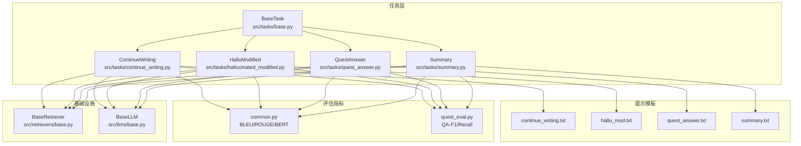
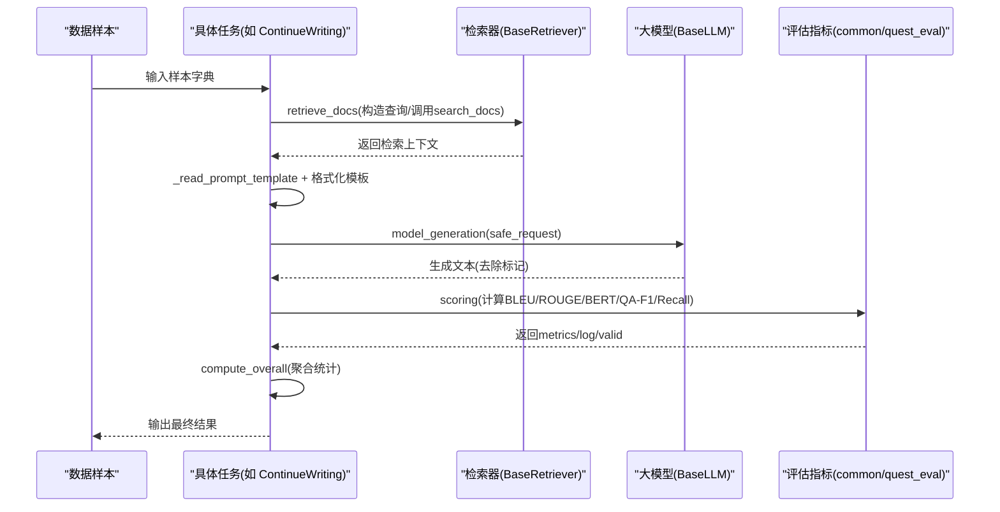
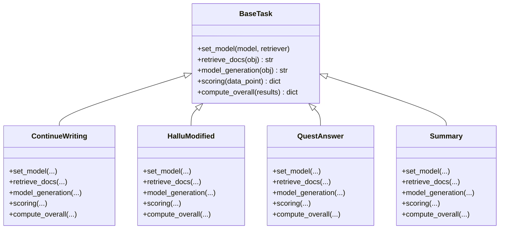
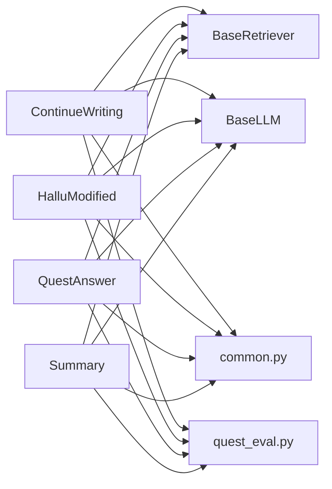

# 任务处理模块

<cite>
**本文引用的文件**
- [src/tasks/base.py](file://src/tasks/base.py)
- [src/tasks/continue_writing.py](file://src/tasks/continue_writing.py)
- [src/tasks/hallucinated_modified.py](file://src/tasks/hallucinated_modified.py)
- [src/tasks/quest_answer.py](file://src/tasks/quest_answer.py)
- [src/tasks/summary.py](file://src/tasks/summary.py)
- [src/metric/common.py](file://src/metric/common.py)
- [src/metric/quest_eval.py](file://src/metric/quest_eval.py)
- [src/prompts/continue_writing.txt](file://src/prompts/continue_writing.txt)
- [src/prompts/hallu_mod.txt](file://src/prompts/hallu_mod.txt)
- [src/prompts/quest_answer.txt](file://src/prompts/quest_answer.txt)
- [src/prompts/summary.txt](file://src/prompts/summary.txt)
- [src/retrievers/base.py](file://src/retrievers/base.py)
- [src/llms/base.py](file://src/llms/base.py)
</cite>

## 目录
1. [简介](#简介)
2. [项目结构](#项目结构)
3. [核心组件](#核心组件)
4. [架构总览](#架构总览)
5. [详细组件分析](#详细组件分析)
6. [依赖分析](#依赖分析)
7. [性能考量](#性能考量)
8. [故障排查指南](#故障排查指南)
9. [结论](#结论)
10. [附录](#附录)

## 简介
本文件系统化梳理 CRUD-RAG 的任务处理模块，围绕 BaseTask 抽象基类及其派生任务（事件摘要、继续写作、幻觉修正、问答系统等），阐述任务生命周期管理、标准化流程、提示模板使用、结果处理机制、评估指标与整体统计方法。同时提供任务扩展指南、性能优化建议、并发与批量策略、常见问题排查与调试技巧，帮助读者快速上手并高效落地不同评估场景。

## 项目结构
任务处理模块位于 src/tasks 下，采用“抽象基类 + 多种具体任务”的分层设计；与之配套的有：
- 提示模板：src/prompts/*.txt
- 评估指标：src/metric/common.py、src/metric/quest_eval.py
- 检索器：src/retrievers/base.py
- 大模型接口：src/llms/base.py

图表来源
- [src/tasks/base.py:13-74](file://src/tasks/base.py#L13-L74)
- [src/tasks/continue_writing.py:13-119](file://src/tasks/continue_writing.py#L13-L119)
- [src/tasks/hallucinated_modified.py:14-124](file://src/tasks/hallucinated_modified.py#L14-L124)
- [src/tasks/quest_answer.py:14-134](file://src/tasks/quest_answer.py#L14-L134)
- [src/tasks/summary.py:12-121](file://src/tasks/summary.py#L12-L121)
- [src/prompts/continue_writing.txt:1-18](file://src/prompts/continue_writing.txt#L1-L18)
- [src/prompts/hallu_mod.txt:1-23](file://src/prompts/hallu_mod.txt#L1-L23)
- [src/prompts/quest_answer.txt:1-15](file://src/prompts/quest_answer.txt#L1-L15)
- [src/prompts/summary.txt:1-16](file://src/prompts/summary.txt#L1-L16)
- [src/metric/common.py:23-86](file://src/metric/common.py#L23-L86)
- [src/metric/quest_eval.py:23-152](file://src/metric/quest_eval.py#L23-L152)
- [src/retrievers/base.py:16-142](file://src/retrievers/base.py#L16-L142)
- [src/llms/base.py:6-47](file://src/llms/base.py#L6-L47)

章节来源
- [src/tasks/base.py:13-74](file://src/tasks/base.py#L13-L74)
- [src/tasks/continue_writing.py:13-119](file://src/tasks/continue_writing.py#L13-L119)
- [src/tasks/hallucinated_modified.py:14-124](file://src/tasks/hallucinated_modified.py#L14-L124)
- [src/tasks/quest_answer.py:14-134](file://src/tasks/quest_answer.py#L14-L134)
- [src/tasks/summary.py:12-121](file://src/tasks/summary.py#L12-L121)

## 核心组件
- BaseTask 抽象基类：定义任务生命周期钩子（set_model、retrieve_docs、model_generation、scoring、compute_overall）、通用配置（输出目录、是否启用 QuestEval、是否启用 BERT Score）、提示模板读取工具。
- 具体任务类：继承 BaseTask 并实现各自的数据键映射、检索查询构造、提示模板填充、生成结果解析、评分与汇总逻辑。
- 评估指标：BLEU、ROUGE-L、BERT Score；QuestEval 基于问答对的 F1 与召回。
- 检索器：基于 LlamaIndex/Milvus 的向量检索，支持构建/加载索引与 Top-K 检索。
- 大模型接口：统一的请求封装（safe_request）与参数更新能力。

章节来源
- [src/tasks/base.py:13-74](file://src/tasks/base.py#L13-L74)
- [src/metric/common.py:23-86](file://src/metric/common.py#L23-L86)
- [src/metric/quest_eval.py:23-152](file://src/metric/quest_eval.py#L23-L152)
- [src/retrievers/base.py:16-142](file://src/retrievers/base.py#L16-L142)
- [src/llms/base.py:6-47](file://src/llms/base.py#L6-L47)

## 架构总览
任务执行遵循“检索-生成-评分-汇总”的标准流水线，各任务仅在数据键、检索查询与提示模板层面差异化，其余环节复用基类实现。

图表来源
- [src/tasks/continue_writing.py:37-51](file://src/tasks/continue_writing.py#L37-L51)
- [src/tasks/hallucinated_modified.py:38-55](file://src/tasks/hallucinated_modified.py#L38-L55)
- [src/tasks/quest_answer.py:38-52](file://src/tasks/quest_answer.py#L38-L52)
- [src/tasks/summary.py:36-50](file://src/tasks/summary.py#L36-L50)
- [src/retrievers/base.py:133-140](file://src/retrievers/base.py#L133-L140)
- [src/llms/base.py:38-45](file://src/llms/base.py#L38-L45)
- [src/metric/common.py:23-86](file://src/metric/common.py#L23-L86)
- [src/metric/quest_eval.py:92-129](file://src/metric/quest_eval.py#L92-L129)

## 详细组件分析

### BaseTask 抽象基类
- 设计理念
  - 通过抽象方法约束任务生命周期，确保各任务在“检索-生成-评分-汇总”路径上保持一致性。
  - 统一配置项：输出目录、是否启用 QuestEval、是否启用 BERT Score。
  - 可选的 QuestEval 初始化与指标聚合策略，便于按需开启高质量评估。
- 关键方法
  - set_model：注入模型与检索器实例，供派生类使用。
  - retrieve_docs：从样本字典中提取查询文本并调用检索器，返回上下文字符串。
  - model_generation：读取模板、格式化、调用模型 safe_request、解析响应标记。
  - scoring：返回包含 metrics、log、valid 的标准化字典。
  - compute_overall：对一批结果进行聚合统计，支持 QA 指标按有效问答数归一化。
- 数据流与复杂度
  - 检索阶段受 Top-K 与索引规模影响；生成阶段受模型参数与提示长度影响；评分阶段受指标计算库与 QuestEval 调用次数影响。

章节来源
- [src/tasks/base.py:13-74](file://src/tasks/base.py#L13-L74)

### 继承体系与类关系

图表来源
- [src/tasks/base.py:13-74](file://src/tasks/base.py#L13-L74)
- [src/tasks/continue_writing.py:13-119](file://src/tasks/continue_writing.py#L13-L119)
- [src/tasks/hallucinated_modified.py:14-124](file://src/tasks/hallucinated_modified.py#L14-L124)
- [src/tasks/quest_answer.py:14-134](file://src/tasks/quest_answer.py#L14-L134)
- [src/tasks/summary.py:12-121](file://src/tasks/summary.py#L12-L121)

### 继续写作任务（ContinueWriting）
- 数据键映射
  - 输入字典包含“beginning”（起始文本）与“continuing”（参考续写）。
  - 检索查询来自“beginning”，上下文用于续写。
- 提示模板与生成
  - 使用 continue_writing.txt，将“beginning_text”和“search_documents”填入。
  - 生成结果通过标记包裹解析，仅保留标记内的文本。
- 评分与汇总
  - 计算 BLEU 各阶精度、ROUGE-L、BERT Score。
  - 若启用 QuestEval，则基于 QA 对 F1 与召回，按有效问答数归一化。
  - 整体统计对各项指标求平均，QA 指标按有效样本数归一化。

章节来源
- [src/tasks/continue_writing.py:13-119](file://src/tasks/continue_writing.py#L13-L119)
- [src/prompts/continue_writing.txt:1-18](file://src/prompts/continue_writing.txt#L1-L18)
- [src/metric/common.py:23-86](file://src/metric/common.py#L23-L86)
- [src/metric/quest_eval.py:92-129](file://src/metric/quest_eval.py#L92-L129)

### 幻觉修正任务（HalluModified）
- 数据键映射
  - 输入字典包含“newsBeginning”“hallucinatedContinuation”“hallucinatedMod”。
  - 特殊分支：若“hallucinatedMod”为特定失败标识则直接返回该标识。
- 提示模板与生成
  - 使用 hallu_mod.txt，将“begin”“hallu_continue”“search_documents”填入。
  - 解析规则同上，仅保留标记内文本。
- 评分与汇总
  - 指标与继续写作一致，支持 QuestEval 与 BERT Score，整体统计按有效问答数归一化。

章节来源
- [src/tasks/hallucinated_modified.py:14-124](file://src/tasks/hallucinated_modified.py#L14-L124)
- [src/prompts/hallu_mod.txt:1-23](file://src/prompts/hallu_mod.txt#L1-L23)
- [src/metric/common.py:23-86](file://src/metric/common.py#L23-L86)
- [src/metric/quest_eval.py:92-129](file://src/metric/quest_eval.py#L92-L129)

### 问答系统任务（QuestAnswer）
- 数据键映射
  - 输入字典包含“questions”“answers”“retrieve_context”。
  - 支持多种变体类（QuestAnswer1Doc/2Doc/3Doc），继承同一基类。
- 提示模板与生成
  - 使用 quest_answer.txt，将“question”“search_documents”填入。
  - 解析规则同上。
- 评分与汇总
  - 指标与上述一致，整体统计按有效问答数归一化。
  - QuestAnswer1/2/3Doc 当前仅作继承占位，实际行为与父类一致。

章节来源
- [src/tasks/quest_answer.py:14-134](file://src/tasks/quest_answer.py#L14-L134)
- [src/prompts/quest_answer.txt:1-15](file://src/prompts/quest_answer.txt#L1-L15)
- [src/metric/common.py:23-86](file://src/metric/common.py#L23-L86)
- [src/metric/quest_eval.py:92-129](file://src/metric/quest_eval.py#L92-L129)

### 事件摘要任务（Summary）
- 数据键映射
  - 输入字典包含“event”“summary”“retrieve_context”。
- 提示模板与生成
  - 使用 summary.txt，将“event”“search_documents”填入。
  - 解析规则同上。
- 评分与汇总
  - 指标与上述一致，整体统计对 QA 指标按有效问答数归一化，BERT Score 按样本数归一化。

章节来源
- [src/tasks/summary.py:12-121](file://src/tasks/summary.py#L12-L121)
- [src/prompts/summary.txt:1-16](file://src/prompts/summary.txt#L1-L16)
- [src/metric/common.py:23-86](file://src/metric/common.py#L23-L86)
- [src/metric/quest_eval.py:92-129](file://src/metric/quest_eval.py#L92-L129)

### 任务生命周期与标准化流程
- 生命周期钩子
  - set_model：注入模型与检索器，供后续步骤使用。
  - retrieve_docs：从样本中抽取查询文本，调用检索器获取上下文。
  - model_generation：读取模板、格式化、调用模型 safe_request、解析响应标记。
  - scoring：标准化返回 metrics、log、valid 字段。
  - compute_overall：对一批结果进行聚合统计。
- 标准化输出
  - metrics：数值型指标集合。
  - log：字符串型日志与中间产物（如生成文本、参考文本、QuestEval 结果、时间戳）。
  - valid：布尔值，指示评估是否有效（如生成文本非空）。

章节来源
- [src/tasks/base.py:34-74](file://src/tasks/base.py#L34-L74)

### 提示模板使用与结果处理机制
- 模板读取
  - 各任务通过 _read_prompt_template(filename) 读取 src/prompts 下的模板文件。
- 结果解析
  - 生成文本统一通过“<response> ... </response>”包裹，解析取中间文本并去空白。
- 评估指标
  - BLEU/ROUGE-L：基于分词器与 evaluate 库计算。
  - BERT Score：基于本地缓存的中文相似度模型。
  - QuestEval：动态生成 QA 对或从预存 JSON 加载，计算 F1 与召回，并按“无法推断”比例计算召回。

章节来源
- [src/tasks/continue_writing.py:53-60](file://src/tasks/continue_writing.py#L53-L60)
- [src/tasks/hallucinated_modified.py:57-64](file://src/tasks/hallucinated_modified.py#L57-L64)
- [src/tasks/quest_answer.py:54-61](file://src/tasks/quest_answer.py#L54-L61)
- [src/tasks/summary.py:52-59](file://src/tasks/summary.py#L52-L59)
- [src/metric/common.py:23-86](file://src/metric/common.py#L23-L86)
- [src/metric/quest_eval.py:92-129](file://src/metric/quest_eval.py#L92-L129)

### 任务扩展指南
- 继承 BaseTask 并实现以下方法：
  - set_model：保存 model 与 retriever。
  - retrieve_docs：从输入字典提取查询键，调用检索器返回上下文。
  - model_generation：读取模板、格式化、safe_request、解析响应。
  - scoring：返回包含 metrics、log、valid 的字典。
  - compute_overall：聚合统计，注意按任务特性归一化 QA 指标。
- 配置参数
  - output_dir：输出目录（自动创建）。
  - use_quest_eval/use_bert_score：按需启用 QuestEval 与 BERT Score。
  - quest_eval_model：QuestEval 使用的大模型名称。
- 提示模板
  - 将模板文件置于 src/prompts/，并在 _read_prompt_template 中按文件名读取。
- 结果处理
  - 严格遵守 metrics/log/valid 的结构约定，保证 compute_overall 正常运行。

章节来源
- [src/tasks/base.py:14-74](file://src/tasks/base.py#L14-L74)
- [src/prompts/continue_writing.txt:1-18](file://src/prompts/continue_writing.txt#L1-L18)
- [src/prompts/hallu_mod.txt:1-23](file://src/prompts/hallu_mod.txt#L1-L23)
- [src/prompts/quest_answer.txt:1-15](file://src/prompts/quest_answer.txt#L1-L15)
- [src/prompts/summary.txt:1-16](file://src/prompts/summary.txt#L1-L16)

## 依赖分析
- 组件耦合
  - 具体任务类强依赖 BaseTask 的生命周期钩子与通用配置。
  - 与检索器、大模型接口通过 set_model 注入，弱耦合。
  - 评估指标独立于任务类，通过函数调用集成。
- 外部依赖
  - LlamaIndex/Milvus：向量检索与索引管理。
  - evaluate、jieba、text2vec：指标计算。
  - QuestEval 依赖外部模型服务与本地缓存配置。

图表来源
- [src/tasks/continue_writing.py:33-51](file://src/tasks/continue_writing.py#L33-L51)
- [src/tasks/hallucinated_modified.py:34-55](file://src/tasks/hallucinated_modified.py#L34-L55)
- [src/tasks/quest_answer.py:34-52](file://src/tasks/quest_answer.py#L34-L52)
- [src/tasks/summary.py:32-50](file://src/tasks/summary.py#L32-L50)
- [src/retrievers/base.py:16-142](file://src/retrievers/base.py#L16-L142)
- [src/llms/base.py:6-47](file://src/llms/base.py#L6-L47)
- [src/metric/common.py:23-86](file://src/metric/common.py#L23-L86)
- [src/metric/quest_eval.py:23-152](file://src/metric/quest_eval.py#L23-L152)

章节来源
- [src/tasks/continue_writing.py:33-51](file://src/tasks/continue_writing.py#L33-L51)
- [src/tasks/hallucinated_modified.py:34-55](file://src/tasks/hallucinated_modified.py#L34-L55)
- [src/tasks/quest_answer.py:34-52](file://src/tasks/quest_answer.py#L34-L52)
- [src/tasks/summary.py:32-50](file://src/tasks/summary.py#L32-L50)
- [src/retrievers/base.py:16-142](file://src/retrievers/base.py#L16-L142)
- [src/llms/base.py:6-47](file://src/llms/base.py#L6-L47)
- [src/metric/common.py:23-86](file://src/metric/common.py#L23-L86)
- [src/metric/quest_eval.py:23-152](file://src/metric/quest_eval.py#L23-L152)

## 性能考量
- 检索性能
  - 控制 similarity_top_k 与 chunk_size，平衡召回质量与延迟。
  - 分批构建/追加索引（按固定块大小切分节点）以适配 Milvus 限制。
- 生成性能
  - 合理设置 max_new_tokens 与 temperature，避免过长生成导致超时。
  - safe_request 异常兜底，减少单点失败对整体流程的影响。
- 评分性能
  - BLEU/ROUGE-L 与 BERT Score 为纯 CPU 计算，适合批量化；QuestEval 依赖外部服务，需注意并发与限速。
- 批量与并发
  - 建议按任务维度分批提交，结合队列与异步处理；对 QuestEval 与外部模型调用设置速率限制与重试策略。
- 缓存与持久化
  - QuestEval 的问题与答案可按 ID 缓存，避免重复生成与调用。

章节来源
- [src/retrievers/base.py:56-87](file://src/retrievers/base.py#L56-L87)
- [src/retrievers/base.py:111-119](file://src/retrievers/base.py#L111-L119)
- [src/llms/base.py:38-45](file://src/llms/base.py#L38-L45)
- [src/metric/quest_eval.py:30-33](file://src/metric/quest_eval.py#L30-L33)
- [src/metric/quest_eval.py:80-87](file://src/metric/quest_eval.py#L80-L87)

## 故障排查指南
- 提示模板缺失
  - 现象：模板读取为空并记录错误日志。
  - 处理：检查模板文件是否存在，路径是否正确。
- 生成结果为空
  - 现象：scoring 的 valid 为 False。
  - 处理：检查模板标记包裹是否正确、safe_request 是否抛出异常、模型返回是否为空。
- QuestEval 异常
  - 现象：返回空的 quest_eval_save 或指标为 0。
  - 处理：检查外部模型可用性、网络连接、模板与 ID 映射；必要时清理缓存重新生成。
- 指标计算异常
  - 现象：部分指标返回 0 或警告。
  - 处理：确认输入文本非空、分词器可用、BERT 模型缓存完整。

章节来源
- [src/tasks/continue_writing.py:53-60](file://src/tasks/continue_writing.py#L53-L60)
- [src/tasks/hallucinated_modified.py:57-64](file://src/tasks/hallucinated_modified.py#L57-L64)
- [src/tasks/quest_answer.py:54-61](file://src/tasks/quest_answer.py#L54-L61)
- [src/tasks/summary.py:52-59](file://src/tasks/summary.py#L52-L59)
- [src/llms/base.py:38-45](file://src/llms/base.py#L38-L45)
- [src/metric/quest_eval.py:121-127](file://src/metric/quest_eval.py#L121-L127)
- [src/metric/common.py:13-20](file://src/metric/common.py#L13-L20)

## 结论
任务处理模块以 BaseTask 为核心，通过统一的生命周期与标准化输出，将检索、生成、评分与汇总流程解耦，既保证了扩展性，又降低了维护成本。结合提示模板、评估指标与检索器/模型接口，能够灵活支撑多种评估场景。建议在生产环境中配合批量与并发策略、缓存与重试机制，以提升稳定性与吞吐。

## 附录
- 任务选择建议
  - 继续写作：关注续写连贯性与事实一致性，适合评估生成延续质量。
  - 幻觉修正：聚焦事实性纠偏，适合评估模型对错误信息的修正能力。
  - 问答系统：面向事实问答，适合评估检索增强问答的准确性与鲁棒性。
  - 事件摘要：面向结构化摘要生成，适合评估信息提炼与压缩能力。
- 实施要点
  - 明确数据键与模板字段映射，确保 retrieve_docs 与 model_generation 的输入一致。
  - 按需启用 QuestEval 与 BERT Score，兼顾评估质量与性能。
  - 对 QuestEval 的问题生成与答案抽取进行缓存，降低重复开销。