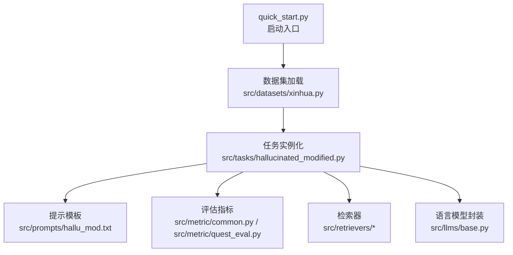
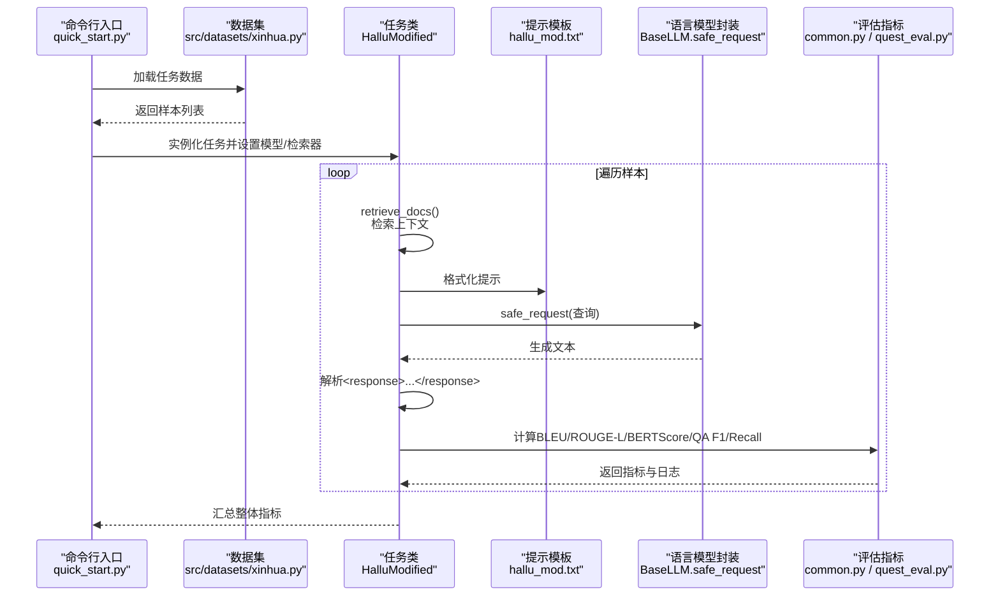
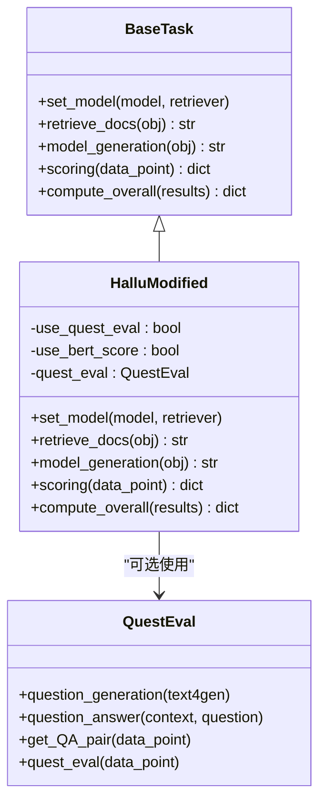
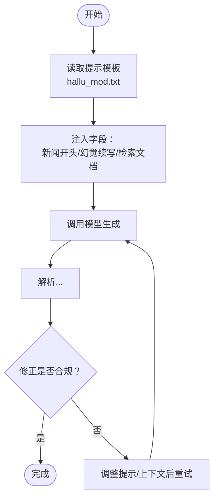
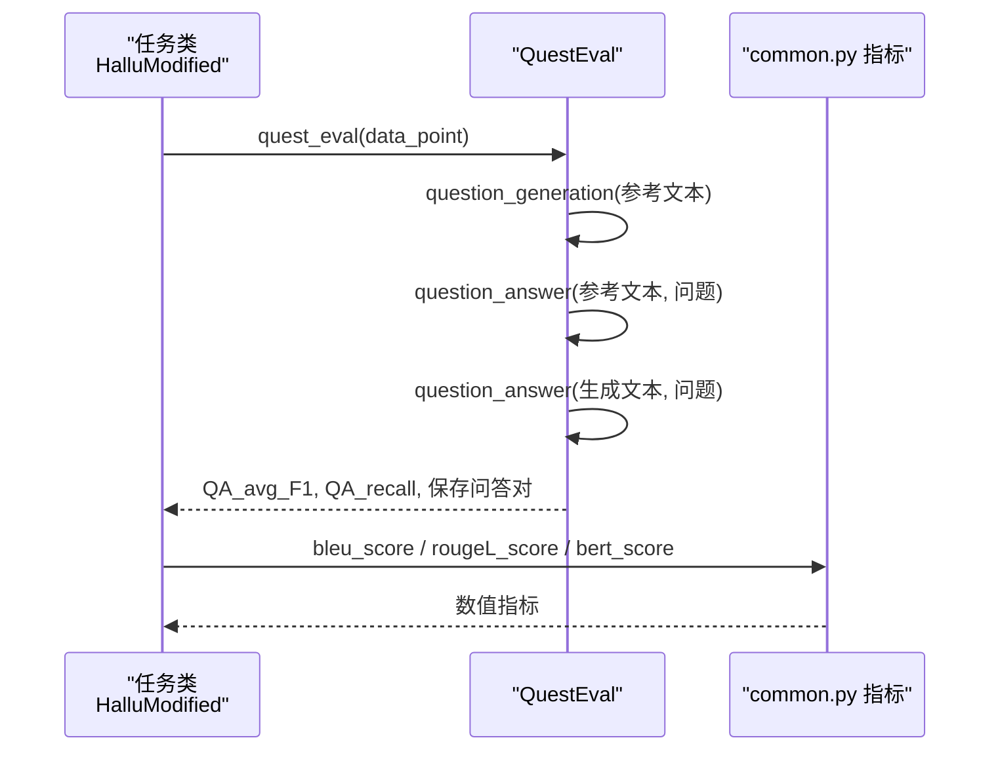
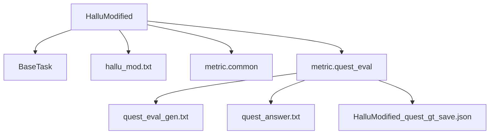

# 幻觉修正任务

<cite>
**本文引用的文件**
- [src/tasks/hallucinated_modified.py](file://src/tasks/hallucinated_modified.py)
- [src/prompts/hallu_mod.txt](file://src/prompts/hallu_mod.txt)
- [src/metric/common.py](file://src/metric/common.py)
- [src/metric/quest_eval.py](file://src/metric/quest_eval.py)
- [src/tasks/base.py](file://src/tasks/base.py)
- [src/prompts/quest_eval_gen.txt](file://src/prompts/quest_eval_gen.txt)
- [src/prompts/quest_answer.txt](file://src/prompts/quest_answer.txt)
- [src/quest_eval/HalluModified_quest_gt_save.json](file://src/quest_eval/HalluModified_quest_gt_save.json)
- [quick_start.py](file://quick_start.py)
- [src/datasets/xinhua.py](file://src/datasets/xinhua.py)
- [src/configs/config.py](file://src/configs/config.py)
- [src/llms/base.py](file://src/llms/base.py)
- [README.md](file://README.md)
</cite>

## 目录
1. [引言](#引言)
2. [项目结构](#项目结构)
3. [核心组件](#核心组件)
4. [架构总览](#架构总览)
5. [详细组件分析](#详细组件分析)
6. [依赖关系分析](#依赖关系分析)
7. [性能考量](#性能考量)
8. [故障排查指南](#故障排查指南)
9. [结论](#结论)
10. [附录](#附录)

## 引言
本文件围绕 CRUD-RAG 中的“幻觉修正任务”展开，系统阐述如何识别与修正 LLM 在新闻续写中产生的虚假信息。该任务通过检索增强与提示工程相结合的方式，引导模型在给定上下文与检索文档约束下，将包含幻觉的续写修正为与事实一致的表述。文档重点包括：
- 幻觉检测与修正的算法原理与流程
- 提示模板设计与修正策略
- 多维评估指标（BLEU、ROUGE-L、BERTScore、RAGQuestEval 等）的应用
- 实现示例与优化技巧

## 项目结构
CRUD-RAG 的任务执行采用“数据集 → 任务 → 评估器”的流水线式组织。与幻觉修正任务相关的关键模块如下：
- 任务层：定义具体任务接口与实现（如 HalluModified）
- 提示模板：用于指导模型进行修正与问答生成
- 评估指标：提供 BLEU、ROUGE-L、BERTScore 与 RAGQuestEval 等指标
- 数据加载：统一的数据集抽象与任务数据装载
- 启动入口：命令行参数解析与任务调度

图表来源
- [quick_start.py:1-110](file://quick_start.py#L1-L110)
- [src/datasets/xinhua.py:1-54](file://src/datasets/xinhua.py#L1-L54)
- [src/tasks/hallucinated_modified.py:1-124](file://src/tasks/hallucinated_modified.py#L1-L124)
- [src/prompts/hallu_mod.txt:1-23](file://src/prompts/hallu_mod.txt#L1-L23)
- [src/metric/common.py:1-117](file://src/metric/common.py#L1-L117)
- [src/metric/quest_eval.py:1-152](file://src/metric/quest_eval.py#L1-L152)
- [src/llms/base.py:1-47](file://src/llms/base.py#L1-L47)

章节来源
- [README.md:27-68](file://README.md#L27-L68)
- [quick_start.py:91-109](file://quick_start.py#L91-L109)
- [src/datasets/xinhua.py:32-54](file://src/datasets/xinhua.py#L32-L54)

## 核心组件
- 幻觉修正任务类（HalluModified）
  - 负责读取提示模板、构造修正请求、调用模型、提取响应、评分与汇总
  - 支持可选的 QuestEval 与 BERTScore 评估
- 提示模板（hallu_mod.txt）
  - 给定“新闻开头”“幻觉续写”“检索到的文档”，要求模型在限定范围内修正
- 评估指标
  - BLEU、ROUGE-L、BERTScore 与 RAGQuestEval（基于 QA 的 F1 与召回）
- 基类与通用能力
  - BaseTask 定义任务接口；BaseLLM 提供安全请求封装

章节来源
- [src/tasks/hallucinated_modified.py:14-124](file://src/tasks/hallucinated_modified.py#L14-L124)
- [src/prompts/hallu_mod.txt:1-23](file://src/prompts/hallu_mod.txt#L1-L23)
- [src/metric/common.py:23-86](file://src/metric/common.py#L23-L86)
- [src/metric/quest_eval.py:23-152](file://src/metric/quest_eval.py#L23-L152)
- [src/tasks/base.py:13-74](file://src/tasks/base.py#L13-L74)
- [src/llms/base.py:38-46](file://src/llms/base.py#L38-L46)

## 架构总览
幻觉修正任务的端到端流程如下：

图表来源
- [quick_start.py:106-108](file://quick_start.py#L106-L108)
- [src/datasets/xinhua.py:32-54](file://src/datasets/xinhua.py#L32-L54)
- [src/tasks/hallucinated_modified.py:34-103](file://src/tasks/hallucinated_modified.py#L34-L103)
- [src/prompts/hallu_mod.txt:16-23](file://src/prompts/hallu_mod.txt#L16-L23)
- [src/llms/base.py:38-46](file://src/llms/base.py#L38-L46)
- [src/metric/common.py:23-86](file://src/metric/common.py#L23-L86)
- [src/metric/quest_eval.py:92-129](file://src/metric/quest_eval.py#L92-L129)

## 详细组件分析

### 幻觉修正任务类（HalluModified）
- 初始化与配置
  - 支持启用 QuestEval 与 BERTScore 评估
  - 输出目录不存在时自动创建
- 文档检索
  - 从输入对象中提取“新闻开头”，调用检索器获取上下文，并清洗检索结果
- 模型生成
  - 读取提示模板，将“新闻开头”“幻觉续写”“检索到的文档”注入模板
  - 调用模型的安全请求接口，解析响应中的 <response> 区域
- 评分与汇总
  - 计算 BLEU、ROUGE-L、BERTScore
  - 可选使用 QuestEval 计算 QA F1 与 Recall，并按有效问答数归一化
  - 汇总平均指标与样本数量

图表来源
- [src/tasks/base.py:13-74](file://src/tasks/base.py#L13-L74)
- [src/tasks/hallucinated_modified.py:14-124](file://src/tasks/hallucinated_modified.py#L14-L124)
- [src/metric/quest_eval.py:23-152](file://src/metric/quest_eval.py#L23-L152)

章节来源
- [src/tasks/hallucinated_modified.py:14-124](file://src/tasks/hallucinated_modified.py#L14-L124)
- [src/tasks/base.py:13-74](file://src/tasks/base.py#L13-L74)

### 提示模板设计与修正策略
- hallu_mod.txt
  - 输入字段：新闻开头、幻觉续写、检索到的文档
  - 输出约束：<response>...</response> 内容即为修正后的文本
  - 明确要求：不得引入无关新信息；即便检索文档中有类似信息，若与修正无关也不应加入
- quest_eval 相关模板
  - quest_eval_gen.txt：从参考文本抽取关键信息并生成问题
  - quest_answer.txt：基于问题与检索文档回答问题，输出在 <response>...</response> 中

图表来源
- [src/prompts/hallu_mod.txt:16-23](file://src/prompts/hallu_mod.txt#L16-L23)
- [src/prompts/quest_eval_gen.txt:1-10](file://src/prompts/quest_eval_gen.txt#L1-L10)
- [src/prompts/quest_answer.txt:9-15](file://src/prompts/quest_answer.txt#L9-L15)

章节来源
- [src/prompts/hallu_mod.txt:1-23](file://src/prompts/hallu_mod.txt#L1-L23)
- [src/prompts/quest_eval_gen.txt:1-10](file://src/prompts/quest_eval_gen.txt#L1-L10)
- [src/prompts/quest_answer.txt:1-15](file://src/prompts/quest_answer.txt#L1-L15)

### 评估指标与验证机制
- 文本匹配类指标
  - BLEU：支持 avg/1/2/3/4 多阶精度与惩罚处理
  - ROUGE-L：衡量最长公共子序列
- 表征相似度
  - BERTScore：基于中文文本相似度模型计算
- 基于问答的评估（RAGQuestEval）
  - 从参考文本生成问题与答案（Ground Truth QA）
  - 使用生成文本回答同一组问题，计算 Word-based F1 与召回
  - 排除“无法推断”的答案后再计算有效指标

图表来源
- [src/tasks/hallucinated_modified.py:66-103](file://src/tasks/hallucinated_modified.py#L66-L103)
- [src/metric/quest_eval.py:92-129](file://src/metric/quest_eval.py#L92-L129)
- [src/metric/common.py:23-86](file://src/metric/common.py#L23-L86)

章节来源
- [src/tasks/hallucinated_modified.py:66-103](file://src/tasks/hallucinated_modified.py#L66-L103)
- [src/metric/common.py:23-86](file://src/metric/common.py#L23-L86)
- [src/metric/quest_eval.py:92-129](file://src/metric/quest_eval.py#L92-L129)

### 实现示例与修正效果
- 示例数据来源
  - HalluModified 的 QA GT 存储文件可用于验证 QuestEval 的问题与答案生成
- 修正流程要点
  - 严格依据检索文档与上下文进行修正，避免引入无关信息
  - 对于“无法推断”的问题，QuestEval 将剔除以保证有效性

章节来源
- [src/quest_eval/HalluModified_quest_gt_save.json:1-800](file://src/quest_eval/HalluModified_quest_gt_save.json#L1-L800)
- [src/metric/quest_eval.py:73-90](file://src/metric/quest_eval.py#L73-L90)

## 依赖关系分析
- 组件耦合
  - HalluModified 依赖 BaseTask 接口、提示模板、指标模块与 QuestEval
  - QuestEval 依赖 GPT 基类与提示模板，同时依赖预置的 QA GT 文件
- 外部依赖
  - 评估指标依赖 evaluate、text2vec、jieba 等库
  - QuestEval 依赖外部 LLM 进行问题生成与问答

图表来源
- [src/tasks/hallucinated_modified.py:14-124](file://src/tasks/hallucinated_modified.py#L14-L124)
- [src/tasks/base.py:13-74](file://src/tasks/base.py#L13-L74)
- [src/prompts/hallu_mod.txt:1-23](file://src/prompts/hallu_mod.txt#L1-23)
- [src/metric/common.py:1-117](file://src/metric/common.py#L1-L117)
- [src/metric/quest_eval.py:1-152](file://src/metric/quest_eval.py#L1-L152)
- [src/prompts/quest_eval_gen.txt:1-10](file://src/prompts/quest_eval_gen.txt#L1-L10)
- [src/prompts/quest_answer.txt:1-15](file://src/prompts/quest_answer.txt#L1-L15)
- [src/quest_eval/HalluModified_quest_gt_save.json:1-800](file://src/quest_eval/HalluModified_quest_gt_save.json#L1-L800)

章节来源
- [src/tasks/hallucinated_modified.py:14-124](file://src/tasks/hallucinated_modified.py#L14-L124)
- [src/metric/quest_eval.py:23-152](file://src/metric/quest_eval.py#L23-L152)

## 性能考量
- 指标计算稳定性
  - common.py 中的指标函数均带有异常捕获装饰器，避免单点异常导致评估中断
- 生成质量控制
  - 提示模板强制限定输出区域，减少无关噪声
  - QuestEval 通过剔除“无法推断”的答案，提高有效问答比例
- 评估成本
  - QuestEval 依赖外部 LLM，建议合理设置温度与最大生成长度，平衡质量与速度

章节来源
- [src/metric/common.py:13-21](file://src/metric/common.py#L13-L21)
- [src/metric/quest_eval.py:23-29](file://src/metric/quest_eval.py#L23-L29)

## 故障排查指南
- 提示模板缺失
  - 若提示模板路径不存在，任务类会记录错误并返回空字符串，需检查模板路径
- 模型请求失败
  - HalluModified 对特定错误字符串进行特殊处理，避免将错误响应当作有效生成
- QuestEval 生成异常
  - 当问题生成或问答过程出现异常时，返回空问答集合，指标记为 0 并记录警告
- 配置问题
  - 如使用 GPT，需在配置文件中填写 API Key 或中转地址

章节来源
- [src/tasks/hallucinated_modified.py:57-64](file://src/tasks/hallucinated_modified.py#L57-L64)
- [src/tasks/hallucinated_modified.py:44-46](file://src/tasks/hallucinated_modified.py#L44-L46)
- [src/metric/quest_eval.py:121-127](file://src/metric/quest_eval.py#L121-L127)
- [src/configs/config.py:1-14](file://src/configs/config.py#L1-L14)

## 结论
幻觉修正任务通过“检索增强 + 严格提示约束 + 多维评估”的方式，系统性地降低 LLM 生成中的虚假信息。hallu_mod.txt 明确限定了修正范围与输出格式，结合 QuestEval 的 QA 驱动评估，能够有效衡量修正后文本与事实的一致性。实践中建议：
- 优化提示模板，确保检索文档与上下文清晰可见
- 控制模型温度与最大生成长度，提升稳定性
- 合理使用 QuestEval，剔除无效问答以提升指标可靠性

## 附录
- 快速开始与参数说明
  - 通过命令行选择模型、检索器、任务与评估指标，一键运行全流程
- 数据集组织
  - 任务数据按类别划分，统一由 Xinhua 数据集抽象加载

章节来源
- [quick_start.py:14-51](file://quick_start.py#L14-L51)
- [quick_start.py:91-109](file://quick_start.py#L91-L109)
- [src/datasets/xinhua.py:32-54](file://src/datasets/xinhua.py#L32-L54)