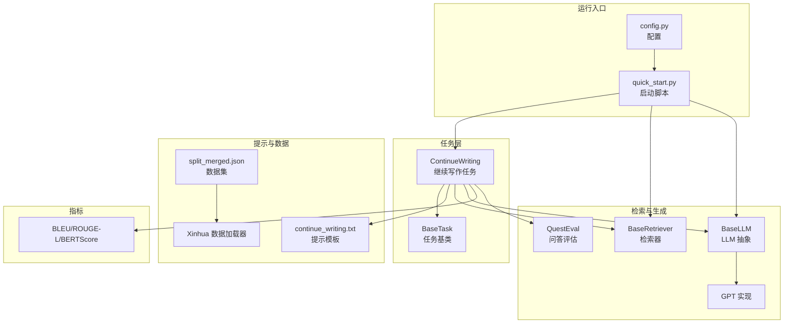
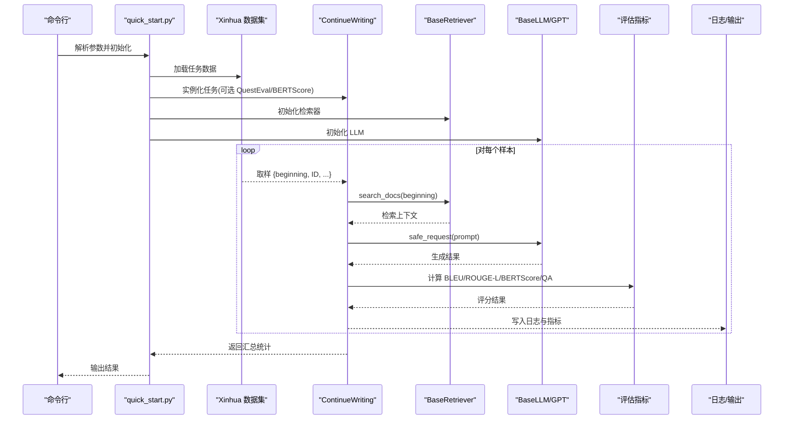
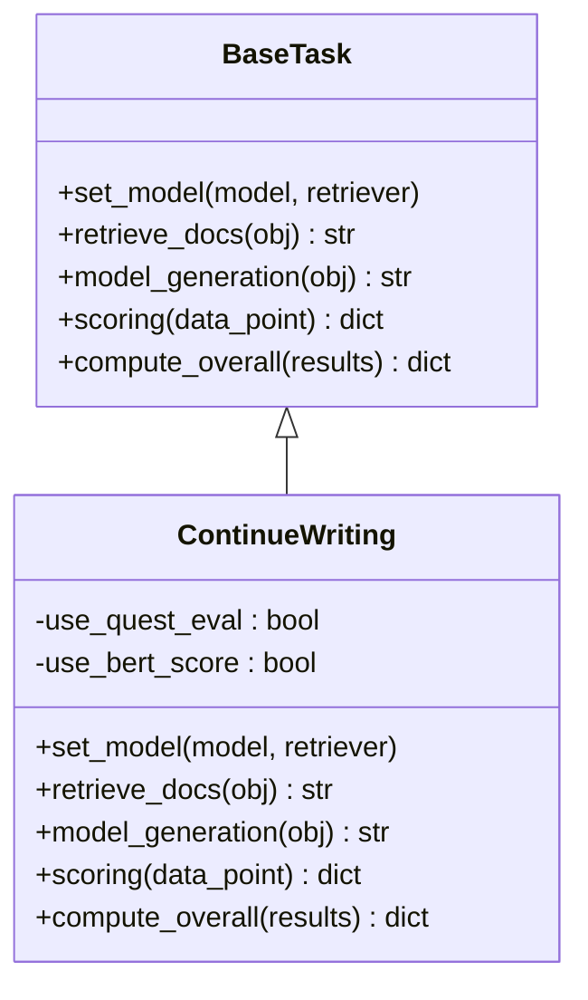
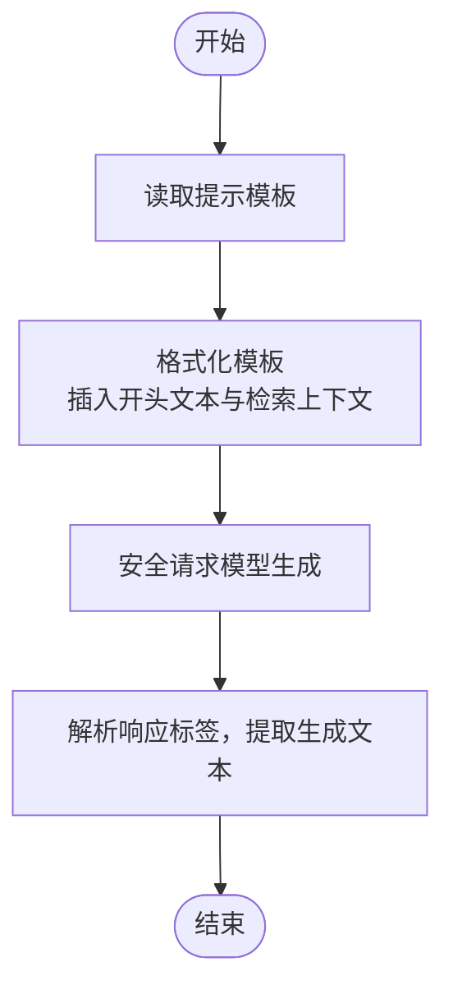
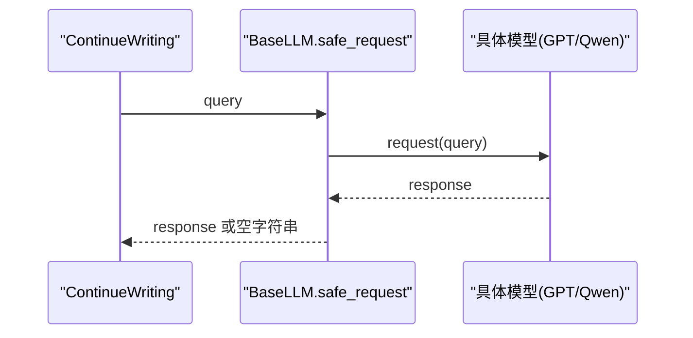
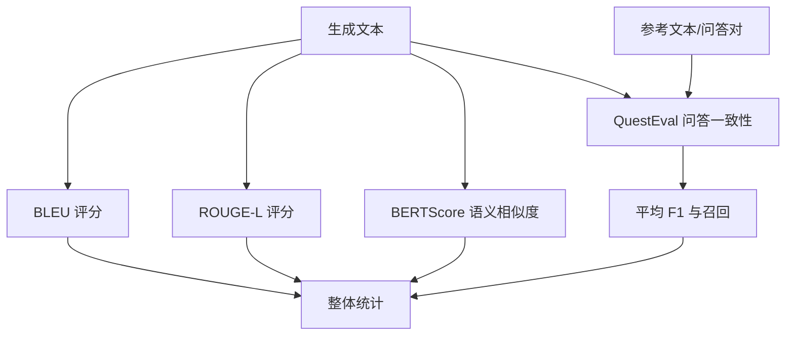
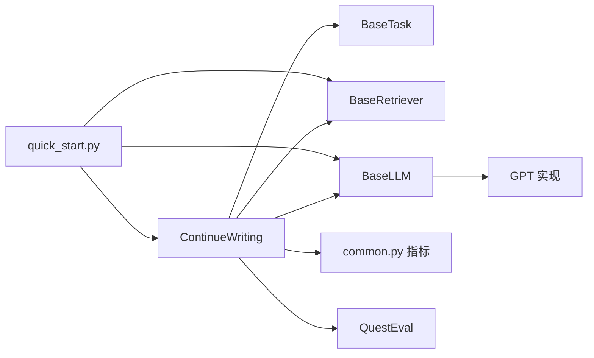

# 继续写作任务

<cite>
**本文引用的文件**
- [continue_writing.py](file://src/tasks/continue_writing.py)
- [continue_writing.txt](file://src/prompts/continue_writing.txt)
- [base.py](file://src/tasks/base.py)
- [base.py](file://src/llms/base.py)
- [base.py](file://src/retrievers/base.py)
- [common.py](file://src/metric/common.py)
- [quest_eval.py](file://src/metric/quest_eval.py)
- [quick_start.py](file://quick_start.py)
- [README.md](file://README.md)
- [xinhua.py](file://src/datasets/xinhua.py)
- [config.py](file://src/configs/config.py)
- [split_merged.json](file://data/crud_split/split_merged.json)
- [ContinueWriting_quest_gt_save.json](file://src/quest_eval/ContinueWriting_quest_gt_save.json)
</cite>

## 目录
1. [简介](#简介)
2. [项目结构](#项目结构)
3. [核心组件](#核心组件)
4. [架构总览](#架构总览)
5. [详细组件分析](#详细组件分析)
6. [依赖分析](#依赖分析)
7. [性能考量](#性能考量)
8. [故障排查指南](#故障排查指南)
9. [结论](#结论)
10. [附录](#附录)

## 简介
继续写作任务旨在根据给定的“开头文本”与检索到的相关文档，生成与原文风格与长度相近的续写段落。该任务通过检索增强生成（RAG）框架，结合提示工程、模型生成控制与多维评估指标，确保生成内容在连贯性、相关性与创造性等方面达到预期质量。本文档系统阐述任务设计原理、实现机制、提示策略、生成控制与质量保证方法，并提供评估指标应用与优化调试建议。

## 项目结构
CRUD-RAG 的继续写作模块位于 src/tasks/continue_writing.py，配套提示模板位于 src/prompts/continue_writing.txt。任务继承自通用任务基类，使用统一的评测器与指标体系，支持 BLEU、ROUGE-L、BERTScore 以及基于问答的 RAGQuestEval 指标。运行入口通过 quick_start.py 提供命令行参数，支持多种检索器与 LLM 后端。

**图示来源**
- [continue_writing.py:13-119](file://src/tasks/continue_writing.py#L13-L119)
- [continue_writing.txt:1-18](file://src/prompts/continue_writing.txt#L1-L18)
- [base.py:13-74](file://src/tasks/base.py#L13-L74)
- [base.py:16-142](file://src/retrievers/base.py#L16-L142)
- [base.py:6-47](file://src/llms/base.py#L6-L47)
- [common.py:23-117](file://src/metric/common.py#L23-L117)
- [quest_eval.py:23-152](file://src/metric/quest_eval.py#L23-L152)
- [quick_start.py:1-110](file://quick_start.py#L1-L110)
- [config.py:1-14](file://src/configs/config.py#L1-L14)
- [split_merged.json:1-200](file://data/crud_split/split_merged.json#L1-L200)
- [xinhua.py:32-54](file://src/datasets/xinhua.py#L32-L54)

**章节来源**
- [quick_start.py:1-110](file://quick_start.py#L1-L110)
- [README.md:27-68](file://README.md#L27-L68)

## 核心组件
- 继续写作任务类 ContinueWriting：封装检索、生成、评分与汇总逻辑，支持可选的 QuestEval 与 BERTScore 评估。
- 任务基类 BaseTask：定义统一接口与通用评估流程，便于扩展其他任务。
- 提示模板 continue_writing.txt：面向新华社风格的新闻续写指令，强调长度相当、避免重复、保持连贯。
- 检索器 BaseRetriever：基于 LlamaIndex/Milvus 的向量检索，支持构造/加载索引与多片段拼接。
- LLM 抽象 BaseLLM：统一温度、采样参数与安全请求接口，便于切换本地/远程模型。
- 评估指标 common.py：提供 BLEU、ROUGE-L、BERTScore 与分类指标工具。
- 问答评估 QuestEval：基于 GPT 的问题生成与答案抽取，计算问答层面的召回与 F1。

**章节来源**
- [continue_writing.py:13-119](file://src/tasks/continue_writing.py#L13-L119)
- [base.py:13-74](file://src/tasks/base.py#L13-L74)
- [continue_writing.txt:1-18](file://src/prompts/continue_writing.txt#L1-L18)
- [base.py:16-142](file://src/retrievers/base.py#L16-L142)
- [base.py:6-47](file://src/llms/base.py#L6-L47)
- [common.py:23-117](file://src/metric/common.py#L23-L117)
- [quest_eval.py:23-152](file://src/metric/quest_eval.py#L23-L152)

## 架构总览
继续写作任务采用“检索-生成-评估”的流水线架构。数据集通过 Xinhua 加载器读取，任务实例化后由评测器驱动，依次执行检索、生成、评分与整体统计。

**图示来源**
- [quick_start.py:106-108](file://quick_start.py#L106-L108)
- [xinhua.py:32-54](file://src/datasets/xinhua.py#L32-L54)
- [continue_writing.py:37-99](file://src/tasks/continue_writing.py#L37-L99)
- [base.py:133-140](file://src/retrievers/base.py#L133-L140)
- [base.py:38-45](file://src/llms/base.py#L38-L45)
- [common.py:23-117](file://src/metric/common.py#L23-L117)
- [quest_eval.py:92-129](file://src/metric/quest_eval.py#L92-L129)

## 详细组件分析

### 继续写作任务类 ContinueWriting
- 职责
  - 设置模型与检索器
  - 从检索器获取上下文
  - 使用提示模板构造查询并安全请求生成
  - 执行多维评分与整体统计
- 关键流程
  - 检索：以“开头文本”为查询，过滤检索响应中的上下文片段
  - 生成：格式化模板，调用模型安全请求，解析响应标签
  - 评分：BLEU、ROUGE-L、BERTScore；可选 QuestEval 的问答 F1 与召回
  - 汇总：对指标求平均，按有效样本计数

**图示来源**
- [base.py:13-74](file://src/tasks/base.py#L13-L74)
- [continue_writing.py:13-119](file://src/tasks/continue_writing.py#L13-L119)

**章节来源**
- [continue_writing.py:13-119](file://src/tasks/continue_writing.py#L13-L119)

### 提示工程策略
- 角色设定：以新华社记者身份续写，强调权威性与客观性
- 上下文约束：限定续写长度与避免重复，强调连贯性
- 结构化输出：通过标签包裹生成内容，便于解析与清洗

**图示来源**
- [continue_writing.py:43-51](file://src/tasks/continue_writing.py#L43-L51)
- [continue_writing.txt:1-18](file://src/prompts/continue_writing.txt#L1-L18)

**章节来源**
- [continue_writing.txt:1-18](file://src/prompts/continue_writing.txt#L1-L18)
- [continue_writing.py:43-51](file://src/tasks/continue_writing.py#L43-L51)

### 模型生成控制
- 温度与采样参数：通过 LLM 抽象统一管理，降低随机性以提升一致性
- 安全请求：捕获异常并返回空字符串，避免中断评测流程
- 输出清洗：按标签截断解析，确保仅保留生成文本

**图示来源**
- [base.py:25-45](file://src/llms/base.py#L25-L45)
- [continue_writing.py:49-51](file://src/tasks/continue_writing.py#L49-L51)

**章节来源**
- [base.py:6-47](file://src/llms/base.py#L6-L47)
- [continue_writing.py:33-51](file://src/tasks/continue_writing.py#L33-L51)

### 输出质量保证方法
- 多指标融合：BLEU/ROUGE-L/BERTScore 衡量与参考文本的匹配与语义相似度
- 问答一致性：QuestEval 将生成与参考文本映射到同一问题集合，计算答案层面的 F1 与召回
- 长度一致性：提示模板约束续写长度与原文相当
- 重复规避：提示模板明确要求避免重复原文内容

**图示来源**
- [common.py:23-117](file://src/metric/common.py#L23-L117)
- [quest_eval.py:92-129](file://src/metric/quest_eval.py#L92-L129)
- [continue_writing.py:62-99](file://src/tasks/continue_writing.py#L62-L99)

**章节来源**
- [common.py:23-117](file://src/metric/common.py#L23-L117)
- [quest_eval.py:92-129](file://src/metric/quest_eval.py#L92-L129)
- [continue_writing.py:62-99](file://src/tasks/continue_writing.py#L62-L99)

### 具体代码示例路径
- 继续写作任务主流程：[continue_writing.py:37-99](file://src/tasks/continue_writing.py#L37-L99)
- 提示模板：[continue_writing.txt:1-18](file://src/prompts/continue_writing.txt#L1-L18)
- 评估指标函数：[common.py:23-117](file://src/metric/common.py#L23-L117)
- 问答评估流程：[quest_eval.py:92-129](file://src/metric/quest_eval.py#L92-L129)
- 数据集加载与任务映射：[xinhua.py:32-54](file://src/datasets/xinhua.py#L32-L54)
- 启动脚本与参数：[quick_start.py:1-110](file://quick_start.py#L1-L110)

**章节来源**
- [continue_writing.py:37-99](file://src/tasks/continue_writing.py#L37-L99)
- [continue_writing.txt:1-18](file://src/prompts/continue_writing.txt#L1-L18)
- [common.py:23-117](file://src/metric/common.py#L23-L117)
- [quest_eval.py:92-129](file://src/metric/quest_eval.py#L92-L129)
- [xinhua.py:32-54](file://src/datasets/xinhua.py#L32-L54)
- [quick_start.py:1-110](file://quick_start.py#L1-L110)

### 不同长度与风格的文本续写效果
- 长度控制：提示模板要求续写长度与原文相当，避免过长或过短
- 风格控制：以新华社记者身份续写，强调客观、简洁、信息密度高
- 数据示例：数据集中包含多种事件类型（如政策、科技、社会、国际），可据此验证不同主题下的续写稳定性与一致性

**章节来源**
- [continue_writing.txt:5-6](file://src/prompts/continue_writing.txt#L5-L6)
- [split_merged.json:1-200](file://data/crud_split/split_merged.json#L1-L200)

## 依赖分析
- 继续写作任务依赖任务基类提供的统一接口与评估框架
- 依赖检索器提供上下文，依赖 LLM 抽象实现安全请求
- 评估指标独立于任务实现，便于替换与扩展
- 启动脚本统一装配检索器、模型与数据集

**图示来源**
- [continue_writing.py:13-119](file://src/tasks/continue_writing.py#L13-L119)
- [base.py:13-74](file://src/tasks/base.py#L13-L74)
- [base.py:16-142](file://src/retrievers/base.py#L16-L142)
- [base.py:6-47](file://src/llms/base.py#L6-L47)
- [common.py:23-117](file://src/metric/common.py#L23-L117)
- [quest_eval.py:23-152](file://src/metric/quest_eval.py#L23-L152)
- [quick_start.py:102-108](file://quick_start.py#L102-L108)

**章节来源**
- [continue_writing.py:13-119](file://src/tasks/continue_writing.py#L13-L119)
- [quick_start.py:102-108](file://quick_start.py#L102-L108)

## 性能考量
- 检索性能：向量索引大小与 top-k 影响延迟与召回质量，需在准确率与速度间权衡
- 生成性能：温度与最大生成长度直接影响响应时间与稳定性
- 评估性能：QuestEval 依赖外部模型问答，建议批量化与缓存问题-答案对
- 并发评测：启动脚本支持多线程，需注意资源占用与限流

## 故障排查指南
- 提示模板缺失：若模板不存在，任务会记录错误并返回空模板，检查路径与文件是否存在
- 检索结果为空：确认检索器是否正确加载索引，检查查询文本与索引构建参数
- 生成异常：safe_request 会捕获异常并返回空字符串，检查模型配置与网络连接
- QuestEval 问题：确认配置文件中的 API 密钥与代理设置，检查问题-答案对缓存文件
- 指标计算异常：部分指标在异常情况下返回默认值，检查输入文本编码与分词器

**章节来源**
- [continue_writing.py:53-60](file://src/tasks/continue_writing.py#L53-L60)
- [base.py:133-140](file://src/retrievers/base.py#L133-L140)
- [base.py:38-45](file://src/llms/base.py#L38-L45)
- [config.py:1-14](file://src/configs/config.py#L1-L14)
- [common.py:13-20](file://src/metric/common.py#L13-L20)
- [quest_eval.py:13-21](file://src/metric/quest_eval.py#L13-L21)

## 结论
继续写作任务通过结构化的检索-生成-评估流水线，结合提示工程与多维指标，实现了对新闻风格续写的可控生成与质量评估。建议在实际应用中根据主题与风格调整提示模板与评估指标权重，并结合 QuestEval 与语义相似度指标提升生成内容的准确性与一致性。

## 附录
- 评估指标说明
  - BLEU：衡量 n-gram 匹配程度，适合结构化文本
  - ROUGE-L：衡量最长公共子序列，适合长文本连贯性
  - BERTScore：基于语义相似度，适合跨句一致性
  - QuestEval：基于问答一致性，适合事实性与推理性评估
- 优化建议
  - 调整检索 top-k 与 chunk 大小，提升上下文相关性
  - 降低温度与控制最大生成长度，提升稳定性
  - 使用 QuestEval 缓存问题-答案对，减少重复调用
  - 针对不同主题定制提示模板，提升风格一致性