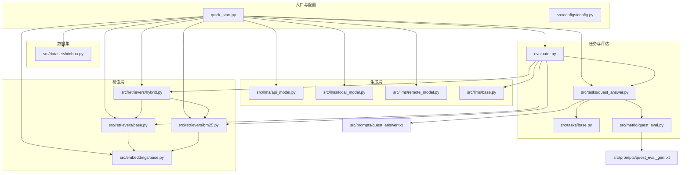
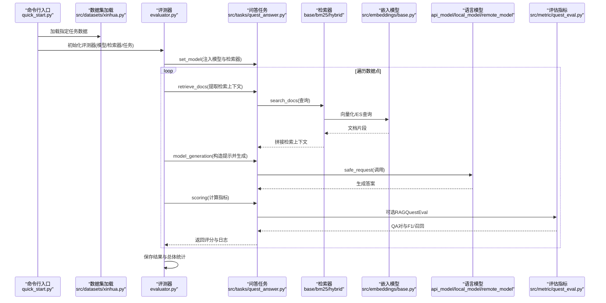
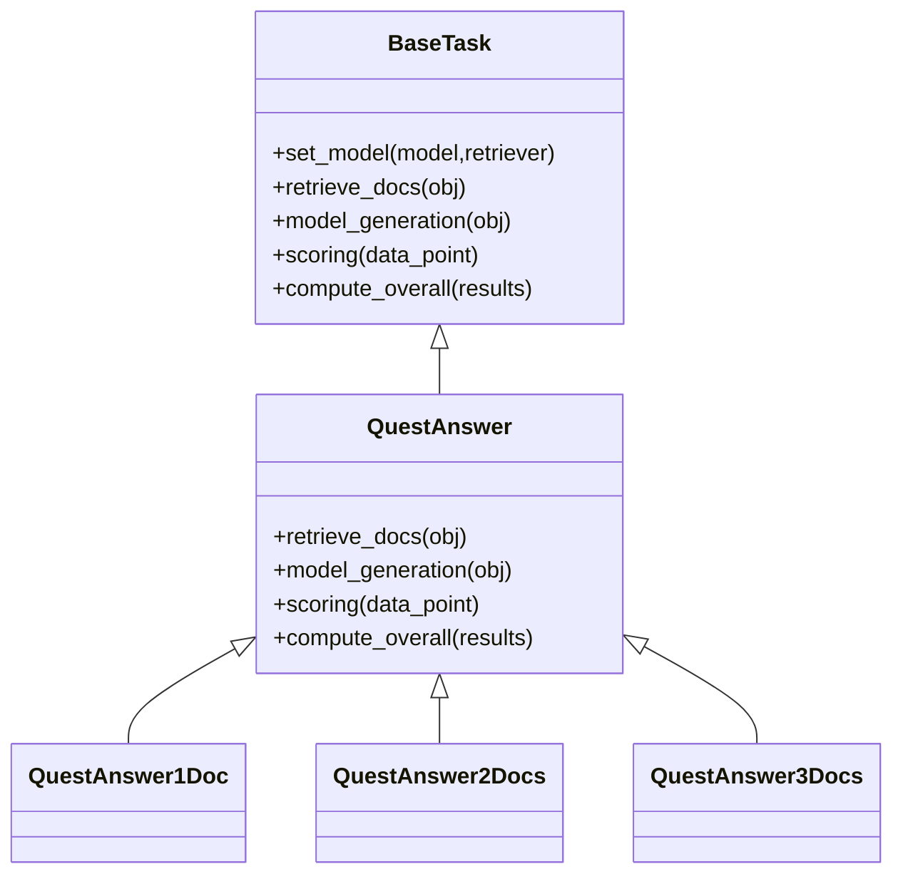
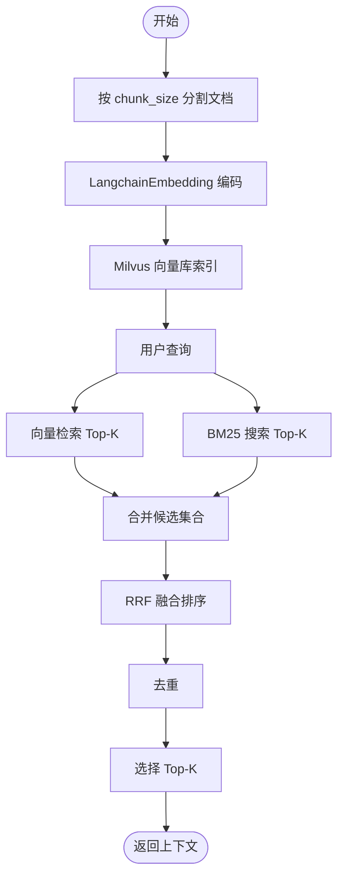
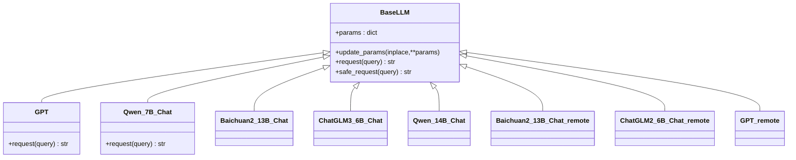
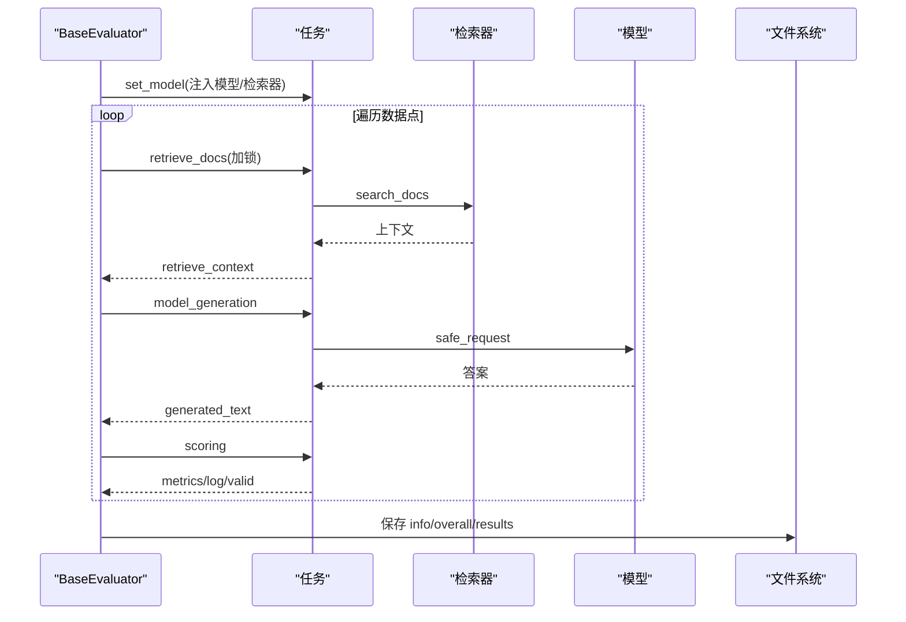
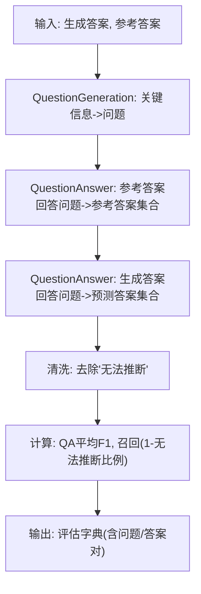
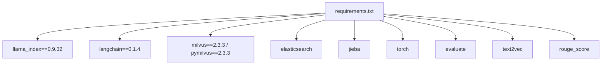

# 问答系统任务

<cite>
**本文引用的文件**
- [README.md](file://README.md)
- [quick_start.py](file://quick_start.py)
- [evaluator.py](file://evaluator.py)
- [src/tasks/base.py](file://src/tasks/base.py)
- [src/tasks/quest_answer.py](file://src/tasks/quest_answer.py)
- [src/retrievers/base.py](file://src/retrievers/base.py)
- [src/retrievers/bm25.py](file://src/retrievers/bm25.py)
- [src/retrievers/hybrid.py](file://src/retrievers/hybrid.py)
- [src/embeddings/base.py](file://src/embeddings/base.py)
- [src/llms/base.py](file://src/llms/base.py)
- [src/llms/api_model.py](file://src/llms/api_model.py)
- [src/llms/local_model.py](file://src/llms/local_model.py)
- [src/llms/remote_model.py](file://src/llms/remote_model.py)
- [src/metric/quest_eval.py](file://src/metric/quest_eval.py)
- [src/datasets/xinhua.py](file://src/datasets/xinhua.py)
- [src/prompts/quest_answer.txt](file://src/prompts/quest_answer.txt)
- [src/prompts/quest_eval_gen.txt](file://src/prompts/quest_eval_gen.txt)
- [src/configs/config.py](file://src/configs/config.py)
- [requirements.txt](file://requirements.txt)
</cite>

## 目录
1. [简介](#简介)
2. [项目结构](#项目结构)
3. [核心组件](#核心组件)
4. [架构总览](#架构总览)
5. [详细组件分析](#详细组件分析)
6. [依赖分析](#依赖分析)
7. [性能考虑](#性能考虑)
8. [故障排查指南](#故障排查指南)
9. [结论](#结论)
10. [附录](#附录)

## 简介
本文件面向“问答系统任务”，围绕 CRUD-RAG 的问答评测子任务，系统化阐述检索增强生成（RAG）问答的架构设计与实现原理，重点解释多文档检索、上下文构建与答案生成流程；并结合 RAGQuestEval 评估指标，说明如何从“准确性、相关性、完整性”等维度对问答质量进行量化评估。文档同时提供使用示例、优化建议与故障排查要点，帮助读者快速上手并在实际场景中稳定运行。

## 项目结构
仓库采用模块化组织方式，围绕“数据集加载、嵌入模型、检索器、语言模型、任务执行、评估指标”六大块协同工作。问答评测任务位于 tasks/quest_answer.py，检索器支持向量检索与 BM25/混合策略，语言模型支持本地、远程与 OpenAI 接口三种模式，评估指标包含 BLEU、ROUGE-L、BERTScore 以及 RAGQuestEval。

图表来源
- [quick_start.py:1-110](file://quick_start.py#L1-L110)
- [src/tasks/quest_answer.py:1-134](file://src/tasks/quest_answer.py#L1-L134)
- [src/retrievers/base.py:1-142](file://src/retrievers/base.py#L1-L142)
- [src/retrievers/bm25.py:1-92](file://src/retrievers/bm25.py#L1-L92)
- [src/retrievers/hybrid.py:1-81](file://src/retrievers/hybrid.py#L1-L81)
- [src/embeddings/base.py:1-88](file://src/embeddings/base.py#L1-L88)
- [src/llms/api_model.py:1-33](file://src/llms/api_model.py#L1-L33)
- [src/llms/local_model.py:1-114](file://src/llms/local_model.py#L1-L114)
- [src/llms/remote_model.py:1-111](file://src/llms/remote_model.py#L1-L111)
- [src/metric/quest_eval.py:1-152](file://src/metric/quest_eval.py#L1-L152)
- [src/datasets/xinhua.py:1-54](file://src/datasets/xinhua.py#L1-L54)
- [src/prompts/quest_answer.txt:1-15](file://src/prompts/quest_answer.txt#L1-L15)
- [src/prompts/quest_eval_gen.txt:1-10](file://src/prompts/quest_eval_gen.txt#L1-L10)

章节来源
- [README.md:27-68](file://README.md#L27-L68)
- [quick_start.py:14-110](file://quick_start.py#L14-L110)

## 核心组件
- 数据集加载：Xinhua 数据集封装，支持按任务切片与随机打乱，便于评测不同复杂度的问答样本。
- 检索器：向量检索（Milvus）、BM25（Elasticsearch）、混合检索（RRF 融合）。
- 嵌入模型：SentenceTransformer/BGE 系列，支持 bi-encoder 向量编码。
- 语言模型：OpenAI ChatCompletion、本地大模型（Qwen、Baichuan、ChatGLM）、远程 API 封装。
- 任务执行：BaseEvaluator 批量评分、并发控制、结果持久化与断点续跑。
- 评估指标：BLEU、ROUGE-L、BERTScore 与 RAGQuestEval（基于 GPT 的问答对生成与 F1/召回）。

章节来源
- [src/datasets/xinhua.py:32-54](file://src/datasets/xinhua.py#L32-L54)
- [src/retrievers/base.py:16-142](file://src/retrievers/base.py#L16-L142)
- [src/retrievers/bm25.py:14-92](file://src/retrievers/bm25.py#L14-L92)
- [src/retrievers/hybrid.py:13-81](file://src/retrievers/hybrid.py#L13-L81)
- [src/embeddings/base.py:14-88](file://src/embeddings/base.py#L14-L88)
- [src/llms/base.py:6-47](file://src/llms/base.py#L6-L47)
- [src/llms/api_model.py:12-33](file://src/llms/api_model.py#L12-L33)
- [src/llms/local_model.py:11-114](file://src/llms/local_model.py#L11-L114)
- [src/llms/remote_model.py:14-111](file://src/llms/remote_model.py#L14-L111)
- [evaluator.py:13-192](file://evaluator.py#L13-L192)
- [src/tasks/quest_answer.py:14-134](file://src/tasks/quest_answer.py#L14-L134)
- [src/metric/quest_eval.py:23-152](file://src/metric/quest_eval.py#L23-L152)

## 架构总览
问答系统遵循“检索-生成-评估”的流水线，整体流程如下：

图表来源
- [quick_start.py:54-109](file://quick_start.py#L54-L109)
- [src/datasets/xinhua.py:32-54](file://src/datasets/xinhua.py#L32-L54)
- [evaluator.py:42-151](file://evaluator.py#L42-L151)
- [src/tasks/quest_answer.py:38-101](file://src/tasks/quest_answer.py#L38-L101)
- [src/retrievers/base.py:133-140](file://src/retrievers/base.py#L133-L140)
- [src/retrievers/bm25.py:70-90](file://src/retrievers/bm25.py#L70-L90)
- [src/retrievers/hybrid.py:50-80](file://src/retrievers/hybrid.py#L50-L80)
- [src/embeddings/base.py:58-73](file://src/embeddings/base.py#L58-L73)
- [src/llms/base.py:38-45](file://src/llms/base.py#L38-L45)
- [src/metric/quest_eval.py:92-129](file://src/metric/quest_eval.py#L92-L129)

## 详细组件分析

### 问答任务（QuestAnswer）
- 检索策略：从数据点读取问题，调用检索器 search_docs 获取上下文，去除模板后缀，得到干净的检索文本。
- 上下文构建：将问题与检索到的文档拼接到提示模板中，形成最终输入。
- 答案生成：调用语言模型的 safe_request，解析响应中的 <response>...</response> 片段作为最终答案。
- 评分体系：支持 BLEU、ROUGE-L、BERTScore；当启用 RAGQuestEval 时，动态生成 QA 对，计算 QA 平均 F1 与召回，并记录生成/参考答案与评估时间戳。
- 总体统计：按指标求平均，若使用 RAGQuestEval，则仅对有效问题计数。

图表来源
- [src/tasks/base.py:13-74](file://src/tasks/base.py#L13-L74)
- [src/tasks/quest_answer.py:14-134](file://src/tasks/quest_answer.py#L14-L134)

章节来源
- [src/tasks/quest_answer.py:38-101](file://src/tasks/quest_answer.py#L38-L101)
- [src/tasks/quest_answer.py:102-119](file://src/tasks/quest_answer.py#L102-L119)
- [src/prompts/quest_answer.txt:1-15](file://src/prompts/quest_answer.txt#L1-L15)

### 检索器（Retriever）
- 向量检索（Milvus）：分批构建索引，支持增量 add_index；查询时通过 VectorIndexRetriever 与 RetrieverQueryEngine 组合返回上下文文本。
- BM25（Elasticsearch）：按 chunk_size 切分文档，构建 ES 索引；查询时使用 match 查询，返回 top-k 文档。
- 混合检索（RRF）：融合 BM25 与向量检索结果，使用 Reciprocal Rank Fusion 融合排序，去重后取 top-k。

图表来源
- [src/retrievers/base.py:56-87](file://src/retrievers/base.py#L56-L87)
- [src/retrievers/bm25.py:44-66](file://src/retrievers/bm25.py#L44-L66)
- [src/retrievers/hybrid.py:50-80](file://src/retrievers/hybrid.py#L50-L80)

章节来源
- [src/retrievers/base.py:16-142](file://src/retrievers/base.py#L16-L142)
- [src/retrievers/bm25.py:14-92](file://src/retrievers/bm25.py#L14-L92)
- [src/retrievers/hybrid.py:13-81](file://src/retrievers/hybrid.py#L13-L81)

### 语言模型（LLM）
- 抽象基类 BaseLLM 提供统一参数管理与安全请求接口 safe_request。
- OpenAI 封装：读取配置中的 API Key/Base，调用 chat.completions 创建对话。
- 本地模型：Qwen、Baichuan、ChatGLM 等，使用 AutoTokenizer 与 AutoModelForCausalLM 生成。
- 远程 API：通过 transit URL 调用内部服务，传递温度、采样参数等。

图表来源
- [src/llms/base.py:6-47](file://src/llms/base.py#L6-L47)
- [src/llms/api_model.py:12-33](file://src/llms/api_model.py#L12-L33)
- [src/llms/local_model.py:11-114](file://src/llms/local_model.py#L11-L114)
- [src/llms/remote_model.py:14-111](file://src/llms/remote_model.py#L14-L111)

章节来源
- [src/llms/base.py:6-47](file://src/llms/base.py#L6-L47)
- [src/llms/api_model.py:12-33](file://src/llms/api_model.py#L12-L33)
- [src/llms/local_model.py:11-114](file://src/llms/local_model.py#L11-L114)
- [src/llms/remote_model.py:14-111](file://src/llms/remote_model.py#L14-L111)

### 评测执行器（BaseEvaluator）
- 多线程批处理：使用 ThreadPoolExecutor 并发执行任务生成与评分，支持断点续跑与进度条。
- 结果持久化：按检索集合名、TopK、模型名组织输出目录，保存 info、overall、results。
- 任务编排：将任务、模型、检索器注入，依次完成检索、生成、评分与汇总。

图表来源
- [evaluator.py:42-151](file://evaluator.py#L42-L151)

章节来源
- [evaluator.py:13-192](file://evaluator.py#L13-L192)

### RAGQuestEval 评估指标
- 生成 QA 对：基于 ground truth 文本抽取关键信息并生成若干问题，再由模型回答，形成“参考答案”。
- 生成答案回答 QA：用生成答案回答同一组 QA，得到“预测答案”。
- 计算指标：剔除“无法推断”的答案后，计算 QA 平均 F1 与召回；同时记录问题列表与答案对，便于复盘。

图表来源
- [src/metric/quest_eval.py:73-129](file://src/metric/quest_eval.py#L73-L129)
- [src/prompts/quest_eval_gen.txt:1-10](file://src/prompts/quest_eval_gen.txt#L1-L10)

章节来源
- [src/metric/quest_eval.py:23-152](file://src/metric/quest_eval.py#L23-L152)

## 依赖分析
- 第三方依赖：llama_index、langchain、milvus/pymilvus、elasticsearch、jieba、torch、evaluate、text2vec、rouge_score 等。
- 配置文件：src/configs/config.py 提供 OpenAI API Key/Base 与本地/远程模型路径与访问令牌。

图表来源
- [requirements.txt:1-13](file://requirements.txt#L1-L13)

章节来源
- [requirements.txt:1-13](file://requirements.txt#L1-L13)
- [src/configs/config.py:1-14](file://src/configs/config.py#L1-L14)

## 性能考虑
- 检索性能
  - 向量检索分批索引与增量添加，避免单次节点过多导致内存压力。
  - BM25 使用 match 查询，TopK 控制返回规模，减少后续拼接成本。
  - 混合检索采用 RRF，权重与常数 c 可调，兼顾精确性与召回。
- 生成性能
  - safe_request 异常兜底，避免单点失败影响整体评测。
  - 多线程并发控制 num_threads，结合进度条提升吞吐。
- 存储与缓存
  - 输出目录按 collection_name/topK/model 组织，便于复用与对比。
  - 断点续跑：已存在的结果自动跳过，提高重复实验效率。

章节来源
- [src/retrievers/base.py:74-87](file://src/retrievers/base.py#L74-L87)
- [src/retrievers/hybrid.py:27-36](file://src/retrievers/hybrid.py#L27-L36)
- [evaluator.py:56-107](file://evaluator.py#L56-L107)

## 故障排查指南
- 索引构建失败或超时
  - 确认文档路径与 chunk_size/chunk_overlap 设置合理；首次构建耗时较长，耐心等待。
  - 若 Milvus 未就绪，检查服务状态与端口映射。
- 检索结果为空
  - 调整 retrieve_top_k；确认 collection_name 与构建时一致。
  - 检查 BM25 索引是否成功建立，ES 服务连通性。
- 生成异常或空答案
  - safe_request 已做异常捕获，若仍为空，检查模型配置与网络代理。
  - 对于 OpenAI，核对 API Key/Base 与限额；对于本地模型，确认设备与显存。
- 评估指标异常
  - RAGQuestEval 需要 GPT 支持，确保可用；若禁用则返回默认值。
  - 评估日志包含问题与答案对，可用于人工复核。

章节来源
- [src/retrievers/base.py:37-44](file://src/retrievers/base.py#L37-L44)
- [src/retrievers/bm25.py:38-42](file://src/retrievers/bm25.py#L38-L42)
- [src/llms/base.py:38-45](file://src/llms/base.py#L38-L45)
- [evaluator.py:82-83](file://evaluator.py#L82-L83)
- [src/metric/quest_eval.py:92-129](file://src/metric/quest_eval.py#L92-L129)

## 结论
本问答系统以“检索-生成-评估”为主线，结合多种检索策略与多维评估指标，能够稳定地评测不同复杂度的问答任务。通过模块化设计与并发执行，既保证了评测效率，也便于扩展与维护。建议在实际部署中优先优化检索 TopK 与混合检索参数，结合 RAGQuestEval 提升评估的客观性与可解释性。

## 附录
- 快速开始与参数说明
  - 安装依赖、启动 Milvus/Elasticsearch、下载嵌入模型后，运行 quick_start.py 即可开始评测。
  - 常用参数：模型名称、温度、最大新 token、数据路径、文档路径与类型、分块大小与重叠、检索器名称与 TopK、任务类型、线程数、是否显示进度条、是否构建/追加索引等。
- 使用示例（步骤级）
  - 准备数据：将数据集放置于 data/crud 或 data/crud_split 下，或自定义路径。
  - 准备文档库：将待检索文档置于 docs_path，设置 docs_type（如 txt/json）。
  - 首次运行：添加 --construct_index 构建索引；后续评测可省略该参数。
  - 选择任务：--task 可选 event_summary、continuing_writing、hallu_modified、quest_answer 或 all。
  - 选择检索器：--retriever_name 支持 base（向量）、bm25、hybrid、hybrid-rerank。
  - 选择指标：--quest_eval 开启 RAGQuestEval；--bert_score_eval 开启 BERTScore。
  - 并发与输出：--num_threads 控制并发；输出结果保存在 ./output 下按命名规则组织。

章节来源
- [README.md:70-105](file://README.md#L70-L105)
- [quick_start.py:14-110](file://quick_start.py#L14-L110)