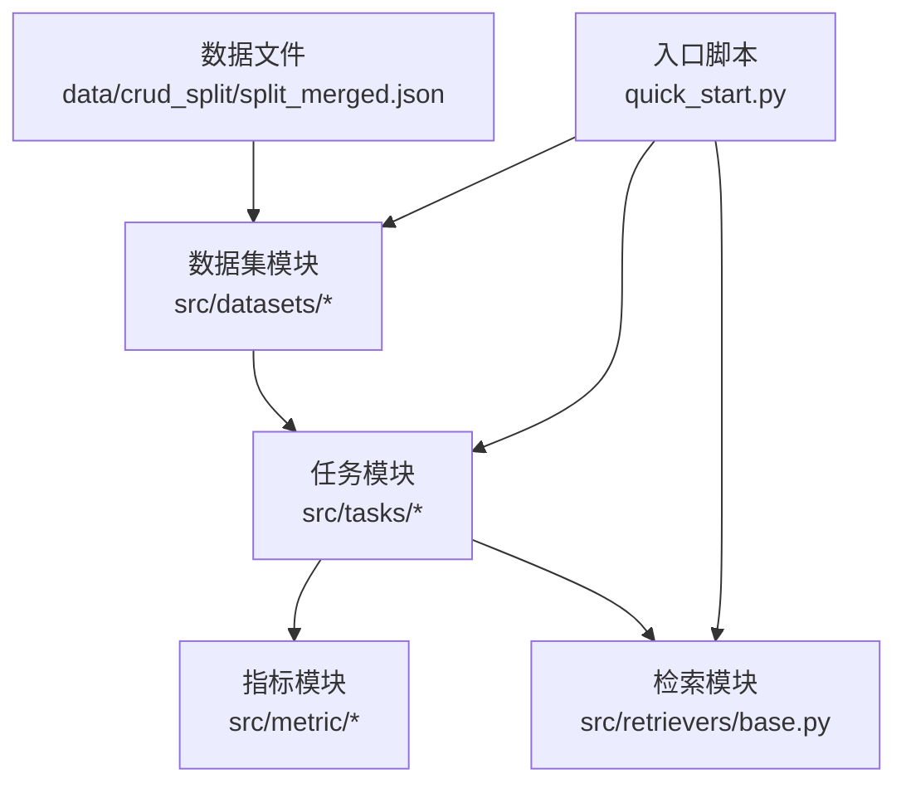
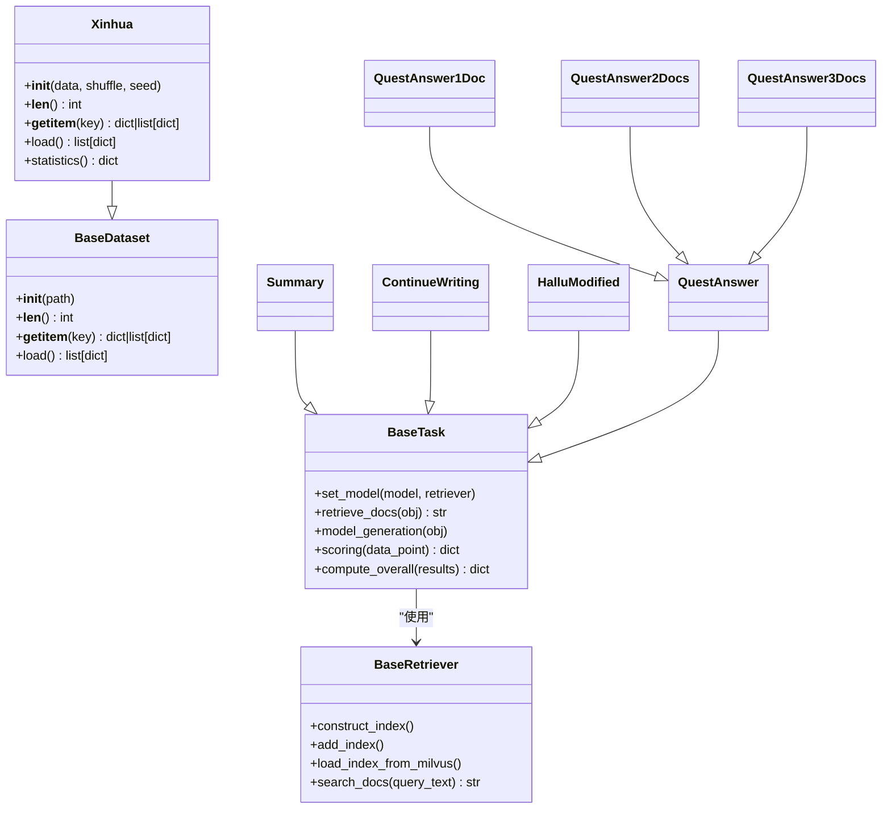
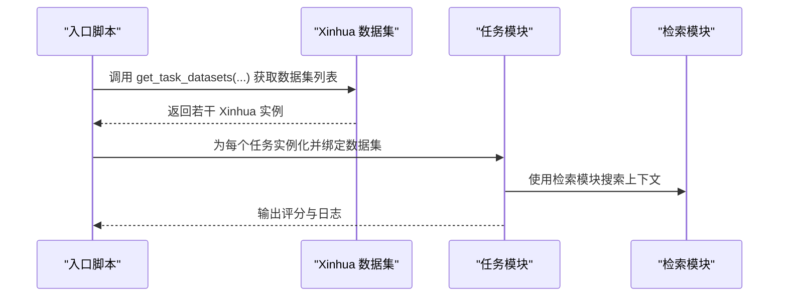
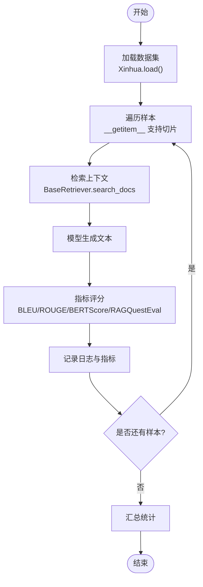
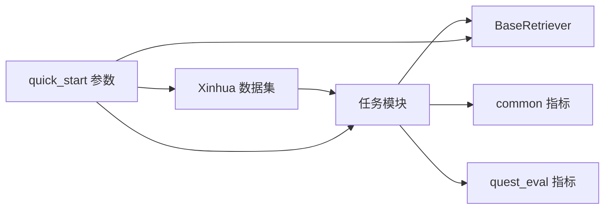

# 数据处理模块

<cite>
**本文引用的文件**
- [src/datasets/base.py](file://src/datasets/base.py)
- [src/datasets/xinhua.py](file://src/datasets/xinhua.py)
- [src/tasks/base.py](file://src/tasks/base.py)
- [src/tasks/summary.py](file://src/tasks/summary.py)
- [src/tasks/continue_writing.py](file://src/tasks/continue_writing.py)
- [src/tasks/hallucinated_modified.py](file://src/tasks/hallucinated_modified.py)
- [src/tasks/quest_answer.py](file://src/tasks/quest_answer.py)
- [src/retrievers/base.py](file://src/retrievers/base.py)
- [src/metric/common.py](file://src/metric/common.py)
- [src/metric/quest_eval.py](file://src/metric/quest_eval.py)
- [src/configs/config.py](file://src/configs/config.py)
- [quick_start.py](file://quick_start.py)
- [data/crud_split/split_merged.json](file://data/crud_split/split_merged.json)
</cite>

## 目录
1. [简介](#简介)
2. [项目结构](#项目结构)
3. [核心组件](#核心组件)
4. [架构总览](#架构总览)
5. [详细组件分析](#详细组件分析)
6. [依赖分析](#依赖分析)
7. [性能考量](#性能考量)
8. [故障排查指南](#故障排查指南)
9. [结论](#结论)
10. [附录](#附录)

## 简介
本文件聚焦 CRUD-RAG 的数据处理模块，系统阐述 BaseDataset 抽象基类的设计理念与接口规范，详解 Xinhua 数据集的实现细节（数据格式解析、文档预处理与标准化），并给出扩展最佳实践与性能优化建议。文档同时面向初学者与高级开发者，既提供概念入门，也提供可落地的扩展与定制指导。

## 项目结构
数据处理模块位于 src/datasets，核心文件包括抽象基类与具体实现；与之协同的任务模块（src/tasks）负责评估流程，检索模块（src/retrievers）负责向量检索，指标模块（src/metric）负责评测打分。入口脚本 quick_start.py 将数据集、任务与检索器串联起来，形成完整的评测流水线。

图示来源
- [quick_start.py:1-110](file://quick_start.py#L1-L110)
- [src/datasets/base.py:1-20](file://src/datasets/base.py#L1-L20)
- [src/datasets/xinhua.py:1-54](file://src/datasets/xinhua.py#L1-L54)
- [src/tasks/base.py:1-74](file://src/tasks/base.py#L1-L74)
- [src/retrievers/base.py:1-142](file://src/retrievers/base.py#L1-L142)
- [src/metric/common.py:1-117](file://src/metric/common.py#L1-L117)
- [src/metric/quest_eval.py:1-152](file://src/metric/quest_eval.py#L1-L152)

章节来源
- [quick_start.py:1-110](file://quick_start.py#L1-L110)
- [src/datasets/base.py:1-20](file://src/datasets/base.py#L1-L20)
- [src/datasets/xinhua.py:1-54](file://src/datasets/xinhua.py#L1-L54)
- [src/tasks/base.py:1-74](file://src/tasks/base.py#L1-L74)
- [src/retrievers/base.py:1-142](file://src/retrievers/base.py#L1-L142)
- [src/metric/common.py:1-117](file://src/metric/common.py#L1-L117)
- [src/metric/quest_eval.py:1-152](file://src/metric/quest_eval.py#L1-L152)

## 核心组件
- BaseDataset 抽象基类：定义统一的数据集接口，要求实现初始化、长度、索引访问与加载方法，确保上层任务与检索器以一致方式消费数据。
- Xinhua 具体实现：接收已解析的 JSON 列表，支持随机打乱、统计类别分布、切片访问与浅拷贝加载，适配多任务场景。
- 任务模块：定义任务基类与具体任务（摘要、续写、幻觉修正、问答），负责检索、生成、评分与汇总。
- 检索模块：封装向量索引构建与查询引擎，支持 Milvus 向量库与分块索引策略。
- 指标模块：提供 BLEU、ROUGE-L、BERT Score 与 RAGQuestEval 等评测工具，内置异常捕获与降级处理。

章节来源
- [src/datasets/base.py:1-20](file://src/datasets/base.py#L1-L20)
- [src/datasets/xinhua.py:1-54](file://src/datasets/xinhua.py#L1-L54)
- [src/tasks/base.py:1-74](file://src/tasks/base.py#L1-L74)
- [src/retrievers/base.py:1-142](file://src/retrievers/base.py#L1-L142)
- [src/metric/common.py:1-117](file://src/metric/common.py#L1-L117)
- [src/metric/quest_eval.py:1-152](file://src/metric/quest_eval.py#L1-L152)

## 架构总览
数据处理模块在整体架构中的职责是提供结构化的数据样本集合，供任务模块进行检索、生成与评分。Xinhua 数据集通过统一接口与任务模块解耦，便于扩展与替换。

图示来源
- [src/datasets/base.py:1-20](file://src/datasets/base.py#L1-L20)
- [src/datasets/xinhua.py:1-54](file://src/datasets/xinhua.py#L1-L54)
- [src/tasks/base.py:1-74](file://src/tasks/base.py#L1-L74)
- [src/tasks/summary.py:1-121](file://src/tasks/summary.py#L1-L121)
- [src/tasks/continue_writing.py:1-119](file://src/tasks/continue_writing.py#L1-L119)
- [src/tasks/hallucinated_modified.py:1-124](file://src/tasks/hallucinated_modified.py#L1-L124)
- [src/tasks/quest_answer.py:1-134](file://src/tasks/quest_answer.py#L1-L134)
- [src/retrievers/base.py:1-142](file://src/retrievers/base.py#L1-L142)

## 详细组件分析

### BaseDataset 抽象基类
- 设计理念：通过抽象方法约束数据集的最小可用接口，确保上层模块仅依赖约定而非具体实现，提升可替换性与可测试性。
- 接口规范：
  - 初始化：接收路径或数据源，完成必要的资源准备。
  - 长度：返回样本总数，便于批处理与进度控制。
  - 索引访问：支持整数索引与切片，返回单条或多条样本字典。
  - 加载：返回完整样本列表，通常返回浅拷贝以避免外部修改影响内部状态。
- 与任务模块的协作：任务模块通过统一接口读取样本，屏蔽底层数据来源差异。

章节来源
- [src/datasets/base.py:1-20](file://src/datasets/base.py#L1-L20)

### Xinhua 数据集实现
- 输入与解析：get_task_datasets 从 JSON 文件读取，按任务键提取对应数据列表，构造多个 Xinhua 实例。
- 数据结构：样本字典包含事件描述、摘要、正文、标题、URL、时间戳等字段，满足不同任务的输入需求。
- 预处理与标准化：
  - 支持随机打乱（可选），便于训练/评测的随机化。
  - 提供统计方法，计算各类别的样本数量，辅助任务均衡与分析。
- 访问与加载：
  - __getitem__ 支持切片，便于批量迭代。
  - __len__ 返回样本数。
  - load 返回浅拷贝，避免外部修改污染原始数据。
- 扩展建议：若数据来自文件系统或数据库，可在 __init__ 中完成解析与缓存；在 load 中实现惰性加载策略。

图示来源
- [src/datasets/xinhua.py:32-54](file://src/datasets/xinhua.py#L32-L54)
- [quick_start.py:104-108](file://quick_start.py#L104-L108)

章节来源
- [src/datasets/xinhua.py:1-54](file://src/datasets/xinhua.py#L1-L54)
- [data/crud_split/split_merged.json:1-200](file://data/crud_split/split_merged.json#L1-L200)

### 任务模块与数据流
- BaseTask：定义检索、生成、评分与汇总的通用流程，子类按任务类型实现具体逻辑。
- 典型流程：检索上下文 → 组装提示 → 生成文本 → 评分与记录 → 汇总统计。
- 与数据集的关系：任务模块通过统一接口访问样本，Xinhua 提供标准化字段，便于不同任务复用。

图示来源
- [src/tasks/base.py:1-74](file://src/tasks/base.py#L1-L74)
- [src/retrievers/base.py:133-140](file://src/retrievers/base.py#L133-L140)
- [src/metric/common.py:23-86](file://src/metric/common.py#L23-L86)
- [src/metric/quest_eval.py:92-129](file://src/metric/quest_eval.py#L92-L129)

章节来源
- [src/tasks/base.py:1-74](file://src/tasks/base.py#L1-L74)
- [src/tasks/summary.py:1-121](file://src/tasks/summary.py#L1-L121)
- [src/tasks/continue_writing.py:1-119](file://src/tasks/continue_writing.py#L1-L119)
- [src/tasks/hallucinated_modified.py:1-124](file://src/tasks/hallucinated_modified.py#L1-L124)
- [src/tasks/quest_answer.py:1-134](file://src/tasks/quest_answer.py#L1-L134)

### 指标模块与错误处理
- 异常捕获：common.py 中的装饰器统一捕获指标计算异常，避免中断评测流程。
- RAGQuestEval：封装 GPT 的问答与生成，提供问题生成、答案抽取与 F1/召回计算，内置降级返回值。
- 最佳实践：在任务模块中按需启用指标，结合日志输出定位异常样本。

章节来源
- [src/metric/common.py:13-21](file://src/metric/common.py#L13-L21)
- [src/metric/common.py:23-86](file://src/metric/common.py#L23-L86)
- [src/metric/quest_eval.py:92-129](file://src/metric/quest_eval.py#L92-L129)

## 依赖分析
- 数据集到任务：Xinhua 通过统一接口被任务模块消费，任务模块不关心数据来源。
- 任务到检索：任务模块依赖 BaseRetriever 进行上下文检索，检索模块依赖向量库与嵌入模型。
- 指标到任务：任务模块按需调用 common 与 quest_eval，二者均提供稳健的异常处理。
- 配置到运行：quick_start.py 解析命令行参数，组装模型、检索器、任务与数据集，驱动评测流程。

图示来源
- [quick_start.py:1-110](file://quick_start.py#L1-L110)
- [src/datasets/xinhua.py:1-54](file://src/datasets/xinhua.py#L1-L54)
- [src/tasks/base.py:1-74](file://src/tasks/base.py#L1-L74)
- [src/retrievers/base.py:1-142](file://src/retrievers/base.py#L1-L142)
- [src/metric/common.py:1-117](file://src/metric/common.py#L1-L117)
- [src/metric/quest_eval.py:1-152](file://src/metric/quest_eval.py#L1-L152)

章节来源
- [quick_start.py:1-110](file://quick_start.py#L1-L110)
- [src/datasets/xinhua.py:1-54](file://src/datasets/xinhua.py#L1-L54)
- [src/tasks/base.py:1-74](file://src/tasks/base.py#L1-L74)
- [src/retrievers/base.py:1-142](file://src/retrievers/base.py#L1-L142)
- [src/metric/common.py:1-117](file://src/metric/common.py#L1-L117)
- [src/metric/quest_eval.py:1-152](file://src/metric/quest_eval.py#L1-L152)

## 性能考量
- 数据加载优化
  - 切片访问：Xinhua 的 __getitem__ 支持切片，适合批量化处理，减少重复加载。
  - 浅拷贝加载：load 返回副本，避免共享引用带来的并发与修改风险。
  - 惰性加载：若数据量巨大，可在 __init__ 中仅保存路径与元数据，延迟解析与缓存。
- 内存管理
  - 控制批大小：任务模块遍历时采用合适批次，避免一次性占用过多内存。
  - 及时释放：在任务完成后清理临时变量与中间结果。
- 检索性能
  - 分块索引：向量索引按固定步长分块构建，平衡内存与吞吐。
  - top-k 设置：根据任务需求调整相似度 top-k，兼顾召回与速度。
- 指标计算
  - 异常降级：指标模块统一捕获异常，避免单点失败拖慢整体评测。
  - 可选启用：仅在需要时启用高开销指标（如 BERT Score、QuestEval）。

[本节为通用性能建议，不直接分析特定文件，故无章节来源]

## 故障排查指南
- 数据加载异常
  - 确认 JSON 文件路径与键名正确，get_task_datasets 对任务键进行分支处理。
  - 若样本为空，检查数据文件完整性与键值是否存在。
- 检索异常
  - 确保向量库服务正常，Milvus 集合名称与维度匹配。
  - 检查 chunk_size 与 chunk_overlap 设置，避免节点过大导致内存不足。
- 指标异常
  - common 模块的装饰器会捕获异常并记录告警，定位具体样本后可跳过或修复。
  - QuestEval 依赖外部模型，需检查配置文件中的密钥与代理设置。
- 配置问题
  - 检查 config.py 中的 API 密钥与本地模型路径，确保 quick_start.py 传参正确。

章节来源
- [src/datasets/xinhua.py:32-54](file://src/datasets/xinhua.py#L32-L54)
- [src/retrievers/base.py:56-87](file://src/retrievers/base.py#L56-L87)
- [src/metric/common.py:13-21](file://src/metric/common.py#L13-L21)
- [src/metric/quest_eval.py:23-32](file://src/metric/quest_eval.py#L23-L32)
- [src/configs/config.py:1-14](file://src/configs/config.py#L1-L14)

## 结论
数据处理模块通过 BaseDataset 抽象基类与 Xinhua 具体实现，为任务模块提供了统一、可扩展的数据接口。配合检索与指标模块，形成完整的评测流水线。遵循本文的扩展与优化建议，可在保证稳定性的同时提升性能与可维护性。

[本节为总结性内容，不直接分析特定文件，故无章节来源]

## 附录

### 扩展最佳实践
- 继承 BaseDataset：实现 __init__、__len__、__getitem__、load 四个方法，确保行为与现有实现一致。
- 数据格式标准化：统一字段命名与类型，便于任务模块复用。
- 预处理与缓存：在 __init__ 中完成解析与缓存，load 返回浅拷贝。
- 错误处理：在关键路径包裹异常捕获，提供降级策略与日志记录。

章节来源
- [src/datasets/base.py:1-20](file://src/datasets/base.py#L1-L20)
- [src/datasets/xinhua.py:1-54](file://src/datasets/xinhua.py#L1-L54)

### 数据集扩展示例（步骤）
- 步骤1：创建子类并实现抽象方法。
- 步骤2：在 get_task_datasets 或自定义工厂函数中注册新任务键与数据映射。
- 步骤3：在 quick_start.py 中添加任务映射，确保入口脚本可识别新任务。
- 步骤4：编写单元测试与集成测试，验证数据加载、索引访问与评分流程。

章节来源
- [src/datasets/xinhua.py:32-54](file://src/datasets/xinhua.py#L32-L54)
- [quick_start.py:91-102](file://quick_start.py#L91-L102)