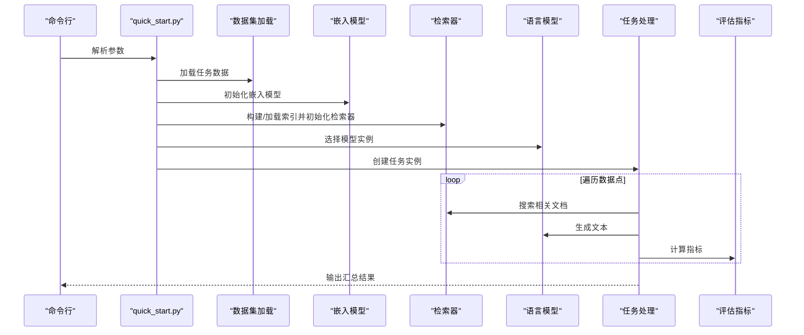
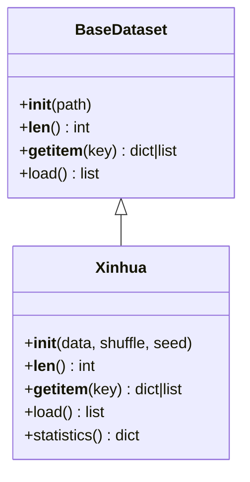
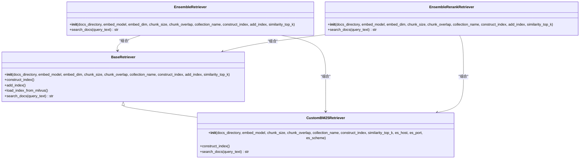
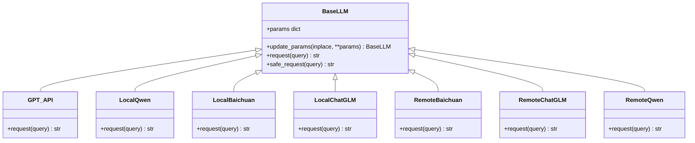
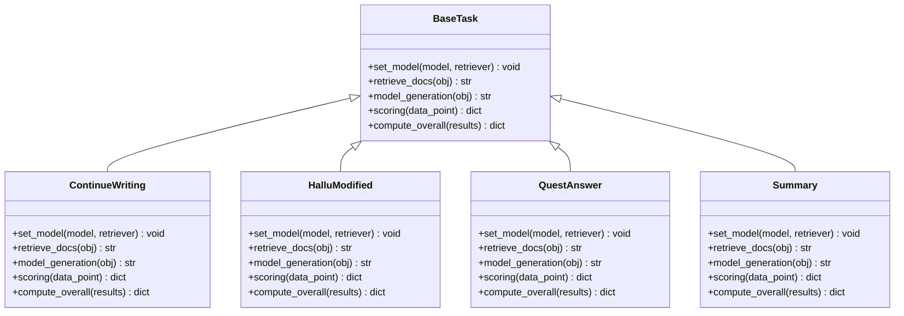
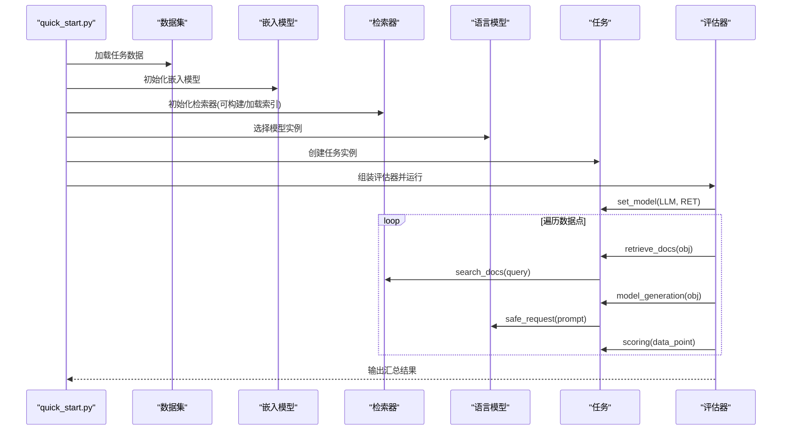
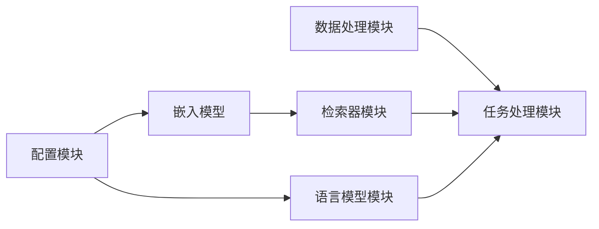

# 核心模块

<cite>
**本文引用的文件**
- [README.md](file://README.md)
- [quick_start.py](file://quick_start.py)
- [src/configs/config.py](file://src/configs/config.py)
- [src/datasets/base.py](file://src/datasets/base.py)
- [src/datasets/xinhua.py](file://src/datasets/xinhua.py)
- [src/embeddings/base.py](file://src/embeddings/base.py)
- [src/retrievers/base.py](file://src/retrievers/base.py)
- [src/retrievers/__init__.py](file://src/retrievers/__init__.py)
- [src/retrievers/bm25.py](file://src/retrievers/bm25.py)
- [src/retrievers/hybrid.py](file://src/retrievers/hybrid.py)
- [src/retrievers/hybrid_rerank.py](file://src/retrievers/hybrid_rerank.py)
- [src/llms/base.py](file://src/llms/base.py)
- [src/llms/api_model.py](file://src/llms/api_model.py)
- [src/llms/local_model.py](file://src/llms/local_model.py)
- [src/llms/remote_model.py](file://src/llms/remote_model.py)
- [src/tasks/base.py](file://src/tasks/base.py)
- [src/tasks/continue_writing.py](file://src/tasks/continue_writing.py)
- [src/tasks/hallucinated_modified.py](file://src/tasks/hallucinated_modified.py)
- [src/tasks/quest_answer.py](file://src/tasks/quest_answer.py)
- [src/tasks/summary.py](file://src/tasks/summary.py)
</cite>

## 目录
1. [引言](#引言)
2. [项目结构](#项目结构)
3. [核心组件](#核心组件)
4. [架构总览](#架构总览)
5. [详细组件分析](#详细组件分析)
6. [依赖分析](#依赖分析)
7. [性能考虑](#性能考虑)
8. [故障排查指南](#故障排查指南)
9. [结论](#结论)
10. [附录](#附录)

## 引言
本文件面向CRUD-RAG的核心模块，系统性阐述数据处理模块、检索器模块、语言模型模块与任务处理模块的设计理念、实现细节与协作关系。文档同时提供公共接口与扩展机制说明、配置项解读、性能优化建议、最佳实践与常见问题解决方案，兼顾初学者与高级用户的理解需求。

## 项目结构
CRUD-RAG采用按功能分层的组织方式：数据集加载、嵌入与向量检索、大语言模型接入、任务执行与评估指标，以及快速启动脚本与配置管理。整体流程从数据集读取开始，经由检索器获取上下文，交由语言模型生成文本，并通过多种指标进行评估。

```mermaid
graph TB
subgraph "入口与配置"
QS["quick_start.py"]
CFG["src/configs/config.py"]
end
subgraph "数据处理"
DSBase["src/datasets/base.py"]
DSXH["src/datasets/xinhua.py"]
end
subgraph "嵌入与检索"
EMB["src/embeddings/base.py"]
RETBase["src/retrievers/base.py"]
RETBM25["src/retrievers/bm25.py"]
RETHEN["src/retrievers/hybrid.py"]
RETHR["src/retrievers/hybrid_rerank.py"]
RETInit["src/retrievers/__init__.py"]
end
subgraph "语言模型"
LLMB["src/llms/base.py"]
LLMAPI["src/llms/api_model.py"]
LLMLOC["src/llms/local_model.py"]
LLMREM["src/llms/remote_model.py"]
end
subgraph "任务与评估"
TSKB["src/tasks/base.py"]
TSKCW["src/tasks/continue_writing.py"]
TSKHM["src/tasks/hallucinated_modified.py"]
TSKQA["src/tasks/quest_answer.py"]
TSKSUM["src/tasks/summary.py"]
end
QS --> DSXH
DSXH --> DSBase
QS --> EMB
QS --> RETInit
RETInit --> RETBase
RETInit --> RETBM25
RETInit --> REHEN
RETInit --> REHR
QS --> LLMB
LLMB --> LLMAPI
LLMB --> LLMLOC
LLMB --> LLMREM
QS --> TSKB
TSKB --> TSKCW
TSKB --> TSKHM
TSKB --> TSKQA
TSKB --> TSKSUM
QS --> CFG
```

图表来源
- [quick_start.py:1-110](file://quick_start.py#L1-L110)
- [src/datasets/xinhua.py:1-54](file://src/datasets/xinhua.py#L1-L54)
- [src/embeddings/base.py:1-88](file://src/embeddings/base.py#L1-L88)
- [src/retrievers/__init__.py:1-4](file://src/retrievers/__init__.py#L1-L4)
- [src/retrievers/base.py:1-142](file://src/retrievers/base.py#L1-L142)
- [src/retrievers/bm25.py:1-92](file://src/retrievers/bm25.py#L1-L92)
- [src/retrievers/hybrid.py:1-81](file://src/retrievers/hybrid.py#L1-L81)
- [src/retrievers/hybrid_rerank.py:1-81](file://src/retrievers/hybrid_rerank.py#L1-L81)
- [src/llms/base.py:1-47](file://src/llms/base.py#L1-L47)
- [src/llms/api_model.py:1-33](file://src/llms/api_model.py#L1-L33)
- [src/llms/local_model.py:1-114](file://src/llms/local_model.py#L1-L114)
- [src/llms/remote_model.py:1-111](file://src/llms/remote_model.py#L1-L111)
- [src/tasks/base.py:1-74](file://src/tasks/base.py#L1-L74)
- [src/tasks/continue_writing.py:1-119](file://src/tasks/continue_writing.py#L1-L119)
- [src/tasks/hallucinated_modified.py:1-124](file://src/tasks/hallucinated_modified.py#L1-L124)
- [src/tasks/quest_answer.py:1-134](file://src/tasks/quest_answer.py#L1-L134)
- [src/tasks/summary.py:1-121](file://src/tasks/summary.py#L1-L121)

章节来源
- [README.md:27-68](file://README.md#L27-L68)
- [quick_start.py:1-110](file://quick_start.py#L1-L110)

## 核心组件
- 数据处理模块：提供统一的数据集抽象接口与具体实现（如新华新闻数据），支持按任务类型加载与打散。
- 检索器模块：封装向量检索与BM25检索，支持混合检索与重排序，适配Milvus与Elasticsearch后端。
- 语言模型模块：抽象统一的LLM接口，分别对接OpenAI API、本地模型与远程API服务。
- 任务处理模块：定义任务生命周期与评分策略，集成BLEU、ROUGE、BERTScore与RAGQuestEval等指标。

章节来源
- [src/datasets/base.py:1-20](file://src/datasets/base.py#L1-L20)
- [src/datasets/xinhua.py:1-54](file://src/datasets/xinhua.py#L1-L54)
- [src/retrievers/base.py:1-142](file://src/retrievers/base.py#L1-L142)
- [src/retrievers/bm25.py:1-92](file://src/retrievers/bm25.py#L1-L92)
- [src/retrievers/hybrid.py:1-81](file://src/retrievers/hybrid.py#L1-L81)
- [src/retrievers/hybrid_rerank.py:1-81](file://src/retrievers/hybrid_rerank.py#L1-L81)
- [src/llms/base.py:1-47](file://src/llms/base.py#L1-L47)
- [src/llms/api_model.py:1-33](file://src/llms/api_model.py#L1-L33)
- [src/llms/local_model.py:1-114](file://src/llms/local_model.py#L1-L114)
- [src/llms/remote_model.py:1-111](file://src/llms/remote_model.py#L1-L111)
- [src/tasks/base.py:1-74](file://src/tasks/base.py#L1-L74)

## 架构总览
下图展示了从命令行参数到最终评估输出的端到端流程：数据集加载、检索器构建/加载、模型选择、任务执行与指标计算。

图表来源
- [quick_start.py:14-110](file://quick_start.py#L14-L110)
- [src/datasets/xinhua.py:32-54](file://src/datasets/xinhua.py#L32-L54)
- [src/embeddings/base.py:14-88](file://src/embeddings/base.py#L14-L88)
- [src/retrievers/base.py:16-142](file://src/retrievers/base.py#L16-L142)
- [src/llms/base.py:6-47](file://src/llms/base.py#L6-L47)
- [src/tasks/base.py:13-74](file://src/tasks/base.py#L13-L74)

## 详细组件分析

### 数据处理模块
- 设计理念
  - 通过抽象基类约束数据集的统一接口，便于扩展不同来源的数据格式。
  - 具体实现提供按任务拆分的数据集加载与统计能力。
- 关键接口
  - 基类接口：构造函数、长度、索引访问、加载方法。
  - 具体实现：支持随机打散、切片访问、按任务类型返回数据集列表。
- 扩展机制
  - 新增数据源时继承基类并实现抽象方法；在工厂函数中注册新任务映射。
- 使用示例（路径）
  - [src/datasets/xinhua.py:32-54](file://src/datasets/xinhua.py#L32-L54)
  - [src/datasets/base.py:4-20](file://src/datasets/base.py#L4-L20)

图表来源
- [src/datasets/base.py:4-20](file://src/datasets/base.py#L4-L20)
- [src/datasets/xinhua.py:8-31](file://src/datasets/xinhua.py#L8-L31)

章节来源
- [src/datasets/base.py:1-20](file://src/datasets/base.py#L1-L20)
- [src/datasets/xinhua.py:1-54](file://src/datasets/xinhua.py#L1-L54)

### 检索器模块
- 设计理念
  - 统一封装向量检索与BM25检索，支持Milvus/Elasticsearch后端。
  - 提供基础检索、BM25检索、混合检索（RRF）与重排序（BGE-Rerank）等策略。
- 关键接口
  - 构造函数：接收文档目录、嵌入模型、分块参数、集合名、是否构建索引等。
  - 索引构建：分批写入以规避数据库限制。
  - 文档搜索：统一返回可直接拼接到提示词的文本。
- 扩展机制
  - 可新增检索策略类，复用或替换检索逻辑；保持search_docs一致接口。
- 使用示例（路径）
  - [src/retrievers/base.py:16-142](file://src/retrievers/base.py#L16-L142)
  - [src/retrievers/bm25.py:14-92](file://src/retrievers/bm25.py#L14-L92)
  - [src/retrievers/hybrid.py:13-81](file://src/retrievers/hybrid.py#L13-L81)
  - [src/retrievers/hybrid_rerank.py:26-81](file://src/retrievers/hybrid_rerank.py#L26-L81)

图表来源
- [src/retrievers/base.py:16-142](file://src/retrievers/base.py#L16-L142)
- [src/retrievers/bm25.py:14-92](file://src/retrievers/bm25.py#L14-L92)
- [src/retrievers/hybrid.py:13-81](file://src/retrievers/hybrid.py#L13-L81)
- [src/retrievers/hybrid_rerank.py:26-81](file://src/retrievers/hybrid_rerank.py#L26-L81)

章节来源
- [src/retrievers/base.py:1-142](file://src/retrievers/base.py#L1-L142)
- [src/retrievers/bm25.py:1-92](file://src/retrievers/bm25.py#L1-L92)
- [src/retrievers/hybrid.py:1-81](file://src/retrievers/hybrid.py#L1-L81)
- [src/retrievers/hybrid_rerank.py:1-81](file://src/retrievers/hybrid_rerank.py#L1-L81)

### 语言模型模块
- 设计理念
  - 抽象统一请求接口，提供安全请求包装与参数更新能力。
  - 分别对接OpenAI API、本地模型与远程API，支持多厂商/多部署形态。
- 关键接口
  - 抽象基类：统一参数管理、安全请求、可扩展的请求方法。
  - 具体实现：GPT/API模型、本地Qwen/Baichuan/ChatGLM系列、远程API封装。
- 扩展机制
  - 新增模型时继承基类并实现请求方法；通过配置模块注入密钥/URL。
- 使用示例（路径）
  - [src/llms/base.py:6-47](file://src/llms/base.py#L6-L47)
  - [src/llms/api_model.py:12-33](file://src/llms/api_model.py#L12-L33)
  - [src/llms/local_model.py:11-114](file://src/llms/local_model.py#L11-L114)
  - [src/llms/remote_model.py:14-111](file://src/llms/remote_model.py#L14-L111)

图表来源
- [src/llms/base.py:6-47](file://src/llms/base.py#L6-L47)
- [src/llms/api_model.py:12-33](file://src/llms/api_model.py#L12-L33)
- [src/llms/local_model.py:11-114](file://src/llms/local_model.py#L11-L114)
- [src/llms/remote_model.py:14-111](file://src/llms/remote_model.py#L14-L111)

章节来源
- [src/llms/base.py:1-47](file://src/llms/base.py#L1-L47)
- [src/llms/api_model.py:1-33](file://src/llms/api_model.py#L1-L33)
- [src/llms/local_model.py:1-114](file://src/llms/local_model.py#L1-L114)
- [src/llms/remote_model.py:1-111](file://src/llms/remote_model.py#L1-L111)

### 任务处理模块
- 设计理念
  - 定义任务生命周期：设置模型与检索器、检索上下文、生成文本、读取模板、评分与汇总。
  - 支持多种评估指标与可选的RAGQuestEval评测。
- 关键接口
  - set_model：绑定模型与检索器。
  - retrieve_docs：从检索器获取上下文。
  - model_generation：结合模板与上下文生成文本。
  - scoring：计算指标并返回结构化日志。
  - compute_overall：聚合多个样本的指标。
- 扩展机制
  - 新增任务时继承基类，覆盖模板读取、生成与评分逻辑。
- 使用示例（路径）
  - [src/tasks/base.py:13-74](file://src/tasks/base.py#L13-L74)
  - [src/tasks/continue_writing.py:13-119](file://src/tasks/continue_writing.py#L13-L119)
  - [src/tasks/hallucinated_modified.py:14-124](file://src/tasks/hallucinated_modified.py#L14-L124)
  - [src/tasks/quest_answer.py:14-134](file://src/tasks/quest_answer.py#L14-L134)
  - [src/tasks/summary.py:12-121](file://src/tasks/summary.py#L12-L121)

图表来源
- [src/tasks/base.py:13-74](file://src/tasks/base.py#L13-L74)
- [src/tasks/continue_writing.py:13-119](file://src/tasks/continue_writing.py#L13-L119)
- [src/tasks/hallucinated_modified.py:14-124](file://src/tasks/hallucinated_modified.py#L14-L124)
- [src/tasks/quest_answer.py:14-134](file://src/tasks/quest_answer.py#L14-L134)
- [src/tasks/summary.py:12-121](file://src/tasks/summary.py#L12-L121)

章节来源
- [src/tasks/base.py:1-74](file://src/tasks/base.py#L1-L74)
- [src/tasks/continue_writing.py:1-119](file://src/tasks/continue_writing.py#L1-L119)
- [src/tasks/hallucinated_modified.py:1-124](file://src/tasks/hallucinated_modified.py#L1-L124)
- [src/tasks/quest_answer.py:1-134](file://src/tasks/quest_answer.py#L1-L134)
- [src/tasks/summary.py:1-121](file://src/tasks/summary.py#L1-L121)

### 快速开始与模块协作流程
- 参数解析与路由
  - 依据命令行参数选择模型、检索器、任务与评估开关。
- 数据与检索初始化
  - 加载数据集，初始化嵌入模型，构建/加载检索索引。
- 任务执行
  - 为每个任务创建实例，循环数据点，调用检索器获取上下文，调用模型生成文本，计算指标并汇总。

图表来源
- [quick_start.py:54-110](file://quick_start.py#L54-L110)
- [src/datasets/xinhua.py:32-54](file://src/datasets/xinhua.py#L32-L54)
- [src/embeddings/base.py:14-88](file://src/embeddings/base.py#L14-L88)
- [src/retrievers/base.py:16-142](file://src/retrievers/base.py#L16-L142)
- [src/llms/base.py:6-47](file://src/llms/base.py#L6-L47)
- [src/tasks/base.py:34-74](file://src/tasks/base.py#L34-L74)

章节来源
- [quick_start.py:1-110](file://quick_start.py#L1-L110)

## 依赖分析
- 模块内聚与耦合
  - 数据处理模块与任务模块通过字典对象解耦，任务仅依赖检索器与模型接口。
  - 检索器模块内部组合多种检索策略，对外暴露统一接口。
  - 语言模型模块通过抽象基类屏蔽不同后端差异。
- 外部依赖
  - 向量检索依赖LangChain/LlamaIndex与Milvus/Elasticsearch。
  - 本地模型依赖Transformers与PyTorch。
  - 远程API依赖HTTP请求与配置注入。
- 循环依赖
  - 未发现直接循环导入；各模块通过显式导入与工厂函数避免环状依赖。

图表来源
- [src/datasets/xinhua.py:32-54](file://src/datasets/xinhua.py#L32-L54)
- [src/tasks/base.py:34-74](file://src/tasks/base.py#L34-L74)
- [src/retrievers/base.py:16-142](file://src/retrievers/base.py#L16-L142)
- [src/llms/base.py:6-47](file://src/llms/base.py#L6-L47)
- [src/configs/config.py:1-14](file://src/configs/config.py#L1-L14)

章节来源
- [src/datasets/xinhua.py:1-54](file://src/datasets/xinhua.py#L1-L54)
- [src/tasks/base.py:1-74](file://src/tasks/base.py#L1-L74)
- [src/retrievers/base.py:1-142](file://src/retrievers/base.py#L1-L142)
- [src/llms/base.py:1-47](file://src/llms/base.py#L1-L47)
- [src/configs/config.py:1-14](file://src/configs/config.py#L1-L14)

## 性能考虑
- 索引构建与分批写入
  - 检索器在构建索引时按固定批次大小分段写入，降低内存峰值与数据库压力。
- 检索Top-K与分块参数
  - 合理设置chunk_size与overlap可提升召回质量；similarity_top_k影响生成上下文规模与延迟。
- 模型推理参数
  - temperature与top_p/top_k控制生成多样性；max_new_tokens限制输出长度，平衡成本与质量。
- 评测开销
  - RAGQuestEval与BERTScore会增加额外调用与计算成本，建议按需启用。
- 并发与线程
  - 通过命令行参数控制线程数，结合进度条观察吞吐与资源占用。

章节来源
- [src/retrievers/base.py:74-87](file://src/retrievers/base.py#L74-L87)
- [quick_start.py:47-48](file://quick_start.py#L47-L48)

## 故障排查指南
- OpenAI API相关
  - 确认配置中的API Key与Base URL正确；若使用中转URL，检查Token与User信息。
  - 参考路径：[src/llms/api_model.py:17-32](file://src/llms/api_model.py#L17-L32)，[src/configs/config.py:1-14](file://src/configs/config.py#L1-L14)
- 本地模型推理
  - 确认本地模型路径已配置且权重可用；注意设备映射与dtype设置。
  - 参考路径：[src/llms/local_model.py:14-25](file://src/llms/local_model.py#L14-L25)
- 远程API服务
  - 检查URL、Token与请求头；确认服务端返回格式符合预期。
  - 参考路径：[src/llms/remote_model.py:15-34](file://src/llms/remote_model.py#L15-L34)
- 检索器索引
  - 首次运行需构建索引；后续使用应省略构建参数，直接加载已有索引。
  - 参考路径：[src/retrievers/base.py:37-43](file://src/retrievers/base.py#L37-L43)
- 评测指标异常
  - 若RAGQuestEval失败，检查模型可用性与网络连通性；可暂时关闭该指标定位问题。
  - 参考路径：[src/tasks/base.py:27-31](file://src/tasks/base.py#L27-L31)

章节来源
- [src/llms/api_model.py:1-33](file://src/llms/api_model.py#L1-L33)
- [src/llms/local_model.py:1-114](file://src/llms/local_model.py#L1-L114)
- [src/llms/remote_model.py:1-111](file://src/llms/remote_model.py#L1-L111)
- [src/retrievers/base.py:1-142](file://src/retrievers/base.py#L1-L142)
- [src/tasks/base.py:1-74](file://src/tasks/base.py#L1-L74)

## 结论
CRUD-RAG通过清晰的模块边界与统一接口设计，实现了从数据加载、检索、生成到评估的完整链路。模块间低耦合、高内聚，便于扩展与维护。结合合理的参数配置与性能优化策略，可在保证评测质量的同时提升运行效率。

## 附录

### 配置选项说明
- 模型相关
  - model_name：模型名称（如gpt-3.5-turbo、qwen7b等）
  - temperature：采样温度
  - max_new_tokens：最大生成长度
- 数据集相关
  - data_path：数据集路径
  - shuffle：是否打乱数据
- 嵌入与检索
  - embedding_name：嵌入模型名称
  - embedding_dim：嵌入维度
  - docs_path：检索文档路径
  - docs_type：文档类型（如txt/json）
  - chunk_size/chunk_overlap：分块大小与重叠
  - construct_index/add_index：是否构建/追加索引
  - collection_name：集合名称
  - retrieve_top_k：检索Top-K
  - retriever_name：检索器类型（base/bm25/hybrid/hybrid-rerank）
- 评测与任务
  - quest_eval：是否启用RAGQuestEval
  - bert_score_eval：是否启用BERTScore
  - task：任务类型（event_summary/continuing_writing/hallu_modified/quest_answer/all）
  - num_threads：并发线程数
  - show_progress_bar：是否显示进度条
  - contain_original_data：是否保留原始数据

章节来源
- [quick_start.py:14-51](file://quick_start.py#L14-L51)
- [src/configs/config.py:1-14](file://src/configs/config.py#L1-L14)

### 最佳实践
- 检索器选择
  - 小规模数据优先BM25；大规模向量场景优先向量检索；追求精度可采用混合检索或重排序。
- 模型选择
  - 对复杂提示与严格格式要求的任务，优先使用GPT系列；本地部署需关注显存与推理速度。
- 评测策略
  - 在对比实验中保持指标一致性；必要时关闭高成本评测以加速迭代。
- 索引管理
  - 首次构建索引耗时较长，建议在CI/CD或离线环境中完成；日常评测仅加载已有索引。

### 常见问题
- 无法连接向量数据库
  - 检查Milvus/Elasticsearch服务状态与网络连通性。
- 生成内容为空
  - 检查提示模板是否存在、检索上下文是否为空、模型请求是否成功。
- 指标计算异常
  - 确认Ground Truth字段与生成文本非空；RAGQuestEval需网络可用。