# BM25检索器

<cite>
**本文档引用的文件**
- [bm25.py](file://src/retrievers/bm25.py)
- [base.py](file://src/retrievers/base.py)
- [__init__.py](file://src/retrievers/__init__.py)
- [quick_start.py](file://quick_start.py)
- [config.py](file://src/configs/config.py)
- [hybrid.py](file://src/retrievers/hybrid.py)
- [hybrid_rerank.py](file://src/retrievers/hybrid_rerank.py)
- [base.py](file://src/tasks/base.py)
- [base.py](file://src/embeddings/base.py)
- [README.md](file://README.md)
</cite>

## 目录
1. [简介](#简介)
2. [项目结构](#项目结构)
3. [核心组件](#核心组件)
4. [架构概览](#架构概览)
5. [详细组件分析](#详细组件分析)
6. [BM25算法理论基础](#bm25算法理论基础)
7. [参数配置指南](#参数配置指南)
8. [与传统向量检索的对比](#与传统向量检索的对比)
9. [集成与使用示例](#集成与使用示例)
10. [性能分析与优化](#性能分析与优化)
11. [故障排除指南](#故障排除指南)
12. [结论](#结论)

## 简介

CRUD-RAG项目中的BM25检索器是一个基于Elasticsearch的关键词匹配检索系统，专门设计用于信息检索增强生成（RAG）任务。该实现采用BM25算法作为核心排序函数，结合Elasticsearch的全文搜索引擎能力，提供了高效的文本检索功能。

BM25算法是信息检索领域的经典算法，通过结合词频统计和逆文档频率计算，能够有效平衡检索结果的相关性和新颖性。在CRUD-RAG环境中，BM25检索器被设计为与传统的向量相似度检索形成互补，为不同类型的查询提供多样化的检索策略。

## 项目结构

CRUD-RAG项目的检索器模块采用分层架构设计，BM25检索器位于检索器子模块中，与向量检索器和其他集成检索器共同构成完整的检索系统。

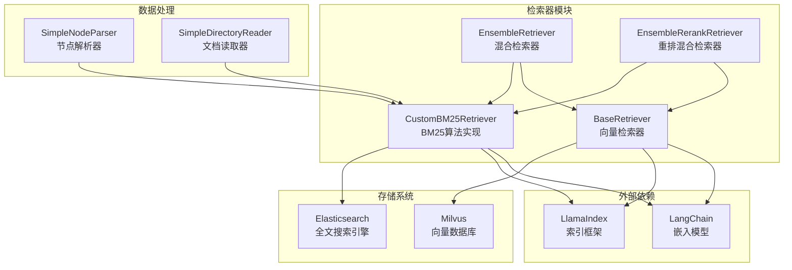

**图表来源**
- [bm25.py:14-92](file://src/retrievers/bm25.py#L14-L92)
- [base.py:16-142](file://src/retrievers/base.py#L16-L142)
- [hybrid.py:13-81](file://src/retrievers/hybrid.py#L13-L81)
- [hybrid_rerank.py:26-81](file://src/retrievers/hybrid_rerank.py#L26-L81)

**章节来源**
- [bm25.py:1-92](file://src/retrievers/bm25.py#L1-L92)
- [base.py:1-142](file://src/retrievers/base.py#L1-L142)
- [__init__.py:1-4](file://src/retrievers/__init__.py#L1-L4)

## 核心组件

BM25检索器的核心组件包括以下关键部分：

### 主要类结构

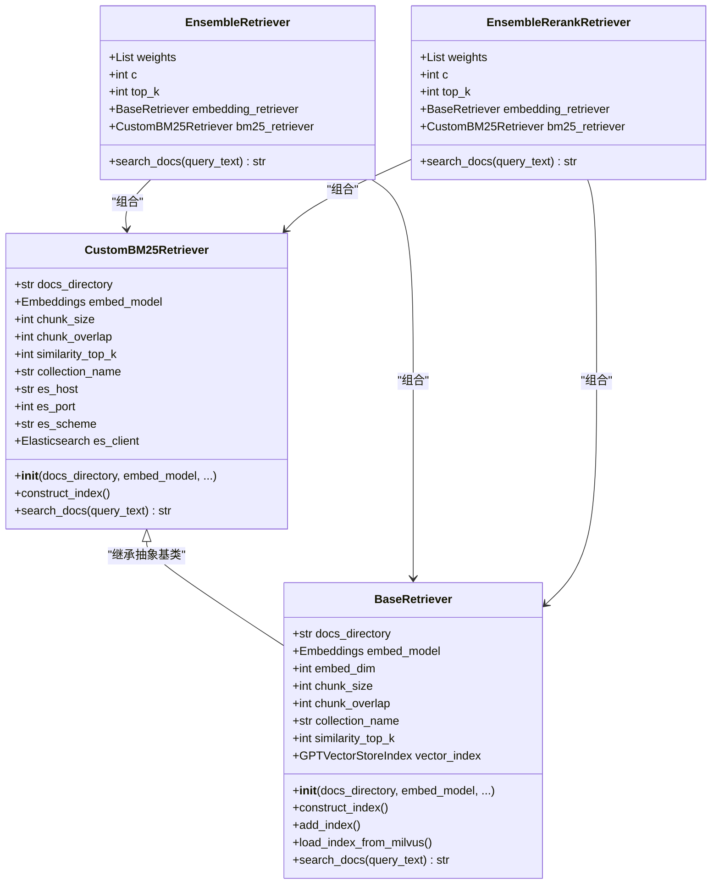

**图表来源**
- [bm25.py:14-92](file://src/retrievers/bm25.py#L14-L92)
- [base.py:16-142](file://src/retrievers/base.py#L16-L142)
- [hybrid.py:13-81](file://src/retrievers/hybrid.py#L13-L81)
- [hybrid_rerank.py:26-81](file://src/retrievers/hybrid_rerank.py#L26-L81)

### 关键配置参数

| 参数名称 | 类型 | 默认值 | 描述 |
|---------|------|--------|------|
| docs_directory | str | 必需 | 文档目录路径 |
| embed_model | Embeddings | 必需 | 嵌入模型实例 |
| chunk_size | int | 128 | 文档块大小 |
| chunk_overlap | int | 0 | 文档块重叠大小 |
| collection_name | str | "docs_80k" | Elasticsearch索引名称 |
| construct_index | bool | False | 是否构建索引 |
| similarity_top_k | int | 2 | 返回的文档数量 |
| es_host | str | "localhost" | Elasticsearch主机地址 |
| es_port | int | 9221 | Elasticsearch端口号 |
| es_scheme | str | "http" | Elasticsearch协议 |

**章节来源**
- [bm25.py:15-36](file://src/retrievers/bm25.py#L15-L36)
- [bm25.py:38-42](file://src/retrievers/bm25.py#L38-L42)

## 架构概览

BM25检索器采用分层架构设计，结合了Elasticsearch的全文搜索能力和LlamaIndex的索引管理功能。

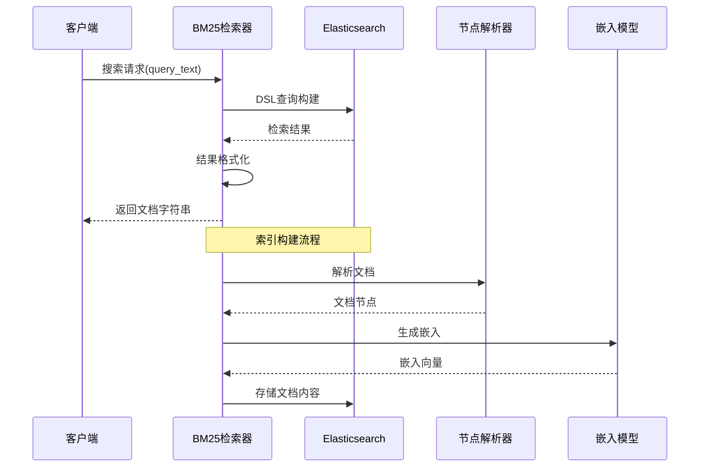

**图表来源**
- [bm25.py:70-90](file://src/retrievers/bm25.py#L70-L90)
- [bm25.py:44-68](file://src/retrievers/bm25.py#L44-L68)

### 数据流分析

BM25检索器的数据流遵循以下模式：

1. **查询阶段**：接收用户查询文本，构建DSL查询语句
2. **检索阶段**：通过Elasticsearch执行全文搜索
3. **结果阶段**：提取匹配文档的内容并进行格式化
4. **索引阶段**：支持文档索引构建和维护

**章节来源**
- [bm25.py:70-90](file://src/retrievers/bm25.py#L70-L90)
- [bm25.py:44-68](file://src/retrievers/bm25.py#L44-L68)

## 详细组件分析

### BM25检索器实现

BM25检索器的核心实现基于Elasticsearch的match查询，提供了简洁高效的检索功能。

#### 初始化流程

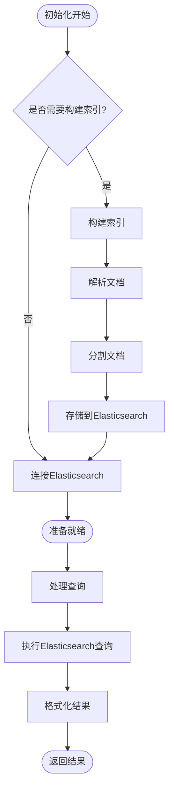

**图表来源**
- [bm25.py:38-42](file://src/retrievers/bm25.py#L38-L42)
- [bm25.py:44-68](file://src/retrievers/bm25.py#L44-L68)

#### 查询处理机制

BM25检索器使用Elasticsearch的match查询来实现关键词匹配：

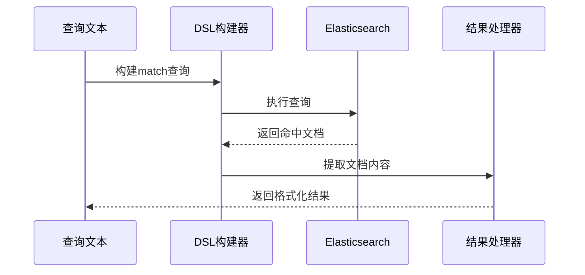

**图表来源**
- [bm25.py:74-82](file://src/retrievers/bm25.py#L74-L82)
- [bm25.py:83-88](file://src/retrievers/bm25.py#L83-L88)

**章节来源**
- [bm25.py:14-92](file://src/retrievers/bm25.py#L14-L92)

### 集成检索器对比

CRUD-RAG提供了多种检索器实现，每种都有其特定的应用场景：

#### 混合检索器架构

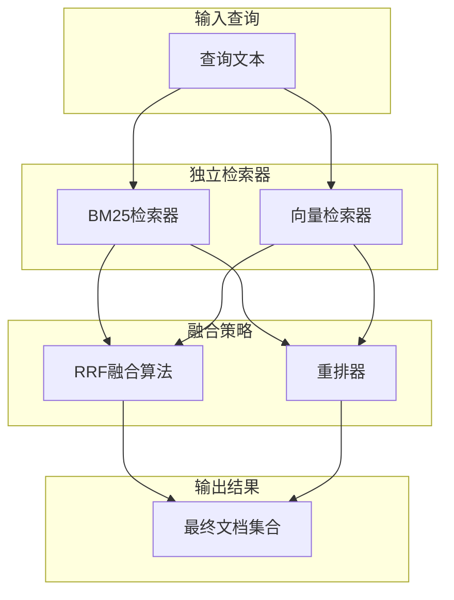

**图表来源**
- [hybrid.py:50-80](file://src/retrievers/hybrid.py#L50-L80)
- [hybrid_rerank.py:63-80](file://src/retrievers/hybrid_rerank.py#L63-L80)

**章节来源**
- [hybrid.py:13-81](file://src/retrievers/hybrid.py#L13-L81)
- [hybrid_rerank.py:26-81](file://src/retrievers/hybrid_rerank.py#L26-L81)

## BM25算法理论基础

### 算法原理

BM25（Best Matching 25）是信息检索领域广泛使用的排序函数，由Karl Kvaratth提出。该算法通过结合词频统计和逆文档频率来计算文档的相关性得分。

#### 数学公式

BM25算法的核心公式为：

```
score = IDF(t,d) × (tf(t,d) × (k1 + 1)) / (tf(t,d) + k1)
```

其中：
- `IDF(t,d)` 是逆文档频率
- `tf(t,d)` 是词频
- `k1` 是饱和参数

#### 关键参数

| 参数 | 符号 | 描述 | 典型范围 |
|------|------|------|----------|
| 饱和参数 | k1 | 控制词频饱和度 | 1.2-2.0 |
| 长度归一化 | b | 控制长度归一化权重 | 0.75 |
| 长度归一化 | K | 文档长度归一化系数 | 0.25-0.75 |

### 在CRUD-RAG中的应用

在CRUD-RAG环境中，BM25算法主要用于：

1. **关键词精确匹配**：通过Elasticsearch的match查询实现
2. **多词查询处理**：支持复杂的布尔查询和短语查询
3. **相关性排序**：基于BM25评分进行文档排序
4. **实时检索**：利用Elasticsearch的高性能特性

**章节来源**
- [bm25.py:74-82](file://src/retrievers/bm25.py#L74-L82)

## 参数配置指南

### 核心参数调优

#### k1参数调优

k1参数控制词频饱和度，影响检索结果的多样性：

| k1值 | 特征 | 适用场景 |
|------|------|----------|
| 0.5-1.0 | 低饱和度 | 需要更多相关文档 |
| 1.2-1.5 | 中等饱和度 | 平衡相关性和多样性 |
| 1.5-2.0 | 高饱和度 | 强调高相关文档 |

#### 相似度阈值设置

虽然BM25检索器直接返回top-k文档，但可以通过以下方式间接控制质量：

```python
# 在quick_start.py中配置
parser.add_argument('--retrieve_top_k', type=int, default=8, help="Top k documents to retrieve")
```

#### Elasticsearch配置

```python
# BM25检索器的Elasticsearch配置
es_host: str = 'localhost'
es_port: int = 9221
es_scheme: str = 'http'
```

### 性能参数优化

#### 索引构建优化

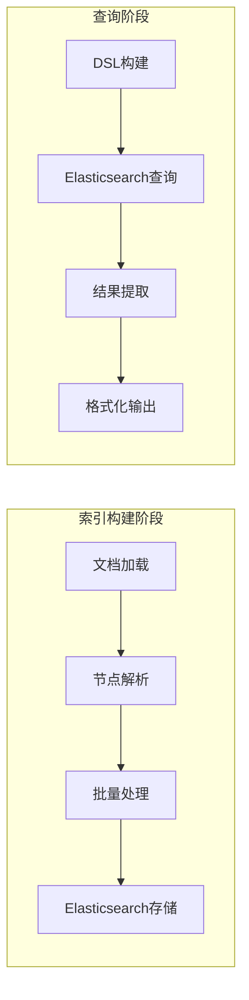

**图表来源**
- [bm25.py:44-68](file://src/retrievers/bm25.py#L44-L68)
- [bm25.py:70-90](file://src/retrievers/bm25.py#L70-L90)

**章节来源**
- [bm25.py:15-36](file://src/retrievers/bm25.py#L15-L36)
- [quick_start.py:38-39](file://quick_start.py#L38-L39)

## 与传统向量检索的对比

### 算法差异

| 特征 | BM25检索器 | 向量检索器 |
|------|------------|------------|
| **算法类型** | 基于关键词匹配 | 基于语义相似度 |
| **索引结构** | Elasticsearch倒排索引 | 向量数据库 |
| **查询处理** | DSL查询语言 | 向量相似度计算 |
| **性能特征** | 高速关键词匹配 | 高精度语义匹配 |
| **资源消耗** | 低内存占用 | 高内存占用 |
| **可解释性** | 高 | 低 |

### 适用场景分析

#### BM25检索器优势

1. **关键词精确匹配**：适合事实性查询和精确信息检索
2. **实时性能**：Elasticsearch提供毫秒级响应时间
3. **资源效率**：相比向量检索更节省内存和存储
4. **可解释性**：查询结果的匹配逻辑清晰可见

#### 向量检索器优势

1. **语义理解**：能够理解查询的语义含义
2. **泛化能力**：对同义词和近义词有更好的处理
3. **上下文理解**：考虑文档的整体语境
4. **多模态支持**：可以处理多种类型的数据

### 混合策略

CRUD-RAG通过混合检索器实现了两种策略的互补：

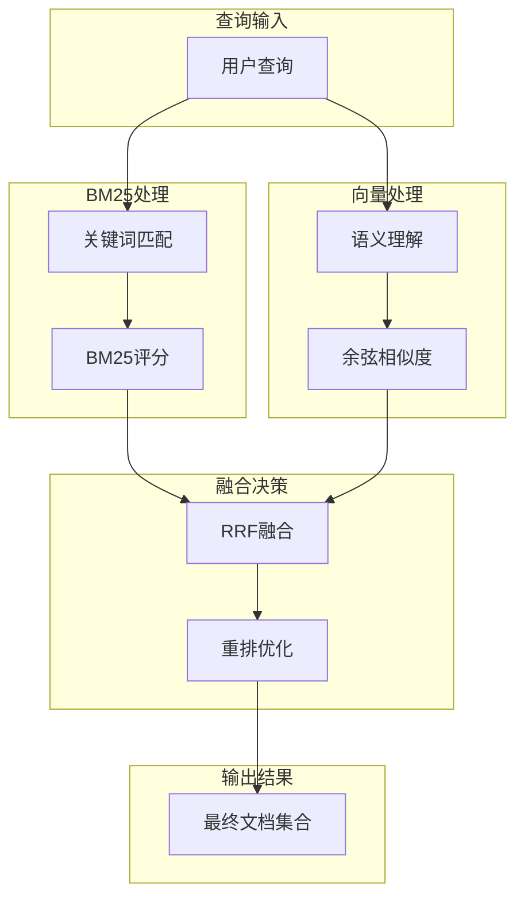

**图表来源**
- [hybrid.py:50-80](file://src/retrievers/hybrid.py#L50-L80)
- [hybrid_rerank.py:63-80](file://src/retrievers/hybrid_rerank.py#L63-L80)

**章节来源**
- [hybrid.py:13-81](file://src/retrievers/hybrid.py#L13-L81)
- [hybrid_rerank.py:26-81](file://src/retrievers/hybrid_rerank.py#L26-L81)

## 集成与使用示例

### 基本使用流程

在CRUD-RAG中，BM25检索器通过命令行参数进行配置和使用：

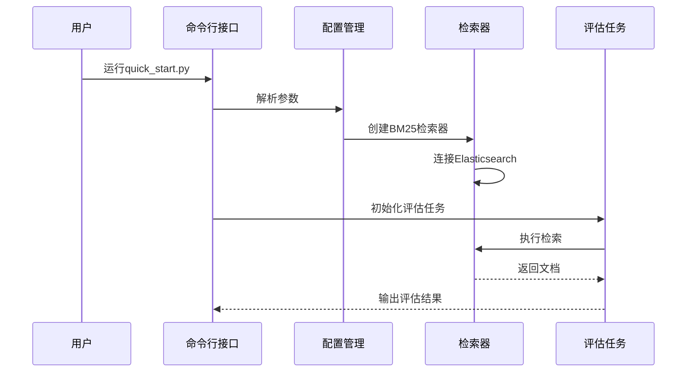

**图表来源**
- [quick_start.py:68-73](file://quick_start.py#L68-L73)
- [quick_start.py:106-108](file://quick_start.py#L106-L108)

### 配置参数详解

#### 基础配置

```python
# 在quick_start.py中定义的关键参数
parser.add_argument('--retriever_name', default="base", help="Name of the retriever")
parser.add_argument('--retrieve_top_k', type=int, default=8, help="Top k documents to retrieve")
parser.add_argument('--docs_path', default='data/tmp', help="Path to the retrieval documents")
```

#### Elasticsearch配置

```python
# BM25检索器的Elasticsearch连接参数
es_host: str = 'localhost'
es_port: int = 9221
es_scheme: str = 'http'
```

### 使用示例

#### 命令行使用

```bash
python quick_start.py \
  --model_name 'gpt-3.5-turbo' \
  --temperature 0.1 \
  --max_new_tokens 1280 \
  --docs_path 'data/80000_docs' \
  --retriever_name 'bm25' \
  --retrieve_top_k 8 \
  --task 'all'
```

#### 编程接口使用

```python
# 在代码中直接使用BM25检索器
from src.retrievers import CustomBM25Retriever
from src.embeddings.base import HuggingfaceEmbeddings

embed_model = HuggingfaceEmbeddings(model_name='sentence-transformers/bge-base-zh-v1.5')
retriever = CustomBM25Retriever(
    docs_path='data/80000_docs',
    embed_model=embed_model,
    similarity_top_k=8,
    es_host='localhost',
    es_port=9221
)

# 执行检索
results = retriever.search_docs("查询文本")
```

**章节来源**
- [quick_start.py:68-73](file://quick_start.py#L68-L73)
- [quick_start.py:106-108](file://quick_start.py#L106-L108)

## 性能分析与优化

### 性能特征

#### 时间复杂度分析

BM25检索器的时间复杂度主要取决于以下因素：

1. **查询复杂度**：O(log N) 到 O(N) 取决于查询复杂度
2. **索引构建**：O(M log M) 其中M是文档数量
3. **内存使用**：与索引大小成正比

#### 内存优化策略

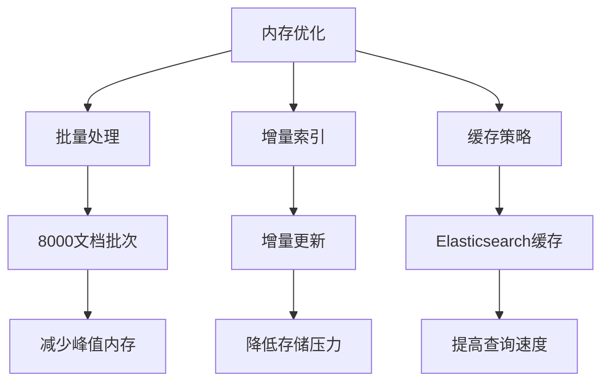

**图表来源**
- [bm25.py:60-66](file://src/retrievers/bm25.py#L60-L66)

### 优化建议

#### 索引优化

1. **分批索引构建**：使用8000文档的批次大小避免内存溢出
2. **增量更新**：支持新文档的增量索引添加
3. **压缩策略**：合理配置Elasticsearch的存储压缩

#### 查询优化

1. **查询缓存**：对频繁查询结果进行缓存
2. **结果预取**：提前加载可能需要的文档内容
3. **并发处理**：支持多线程查询处理

#### 资源管理

```python
# Elasticsearch连接池配置
es_client = Elasticsearch(
    [{'host': self.es_host, 'port': self.es_port, "scheme": self.es_scheme}],
    maxsize=25
)
```

**章节来源**
- [bm25.py:60-66](file://src/retrievers/bm25.py#L60-L66)
- [bm25.py:41](file://src/retrievers/bm25.py#L41)

## 故障排除指南

### 常见问题诊断

#### Elasticsearch连接问题

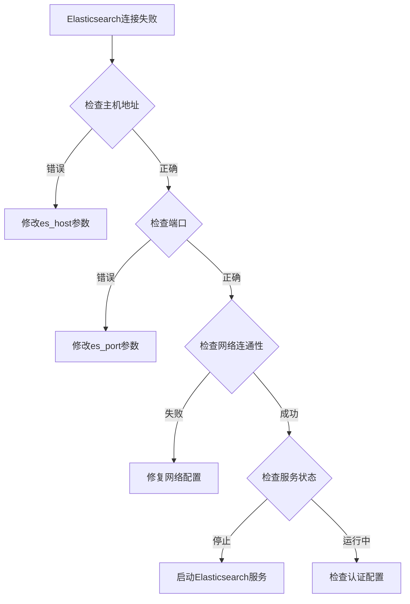

**图表来源**
- [bm25.py:41](file://src/retrievers/bm25.py#L41)

#### 索引构建失败

1. **文档格式问题**：确保文档为纯文本格式
2. **内存不足**：调整批次大小或增加系统内存
3. **磁盘空间不足**：清理磁盘空间或调整索引配置

#### 查询性能问题

1. **查询超时**：增加timeout参数或优化查询条件
2. **结果不准确**：调整similarity_top_k参数
3. **响应缓慢**：检查Elasticsearch集群状态

### 调试工具

#### 日志记录

BM25检索器提供了基本的日志输出：

```python
print("Elasticsearch connected!")  # 连接成功日志
print(f"Indexing of part {spilt_ids} finished!")  # 索引进度日志
print("Indexing finished!")  # 索引完成日志
```

#### 错误处理

```python
try:
    search_result = self.es_client.search(index=self.collection_name, body=dsl)
except Exception as e:
    print(f"Elasticsearch查询失败: {e}")
    return ""
```

**章节来源**
- [bm25.py:41](file://src/retrievers/bm25.py#L41)
- [bm25.py:66](file://src/retrievers/bm25.py#L66)
- [bm25.py:82](file://src/retrievers/bm25.py#L82)

## 结论

CRUD-RAG项目中的BM25检索器是一个精心设计的信息检索系统，它结合了经典的BM25算法和现代的Elasticsearch技术，为RAG应用提供了高效、可靠的检索能力。

### 主要优势

1. **算法成熟性**：BM25作为经典信息检索算法，具有坚实的理论基础
2. **性能优异**：基于Elasticsearch的全文搜索，提供毫秒级响应时间
3. **资源效率**：相比向量检索更节省内存和存储资源
4. **可解释性强**：查询结果的匹配逻辑清晰可见
5. **易于部署**：基于成熟的Elasticsearch生态系统

### 应用价值

BM25检索器在CRUD-RAG中的价值体现在：

1. **基准测试**：为RAG系统的性能提供基准参考
2. **混合策略**：与向量检索器形成互补，提升整体检索效果
3. **成本效益**：提供高性价比的检索解决方案
4. **研究工具**：为信息检索算法研究提供实验平台

### 发展前景

随着信息检索技术的不断发展，BM25检索器可以在以下方面进一步改进：

1. **算法优化**：结合深度学习技术提升检索精度
2. **多模态支持**：扩展到图像、音频等多模态数据
3. **实时学习**：支持在线学习和自适应调整
4. **隐私保护**：集成隐私保护技术，满足数据安全需求

通过持续的技术创新和优化，BM25检索器将继续在信息检索和RAG应用中发挥重要作用。