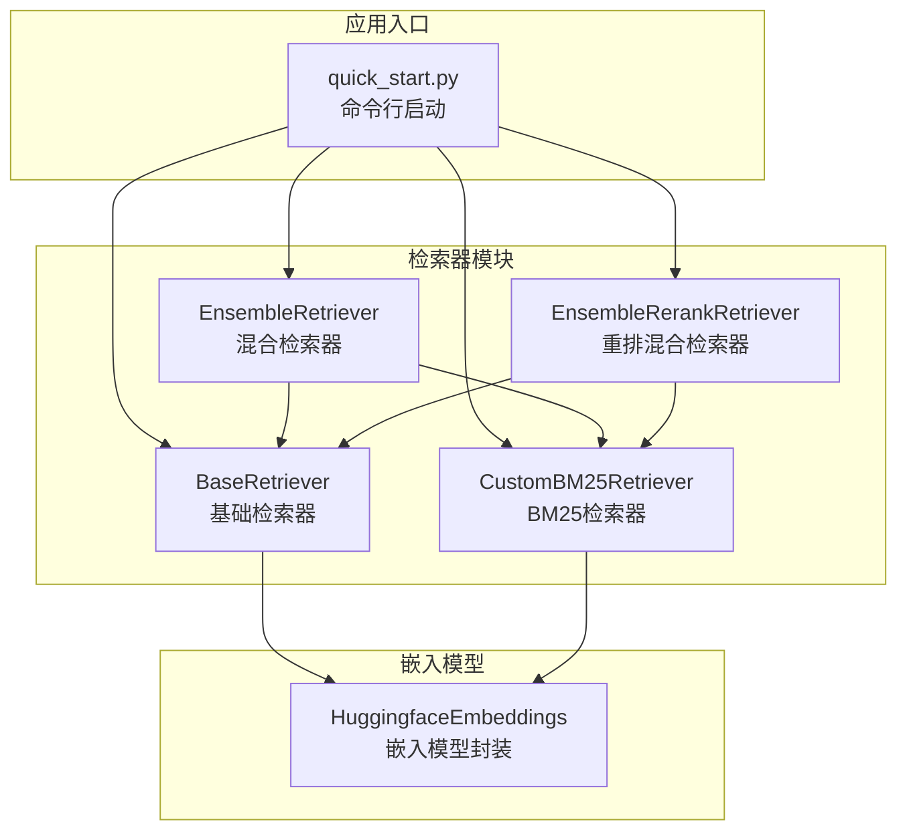
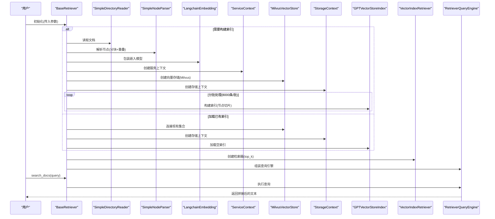
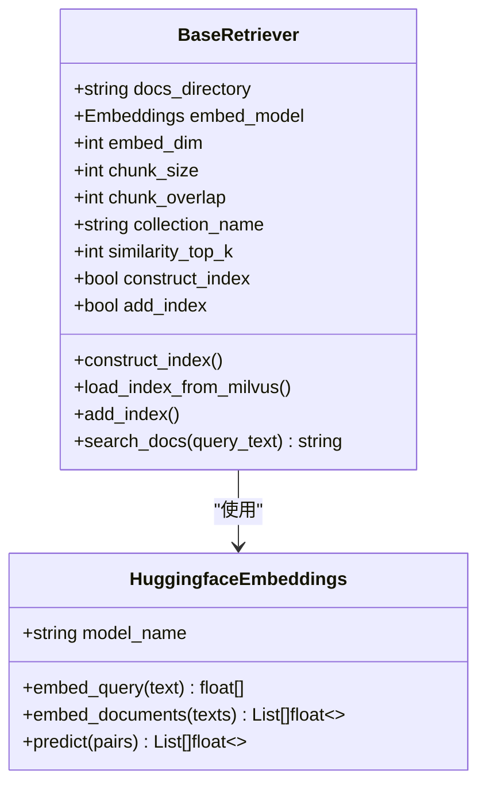
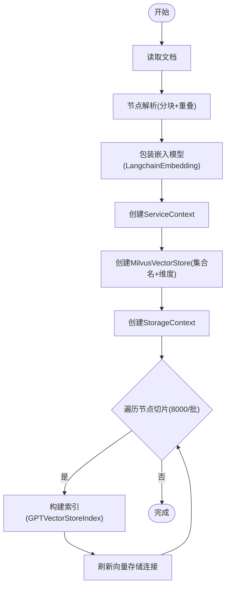
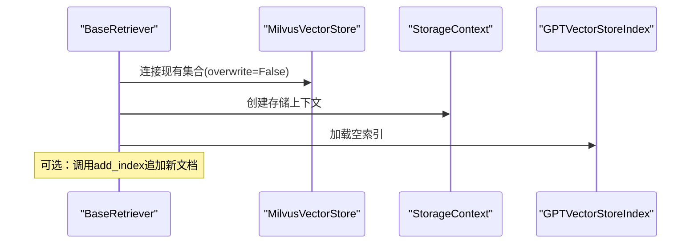
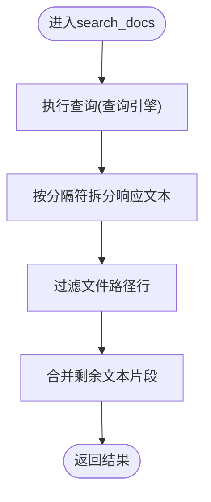
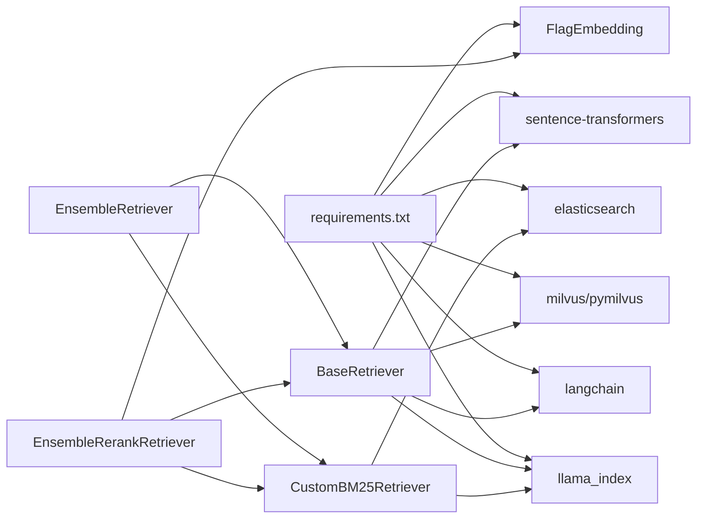

# 基础检索器

<cite>
**本文引用的文件**
- [src/retrievers/base.py](file://src/retrievers/base.py)
- [src/embeddings/base.py](file://src/embeddings/base.py)
- [src/retrievers/__init__.py](file://src/retrievers/__init__.py)
- [src/retrievers/bm25.py](file://src/retrievers/bm25.py)
- [src/retrievers/hybrid.py](file://src/retrievers/hybrid.py)
- [src/retrievers/hybrid_rerank.py](file://src/retrievers/hybrid_rerank.py)
- [quick_start.py](file://quick_start.py)
- [README.md](file://README.md)
- [requirements.txt](file://requirements.txt)
</cite>

## 目录
1. [简介](#简介)
2. [项目结构](#项目结构)
3. [核心组件](#核心组件)
4. [架构总览](#架构总览)
5. [详细组件分析](#详细组件分析)
6. [依赖分析](#依赖分析)
7. [性能考量](#性能考量)
8. [故障排查指南](#故障排查指南)
9. [结论](#结论)
10. [附录](#附录)

## 简介
本文件面向CRUD-RAG中的基础检索器（BaseRetriever），系统性阐述其基于抽象基类（ABC）的设计理念与核心接口，详解构造函数参数配置、索引构建与加载流程、增量添加机制、以及search_docs方法的实现原理与返回结果格式。同时提供完整使用示例与最佳实践建议，帮助读者快速上手并高效扩展。

## 项目结构
与基础检索器直接相关的核心模块如下：
- 检索器：src/retrievers/base.py（基础检索器）、src/retrievers/bm25.py（BM25检索器）、src/retrievers/hybrid.py（混合检索器）、src/retrievers/hybrid_rerank.py（重排混合检索器）
- 嵌入模型：src/embeddings/base.py（HuggingfaceEmbeddings封装）
- 入口导出：src/retrievers/__init__.py
- 快速开始脚本：quick_start.py
- 依赖声明：requirements.txt
- 使用说明：README.md

图表来源
- [src/retrievers/base.py:16-142](file://src/retrievers/base.py#L16-L142)
- [src/retrievers/bm25.py:14-92](file://src/retrievers/bm25.py#L14-L92)
- [src/retrievers/hybrid.py:13-81](file://src/retrievers/hybrid.py#L13-L81)
- [src/retrievers/hybrid_rerank.py:26-81](file://src/retrievers/hybrid_rerank.py#L26-L81)
- [src/embeddings/base.py:14-88](file://src/embeddings/base.py#L14-L88)
- [quick_start.py:61-89](file://quick_start.py#L61-L89)

章节来源
- [src/retrievers/__init__.py:1-4](file://src/retrievers/__init__.py#L1-L4)
- [README.md:27-68](file://README.md#L27-L68)

## 核心组件
- 抽象基类（ABC）设计：BaseRetriever通过继承ABC确保子类必须实现特定接口，提升可扩展性与一致性。
- 关键接口：
  - 构造函数：接收文档目录、嵌入模型、嵌入维度、分块大小、重叠区域、集合名称、是否构建索引、是否增量添加、相似度top-k等参数。
  - 构建索引：construct_index
  - 加载索引：load_index_from_milvus
  - 增量添加：add_index
  - 查询：search_docs

章节来源
- [src/retrievers/base.py:16-55](file://src/retrievers/base.py#L16-L55)

## 架构总览
基础检索器采用“文档读取—节点解析—嵌入编码—Milvus向量存储”的流水线式架构，并通过LlamaIndex的ServiceContext、StorageContext与GPTVectorStoreIndex完成索引构建与查询引擎装配。

图表来源
- [src/retrievers/base.py:37-54](file://src/retrievers/base.py#L37-L54)
- [src/retrievers/base.py:56-87](file://src/retrievers/base.py#L56-L87)
- [src/retrievers/base.py:121-131](file://src/retrievers/base.py#L121-L131)
- [src/retrievers/base.py:133-140](file://src/retrievers/base.py#L133-L140)

## 详细组件分析

### BaseRetriever 类设计与继承关系
- 设计理念：通过ABC强制统一接口，便于替换不同向量存储后端（如Elasticsearch、Milvus）。
- 关键属性与参数：
  - 文档目录：docs_directory
  - 嵌入模型：embed_model（需满足LangChain Embeddings接口）
  - 嵌入维度：embed_dim
  - 分块大小：chunk_size
  - 重叠区域：chunk_overlap
  - 集合名称：collection_name
  - 是否构建索引：construct_index
  - 是否增量添加：add_index
  - 相似度top-k：similarity_top_k
- 控制流：
  - 若construct_index为真，则执行构建索引；否则从Milvus加载已有索引。
  - 若add_index为真，在已有索引基础上追加新文档。
  - 最终装配VectorIndexRetriever与RetrieverQueryEngine供查询使用。

图表来源
- [src/retrievers/base.py:16-55](file://src/retrievers/base.py#L16-L55)
- [src/embeddings/base.py:14-88](file://src/embeddings/base.py#L14-L88)

章节来源
- [src/retrievers/base.py:16-55](file://src/retrievers/base.py#L16-L55)
- [src/embeddings/base.py:14-88](file://src/embeddings/base.py#L14-L88)

### 构造函数参数配置详解
- 文档目录（docs_directory）：指向待检索的文档根路径，支持多种格式（由SimpleDirectoryReader与JSONReader决定）。
- 嵌入模型（embed_model）：需实现LangChain Embeddings接口，BaseRetriever内部会用LangchainEmbedding包装。
- 嵌入维度（embed_dim）：用于Milvus集合的向量维度，需与嵌入模型输出一致。
- 分块大小（chunk_size）：节点切分长度，影响召回粒度与存储开销。
- 重叠区域（chunk_overlap）：相邻节点的重叠字数，提升语义连贯性。
- 集合名称（collection_name）：Milvus集合名，区分不同索引库。
- 构建索引（construct_index）：首次运行或重建索引时启用。
- 增量添加（add_index）：在已有索引基础上追加新文档。
- 相似度top-k（similarity_top_k）：查询返回的候选数量。

章节来源
- [src/retrievers/base.py:17-35](file://src/retrievers/base.py#L17-L35)
- [quick_start.py:25-39](file://quick_start.py#L25-L39)

### 索引构建流程
- 文档读取：使用SimpleDirectoryReader按目录读取文档。
- 节点解析：SimpleNodeParser根据chunk_size与chunk_overlap生成节点列表。
- 嵌入模型配置：LangchainEmbedding包装原始Embeddings，作为ServiceContext的一部分。
- 向量存储：MilvusVectorStore初始化，集合名与维度设置。
- 存储上下文：StorageContext与向量存储绑定。
- 分批索引：为规避Milvus单次写入限制，按8000条节点切片循环构建索引，每批完成后刷新向量存储连接。
- 完成提示：打印每批完成与最终完成信息。

图表来源
- [src/retrievers/base.py:56-87](file://src/retrievers/base.py#L56-L87)

章节来源
- [src/retrievers/base.py:56-87](file://src/retrievers/base.py#L56-L87)

### 索引加载与增量添加机制
- 加载索引：通过MilvusVectorStore连接已存在集合，创建空索引对象，以便后续查询。
- 增量添加：与构建流程类似，但向量存储不覆盖（overwrite=False），并在每批后刷新连接，保证数据连续写入。

图表来源
- [src/retrievers/base.py:121-131](file://src/retrievers/base.py#L121-L131)
- [src/retrievers/base.py:89-119](file://src/retrievers/base.py#L89-L119)

章节来源
- [src/retrievers/base.py:121-131](file://src/retrievers/base.py#L121-L131)
- [src/retrievers/base.py:89-119](file://src/retrievers/base.py#L89-L119)

### search_docs 方法实现原理与返回格式
- 查询流程：通过RetrieverQueryEngine执行查询，底层使用VectorIndexRetriever进行相似度检索。
- 结果解析：将响应文本按固定分隔符拆分，过滤掉文件路径字段，合并剩余片段为最终字符串。
- 返回格式：纯文本段落，段落间以特定分隔符分隔，便于下游任务直接使用。

图表来源
- [src/retrievers/base.py:133-140](file://src/retrievers/base.py#L133-L140)

章节来源
- [src/retrievers/base.py:133-140](file://src/retrievers/base.py#L133-L140)

### 使用示例与最佳实践
- 快速开始脚本展示了如何实例化BaseRetriever并将其注入评估流程：
  - 参数映射：docs_path、docs_type、chunk_size、chunk_overlap、construct_index、add_index、collection_name、retrieve_top_k、retriever_name等。
  - 模型选择：根据模型名选择LLM实例。
  - 检索器选择：通过retriever_name切换到base/bm25/hybrid/hybrid-rerank。
- 最佳实践：
  - 首次运行务必开启construct_index，之后复用索引时关闭该选项。
  - 根据硬件与数据规模调整chunk_size与similarity_top_k。
  - 确保嵌入模型维度与Milvus集合维度一致。
  - 在大规模数据场景下，优先使用分批索引与增量添加，避免单次写入超限。
  - 保持collection_name唯一性，避免多任务互相污染。

章节来源
- [quick_start.py:54-89](file://quick_start.py#L54-L89)
- [README.md:70-105](file://README.md#L70-L105)

## 依赖分析
- 外部依赖：llama_index、langchain、milvus/pymilvus、sentence-transformers、elasticsearch、FlagEmbedding等。
- 内部依赖：BaseRetriever依赖HuggingfaceEmbeddings；混合检索器依赖BaseRetriever与BM25检索器；重排混合检索器依赖rerank模块。

图表来源
- [requirements.txt:1-13](file://requirements.txt#L1-L13)
- [src/retrievers/base.py:3-13](file://src/retrievers/base.py#L3-L13)
- [src/retrievers/bm25.py:3-11](file://src/retrievers/bm25.py#L3-L11)
- [src/retrievers/hybrid.py](file://src/retrievers/hybrid.py#L11)
- [src/retrievers/hybrid_rerank.py](file://src/retrievers/hybrid_rerank.py#L12)

章节来源
- [requirements.txt:1-13](file://requirements.txt#L1-L13)
- [src/retrievers/base.py:3-13](file://src/retrievers/base.py#L3-L13)
- [src/retrievers/bm25.py:3-11](file://src/retrievers/bm25.py#L3-L11)
- [src/retrievers/hybrid.py](file://src/retrievers/hybrid.py#L11)
- [src/retrievers/hybrid_rerank.py](file://src/retrievers/hybrid_rerank.py#L12)

## 性能考量
- 分批索引：按8000条节点切片构建索引，降低单次写入压力，提高稳定性。
- 向量维度：确保embed_dim与嵌入模型输出一致，避免查询失败或性能退化。
- 分块策略：较小chunk_size提升召回细粒度，但增加索引体积；较大chunk_overlap增强语义连贯性，但可能引入冗余。
- top-k权衡：similarity_top_k越大召回越多，但排序与下游处理成本越高。
- 硬件与网络：Milvus服务稳定性直接影响索引构建与查询延迟。

## 故障排查指南
- 无法连接Milvus：确认服务已启动且网络可达；检查集合名与维度配置。
- 嵌入模型导入失败：确保sentence-transformers安装正确，模型缓存路径可用。
- 索引构建卡顿：检查chunk_size与硬件资源；必要时增大批次或减少并发。
- 查询结果为空：核对similarity_top_k与集合内容；确认查询文本预处理与分词策略。
- 增量添加异常：确保add_index与集合名一致，避免重复覆盖。

章节来源
- [README.md:76-79](file://README.md#L76-L79)
- [src/retrievers/base.py:67-70](file://src/retrievers/base.py#L67-L70)
- [src/embeddings/base.py:25-37](file://src/embeddings/base.py#L25-L37)

## 结论
BaseRetriever以ABC为抽象基座，结合LlamaIndex与Milvus实现了高效的向量检索流水线。通过合理的参数配置与分批索引策略，可在大规模文档场景中稳定构建与加载索引，并通过search_docs提供简洁的文本返回格式。配合BM25与重排混合检索器，可进一步提升召回质量与排序效果。

## 附录
- 相关文件路径与用途概览：
  - [src/retrievers/base.py](file://src/retrievers/base.py)：基础检索器实现
  - [src/embeddings/base.py](file://src/embeddings/base.py)：嵌入模型封装
  - [src/retrievers/bm25.py](file://src/retrievers/bm25.py)：BM25检索器实现
  - [src/retrievers/hybrid.py](file://src/retrievers/hybrid.py)：混合检索器实现
  - [src/retrievers/hybrid_rerank.py](file://src/retrievers/hybrid_rerank.py)：重排混合检索器实现
  - [quick_start.py](file://quick_start.py)：命令行启动与参数映射
  - [README.md](file://README.md)：使用说明与快速开始
  - [requirements.txt](file://requirements.txt)：依赖清单