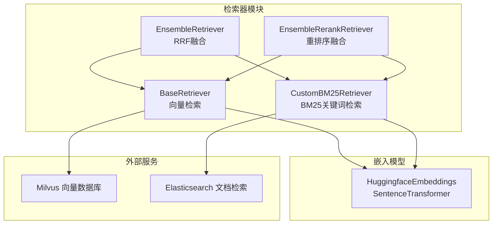
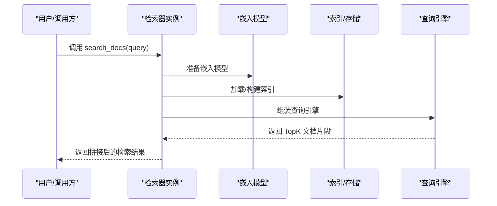
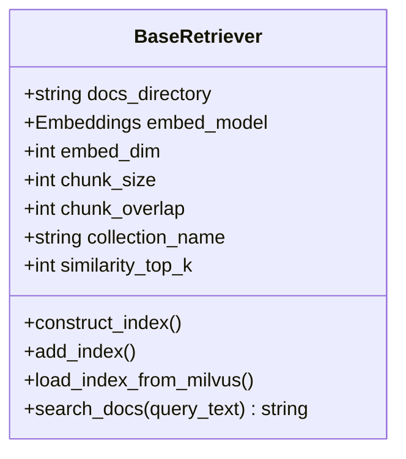
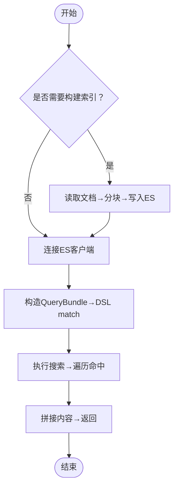
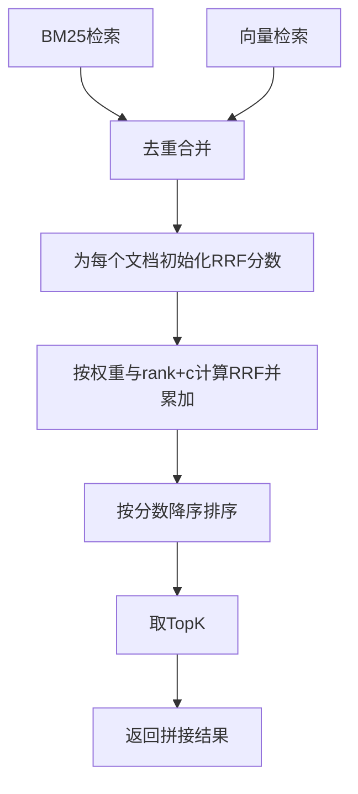
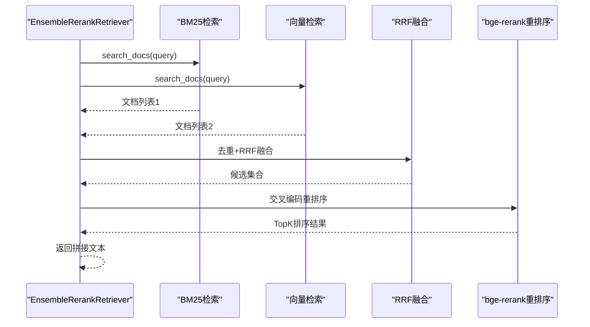
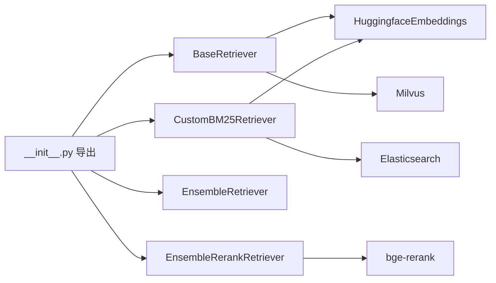

# 检索器系统

<cite>
**本文引用的文件**
- [src/retrievers/base.py](file://src/retrievers/base.py)
- [src/retrievers/bm25.py](file://src/retrievers/bm25.py)
- [src/retrievers/hybrid.py](file://src/retrievers/hybrid.py)
- [src/retrievers/hybrid_rerank.py](file://src/retrievers/hybrid_rerank.py)
- [src/retrievers/__init__.py](file://src/retrievers/__init__.py)
- [src/embeddings/base.py](file://src/embeddings/base.py)
- [quick_start.py](file://quick_start.py)
- [README.md](file://README.md)
</cite>

## 目录
1. [简介](#简介)
2. [项目结构](#项目结构)
3. [核心组件](#核心组件)
4. [架构总览](#架构总览)
5. [详细组件分析](#详细组件分析)
6. [依赖关系分析](#依赖关系分析)
7. [性能考量](#性能考量)
8. [故障排查指南](#故障排查指南)
9. [结论](#结论)
10. [附录：扩展与最佳实践](#附录扩展与最佳实践)

## 简介
本文件面向CRUD-RAG的检索器系统，系统性梳理了BaseRetriever基类的设计架构与核心接口，详解向量检索、BM25关键词检索以及混合检索策略（含RRF融合与重排序）的实现原理与参数配置，并给出性能调优与扩展新检索器类型的指导。文档同时结合实际代码路径与图示，帮助读者快速理解并高效应用该检索体系。

## 项目结构
检索器相关模块位于src/retrievers目录，包含：
- 基类与接口：BaseRetriever（向量检索）
- BM25检索器：CustomBM25Retriever（Elasticsearch）
- 混合检索：EnsembleRetriever（RRF融合）
- 混合+重排序：EnsembleRerankRetriever（基于bge-rerank）

图表来源
- [src/retrievers/base.py:16-142](file://src/retrievers/base.py#L16-L142)
- [src/retrievers/bm25.py:14-92](file://src/retrievers/bm25.py#L14-L92)
- [src/retrievers/hybrid.py:13-81](file://src/retrievers/hybrid.py#L13-L81)
- [src/retrievers/hybrid_rerank.py:26-81](file://src/retrievers/hybrid_rerank.py#L26-L81)
- [src/embeddings/base.py:14-87](file://src/embeddings/base.py#L14-L87)

章节来源
- [src/retrievers/__init__.py:1-4](file://src/retrievers/__init__.py#L1-L4)
- [README.md:27-68](file://README.md#L27-L68)

## 核心组件
- BaseRetriever（向量检索）
  - 负责文档分块、嵌入、索引构建与加载、查询引擎装配与执行。
  - 支持首次构建索引或从Milvus加载已有索引；支持增量添加索引。
  - 查询时返回拼接后的文本片段。
- CustomBM25Retriever（BM25关键词检索）
  - 使用Elasticsearch进行全文匹配检索，按相似度TopK返回内容。
- EnsembleRetriever（混合检索-RRF）
  - 将BM25与向量检索结果去重合并，采用Reciprocal Rank Fusion（RRF）融合打分，按权重与常数c控制衰减。
- EnsembleRerankRetriever（混合+重排序）
  - 在RRF融合基础上，使用bge-rerank对候选文档进行交叉编码重排序，提升语义一致性与相关性。

章节来源
- [src/retrievers/base.py:16-142](file://src/retrievers/base.py#L16-L142)
- [src/retrievers/bm25.py:14-92](file://src/retrievers/bm25.py#L14-L92)
- [src/retrievers/hybrid.py:13-81](file://src/retrievers/hybrid.py#L13-L81)
- [src/retrievers/hybrid_rerank.py:26-81](file://src/retrievers/hybrid_rerank.py#L26-L81)

## 架构总览
检索器系统通过统一的search_docs接口对外提供检索能力，内部根据配置选择具体实现。整体数据流如下：

图表来源
- [src/retrievers/base.py:46-54](file://src/retrievers/base.py#L46-L54)
- [src/retrievers/base.py:133-140](file://src/retrievers/base.py#L133-L140)
- [src/embeddings/base.py:58-73](file://src/embeddings/base.py#L58-L73)

## 详细组件分析

### BaseRetriever（向量检索）
- 设计要点
  - 通过SimpleNodeParser对文档进行分块，LangchainEmbedding封装嵌入模型，Milvus作为向量存储。
  - 支持分批索引构建（每批约8000节点），缓解内存与写入压力。
  - 查询时通过VectorIndexRetriever与RetrieverQueryEngine组合，返回拼接后的文本。
- 关键参数
  - embed_dim：嵌入维度，默认768
  - chunk_size/chunk_overlap：分块大小与重叠
  - collection_name：Milvus集合名
  - similarity_top_k：返回TopK
  - construct_index/add_index：是否构建或追加索引
- 处理逻辑
  - 构建索引：读取文档→分块→嵌入→Milvus写入（分批）
  - 加载索引：从Milvus加载空索引，准备查询上下文
  - 查询：执行查询→解析响应→过滤文件路径信息→返回文本

图表来源
- [src/retrievers/base.py:16-142](file://src/retrievers/base.py#L16-L142)

章节来源
- [src/retrievers/base.py:16-142](file://src/retrievers/base.py#L16-L142)
- [src/embeddings/base.py:14-87](file://src/embeddings/base.py#L14-L87)

### BM25检索器（CustomBM25Retriever）
- 设计要点
  - 使用Elasticsearch进行全文匹配检索，DSL采用match查询，返回TopK文档内容。
  - 支持首次构建索引（ElasticsearchStore写入），并连接ES客户端。
- 关键参数
  - es_host/es_port/es_scheme：ES连接参数
  - similarity_top_k：返回TopK
  - chunk_size/chunk_overlap：分块参数
- 处理逻辑
  - 构建索引：文档→分块→ElasticsearchStore写入（分批）
  - 查询：构造QueryBundle→DSL match→遍历命中→拼接文本

图表来源
- [src/retrievers/bm25.py:44-68](file://src/retrievers/bm25.py#L44-L68)
- [src/retrievers/bm25.py:70-91](file://src/retrievers/bm25.py#L70-L91)

章节来源
- [src/retrievers/bm25.py:14-92](file://src/retrievers/bm25.py#L14-L92)

### 混合检索（EnsembleRetriever，RRF融合）
- 设计要点
  - 并行调用BM25与向量检索，得到两组文档列表。
  - 对两组列表求并集，避免重复文档。
  - 使用RRF公式对每个文档在两个列表中的相对排名进行加权融合，常数c控制衰减速度，weights控制两类方法的权重。
- 关键参数
  - weights：BM25与向量检索的权重，默认[0.5, 0.5]
  - c：RRF衰减常数，默认60
  - top_k：最终返回TopK
- 处理逻辑
  - 获取两路检索结果→去重合并→计算RRF分数→降序排序→截取TopK→返回

图表来源
- [src/retrievers/hybrid.py:50-80](file://src/retrievers/hybrid.py#L50-L80)

章节来源
- [src/retrievers/hybrid.py:13-81](file://src/retrievers/hybrid.py#L13-L81)

### 混合+重排序（EnsembleRerankRetriever）
- 设计要点
  - 先用RRF融合两路检索结果，得到候选集合。
  - 使用bge-rerank对候选文档进行交叉编码重排序，仅保留TopK。
- 关键参数
  - top_k：最终返回TopK
  - weights/c：与RRF一致
- 处理逻辑
  - 获取两路检索结果→去重→RRF融合→bge-rerank重排序→返回

图表来源
- [src/retrievers/hybrid_rerank.py:63-80](file://src/retrievers/hybrid_rerank.py#L63-L80)
- [src/retrievers/hybrid_rerank.py:15-24](file://src/retrievers/hybrid_rerank.py#L15-L24)

章节来源
- [src/retrievers/hybrid_rerank.py:26-81](file://src/retrievers/hybrid_rerank.py#L26-L81)

## 依赖关系分析
- 模块导出
  - 通过__init__.py统一导出各检索器类，便于上层快速导入与切换。
- 外部依赖
  - 向量检索依赖Milvus与LangChain Embeddings；BM25依赖Elasticsearch；重排序依赖FlagEmbedding的bge-rerank。
- 参数耦合
  - BaseRetriever与CustomBM25Retriever共享嵌入模型与文档分块参数，确保检索一致性。
  - Ensemble系列通过weights、c、top_k等参数控制融合与裁剪策略。

图表来源
- [src/retrievers/__init__.py:1-4](file://src/retrievers/__init__.py#L1-L4)
- [src/embeddings/base.py:14-87](file://src/embeddings/base.py#L14-L87)

章节来源
- [src/retrievers/__init__.py:1-4](file://src/retrievers/__init__.py#L1-L4)

## 性能考量
- 索引构建
  - 分批索引：两路检索器均采用分批写入（约8000节点/批），降低内存峰值与写入阻塞风险。
  - 嵌入模型：使用SentenceTransformer，支持归一化嵌入，提高向量检索稳定性。
- 查询优化
  - TopK裁剪：通过similarity_top_k与top_k控制候选规模，平衡召回与延迟。
  - RRF常数c：c越大，低排名影响越小，更偏向全局相关性；需结合业务调优。
- 缓存策略
  - 当前实现未显式引入查询缓存；可考虑在上层对常见查询结果进行LRU缓存，减少重复检索开销。
- 存储与网络
  - Milvus与Elasticsearch的连接参数（主机、端口、协议）应与部署环境一致，避免超时与失败。
- 数据预处理
  - 合理设置chunk_size与chunk_overlap，兼顾召回与上下文连贯性；过小导致碎片化，过大增加冗余。

章节来源
- [src/retrievers/base.py:74-78](file://src/retrievers/base.py#L74-L78)
- [src/retrievers/bm25.py:61-67](file://src/retrievers/bm25.py#L61-L67)
- [src/retrievers/hybrid.py:27-28](file://src/retrievers/hybrid.py#L27-L28)
- [src/retrievers/hybrid_rerank.py:40-41](file://src/retrievers/hybrid_rerank.py#L40-L41)

## 故障排查指南
- 索引构建失败
  - 确认Milvus服务已启动且可访问；检查collection_name与embed_dim配置。
  - 若分批写入异常，检查节点数量与批次大小，适当调整。
- Elasticsearch连接问题
  - 校验es_host、es_port、es_scheme；确认ES服务可用且索引存在。
- 查询结果为空
  - 检查similarity_top_k是否过小；确认文档类型与分块参数合理。
- 重排序报错
  - 确认bge-rerank模型已下载至本地；检查输入格式（query与passage列表）。
- 嵌入模型问题
  - 确认sentence-transformers安装；若使用本地模型，检查路径与名称。

章节来源
- [src/retrievers/base.py:37-43](file://src/retrievers/base.py#L37-L43)
- [src/retrievers/bm25.py:38-42](file://src/retrievers/bm25.py#L38-L42)
- [src/retrievers/hybrid_rerank.py:15-16](file://src/retrievers/hybrid_rerank.py#L15-L16)
- [README.md:76-86](file://README.md#L76-L86)

## 结论
该检索器系统以清晰的模块化设计实现了向量检索、BM25检索与混合策略（RRF与重排序）。通过统一的search_docs接口与可配置的参数，既满足快速实验需求，又具备良好的扩展性。建议在生产环境中结合业务场景对TopK、RRF常数与嵌入模型进行系统性调优，并引入查询缓存与监控以进一步提升性能与稳定性。

## 附录：扩展与最佳实践

### 扩展新的检索器类型
- 接口规范
  - 必须实现search_docs(query_text: str) -> str，返回拼接后的检索文本。
  - 可参考现有实现，统一参数命名与行为约定（如chunk_size、chunk_overlap、similarity_top_k）。
- 实现步骤
  - 定义类并继承抽象基类（如ABC），在__init__中完成初始化与索引准备。
  - 在search_docs中实现查询与结果拼接逻辑。
  - 如需外部依赖（如数据库、搜索引擎），在__init__中建立连接并在异常时抛出明确错误。
- 集成方式
  - 在quick_start.py中新增分支，根据--retriever_name选择新检索器。
  - 在__init__.py中导出新类，便于统一导入。

章节来源
- [quick_start.py:61-89](file://quick_start.py#L61-L89)
- [src/retrievers/__init__.py:1-4](file://src/retrievers/__init__.py#L1-L4)

### 应用场景与策略选择建议
- 精准问答/事实类
  - 建议优先使用EnsembleRerankRetriever，先RRF融合再重排序，显著提升相关性。
- 通用知识检索
  - 可使用EnsembleRetriever，平衡BM25与向量检索，兼顾关键词与语义。
- 低延迟要求
  - 使用BaseRetriever或CustomBM25Retriever单路检索，减少重排序开销；适当降低TopK。
- 中文长文本
  - 使用bge-base-zh-v1.5嵌入模型，配合合理的chunk_size与overlap，提升召回质量。

章节来源
- [README.md:20-25](file://README.md#L20-L25)
- [src/embeddings/base.py:12-12](file://src/embeddings/base.py#L12-L12)