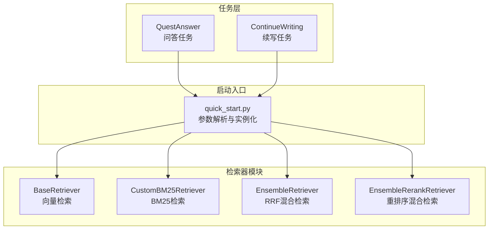
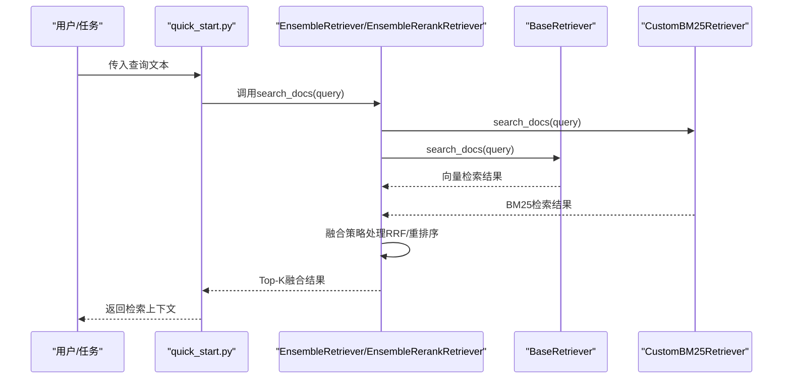
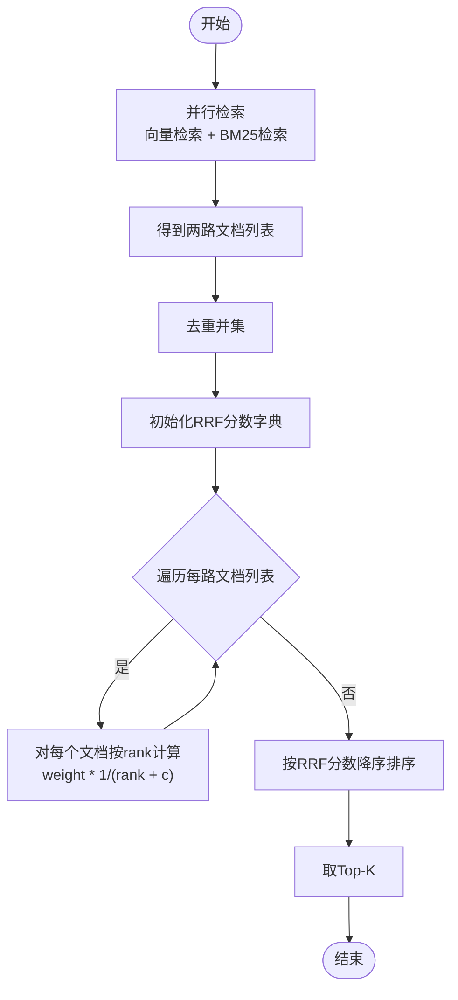
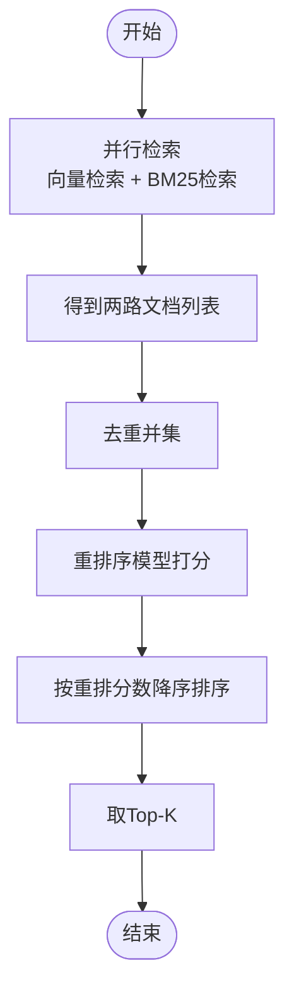
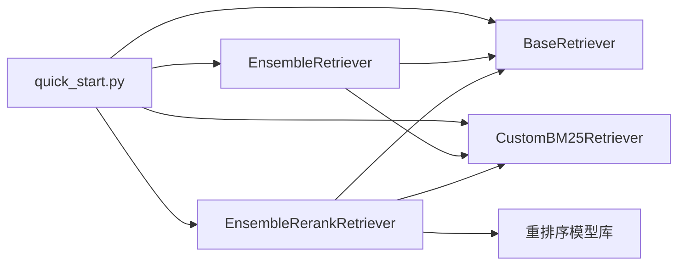

# 混合检索器

<cite>
**本文引用的文件**
- [src/retrievers/hybrid.py](file://src/retrievers/hybrid.py)
- [src/retrievers/bm25.py](file://src/retrievers/bm25.py)
- [src/retrievers/hybrid_rerank.py](file://src/retrievers/hybrid_rerank.py)
- [src/retrievers/base.py](file://src/retrievers/base.py)
- [src/retrievers/__init__.py](file://src/retrievers/__init__.py)
- [quick_start.py](file://quick_start.py)
- [README.md](file://README.md)
- [requirements.txt](file://requirements.txt)
- [src/tasks/quest_answer.py](file://src/tasks/quest_answer.py)
- [src/tasks/continue_writing.py](file://src/tasks/continue_writing.py)
</cite>

## 目录
1. [简介](#简介)
2. [项目结构](#项目结构)
3. [核心组件](#核心组件)
4. [架构总览](#架构总览)
5. [详细组件分析](#详细组件分析)
6. [依赖关系分析](#依赖关系分析)
7. [性能考量](#性能考量)
8. [故障排查指南](#故障排查指南)
9. [结论](#结论)
10. [附录](#附录)

## 简介
本文件面向CRUD-RAG系统中的混合检索器，系统性阐述其设计理念与实现原理，重点解释如何将向量检索与BM25关键词检索进行有效融合，并给出不同融合策略（RRF排序融合、重排序重排）的对比与适用场景。文档还提供参数配置指南、性能调优建议以及在CRUD-RAG任务中的应用示例与评估方法，帮助读者选择最适合的融合策略并获得稳定可复现的效果。

## 项目结构
CRUD-RAG的检索子系统位于src/retrievers目录，包含基础向量检索、BM25检索、基于RRF的混合检索以及基于重排序模型的混合检索等模块；通过quick_start.py统一入口，支持按命令行参数切换不同的检索器类型。

图表来源
- [src/retrievers/base.py](file://src/retrievers/base.py)
- [src/retrievers/bm25.py](file://src/retrievers/bm25.py)
- [src/retrievers/hybrid.py](file://src/retrievers/hybrid.py)
- [src/retrievers/hybrid_rerank.py](file://src/retrievers/hybrid_rerank.py)
- [quick_start.py](file://quick_start.py)

章节来源
- [README.md](file://README.md)
- [quick_start.py](file://quick_start.py)

## 核心组件
- 基础向量检索器：基于Milvus向量库，支持索引构建、增量添加与查询引擎封装，返回分块级文本片段。
- BM25检索器：基于Elasticsearch的BM25匹配，返回关键词匹配的文档片段。
- RRF混合检索器：对两路检索结果进行排序融合，采用Reciprocal Rank Fusion公式进行打分聚合。
- 重排序混合检索器：先取两路检索结果的并集，再用重排序模型对候选集合进行重排，输出高质量排序结果。

章节来源
- [src/retrievers/base.py](file://src/retrievers/base.py)
- [src/retrievers/bm25.py](file://src/retrievers/bm25.py)
- [src/retrievers/hybrid.py](file://src/retrievers/hybrid.py)
- [src/retrievers/hybrid_rerank.py](file://src/retrievers/hybrid_rerank.py)

## 架构总览
混合检索器在CRUD-RAG中作为任务执行前的上下文获取阶段，为后续生成与评估提供高质量的检索上下文。整体流程如下：
- 输入查询文本
- 分别调用向量检索与BM25检索，得到两组候选文档列表
- 对候选列表进行融合策略处理（RRF或重排序）
- 返回Top-K融合后的文档字符串，供下游任务使用

图表来源
- [quick_start.py](file://quick_start.py)
- [src/retrievers/hybrid.py](file://src/retrievers/hybrid.py)
- [src/retrievers/hybrid_rerank.py](file://src/retrievers/hybrid_rerank.py)
- [src/retrievers/base.py](file://src/retrievers/base.py)
- [src/retrievers/bm25.py](file://src/retrievers/bm25.py)

## 详细组件分析

### 组件A：RRF混合检索器（EnsembleRetriever）
- 设计理念
  - 将向量检索与BM25检索视为两条独立的排序链路，分别输出候选文档序列
  - 使用Reciprocal Rank Fusion对两个序列中的每个文档计算聚合分数，避免单一策略偏差
- 关键参数
  - 权重weights：控制两路检索的相对贡献
  - 常数c：控制排名衰减速度，影响远位文档的权重
  - top_k：最终返回的融合结果数量
- 处理流程
  - 并行调用两路检索器，得到两组文档列表
  - 计算所有唯一文档的RRF聚合分数
  - 按分数降序排序，截取Top-K返回

图表来源
- [src/retrievers/hybrid.py](file://src/retrievers/hybrid.py)

章节来源
- [src/retrievers/hybrid.py](file://src/retrievers/hybrid.py)

### 组件B：重排序混合检索器（EnsembleRerankRetriever）
- 设计理念
  - 先以两路检索器扩大候选空间，再引入更强的语义重排序模型对候选集合进行全局重排
  - 适合对召回质量要求较高且预算允许额外推理开销的场景
- 关键参数
  - 权重weights、常数c：用于构造候选集合
  - top_k：重排序后返回的数量
  - 重排序模型：bge-rerank-base
- 处理流程
  - 并行检索两路结果，去重形成候选集合
  - 使用重排序模型对候选集合进行打分与排序
  - 截取Top-K返回

图表来源
- [src/retrievers/hybrid_rerank.py](file://src/retrievers/hybrid_rerank.py)

章节来源
- [src/retrievers/hybrid_rerank.py](file://src/retrievers/hybrid_rerank.py)

### 组件C：基础向量检索器（BaseRetriever）
- 功能概述
  - 支持首次构建索引、从Milvus加载已有索引、增量添加索引
  - 查询时通过向量检索器与查询引擎返回分块级文本
- 关键点
  - 分块大小与重叠参数影响召回粒度与上下文连贯性
  - 集成Langchain嵌入模型，适配多种预训练模型

章节来源
- [src/retrievers/base.py](file://src/retrievers/base.py)

### 组件D：BM25检索器（CustomBM25Retriever）
- 功能概述
  - 基于Elasticsearch的match查询，返回关键词匹配的文档片段
  - 支持按需构建索引与连接ES服务
- 关键点
  - similarity_top_k决定BM25检索的召回规模
  - 与向量检索互补，提升关键词相关性

章节来源
- [src/retrievers/bm25.py](file://src/retrievers/bm25.py)

### 组件E：检索器导出与统一入口（quick_start.py）
- 功能概述
  - 通过命令行参数选择检索器类型（base/bm25/hybrid/hybrid-rerank）
  - 实例化对应检索器并注入到任务执行器中
- 关键点
  - retriever_name参数控制检索器类型
  - retrieve_top_k控制检索Top-K规模

章节来源
- [quick_start.py](file://quick_start.py)

## 依赖关系分析
- 模块导入关系
  - quick_start.py统一导入各类检索器并实例化
  - 混合检索器内部依赖基础向量检索器与BM25检索器
  - 重排序混合检索器依赖重排序模型库
- 外部依赖
  - 向量检索依赖Milvus与LlamaIndex
  - BM25检索依赖Elasticsearch
  - 重排序依赖FlagEmbedding与bge-rerank模型

图表来源
- [quick_start.py](file://quick_start.py)
- [src/retrievers/hybrid.py](file://src/retrievers/hybrid.py)
- [src/retrievers/hybrid_rerank.py](file://src/retrievers/hybrid_rerank.py)
- [src/retrievers/base.py](file://src/retrievers/base.py)
- [src/retrievers/bm25.py](file://src/retrievers/bm25.py)

章节来源
- [quick_start.py](file://quick_start.py)
- [requirements.txt](file://requirements.txt)

## 性能考量
- 召回规模与Top-K
  - similarity_top_k与retrieve_top_k共同决定候选规模，直接影响后续融合成本
  - 建议先增大similarity_top_k以保证召回完整性，再通过融合策略筛选高质量结果
- 融合策略选择
  - RRF混合：计算开销低，适合大规模召回与实时性要求高的场景
  - 重排序混合：质量更高但计算成本显著增加，适合对准确性敏感的任务
- 参数调优建议
  - weights：初始可设为[0.5, 0.5]，根据任务效果微调；偏向BM25可提高关键词相关性，偏向向量可增强语义相关性
  - c：较小值更关注前排，较大值更平滑地融合远位文档；可结合任务长度与复杂度调整
  - top_k：结合下游生成长度与评估指标综合确定
- 索引与数据准备
  - 首次运行需构建向量索引（Milvus），耗时较长；后续复用索引可显著降低延迟
  - 文档分块大小与重叠需平衡召回粒度与上下文连贯性

[本节为通用性能指导，不直接分析特定文件]

## 故障排查指南
- Elasticsearch连接失败
  - 检查es_host、es_port、es_scheme是否正确
  - 确认ES服务已启动且网络可达
- Milvus索引异常
  - 首次构建索引时注意分批处理，避免内存压力过大
  - 确认集合名与维度一致
- 重排序模型不可用
  - 确认已安装重排序模型依赖并可正常加载
- 检索结果为空
  - 提高similarity_top_k或调整查询关键词
  - 检查文档路径与类型是否正确

章节来源
- [src/retrievers/bm25.py](file://src/retrievers/bm25.py)
- [src/retrievers/base.py](file://src/retrievers/base.py)
- [src/retrievers/hybrid_rerank.py](file://src/retrievers/hybrid_rerank.py)

## 结论
CRUD-RAG的混合检索器提供了两种成熟融合策略：基于RRF的排序融合与基于重排序模型的重排融合。前者轻量高效，后者质量优先。通过合理配置权重、常数与Top-K，结合任务特性与资源约束，可在召回完整性与排序质量之间取得最佳平衡。建议在实际部署中以RRF为默认方案，针对关键任务再评估重排序混合方案。

[本节为总结性内容，不直接分析特定文件]

## 附录

### A. 混合检索参数配置指南
- 基础参数
  - docs_path：检索数据库路径
  - docs_type：文档类型（如txt）
  - chunk_size/chunk_overlap：分块大小与重叠
  - collection_name：向量集合名称
  - similarity_top_k：向量/BM25各自Top-K
  - retrieve_top_k：最终返回Top-K
- 混合参数
  - weights：两路检索权重（RRF）
  - c：RRF常数（控制排名衰减）
  - retriever_name：选择检索器类型（base/bm25/hybrid/hybrid-rerank）

章节来源
- [quick_start.py](file://quick_start.py)
- [src/retrievers/hybrid.py](file://src/retrievers/hybrid.py)
- [src/retrievers/hybrid_rerank.py](file://src/retrievers/hybrid_rerank.py)

### B. 在CRUD-RAG中的应用场景与使用示例
- 问答任务（QuestAnswer）
  - 从查询中提取问题，调用检索器获取上下文，拼接到提示模板中进行回答生成
- 续写任务（ContinueWriting）
  - 从起始文本提取查询，调用检索器获取上下文，拼接到续写提示中进行生成

章节来源
- [src/tasks/quest_answer.py](file://src/tasks/quest_answer.py)
- [src/tasks/continue_writing.py](file://src/tasks/continue_writing.py)
- [quick_start.py](file://quick_start.py)

### C. 不同融合策略的效果差异与选择建议
- 加权求和（RRF）
  - 优点：计算简单、延迟低、可扩展性强
  - 缺点：对远位文档的融合较平滑，可能损失局部排序优势
  - 适用：大规模召回、实时性要求高
- 排序融合（RRF）
  - 优点：保留两路排序信息，融合更灵活
  - 缺点：需要维护两路排序，实现稍复杂
  - 适用：召回质量与排序质量并重
- 重排序（重排融合）
  - 优点：全局最优排序，质量高
  - 缺点：计算成本高、延迟大
  - 适用：对准确性要求极高的评测或生产环境

[本节为概念性对比，不直接分析特定文件]