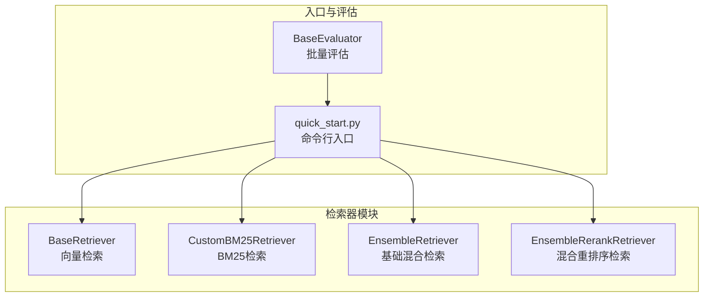
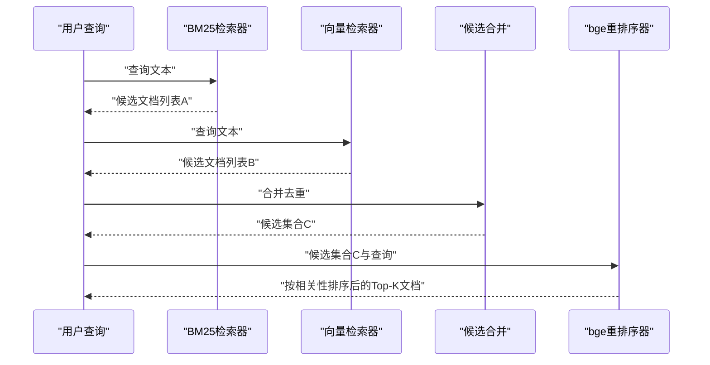
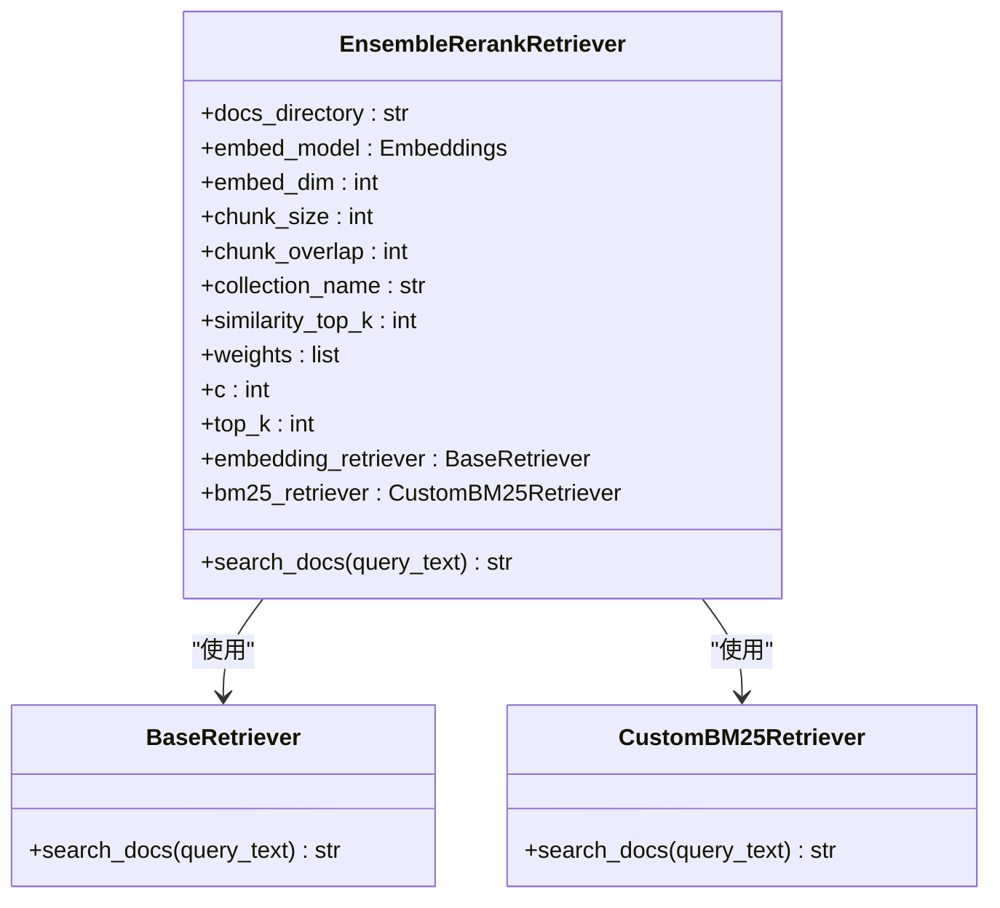
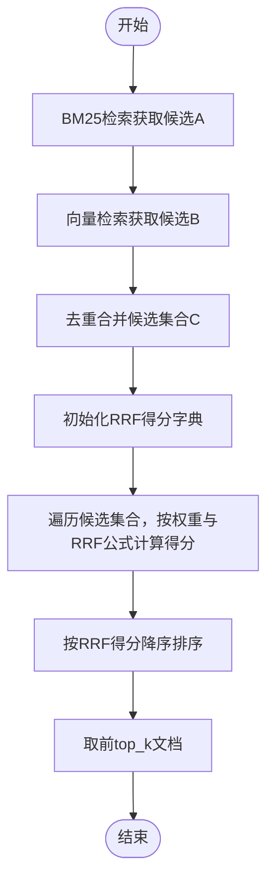
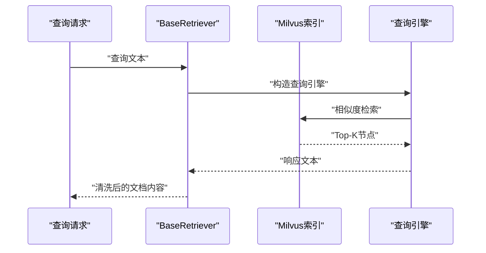
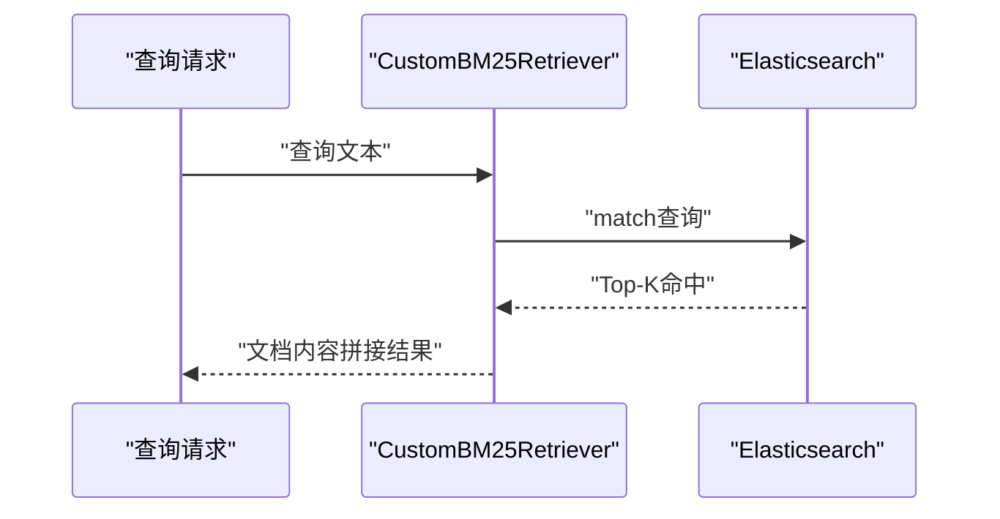
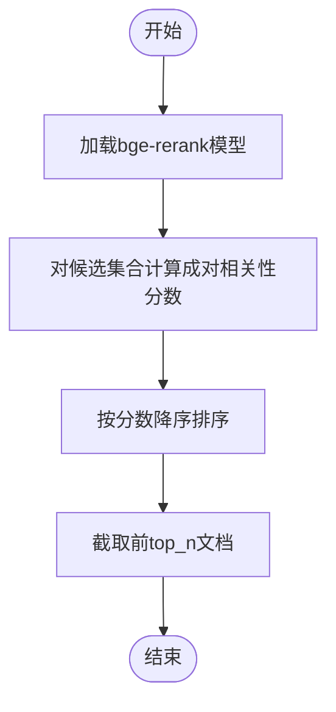
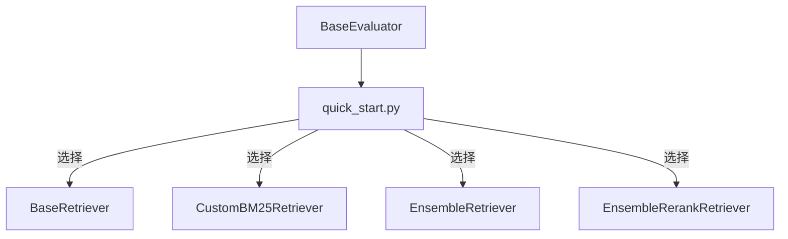

# 混合重排序检索器

<cite>
**本文引用的文件**
- [hybrid_rerank.py](file://src/retrievers/hybrid_rerank.py)
- [hybrid.py](file://src/retrievers/hybrid.py)
- [base.py](file://src/retrievers/base.py)
- [bm25.py](file://src/retrievers/bm25.py)
- [__init__.py](file://src/retrievers/__init__.py)
- [quick_start.py](file://quick_start.py)
- [evaluator.py](file://evaluator.py)
- [README.md](file://README.md)
- [config.py](file://src/configs/config.py)
</cite>

## 目录
1. [简介](#简介)
2. [项目结构](#项目结构)
3. [核心组件](#核心组件)
4. [架构总览](#架构总览)
5. [详细组件分析](#详细组件分析)
6. [依赖关系分析](#依赖关系分析)
7. [性能考量](#性能考量)
8. [故障排查指南](#故障排查指南)
9. [结论](#结论)
10. [附录](#附录)

## 简介
本文件面向CRUD-RAG中的“混合重排序检索器”，系统性阐述其设计目标、工作原理与实现架构。重排序（rerank）机制旨在在初步检索结果的基础上进行二次优化，通过更精细的相关性评分与语义匹配，提升最终返回文档的质量与多样性，从而改善下游生成任务的性能表现。本文将从以下维度展开：
- 设计目的与工作原理：解释为何需要重排序，以及如何在BM25与向量检索的候选集合上进行二次筛选与排序。
- 实现架构：分阶段解析初始检索、候选文档筛选与最终排序三部分。
- 算法选择与配置：重点说明重排序算法（基于bge-rerank模型）的评分与排序策略，以及可调参数（如top_k、c常数等）。
- 参数调优指南：给出阈值、权重与排序策略的实践建议。
- 效果与场景：结合与基础混合检索器的对比，帮助用户理解何时启用重排序以获得最佳检索效果。

## 项目结构
CRUD-RAG的检索模块位于src/retrievers目录下，包含基础向量检索、BM25检索、基础混合检索与混合重排序检索四个实现。quick_start.py提供了统一入口，支持通过命令行参数切换不同检索器类型。

图表来源
- [quick_start.py:61-89](file://quick_start.py#L61-L89)
- [__init__.py:1-4](file://src/retrievers/__init__.py#L1-L4)

章节来源
- [quick_start.py:61-89](file://quick_start.py#L61-L89)
- [README.md:27-68](file://README.md#L27-L68)

## 核心组件
- 基础向量检索器（BaseRetriever）：基于LangChain嵌入模型与Milvus向量数据库，支持索引构建、增量添加与相似度检索。
- BM25检索器（CustomBM25Retriever）：基于Elasticsearch的BM25检索，适合关键词匹配与短文本召回。
- 基础混合检索器（EnsembleRetriever）：融合BM25与向量检索结果，采用Reciprocal Rank Fusion（RRF）策略进行融合与排序。
- 混合重排序检索器（EnsembleRerankRetriever）：在基础混合检索结果上，使用bge-rerank模型进行细粒度重排序，进一步提升相关性与质量。

章节来源
- [base.py:16-142](file://src/retrievers/base.py#L16-L142)
- [bm25.py:14-92](file://src/retrievers/bm25.py#L14-L92)
- [hybrid.py:13-81](file://src/retrievers/hybrid.py#L13-L81)
- [hybrid_rerank.py:26-81](file://src/retrievers/hybrid_rerank.py#L26-L81)

## 架构总览
混合重排序检索器的整体流程如下：
1. 初始检索：分别调用BM25检索器与向量检索器，得到两组候选文档列表。
2. 候选筛选：对两组候选进行去重合并，形成统一的候选集合。
3. 重排序：使用bge-rerank模型对候选集合进行细粒度相关性打分，并按分数降序返回前top_k个文档。

图表来源
- [hybrid_rerank.py:63-80](file://src/retrievers/hybrid_rerank.py#L63-L80)
- [bm25.py:70-90](file://src/retrievers/bm25.py#L70-L90)
- [base.py:133-140](file://src/retrievers/base.py#L133-L140)

## 详细组件分析

### 组件A：混合重排序检索器（EnsembleRerankRetriever）
- 设计目标：在基础混合检索（RRF）的基础上，引入细粒度相关性重排序，提升最终文档质量。
- 关键实现要点：
  - 同时调用BM25与向量检索器，分别获取候选文档列表。
  - 对两个列表进行去重合并，避免重复文档影响后续重排序。
  - 使用bge-rerank模型对候选集合进行成对相关性打分，按分数降序排序，返回前top_k文档。
- 可配置参数：
  - similarity_top_k：控制每种检索器返回的候选数量，进而影响重排序输入规模。
  - top_k：最终输出的文档数量。
  - weights/c：在基础混合检索中用于RRF的权重与常数，虽然在重排序模式下不直接参与RRF计算，但作为类成员保留便于统一管理。

图表来源
- [hybrid_rerank.py:26-81](file://src/retrievers/hybrid_rerank.py#L26-L81)
- [base.py:16-142](file://src/retrievers/base.py#L16-L142)
- [bm25.py:14-92](file://src/retrievers/bm25.py#L14-L92)

章节来源
- [hybrid_rerank.py:26-81](file://src/retrievers/hybrid_rerank.py#L26-L81)

### 组件B：基础混合检索器（EnsembleRetriever）
- 设计目标：融合BM25与向量检索结果，采用RRF策略进行融合排序，无需额外重排序步骤。
- 关键实现要点：
  - 分别调用BM25与向量检索器，得到两组候选列表。
  - 对两组列表进行去重合并，形成统一候选集合。
  - 使用RRF公式对每个候选计算综合得分，按得分降序排序，返回前top_k文档。
- 参数与策略：
  - weights：BM25与向量检索器的融合权重。
  - c：RRF公式中的常数，控制排名衰减速度。
  - top_k：最终输出的文档数量。

图表来源
- [hybrid.py:50-81](file://src/retrievers/hybrid.py#L50-L81)

章节来源
- [hybrid.py:13-81](file://src/retrievers/hybrid.py#L13-L81)

### 组件C：基础向量检索器（BaseRetriever）
- 功能概述：负责文档索引构建、加载与相似度检索，支持增量添加与分块索引。
- 关键实现要点：
  - 支持首次构建索引或从Milvus加载已有索引。
  - 将查询文本通过向量检索引擎返回Top-K文档。
  - 输出格式处理，去除无关字段，仅保留文档内容。

图表来源
- [base.py:133-140](file://src/retrievers/base.py#L133-L140)

章节来源
- [base.py:16-142](file://src/retrievers/base.py#L16-L142)

### 组件D：BM25检索器（CustomBM25Retriever）
- 功能概述：基于Elasticsearch的BM25检索，适合关键词匹配与短文本召回。
- 关键实现要点：
  - 支持首次构建索引或直接连接现有索引。
  - 执行match查询，返回Top-K文档。
  - 返回字符串拼接的结果，供后续合并与重排序使用。

图表来源
- [bm25.py:70-90](file://src/retrievers/bm25.py#L70-L90)

章节来源
- [bm25.py:14-92](file://src/retrievers/bm25.py#L14-L92)

### 组件E：重排序函数（bge_rerank_result）
- 功能概述：对候选文档集合进行细粒度相关性重排序，使用bge-rerank模型计算查询-文档成对相关性分数。
- 关键实现要点：
  - 创建重排序器实例，加载预训练模型。
  - 计算所有候选与查询的成对分数。
  - 按分数降序排序，返回前top_n文档。

图表来源
- [hybrid_rerank.py:15-24](file://src/retrievers/hybrid_rerank.py#L15-L24)

章节来源
- [hybrid_rerank.py:15-24](file://src/retrievers/hybrid_rerank.py#L15-L24)

## 依赖关系分析
- 入口与切换：quick_start.py根据命令行参数选择不同的检索器实现，包括基础向量、BM25、基础混合与混合重排序。
- 检索器导出：__init__.py统一导出各检索器类，便于外部按名称导入。
- 评估流程：BaseEvaluator负责批量执行任务，调用具体检索器的search_docs方法获取上下文，再进行下游生成与评分。

图表来源
- [quick_start.py:61-89](file://quick_start.py#L61-L89)
- [__init__.py:1-4](file://src/retrievers/__init__.py#L1-L4)

章节来源
- [quick_start.py:61-89](file://quick_start.py#L61-L89)
- [evaluator.py:13-41](file://evaluator.py#L13-L41)

## 性能考量
- 计算开销：
  - 重排序阶段对候选集合进行成对相关性打分，时间复杂度近似O(N)，其中N为候选数量。当候选规模较大时，重排序会成为瓶颈。
- 存储与索引：
  - 向量检索采用Milvus分块索引，避免单次插入过大导致内存压力；BM25检索依赖Elasticsearch索引，需确保索引构建完成后再进行查询。
- 并发与吞吐：
  - 评估器支持多线程并发处理数据点，可在检索器内部与外部同时利用并发能力提升整体吞吐。
- 资源消耗：
  - bge-rerank模型需要GPU/CPU资源进行推理，建议在具备足够显存或CPU性能的环境中运行，以减少重排序延迟。

## 故障排查指南
- 重排序模型加载失败：
  - 现象：重排序阶段报错或无法加载bge-rerank模型。
  - 排查：确认本地已下载并放置到指定路径，参考快速开始文档中的模型准备说明。
- Elasticsearch连接异常：
  - 现象：BM25检索器初始化时报连接错误。
  - 排查：检查es_host、es_port、es_scheme配置是否正确，确保Elasticsearch服务正常运行。
- Milvus索引未构建：
  - 现象：向量检索器首次运行耗时过长或查询为空。
  - 排查：首次运行时需添加构建索引参数，完成后可移除该参数以加速后续查询。
- 重排序结果为空：
  - 现象：重排序后返回空结果。
  - 排查：检查候选合并逻辑是否正确，确认similarity_top_k与top_k参数设置合理，避免候选过少导致重排序输入不足。

章节来源
- [README.md:81-84](file://README.md#L81-L84)
- [bm25.py:38-42](file://src/retrievers/bm25.py#L38-L42)
- [base.py:37-44](file://src/retrievers/base.py#L37-L44)

## 结论
混合重排序检索器在基础混合检索之上引入了细粒度相关性重排序，能够有效提升最终文档质量与多样性，尤其适用于对检索质量要求较高的问答与摘要任务。通过合理配置similarity_top_k、top_k与重排序模型，可以在准确性与效率之间取得平衡。与基础混合检索相比，重排序检索器在下游任务指标上通常具有优势，但会带来额外的计算成本，因此应根据实际资源与性能需求进行权衡。

## 附录

### 参数调优指南
- similarity_top_k：
  - 建议值：根据候选规模与重排序耗时进行折中，一般在4~16之间尝试。
  - 影响：增大可提升重排序输入的覆盖度，但会增加重排序计算时间。
- top_k：
  - 建议值：根据下游任务长度与生成上限设定，常见范围为4~12。
  - 影响：直接影响最终上下文大小与生成开销。
- weights/c（基础混合检索器）：
  - 建议值：weights在0.4~0.6之间尝试，c在40~80之间调整。
  - 影响：weights决定BM25与向量检索的融合比例，c控制排名衰减速度。
- 重排序模型：
  - 建议：优先使用bge-rerank-base，确保模型文件路径正确；若资源紧张，可考虑更轻量的模型或降低候选规模。

### 应用场景
- 需要高精度问答与事实性较强的摘要任务。
- 对检索多样性有要求，希望在BM25与向量检索之间取得平衡。
- 下游生成模型对上下文质量敏感，需要更高质量的检索结果。

### 与基础混合检索器的对比
- 相同点：均采用BM25与向量检索的候选合并策略。
- 差异点：
  - 基础混合检索器使用RRF进行融合排序，无需额外重排序。
  - 混合重排序检索器在候选合并后引入bge-rerank模型进行细粒度重排序，通常能获得更高的相关性与质量。
- 选择建议：
  - 若追求极致性能且对质量要求适中，可优先选择基础混合检索器。
  - 若对检索质量要求较高，且可接受额外计算开销，推荐使用混合重排序检索器。