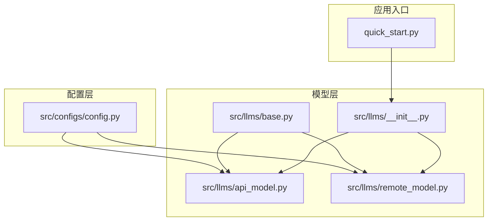
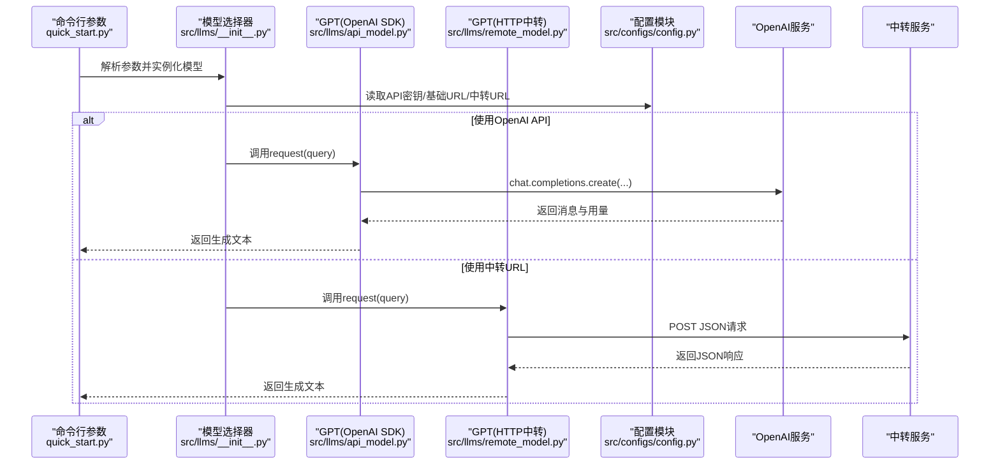
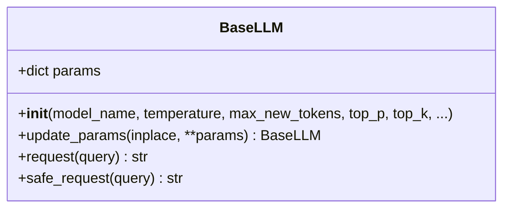
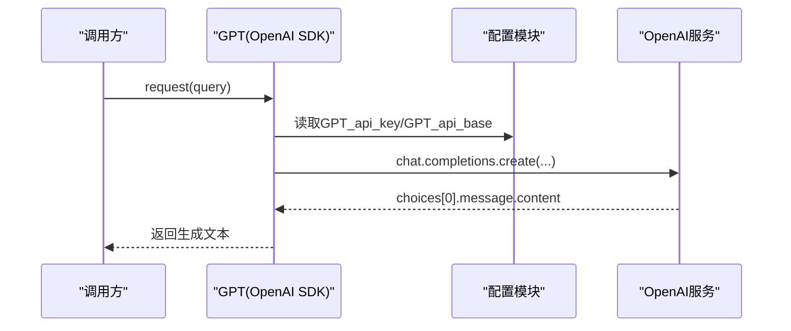
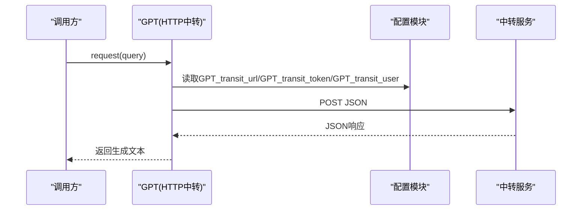
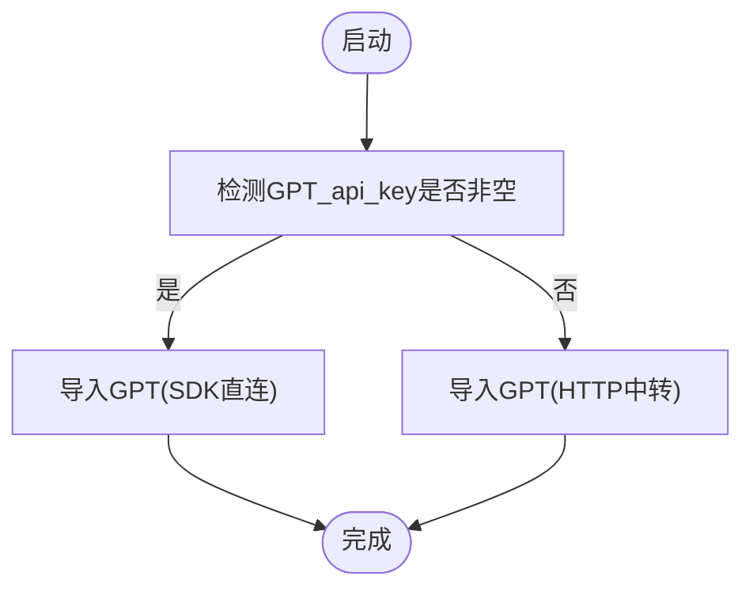
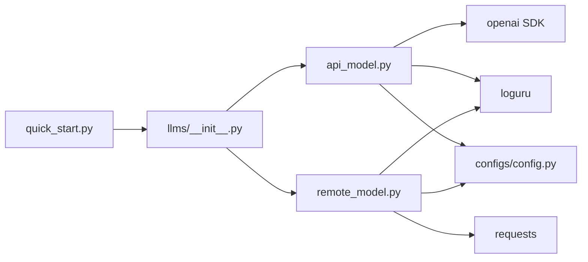

# API模型集成

<cite>
**本文引用的文件**
- [src/llms/api_model.py](file://src/llms/api_model.py)
- [src/llms/remote_model.py](file://src/llms/remote_model.py)
- [src/llms/base.py](file://src/llms/base.py)
- [src/llms/__init__.py](file://src/llms/__init__.py)
- [src/configs/config.py](file://src/configs/config.py)
- [quick_start.py](file://quick_start.py)
- [README.md](file://README.md)
- [evaluator.py](file://evaluator.py)
</cite>

## 目录
1. [简介](#简介)
2. [项目结构](#项目结构)
3. [核心组件](#核心组件)
4. [架构总览](#架构总览)
5. [详细组件分析](#详细组件分析)
6. [依赖分析](#依赖分析)
7. [性能考虑](#性能考虑)
8. [故障排查指南](#故障排查指南)
9. [结论](#结论)
10. [附录](#附录)

## 简介
本文件面向“CRUD-RAG”的API模型集成，聚焦于GPT系列模型的两种调用路径：直接通过官方OpenAI SDK与OpenAI API交互，以及通过“中转URL”（第三方代理）进行HTTP请求。文档将从系统架构、组件关系、数据流与处理逻辑入手，逐步解释参数配置、认证方式、错误处理与重试策略、并发与性能优化、以及常见问题排查方法。

## 项目结构
围绕API模型集成的关键目录与文件如下：
- 配置层：提供API密钥、基础URL、中转URL及鉴权信息
- 模型层：抽象基类定义统一接口，具体实现分别对接OpenAI SDK与HTTP中转
- 启动入口：命令行参数解析与模型选择
- 评测框架：多线程批处理与结果缓存

图表来源
- [src/llms/api_model.py:1-33](file://src/llms/api_model.py#L1-L33)
- [src/llms/remote_model.py:1-111](file://src/llms/remote_model.py#L1-L111)
- [src/llms/base.py:1-47](file://src/llms/base.py#L1-L47)
- [src/llms/__init__.py:1-13](file://src/llms/__init__.py#L1-L13)
- [src/configs/config.py:1-14](file://src/configs/config.py#L1-L14)
- [quick_start.py:1-110](file://quick_start.py#L1-L110)

章节来源
- [README.md:27-68](file://README.md#L27-L68)
- [quick_start.py:54-57](file://quick_start.py#L54-L57)

## 核心组件
- 抽象基类 BaseLLM：定义统一的参数字典与请求接口，提供安全请求包装
- GPT（OpenAI SDK直连）：使用openai.chat.completions.create发起请求
- GPT（HTTP中转）：通过requests.post向中转URL发送JSON请求
- 配置模块：集中存放API密钥、基础URL、中转URL与鉴权信息
- 模型导出选择器：根据配置自动选择SDK直连或HTTP中转实现

章节来源
- [src/llms/base.py:6-47](file://src/llms/base.py#L6-L47)
- [src/llms/api_model.py:12-33](file://src/llms/api_model.py#L12-L33)
- [src/llms/remote_model.py:83-111](file://src/llms/remote_model.py#L83-L111)
- [src/configs/config.py:1-14](file://src/configs/config.py#L1-L14)
- [src/llms/__init__.py:7-10](file://src/llms/__init__.py#L7-L10)

## 架构总览
下图展示了从命令行到模型请求、再到响应返回的整体流程，以及两种GPT实现路径的差异。

图表来源
- [quick_start.py:54-57](file://quick_start.py#L54-L57)
- [src/llms/__init__.py:7-10](file://src/llms/__init__.py#L7-L10)
- [src/llms/api_model.py:17-32](file://src/llms/api_model.py#L17-L32)
- [src/llms/remote_model.py:88-110](file://src/llms/remote_model.py#L88-L110)
- [src/configs/config.py:1-14](file://src/configs/config.py#L1-L14)

## 详细组件分析

### 抽象基类 BaseLLM
- 参数字典：包含模型名、温度、最大新token数、top-p、top-k等
- 安全请求：提供safe_request封装，捕获异常并返回空字符串，避免任务中断
- 参数更新：支持原地或复制更新参数，便于动态调整推理策略

图表来源
- [src/llms/base.py:6-47](file://src/llms/base.py#L6-L47)

章节来源
- [src/llms/base.py:6-47](file://src/llms/base.py#L6-L47)

### GPT（OpenAI SDK直连）
- 认证与基础URL：从配置模块读取API密钥与可选的基础URL
- 请求参数：模型名、消息列表、温度、最大新token、top_p
- 响应处理：提取第一条回复内容与总token用量
- 日志记录：可选输出token消耗统计

图表来源
- [src/llms/api_model.py:17-32](file://src/llms/api_model.py#L17-L32)
- [src/configs/config.py:1-14](file://src/configs/config.py#L1-L14)

章节来源
- [src/llms/api_model.py:12-33](file://src/llms/api_model.py#L12-L33)

### GPT（HTTP中转）
- 中转URL与鉴权：从配置模块读取中转URL、token与User-Agent
- 请求参数：模型名、消息列表、温度、最大新token、top_p
- 响应处理：解析JSON，提取message.content与usage.total_tokens
- 日志记录：可选输出token消耗统计

图表来源
- [src/llms/remote_model.py:88-110](file://src/llms/remote_model.py#L88-L110)
- [src/configs/config.py:5-9](file://src/configs/config.py#L5-L9)

章节来源
- [src/llms/remote_model.py:83-111](file://src/llms/remote_model.py#L83-L111)

### 模型导出选择器
- 自动选择：若配置中存在OpenAI API密钥，则优先使用SDK直连实现；否则使用HTTP中转实现
- 一致性：无论哪种实现，均继承自BaseLLM，保证接口一致

图表来源
- [src/llms/__init__.py:7-10](file://src/llms/__init__.py#L7-L10)

章节来源
- [src/llms/__init__.py:1-13](file://src/llms/__init__.py#L1-L13)

### 配置与参数
- 配置项
  - GPT_api_key：OpenAI API密钥
  - GPT_api_base：OpenAI基础URL（可选）
  - GPT_transit_url：中转服务地址
  - GPT_transit_token：中转服务鉴权token
  - GPT_transit_user：中转服务User-Agent
- 命令行参数
  - --model_name：模型名
  - --temperature：温度
  - --max_new_tokens：最大新token数

章节来源
- [src/configs/config.py:1-14](file://src/configs/config.py#L1-L14)
- [quick_start.py:17-19](file://quick_start.py#L17-L19)

## 依赖分析
- 组件耦合
  - GPT实现依赖配置模块以获取认证与URL
  - 模型导出选择器根据配置决定具体实现
  - 评测框架通过BaseLLM统一调度不同实现
- 外部依赖
  - OpenAI SDK：用于SDK直连路径
  - requests：用于HTTP中转路径
  - loguru：日志记录

图表来源
- [src/llms/api_model.py:1-2](file://src/llms/api_model.py#L1-L2)
- [src/llms/remote_model.py:1](file://src/llms/remote_model.py#L1)
- [src/llms/__init__.py:7-10](file://src/llms/__init__.py#L7-L10)
- [quick_start.py:54-57](file://quick_start.py#L54-L57)

章节来源
- [src/llms/api_model.py:1-33](file://src/llms/api_model.py#L1-L33)
- [src/llms/remote_model.py:1-111](file://src/llms/remote_model.py#L1-L111)
- [src/llms/__init__.py:1-13](file://src/llms/__init__.py#L1-L13)

## 性能考虑
- 并发与批处理
  - 评测框架支持多线程批处理，通过线程锁保护共享资源，提升吞吐
  - 可通过命令行参数调整线程数以适配硬件能力
- 参数调优
  - 温度与top_p影响生成多样性与稳定性，建议结合任务需求微调
  - 最大新token数需平衡上下文长度与生成长度
- 缓存与恢复
  - 评测框架支持断点续跑，避免重复计算

章节来源
- [quick_start.py:47](file://quick_start.py#L47)
- [evaluator.py:56-101](file://evaluator.py#L56-L101)

## 故障排查指南
- 常见问题与定位
  - 无法连接OpenAI：检查API密钥与基础URL配置是否正确
  - 中转URL失败：确认中转URL、token与User-Agent配置
  - 网络异常：观察日志中的异常信息，必要时增加重试
  - 速率限制：适当降低并发或等待配额恢复
- 错误处理与重试
  - 安全请求：统一捕获异常并返回空字符串，避免任务崩溃
  - 评测框架：对检索与评分过程进行异常捕获与跳过
- 建议
  - 在本地开发环境中先验证单次请求
  - 对高并发场景增加指数退避与超时设置（当前实现未内置）

章节来源
- [src/llms/base.py:38-45](file://src/llms/base.py#L38-L45)
- [evaluator.py:66-101](file://evaluator.py#L66-L101)

## 结论
本项目提供了两条稳定的GPT调用路径：OpenAI SDK直连与HTTP中转。通过统一的抽象基类与配置模块，实现了灵活的认证与参数管理。评测框架进一步提供了并发与断点续跑能力。建议在生产环境中结合速率限制与网络状况，合理配置参数与并发度，并完善重试与超时策略以提升鲁棒性。

## 附录
- 快速开始示例
  - 使用命令行参数指定模型名、温度与最大新token数
  - 启动评测流程，自动选择GPT实现并执行任务

章节来源
- [README.md:87-105](file://README.md#L87-L105)
- [quick_start.py:88-104](file://quick_start.py#L88-L104)