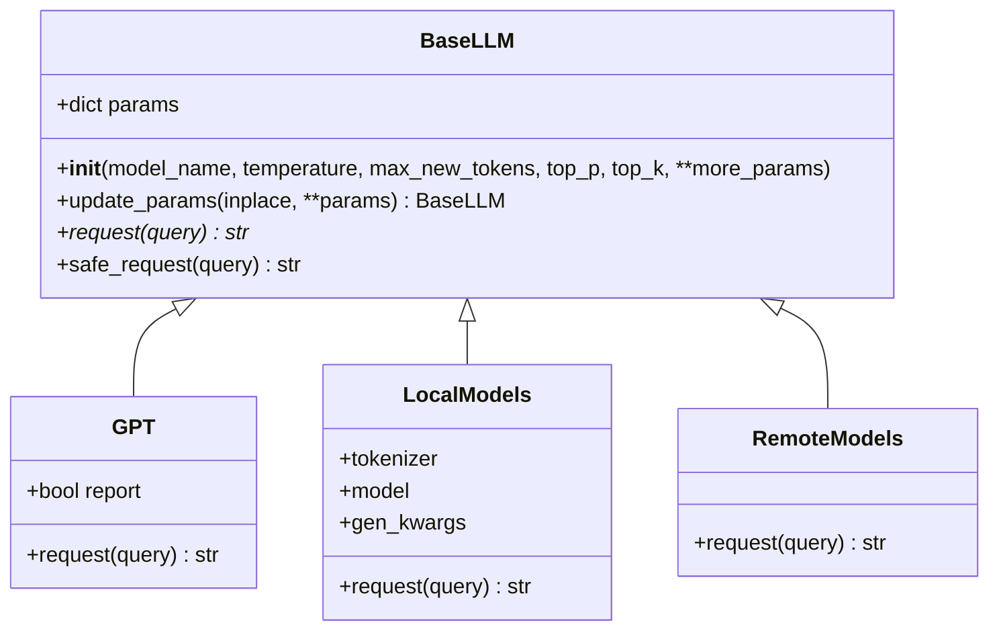
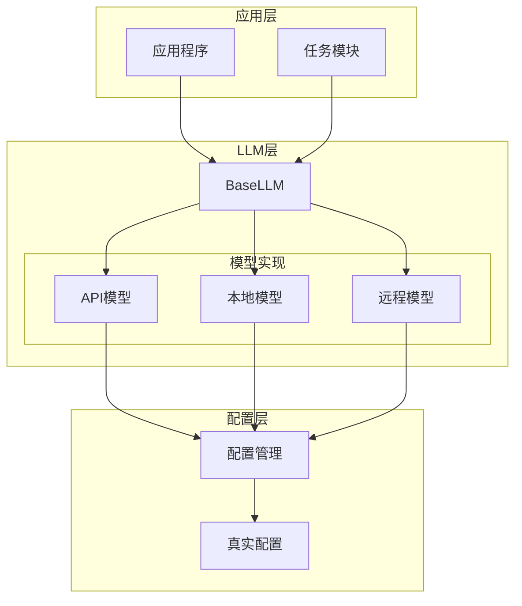
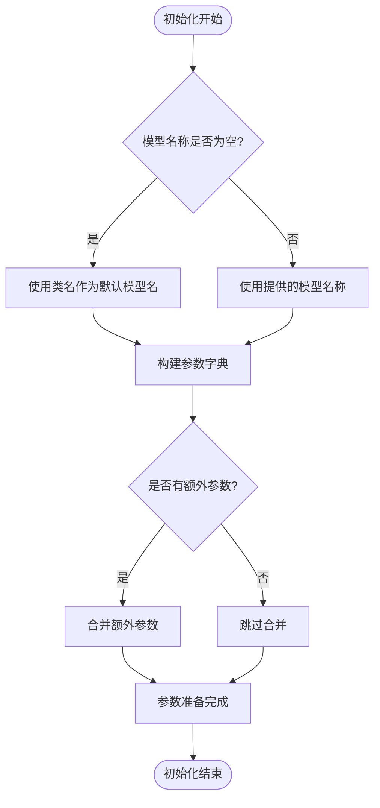
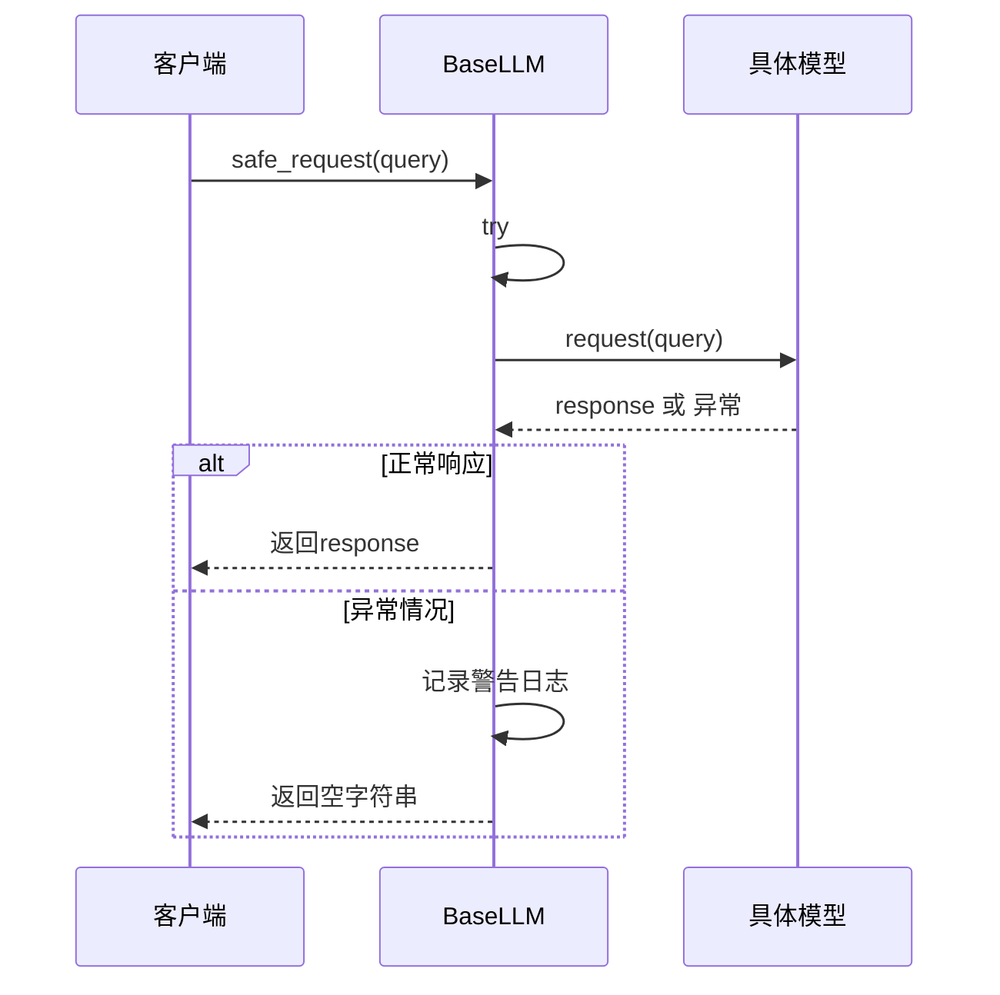
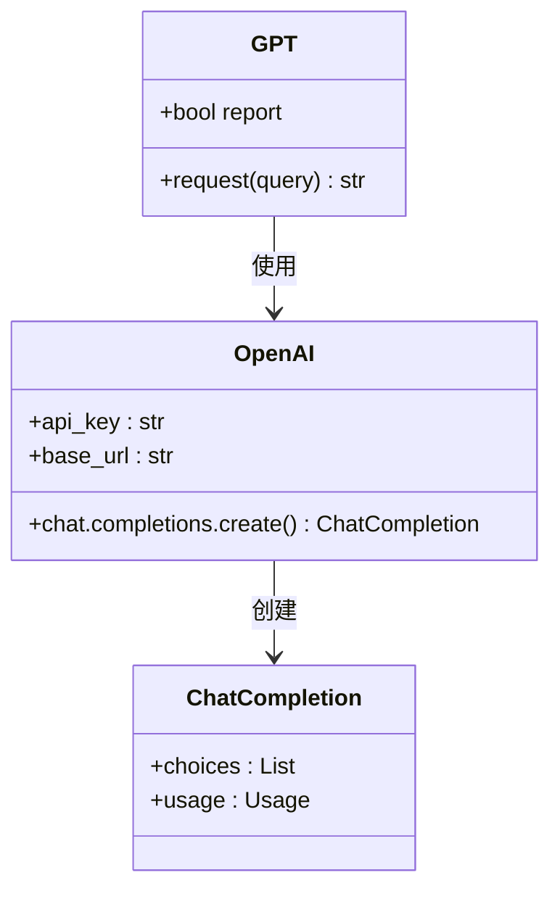
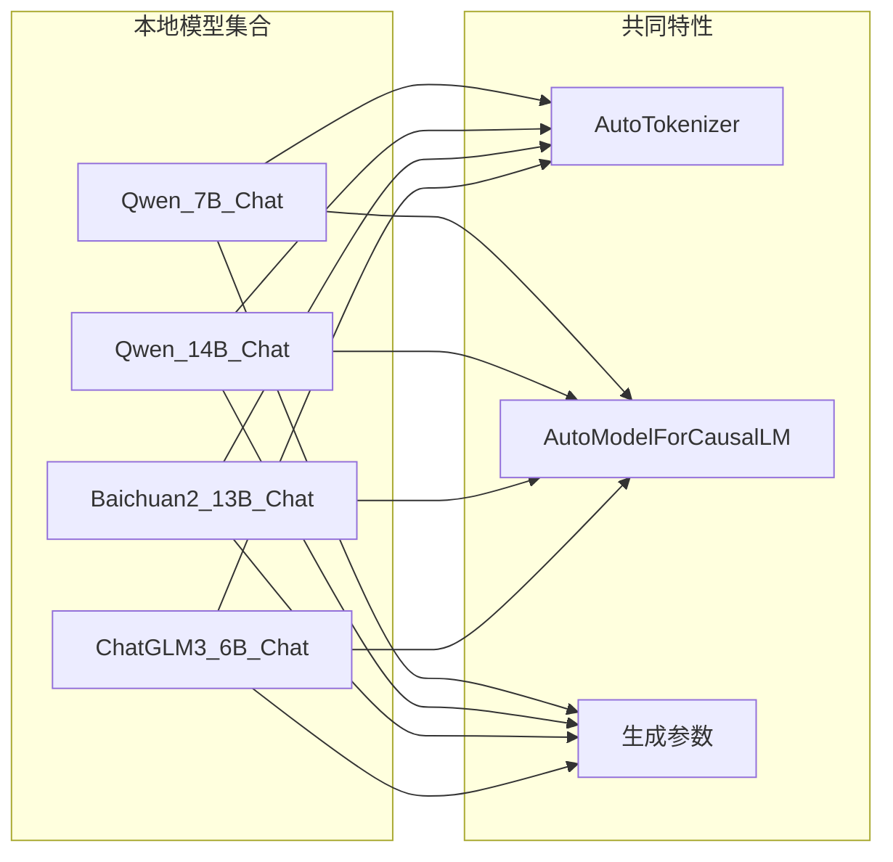
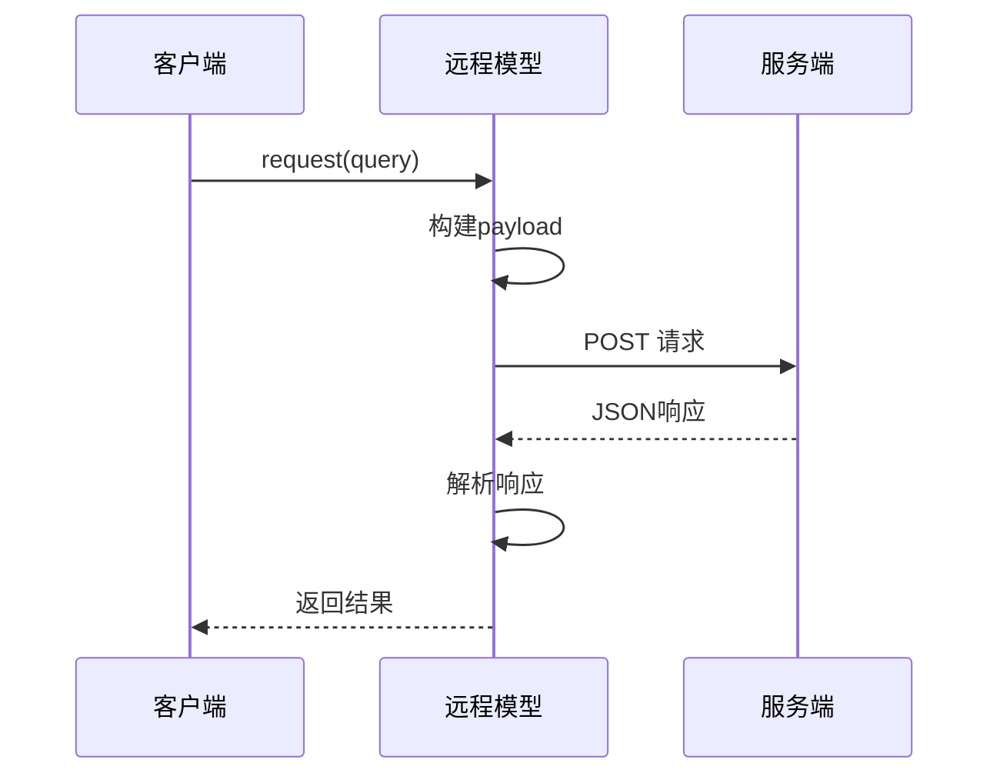
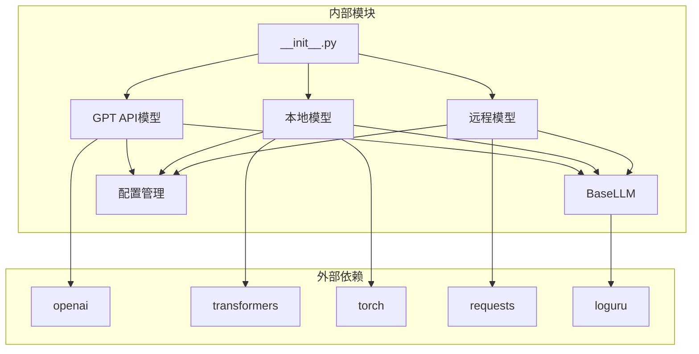
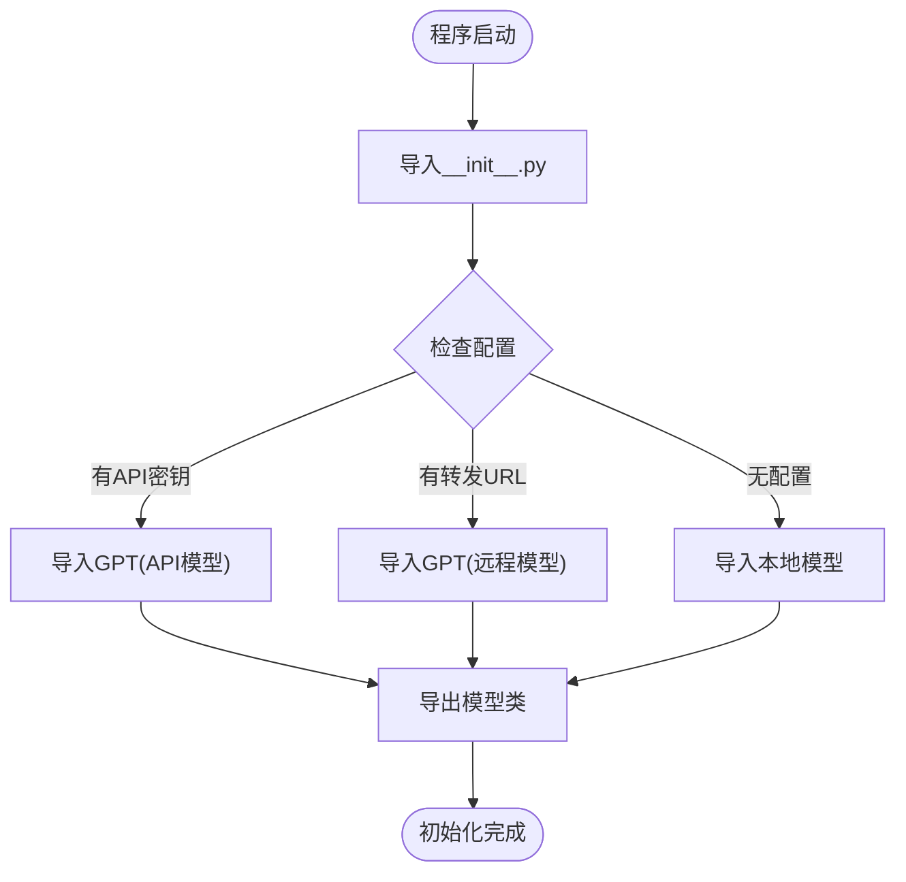

# LLM基类设计

<cite>
**本文档引用的文件**
- [src/llms/base.py](file://src/llms/base.py)
- [src/llms/api_model.py](file://src/llms/api_model.py)
- [src/llms/local_model.py](file://src/llms/local_model.py)
- [src/llms/remote_model.py](file://src/llms/remote_model.py)
- [src/llms/__init__.py](file://src/llms/__init__.py)
- [src/configs/config.py](file://src/configs/config.py)
- [quick_start.py](file://quick_start.py)
</cite>

## 目录
1. [简介](#简介)
2. [项目结构](#项目结构)
3. [核心组件](#核心组件)
4. [架构概览](#架构概览)
5. [详细组件分析](#详细组件分析)
6. [依赖关系分析](#依赖关系分析)
7. [性能考虑](#性能考虑)
8. [故障排除指南](#故障排除指南)
9. [结论](#结论)

## 简介

CRUD-RAG项目中的LLM基类设计采用抽象基类（ABC）模式，为不同类型的语言模型提供统一的接口规范和参数管理机制。该设计的核心目标是实现模型无关性，允许开发者通过继承BaseLLM类来轻松集成新的语言模型，同时保持一致的API接口和参数配置方式。

## 项目结构

LLM相关代码位于`src/llms/`目录下，采用模块化设计，每个模型类型都有独立的实现文件：

```mermaid
graph TB
subgraph "LLM模块结构"
Base[BaseLLM<br/>抽象基类]
subgraph "具体实现"
API[GPT(API模型)]
Local[本地模型集合]
Remote[远程模型集合]
end
subgraph "配置管理"
Config[配置文件]
Init[__init__.py<br/>模型导出]
end
end
Base --> API
Base --> Local
Base --> Remote
API --> Config
Local --> Config
Remote --> Config
Init --> API
Init --> Local
Init --> Remote
```

**图表来源**
- [src/llms/base.py:1-47](file://src/llms/base.py#L1-L47)
- [src/llms/api_model.py:1-33](file://src/llms/api_model.py#L1-L33)
- [src/llms/local_model.py:1-114](file://src/llms/local_model.py#L1-L114)
- [src/llms/remote_model.py:1-111](file://src/llms/remote_model.py#L1-L111)

**章节来源**
- [src/llms/base.py:1-47](file://src/llms/base.py#L1-L47)
- [src/llms/__init__.py:1-13](file://src/llms/__init__.py#L1-L13)

## 核心组件

### BaseLLM抽象基类

BaseLLM是整个LLM系统的核心抽象基类，定义了所有语言模型必须实现的标准接口和参数管理机制。

#### 参数管理系统

BaseLLM实现了灵活的参数配置机制，支持默认参数设置、动态参数更新和深拷贝操作：



**图表来源**
- [src/llms/base.py:6-46](file://src/llms/base.py#L6-L46)
- [src/llms/api_model.py:12-32](file://src/llms/api_model.py#L12-L32)
- [src/llms/local_model.py:11-113](file://src/llms/local_model.py#L11-L113)
- [src/llms/remote_model.py:14-110](file://src/llms/remote_model.py#L14-L110)

#### 统一接口规范

BaseLLM定义了标准化的接口规范，确保所有子类都遵循相同的设计模式：

- **构造函数参数**：统一的模型名称、温度控制、最大新令牌数、top-p采样参数和top-k采样参数
- **抽象方法**：`request(query)`必须由子类实现
- **安全包装**：`safe_request(query)`提供异常处理机制

**章节来源**
- [src/llms/base.py:6-46](file://src/llms/base.py#L6-L46)

## 架构概览

CRUD-RAG的LLM架构采用分层设计，从抽象基类到具体实现，再到配置管理和初始化模块：



**图表来源**
- [src/llms/base.py:6-46](file://src/llms/base.py#L6-L46)
- [src/llms/__init__.py:7-12](file://src/llms/__init__.py#L7-L12)
- [src/configs/config.py:1-14](file://src/configs/config.py#L1-L14)

## 详细组件分析

### BaseLLM类深度解析

#### 参数初始化机制

BaseLLM的参数初始化采用了字典聚合的方式，支持多种参数配置模式：



**图表来源**
- [src/llms/base.py:7-23](file://src/llms/base.py#L7-L23)

#### 参数更新策略

BaseLLM提供了两种参数更新策略，满足不同的使用场景：

1. **就地更新（inplace=True）**：直接修改当前对象的参数，返回self
2. **深拷贝更新（inplace=False）**：创建新对象并更新参数，返回新对象

这种设计允许在不破坏原有配置的情况下进行参数调整，特别适用于需要保持原始配置不变的场景。

#### 安全请求机制

`safe_request`方法提供了完整的异常处理机制：



**图表来源**
- [src/llms/base.py:38-45](file://src/llms/base.py#L38-L45)

**章节来源**
- [src/llms/base.py:25-45](file://src/llms/base.py#L25-L45)

### API模型实现

GPT类实现了基于OpenAI API的语言模型访问：

#### OpenAI API集成



**图表来源**
- [src/llms/api_model.py:12-32](file://src/llms/api_model.py#L12-L32)

#### 配置管理集成

API模型通过配置模块自动选择真实配置或默认配置，实现了灵活的部署适配：

**章节来源**
- [src/llms/api_model.py:12-32](file://src/llms/api_model.py#L12-L32)

### 本地模型实现

本地模型集合包含了多个主流开源模型的实现，每个模型都有特定的配置和优化：

#### 模型多样性



**图表来源**
- [src/llms/local_model.py:11-113](file://src/llms/local_model.py#L11-L113)

#### 设备优化

所有本地模型都采用了设备映射（device_map="auto"）技术，自动分配到可用的GPU设备上，提高了资源利用率。

**章节来源**
- [src/llms/local_model.py:11-113](file://src/llms/local_model.py#L11-L113)

### 远程模型实现

远程模型集合提供了通过HTTP接口访问大型语言模型的能力：

#### HTTP接口抽象



**图表来源**
- [src/llms/remote_model.py:14-80](file://src/llms/remote_model.py#L14-L80)

#### 跨平台兼容性

远程模型通过统一的JSON接口抽象，屏蔽了底层模型的具体差异，实现了跨平台的模型访问能力。

**章节来源**
- [src/llms/remote_model.py:14-110](file://src/llms/remote_model.py#L14-L110)

## 依赖关系分析

### 模块依赖图



**图表来源**
- [src/llms/api_model.py:1-4](file://src/llms/api_model.py#L1-L4)
- [src/llms/local_model.py:1-9](file://src/llms/local_model.py#L1-L9)
- [src/llms/remote_model.py:1-5](file://src/llms/remote_model.py#L1-L5)

### 初始化流程



**图表来源**
- [src/llms/__init__.py:7-12](file://src/llms/__init__.py#L7-L12)

**章节来源**
- [src/llms/__init__.py:1-13](file://src/llms/__init__.py#L1-L13)

## 性能考虑

### 参数调优指南

#### 温度参数（temperature）
- **作用**：控制输出的随机性和创造性
- **推荐范围**：0.1-1.0
- **使用建议**：
  - 0.1-0.3：高确定性，适合事实性回答
  - 0.3-0.7：平衡性，适合一般对话
  - 0.7-1.0：高创造性，适合创意写作

#### 最大新令牌数（max_new_tokens）
- **作用**：限制生成文本的最大长度
- **推荐范围**：512-2048
- **使用建议**：
  - 简短回答：512-1024
  - 中等长度：1024-1536
  - 长文本生成：1536-2048

#### Top-p参数（top_p）
- **作用**：核采样，控制概率质量
- **推荐范围**：0.8-0.95
- **使用建议**：
  - 0.8-0.9：平衡多样性与质量
  - 0.95以上：高多样性，可能降低质量

#### Top-k参数（top_k）
- **作用**：限制候选词汇数量
- **推荐范围**：5-50
- **使用建议**：
  - 5-15：严格采样，高质量但低多样性
  - 15-50：平衡采样，适合大多数场景

### 内存优化策略

1. **设备映射**：使用`device_map="auto"`自动分配GPU内存
2. **数据类型优化**：使用`torch.bfloat16`减少显存占用
3. **批量处理**：合理设置批处理大小避免内存溢出

## 故障排除指南

### 常见问题及解决方案

#### API密钥配置问题
- **症状**：OpenAI API调用失败
- **原因**：API密钥未正确配置
- **解决方案**：检查`GPT_api_key`配置项

#### 网络连接问题
- **症状**：远程模型请求超时
- **原因**：网络不稳定或代理设置错误
- **解决方案**：检查网络连接和代理配置

#### 显存不足问题
- **症状**：本地模型加载失败
- **原因**：GPU显存不足
- **解决方案**：降低模型尺寸或调整batch大小

#### 参数配置错误
- **症状**：模型输出异常
- **原因**：参数设置不当
- **解决方案**：参考参数调优指南调整参数

**章节来源**
- [src/llms/base.py:38-45](file://src/llms/base.py#L38-L45)

## 结论

CRUD-RAG项目的LLM基类设计体现了良好的软件工程实践，通过抽象基类模式实现了高度的模块化和可扩展性。该设计的主要优势包括：

1. **统一接口**：所有模型都遵循相同的API规范，便于替换和扩展
2. **灵活配置**：支持动态参数更新和深拷贝操作
3. **异常处理**：内置安全请求机制，提高系统稳定性
4. **多平台支持**：涵盖API、本地和远程三种部署模式
5. **易于维护**：清晰的模块结构和依赖关系

这种设计为CRUD-RAG项目提供了强大的语言模型基础，支持未来添加更多类型的模型实现，同时保持系统的稳定性和可维护性。