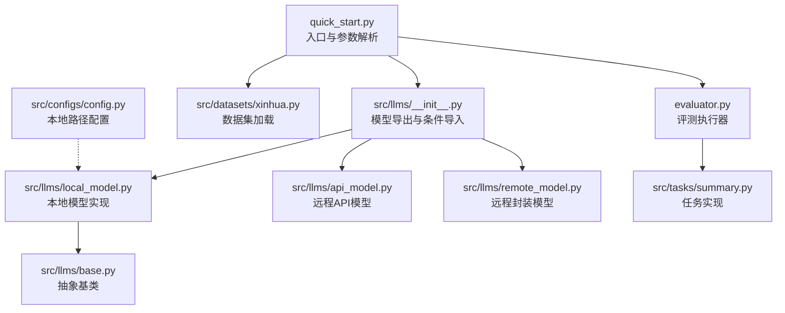
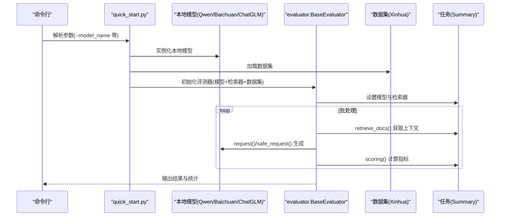
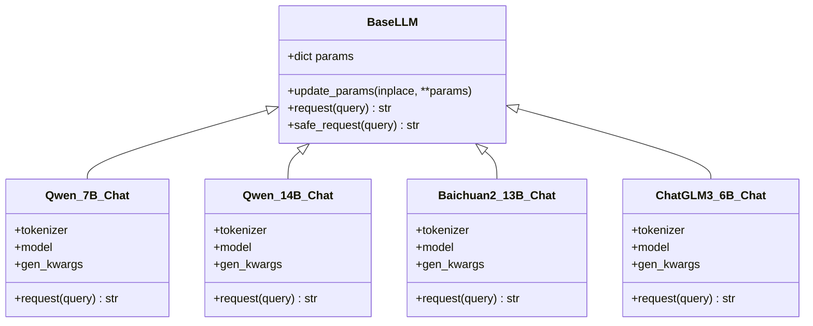
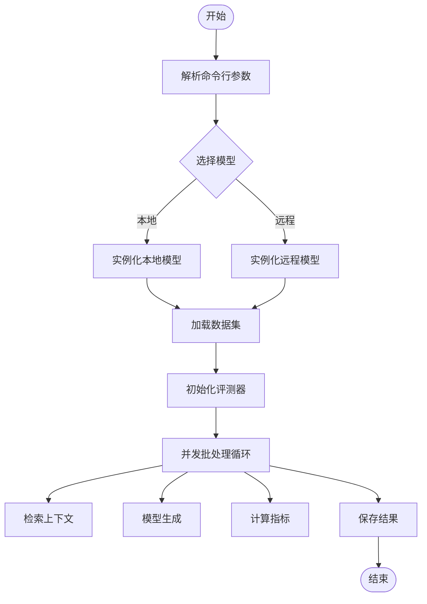
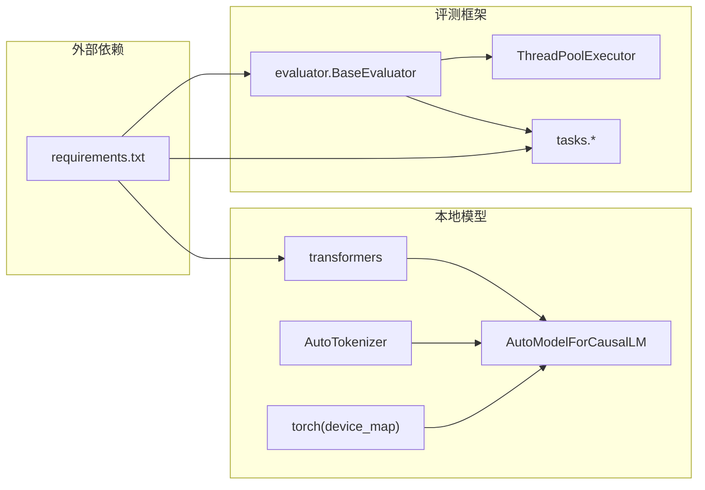

# 本地模型部署

<cite>
**本文引用的文件**
- [src/llms/local_model.py](file://src/llms/local_model.py)
- [src/llms/base.py](file://src/llms/base.py)
- [src/llms/__init__.py](file://src/llms/__init__.py)
- [src/llms/api_model.py](file://src/llms/api_model.py)
- [src/llms/remote_model.py](file://src/llms/remote_model.py)
- [src/configs/config.py](file://src/configs/config.py)
- [quick_start.py](file://quick_start.py)
- [evaluator.py](file://evaluator.py)
- [src/datasets/xinhua.py](file://src/datasets/xinhua.py)
- [src/tasks/summary.py](file://src/tasks/summary.py)
- [requirements.txt](file://requirements.txt)
- [README.md](file://README.md)
</cite>

## 目录
1. [简介](#简介)
2. [项目结构](#项目结构)
3. [核心组件](#核心组件)
4. [架构总览](#架构总览)
5. [组件详解](#组件详解)
6. [依赖关系分析](#依赖关系分析)
7. [性能与资源调优](#性能与资源调优)
8. [故障排查指南](#故障排查指南)
9. [结论](#结论)
10. [附录](#附录)

## 简介
本文件面向在本地部署与运行大语言模型（LLM）的用户，围绕 CRUD-RAG 项目中的本地推理引擎实现，系统阐述以下主题：
- 本地模型支持与加载流程
- 推理引擎配置与管理
- 模型文件准备、安装与验证
- 本地模型参数说明与性能调优
- 推理过程与输出格式（含批处理与并发）
- 最佳实践（资源分配、监控与故障恢复）
- 常见问题排查（内存不足、模型加载失败、推理错误）

## 项目结构
CRUD-RAG 的本地模型部署集中在 src/llms 子模块，配合配置文件、启动脚本与评估框架协同工作。

图示来源
- [quick_start.py:1-110](file://quick_start.py#L1-L110)
- [src/llms/__init__.py:1-13](file://src/llms/__init__.py#L1-L13)
- [src/llms/local_model.py:1-114](file://src/llms/local_model.py#L1-L114)
- [src/llms/base.py:1-47](file://src/llms/base.py#L1-L47)
- [src/llms/api_model.py:1-33](file://src/llms/api_model.py#L1-L33)
- [src/llms/remote_model.py:1-111](file://src/llms/remote_model.py#L1-L111)
- [src/configs/config.py:1-14](file://src/configs/config.py#L1-L14)
- [src/datasets/xinhua.py:1-54](file://src/datasets/xinhua.py#L1-L54)
- [evaluator.py:1-192](file://evaluator.py#L1-L192)
- [src/tasks/summary.py:1-121](file://src/tasks/summary.py#L1-L121)

章节来源
- [README.md:27-68](file://README.md#L27-L68)
- [quick_start.py:1-110](file://quick_start.py#L1-L110)

## 核心组件
- 抽象基类 BaseLLM：定义统一的参数体系与安全请求接口，提供异常兜底。
- 本地模型实现 Qwen_7B_Chat、Qwen_14B_Chat、Baichuan2_13B_Chat、ChatGLM3_6B_Chat：基于 Transformers 加载本地权重，使用 AutoModelForCausalLM 与 AutoTokenizer。
- 模型导出与条件导入：根据配置文件动态决定可用模型集合。
- 启动与评测：quick_start.py 解析参数并驱动评测流程；evaluator.py 负责并发批处理与结果持久化。

章节来源
- [src/llms/base.py:6-47](file://src/llms/base.py#L6-L47)
- [src/llms/local_model.py:11-114](file://src/llms/local_model.py#L11-L114)
- [src/llms/__init__.py:1-13](file://src/llms/__init__.py#L1-L13)
- [quick_start.py:54-58](file://quick_start.py#L54-L58)
- [evaluator.py:13-41](file://evaluator.py#L13-L41)

## 架构总览
本地推理在 CRUD-RAG 中采用“配置驱动 + 抽象基类 + 具体实现”的分层设计。启动脚本根据命令行参数选择本地模型实例，评测器通过线程池并发调用模型生成，任务模块负责检索上下文与评分。

图示来源
- [quick_start.py:54-58](file://quick_start.py#L54-L58)
- [evaluator.py:102-107](file://evaluator.py#L102-L107)
- [src/tasks/summary.py:32-50](file://src/tasks/summary.py#L32-L50)
- [src/llms/local_model.py:27-33](file://src/llms/local_model.py#L27-L33)

## 组件详解

### 本地模型类族（Qwen/Baichuan/ChatGLM）
- 继承关系：均继承自 BaseLLM，复用统一参数体系与安全请求方法。
- 加载策略：通过 AutoTokenizer.from_pretrained 与 AutoModelForCausalLM.from_pretrained 从本地目录加载权重；device_map="auto" 自动分配设备。
- 生成参数：温度、采样策略、最大新 token 数、top-p/top-k 等通过 gen_kwargs 注入 generate。
- 请求流程：编码输入 → 生成输出 → 解码响应 → 返回字符串。

图示来源
- [src/llms/base.py:6-47](file://src/llms/base.py#L6-L47)
- [src/llms/local_model.py:11-114](file://src/llms/local_model.py#L11-L114)

章节来源
- [src/llms/local_model.py:11-114](file://src/llms/local_model.py#L11-L114)
- [src/llms/base.py:6-47](file://src/llms/base.py#L6-L47)

### 模型导出与条件导入
- 当配置文件中存在 API 密钥或中转地址时，优先导出远程模型；否则导出本地模型。
- 本地模型导出包含 Qwen_7B_Chat、Qwen_14B_Chat、Baichuan2_13B_Chat、ChatGLM3_6B_Chat。

章节来源
- [src/llms/__init__.py:1-13](file://src/llms/__init__.py#L1-L13)

### 配置与路径
- 本地模型路径通过 config.py 中的键值控制（例如 Qwen_7B_local_path 等），在本地模型类初始化时读取。
- README 提示需要预先下载并放置指定模型权重目录。

章节来源
- [src/configs/config.py:11-14](file://src/configs/config.py#L11-L14)
- [README.md:81-83](file://README.md#L81-L83)

### 启动与评测流程
- 命令行参数解析：选择模型名称、温度、最大新 token 数等。
- 数据集加载：Xinhua 类按任务类型返回对应数据片段。
- 评测器：BaseEvaluator 使用线程池并发执行任务生成与评分，支持断点续跑与结果持久化。

图示来源
- [quick_start.py:54-58](file://quick_start.py#L54-L58)
- [src/datasets/xinhua.py:32-54](file://src/datasets/xinhua.py#L32-L54)
- [evaluator.py:102-107](file://evaluator.py#L102-L107)

章节来源
- [quick_start.py:14-51](file://quick_start.py#L14-L51)
- [src/datasets/xinhua.py:32-54](file://src/datasets/xinhua.py#L32-L54)
- [evaluator.py:13-41](file://evaluator.py#L13-L41)

## 依赖关系分析
- 运行时依赖：PyTorch、transformers、loguru、llama_index、langchain、milvus/pymilvus、evaluate、text2vec、FlagEmbedding、rouge_score 等。
- 本地模型依赖：transformers 的 AutoModelForCausalLM 与 AutoTokenizer；torch 设备映射与 dtype 控制。
- 评测与任务：BaseEvaluator 依赖线程池并发执行；任务模块依赖 Prompt 模板与指标计算工具。

图示来源
- [requirements.txt:1-13](file://requirements.txt#L1-L13)
- [src/llms/local_model.py:15-18](file://src/llms/local_model.py#L15-L18)
- [evaluator.py:102-107](file://evaluator.py#L102-L107)

章节来源
- [requirements.txt:1-13](file://requirements.txt#L1-L13)
- [src/llms/local_model.py:15-18](file://src/llms/local_model.py#L15-L18)
- [evaluator.py:102-107](file://evaluator.py#L102-L107)

## 性能与资源调优
- 参数说明
  - 温度（temperature）：控制随机性，默认值在基类中定义，可在实例化时传入或通过 update_params 动态调整。
  - 最大新 token 数（max_new_tokens）：限制生成长度，避免过长输出导致显存/内存压力。
  - 采样策略（do_sample、top_p、top_k）：控制生成多样性与稳定性。
- 设备与显存
  - device_map="auto" 可自动在 CPU/GPU 间分配，适合多卡/单卡环境。
  - 部分模型构造时使用 torch.bfloat16 以降低显存占用。
- 并发与批处理
  - BaseEvaluator 使用 ThreadPoolExecutor 并发执行，num_threads 可按 CPU 核心数与显存容量调优。
  - 任务侧的 retrieve_docs 与 model_generation 分离，便于并行与缓存。
- 输出格式
  - 本地模型 request 返回字符串；任务模块对输出进行清洗与截断，确保格式一致性。

章节来源
- [src/llms/base.py:16-32](file://src/llms/base.py#L16-L32)
- [src/llms/local_model.py:42-46](file://src/llms/local_model.py#L42-L46)
- [evaluator.py:102-107](file://evaluator.py#L102-L107)
- [src/tasks/summary.py:42-50](file://src/tasks/summary.py#L42-L50)

## 故障排查指南
- 内存不足/显存溢出
  - 现象：模型加载或生成时报 OOM。
  - 处理：降低 max_new_tokens；使用 torch.bfloat16；减少并发线程数；确认 device_map 是否正确分配。
  - 参考实现：本地模型构造时 dtype 与 device_map 的设置。
- 模型加载失败
  - 现象：from_pretrained 抛出异常。
  - 处理：检查 config.py 中本地路径是否正确；确认权重目录完整性；trust_remote_code 是否开启。
  - 参考实现：本地模型类初始化中 from_pretrained 的调用。
- 推理错误/空输出
  - 现象：safe_request 返回空串或异常。
  - 处理：检查输入编码是否成功；确认生成参数合法；查看日志 warning。
  - 参考实现：BaseLLM.safe_request 的异常捕获与返回空串逻辑。
- 数据集/索引问题
  - 现象：检索为空或耗时过长。
  - 处理：确认向量数据库服务已启动；索引构建参数与集合名一致；断点续跑时检查已保存 ID 列表。
  - 参考实现：quick_start 与 evaluator 的索引与集合命名逻辑。

章节来源
- [src/llms/local_model.py:14-18](file://src/llms/local_model.py#L14-L18)
- [src/llms/base.py:38-45](file://src/llms/base.py#L38-L45)
- [evaluator.py:68-74](file://evaluator.py#L68-L74)
- [README.md:76-80](file://README.md#L76-L80)

## 结论
CRUD-RAG 的本地模型部署以清晰的抽象与模块化设计实现，结合配置驱动与评测框架，既满足多模型切换，又支持高效并发评测。通过合理设置生成参数、设备与并发度，可显著提升本地推理的稳定性与性能。建议在生产环境中配合监控与断点续跑机制，确保长时间任务的可靠性。

## 附录
- 快速开始与参数参考
  - 启动命令与参数示例参见 README 的 Quick Start 部分。
  - 命令行参数解析与模型选择逻辑参见 quick_start.py。
- 评测流程与输出
  - 评测器支持断点续跑与结果持久化，输出包含指标与日志字段。
- 任务与提示模板
  - 任务模块通过 Prompt 模板拼装查询，生成后进行清洗与截断，确保输出格式一致。

章节来源
- [README.md:70-105](file://README.md#L70-L105)
- [quick_start.py:14-51](file://quick_start.py#L14-L51)
- [evaluator.py:118-151](file://evaluator.py#L118-L151)
- [src/tasks/summary.py:42-50](file://src/tasks/summary.py#L42-L50)