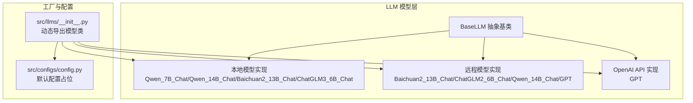
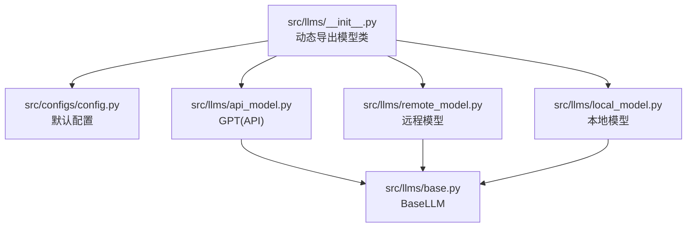
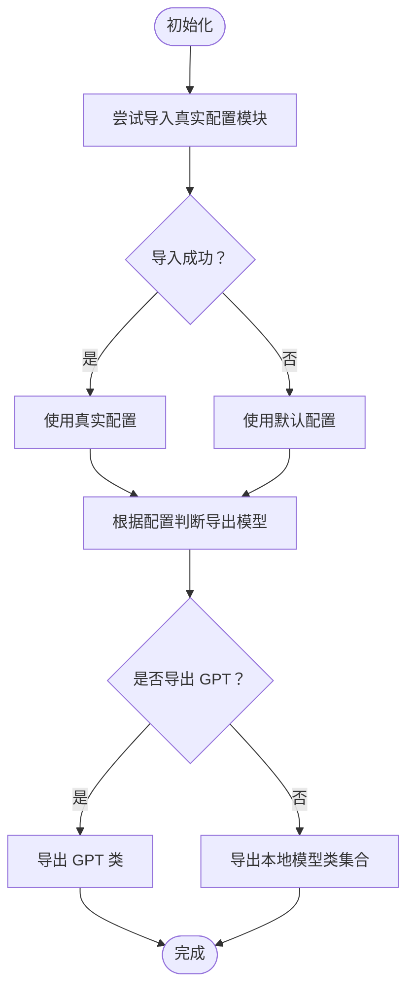
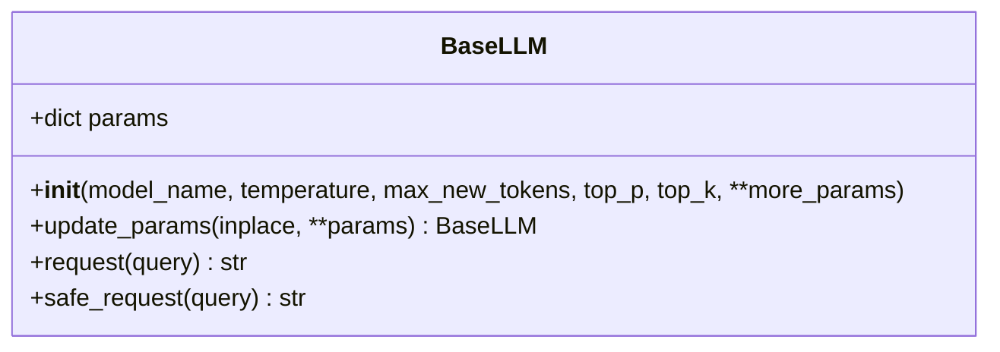
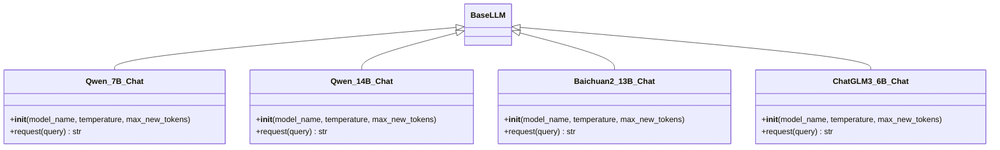
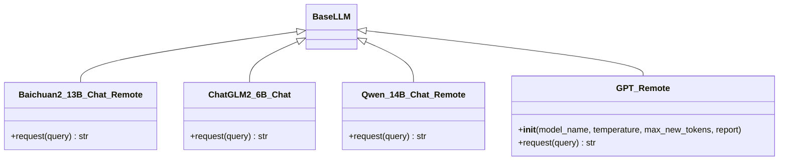
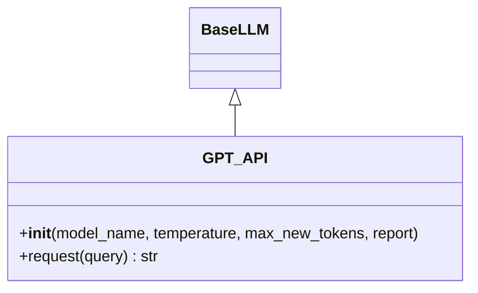
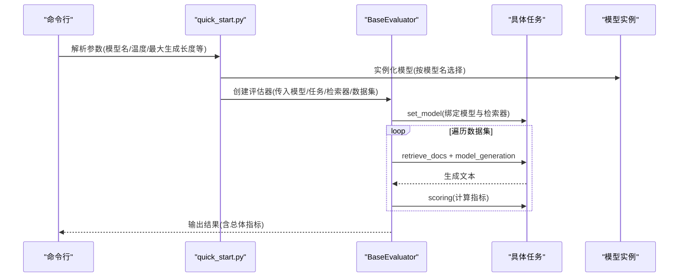
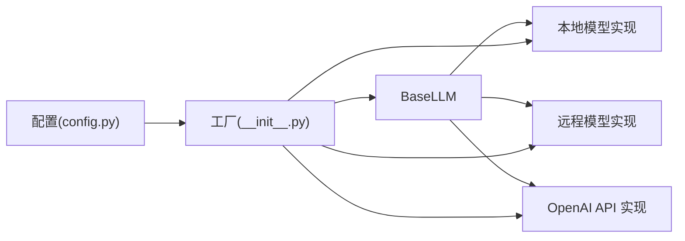
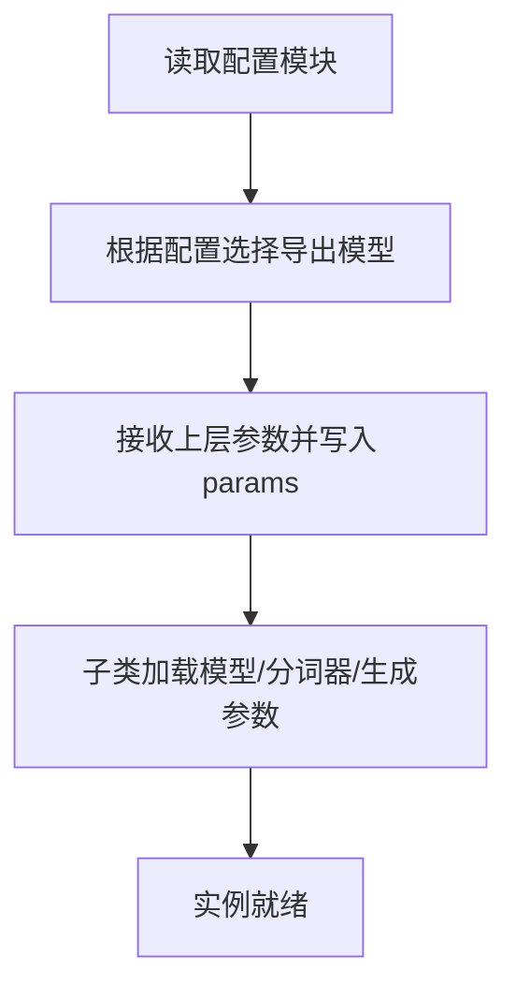

# 模型工厂模式

<cite>
**本文引用的文件**
- [src/llms/__init__.py](file://src/llms/__init__.py)
- [src/llms/base.py](file://src/llms/base.py)
- [src/llms/local_model.py](file://src/llms/local_model.py)
- [src/llms/remote_model.py](file://src/llms/remote_model.py)
- [src/llms/api_model.py](file://src/llms/api_model.py)
- [src/configs/config.py](file://src/configs/config.py)
- [evaluator.py](file://evaluator.py)
- [quick_start.py](file://quick_start.py)
</cite>

## 目录
1. [简介](#简介)
2. [项目结构](#项目结构)
3. [核心组件](#核心组件)
4. [架构总览](#架构总览)
5. [详细组件分析](#详细组件分析)
6. [依赖分析](#依赖分析)
7. [性能考虑](#性能考虑)
8. [故障排查指南](#故障排查指南)
9. [结论](#结论)
10. [附录](#附录)

## 简介
本文件系统性阐述 CRUD-RAG 中“模型工厂模式”的实现与使用方法，重点覆盖以下方面：
- 动态模型导入机制与工厂模式实现
- __init__.py 中的模型注册与选择逻辑
- 模型工厂的配置方式：模型类型识别、参数传递与实例化
- 模型切换与热更新机制：运行时替换与配置变更处理
- 扩展性设计：新增模型类型的添加流程与兼容性保证
- 在评估流程中的集成使用：批量模型测试与性能对比
- 调试与监控：模型状态检查与性能分析

## 项目结构
本项目的 LLM 模型相关代码集中在 src/llms 目录，采用“抽象基类 + 多实现 + 动态导入”的工厂式组织方式：
- 抽象层：BaseLLM 定义统一接口与通用参数管理
- 实现层：本地模型、远程模型、OpenAI API 模型分别封装不同后端
- 工厂层：通过 __init__.py 根据配置动态导出可用模型类
- 配置层：config.py 提供默认占位；真实部署可由 real_config 替换
- 评估层：BaseEvaluator 将模型与任务、检索器组合进行批量评测

图表来源
- [src/llms/__init__.py:1-13](file://src/llms/__init__.py#L1-L13)
- [src/llms/base.py:6-47](file://src/llms/base.py#L6-L47)
- [src/llms/local_model.py:11-114](file://src/llms/local_model.py#L11-L114)
- [src/llms/remote_model.py:14-111](file://src/llms/remote_model.py#L14-L111)
- [src/llms/api_model.py:12-33](file://src/llms/api_model.py#L12-L33)
- [src/configs/config.py:1-14](file://src/configs/config.py#L1-L14)

章节来源
- [src/llms/__init__.py:1-13](file://src/llms/__init__.py#L1-L13)
- [src/llms/base.py:6-47](file://src/llms/base.py#L6-L47)
- [src/llms/local_model.py:11-114](file://src/llms/local_model.py#L11-L114)
- [src/llms/remote_model.py:14-111](file://src/llms/remote_model.py#L14-L111)
- [src/llms/api_model.py:12-33](file://src/llms/api_model.py#L12-L33)
- [src/configs/config.py:1-14](file://src/configs/config.py#L1-L14)

## 核心组件
- 抽象基类 BaseLLM
  - 统一参数管理：model_name、temperature、max_new_tokens、top_p、top_k 及更多扩展参数
  - 参数更新：支持原地更新与深拷贝更新两种策略
  - 请求接口：定义 request 抽象方法；提供安全请求 safe_request 并记录日志
- 本地模型实现（Local）
  - 基于 Transformers 的本地推理，加载分词器与模型，构建生成参数字典
  - 支持多款本地模型（Qwen 系列、Baichuan2、ChatGLM3）
- 远程模型实现（Remote）
  - 通过 HTTP 接口调用远端服务，按配置拼装请求体与头部
  - 支持多款远程模型（Baichuan2、ChatGLM2、Qwen、GPT）
- OpenAI API 实现（API）
  - 使用 openai SDK 直连官方 API，支持自定义 base_url
- 工厂与动态导入（Factory）
  - __init__.py 根据配置自动选择并导出可用模型类（API 或远程模型优先于本地模型）

章节来源
- [src/llms/base.py:6-47](file://src/llms/base.py#L6-L47)
- [src/llms/local_model.py:11-114](file://src/llms/local_model.py#L11-L114)
- [src/llms/remote_model.py:14-111](file://src/llms/remote_model.py#L14-L111)
- [src/llms/api_model.py:12-33](file://src/llms/api_model.py#L12-L33)
- [src/llms/__init__.py:1-13](file://src/llms/__init__.py#L1-L13)

## 架构总览
下图展示了模型工厂在运行时的装配路径与依赖关系：

图表来源
- [src/llms/__init__.py:1-13](file://src/llms/__init__.py#L1-L13)
- [src/llms/base.py:6-47](file://src/llms/base.py#L6-L47)
- [src/llms/local_model.py:11-114](file://src/llms/local_model.py#L11-L114)
- [src/llms/remote_model.py:14-111](file://src/llms/remote_model.py#L14-L111)
- [src/llms/api_model.py:12-33](file://src/llms/api_model.py#L12-L33)
- [src/configs/config.py:1-14](file://src/configs/config.py#L1-L14)

## 详细组件分析

### 工厂与动态导入机制
- 动态导入与回退策略
  - 优先尝试导入真实配置模块；失败则回退到默认配置模块
  - 根据配置项决定导出哪些模型类（如存在 API 密钥或中转 URL 则导出 GPT 类）
- 模型导出清单
  - 当满足条件时导出 GPT；否则导出多个本地模型类
  - 该机制实现了“按需导出”，避免不必要的依赖加载

图表来源
- [src/llms/__init__.py:1-13](file://src/llms/__init__.py#L1-L13)

章节来源
- [src/llms/__init__.py:1-13](file://src/llms/__init__.py#L1-L13)

### 抽象基类与参数管理
- 参数结构
  - 统一存储于 params 字典，包含模型名、采样温度、最大生成长度、top-p、top-k 等
  - 支持扩展参数透传，便于子类按需使用
- 参数更新策略
  - 原地更新：直接修改当前对象参数，返回自身
  - 深拷贝更新：复制一份新对象，更新其参数后返回，不改变原对象
- 安全请求
  - 包裹请求逻辑，捕获异常并记录警告，确保评估流程稳定性

图表来源
- [src/llms/base.py:6-47](file://src/llms/base.py#L6-L47)

章节来源
- [src/llms/base.py:6-47](file://src/llms/base.py#L6-L47)

### 本地模型实现（Transformers）
- 关键点
  - 从配置读取本地模型路径，加载分词器与模型，并设置设备映射
  - 构建生成参数字典，统一使用温度、采样开关、最大长度、top-p、top-k
  - request 方法封装输入编码、生成与解码流程
- 兼容性
  - 同一接口适配多款本地模型，便于在工厂中统一调度

图表来源
- [src/llms/local_model.py:11-114](file://src/llms/local_model.py#L11-L114)
- [src/llms/base.py:6-47](file://src/llms/base.py#L6-L47)

章节来源
- [src/llms/local_model.py:11-114](file://src/llms/local_model.py#L11-L114)

### 远程模型实现（HTTP 调用）
- 关键点
  - 依据配置构造请求体与头部，发送 POST 请求至远端服务
  - 解析响应并提取生成结果，统一返回字符串
- 兼容性
  - 与本地模型共享同一抽象接口，便于在工厂中无缝切换

图表来源
- [src/llms/remote_model.py:14-111](file://src/llms/remote_model.py#L14-L111)
- [src/llms/base.py:6-47](file://src/llms/base.py#L6-L47)

章节来源
- [src/llms/remote_model.py:14-111](file://src/llms/remote_model.py#L14-L111)

### OpenAI API 实现
- 关键点
  - 设置 API Key 与可选的 base_url
  - 使用 chat.completions 接口生成文本，解析用量并可选输出日志
- 兼容性
  - 与工厂导出的 GPT 类保持一致名称，便于上层统一引用

图表来源
- [src/llms/api_model.py:12-33](file://src/llms/api_model.py#L12-L33)
- [src/llms/base.py:6-47](file://src/llms/base.py#L6-L47)

章节来源
- [src/llms/api_model.py:12-33](file://src/llms/api_model.py#L12-L33)

### 评估流程中的集成使用
- 评估器 BaseEvaluator
  - 组合模型、任务与检索器，负责批量评分与结果持久化
  - 输出路径包含检索器集合名、top-k 与模型类名，便于区分不同配置下的结果
  - 支持多线程批处理与断点续跑
- 快速开始脚本 quick_start.py
  - 命令行参数驱动模型选择（如 gpt 系列、qwen7b 等）
  - 将选定模型注入评估器，执行完整评测流程

图表来源
- [quick_start.py:54-58](file://quick_start.py#L54-L58)
- [quick_start.py:106-108](file://quick_start.py#L106-L108)
- [evaluator.py:13-41](file://evaluator.py#L13-L41)
- [evaluator.py:118-151](file://evaluator.py#L118-L151)

章节来源
- [evaluator.py:13-41](file://evaluator.py#L13-L41)
- [evaluator.py:118-151](file://evaluator.py#L118-L151)
- [quick_start.py:54-58](file://quick_start.py#L54-L58)
- [quick_start.py:106-108](file://quick_start.py#L106-L108)

## 依赖分析
- 组件耦合
  - 所有模型实现均继承自 BaseLLM，降低上层调用复杂度
  - 工厂仅依赖配置模块，避免直接耦合具体模型实现
- 外部依赖
  - 本地模型依赖 Transformers 与 Torch
  - 远程模型依赖 requests
  - API 模型依赖 openai SDK
- 潜在循环依赖
  - 通过“延迟导入”与“运行时装配”避免模块级循环依赖

图表来源
- [src/llms/base.py:6-47](file://src/llms/base.py#L6-L47)
- [src/llms/local_model.py:11-114](file://src/llms/local_model.py#L11-L114)
- [src/llms/remote_model.py:14-111](file://src/llms/remote_model.py#L14-L111)
- [src/llms/api_model.py:12-33](file://src/llms/api_model.py#L12-L33)
- [src/llms/__init__.py:1-13](file://src/llms/__init__.py#L1-L13)
- [src/configs/config.py:1-14](file://src/configs/config.py#L1-L14)

章节来源
- [src/llms/base.py:6-47](file://src/llms/base.py#L6-L47)
- [src/llms/local_model.py:11-114](file://src/llms/local_model.py#L11-L114)
- [src/llms/remote_model.py:14-111](file://src/llms/remote_model.py#L14-L111)
- [src/llms/api_model.py:12-33](file://src/llms/api_model.py#L12-L33)
- [src/llms/__init__.py:1-13](file://src/llms/__init__.py#L1-L13)
- [src/configs/config.py:1-14](file://src/configs/config.py#L1-L14)

## 性能考虑
- 本地模型
  - 设备映射与半精度参数可提升吞吐；注意显存占用与批处理策略
  - 生成参数（温度、top-p、top-k）直接影响速度与质量平衡
- 远程模型
  - 网络延迟与远端限流为主要瓶颈；建议合理设置并发与重试策略
- 评估性能
  - 多线程批处理显著缩短评测时间；注意锁与结果写入的并发安全
  - 断点续跑减少重复计算，提高迭代效率

## 故障排查指南
- 常见问题定位
  - 模型实例化失败：检查配置项是否正确填写（如本地路径、API Key、中转 URL、Token）
  - 请求异常：使用 safe_request 包裹调用，关注日志输出
  - 结果为空：确认生成参数与提示格式是否符合模型要求
- 调试建议
  - 在快速开始脚本中打印模型参数与配置项，核对实际生效值
  - 评估器输出路径包含模型类名与检索器配置，便于交叉对比
  - 对比不同模型在同一数据集上的耗时与指标，定位性能瓶颈

章节来源
- [src/llms/base.py:38-45](file://src/llms/base.py#L38-L45)
- [evaluator.py:33-39](file://evaluator.py#L33-L39)
- [quick_start.py:54-58](file://quick_start.py#L54-L58)

## 结论
本项目通过“抽象基类 + 多实现 + 动态工厂”的架构，实现了模型的统一抽象、灵活切换与稳定评估。工厂基于配置动态导出可用模型类，结合参数管理与安全请求机制，既保证了易用性，也兼顾了可扩展性与可观测性。在评估流程中，模型工厂与评估器协同工作，支持批量测试与性能对比，为模型选型与优化提供了可靠支撑。

## 附录

### 模型工厂配置与实例化流程
- 配置识别
  - 通过 __init__.py 读取配置模块，依据 API Key 与中转 URL 决定导出模型
- 参数传递
  - 上层通过命令行或直接调用传入 model_name、temperature、max_new_tokens 等
  - BaseLLM 统一接收并存储于 params，子类按需读取
- 实例化过程
  - 工厂导出类名与上层引用保持一致，便于直接实例化
  - 子类在 __init__ 中读取配置并完成模型加载与生成参数构建

图表来源
- [src/llms/__init__.py:1-13](file://src/llms/__init__.py#L1-L13)
- [src/llms/base.py:6-32](file://src/llms/base.py#L6-L32)
- [src/llms/local_model.py:14-25](file://src/llms/local_model.py#L14-L25)
- [src/llms/remote_model.py:16-34](file://src/llms/remote_model.py#L16-L34)
- [src/llms/api_model.py:18-27](file://src/llms/api_model.py#L18-L27)

章节来源
- [src/llms/__init__.py:1-13](file://src/llms/__init__.py#L1-L13)
- [src/llms/base.py:6-32](file://src/llms/base.py#L6-L32)
- [src/llms/local_model.py:14-25](file://src/llms/local_model.py#L14-L25)
- [src/llms/remote_model.py:16-34](file://src/llms/remote_model.py#L16-L34)
- [src/llms/api_model.py:18-27](file://src/llms/api_model.py#L18-L27)

### 模型切换与热更新机制
- 运行时模型替换
  - 通过命令行参数或直接实例化不同模型类实现即时切换
  - 评估器输出路径包含模型类名，便于区分不同配置的结果
- 配置变更处理
  - 工厂在导入阶段读取配置；若需热更新，可在重新导入模块后重建实例
  - 建议在评估器外层封装工厂函数，集中管理实例生命周期

章节来源
- [quick_start.py:54-58](file://quick_start.py#L54-L58)
- [evaluator.py:33-39](file://evaluator.py#L33-L39)
- [src/llms/__init__.py:1-13](file://src/llms/__init__.py#L1-L13)

### 扩展性设计：新增模型类型
- 添加步骤
  - 新建子类继承 BaseLLM，实现 __init__ 与 request
  - 在 __init__.py 中按需导出新类，或通过工厂函数统一注册
  - 在配置文件中新增对应配置项（如本地路径、URL、Token 等）
- 兼容性保证
  - 保持与现有模型相同的参数命名与行为约定
  - 在评估器中无需改动即可参与批量评测

章节来源
- [src/llms/base.py:6-47](file://src/llms/base.py#L6-L47)
- [src/llms/__init__.py:12-13](file://src/llms/__init__.py#L12-L13)
- [src/configs/config.py:1-14](file://src/configs/config.py#L1-L14)

### 在评估流程中的集成使用
- 批量模型测试
  - 通过命令行参数或脚本循环实例化不同模型，统一注入评估器
  - 评估器自动保存结果，便于横向对比
- 性能对比
  - 对比不同模型在相同数据集上的耗时与指标，结合日志与输出路径进行归档

章节来源
- [quick_start.py:106-108](file://quick_start.py#L106-L108)
- [evaluator.py:118-151](file://evaluator.py#L118-L151)