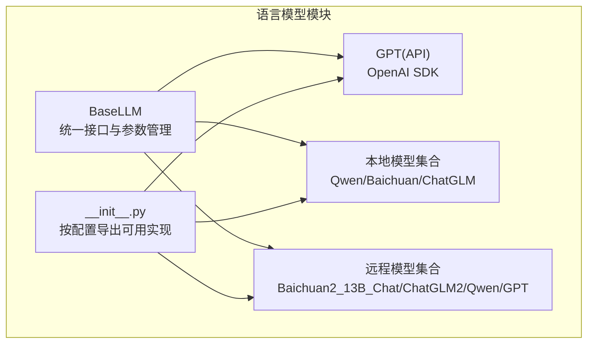
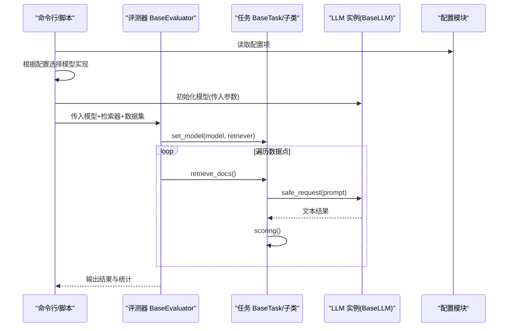
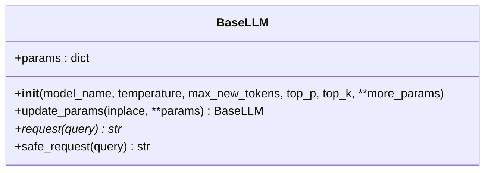
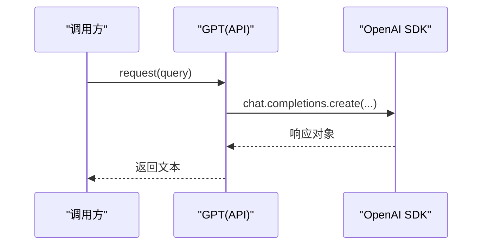
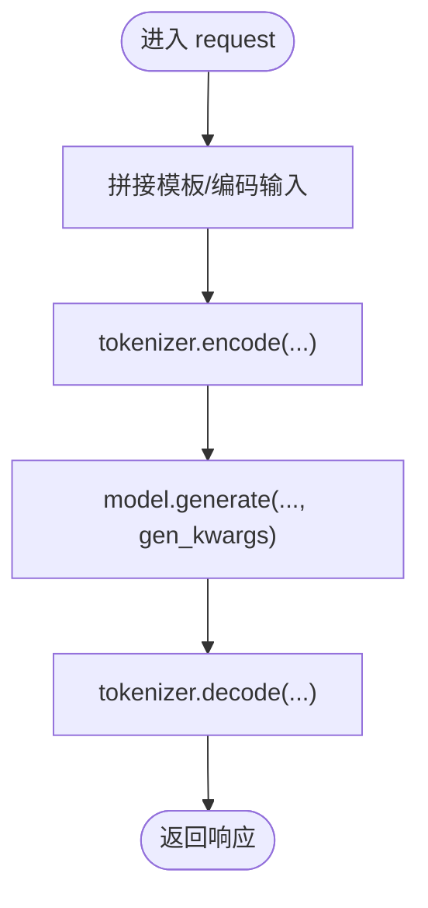
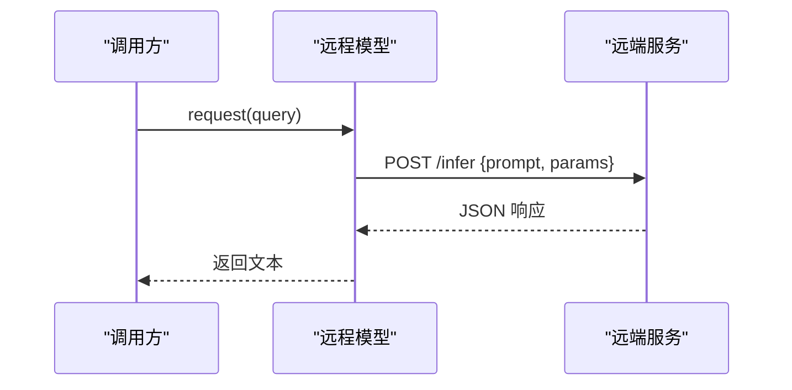
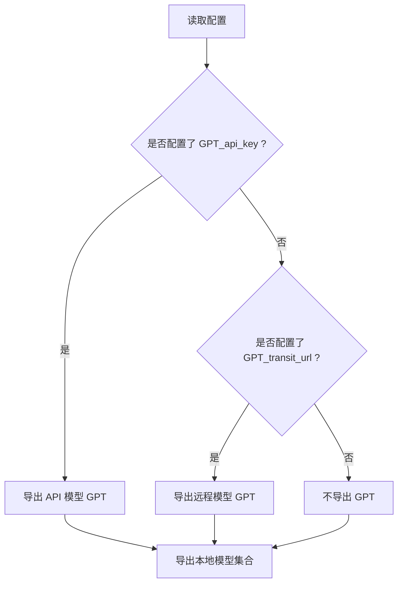
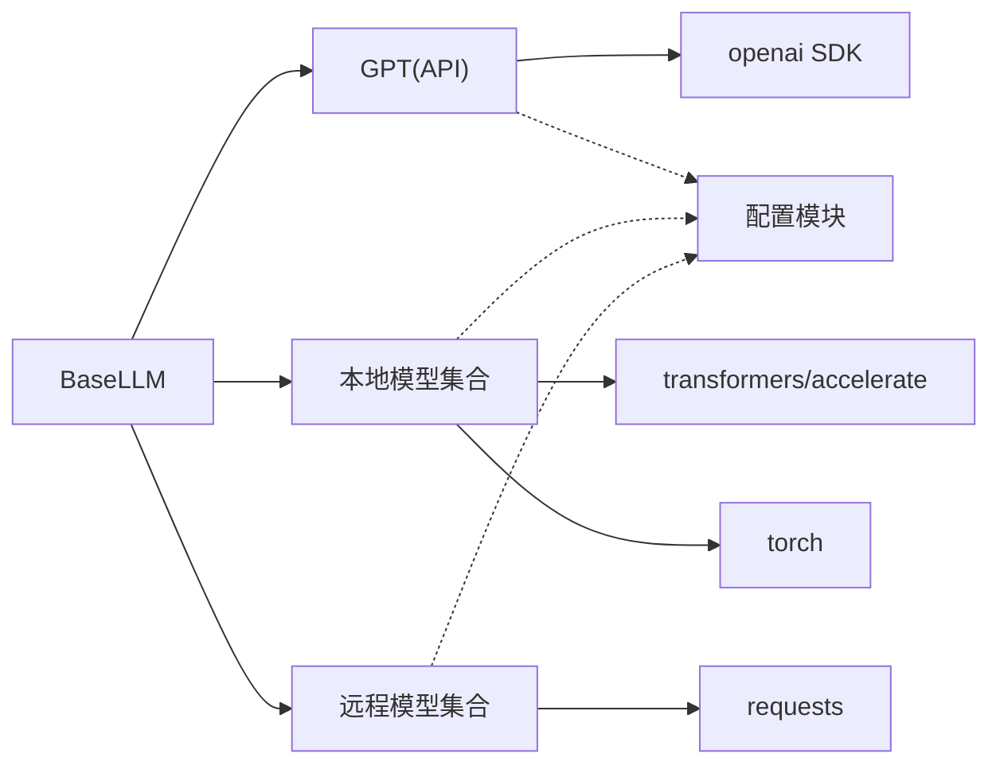

# 语言模型模块

<cite>
**本文引用的文件**
- [src/llms/base.py](file://src/llms/base.py)
- [src/llms/api_model.py](file://src/llms/api_model.py)
- [src/llms/local_model.py](file://src/llms/local_model.py)
- [src/llms/remote_model.py](file://src/llms/remote_model.py)
- [src/llms/__init__.py](file://src/llms/__init__.py)
- [src/configs/config.py](file://src/configs/config.py)
- [src/evaluator.py](file://src/evaluator.py)
- [src/tasks/base.py](file://src/tasks/base.py)
- [src/tasks/quest_answer.py](file://src/tasks/quest_answer.py)
- [src/tasks/hallucinated_modified.py](file://src/tasks/hallucinated_modified.py)
- [quick_start.py](file://quick_start.py)
</cite>

## 目录
1. [简介](#简介)
2. [项目结构](#项目结构)
3. [核心组件](#核心组件)
4. [架构总览](#架构总览)
5. [详细组件分析](#详细组件分析)
6. [依赖分析](#依赖分析)
7. [性能考虑](#性能考虑)
8. [故障排查指南](#故障排查指南)
9. [结论](#结论)
10. [附录：新增模型与最佳实践](#附录新增模型与最佳实践)

## 简介
本文件系统性梳理 CRUD-RAG 中的语言模型模块（LLM），围绕统一的 LLM 基类设计、三类模型实现（API 模型、本地模型、远程模型）、初始化与参数调优、性能监控、扩展机制与最佳实践展开。文档同时给出常见问题排查与错误处理建议，帮助在不同规模应用场景中做出合理的模型选择与成本控制。

## 项目结构
语言模型模块位于 src/llms 目录，采用“基类 + 多实现”的分层设计：
- 基类定义统一接口与通用能力（如参数管理、安全请求）
- API 模型：通过 OpenAI 官方 SDK 调用在线服务
- 本地模型：基于 Transformers 的本地推理（多款中文大模型）
- 远程模型：通过自建服务或第三方服务转发调用
- 导出入口根据配置自动选择可用的模型实现

图表来源
- [src/llms/base.py:1-47](file://src/llms/base.py#L1-L47)
- [src/llms/api_model.py:1-33](file://src/llms/api_model.py#L1-L33)
- [src/llms/local_model.py:1-114](file://src/llms/local_model.py#L1-L114)
- [src/llms/remote_model.py:1-111](file://src/llms/remote_model.py#L1-L111)
- [src/llms/__init__.py:1-13](file://src/llms/__init__.py#L1-L13)

章节来源
- [src/llms/base.py:1-47](file://src/llms/base.py#L1-L47)
- [src/llms/__init__.py:1-13](file://src/llms/__init__.py#L1-L13)

## 核心组件
- 统一基类 BaseLLM
  - 提供统一的构造参数：模型名、温度、最大新词数、top-p、top-k
  - 支持参数更新（原地/深拷贝两种模式）
  - 抽象方法 request 接口，子类必须实现
  - 提供安全请求 safe_request，异常时记录日志并返回空字符串
- 具体实现
  - API 模型：GPT（OpenAI Chat Completions）
  - 本地模型：Qwen_7B_Chat、Qwen_14B_Chat、Baichuan2_13B_Chat、ChatGLM3_6B_Chat
  - 远程模型：Baichuan2_13B_Chat、ChatGLM2_6B_Chat、Qwen_14B_Chat、GPT（转发）

章节来源
- [src/llms/base.py:6-46](file://src/llms/base.py#L6-L46)
- [src/llms/api_model.py:12-32](file://src/llms/api_model.py#L12-L32)
- [src/llms/local_model.py:11-114](file://src/llms/local_model.py#L11-L114)
- [src/llms/remote_model.py:14-111](file://src/llms/remote_model.py#L14-L111)

## 架构总览
语言模型模块通过统一基类抽象出一致的调用接口，配合配置模块按需加载具体实现。评测器在运行期以 BaseLLM 类型接收模型实例，从而屏蔽不同实现的差异。

图表来源
- [src/evaluator.py:13-151](file://src/evaluator.py#L13-L151)
- [src/tasks/base.py:34-50](file://src/tasks/base.py#L34-L50)
- [src/llms/base.py:38-46](file://src/llms/base.py#L38-L46)
- [src/llms/__init__.py:7-12](file://src/llms/__init__.py#L7-L12)

## 详细组件分析

### 基类 BaseLLM 设计
- 参数管理
  - params 字典集中存储模型参数，便于统一传递与更新
  - update_params 支持原地修改或返回深拷贝的新对象，满足不可变配置场景
- 请求接口
  - request 为抽象方法，子类必须实现
  - safe_request 包装异常处理，保证上层调用稳定
- 设计要点
  - 将“参数”与“行为”解耦，便于统一调度
  - 通过抽象接口约束实现，确保可替换性

图表来源
- [src/llms/base.py:6-46](file://src/llms/base.py#L6-L46)

章节来源
- [src/llms/base.py:6-46](file://src/llms/base.py#L6-L46)

### API 模型（GPT）
- 适配 OpenAI Chat Completions
- 从配置模块读取 API Key 与可选的自定义 base_url
- 支持 report 开关输出 token 消耗信息
- 返回 choices[0].message.content

图表来源
- [src/llms/api_model.py:17-32](file://src/llms/api_model.py#L17-L32)

章节来源
- [src/llms/api_model.py:12-32](file://src/llms/api_model.py#L12-L32)

### 本地模型（Qwen/Baichuan/ChatGLM）
- 使用 Transformers 加载本地权重，device_map 自动分配 GPU
- 生成参数来自 params，统一温度、采样、top-p、top-k、最大新词数
- 针对部分模型在输入格式上的差异（例如 Qwen 系列需要特定 system/user/assistant 模板）
- 本地推理，无需网络，适合隐私与离线场景

图表来源
- [src/llms/local_model.py:27-33](file://src/llms/local_model.py#L27-L33)
- [src/llms/local_model.py:55-60](file://src/llms/local_model.py#L55-L60)
- [src/llms/local_model.py:82-87](file://src/llms/local_model.py#L82-L87)
- [src/llms/local_model.py:106-112](file://src/llms/local_model.py#L106-L112)

章节来源
- [src/llms/local_model.py:11-114](file://src/llms/local_model.py#L11-L114)

### 远程模型（Baichuan2_13B_Chat/ChatGLM2_6B_Chat/Qwen_14B_Chat/GPT）
- 通过 HTTP POST 调用远端服务，携带 prompt 与 params
- 从配置读取服务地址、鉴权 token 等
- 返回 choices[0] 或 message.content，统一处理

图表来源
- [src/llms/remote_model.py:14-34](file://src/llms/remote_model.py#L14-L34)
- [src/llms/remote_model.py:37-57](file://src/llms/remote_model.py#L37-L57)
- [src/llms/remote_model.py:60-80](file://src/llms/remote_model.py#L60-L80)
- [src/llms/remote_model.py:88-110](file://src/llms/remote_model.py#L88-L110)

章节来源
- [src/llms/remote_model.py:14-111](file://src/llms/remote_model.py#L14-L111)

### 模型导出与选择策略
- __init__.py 根据配置自动选择可用实现：
  - 若存在 GPT_api_key，则导出 API 模型 GPT
  - 否则若存在 GPT_transit_url，则导出远程模型 GPT
  - 无论哪种情况，均导出本地模型集合（Qwen_7B_Chat、Qwen_14B_Chat、Baichuan2_13B_Chat、ChatGLM3_6B_Chat）

图表来源
- [src/llms/__init__.py:7-12](file://src/llms/__init__.py#L7-L12)

章节来源
- [src/llms/__init__.py:1-13](file://src/llms/__init__.py#L1-L13)

## 依赖分析
- 统一依赖链
  - 所有具体模型均继承 BaseLLM，保证接口一致性
  - 评测器 BaseEvaluator 仅依赖 BaseLLM 接口，不关心具体实现
- 外部依赖
  - API 模型依赖 OpenAI SDK
  - 本地模型依赖 Transformers 与 PyTorch
  - 远程模型依赖 requests
- 配置依赖
  - 所有模型通过 importlib 动态导入配置模块，优先 real_config，回退到 config

图表来源
- [src/llms/api_model.py:1-10](file://src/llms/api_model.py#L1-L10)
- [src/llms/local_model.py:1-9](file://src/llms/local_model.py#L1-L9)
- [src/llms/remote_model.py:1-11](file://src/llms/remote_model.py#L1-L11)
- [src/llms/base.py:1-4](file://src/llms/base.py#L1-L4)

章节来源
- [src/llms/api_model.py:1-10](file://src/llms/api_model.py#L1-L10)
- [src/llms/local_model.py:1-9](file://src/llms/local_model.py#L1-L9)
- [src/llms/remote_model.py:1-11](file://src/llms/remote_model.py#L1-L11)

## 性能考虑
- 参数调优
  - 温度：控制随机性；越低越确定，越高越多样
  - top_p/top_k：核采样与候选采样，平衡多样性与稳定性
  - 最大新词数：影响上下文窗口与输出长度
- 本地模型
  - 使用 device_map 自动分配显存，注意显存占用与批处理大小
  - 对于大模型（如 Qwen_14B），建议降低温度与采样强度以提升稳定性
- 远程模型
  - 通过 HTTP 调用，注意网络延迟与并发限制
  - 可结合评测器的多线程执行，但需关注远端限流
- API 模型
  - 记录 token 消耗，有助于成本控制与预算管理
  - 在高并发下建议使用连接池与重试策略（可在上层封装）
- 评测器与并发
  - 评测器支持多线程批量评分，合理设置线程数避免资源争用
  - 输出路径包含模型类名与参数快照，便于复现与对比

章节来源
- [src/llms/base.py:25-32](file://src/llms/base.py#L25-L32)
- [src/llms/api_model.py:30-31](file://src/llms/api_model.py#L30-L31)
- [src/evaluator.py:102-107](file://src/evaluator.py#L102-L107)

## 故障排查指南
- 常见问题与定位
  - API Key/URL 配置错误：检查配置模块中对应字段是否正确
  - 远程服务不可达：确认 token、URL、网络连通性
  - 本地模型加载失败：确认本地权重路径、设备映射、CUDA 可用性
  - 评测器输出为空：safe_request 会返回空字符串，需检查上游异常
- 错误处理策略
  - 使用 safe_request 包装请求，捕获异常并记录日志
  - 评测器在多处捕获异常并跳过无效样本，保证整体流程稳定
- 日志与监控
  - API 模型可开启 report 输出 token 消耗
  - 评测器输出包含模型参数快照，便于审计与复盘

章节来源
- [src/llms/base.py:38-46](file://src/llms/base.py#L38-L46)
- [src/llms/api_model.py:18-20](file://src/llms/api_model.py#L18-L20)
- [src/evaluator.py:49-53](file://src/evaluator.py#L49-L53)
- [src/evaluator.py:98-100](file://src/evaluator.py#L98-L100)

## 结论
语言模型模块通过统一基类与清晰的实现边界，实现了 API、本地与远程三种部署形态的无缝切换。结合配置驱动的选择策略与评测器的多线程执行，能够在不同规模与资源约束下灵活应用。建议在生产环境中优先使用本地模型以降低外部依赖风险，并通过参数调优与成本监控实现性能与成本的平衡。

## 附录：新增模型与最佳实践

### 新增语言模型支持步骤
- 实现步骤
  - 新建类继承 BaseLLM，实现 request(query) 方法
  - 在 __init__.py 中按需导出该类（可参考现有导出逻辑）
  - 在配置模块中添加必要的访问凭据与地址
- 接口实现要求
  - request 必须返回字符串
  - 如涉及外部服务，建议在 request 内完成认证与参数组装
  - 如涉及 token 统计，可在返回前记录消耗指标
- 集成示例（概念性）
  - 参考现有实现：API 模型、本地模型、远程模型的参数传递与调用方式
  - 参考导出策略：在 __init__.py 中按配置条件导出

章节来源
- [src/llms/base.py:34-36](file://src/llms/base.py#L34-L36)
- [src/llms/__init__.py:7-12](file://src/llms/__init__.py#L7-L12)
- [src/llms/api_model.py:17-27](file://src/llms/api_model.py#L17-L27)
- [src/llms/local_model.py:14-25](file://src/llms/local_model.py#L14-L25)
- [src/llms/remote_model.py:16-27](file://src/llms/remote_model.py#L16-L27)

### 模型选择策略与成本控制
- 选择策略
  - 低延迟、高可用：优先本地模型（GPU 资源充足时）
  - 高吞吐、弹性扩展：远程模型或 API 模型
  - 成本敏感：本地模型可显著降低长期运营成本
- 成本控制
  - API 模型：记录 token 消耗，设定预算上限
  - 本地模型：优化批处理与显存占用，减少重复加载
  - 远程模型：控制并发与超时，避免服务端限流

章节来源
- [src/llms/api_model.py:30-31](file://src/llms/api_model.py#L30-L31)
- [src/llms/local_model.py:14-18](file://src/llms/local_model.py#L14-L18)
- [src/llms/remote_model.py:16-27](file://src/llms/remote_model.py#L16-L27)

### 不同规模的应用场景建议
- 小规模/开发测试
  - 本地模型：快速验证，无需网络
  - API 模型：短期试用，便于快速上线
- 中等规模/生产验证
  - 本地模型：稳定可控，适合核心推理
  - 远程模型：作为补充或弹性扩容
- 大规模/线上生产
  - 本地模型：自建集群，统一管理
  - API 模型：结合多区域与缓存策略
  - 远程模型：与网关与限流策略配合

章节来源
- [src/llms/local_model.py:14-18](file://src/llms/local_model.py#L14-L18)
- [src/llms/api_model.py:18-20](file://src/llms/api_model.py#L18-L20)
- [src/llms/remote_model.py:16-27](file://src/llms/remote_model.py#L16-L27)

### 参数调优与性能监控清单
- 关键参数
  - 温度、top_p、top_k、最大新词数
- 监控指标
  - API 模型：token 消耗、请求耗时、错误率
  - 本地模型：显存占用、生成耗时、稳定性
  - 远程模型：网络延迟、服务端响应时间、限流触发次数
- 工具与方法
  - 使用评测器的多线程执行与结果持久化
  - 在 __init__.py 中按配置导出不同实现，便于 A/B 对比

章节来源
- [src/llms/base.py:16-23](file://src/llms/base.py#L16-L23)
- [src/llms/api_model.py:30-31](file://src/llms/api_model.py#L30-L31)
- [src/evaluator.py:102-107](file://src/evaluator.py#L102-L107)