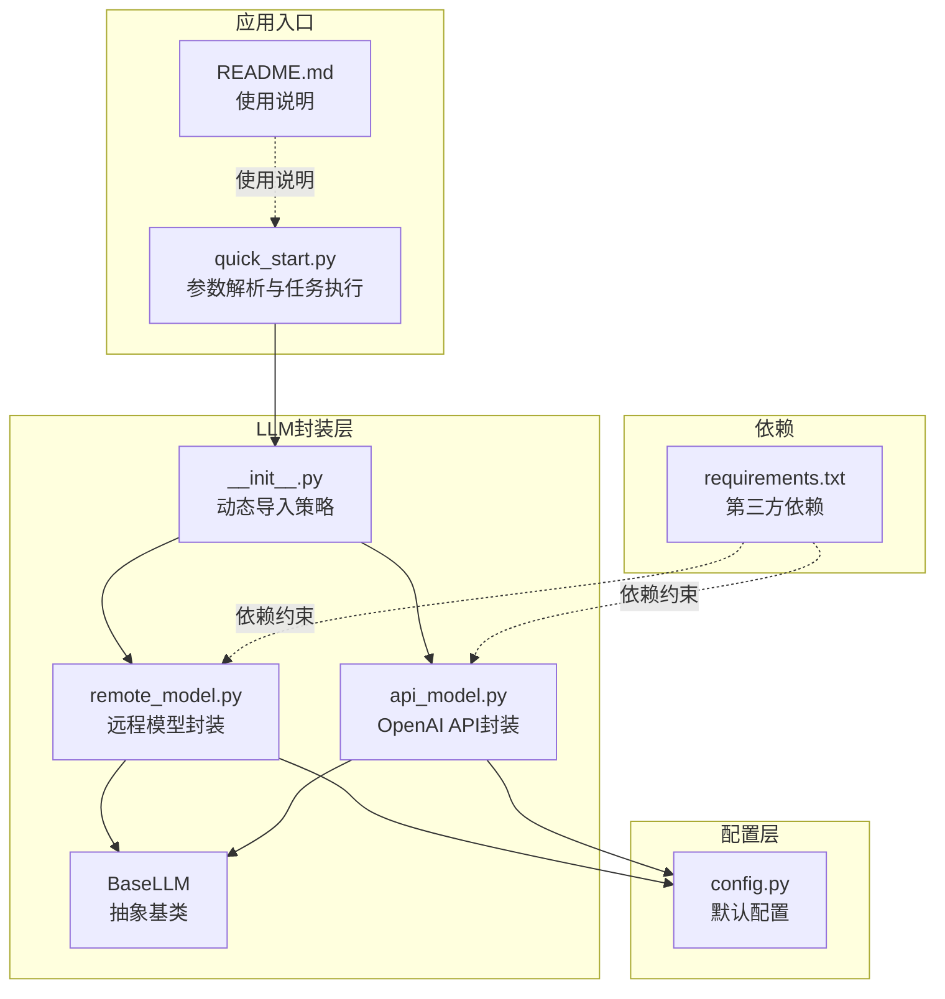
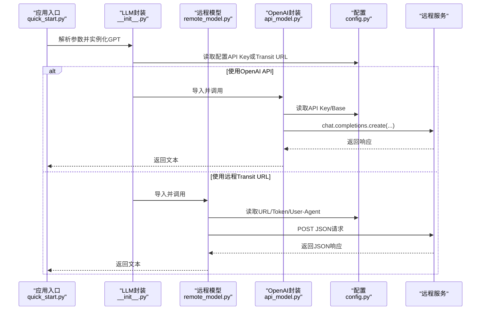
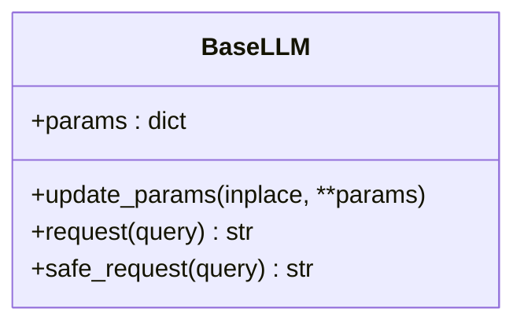
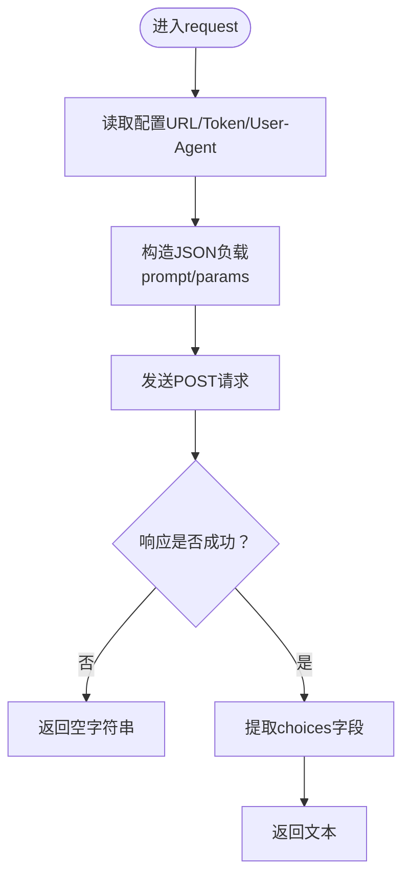
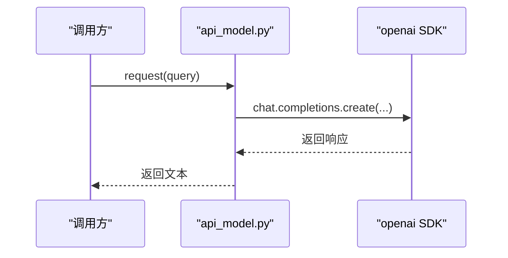
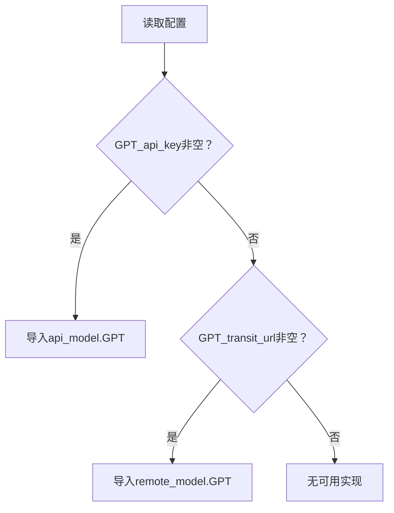
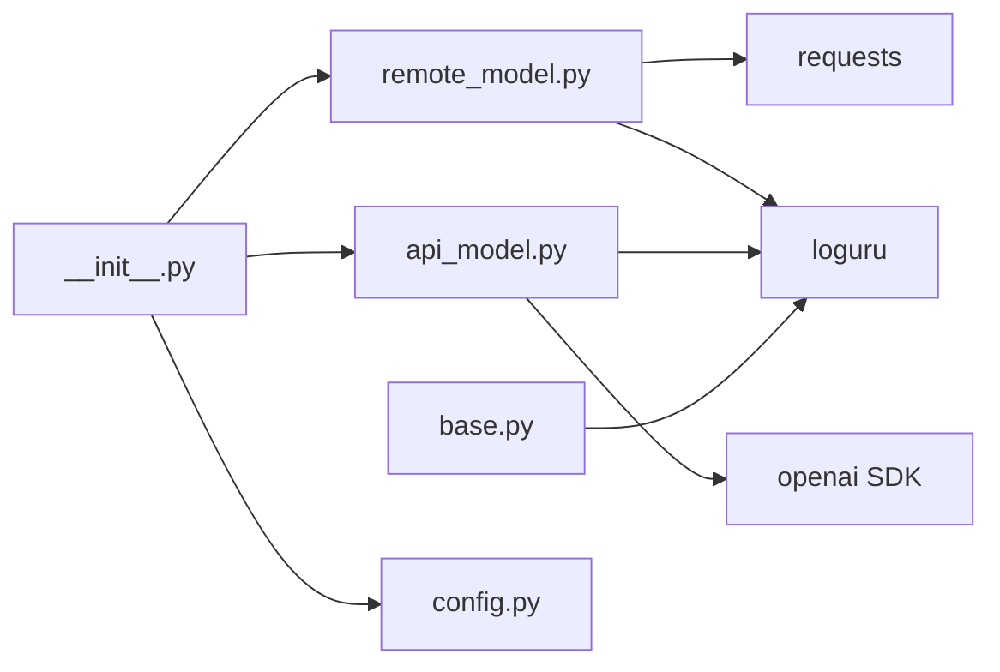
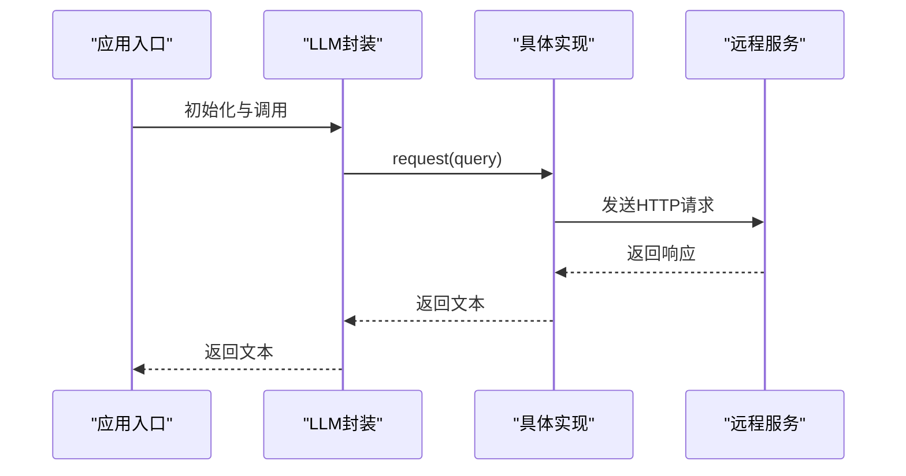

# 远程模型封装

<cite>
**本文引用的文件**
- [src/llms/remote_model.py](file://src/llms/remote_model.py)
- [src/llms/api_model.py](file://src/llms/api_model.py)
- [src/llms/base.py](file://src/llms/base.py)
- [src/llms/__init__.py](file://src/llms/__init__.py)
- [src/configs/config.py](file://src/configs/config.py)
- [quick_start.py](file://quick_start.py)
- [README.md](file://README.md)
- [requirements.txt](file://requirements.txt)
</cite>

## 目录
1. [简介](#简介)
2. [项目结构](#项目结构)
3. [核心组件](#核心组件)
4. [架构总览](#架构总览)
5. [详细组件分析](#详细组件分析)
6. [依赖关系分析](#依赖关系分析)
7. [性能考虑](#性能考虑)
8. [故障排查指南](#故障排查指南)
9. [结论](#结论)
10. [附录](#附录)

## 简介
本文件面向CRUD-RAG中的远程模型封装，系统性说明远程模型的服务架构、通信机制、封装实现与调用方式，覆盖以下主题：
- 远程API封装与调用流程
- 连接配置（服务器地址、端口、认证）
- 负载均衡与故障转移策略（多服务器配置与健康检查）
- 性能优化（连接池、请求合并、响应缓存）
- 监控与日志（调用统计、延迟监控、错误追踪）
- 运维指南（服务监控、容量规划、故障处理）

## 项目结构
与远程模型封装直接相关的模块位于src/llms目录，配置位于src/configs，入口脚本位于quick_start.py。整体结构如下：

图表来源
- [src/llms/remote_model.py:1-111](file://src/llms/remote_model.py#L1-L111)
- [src/llms/api_model.py:1-33](file://src/llms/api_model.py#L1-L33)
- [src/llms/base.py:1-47](file://src/llms/base.py#L1-L47)
- [src/llms/__init__.py:1-13](file://src/llms/__init__.py#L1-L13)
- [src/configs/config.py:1-14](file://src/configs/config.py#L1-L14)
- [quick_start.py:1-110](file://quick_start.py#L1-L110)
- [README.md:1-120](file://README.md#L1-L120)
- [requirements.txt:1-13](file://requirements.txt#L1-L13)

章节来源
- [src/llms/remote_model.py:1-111](file://src/llms/remote_model.py#L1-L111)
- [src/llms/api_model.py:1-33](file://src/llms/api_model.py#L1-L33)
- [src/llms/base.py:1-47](file://src/llms/base.py#L1-L47)
- [src/llms/__init__.py:1-13](file://src/llms/__init__.py#L1-L13)
- [src/configs/config.py:1-14](file://src/configs/config.py#L1-L14)
- [quick_start.py:1-110](file://quick_start.py#L1-L110)
- [README.md:1-120](file://README.md#L1-L120)
- [requirements.txt:1-13](file://requirements.txt#L1-L13)

## 核心组件
- 抽象基类BaseLLM：统一参数管理、安全请求包装与抽象request方法。
- 远程模型封装remote_model.py：面向远程API的HTTP调用封装，支持多模型（Baichuan2_13B、ChatGLM2_6B、Qwen_14B、GPT）。
- OpenAI API封装api_model.py：通过openai SDK直连OpenAI服务。
- 动态导入策略__init__.py：根据配置自动选择GPT实现（API或远程）。
- 配置config.py：集中存放远程URL、Token、User-Agent等参数。

章节来源
- [src/llms/base.py:1-47](file://src/llms/base.py#L1-L47)
- [src/llms/remote_model.py:14-111](file://src/llms/remote_model.py#L14-L111)
- [src/llms/api_model.py:12-33](file://src/llms/api_model.py#L12-L33)
- [src/llms/__init__.py:1-13](file://src/llms/__init__.py#L1-L13)
- [src/configs/config.py:1-14](file://src/configs/config.py#L1-L14)

## 架构总览
远程模型封装采用“配置驱动 + 动态导入 + 统一抽象”的设计，确保在不同部署模式（OpenAI API或远程HTTP API）下保持一致的调用体验。

图表来源
- [quick_start.py:54-57](file://quick_start.py#L54-L57)
- [src/llms/__init__.py:7-10](file://src/llms/__init__.py#L7-L10)
- [src/llms/api_model.py:17-32](file://src/llms/api_model.py#L17-L32)
- [src/llms/remote_model.py:88-110](file://src/llms/remote_model.py#L88-L110)
- [src/configs/config.py:1-14](file://src/configs/config.py#L1-L14)

## 详细组件分析

### 抽象基类BaseLLM
- 参数管理：构造函数接收模型名、温度、最大新token数、top_p、top_k等，统一保存在params字典中。
- 安全请求：safe_request提供异常捕获与降级返回空字符串的能力，便于上层容错。
- 抽象接口：request为子类必须实现的方法，保证不同实现的一致调用方式。

图表来源
- [src/llms/base.py:6-47](file://src/llms/base.py#L6-L47)

章节来源
- [src/llms/base.py:1-47](file://src/llms/base.py#L1-L47)

### 远程模型封装remote_model.py
- 支持模型：Baichuan2_13B_Chat、ChatGLM2_6B_Chat、Qwen_14B_Chat、GPT。
- 请求流程：读取配置中的URL、Token、User-Agent等，构造JSON负载，发送POST请求，解析返回的choices字段。
- 参数映射：将BaseLLM的params映射到远程API期望的温度、采样、最大新token数、top_p、top_k等。
- 日志记录：GPT实现可按需打印token消耗统计。

图表来源
- [src/llms/remote_model.py:14-111](file://src/llms/remote_model.py#L14-L111)
- [src/configs/config.py:1-14](file://src/configs/config.py#L1-L14)

章节来源
- [src/llms/remote_model.py:14-111](file://src/llms/remote_model.py#L14-L111)
- [src/configs/config.py:1-14](file://src/configs/config.py#L1-L14)

### OpenAI API封装api_model.py
- SDK集成：通过openai SDK调用chat.completions.create，自动处理认证与基础URL。
- 配置优先：若配置中提供了API Base，则覆盖SDK默认base_url。
- 统一日志：记录token消耗，便于成本与用量统计。

图表来源
- [src/llms/api_model.py:12-33](file://src/llms/api_model.py#L12-L33)
- [src/configs/config.py:1-4](file://src/configs/config.py#L1-L4)

章节来源
- [src/llms/api_model.py:12-33](file://src/llms/api_model.py#L12-L33)
- [src/configs/config.py:1-4](file://src/configs/config.py#L1-L4)

### 动态导入策略__init__.py
- 条件导入：根据配置中是否存在GPT_api_key或GPT_transit_url，决定导入api_model.GPT还是remote_model.GPT。
- 透明切换：上层无需感知底层实现差异，仅通过统一的LLM接口调用。

图表来源
- [src/llms/__init__.py:1-13](file://src/llms/__init__.py#L1-L13)
- [src/configs/config.py:1-14](file://src/configs/config.py#L1-L14)

章节来源
- [src/llms/__init__.py:1-13](file://src/llms/__init__.py#L1-L13)
- [src/configs/config.py:1-14](file://src/configs/config.py#L1-L14)

### 应用入口quick_start.py
- 参数解析：支持指定模型名（如gpt系列）、温度、最大新token数等。
- 实例化与运行：根据模型名选择LLM实现，随后执行检索与评测流程。

章节来源
- [quick_start.py:14-57](file://quick_start.py#L14-L57)

## 依赖关系分析
- 远程模型依赖requests库进行HTTP调用，依赖loguru进行日志记录。
- OpenAI封装依赖openai SDK，依赖loguru进行日志记录。
- 配置模块提供统一的参数来源，支持默认配置与真实配置（通过动态导入）。

图表来源
- [src/llms/remote_model.py:1-3](file://src/llms/remote_model.py#L1-L3)
- [src/llms/api_model.py:1-2](file://src/llms/api_model.py#L1-L2)
- [src/llms/base.py:4](file://src/llms/base.py#L4)
- [src/llms/__init__.py:1-5](file://src/llms/__init__.py#L1-L5)
- [requirements.txt:1-13](file://requirements.txt#L1-L13)

章节来源
- [requirements.txt:1-13](file://requirements.txt#L1-L13)

## 性能考虑
本节提供通用的性能优化建议，适用于当前远程模型封装的实现与部署场景。注意：以下为概念性指导，不直接对应现有代码的具体实现。

- 连接池管理
  - HTTP客户端复用：在远程模型封装中，建议使用连接池（如requests.Session）复用TCP连接，降低握手开销，提升并发吞吐。
  - 超时与重试：为POST请求设置合理的连接超时与读取超时，结合指数退避重试策略，提高稳定性。
- 请求合并
  - 批量请求：在上层批量聚合多个小请求，减少网络往返次数；注意远程服务是否支持批量接口。
  - 流水线化：对长文本生成任务，可先发送提示词，再逐步追加上下文，避免一次性传输超大数据。
- 响应缓存
  - 内容去重：对相同提示词的请求进行缓存，命中则直接返回，避免重复调用。
  - TTL与失效：为缓存设定合理TTL，结合内容哈希与参数组合键，避免脏读。
- 并发与限流
  - 并发上限：限制并发请求数，防止远程服务过载；结合令牌桶或漏桶算法进行速率控制。
  - 优雅降级：在高峰期返回缓存或简化响应，保障用户体验。
- 监控与观测
  - 调用统计：记录请求总量、成功率、失败原因分布。
  - 延迟监控：采集P50/P95/P99延迟，定位慢请求与慢服务节点。
  - 错误追踪：为每次请求生成唯一trace ID，串联日志与指标，便于排障。

[本节为通用指导，不直接分析具体文件，故无章节来源]

## 故障排查指南
- 配置检查
  - 确认config.py中的GPT_api_key或GPT_transit_url、Token、User-Agent等是否正确填写。
  - 若使用远程URL，确认URL可达且支持POST请求。
- 认证失败
  - Token缺失或错误会导致401/403，检查Token配置与权限范围。
- 网络异常
  - DNS解析失败、超时、连接被拒等，检查网络连通性与防火墙策略。
- 服务端错误
  - 4xx/5xx错误码：查看远程服务返回的错误详情，核对请求格式与参数。
- 日志定位
  - 使用loguru输出的日志定位异常点，结合请求参数与响应内容进行分析。
- 容错与降级
  - 利用BaseLLM.safe_request在异常时返回空字符串，避免中断整个流程。

章节来源
- [src/llms/base.py:38-47](file://src/llms/base.py#L38-L47)
- [src/llms/remote_model.py:88-110](file://src/llms/remote_model.py#L88-L110)
- [src/llms/api_model.py:17-32](file://src/llms/api_model.py#L17-L32)

## 结论
CRUD-RAG的远程模型封装通过统一的抽象接口与动态导入策略，实现了对OpenAI API与远程HTTP API的无缝切换。当前实现聚焦于简洁的请求封装与日志记录，适合在实验与评测场景中使用。若需在生产环境中大规模部署，建议结合连接池、请求合并、响应缓存与完善的监控体系，以提升稳定性与性能。

[本节为总结性内容，不直接分析具体文件，故无章节来源]

## 附录

### 远程模型封装与调用流程（代码级）

图表来源
- [quick_start.py:54-57](file://quick_start.py#L54-L57)
- [src/llms/__init__.py:7-10](file://src/llms/__init__.py#L7-L10)
- [src/llms/remote_model.py:88-110](file://src/llms/remote_model.py#L88-L110)
- [src/llms/api_model.py:17-32](file://src/llms/api_model.py#L17-L32)

### 关键配置项清单
- OpenAI API模式
  - GPT_api_key：OpenAI API密钥
  - GPT_api_base：OpenAI基础URL（可选）
- 远程Transit URL模式
  - GPT_transit_url：远程服务URL
  - GPT_transit_token：访问Token
  - GPT_transit_user：User-Agent（可选）

章节来源
- [src/configs/config.py:1-14](file://src/configs/config.py#L1-L14)