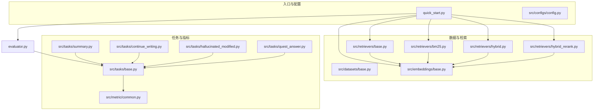
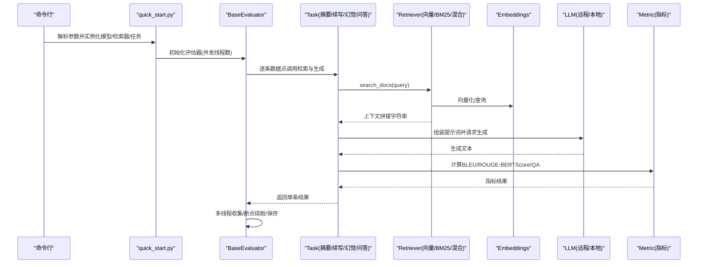
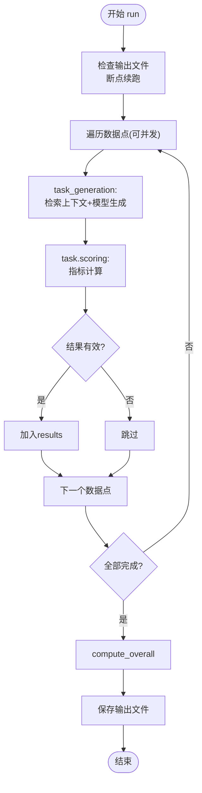
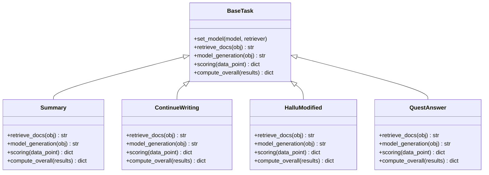
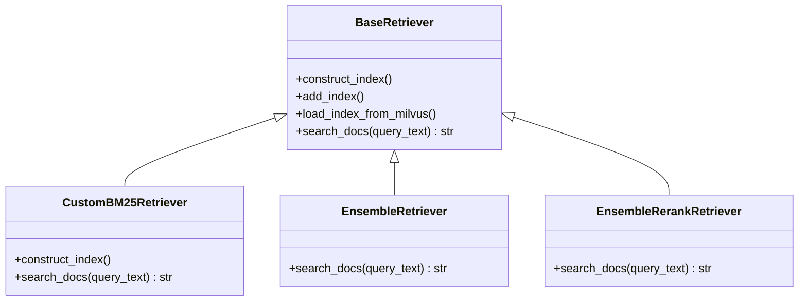
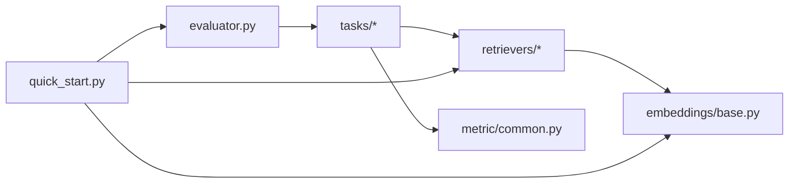

# 数据流和处理流程

<cite>
**本文引用的文件**
- [README.md](file://README.md)
- [quick_start.py](file://quick_start.py)
- [evaluator.py](file://evaluator.py)
- [src/configs/config.py](file://src/configs/config.py)
- [src/tasks/base.py](file://src/tasks/base.py)
- [src/tasks/summary.py](file://src/tasks/summary.py)
- [src/tasks/continue_writing.py](file://src/tasks/continue_writing.py)
- [src/tasks/hallucinated_modified.py](file://src/tasks/hallucinated_modified.py)
- [src/tasks/quest_answer.py](file://src/tasks/quest_answer.py)
- [src/retrievers/base.py](file://src/retrievers/base.py)
- [src/retrievers/bm25.py](file://src/retrievers/bm25.py)
- [src/retrievers/hybrid.py](file://src/retrievers/hybrid.py)
- [src/retrievers/hybrid_rerank.py](file://src/retrievers/hybrid_rerank.py)
- [src/embeddings/base.py](file://src/embeddings/base.py)
- [src/metric/common.py](file://src/metric/common.py)
</cite>

## 目录
1. [引言](#引言)
2. [项目结构](#项目结构)
3. [核心组件](#核心组件)
4. [架构总览](#架构总览)
5. [详细组件分析](#详细组件分析)
6. [依赖分析](#依赖分析)
7. [性能考虑](#性能考虑)
8. [故障排查指南](#故障排查指南)
9. [结论](#结论)
10. [附录](#附录)

## 引言
本文件面向CRUD-RAG系统的使用者与开发者，系统性梳理从输入数据到最终评估结果的完整数据处理管道。重点覆盖以下方面：
- 数据预处理：文档分块、向量化索引构建与加载、检索器初始化
- 检索上下文生成：基于查询的相似度检索与上下文拼接
- 模型推理：提示词模板组装、大语言模型请求与响应解析
- 结果评估：BLEU、ROUGE-L、BERTScore、RAGQuestEval等指标计算与整体统计
- 并发处理：多线程执行策略、资源管理与错误恢复
- 数据持久化：结果写入、断点续跑与输出目录组织

## 项目结构
仓库采用按功能域划分的层次化组织方式，核心目录与职责如下：
- data：包含基准数据集与检索数据库（80000+新闻文档）
- src：核心源码，按领域拆分
  - configs：配置项（如OpenAI API密钥、本地模型路径等）
  - datasets：数据集加载接口（抽象基类）
  - embeddings：嵌入模型封装（SentenceTransformer/CrossEncoder）
  - llms：大语言模型适配层（抽象基类与具体实现）
  - metric：评估指标（BLEU、ROUGE-L、BERTScore、QuestEval）
  - prompts：任务提示词模板
  - quest_eval：RAGQuestEval评测所需问答对与辅助逻辑
  - retrievers：检索器（基础向量检索、BM25、混合检索、重排序检索）
  - tasks：评估任务（摘要、续写、幻觉修正、问答）

图表来源
- [quick_start.py:1-110](file://quick_start.py#L1-L110)
- [evaluator.py:1-192](file://evaluator.py#L1-L192)
- [src/tasks/base.py:1-74](file://src/tasks/base.py#L1-L74)
- [src/retrievers/base.py:1-142](file://src/retrievers/base.py#L1-L142)
- [src/retrievers/bm25.py:1-92](file://src/retrievers/bm25.py#L1-L92)
- [src/retrievers/hybrid.py:1-81](file://src/retrievers/hybrid.py#L1-L81)
- [src/retrievers/hybrid_rerank.py:1-81](file://src/retrievers/hybrid_rerank.py#L1-L81)
- [src/embeddings/base.py:1-88](file://src/embeddings/base.py#L1-L88)
- [src/metric/common.py:1-117](file://src/metric/common.py#L1-L117)

章节来源
- [README.md:27-68](file://README.md#L27-L68)
- [quick_start.py:1-110](file://quick_start.py#L1-L110)

## 核心组件
- 评估器（BaseEvaluator）：负责并发调度、断点续跑、结果聚合与持久化
- 任务（BaseTask及子类）：定义检索、生成、评分与总体统计的接口与实现
- 检索器（BaseRetriever、CustomBM25Retriever、EnsembleRetriever、EnsembleRerankRetriever）：构建/加载向量索引，执行相似度检索
- 嵌入模型（HuggingfaceEmbeddings）：封装SentenceTransformer/CrossEncoder
- 指标（metric.common）：BLEU、ROUGE-L、BERTScore等计算工具
- 配置（config.py）：模型访问密钥与本地模型路径等

章节来源
- [evaluator.py:13-192](file://evaluator.py#L13-L192)
- [src/tasks/base.py:13-74](file://src/tasks/base.py#L13-L74)
- [src/retrievers/base.py:16-142](file://src/retrievers/base.py#L16-L142)
- [src/embeddings/base.py:14-88](file://src/embeddings/base.py#L14-L88)
- [src/metric/common.py:13-117](file://src/metric/common.py#L13-L117)
- [src/configs/config.py:1-14](file://src/configs/config.py#L1-L14)

## 架构总览
下图展示端到端数据流：命令行参数驱动初始化，评估器并发调用任务，任务通过检索器获取上下文，结合提示词模板调用LLM生成文本，随后进行指标计算与结果汇总。

图表来源
- [quick_start.py:54-108](file://quick_start.py#L54-L108)
- [evaluator.py:42-151](file://evaluator.py#L42-L151)
- [src/tasks/base.py:38-65](file://src/tasks/base.py#L38-L65)
- [src/retrievers/base.py:133-141](file://src/retrievers/base.py#L133-L141)
- [src/embeddings/base.py:58-86](file://src/embeddings/base.py#L58-L86)
- [src/metric/common.py:23-85](file://src/metric/common.py#L23-L85)

## 详细组件分析

### 评估器（BaseEvaluator）
- 职责
  - 线程安全的任务执行：使用锁保护共享资源，避免竞态条件
  - 并发调度：ThreadPoolExecutor按num_threads并发执行
  - 断点续跑：读取已存在的输出文件，跳过已完成样本
  - 结果聚合与持久化：保存info、overall、results
- 关键流程
  - task_generation：先检索上下文，再模型生成
  - multithread_batch_scoring：并发处理数据点，异常捕获与过滤无效结果
  - run：统一入口，调用评分与保存

图表来源
- [evaluator.py:56-151](file://evaluator.py#L56-L151)

章节来源
- [evaluator.py:13-192](file://evaluator.py#L13-L192)

### 任务（BaseTask与子类）
- 抽象接口
  - set_model：注入模型与检索器
  - retrieve_docs：根据数据点构造查询并返回上下文
  - model_generation：组装提示词并调用LLM生成
  - scoring：返回metrics、log、valid字段
  - compute_overall：对results做整体统计
- 子类实现要点
  - Summary：以事件为查询，生成摘要
  - ContinueWriting：以前缀为查询，续写故事
  - HalluModified：以新闻开头与幻觉续写为输入，修正生成
  - QuestAnswer：以问题为查询，回答问题（支持1/2/3篇上下文变体）

图表来源
- [src/tasks/base.py:13-74](file://src/tasks/base.py#L13-L74)
- [src/tasks/summary.py:12-121](file://src/tasks/summary.py#L12-L121)
- [src/tasks/continue_writing.py:13-119](file://src/tasks/continue_writing.py#L13-L119)
- [src/tasks/hallucinated_modified.py:14-124](file://src/tasks/hallucinated_modified.py#L14-L124)
- [src/tasks/quest_answer.py:14-134](file://src/tasks/quest_answer.py#L14-L134)

章节来源
- [src/tasks/base.py:13-74](file://src/tasks/base.py#L13-L74)
- [src/tasks/summary.py:12-121](file://src/tasks/summary.py#L12-L121)
- [src/tasks/continue_writing.py:13-119](file://src/tasks/continue_writing.py#L13-L119)
- [src/tasks/hallucinated_modified.py:14-124](file://src/tasks/hallucinated_modified.py#L14-L124)
- [src/tasks/quest_answer.py:14-134](file://src/tasks/quest_answer.py#L14-L134)

### 检索器（Retriever）
- BaseRetriever
  - 支持从零构建索引或从Milvus加载已有索引
  - 分块处理节点，避免Milvus写入限制
  - 提供query_engine与search_docs接口
- CustomBM25Retriever
  - 使用Elasticsearch作为BM25检索后端
  - 构建索引与查询DSL
- EnsembleRetriever（混合检索）
  - 融合BM25与向量检索结果，使用RRF融合策略
- EnsembleRerankRetriever（重排检索）
  - 在混合检索基础上，使用bge-reranker对候选文档重排

图表来源
- [src/retrievers/base.py:16-142](file://src/retrievers/base.py#L16-L142)
- [src/retrievers/bm25.py:14-92](file://src/retrievers/bm25.py#L14-L92)
- [src/retrievers/hybrid.py:13-81](file://src/retrievers/hybrid.py#L13-L81)
- [src/retrievers/hybrid_rerank.py:26-81](file://src/retrievers/hybrid_rerank.py#L26-L81)

章节来源
- [src/retrievers/base.py:16-142](file://src/retrievers/base.py#L16-L142)
- [src/retrievers/bm25.py:14-92](file://src/retrievers/bm25.py#L14-L92)
- [src/retrievers/hybrid.py:13-81](file://src/retrievers/hybrid.py#L13-L81)
- [src/retrievers/hybrid_rerank.py:26-81](file://src/retrievers/hybrid_rerank.py#L26-L81)

### 嵌入模型（Embeddings）
- 封装SentenceTransformer/CrossEncoder，支持bi-encoder与cross-encoder两种模式
- 提供embed_query/embed_documents/predict接口
- 默认模型名称与缓存路径可通过环境变量或参数控制

章节来源
- [src/embeddings/base.py:14-88](file://src/embeddings/base.py#L14-L88)

### 指标（Metric）
- BLEU：使用jieba分词，支持惩罚与多精度
- ROUGE-L：基于evaluate库
- BERTScore：基于text2vec相似度
- 共同特性：异常捕获装饰器保证稳定性

章节来源
- [src/metric/common.py:13-117](file://src/metric/common.py#L13-L117)

## 依赖分析
- 组件耦合
  - 评估器与任务：通过抽象接口解耦，便于扩展新任务
  - 任务与检索器：通过search_docs约定交互，支持多种检索器实现
  - 任务与指标：通过scoring接口返回标准化指标字典
  - 检索器与嵌入：检索器内部封装Embeddings，便于替换不同模型
- 外部依赖
  - LlamaIndex、LangChain、Elasticsearch、Milvus、FlagReranker等
- 潜在循环依赖
  - 当前模块间为单向依赖，未见循环导入迹象

图表来源
- [evaluator.py:14-41](file://evaluator.py#L14-L41)
- [quick_start.py:59-89](file://quick_start.py#L59-L89)
- [src/tasks/base.py:34-36](file://src/tasks/base.py#L34-L36)

章节来源
- [evaluator.py:14-41](file://evaluator.py#L14-L41)
- [quick_start.py:59-89](file://quick_start.py#L59-L89)

## 性能考虑
- 并发策略
  - ThreadPoolExecutor按num_threads并发执行数据点处理
  - 使用Lock保护共享资源，避免竞态；但注意锁粒度可能成为瓶颈
- 索引构建
  - 分块8000条节点写入Milvus，缓解内存与写入压力
  - BM25/Elasticsearch构建索引时建议离线执行，避免重复构建
- I/O与网络
  - LLM请求与指标计算均为I/O密集或网络密集，适合并发
  - 建议合理设置num_threads，避免超出服务端限流
- 缓存与复用
  - 指标计算与嵌入模型具备缓存能力，减少重复开销
  - 输出文件断点续跑避免重复计算

## 故障排查指南
- 常见问题与定位
  - 索引构建失败：确认Milvus服务状态与权限；检查chunk_size与分块策略
  - Elasticsearch连接失败：核对es_host/port/scheme配置
  - LLM请求异常：检查API密钥与代理设置；查看safe_request异常日志
  - 输出为空或无效：检查scoring返回valid字段；确认生成文本是否为空
- 错误恢复
  - 评估器自动读取已有输出文件，跳过已完成样本
  - 异常捕获与warning日志记录，避免中断整体流程
- 建议
  - 开启断点续跑，逐步扩大样本规模
  - 对高成本指标（如BERTScore、QuestEval）按需启用

章节来源
- [evaluator.py:68-100](file://evaluator.py#L68-L100)
- [evaluator.py:170-190](file://evaluator.py#L170-L190)
- [src/retrievers/base.py:74-87](file://src/retrievers/base.py#L74-L87)
- [src/retrievers/bm25.py:44-68](file://src/retrievers/bm25.py#L44-L68)

## 结论
本系统通过清晰的抽象与模块化设计，实现了从数据到评估的完整流水线。评估器提供稳定的并发与断点续跑能力，任务层聚焦于不同下游任务的提示词与指标，检索器层支持向量、BM25与混合/重排策略，嵌入层与指标层提供了丰富的评测手段。建议在实际部署中关注并发度、外部服务可用性与缓存策略，以获得更优的吞吐与稳定性。

## 附录
- 快速开始流程
  - 安装依赖、启动Milvus服务、准备嵌入模型权重
  - 修改配置文件中的密钥与本地模型路径
  - 运行quick_start.py，选择模型、检索器、任务与线程数
  - 查看输出目录下的结果文件

章节来源
- [README.md:70-105](file://README.md#L70-L105)
- [quick_start.py:14-108](file://quick_start.py#L14-L108)
- [src/configs/config.py:1-14](file://src/configs/config.py#L1-L14)