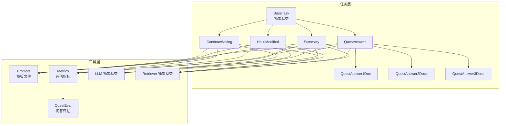
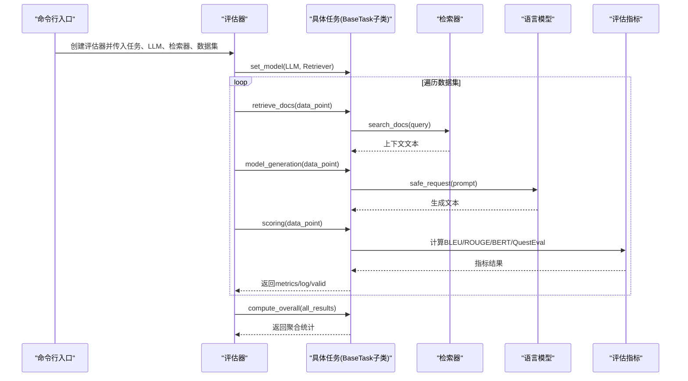
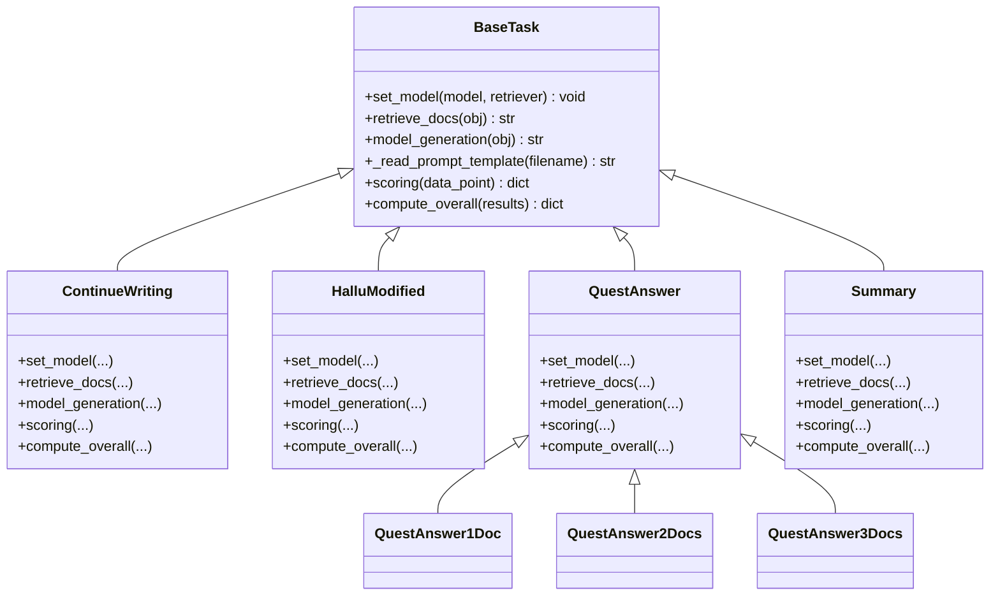
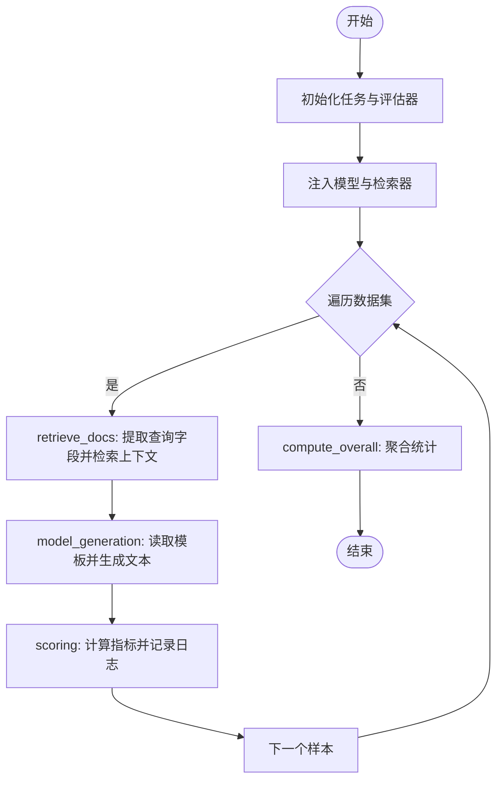
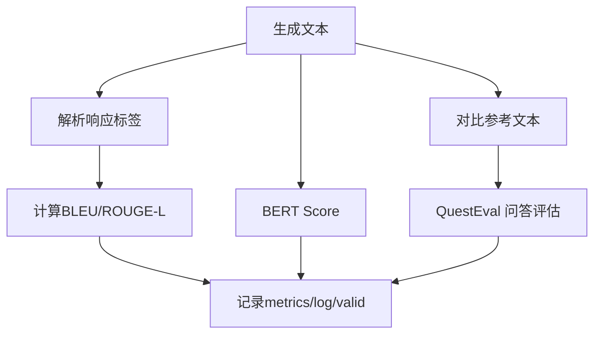
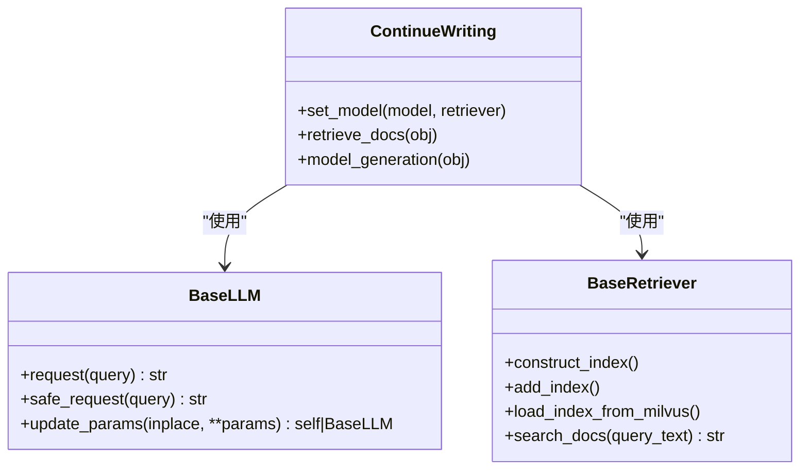
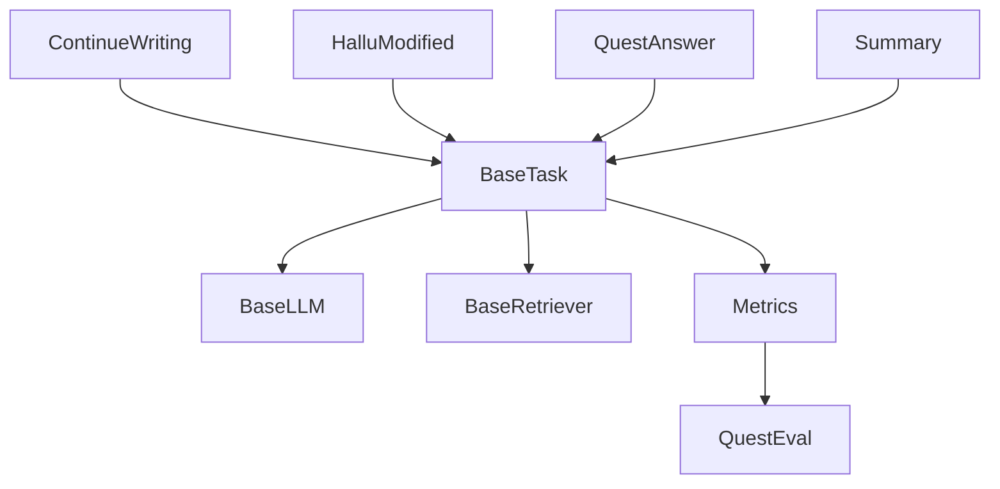

# 任务基类设计

<cite>
**本文引用的文件**
- [src/tasks/base.py](file://src/tasks/base.py)
- [src/tasks/continue_writing.py](file://src/tasks/continue_writing.py)
- [src/tasks/hallucinated_modified.py](file://src/tasks/hallucinated_modified.py)
- [src/tasks/quest_answer.py](file://src/tasks/quest_answer.py)
- [src/tasks/summary.py](file://src/tasks/summary.py)
- [src/metric/common.py](file://src/metric/common.py)
- [src/metric/quest_eval.py](file://src/metric/quest_eval.py)
- [src/prompts/continue_writing.txt](file://src/prompts/continue_writing.txt)
- [src/prompts/quest_answer.txt](file://src/prompts/quest_answer.txt)
- [src/prompts/hallu_mod.txt](file://src/prompts/hallu_mod.txt)
- [src/llms/base.py](file://src/llms/base.py)
- [src/retrievers/base.py](file://src/retrievers/base.py)
- [quick_start.py](file://quick_start.py)
</cite>

## 目录
1. [引言](#引言)
2. [项目结构](#项目结构)
3. [核心组件](#核心组件)
4. [架构概览](#架构概览)
5. [详细组件分析](#详细组件分析)
6. [依赖分析](#依赖分析)
7. [性能考虑](#性能考虑)
8. [故障排查指南](#故障排查指南)
9. [结论](#结论)
10. [附录](#附录)

## 引言
本设计文档围绕 CRUD-RAG 系统中的 BaseTask 任务基类展开，系统化阐述其抽象设计理念、接口规范、继承模式与扩展机制。文档重点解释任务执行流程、上下文检索机制、生成结果处理、与语言模型与检索器的集成方式及参数传递机制，并提供扩展新任务类型的实践指导与常见陷阱规避建议。读者无需深入技术背景即可理解任务基类的设计思想与使用方法。

## 项目结构
CRUD-RAG 的任务体系位于 src/tasks 目录下，采用“基类 + 多子类”的继承模式，统一抽象出任务生命周期的关键步骤；同时通过 src/prompts 提供模板化提示词，通过 src/metric 提供评估指标计算，通过 src/llms 与 src/retrievers 提供语言模型与检索器的通用能力。

图表来源
- [src/tasks/base.py:13-74](file://src/tasks/base.py#L13-L74)
- [src/tasks/continue_writing.py:13-119](file://src/tasks/continue_writing.py#L13-L119)
- [src/tasks/hallucinated_modified.py:14-124](file://src/tasks/hallucinated_modified.py#L14-L124)
- [src/tasks/quest_answer.py:14-134](file://src/tasks/quest_answer.py#L14-L134)
- [src/tasks/summary.py:12-121](file://src/tasks/summary.py#L12-L121)
- [src/prompts/continue_writing.txt:1-18](file://src/prompts/continue_writing.txt#L1-L18)
- [src/prompts/quest_answer.txt:1-15](file://src/prompts/quest_answer.txt#L1-L15)
- [src/prompts/hallu_mod.txt:1-23](file://src/prompts/hallu_mod.txt#L1-L23)
- [src/metric/common.py:23-86](file://src/metric/common.py#L23-L86)
- [src/metric/quest_eval.py:23-152](file://src/metric/quest_eval.py#L23-L152)
- [src/llms/base.py:6-47](file://src/llms/base.py#L6-L47)
- [src/retrievers/base.py:16-142](file://src/retrievers/base.py#L16-L142)

章节来源
- [src/tasks/base.py:13-74](file://src/tasks/base.py#L13-L74)
- [quick_start.py:91-108](file://quick_start.py#L91-L108)

## 核心组件
本节聚焦 BaseTask 抽象基类及其子类，阐明任务生命周期的职责划分与接口契约。

- 抽象基类 BaseTask
  - 职责：定义任务生命周期的统一接口，提供输出目录管理、可选的 QuestEval 与 BERT Score 评估开关、评分与整体统计的默认返回结构。
  - 关键接口：
    - set_model(model, retriever)：注入语言模型与检索器实例，供子类使用。
    - retrieve_docs(obj: dict) -> str：从输入样本中提取查询文本并调用检索器获取上下文。
    - model_generation(obj: dict) -> str：读取模板并拼接上下文，调用模型生成结果。
    - _read_prompt_template(filename: str)：读取模板文件，便于子类复用。
    - scoring(data_point: dict) -> dict：返回 metrics、log、valid 字段，用于记录指标、日志与有效性。
    - compute_overall(results: list[dict]) -> dict：对一批结果进行聚合统计。
  - 设计要点：通过抽象方法强制子类实现关键逻辑，同时提供默认实现或空实现，降低子类负担。

- 子类实现模式
  - 继承 BaseTask 并重写 set_model、retrieve_docs、model_generation、scoring、compute_overall。
  - 使用 _read_prompt_template 读取模板文件，结合模型 safe_request 安全请求接口生成文本。
  - 通过 QuestEval 与多种评估指标（BLEU、ROUGE-L、BERT Score）进行质量评估。

章节来源
- [src/tasks/base.py:13-74](file://src/tasks/base.py#L13-L74)
- [src/tasks/continue_writing.py:13-119](file://src/tasks/continue_writing.py#L13-L119)
- [src/tasks/hallucinated_modified.py:14-124](file://src/tasks/hallucinated_modified.py#L14-L124)
- [src/tasks/quest_answer.py:14-134](file://src/tasks/quest_answer.py#L14-L134)
- [src/tasks/summary.py:12-121](file://src/tasks/summary.py#L12-L121)

## 架构概览
下面的序列图展示了典型任务执行流程：初始化任务与评估器、注入模型与检索器、执行检索、生成文本、评分与汇总。

图表来源
- [quick_start.py:106-108](file://quick_start.py#L106-L108)
- [src/tasks/base.py:34-72](file://src/tasks/base.py#L34-L72)
- [src/tasks/continue_writing.py:33-99](file://src/tasks/continue_writing.py#L33-L99)
- [src/tasks/summary.py:32-98](file://src/tasks/summary.py#L32-L98)
- [src/metric/common.py:23-86](file://src/metric/common.py#L23-L86)
- [src/metric/quest_eval.py:92-129](file://src/metric/quest_eval.py#L92-L129)

## 详细组件分析

### BaseTask 抽象基类
- 设计理念
  - 通过抽象方法约束子类实现关键流程，保证任务执行的一致性与可扩展性。
  - 提供可选的 QuestEval 与 BERT Score 开关，便于按需启用高质量评估。
- 接口规范
  - set_model：注入 LLM 与 Retriever 实例，供后续检索与生成使用。
  - retrieve_docs：从样本字典中提取查询字段，调用检索器返回上下文字符串。
  - model_generation：读取模板、拼接上下文与输入，调用模型安全请求接口生成文本。
  - _read_prompt_template：从模板文件读取提示词，支持子类复用。
  - scoring：返回标准化结构，包含 metrics、log、valid 字段。
  - compute_overall：对批量结果进行聚合统计，子类可按需调整。
- 错误处理
  - 模板缺失时记录错误日志并返回空字符串，避免中断流程。
  - 评估指标函数通过装饰器捕获异常，保证评估过程稳健。

图表来源
- [src/tasks/base.py:13-74](file://src/tasks/base.py#L13-L74)
- [src/tasks/continue_writing.py:13-119](file://src/tasks/continue_writing.py#L13-L119)
- [src/tasks/hallucinated_modified.py:14-124](file://src/tasks/hallucinated_modified.py#L14-L124)
- [src/tasks/quest_answer.py:14-134](file://src/tasks/quest_answer.py#L14-L134)
- [src/tasks/summary.py:12-121](file://src/tasks/summary.py#L12-L121)

章节来源
- [src/tasks/base.py:13-74](file://src/tasks/base.py#L13-L74)

### 任务执行流程与上下文检索机制
- 执行流程
  - 初始化：根据命令行参数选择任务类型与评估器，创建任务实例。
  - 注入依赖：评估器调用任务的 set_model，注入 LLM 与 Retriever。
  - 数据循环：对每个样本执行 retrieve_docs 获取上下文，model_generation 生成文本，scoring 计算指标，最后 compute_overall 聚合统计。
- 上下文检索
  - 子类从样本字典中提取查询字段（如事件、问题、开头文本），调用检索器 search_docs 返回上下文。
  - 检索结果通常包含“给定上下文信息”分隔符，子类会截断以去除无关部分，仅保留有效上下文。

图表来源
- [quick_start.py:106-108](file://quick_start.py#L106-L108)
- [src/tasks/continue_writing.py:37-51](file://src/tasks/continue_writing.py#L37-L51)
- [src/tasks/summary.py:36-50](file://src/tasks/summary.py#L36-L50)
- [src/retrievers/base.py:133-140](file://src/retrievers/base.py#L133-L140)

章节来源
- [src/tasks/continue_writing.py:37-51](file://src/tasks/continue_writing.py#L37-L51)
- [src/tasks/summary.py:36-50](file://src/tasks/summary.py#L36-L50)
- [src/retrievers/base.py:133-140](file://src/retrievers/base.py#L133-L140)

### 生成结果处理与评估指标
- 生成结果处理
  - 子类通过模板拼接查询文本与检索上下文，调用模型 safe_request 获取响应。
  - 对响应进行解析，提取 <response> 标签内的文本作为最终生成结果。
- 评估指标
  - BLEU/ROUGE-L：通过公共评估模块计算，支持中文分词。
  - BERT Score：基于文本相似度模型计算，网络请求依赖外部服务。
  - QuestEval：基于问答对评估，支持自动问题生成与答案抽取，计算 F1 与召回率。

图表来源
- [src/tasks/continue_writing.py:44-51](file://src/tasks/continue_writing.py#L44-L51)
- [src/tasks/summary.py:42-50](file://src/tasks/summary.py#L42-L50)
- [src/metric/common.py:23-86](file://src/metric/common.py#L23-L86)
- [src/metric/quest_eval.py:92-129](file://src/metric/quest_eval.py#L92-L129)

章节来源
- [src/metric/common.py:23-86](file://src/metric/common.py#L23-L86)
- [src/metric/quest_eval.py:92-129](file://src/metric/quest_eval.py#L92-L129)

### 任务与语言模型、检索器的集成方式
- 语言模型集成
  - 通过 BaseLLM 抽象基类定义统一的请求接口与安全请求封装，子类实现具体请求逻辑。
  - 任务通过 set_model 注入 LLM 实例，使用 safe_request 发起请求，自动捕获异常并返回空字符串。
- 检索器集成
  - 通过 BaseRetriever 抽象基类构建/加载向量索引，提供 search_docs 查询接口。
  - 任务通过 retrieve_docs 调用检索器，获取与查询相关的上下文文本。

图表来源
- [src/llms/base.py:6-47](file://src/llms/base.py#L6-L47)
- [src/retrievers/base.py:16-142](file://src/retrievers/base.py#L16-L142)
- [src/tasks/continue_writing.py:33-36](file://src/tasks/continue_writing.py#L33-L36)

章节来源
- [src/llms/base.py:38-45](file://src/llms/base.py#L38-L45)
- [src/retrievers/base.py:133-140](file://src/retrievers/base.py#L133-L140)

### 参数传递机制与配置管理
- 基类参数
  - output_dir：输出目录，默认 ./output，不存在则自动创建。
  - quest_eval_model：QuestEval 使用的语言模型名称。
  - use_quest_eval/use_bert_score：控制是否启用 QuestEval 与 BERT Score。
- 子类参数
  - 子类在 __init__ 中接收上述参数，并在启用 QuestEval 时创建 QuestEval 实例。
- 命令行配置
  - 通过 quick_start.py 的参数解析，动态选择任务类型、模型、检索器、评估指标与数据集路径。

章节来源
- [src/tasks/base.py:14-32](file://src/tasks/base.py#L14-L32)
- [src/tasks/continue_writing.py:14-32](file://src/tasks/continue_writing.py#L14-L32)
- [quick_start.py:14-51](file://quick_start.py#L14-L51)

### 具体扩展新任务类型的实践指南
- 步骤
  - 新建文件 src/tasks/my_task.py，定义 MyTask(BaseTask) 子类。
  - 实现 set_model、retrieve_docs、model_generation、scoring、compute_overall。
  - 在 src/prompts 下添加模板文件 my_task.txt，并在 _read_prompt_template 中读取。
  - 在 quick_start.py 的 task_mapping 中注册新任务类型。
- 示例路径
  - 参考 ContinueWriting 的模板读取与生成流程：[src/tasks/continue_writing.py:53-51](file://src/tasks/continue_writing.py#L53-L51)
  - 参考 QuestAnswer 的模板读取与生成流程：[src/tasks/quest_answer.py:54-52](file://src/tasks/quest_answer.py#L54-L52)
  - 参考模板文件位置与格式：[src/prompts/continue_writing.txt:1-18](file://src/prompts/continue_writing.txt#L1-L18)，[src/prompts/quest_answer.txt:1-15](file://src/prompts/quest_answer.txt#L1-L15)

章节来源
- [src/tasks/continue_writing.py:53-51](file://src/tasks/continue_writing.py#L53-L51)
- [src/tasks/quest_answer.py:54-52](file://src/tasks/quest_answer.py#L54-L52)
- [src/prompts/continue_writing.txt:1-18](file://src/prompts/continue_writing.txt#L1-L18)
- [src/prompts/quest_answer.txt:1-15](file://src/prompts/quest_answer.txt#L1-L15)
- [quick_start.py:91-108](file://quick_start.py#L91-L108)

### 错误处理策略
- 模板缺失
  - 当模板文件不存在时，_read_prompt_template 记录错误日志并返回空字符串，避免中断任务执行。
- 模型请求异常
  - BaseLLM.safe_request 包装请求，捕获异常并返回空字符串，确保任务流程不中断。
- QuestEval 异常
  - QuestEval.quest_eval 使用 try-except 包裹，异常时返回默认值并记录日志，保证评估流程稳健。

章节来源
- [src/tasks/continue_writing.py:57-60](file://src/tasks/continue_writing.py#L57-L60)
- [src/llms/base.py:38-45](file://src/llms/base.py#L38-L45)
- [src/metric/quest_eval.py:121-127](file://src/metric/quest_eval.py#L121-L127)

## 依赖分析
- 组件耦合
  - BaseTask 与子类之间为强继承耦合，子类必须实现若干抽象方法。
  - 子类与 LLM、Retriever、Metrics 之间为弱耦合，通过 set_model 注入依赖，便于替换与测试。
- 外部依赖
  - 评估指标依赖 evaluate、jieba、text2vec 等库。
  - QuestEval 依赖外部语言模型与网络请求。
- 循环依赖
  - 任务层与工具层分离明确，未发现循环依赖迹象。

图表来源
- [src/tasks/base.py:13-74](file://src/tasks/base.py#L13-L74)
- [src/llms/base.py:6-47](file://src/llms/base.py#L6-L47)
- [src/retrievers/base.py:16-142](file://src/retrievers/base.py#L16-L142)
- [src/metric/common.py:7-10](file://src/metric/common.py#L7-L10)
- [src/metric/quest_eval.py:10-11](file://src/metric/quest_eval.py#L10-L11)

章节来源
- [src/tasks/base.py:13-74](file://src/tasks/base.py#L13-L74)
- [src/llms/base.py:6-47](file://src/llms/base.py#L6-L47)
- [src/retrievers/base.py:16-142](file://src/retrievers/base.py#L16-L142)
- [src/metric/common.py:7-10](file://src/metric/common.py#L7-L10)
- [src/metric/quest_eval.py:10-11](file://src/metric/quest_eval.py#L10-L11)

## 性能考虑
- 检索效率
  - 检索器支持向量索引与 BM25 混合检索，可通过 similarity_top_k 控制返回上下文数量，平衡召回与速度。
- 生成稳定性
  - 使用 safe_request 封装请求，避免异常中断；适当设置 temperature 与 max_new_tokens 以平衡多样性与可控性。
- 评估开销
  - QuestEval 与 BERT Score 依赖网络请求与外部模型，建议按需启用；BLEU/ROUGE-L 本地计算开销较小。
- 批量处理
  - 通过多线程与数据集迭代器提升吞吐量，注意控制并发与资源占用。

## 故障排查指南
- 模板文件缺失
  - 症状：任务执行时报错或生成为空。
  - 处理：检查模板文件是否存在，确认路径与文件名一致。
- 检索结果为空
  - 症状：retrieve_docs 返回空字符串。
  - 处理：确认样本字段与检索器查询字段一致；检查索引构建与相似度阈值。
- 生成文本无效
  - 症状：scoring 返回 valid=False。
  - 处理：检查模板解析逻辑与响应标签匹配；确认 safe_request 是否成功。
- QuestEval 异常
  - 症状：QuestEval 返回默认值或日志警告。
  - 处理：检查网络连接与模型可用性；确认 ground truth 与生成文本格式正确。

章节来源
- [src/tasks/continue_writing.py:57-60](file://src/tasks/continue_writing.py#L57-L60)
- [src/metric/quest_eval.py:121-127](file://src/metric/quest_eval.py#L121-L127)

## 结论
BaseTask 抽象基类通过清晰的接口契约与可选的评估能力，为 CRUD-RAG 系统提供了高度可扩展的任务框架。子类只需关注检索、生成与评分三个关键环节，即可快速扩展新的任务类型。配合 LLM 与检索器的统一抽象，系统在保持一致性的同时具备良好的可维护性与可扩展性。

## 附录
- 最佳实践
  - 明确样本字段与检索器查询字段的映射关系，避免检索失败。
  - 合理设置检索 top-k 与温度参数，兼顾召回与可控性。
  - 按需启用 QuestEval 与 BERT Score，减少不必要的网络开销。
  - 在模板中严格使用 <response> 标签包裹生成文本，便于解析。
- 常见陷阱
  - 忽视模板缺失导致的空生成。
  - 检索结果未截断导致上下文污染。
  - 未校验生成文本有效性导致统计偏差。
  - QuestEval 依赖外部服务，未做降级处理。