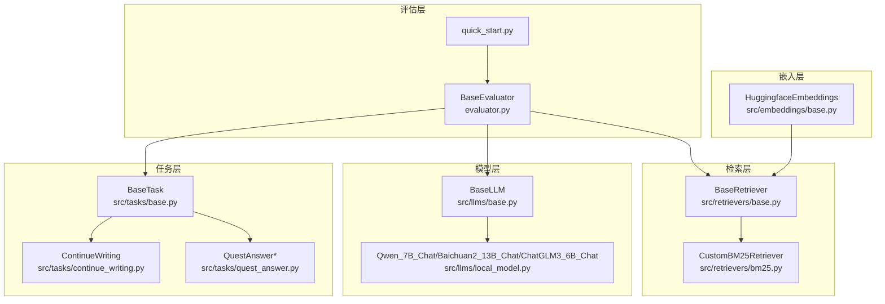
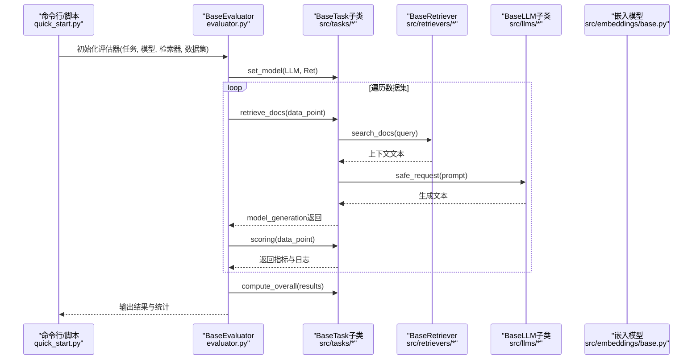
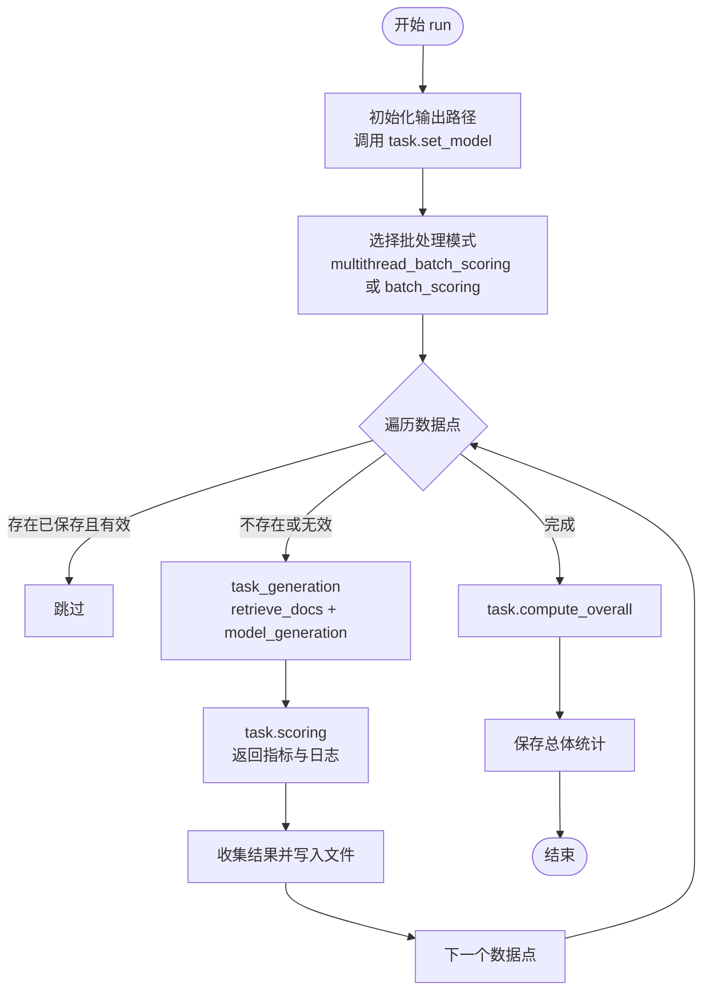
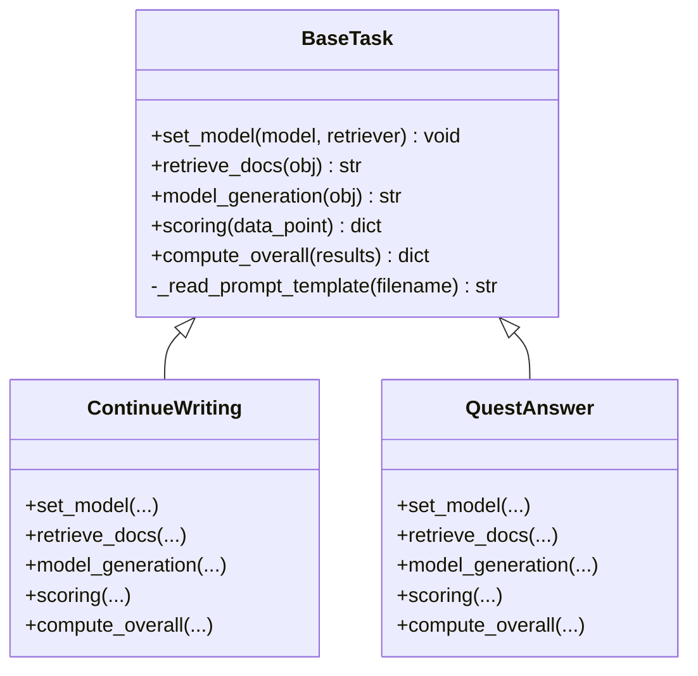
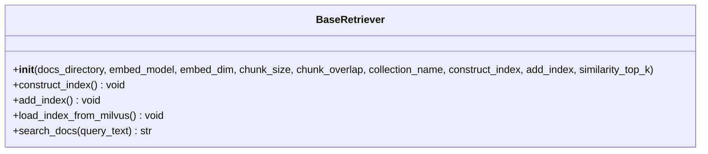
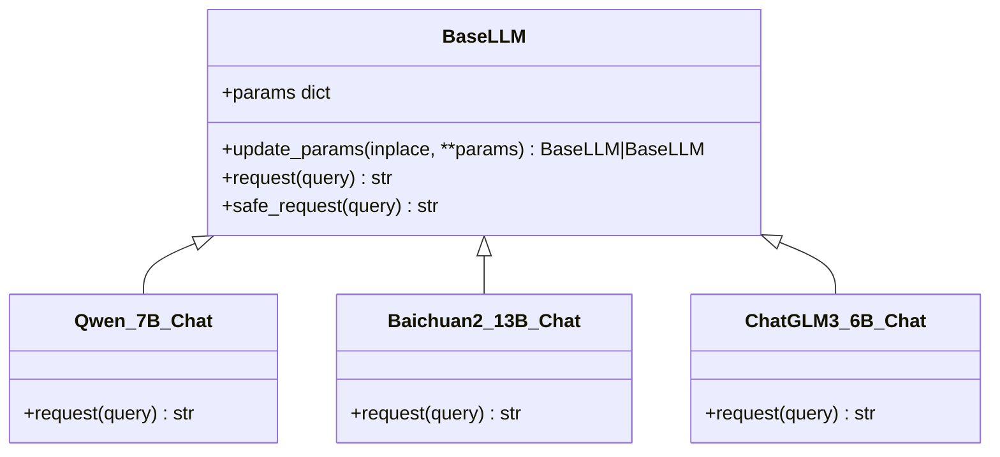
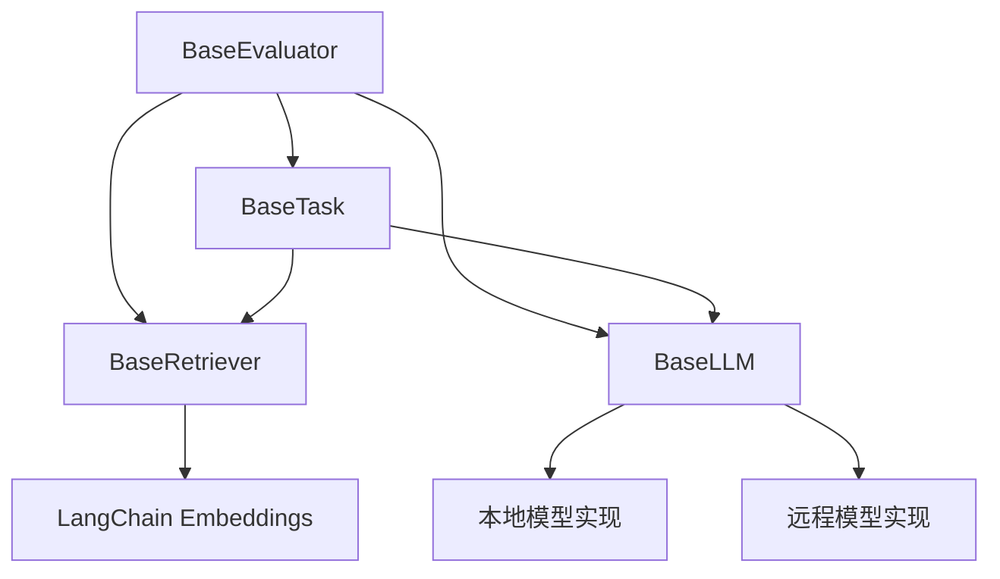

# 核心组件设计

<cite>
**本文档引用的文件**
- [src/tasks/base.py](file://src/tasks/base.py)
- [src/retrievers/base.py](file://src/retrievers/base.py)
- [src/llms/base.py](file://src/llms/base.py)
- [evaluator.py](file://evaluator.py)
- [src/embeddings/base.py](file://src/embeddings/base.py)
- [src/tasks/continue_writing.py](file://src/tasks/continue_writing.py)
- [src/tasks/quest_answer.py](file://src/tasks/quest_answer.py)
- [src/retrievers/bm25.py](file://src/retrievers/bm25.py)
- [src/llms/local_model.py](file://src/llms/local_model.py)
- [src/configs/config.py](file://src/configs/config.py)
- [quick_start.py](file://quick_start.py)
- [README.md](file://README.md)
</cite>

## 目录
1. [简介](#简介)
2. [项目结构](#项目结构)
3. [核心组件](#核心组件)
4. [架构总览](#架构总览)
5. [详细组件分析](#详细组件分析)
6. [依赖关系分析](#依赖关系分析)
7. [性能考量](#性能考量)
8. [故障排除指南](#故障排除指南)
9. [结论](#结论)
10. [附录](#附录)

## 简介
本设计文档围绕CRUD-RAG系统的核心组件展开，重点阐释以下四个抽象基类的设计理念与实现细节：
- BaseEvaluator：评估器，负责协调任务执行、多线程批处理、结果持久化与整体统计。
- BaseTask：任务基类，定义具体任务（如续写、问答）的检索、生成、评分与汇总流程。
- BaseRetriever：检索器基类，封装向量索引构建、加载与查询引擎装配，并提供统一的搜索接口。
- BaseLLM：语言模型基类，统一参数管理、请求封装与安全请求机制。

文档将从职责分工、接口设计、继承关系、组件间依赖与交互模式、数据传递与状态管理、错误处理机制等方面进行深入解析，并提供基于现有实现的扩展开发指导。

## 项目结构
CRUD-RAG采用按功能域分层的模块化组织方式，核心目录与文件如下：
- src/tasks：任务实现与基类，包含任务基类与多种具体任务（如续写、问答等）
- src/retrievers：检索器实现与基类，包含向量检索与BM25检索等
- src/llms：语言模型实现与基类，包含本地与远程模型适配
- src/embeddings：嵌入模型封装，适配LangChain Embeddings接口
- src/metric：评估指标实现（BLEU、ROUGE、BERTScore、RAGQuestEval）
- src/prompts：提示模板资源
- evaluator.py：评估器主入口，协调任务、模型与检索器
- quick_start.py：快速启动脚本，演示如何组合各组件进行评测
- README.md：项目说明与运行指南

图表来源
- [src/tasks/base.py:13-74](file://src/tasks/base.py#L13-L74)
- [src/tasks/continue_writing.py:13-119](file://src/tasks/continue_writing.py#L13-L119)
- [src/tasks/quest_answer.py:14-134](file://src/tasks/quest_answer.py#L14-L134)
- [src/retrievers/base.py:16-142](file://src/retrievers/base.py#L16-L142)
- [src/retrievers/bm25.py:14-92](file://src/retrievers/bm25.py#L14-L92)
- [src/llms/base.py:6-47](file://src/llms/base.py#L6-L47)
- [src/llms/local_model.py:11-114](file://src/llms/local_model.py#L11-L114)
- [src/embeddings/base.py:14-88](file://src/embeddings/base.py#L14-L88)
- [evaluator.py:13-192](file://evaluator.py#L13-L192)
- [quick_start.py:1-110](file://quick_start.py#L1-L110)

章节来源
- [README.md:27-68](file://README.md#L27-L68)
- [quick_start.py:1-110](file://quick_start.py#L1-L110)

## 核心组件
本节概述四大核心组件的职责与接口要点：
- BaseEvaluator：协调任务执行、多线程批处理、结果持久化与整体统计；支持断点续评与输出路径组织。
- BaseTask：定义任务生命周期方法（set_model、retrieve_docs、model_generation、scoring、compute_overall），并提供指标与日志结构约定。
- BaseRetriever：封装向量索引构建/加载、查询引擎装配与统一搜索接口；支持Milvus向量存储与分块索引。
- BaseLLM：统一参数管理与安全请求封装；提供可覆盖的request抽象方法与通用更新参数能力。

章节来源
- [evaluator.py:13-192](file://evaluator.py#L13-L192)
- [src/tasks/base.py:13-74](file://src/tasks/base.py#L13-L74)
- [src/retrievers/base.py:16-142](file://src/retrievers/base.py#L16-L142)
- [src/llms/base.py:6-47](file://src/llms/base.py#L6-L47)

## 架构总览
下图展示了评估器与四大核心组件之间的交互关系与数据流：

图表来源
- [evaluator.py:13-192](file://evaluator.py#L13-L192)
- [src/tasks/base.py:34-72](file://src/tasks/base.py#L34-L72)
- [src/retrievers/base.py:133-141](file://src/retrievers/base.py#L133-L141)
- [src/llms/base.py:34-46](file://src/llms/base.py#L34-L46)
- [src/embeddings/base.py:14-88](file://src/embeddings/base.py#L14-L88)

## 详细组件分析

### BaseEvaluator 评估器
- 职责与目标
  - 协调任务执行：通过set_model注入模型与检索器实例，确保任务在生成阶段能访问到上下文与LLM。
  - 批处理与并发：提供单线程与多线程两种批处理模式，支持断点续评、进度条与原始数据保留。
  - 结果持久化：自动组织输出目录与文件名，保存完整信息、总体统计与逐样本结果。
  - 统计汇总：调用任务的compute_overall进行整体指标计算，必要时保存RAGQuestEval问答对。
- 关键接口与行为
  - 初始化：接收任务、模型、检索器、数据集与线程数，构造输出路径并调用任务的set_model。
  - 多线程批处理：multithread_batch_scoring，利用线程池并发执行任务生成与评分，自动跳过已存在的有效结果。
  - 单线程批处理：batch_scoring，顺序执行，便于调试与小规模测试。
  - 运行流程：run，整合上述步骤，捕获异常并保证输出完整性。
  - 安全生成：task_generation，封装检索与生成过程，异常时回退为空上下文。
- 状态管理与错误处理
  - 使用Lock保护共享资源（如QuestEval保存）。
  - 对检索失败、生成失败、评分异常进行日志记录与跳过处理。
  - 断点续评：读取已有结果，跳过已验证有效的样本，避免重复计算。
- 性能特性
  - 多线程并行显著提升吞吐，但需注意锁竞争与I/O瓶颈。
  - 输出缓存减少重复计算，提高迭代效率。

图表来源
- [evaluator.py:118-151](file://evaluator.py#L118-L151)
- [evaluator.py:56-107](file://evaluator.py#L56-L107)
- [evaluator.py:158-191](file://evaluator.py#L158-L191)

章节来源
- [evaluator.py:13-192](file://evaluator.py#L13-L192)

### BaseTask 任务基类
- 职责与目标
  - 定义任务生命周期：设置模型与检索器、执行检索、生成文本、评分与汇总。
  - 提供指标与日志结构约定：scoring返回包含metrics、log与valid字段的字典；compute_overall返回总体统计。
  - 可选集成RAGQuestEval与BERTScore等指标，支持条件启用。
- 关键接口与行为
  - set_model：注入模型与检索器实例，供子类使用。
  - retrieve_docs：根据输入对象提取查询语句并调用检索器获取上下文。
  - model_generation：读取提示模板，拼接查询与上下文，调用LLM生成文本。
  - scoring：计算BLEU、ROUGE-L、BERTScore、QA F1/Recall等指标，记录生成文本与时间戳等日志。
  - compute_overall：对有效结果求平均，必要时对QA指标做分母归一化。
- 设计要点
  - 抽象化：scoring与compute_overall留待子类实现，确保不同任务的差异化指标体系。
  - 可扩展性：支持QuestEval与BERTScore开关，便于按需启用更重的评估开销。
  - 日志与可追溯性：记录生成文本、参考文本、评估时间等，便于复盘与可视化。

图表来源
- [src/tasks/base.py:13-74](file://src/tasks/base.py#L13-L74)
- [src/tasks/continue_writing.py:13-119](file://src/tasks/continue_writing.py#L13-L119)
- [src/tasks/quest_answer.py:14-134](file://src/tasks/quest_answer.py#L14-L134)

章节来源
- [src/tasks/base.py:13-74](file://src/tasks/base.py#L13-L74)
- [src/tasks/continue_writing.py:13-119](file://src/tasks/continue_writing.py#L13-L119)
- [src/tasks/quest_answer.py:14-134](file://src/tasks/quest_answer.py#L14-L134)

### BaseRetriever 检索器基类
- 职责与目标
  - 封装向量索引构建与加载：支持从磁盘加载或重新构建索引，适配Milvus向量数据库。
  - 查询引擎装配：基于VectorIndexRetriever与RetrieverQueryEngine组装统一查询接口。
  - 文档检索：对外提供search_docs，返回拼接后的上下文文本。
- 关键接口与行为
  - 构造函数：接收文档目录、嵌入模型、分块大小、相似度Top-K等参数；根据标志位决定是否构建或加载索引。
  - 构建索引：分块处理节点，避免Milvus写入限制，循环写入并更新StorageContext。
  - 加载索引：从Milvus加载空索引，结合ServiceContext与Embedding模型准备查询环境。
  - 搜索：调用query_engine查询，解析响应文本，过滤文件路径信息后返回上下文。
- 设计要点
  - 抽象化：对外仅暴露search_docs，内部细节由LlamaIndex与Milvus封装。
  - 可扩展性：支持add_index增量添加文档，便于动态更新知识库。
  - 参数化：collection_name、similarity_top_k等参数贯穿整个检索链路，影响输出路径与结果质量。

图表来源
- [src/retrievers/base.py:16-142](file://src/retrievers/base.py#L16-L142)

章节来源
- [src/retrievers/base.py:16-142](file://src/retrievers/base.py#L16-L142)

### BaseLLM 语言模型基类
- 职责与目标
  - 统一参数管理：以字典形式维护模型参数，支持原地更新与深拷贝更新两种策略。
  - 请求封装：定义抽象request方法，子类实现具体推理逻辑；提供safe_request统一异常处理。
  - 可扩展性：支持本地模型（如Qwen、Baichuan、ChatGLM）与远程模型（如GPT系列）。
- 关键接口与行为
  - 初始化：接收模型名称、温度、最大新token数、top_p、top_k等参数，合并更多自定义参数。
  - 更新参数：update_params支持inplace与非inplace两种模式，便于动态调整生成策略。
  - 安全请求：safe_request包裹request，捕获异常并返回空字符串，避免中断评估流程。
- 设计要点
  - 抽象化：request为纯虚方法，子类必须实现；便于替换不同推理后端。
  - 异常健壮性：safe_request确保LLM调用失败不影响整体评估流程。
  - 参数一致性：与评估器输出路径命名规则关联，便于结果对比与归档。

图表来源
- [src/llms/base.py:6-47](file://src/llms/base.py#L6-L47)
- [src/llms/local_model.py:11-114](file://src/llms/local_model.py#L11-L114)

章节来源
- [src/llms/base.py:6-47](file://src/llms/base.py#L6-L47)
- [src/llms/local_model.py:11-114](file://src/llms/local_model.py#L11-L114)

### 具体使用示例与扩展开发指导
- 在quick_start.py中，演示了如何组合各组件：
  - 选择模型：根据命令行参数选择GPT或本地模型（Qwen_7B_Chat等）。
  - 选择嵌入模型：使用HuggingfaceEmbeddings作为LangChain Embeddings实现。
  - 选择检索器：支持BaseRetriever、CustomBM25Retriever、EnsembleRetriever与EnsembleRerankRetriever。
  - 选择任务：支持事件摘要、续写、幻觉修正与问答等任务。
  - 启动评估：创建BaseEvaluator并调用run，自动完成检索、生成、评分与统计。
- 扩展开发建议
  - 新增任务：继承BaseTask，实现set_model、retrieve_docs、model_generation、scoring与compute_overall。
  - 新增检索器：继承BaseRetriever或自定义查询逻辑（如CustomBM25Retriever），实现search_docs。
  - 新增模型：继承BaseLLM，实现request方法，确保与tokenizer与模型推理框架兼容。
  - 注意事项：保持输入输出格式一致，遵循scoring返回结构；在safe_request中妥善处理异常；合理设置参数以平衡质量与性能。

章节来源
- [quick_start.py:1-110](file://quick_start.py#L1-L110)
- [src/tasks/continue_writing.py:13-119](file://src/tasks/continue_writing.py#L13-L119)
- [src/tasks/quest_answer.py:14-134](file://src/tasks/quest_answer.py#L14-L134)
- [src/retrievers/bm25.py:14-92](file://src/retrievers/bm25.py#L14-L92)
- [src/llms/local_model.py:11-114](file://src/llms/local_model.py#L11-L114)

## 依赖关系分析
- 组件耦合与内聚
  - BaseEvaluator与BaseTask强耦合：通过set_model注入模型与检索器，形成紧密协作。
  - BaseRetriever与嵌入模型：依赖LangChain Embeddings接口，通过ServiceContext与Milvus交互。
  - BaseLLM与具体模型：通过子类实现request，与tokenizer与推理框架解耦。
- 直接与间接依赖
  - BaseEvaluator直接依赖BaseTask、BaseLLM、BaseRetriever。
  - BaseTask依赖BaseRetriever与BaseLLM（通过set_model注入）。
  - BaseRetriever依赖LlamaIndex与Milvus/Elasticsearch。
  - BaseLLM依赖具体模型实现（本地或远程）。
- 外部依赖与集成点
  - LlamaIndex：索引构建、查询引擎与向量化服务。
  - Milvus/Elasticsearch：向量/文本检索后端。
  - LangChain Embeddings：统一嵌入接口。
  - Loguru：日志记录与警告输出。
- 接口契约与实现细节
  - BaseTask.scoring返回固定结构，便于BaseEvaluator统一处理。
  - BaseRetriever.search_docs返回标准化文本，便于任务侧解析与拼接。
  - BaseLLM.safe_request提供统一异常处理，保障评估稳定性。

图表来源
- [evaluator.py:13-41](file://evaluator.py#L13-L41)
- [src/tasks/base.py:34-45](file://src/tasks/base.py#L34-L45)
- [src/retrievers/base.py:16-44](file://src/retrievers/base.py#L16-L44)
- [src/llms/base.py:6-32](file://src/llms/base.py#L6-L32)
- [src/embeddings/base.py:14-88](file://src/embeddings/base.py#L14-L88)

章节来源
- [evaluator.py:13-41](file://evaluator.py#L13-L41)
- [src/tasks/base.py:34-45](file://src/tasks/base.py#L34-L45)
- [src/retrievers/base.py:16-44](file://src/retrievers/base.py#L16-L44)
- [src/llms/base.py:6-32](file://src/llms/base.py#L6-L32)
- [src/embeddings/base.py:14-88](file://src/embeddings/base.py#L14-L88)

## 性能考量
- 并发与吞吐
  - 多线程批处理显著提升吞吐，但需关注锁竞争与I/O瓶颈；可根据硬件资源调整num_threads。
- 索引与检索
  - 分块索引避免Milvus写入限制，但会增加构建时间；建议首次构建后复用索引。
  - similarity_top_k越大，召回越多但可能引入噪声；应结合任务需求权衡。
- 生成与评分
  - QuestEval与BERTScore等指标开销较大，建议按需启用；可通过use_quest_eval/use_bert_score控制。
- 存储与缓存
  - 输出路径按检索集合名与Top-K命名，便于结果归档与对比；断点续评减少重复计算。

## 故障排除指南
- 常见问题与处理
  - 检索失败：检查docs_path与collection_name是否匹配；确认Milvus服务可用；必要时重建索引。
  - 生成异常：查看LLM日志与safe_request返回值；检查prompt模板是否存在；适当降低max_new_tokens。
  - 评分异常：确认scoring返回结构完整；检查指标计算依赖的数据字段是否存在。
  - 并发冲突：观察锁竞争导致的延迟；必要时减少线程数或优化I/O。
- 错误处理机制
  - BaseEvaluator在task_generation与scoring中捕获异常并记录日志，跳过无效样本。
  - BaseLLM.safe_request统一捕获异常并返回空字符串，避免中断评估流程。
  - BaseRetriever.search_docs解析响应时过滤无关字段，确保上下文整洁。

章节来源
- [evaluator.py:42-54](file://evaluator.py#L42-L54)
- [evaluator.py:98-100](file://evaluator.py#L98-L100)
- [src/llms/base.py:38-46](file://src/llms/base.py#L38-L46)
- [src/retrievers/base.py:133-140](file://src/retrievers/base.py#L133-L140)

## 结论
CRUD-RAG通过四个核心抽象基类实现了高度模块化的RAG评估框架：
- BaseEvaluator提供统一的评估编排与结果管理；
- BaseTask定义任务生命周期与指标体系；
- BaseRetriever封装检索细节，支持多种后端；
- BaseLLM统一模型接入与参数管理。

该设计强调抽象化与可扩展性，既满足当前任务与模型的快速集成，也为未来扩展新的任务、检索器与模型提供了清晰的接口契约与实现路径。建议在实际部署中结合硬件资源与业务需求，合理配置参数与并发策略，以获得最佳的评估效果与性能表现。

## 附录
- 快速开始命令示例与参数说明可参考README与quick_start.py中的注释与帮助信息。
- 配置文件src/configs/config.py用于本地模型路径与可选的OpenAI/GPT隧道配置。

章节来源
- [README.md:70-106](file://README.md#L70-L106)
- [quick_start.py:14-51](file://quick_start.py#L14-L51)
- [src/configs/config.py:1-14](file://src/configs/config.py#L1-L14)