# 检索器基类设计

<cite>
**本文档引用的文件**
- [src/retrievers/base.py](file://src/retrievers/base.py)
- [src/retrievers/__init__.py](file://src/retrievers/__init__.py)
- [src/retrievers/bm25.py](file://src/retrievers/bm25.py)
- [src/retrievers/hybrid.py](file://src/retrievers/hybrid.py)
- [src/retrievers/hybrid_rerank.py](file://src/retrievers/hybrid_rerank.py)
- [src/embeddings/base.py](file://src/embeddings/base.py)
- [src/configs/config.py](file://src/configs/config.py)
- [quick_start.py](file://quick_start.py)
- [README.md](file://README.md)
- [requirements.txt](file://requirements.txt)
</cite>

## 目录
1. [简介](#简介)
2. [项目结构](#项目结构)
3. [核心组件](#核心组件)
4. [架构概览](#架构概览)
5. [详细组件分析](#详细组件分析)
6. [依赖关系分析](#依赖关系分析)
7. [性能考虑](#性能考虑)
8. [故障排除指南](#故障排除指南)
9. [结论](#结论)
10. [附录](#附录)

## 简介

CRUD-RAG系统中的BaseRetriever检索器基类是整个检索系统的核心抽象层，负责统一管理向量检索、文档索引和相似度计算机制。该基类基于LlamaIndex框架构建，集成了Milvus向量数据库，提供了灵活的检索策略实现能力。

本设计文档深入解析了BaseRetriever的抽象架构、接口设计和实现模式，详细说明了向量检索、文档索引和相似度计算机制，阐述了检索器与Milvus向量数据库的集成方式和配置管理，并提供了具体的代码示例展示如何实现自定义检索策略。

## 项目结构

CRUD-RAG项目的检索器模块采用清晰的分层架构设计：

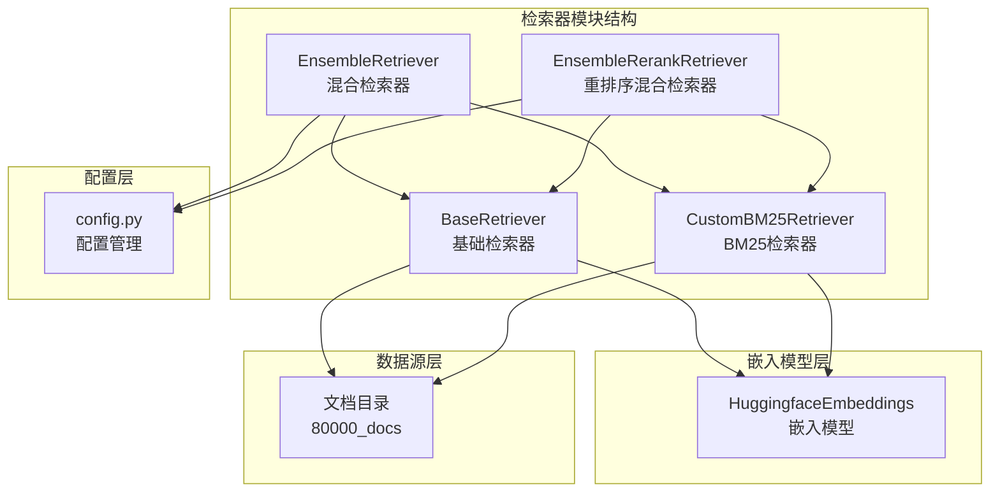

**图表来源**
- [src/retrievers/base.py:16-142](file://src/retrievers/base.py#L16-L142)
- [src/retrievers/bm25.py:14-92](file://src/retrievers/bm25.py#L14-L92)
- [src/retrievers/hybrid.py:13-81](file://src/retrievers/hybrid.py#L13-L81)
- [src/retrievers/hybrid_rerank.py:26-81](file://src/retrievers/hybrid_rerank.py#L26-L81)

**章节来源**
- [src/retrievers/base.py:1-142](file://src/retrievers/base.py#L1-L142)
- [src/retrievers/__init__.py:1-4](file://src/retrievers/__init__.py#L1-L4)

## 核心组件

### BaseRetriever基类架构

BaseRetriever作为所有检索器的基础抽象类，提供了统一的接口和核心功能：

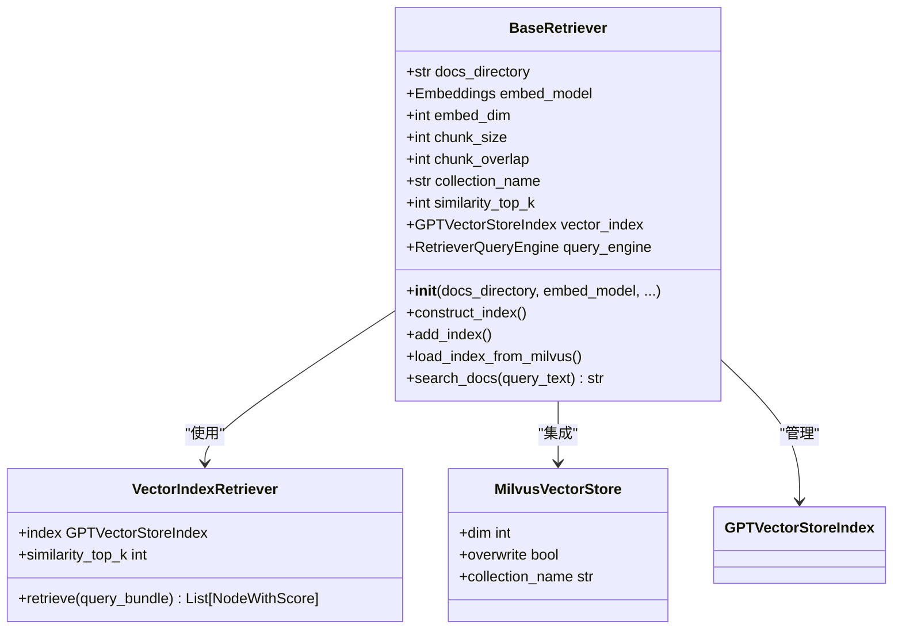

**图表来源**
- [src/retrievers/base.py:16-142](file://src/retrievers/base.py#L16-L142)

### 关键配置参数

BaseRetriever提供了丰富的配置选项来满足不同的检索需求：

| 参数名称 | 类型 | 默认值 | 描述 |
|---------|------|--------|------|
| docs_directory | str | 必需 | 文档存储目录路径 |
| embed_model | Embeddings | 必需 | 嵌入模型实例 |
| embed_dim | int | 768 | 嵌入向量维度 |
| chunk_size | int | 128 | 文档分块大小 |
| chunk_overlap | int | 0 | 分块重叠大小 |
| collection_name | str | "docs" | Milvus集合名称 |
| construct_index | bool | False | 是否构建索引 |
| add_index | bool | False | 是否添加索引 |
| similarity_top_k | int | 2 | 返回相似文档数量 |

**章节来源**
- [src/retrievers/base.py:17-44](file://src/retrievers/base.py#L17-L44)

## 架构概览

### 整体架构设计

CRUD-RAG检索系统采用多层架构设计，确保了系统的可扩展性和可维护性：

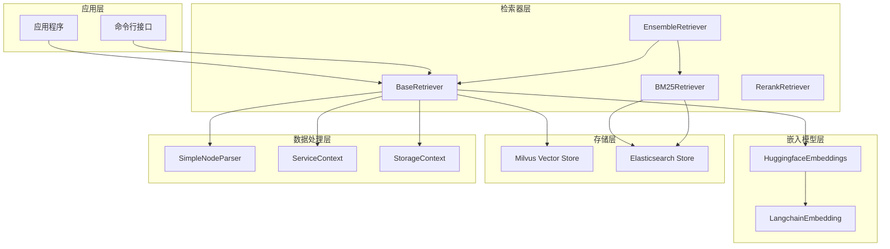

**图表来源**
- [src/retrievers/base.py:3-13](file://src/retrievers/base.py#L3-L13)
- [src/retrievers/bm25.py:3-11](file://src/retrievers/bm25.py#L3-L11)
- [src/retrievers/hybrid.py:11-48](file://src/retrievers/hybrid.py#L11-L48)

### 数据流处理流程

检索器的数据处理遵循标准化的流水线模式：

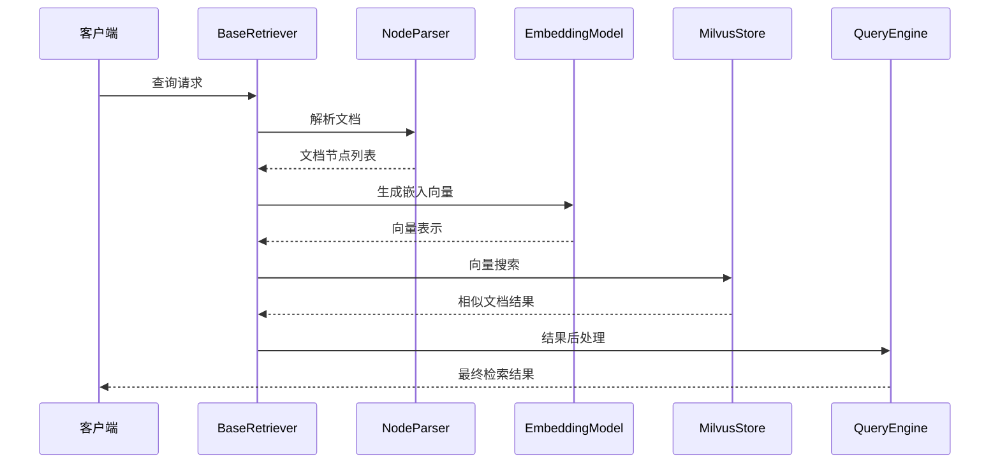

**图表来源**
- [src/retrievers/base.py:56-87](file://src/retrievers/base.py#L56-L87)
- [src/retrievers/base.py:133-140](file://src/retrievers/base.py#L133-L140)

## 详细组件分析

### BaseRetriever核心实现

#### 初始化流程分析

BaseRetriever的初始化过程体现了工厂模式和策略模式的结合：

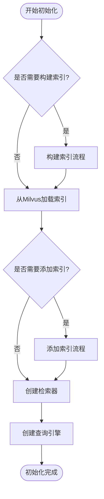

**图表来源**
- [src/retrievers/base.py:37-54](file://src/retrievers/base.py#L37-L54)

#### 索引构建机制

BaseRetriever实现了智能的分块索引构建机制，有效处理大规模文档：

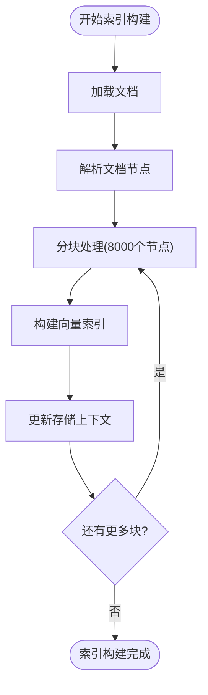

**图表来源**
- [src/retrievers/base.py:56-87](file://src/retrievers/base.py#L56-L87)

#### 搜索文档流程

BaseRetriever的搜索文档方法展示了完整的查询处理链路：

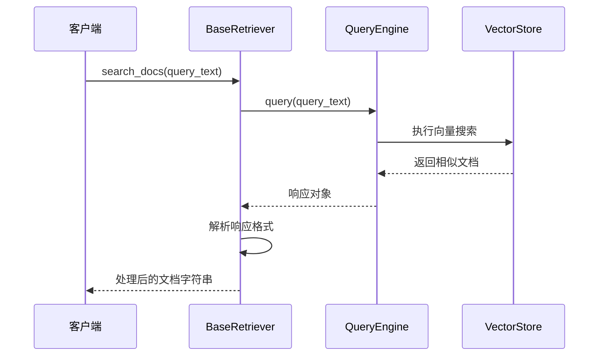

**图表来源**
- [src/retrievers/base.py:133-140](file://src/retrievers/base.py#L133-L140)

**章节来源**
- [src/retrievers/base.py:16-142](file://src/retrievers/base.py#L16-L142)

### 自定义检索器实现

#### BM25检索器实现

CustomBM25Retriever展示了另一种检索策略的实现方式：

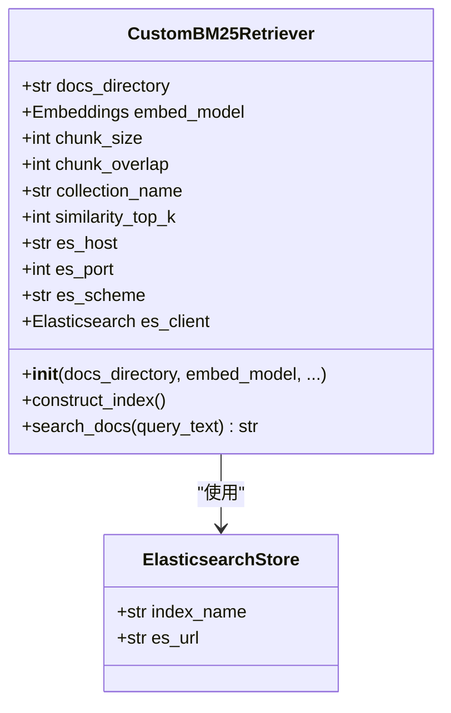

**图表来源**
- [src/retrievers/bm25.py:14-92](file://src/retrievers/bm25.py#L14-L92)

#### 混合检索器实现

EnsembleRetriever展示了多策略融合的高级检索模式：

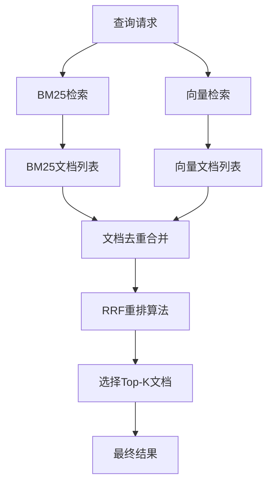

**图表来源**
- [src/retrievers/hybrid.py:50-80](file://src/retrievers/hybrid.py#L50-L80)

**章节来源**
- [src/retrievers/bm25.py:14-92](file://src/retrievers/bm25.py#L14-L92)
- [src/retrievers/hybrid.py:13-81](file://src/retrievers/hybrid.py#L13-L81)
- [src/retrievers/hybrid_rerank.py:26-81](file://src/retrievers/hybrid_rerank.py#L26-L81)

### 嵌入模型集成

#### HuggingfaceEmbeddings实现

嵌入模型层提供了灵活的文本向量化能力：

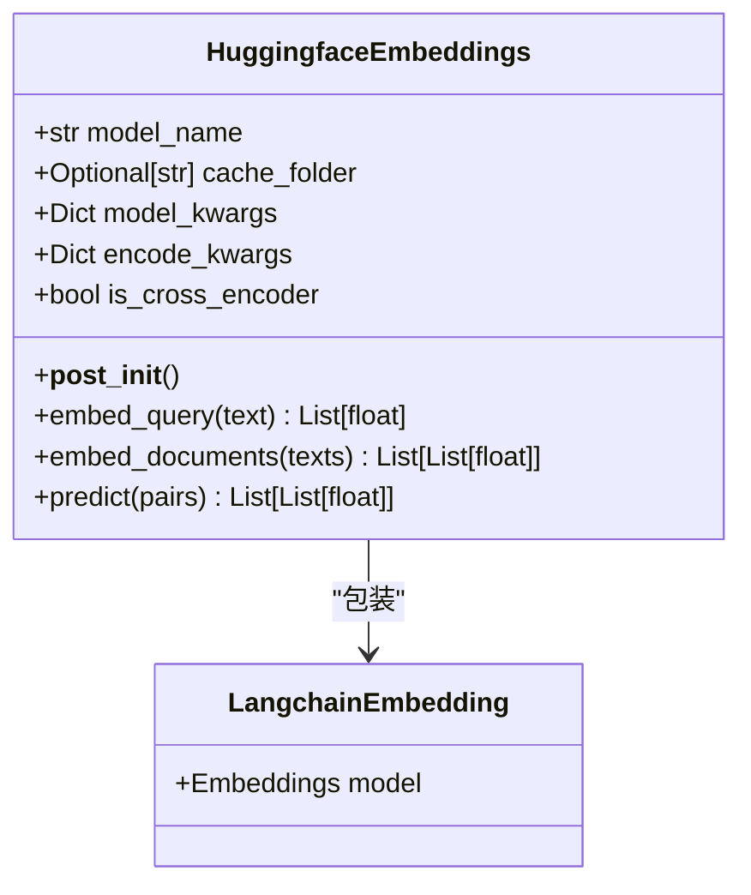

**图表来源**
- [src/embeddings/base.py:14-88](file://src/embeddings/base.py#L14-L88)

**章节来源**
- [src/embeddings/base.py:14-88](file://src/embeddings/base.py#L14-L88)

## 依赖关系分析

### 外部依赖管理

CRUD-RAG系统依赖于多个关键库来实现其功能：

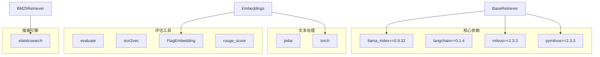

**图表来源**
- [requirements.txt:1-13](file://requirements.txt#L1-L13)

### 内部模块依赖

检索器模块内部的依赖关系展现了清晰的层次结构：

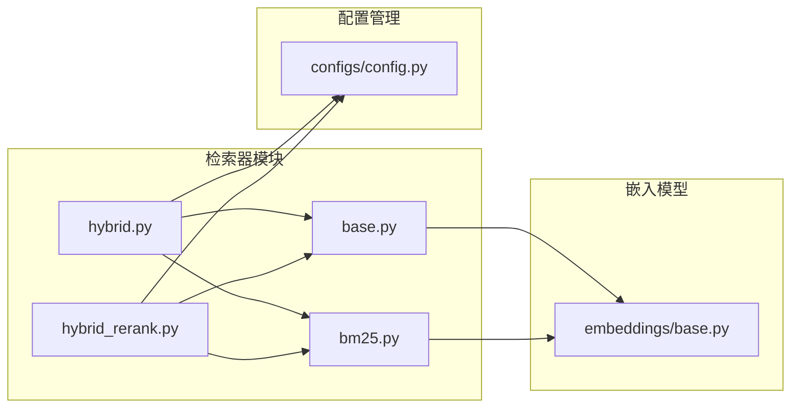

**图表来源**
- [src/retrievers/__init__.py:1-4](file://src/retrievers/__init__.py#L1-L4)

**章节来源**
- [requirements.txt:1-13](file://requirements.txt#L1-L13)
- [src/retrievers/__init__.py:1-4](file://src/retrievers/__init__.py#L1-L4)

## 性能考虑

### 索引构建优化

BaseRetriever在索引构建过程中采用了多项性能优化策略：

1. **分块处理机制**：每次处理8000个节点，避免内存溢出
2. **增量索引构建**：支持部分索引构建和增量添加
3. **向量化优化**：使用LangchainEmbedding进行高效的向量计算

### 检索性能优化

#### 缓存机制设计

虽然当前实现主要依赖Milvus的内置缓存，但可以进一步优化：

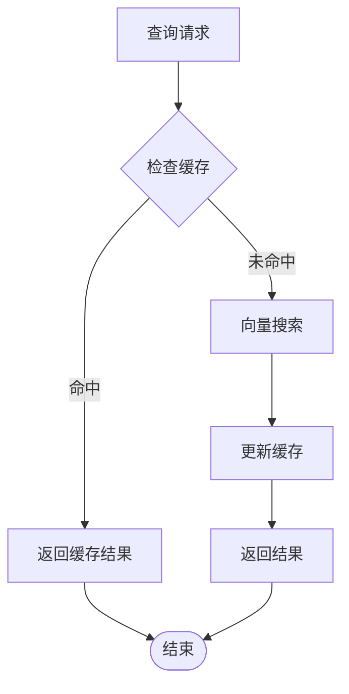

#### 并发访问控制

建议实现以下并发控制机制：

1. **连接池管理**：限制同时连接数，避免资源耗尽
2. **查询队列**：排队处理高并发查询请求
3. **超时控制**：设置合理的查询超时时间
4. **重试机制**：对临时性错误进行自动重试

### 内存管理策略

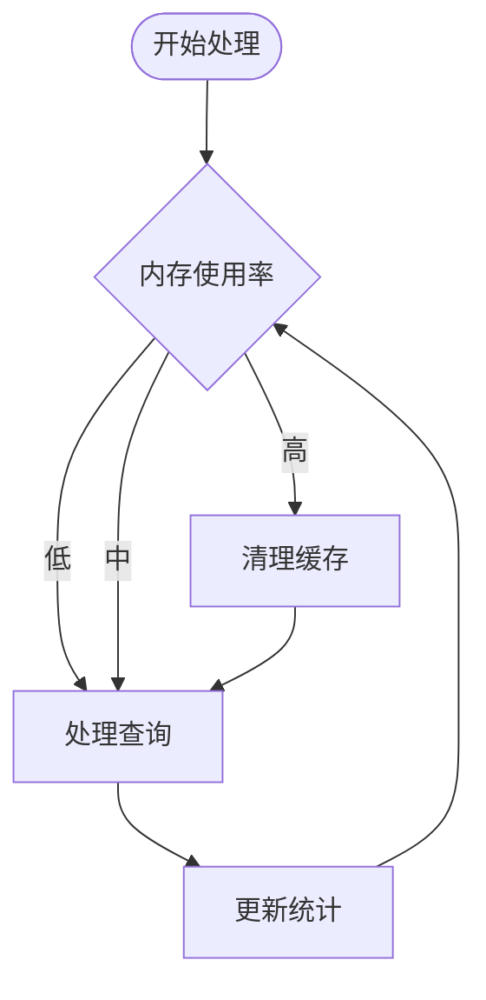

## 故障排除指南

### 常见问题诊断

#### Milvus连接问题

当遇到Milvus连接失败时，检查以下配置：

1. **服务状态确认**：确保milvus-server正在运行
2. **网络连接验证**：检查防火墙设置和网络连通性
3. **配置参数校验**：验证collection_name和dim参数正确性

#### 索引构建失败

索引构建失败的常见原因及解决方案：

1. **内存不足**：减少chunk_size或增加系统内存
2. **磁盘空间不足**：清理磁盘空间或调整索引存储位置
3. **模型加载失败**：检查模型文件完整性和路径配置

#### 检索结果异常

检索结果质量不佳的排查步骤：

1. **嵌入模型验证**：确认嵌入向量维度匹配
2. **相似度阈值调整**：根据实际需求调整similarity_top_k
3. **文档预处理检查**：验证文档分块和预处理效果

### 调试技巧

#### 日志记录策略

建议在关键位置添加详细的日志记录：

```python
# 在索引构建过程中添加进度日志
logger.info(f"Processing chunk {i} to {min(i+8000, len(nodes))}")

# 在查询过程中记录性能指标
start_time = time.time()
result = self.query_engine.query(query_text)
end_time = time.time()
logger.debug(f"Query took {end_time - start_time:.2f} seconds")
```

#### 性能监控方法

1. **查询延迟监控**：记录每次查询的响应时间
2. **内存使用监控**：跟踪内存使用情况
3. **索引统计监控**：定期检查索引大小和查询效率

**章节来源**
- [quick_start.py:54-110](file://quick_start.py#L54-L110)
- [README.md:70-105](file://README.md#L70-L105)

## 结论

BaseRetriever检索器基类为CRUD-RAG系统提供了强大而灵活的检索基础设施。通过抽象化的接口设计和模块化的实现方式，该基类成功地整合了多种检索策略，包括纯向量检索、BM25检索和混合检索。

系统的主要优势包括：

1. **高度可扩展性**：通过继承机制轻松实现自定义检索策略
2. **性能优化**：智能的分块处理和缓存机制确保高效运行
3. **配置灵活性**：丰富的参数配置满足不同场景需求
4. **集成便利性**：与LlamaIndex和Milvus的无缝集成

未来可以进一步改进的方向包括：实现更完善的缓存机制、增强并发访问控制、优化内存管理和提供更详细的性能监控工具。

## 附录

### 配置最佳实践

#### 环境配置建议

1. **硬件要求**：至少8GB内存，推荐16GB以上
2. **存储空间**：预留足够的磁盘空间用于索引存储
3. **网络配置**：确保本地网络连接稳定

#### 模型选择指南

根据应用场景选择合适的嵌入模型：
- **通用场景**：bge-base-zh-v1.5（默认推荐）
- **高性能场景**：bge-large-zh-v1.5
- **资源受限场景**：paraphrase-multilingual-MiniLM-L12-v2

### 使用示例

#### 基础检索器使用

```python
# 创建基础检索器实例
retriever = BaseRetriever(
    docs_path="data/documents",
    embed_model=embeddings,
    chunk_size=128,
    similarity_top_k=8
)

# 执行检索查询
results = retriever.search_docs("查询文本")
```

#### 混合检索器使用

```python
# 创建混合检索器实例
retriever = EnsembleRetriever(
    docs_path="data/documents",
    embed_model=embeddings,
    similarity_top_k=8
)

# 执行检索查询
results = retriever.search_docs("查询文本")
```

**章节来源**
- [quick_start.py:61-89](file://quick_start.py#L61-L89)
- [src/configs/config.py:1-14](file://src/configs/config.py#L1-L14)