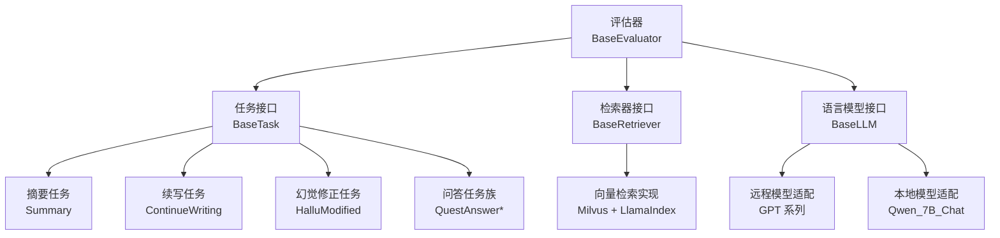
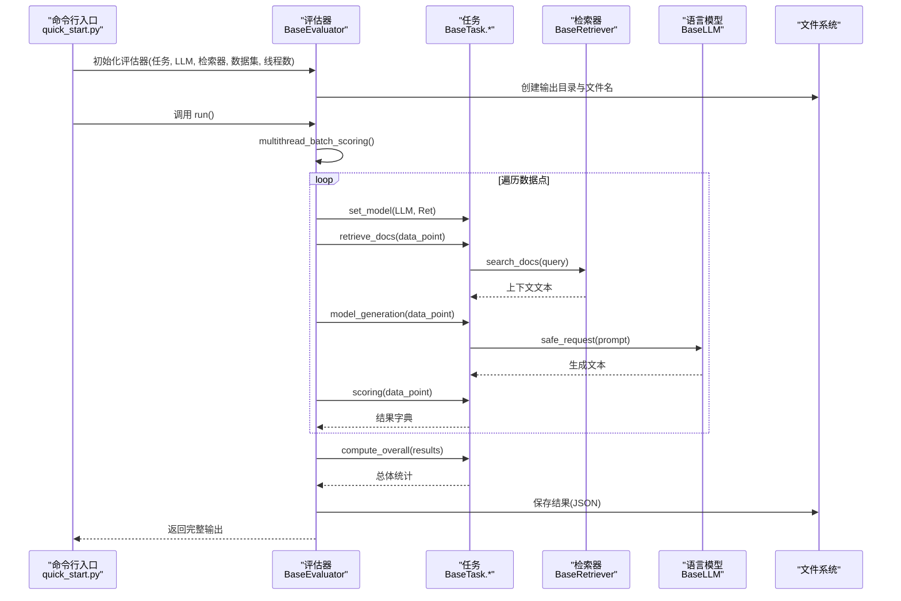
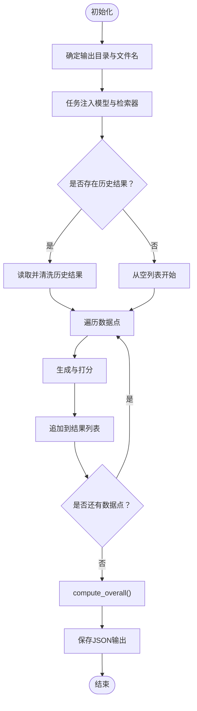
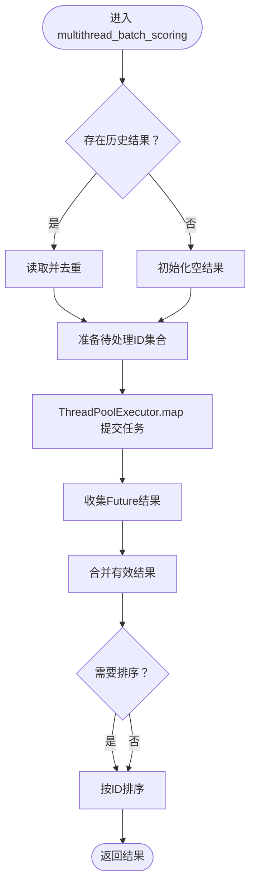
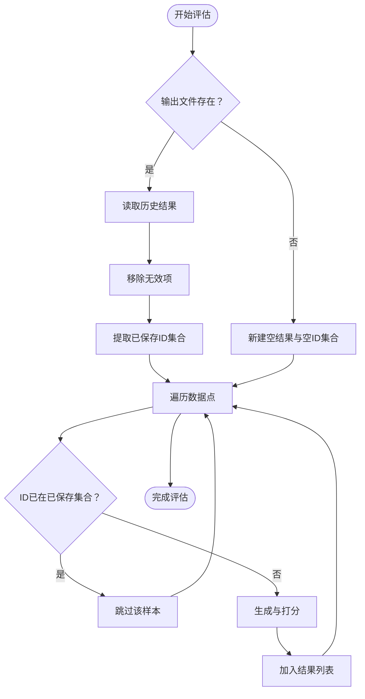
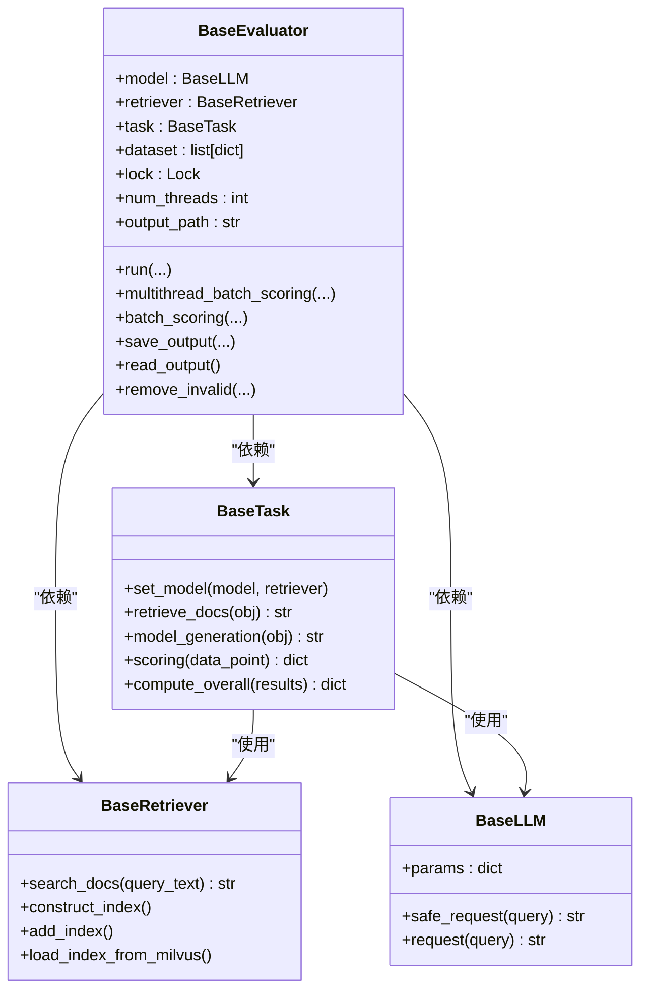
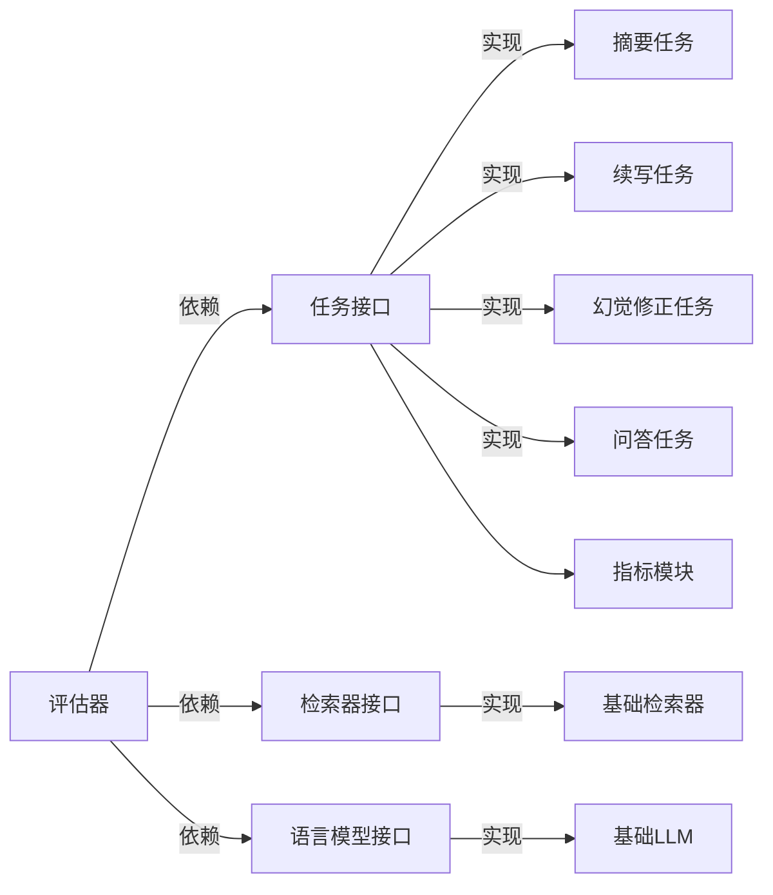

# 评估器核心设计

<cite>
**本文引用的文件**
- [evaluator.py](file://evaluator.py)
- [base.py（任务基类）](file://src/tasks/base.py)
- [base.py（检索器基类）](file://src/retrievers/base.py)
- [base.py（LLM基类）](file://src/llms/base.py)
- [quick_start.py](file://quick_start.py)
- [summary.py（摘要任务）](file://src/tasks/summary.py)
- [continue_writing.py（续写任务）](file://src/tasks/continue_writing.py)
- [hallucinated_modified.py（幻觉修正任务）](file://src/tasks/hallucinated_modified.py)
- [quest_answer.py（问答任务）](file://src/tasks/quest_answer.py)
- [common.py（通用指标）](file://src/metric/common.py)
- [xinhua.py（数据集工具）](file://src/datasets/xinhua.py)
- [base.py（嵌入模型）](file://src/embeddings/base.py)
</cite>

## 目录
1. [引言](#引言)
2. [项目结构](#项目结构)
3. [核心组件](#核心组件)
4. [架构总览](#架构总览)
5. [详细组件分析](#详细组件分析)
6. [依赖分析](#依赖分析)
7. [性能考虑](#性能考虑)
8. [故障排查指南](#故障排查指南)
9. [结论](#结论)
10. [附录：使用示例与最佳实践](#附录使用示例与最佳实践)

## 引言
本设计文档围绕 CRUD-RAG 系统中的 BaseEvaluator 评估器展开，系统性阐述其核心架构、初始化流程与生命周期管理；详解多线程批处理评分机制、结果缓存与断点续评能力；阐明评估器与任务、检索器、语言模型之间的协作关系与依赖注入模式；并提供可直接参考的使用路径与并发安全、异常处理策略及性能优化建议。

## 项目结构
- 评估器位于根目录，负责统一调度任务、检索器与语言模型，并产出标准化的评估结果。
- 任务层提供不同下游任务（摘要、续写、幻觉修正、问答）的生成与打分逻辑。
- 检索器层封装向量检索与查询引擎，支持多种检索策略。
- LLM 层抽象大模型请求接口，提供安全请求包装与参数管理。
- 数据集工具提供数据加载与任务切分。
- 指标模块提供 BLEU、ROUGE、BERT Score 等通用指标计算。

图表来源
- [evaluator.py:13-41](file://evaluator.py#L13-L41)
- [base.py（任务基类）:13-74](file://src/tasks/base.py#L13-L74)
- [base.py（检索器基类）:16-54](file://src/retrievers/base.py#L16-L54)
- [base.py（LLM基类）:6-47](file://src/llms/base.py#L6-L47)

章节来源
- [evaluator.py:13-41](file://evaluator.py#L13-L41)
- [quick_start.py:106-108](file://quick_start.py#L106-L108)

## 核心组件
- BaseEvaluator：评估器核心，负责初始化、批量评分、断点续评、结果保存与总体统计。
- BaseTask 及其实现：定义任务的检索、生成、打分与总体统计接口。
- BaseRetriever：封装检索逻辑，构建或加载向量索引，执行查询。
- BaseLLM：抽象语言模型请求，提供安全请求包装。
- 数据集工具：按任务切分数据，返回可迭代的数据集对象。
- 指标模块：提供 BLEU、ROUGE、BERT Score 等指标计算。

章节来源
- [evaluator.py:13-192](file://evaluator.py#L13-L192)
- [base.py（任务基类）:13-74](file://src/tasks/base.py#L13-L74)
- [base.py（检索器基类）:16-142](file://src/retrievers/base.py#L16-L142)
- [base.py（LLM基类）:6-47](file://src/llms/base.py#L6-L47)
- [common.py:13-117](file://src/metric/common.py#L13-L117)

## 架构总览
评估器通过依赖注入接收任务、语言模型与检索器实例，结合数据集进行批量评估。评估流程包括：断点检测与恢复、多线程并行生成、逐样本打分、总体统计与结果持久化。

图表来源
- [quick_start.py:106-108](file://quick_start.py#L106-L108)
- [evaluator.py:118-151](file://evaluator.py#L118-L151)
- [evaluator.py:56-107](file://evaluator.py#L56-L107)
- [base.py（任务基类）:34-72](file://src/tasks/base.py#L34-L72)
- [base.py（检索器基类）:133-140](file://src/retrievers/base.py#L133-L140)
- [base.py（LLM基类）:38-46](file://src/llms/base.py#L38-L46)

## 详细组件分析

### 评估器初始化与生命周期
- 初始化阶段：接收任务、语言模型、检索器与数据集；根据检索器集合名与 topK 组合输出目录；构造输出文件名；调用任务的 set_model 注入 LLM 与检索器。
- 生命周期：run() 完整流程包含断点检测、批量评分、总体统计与结果保存；multithread_batch_scoring() 支持多线程并行与进度条；batch_scoring() 提供单线程版本；save_output()/read_output() 实现断点续评与结果持久化。

图表来源
- [evaluator.py:14-41](file://evaluator.py#L14-L41)
- [evaluator.py:56-107](file://evaluator.py#L56-L107)
- [evaluator.py:118-151](file://evaluator.py#L118-L151)

章节来源
- [evaluator.py:14-41](file://evaluator.py#L14-L41)
- [evaluator.py:118-151](file://evaluator.py#L118-L151)

### 多线程批处理评分机制
- 并发模型：使用线程池执行数据点处理函数，最大工作线程数由构造参数控制。
- 进度条：在 map 调用中包裹进度条以可视化整体进度。
- 结果聚合：将 Future 结果过滤后合并，最终按 ID 排序输出。
- 断点续评：在开始前读取已有结果，跳过已验证有效的 ID，避免重复计算。

图表来源
- [evaluator.py:56-107](file://evaluator.py#L56-L107)

章节来源
- [evaluator.py:56-107](file://evaluator.py#L56-L107)

### 结果缓存与断点续评
- 缓存位置：基于检索集合名、topK、任务名与模型参数生成唯一输出路径与文件名。
- 断点逻辑：若输出文件存在，则读取历史结果，去除无效项，提取已保存的 ID 集合；后续遍历时跳过这些 ID。
- 有效性判定：通过任务返回的 valid 字段过滤无效样本，保证总体统计仅基于有效样本。

图表来源
- [evaluator.py:68-74](file://evaluator.py#L68-L74)
- [evaluator.py:153-156](file://evaluator.py#L153-L156)

章节来源
- [evaluator.py:68-74](file://evaluator.py#L68-L74)
- [evaluator.py:153-156](file://evaluator.py#L153-L156)

### 评估器与任务、检索器、语言模型的协作关系
- 依赖注入：评估器在初始化时调用任务的 set_model，将 LLM 与检索器注入任务内部，使任务能够在检索与生成阶段使用外部组件。
- 协作流程：任务负责组织检索上下文、构造提示词并调用 LLM 生成文本；随后基于生成文本与参考答案进行打分；最后由任务计算总体统计。
- 锁保护：在涉及共享资源（如 QuestEval 的保存操作）时使用互斥锁，确保并发安全。

图表来源
- [evaluator.py:13-41](file://evaluator.py#L13-L41)
- [base.py（任务基类）:34-72](file://src/tasks/base.py#L34-L72)
- [base.py（检索器基类）:133-140](file://src/retrievers/base.py#L133-L140)
- [base.py（LLM基类）:38-46](file://src/llms/base.py#L38-L46)

章节来源
- [evaluator.py:13-41](file://evaluator.py#L13-L41)
- [base.py（任务基类）:34-72](file://src/tasks/base.py#L34-L72)

### 具体任务实现要点
- 摘要任务：从事件中抽取检索查询，调用检索器获取上下文，构造摘要提示词，使用 LLM 生成摘要并计算指标。
- 续写任务：基于开头文本检索上下文，生成续写内容并计算指标。
- 幻觉修正任务：对给定的“幻觉续写”进行修正生成，计算指标。
- 问答任务：针对问题检索上下文，生成答案并计算指标。

章节来源
- [summary.py:32-98](file://src/tasks/summary.py#L32-L98)
- [continue_writing.py:33-99](file://src/tasks/continue_writing.py#L33-L99)
- [hallucinated_modified.py:34-103](file://src/tasks/hallucinated_modified.py#L34-L103)
- [quest_answer.py:34-100](file://src/tasks/quest_answer.py#L34-L100)

### 指标计算与总体统计
- 指标模块提供 BLEU、ROUGE-L、BERT Score 计算，均带有异常捕获装饰器，保证在个别样本异常时不中断整体流程。
- 任务在 scoring 中返回 metrics、log 与 valid 字段；评估器在 run 中调用 compute_overall 对有效样本进行平均统计。

章节来源
- [common.py:13-117](file://src/metric/common.py#L13-L117)
- [summary.py:100-120](file://src/tasks/summary.py#L100-L120)
- [continue_writing.py:101-118](file://src/tasks/continue_writing.py#L101-L118)
- [hallucinated_modified.py:105-122](file://src/tasks/hallucinated_modified.py#L105-L122)
- [quest_answer.py:102-119](file://src/tasks/quest_answer.py#L102-L119)

## 依赖分析
- 评估器与任务、检索器、语言模型之间为弱耦合的接口依赖，通过 set_model 注入具体实现。
- 任务与检索器、语言模型之间为强内聚的功能组合，便于扩展新的任务类型。
- 指标模块独立于评估器与任务，提供可复用的评分函数。
- 数据集工具负责数据装载与任务切分，与评估器解耦。

图表来源
- [evaluator.py:13-41](file://evaluator.py#L13-L41)
- [base.py（任务基类）:13-74](file://src/tasks/base.py#L13-L74)
- [base.py（检索器基类）:16-54](file://src/retrievers/base.py#L16-L54)
- [base.py（LLM基类）:6-47](file://src/llms/base.py#L6-L47)
- [common.py:13-117](file://src/metric/common.py#L13-L117)

章节来源
- [evaluator.py:13-41](file://evaluator.py#L13-L41)
- [base.py（任务基类）:13-74](file://src/tasks/base.py#L13-L74)
- [base.py（检索器基类）:16-54](file://src/retrievers/base.py#L16-L54)
- [base.py（LLM基类）:6-47](file://src/llms/base.py#L6-L47)
- [common.py:13-117](file://src/metric/common.py#L13-L117)

## 性能考虑
- 线程池大小：根据 I/O 密集型特征（网络请求与磁盘读写），合理设置 num_threads；过高可能导致上下文切换开销增大，过低则无法充分利用资源。
- 批处理与断点：优先使用断点续评减少重复计算；在大规模数据上，先小规模预跑验证流程再全量执行。
- 指标计算：BERT Score 依赖网络连接且较慢，建议按需启用；BLEU/ROUGE 计算相对轻量。
- 输出路径：输出目录按检索集合名与 topK 动态生成，避免多任务混杂导致的 IO 抖动。
- 进度条：在调试阶段开启进度条有助于观察吞吐，生产环境可关闭以减少额外开销。

## 故障排查指南
- 生成为空或异常：评估器在多处使用安全包装与异常捕获，若生成为空或异常，会记录警告并跳过该样本；可在包含原始数据模式下定位问题样本。
- QuestEval 写入失败：评估器在保存 QuestEval 金标准时使用互斥锁，若并发写入冲突，应检查锁的使用是否一致。
- 指标异常：指标模块对异常进行捕获并返回默认值，若出现异常峰值，建议单独抽样检查输入文本质量。
- 索引加载失败：检索器在加载 Milvus 索引时可能因集合名或维度不匹配导致异常，需核对初始化参数。

章节来源
- [evaluator.py:49-53](file://evaluator.py#L49-L53)
- [evaluator.py:98-100](file://evaluator.py#L98-L100)
- [evaluator.py:141-143](file://evaluator.py#L141-L143)
- [common.py:13-20](file://src/metric/common.py#L13-L20)
- [base.py（检索器基类）:121-131](file://src/retrievers/base.py#L121-L131)

## 结论
BaseEvaluator 以清晰的接口与依赖注入模式，将任务、检索器与语言模型解耦，形成可扩展的评估框架。其断点续评、多线程批处理与总体统计能力，使得大规模评估既高效又稳健。配合合理的线程配置与指标选择，可在保证稳定性的同时获得良好的吞吐表现。

## 附录：使用示例与最佳实践
- 基本使用路径
  - 在命令行入口中创建 LLM、检索器与任务实例，加载数据集，构造评估器并调用 run。
  - 示例调用链参考：[quick_start.py:106-108](file://quick_start.py#L106-L108)
- 最佳实践
  - 合理设置 num_threads，结合实际硬件与网络带宽进行压测调优。
  - 使用断点续评功能进行长时间任务的可靠执行。
  - 按需启用 QuestEval 与 BERT Score，平衡准确度与耗时。
  - 在任务实现中保持 generate 与 scoring 的职责分离，确保可维护性与可测试性。

章节来源
- [quick_start.py:106-108](file://quick_start.py#L106-L108)