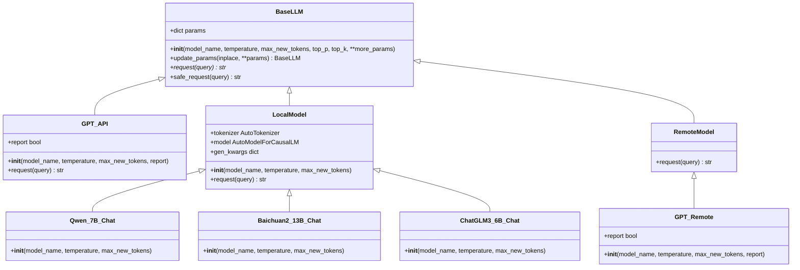
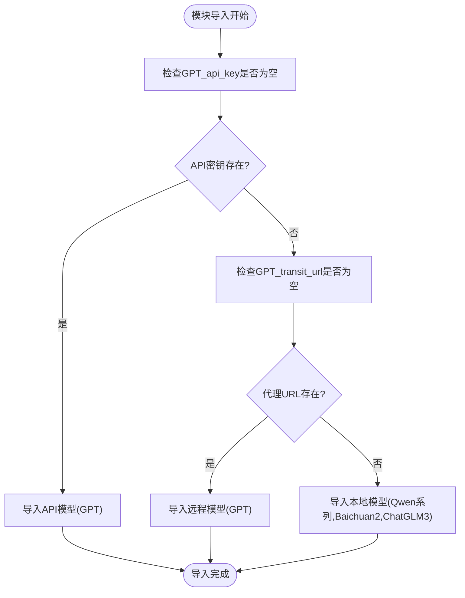
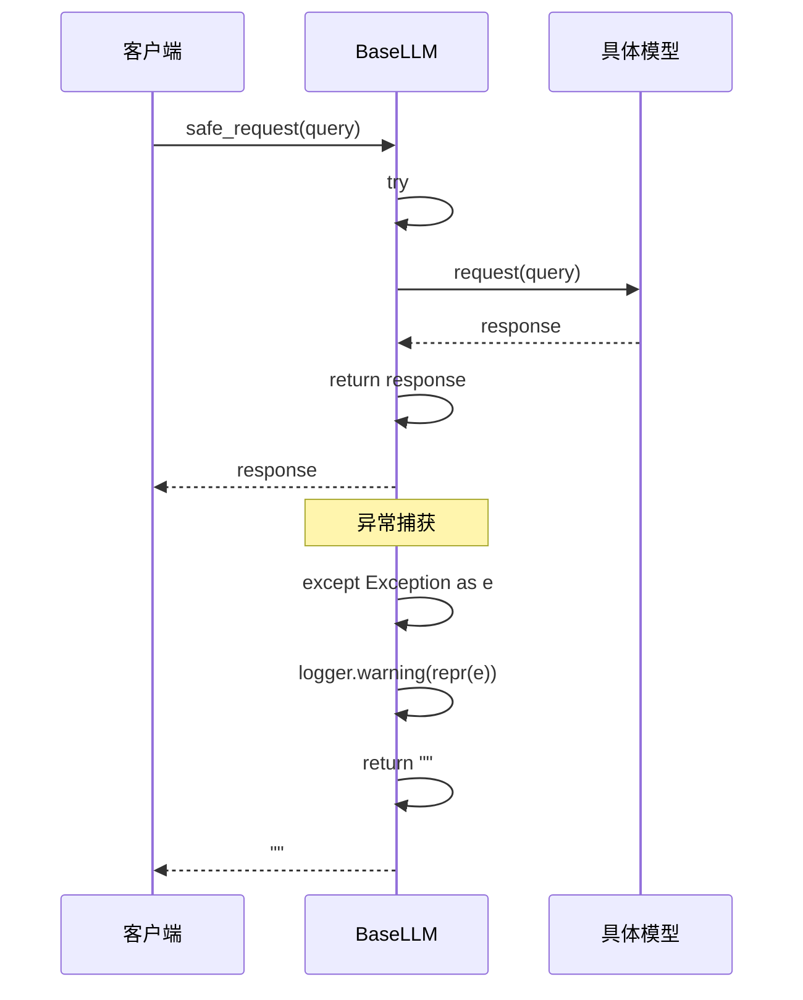

# 语言模型基类设计

<cite>
**本文档引用的文件**
- [src/llms/base.py](file://src/llms/base.py)
- [src/llms/__init__.py](file://src/llms/__init__.py)
- [src/llms/api_model.py](file://src/llms/api_model.py)
- [src/llms/local_model.py](file://src/llms/local_model.py)
- [src/llms/remote_model.py](file://src/llms/remote_model.py)
- [src/configs/config.py](file://src/configs/config.py)
- [quick_start.py](file://quick_start.py)
- [src/tasks/base.py](file://src/tasks/base.py)
</cite>

## 目录
1. [简介](#简介)
2. [项目结构](#项目结构)
3. [核心组件](#核心组件)
4. [架构概览](#架构概览)
5. [详细组件分析](#详细组件分析)
6. [依赖分析](#依赖分析)
7. [性能考虑](#性能考虑)
8. [故障排查指南](#故障排查指南)
9. [结论](#结论)
10. [附录：新模型集成指南](#附录新模型集成指南)

## 简介

CRUD-RAG系统中的BaseLLM语言模型基类设计为整个项目的语言模型抽象层，提供了统一的接口规范和扩展机制。该设计支持多种模型类型（本地模型、远程API模型、代理URL模型），通过抽象基类定义了标准化的初始化参数、生成接口和错误处理机制。

本设计文档深入解析LLM基类的抽象架构、接口规范和扩展机制，详细说明模型初始化、参数配置和生成接口设计，阐述不同模型类型的统一抽象方式和差异化实现策略，并提供具体的代码示例展示如何集成新的语言模型。

## 项目结构

CRUD-RAG系统的语言模型模块采用分层组织结构，主要包含以下核心文件：

```mermaid
graph TB
subgraph "LLM模块结构"
Base[base.py<br/>基础抽象类]
API[api_model.py<br/>OpenAI API模型]
Local[local_model.py<br/>本地HuggingFace模型]
Remote[remote_model.py<br/>远程代理模型]
Init[__init__.py<br/>模块导入控制]
end
subgraph "配置模块"
Config[config.py<br/>基础配置]
RealConfig[real_config.py<br/>真实配置(可选)]
end
subgraph "应用集成"
QuickStart[quick_start.py<br/>快速启动示例]
Tasks[tasks/base.py<br/>任务基类]
end
Base --> API
Base --> Local
Base --> Remote
API --> Config
Local --> Config
Remote --> Config
QuickStart --> Base
QuickStart --> API
QuickStart --> Local
QuickStart --> Remote
Tasks --> Base
```

**图表来源**
- [src/llms/base.py:1-47](file://src/llms/base.py#L1-L47)
- [src/llms/__init__.py:1-13](file://src/llms/__init__.py#L1-L13)
- [src/configs/config.py:1-14](file://src/configs/config.py#L1-L14)

**章节来源**
- [src/llms/base.py:1-47](file://src/llms/base.py#L1-L47)
- [src/llms/__init__.py:1-13](file://src/llms/__init__.py#L1-L13)
- [src/configs/config.py:1-14](file://src/configs/config.py#L1-L14)

## 核心组件

### BaseLLM抽象基类

BaseLLM是整个语言模型系统的核心抽象类，定义了所有语言模型必须实现的标准接口和通用功能。

#### 核心特性

1. **统一参数管理**: 通过字典结构管理所有模型参数
2. **参数更新机制**: 支持就地更新和深拷贝更新两种模式
3. **安全请求接口**: 提供异常处理的请求包装器
4. **抽象方法定义**: 强制子类实现具体的请求逻辑

#### 参数配置系统

BaseLLM采用灵活的参数配置机制，支持标准参数和额外参数的组合：

- **标准参数**: model_name, temperature, max_new_tokens, top_p, top_k
- **动态参数**: 通过**more_params接收任意额外参数
- **参数继承**: 子类可以覆盖和扩展默认参数行为

**章节来源**
- [src/llms/base.py:6-46](file://src/llms/base.py#L6-L46)

### 模型类型分类

系统支持三种主要的模型类型，每种类型都有其特定的实现策略：

1. **API模型**: 基于OpenAI兼容的API接口
2. **本地模型**: 使用HuggingFace Transformers库加载本地模型
3. **远程代理模型**: 通过HTTP请求访问远程推理服务

**章节来源**
- [src/llms/api_model.py:12-32](file://src/llms/api_model.py#L12-L32)
- [src/llms/local_model.py:11-113](file://src/llms/local_model.py#L11-L113)
- [src/llms/remote_model.py:14-110](file://src/llms/remote_model.py#L14-L110)

## 架构概览

### 整体架构设计



**图表来源**
- [src/llms/base.py:6-46](file://src/llms/base.py#L6-L46)
- [src/llms/api_model.py:12-32](file://src/llms/api_model.py#L12-L32)
- [src/llms/local_model.py:11-113](file://src/llms/local_model.py#L11-L113)
- [src/llms/remote_model.py:14-110](file://src/llms/remote_model.py#L14-L110)

### 模块导入控制

`__init__.py`文件实现了智能的模块导入控制，根据配置自动选择合适的模型实现：



**图表来源**
- [src/llms/__init__.py:7-12](file://src/llms/__init__.py#L7-L12)

**章节来源**
- [src/llms/__init__.py:1-13](file://src/llms/__init__.py#L1-L13)

## 详细组件分析

### BaseLLM基类详解

#### 初始化流程

BaseLLM的初始化过程体现了参数配置的最佳实践：

1. **参数收集**: 将所有传入参数收集到params字典中
2. **默认值设置**: 为关键参数设置合理的默认值
3. **动态扩展**: 支持任意额外参数的传递
4. **类型安全**: 确保模型名称的正确性

#### 参数更新机制

BaseLLM提供了两种参数更新策略：

1. **就地更新**: 直接修改当前对象的参数字典
2. **深拷贝更新**: 创建新对象并更新参数，保持原对象不变

这种设计支持链式调用和不可变配置的场景。

#### 安全请求接口

`saferequest`方法提供了完整的异常处理机制：



**图表来源**
- [src/llms/base.py:38-45](file://src/llms/base.py#L38-L45)

**章节来源**
- [src/llms/base.py:6-46](file://src/llms/base.py#L6-L46)

### API模型实现

#### OpenAI兼容接口

API模型实现了标准的OpenAI聊天补全接口：

1. **认证机制**: 从配置文件读取API密钥和基础URL
2. **消息格式**: 使用标准的role-content格式
3. **参数映射**: 将BaseLLM参数映射到OpenAI参数
4. **计费统计**: 记录token消耗信息

#### 配置集成

API模型通过动态导入配置模块实现灵活的配置管理：

- **优先级**: 首先尝试导入`real_config`，失败则回退到`config`
- **环境适配**: 支持开发和生产环境的不同配置

**章节来源**
- [src/llms/api_model.py:12-32](file://src/llms/api_model.py#L12-L32)
- [src/configs/config.py:1-14](file://src/configs/config.py#L1-L14)

### 本地模型实现

#### HuggingFace集成

本地模型使用Transformers库实现高效的本地推理：

1. **模型加载**: 自动设备映射和量化配置
2. **生成参数**: 统一的生成参数字典管理
3. **CUDA加速**: 自动检测和使用GPU资源
4. **模型适配**: 不同模型的特殊处理逻辑

#### 多模型支持

系统支持多种主流中文模型：

- **Qwen系列**: 7B和14B参数版本
- **Baichuan2**: 13B参数版本  
- **ChatGLM3**: 6B参数版本

每个模型都有其特定的预处理器和生成配置。

**章节来源**
- [src/llms/local_model.py:11-113](file://src/llms/local_model.py#L11-L113)

### 远程代理模型

#### HTTP接口实现

远程代理模型通过HTTP请求访问远程推理服务：

1. **统一协议**: 所有远程模型使用相同的JSON协议
2. **参数封装**: 将生成参数封装到payload中
3. **认证机制**: 支持token认证和自定义头部
4. **响应解析**: 统一的JSON响应解析逻辑

#### 代理服务适配

系统支持多种远程推理服务：

- **Baichuan2**: 13B参数版本
- **ChatGLM2**: 6B参数版本  
- **Qwen**: 14B参数版本
- **GPT**: OpenAI兼容的GPT模型

**章节来源**
- [src/llms/remote_model.py:14-110](file://src/llms/remote_model.py#L14-L110)

## 依赖分析

### 模块间依赖关系

```mermaid
graph TB
subgraph "外部依赖"
Torch[torch]
Transformers[transformers]
OpenAI[openai]
Requests[requests]
end
subgraph "内部模块"
Base[BaseLLM]
API[GPT(API)]
Local[Local Models]
Remote[Remote Models]
Config[Config Module]
end
subgraph "应用层"
QuickStart[QuickStart]
Tasks[Tasks]
end
Base --> Torch
Base --> Transformers
API --> OpenAI
Remote --> Requests
API --> Config
Local --> Config
Remote --> Config
QuickStart --> Base
QuickStart --> API
QuickStart --> Local
QuickStart --> Remote
Tasks --> Base
```

**图表来源**
- [src/llms/base.py:1-47](file://src/llms/base.py#L1-L47)
- [src/llms/api_model.py:1-33](file://src/llms/api_model.py#L1-L33)
- [src/llms/local_model.py:1-114](file://src/llms/local_model.py#L1-L114)
- [src/llms/remote_model.py:1-111](file://src/llms/remote_model.py#L1-L111)

### 耦合度分析

1. **低耦合设计**: BaseLLM与具体实现完全解耦
2. **配置注入**: 通过配置模块实现运行时配置切换
3. **接口统一**: 所有模型实现统一的接口规范
4. **扩展友好**: 新增模型类型只需继承BaseLLM

**章节来源**
- [src/llms/base.py:6-46](file://src/llms/base.py#L6-L46)
- [src/llms/__init__.py:1-13](file://src/llms/__init__.py#L1-L13)

## 性能考虑

### 内存管理

1. **模型加载优化**: 本地模型使用device_map自动分配到可用设备
2. **显存管理**: CUDA张量自动移动到GPU进行计算
3. **批量处理**: 支持批量推理以提高吞吐量

### 并发处理

1. **线程安全**: BaseLLM实例在多线程环境下安全使用
2. **异步支持**: 可通过外部框架实现异步调用
3. **连接池**: 远程模型复用HTTP连接减少开销

### 缓存机制

1. **参数缓存**: 生成参数字典避免重复构建
2. **模型缓存**: 本地模型实例可重用避免重复加载
3. **响应缓存**: 可在上层应用实现响应结果缓存

## 故障排查指南

### 常见问题诊断

#### API模型问题

1. **认证失败**: 检查GPT_api_key配置是否正确
2. **网络超时**: 验证API基础URL和网络连接
3. **配额限制**: 查看API使用情况和配额状态

#### 本地模型问题

1. **CUDA错误**: 确认GPU驱动和CUDA版本兼容性
2. **内存不足**: 检查显存使用情况和模型大小
3. **模型路径**: 验证本地模型路径配置正确

#### 远程模型问题

1. **HTTP错误**: 检查代理URL和认证token
2. **超时问题**: 验证网络连接和服务器状态
3. **参数不匹配**: 确认远程服务支持的参数列表

### 调试技巧

1. **日志监控**: 利用loguru记录详细的执行信息
2. **参数验证**: 在初始化时验证关键参数的有效性
3. **渐进测试**: 从简单查询开始逐步增加复杂度
4. **资源监控**: 监控内存和GPU使用情况

**章节来源**
- [src/llms/base.py:38-45](file://src/llms/base.py#L38-L45)
- [src/llms/api_model.py:17-32](file://src/llms/api_model.py#L17-L32)
- [src/llms/local_model.py:27-33](file://src/llms/local_model.py#L27-L33)
- [src/llms/remote_model.py:15-34](file://src/llms/remote_model.py#L15-L34)

## 结论

CRUD-RAG系统的BaseLLM语言模型基类设计体现了良好的软件工程实践，通过抽象基类实现了统一的接口规范和灵活的扩展机制。该设计成功地将不同类型的模型实现统一在一个标准接口下，为系统的可维护性和可扩展性奠定了坚实基础。

主要优势包括：
1. **统一抽象**: 所有模型实现遵循相同接口规范
2. **灵活配置**: 支持运行时配置切换和参数动态更新
3. **错误处理**: 提供完善的异常处理和恢复机制
4. **扩展友好**: 新增模型类型只需继承基类即可

该设计为CRUD-RAG系统提供了强大的语言模型支持能力，能够适应不同的部署环境和性能需求。

## 附录：新模型集成指南

### 集成步骤

1. **继承BaseLLM**: 创建新类继承BaseLLM基类
2. **实现抽象方法**: 实现request方法的具体逻辑
3. **参数配置**: 在__init__方法中设置必要的参数
4. **导入注册**: 在__init__.py中注册新模型

### 代码示例路径

#### 基础模板
参考文件路径：[src/llms/base.py:6-46](file://src/llms/base.py#L6-L46)

#### API模型实现模板
参考文件路径：[src/llms/api_model.py:12-32](file://src/llms/api_model.py#L12-L32)

#### 本地模型实现模板  
参考文件路径：[src/llms/local_model.py:11-113](file://src/llms/local_model.py#L11-L113)

#### 远程模型实现模板
参考文件路径：[src/llms/remote_model.py:14-110](file://src/llms/remote_model.py#L14-L110)

### 最佳实践

1. **参数命名**: 保持与BaseLLM一致的参数命名约定
2. **错误处理**: 实现完整的异常处理和日志记录
3. **性能优化**: 考虑内存管理和计算效率
4. **文档注释**: 提供清晰的使用说明和参数说明
5. **测试验证**: 确保新模型的功能正确性和稳定性

通过遵循这些指导原则，开发者可以轻松地为CRUD-RAG系统添加新的语言模型支持，进一步扩展系统的功能和性能。