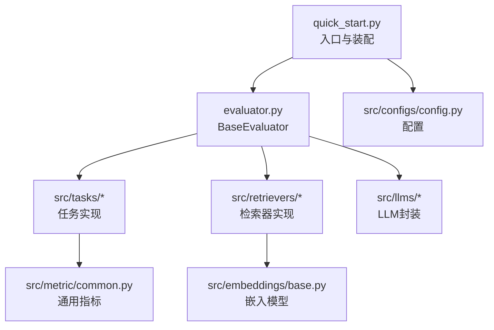
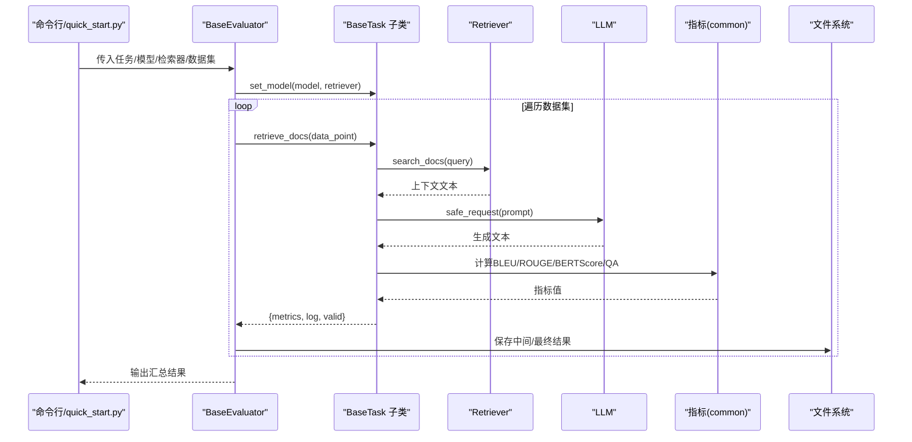
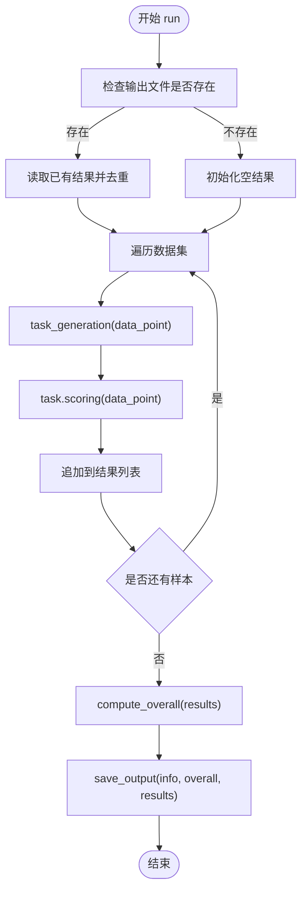
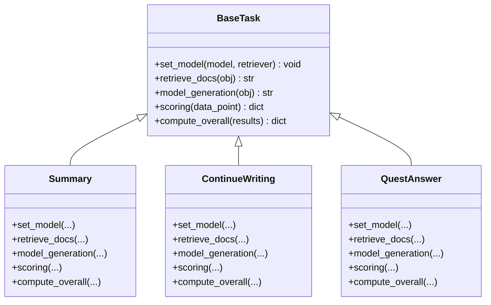
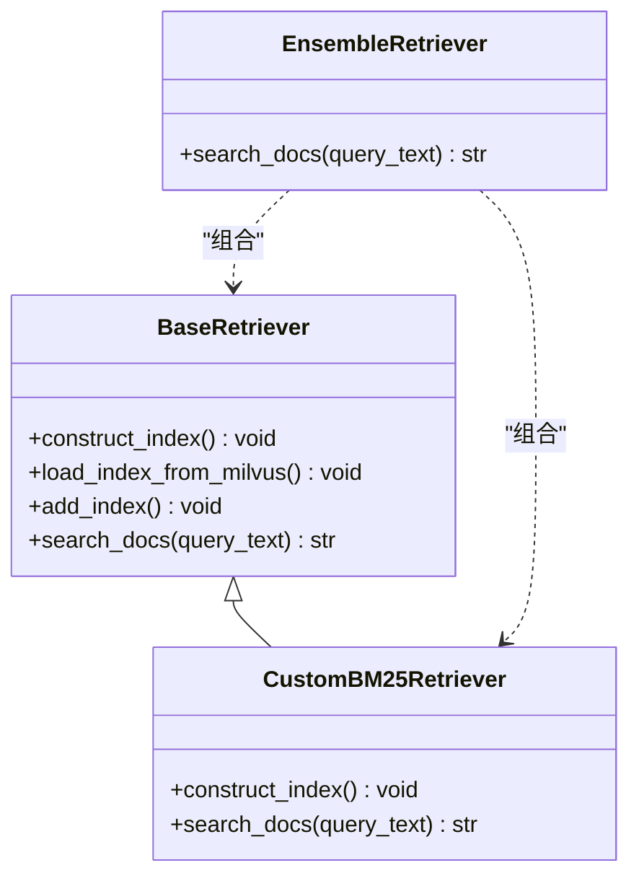
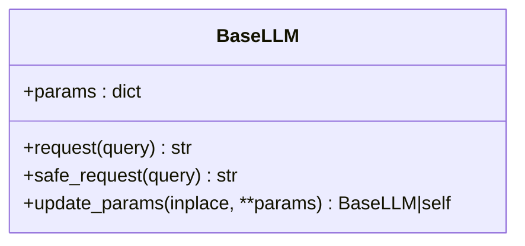
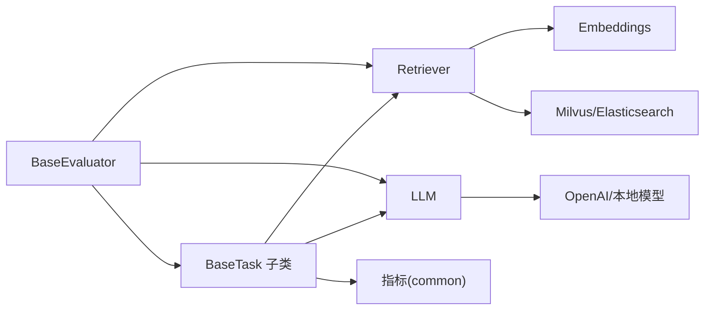
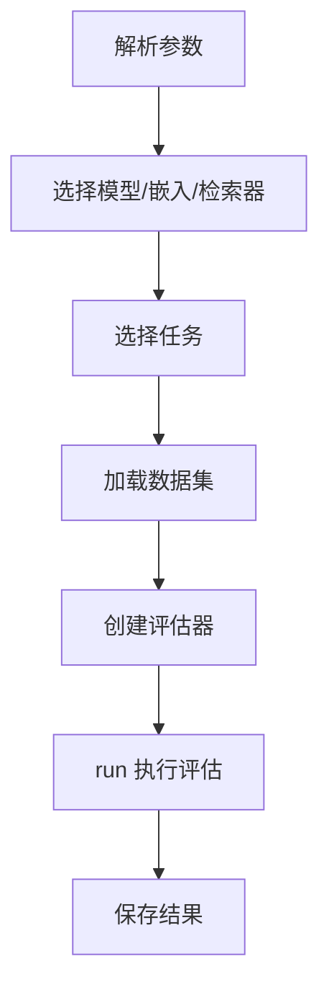

# 系统架构

<cite>
**本文引用的文件**
- [README.md](file://README.md)
- [evaluator.py](file://evaluator.py)
- [quick_start.py](file://quick_start.py)
- [src/configs/config.py](file://src/configs/config.py)
- [requirements.txt](file://requirements.txt)
- [src/tasks/base.py](file://src/tasks/base.py)
- [src/tasks/summary.py](file://src/tasks/summary.py)
- [src/tasks/continue_writing.py](file://src/tasks/continue_writing.py)
- [src/tasks/quest_answer.py](file://src/tasks/quest_answer.py)
- [src/retrievers/base.py](file://src/retrievers/base.py)
- [src/retrievers/bm25.py](file://src/retrievers/bm25.py)
- [src/retrievers/hybrid.py](file://src/retrievers/hybrid.py)
- [src/llms/base.py](file://src/llms/base.py)
- [src/embeddings/base.py](file://src/embeddings/base.py)
- [src/metric/common.py](file://src/metric/common.py)
</cite>

## 目录
1. [引言](#引言)
2. [项目结构](#项目结构)
3. [核心组件](#核心组件)
4. [架构总览](#架构总览)
5. [详细组件分析](#详细组件分析)
6. [依赖分析](#依赖分析)
7. [性能考量](#性能考量)
8. [故障排查指南](#故障排查指南)
9. [结论](#结论)
10. [附录](#附录)

## 引言
本文件为 CRUD-RAG 系统的系统架构文档，聚焦于评估器（Evaluator）、任务（Task）、检索器（Retriever）与语言模型（LLM）之间的交互关系与数据流。文档从输入数据到最终评估结果的完整路径出发，梳理各核心组件的职责与接口设计，并总结系统采用的设计模式（工厂模式、策略模式、模板方法模式），最后给出架构图、组件关系图、扩展性与性能建议。

## 项目结构
仓库采用按“功能域”组织的分层结构：数据集、嵌入、检索器、LLM、指标、提示词、任务等模块清晰分离；入口脚本负责参数解析与组件装配，评估器统一调度执行与结果汇总。

图表来源
- [quick_start.py:1-110](file://quick_start.py#L1-L110)
- [evaluator.py:1-192](file://evaluator.py#L1-L192)
- [src/tasks/base.py:1-74](file://src/tasks/base.py#L1-L74)
- [src/retrievers/base.py:1-142](file://src/retrievers/base.py#L1-L142)
- [src/llms/base.py:1-47](file://src/llms/base.py#L1-L47)
- [src/embeddings/base.py:1-88](file://src/embeddings/base.py#L1-L88)
- [src/metric/common.py:1-117](file://src/metric/common.py#L1-L117)
- [src/configs/config.py:1-14](file://src/configs/config.py#L1-L14)

章节来源
- [README.md:27-68](file://README.md#L27-L68)
- [quick_start.py:1-110](file://quick_start.py#L1-L110)

## 核心组件
- 评估器（BaseEvaluator）
  - 职责：统一调度任务生成、打分、聚合与持久化；支持多线程批处理与断点续跑。
  - 关键接口：构造函数注入任务、模型、检索器与数据集；run/multithread_batch_scoring/batch_scoring/save_output/read_output/compute_overall。
- 任务（BaseTask 及其子类）
  - 职责：定义任务模板方法（retrieve_docs → model_generation → scoring → compute_overall），具体任务通过 Prompt 模板与指标计算完成评估。
  - 关键接口：set_model、retrieve_docs、model_generation、scoring、compute_overall。
- 检索器（BaseRetriever、CustomBM25Retriever、EnsembleRetriever）
  - 职责：基于向量或 BM25/Elasticsearch 构建/加载索引，执行查询并返回上下文文本。
  - 关键接口：construct_index/load_index_from_milvus/add_index/search_docs。
- 语言模型（BaseLLM 及其实现）
  - 职责：抽象请求接口，提供安全请求包装与参数管理。
  - 关键接口：request/safe_request/update_params。
- 嵌入模型（HuggingfaceEmbeddings）
  - 职责：封装 sentence-transformers 或 cross-encoder，提供 embed_query/embed_documents。
- 指标（common.py）
  - 职责：提供 BLEU、ROUGE-L、BERTScore、分类统计等通用指标工具。

章节来源
- [evaluator.py:13-192](file://evaluator.py#L13-L192)
- [src/tasks/base.py:13-74](file://src/tasks/base.py#L13-L74)
- [src/retrievers/base.py:16-142](file://src/retrievers/base.py#L16-L142)
- [src/retrievers/bm25.py:14-92](file://src/retrievers/bm25.py#L14-L92)
- [src/retrievers/hybrid.py:13-81](file://src/retrievers/hybrid.py#L13-L81)
- [src/llms/base.py:6-47](file://src/llms/base.py#L6-L47)
- [src/embeddings/base.py:14-88](file://src/embeddings/base.py#L14-L88)
- [src/metric/common.py:13-117](file://src/metric/common.py#L13-L117)

## 架构总览
下图展示从输入数据到评估结果的端到端流程：入口脚本解析参数并装配组件；评估器驱动任务执行；任务调用检索器获取上下文，再由 LLM 生成回答；随后进行指标计算与整体统计，并持久化输出。

图表来源
- [quick_start.py:51-108](file://quick_start.py#L51-L108)
- [evaluator.py:42-151](file://evaluator.py#L42-L151)
- [src/tasks/base.py:34-72](file://src/tasks/base.py#L34-L72)
- [src/retrievers/base.py:133-140](file://src/retrievers/base.py#L133-L140)
- [src/metric/common.py:23-117](file://src/metric/common.py#L23-L117)

## 详细组件分析

### 评估器（BaseEvaluator）
- 设计要点
  - 统一调度：在 run 中协调 retrieve → generation → scoring → 汇总与落盘。
  - 多线程批处理：multithread_batch_scoring 使用线程池并发处理样本，支持进度条与断点续跑。
  - 结果缓存：按检索集合名与 top-k、模型名生成输出目录，避免重复计算。
- 关键流程
  - 断点续跑：若输出文件存在则读取已有效结果，跳过已处理样本。
  - 安全生成：调用任务的 model_generation 并过滤无效输出。
  - 整体统计：compute_overall 调用任务实现的聚合逻辑。
- 并发与锁
  - 使用 Lock 保护共享资源（如 QuestEval 的保存操作）。
- 输出格式
  - 包含 info（任务、模型参数）、overall（指标均值/统计）、results（逐样本明细）。

图表来源
- [evaluator.py:56-151](file://evaluator.py#L56-L151)

章节来源
- [evaluator.py:13-192](file://evaluator.py#L13-L192)

### 任务（BaseTask 及子类）
- 模板方法模式
  - BaseTask 定义了标准流程：set_model → retrieve_docs → model_generation → scoring → compute_overall。
  - 具体任务仅需实现 Prompt 模板读取、检索上下文拼接、生成文本解析与指标计算。
- 典型任务
  - Summary：事件摘要任务，使用 summary.txt 模板，计算 BLEU、ROUGE-L、BERTScore 与 QA 指标。
  - ContinueWriting：续写任务，使用 continue_writing.txt 模板。
  - QuestAnswer：问答任务，使用 quest_answer.txt 模板，支持 1/2/3 文档场景。
- 接口契约
  - scoring 返回包含 metrics、log、valid 字段的字典；compute_overall 对 results 进行平均/汇总。

图表来源
- [src/tasks/base.py:13-74](file://src/tasks/base.py#L13-L74)
- [src/tasks/summary.py:12-121](file://src/tasks/summary.py#L12-L121)
- [src/tasks/continue_writing.py:13-119](file://src/tasks/continue_writing.py#L13-L119)
- [src/tasks/quest_answer.py:14-134](file://src/tasks/quest_answer.py#L14-L134)

章节来源
- [src/tasks/base.py:13-74](file://src/tasks/base.py#L13-L74)
- [src/tasks/summary.py:12-121](file://src/tasks/summary.py#L12-L121)
- [src/tasks/continue_writing.py:13-119](file://src/tasks/continue_writing.py#L13-L119)
- [src/tasks/quest_answer.py:14-134](file://src/tasks/quest_answer.py#L14-L134)

### 检索器（Retriever）
- BaseRetriever（向量检索）
  - 支持构建/加载 Milvus 向量索引；通过 LlamaIndex 的 VectorIndexRetriever 与 RetrieverQueryEngine 执行查询。
  - search_docs 返回合并后的上下文文本。
- CustomBM25Retriever（Elasticsearch）
  - 使用 ElasticsearchStore 构建索引，search_docs 基于 match 查询返回 TopK 文档。
- EnsembleRetriever（混合检索）
  - 融合 BM25 与向量检索结果，采用 Reciprocal Rank Fusion（RRF）融合权重与常数 c，取前 K 个文档。

图表来源
- [src/retrievers/base.py:16-142](file://src/retrievers/base.py#L16-L142)
- [src/retrievers/bm25.py:14-92](file://src/retrievers/bm25.py#L14-L92)
- [src/retrievers/hybrid.py:13-81](file://src/retrievers/hybrid.py#L13-L81)

章节来源
- [src/retrievers/base.py:16-142](file://src/retrievers/base.py#L16-L142)
- [src/retrievers/bm25.py:14-92](file://src/retrievers/bm25.py#L14-L92)
- [src/retrievers/hybrid.py:13-81](file://src/retrievers/hybrid.py#L13-L81)

### 语言模型（LLM）
- BaseLLM 抽象请求接口，提供安全请求包装 safe_request 与参数更新 update_params。
- quick_start.py 中根据模型名选择 GPT 或本地模型实例，传递温度、最大生成长度等参数。

图表来源
- [src/llms/base.py:6-47](file://src/llms/base.py#L6-L47)
- [quick_start.py:54-57](file://quick_start.py#L54-L57)

章节来源
- [src/llms/base.py:6-47](file://src/llms/base.py#L6-L47)
- [quick_start.py:54-57](file://quick_start.py#L54-L57)

### 嵌入模型（Embeddings）
- HuggingfaceEmbeddings 封装 sentence-transformers 或 cross-encoder，支持 bi-encoder 与 cross-encoder 两种编码方式，提供 embed_query/embed_documents/predict。

章节来源
- [src/embeddings/base.py:14-88](file://src/embeddings/base.py#L14-L88)

### 指标（Metric）
- 提供 BLEU、ROUGE-L、BERTScore、二分类统计等工具函数，多数函数带有异常捕获装饰器，保证评估稳定性。

章节来源
- [src/metric/common.py:13-117](file://src/metric/common.py#L13-L117)

## 依赖分析
- 组件耦合
  - BaseEvaluator 与 Task/Retriever/LLM 之间为组合关系，通过接口解耦。
  - Task 依赖 Retriever 获取上下文，依赖 LLM 生成文本，依赖指标计算得分。
  - EnsembleRetriever 组合 BaseRetriever 与 CustomBM25Retriever，体现组合优于继承的设计。
- 外部依赖
  - LlamaIndex、LangChain、Milvus、Elasticsearch、sentence-transformers、evaluate、text2vec 等。
- 配置与环境
  - OpenAI API 配置与本地模型路径通过 config.py 注入。

图表来源
- [evaluator.py:13-192](file://evaluator.py#L13-L192)
- [src/tasks/base.py:13-74](file://src/tasks/base.py#L13-L74)
- [src/retrievers/base.py:16-142](file://src/retrievers/base.py#L16-L142)
- [src/llms/base.py:6-47](file://src/llms/base.py#L6-L47)
- [src/embeddings/base.py:14-88](file://src/embeddings/base.py#L14-L88)
- [src/metric/common.py:13-117](file://src/metric/common.py#L13-L117)
- [src/configs/config.py:1-14](file://src/configs/config.py#L1-L14)

章节来源
- [requirements.txt:1-13](file://requirements.txt#L1-L13)
- [src/configs/config.py:1-14](file://src/configs/config.py#L1-L14)

## 性能考量
- 索引构建
  - 向量索引分块批量写入 Milvus，避免单次超大数据导致内存压力；首次构建耗时较长，建议一次性完成并复用。
- 查询与检索
  - top_k 控制召回规模，越大越可能提升准确但降低速度；BM25 与向量检索的融合可权衡语义与关键词匹配。
- 并发与吞吐
  - 评估器使用线程池并发处理样本；合理设置线程数与进度条，避免 IO/网络成为瓶颈。
- 指标计算
  - BERTScore 依赖网络访问，建议缓存或离线计算；BLEU/ROUGE-L 本地计算开销较小。
- LLM 请求
  - safe_request 提供异常兜底；注意限流与重试策略，避免 API 调用失败影响整体评估。

## 故障排查指南
- 索引未构建或损坏
  - 现象：检索为空或报错。
  - 处理：确认首次运行时添加构建索引参数；检查 Milvus/Elasticsearch 服务状态与 collection 名称。
- 输出文件异常
  - 现象：断点续跑不生效或重复计算。
  - 处理：确认输出目录命名规则（集合名_topk_模型名）；确保 ID 字段唯一且有效。
- LLM 请求失败
  - 现象：生成文本为空或包含特定错误字符串。
  - 处理：检查 API 密钥/代理配置；查看日志警告；必要时降低温度或缩短生成长度。
- 指标计算异常
  - 现象：部分指标为 0 或报错。
  - 处理：确认参考文本非空；检查分词器与 tokenizer 设置；对异常指标使用装饰器捕获。

章节来源
- [evaluator.py:68-100](file://evaluator.py#L68-L100)
- [evaluator.py:181-190](file://evaluator.py#L181-L190)
- [src/metric/common.py:13-21](file://src/metric/common.py#L13-L21)
- [src/configs/config.py:1-14](file://src/configs/config.py#L1-L14)

## 结论
CRUD-RAG 通过“评估器 + 任务 + 检索器 + LLM”的清晰分层，结合模板方法与组合模式，实现了可插拔、可扩展的中文 RAG 评测框架。入口脚本以工厂/策略的方式装配不同任务与检索器，评估器统一编排执行与结果落盘，具备良好的并发与容错能力。建议在生产环境中关注索引构建成本、并发度调优与 LLM 限流策略，以获得稳定高效的评测体验。

## 附录
- 快速开始流程
  - 解析参数 → 选择 LLM/Embedding/Retriever → 选择任务 → 加载数据 → 评估器 run → 保存结果。

图表来源
- [quick_start.py:51-108](file://quick_start.py#L51-L108)
- [evaluator.py:118-151](file://evaluator.py#L118-L151)