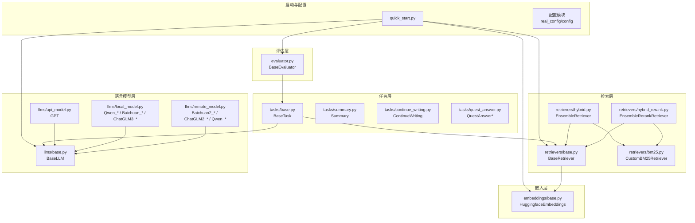
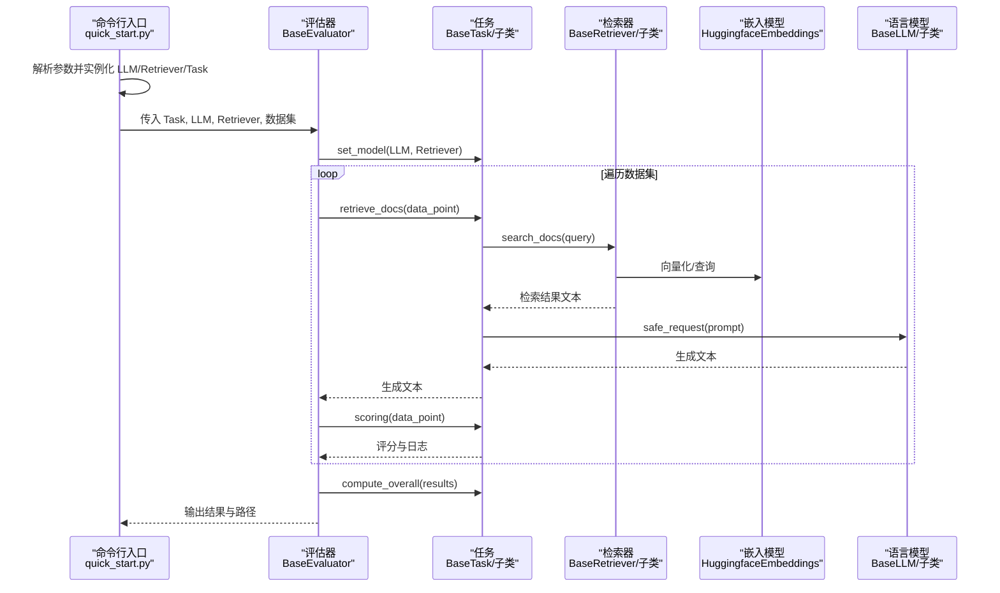
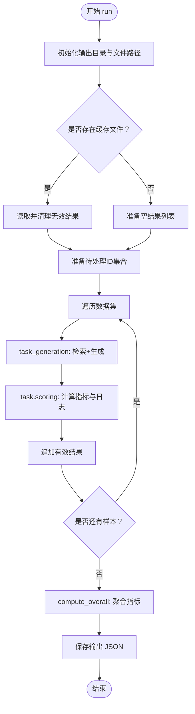
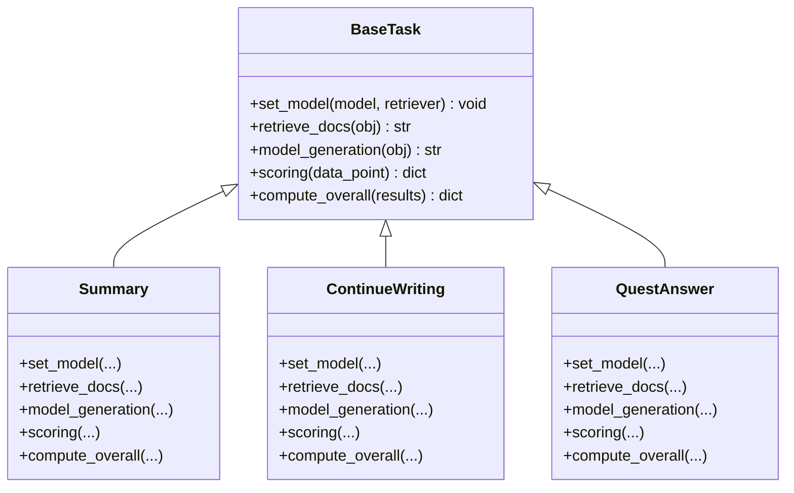
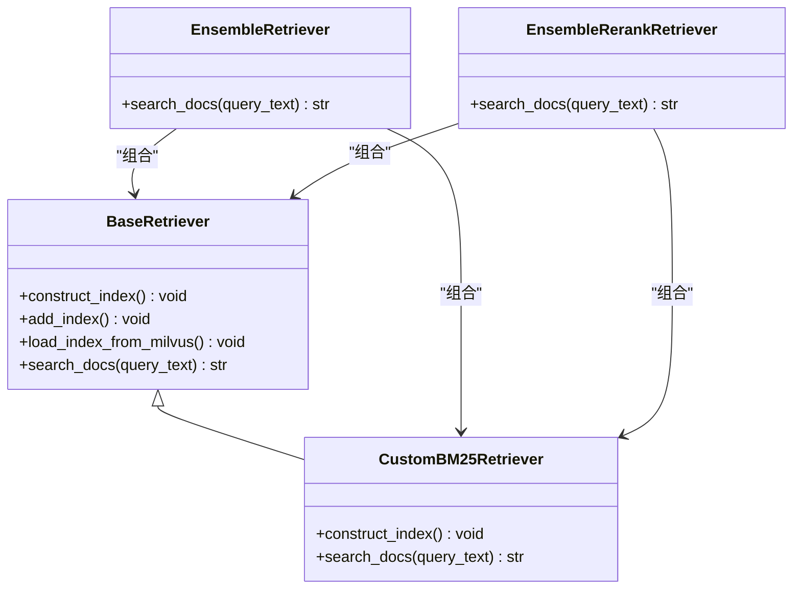
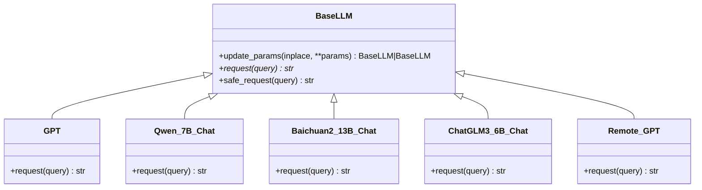
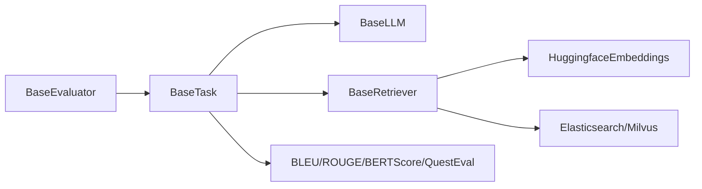

# 组件交互机制

<cite>
**本文引用的文件**
- [evaluator.py](file://evaluator.py)
- [quick_start.py](file://quick_start.py)
- [src/tasks/base.py](file://src/tasks/base.py)
- [src/tasks/summary.py](file://src/tasks/summary.py)
- [src/tasks/continue_writing.py](file://src/tasks/continue_writing.py)
- [src/tasks/quest_answer.py](file://src/tasks/quest_answer.py)
- [src/retrievers/base.py](file://src/retrievers/base.py)
- [src/retrievers/bm25.py](file://src/retrievers/bm25.py)
- [src/retrievers/hybrid.py](file://src/retrievers/hybrid.py)
- [src/retrievers/hybrid_rerank.py](file://src/retrievers/hybrid_rerank.py)
- [src/llms/base.py](file://src/llms/base.py)
- [src/llms/api_model.py](file://src/llms/api_model.py)
- [src/llms/local_model.py](file://src/llms/local_model.py)
- [src/llms/remote_model.py](file://src/llms/remote_model.py)
- [src/embeddings/base.py](file://src/embeddings/base.py)
</cite>

## 目录
1. [引言](#引言)
2. [项目结构](#项目结构)
3. [核心组件](#核心组件)
4. [架构总览](#架构总览)
5. [详细组件分析](#详细组件分析)
6. [依赖分析](#依赖分析)
7. [性能考虑](#性能考虑)
8. [故障排查指南](#故障排查指南)
9. [结论](#结论)
10. [附录](#附录)

## 引言
本文件围绕 CRUD-RAG 系统的组件交互机制展开，重点解析 BaseEvaluator、BaseTask、BaseRetriever 和 BaseLLM 四大核心组件之间的依赖注入、接口调用与事件传递方式；阐述组件生命周期管理与状态同步策略；给出复杂场景下的时序图与协作图；总结组件解耦设计与接口抽象的实现；并提供错误传播与异常处理机制的分析以及扩展与定制的最佳实践。

## 项目结构
系统采用分层与职责分离的设计：任务层（Tasks）、检索层（Retrievers）、语言模型层（LLMs）与评估器（Evaluator）。启动入口通过命令行参数装配具体实现，形成可插拔的组件组合。

图表来源
- [quick_start.py:1-110](file://quick_start.py#L1-L110)
- [evaluator.py:13-41](file://evaluator.py#L13-L41)
- [src/tasks/base.py:13-74](file://src/tasks/base.py#L13-L74)
- [src/retrievers/base.py:16-142](file://src/retrievers/base.py#L16-L142)
- [src/retrievers/bm25.py:14-92](file://src/retrievers/bm25.py#L14-L92)
- [src/retrievers/hybrid.py:13-81](file://src/retrievers/hybrid.py#L13-L81)
- [src/retrievers/hybrid_rerank.py:26-81](file://src/retrievers/hybrid_rerank.py#L26-L81)
- [src/llms/base.py:6-47](file://src/llms/base.py#L6-L47)
- [src/llms/api_model.py:12-33](file://src/llms/api_model.py#L12-L33)
- [src/llms/local_model.py:11-114](file://src/llms/local_model.py#L11-L114)
- [src/llms/remote_model.py:14-111](file://src/llms/remote_model.py#L14-L111)
- [src/embeddings/base.py:14-88](file://src/embeddings/base.py#L14-L88)

章节来源
- [quick_start.py:1-110](file://quick_start.py#L1-L110)

## 核心组件
- BaseEvaluator：负责批处理调度、结果缓存与恢复、多线程并发执行、最终汇总统计与输出持久化。它持有 Task、LLM、Retriever 的实例，并在运行期协调三者协作。
- BaseTask：定义任务的统一接口，包括检索上下文、生成文本、评分与整体统计等。子类通过模板方法模式实现具体任务逻辑。
- BaseRetriever：封装向量索引构建、增量添加、Milvus/Elasticsearch 加载与查询引擎组装；对外提供统一的搜索接口。
- BaseLLM：抽象语言模型请求接口，提供安全请求包装与参数更新能力，具体实现支持本地推理、远程服务与云端 API。

章节来源
- [evaluator.py:13-192](file://evaluator.py#L13-L192)
- [src/tasks/base.py:13-74](file://src/tasks/base.py#L13-L74)
- [src/retrievers/base.py:16-142](file://src/retrievers/base.py#L16-L142)
- [src/llms/base.py:6-47](file://src/llms/base.py#L6-L47)

## 架构总览
下图展示了从启动到评估完成的端到端流程，强调组件间的依赖注入与调用链路。

图表来源
- [quick_start.py:54-108](file://quick_start.py#L54-L108)
- [evaluator.py:42-151](file://evaluator.py#L42-L151)
- [src/tasks/base.py:34-65](file://src/tasks/base.py#L34-L65)
- [src/retrievers/base.py:133-140](file://src/retrievers/base.py#L133-L140)
- [src/llms/base.py:38-46](file://src/llms/base.py#L38-L46)

## 详细组件分析

### BaseEvaluator：评估编排与并发控制
- 依赖注入：构造函数接收 Task、LLM、Retriever 实例，并调用 Task.set_model 完成二次注入，确保 Task 内部持有 LLM 与 Retriever 的引用。
- 生命周期管理：根据检索集合名与 topK 参数动态生成输出目录；支持断点续评，读取已有结果并跳过已验证样本。
- 并发与同步：使用线程池并发执行任务生成与评分；通过锁保护共享资源访问（如 QuestEval 的保存）。
- 错误处理：对检索、生成、评分各阶段进行异常捕获与告警；过滤无效结果；最终汇总失败时回退为空结果。
- 输出管理：将信息、总体指标与明细结果写入 JSON 文件，便于复现与二次分析。

图表来源
- [evaluator.py:118-151](file://evaluator.py#L118-L151)
- [evaluator.py:56-107](file://evaluator.py#L56-L107)
- [evaluator.py:158-191](file://evaluator.py#L158-L191)

章节来源
- [evaluator.py:13-192](file://evaluator.py#L13-L192)

### BaseTask：任务接口与模板方法
- 接口契约：set_model、retrieve_docs、model_generation、scoring、compute_overall 等方法构成统一的任务协议。
- 子类实现：Summary、ContinueWriting、QuestAnswer* 通过模板方法填充具体提示词、检索字段与评分逻辑。
- 与 LLM/Retriever 协作：在生成阶段调用 LLM.safe_request，在检索阶段调用 Retriever.search_docs，并将检索上下文注入生成提示。

图表来源
- [src/tasks/base.py:13-74](file://src/tasks/base.py#L13-L74)
- [src/tasks/summary.py:12-121](file://src/tasks/summary.py#L12-L121)
- [src/tasks/continue_writing.py:13-119](file://src/tasks/continue_writing.py#L13-L119)
- [src/tasks/quest_answer.py:14-134](file://src/tasks/quest_answer.py#L14-L134)

章节来源
- [src/tasks/base.py:13-74](file://src/tasks/base.py#L13-L74)
- [src/tasks/summary.py:32-50](file://src/tasks/summary.py#L32-L50)
- [src/tasks/continue_writing.py:33-51](file://src/tasks/continue_writing.py#L33-L51)
- [src/tasks/quest_answer.py:34-52](file://src/tasks/quest_answer.py#L34-L52)

### BaseRetriever：检索抽象与索引管理
- 初始化策略：支持从零构建索引、从 Milvus/Elasticsearch 加载现有索引、增量添加节点；内部组装 VectorIndexRetriever 与 RetrieverQueryEngine。
- 分块索引：为规避 Milvus 写入限制，按固定步长分片写入，保证大规模文档的可扩展性。
- 查询接口：统一 search_docs 返回拼接后的检索文本，供任务侧直接使用。

图表来源
- [src/retrievers/base.py:16-142](file://src/retrievers/base.py#L16-L142)
- [src/retrievers/bm25.py:14-92](file://src/retrievers/bm25.py#L14-L92)
- [src/retrievers/hybrid.py:13-81](file://src/retrievers/hybrid.py#L13-L81)
- [src/retrievers/hybrid_rerank.py:26-81](file://src/retrievers/hybrid_rerank.py#L26-L81)

章节来源
- [src/retrievers/base.py:37-87](file://src/retrievers/base.py#L37-L87)
- [src/retrievers/base.py:89-119](file://src/retrievers/base.py#L89-L119)
- [src/retrievers/base.py:121-131](file://src/retrievers/base.py#L121-L131)
- [src/retrievers/base.py:133-140](file://src/retrievers/base.py#L133-L140)

### BaseLLM：模型抽象与安全请求
- 参数管理：统一参数字典与更新策略，支持原地更新或深拷贝返回新对象。
- 安全请求：safe_request 包装 request，捕获异常并返回空字符串，避免单点失败影响整体流程。
- 具体实现：GPT（云端 API）、Qwen_*（本地）、Baichuan_*（本地）、ChatGLM3_*（本地）、远程服务（HTTP）等，均遵循同一抽象接口。

图表来源
- [src/llms/base.py:6-47](file://src/llms/base.py#L6-L47)
- [src/llms/api_model.py:12-33](file://src/llms/api_model.py#L12-L33)
- [src/llms/local_model.py:11-114](file://src/llms/local_model.py#L11-L114)
- [src/llms/remote_model.py:14-111](file://src/llms/remote_model.py#L14-L111)

章节来源
- [src/llms/base.py:25-46](file://src/llms/base.py#L25-L46)
- [src/llms/api_model.py:17-32](file://src/llms/api_model.py#L17-L32)
- [src/llms/local_model.py:27-60](file://src/llms/local_model.py#L27-L60)
- [src/llms/remote_model.py:88-110](file://src/llms/remote_model.py#L88-L110)

### 嵌入模型与检索器组合
- HuggingfaceEmbeddings：封装 bi-encoder 与 cross-encoder，支持批量编码与预测，满足不同检索场景需求。
- EnsembleRetriever：融合 BM25 与向量检索结果，采用 Reciprocal Rank Fusion（RRF）融合策略。
- EnsembleRerankRetriever：在融合基础上引入重排序器，进一步提升相关性。

章节来源
- [src/embeddings/base.py:14-88](file://src/embeddings/base.py#L14-L88)
- [src/retrievers/hybrid.py:50-80](file://src/retrievers/hybrid.py#L50-L80)
- [src/retrievers/hybrid_rerank.py:63-80](file://src/retrievers/hybrid_rerank.py#L63-L80)

## 依赖分析
- 组件耦合度：Evaluator 与 Task 强耦合（通过 set_model 注入），Task 与 LLM/Retriever 弱耦合（仅通过接口交互），Retriever 与 Embeddings 弱耦合（LangChain Embeddings 抽象）。
- 外部依赖：LlamaIndex、LangChain、Elasticsearch、Milvus、FlagReranker、OpenAI SDK、Transformers/Torch 等。
- 循环依赖：未发现循环导入；Evaluator 作为编排中心，其他组件均不反向依赖其具体实现。

图表来源
- [evaluator.py:13-41](file://evaluator.py#L13-L41)
- [src/tasks/base.py:34-45](file://src/tasks/base.py#L34-L45)
- [src/retrievers/base.py:16-44](file://src/retrievers/base.py#L16-L44)
- [src/embeddings/base.py:14-88](file://src/embeddings/base.py#L14-L88)

章节来源
- [evaluator.py:13-41](file://evaluator.py#L13-L41)
- [src/tasks/base.py:34-45](file://src/tasks/base.py#L34-L45)
- [src/retrievers/base.py:16-44](file://src/retrievers/base.py#L16-L44)

## 性能考虑
- 并发与吞吐：BaseEvaluator 使用线程池并发执行，显著提升批处理速度；建议根据硬件资源调整线程数。
- I/O 与存储：索引分片写入与 Milvus/Mapper 交互需关注磁盘与网络带宽；Elasticsearch 查询 DSL 可优化匹配策略。
- 模型延迟：远程与本地模型延迟差异较大，建议在高并发场景优先选择本地或内网服务。
- 缓存与断点续评：利用输出文件与 ID 过滤减少重复计算，提高迭代效率。

## 故障排查指南
- 检索失败：检查检索器初始化参数（集合名、top_k、文档路径）与外部服务连通性（Elasticsearch/Milvus）。
- 生成异常：确认 LLM 凭据与限额配置；使用 safe_request 的默认降级行为避免中断。
- 评分异常：核对任务模板与字段映射；确保 ground truth 字段存在且非空。
- 并发冲突：若出现竞态，检查锁使用范围与临界区大小；必要时细化锁粒度。

章节来源
- [evaluator.py:49-53](file://evaluator.py#L49-L53)
- [evaluator.py:98-100](file://evaluator.py#L98-L100)
- [src/llms/base.py:38-46](file://src/llms/base.py#L38-L46)

## 结论
该系统通过清晰的抽象层与模板方法模式实现了高度可插拔的组件交互：Evaluator 负责编排与并发，Task 定义任务语义，Retriever 提供检索能力，LLM 承担生成职责。接口统一、错误隔离与断点续评机制共同保障了评估流程的稳定性与可维护性。通过组合模式与策略模式，系统可在检索与评分维度灵活扩展。

## 附录
- 扩展建议
  - 新增任务：继承 BaseTask，实现 set_model、retrieve_docs、model_generation、scoring、compute_overall。
  - 新增检索器：实现 search_docs 并接入新的向量库或搜索引擎。
  - 新增模型：继承 BaseLLM，实现 request 并在 quick_start 中注册映射。
  - 新增指标：在任务 scoring 中补充指标计算并在 compute_overall 中聚合。
- 最佳实践
  - 明确职责边界，避免跨层依赖。
  - 使用 safe_request 与 try-catch 包裹外部调用。
  - 利用输出缓存与 ID 过滤实现高效迭代。
  - 在高并发场景中合理设置线程数与锁粒度。