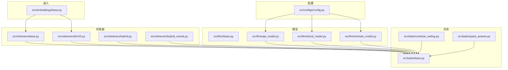
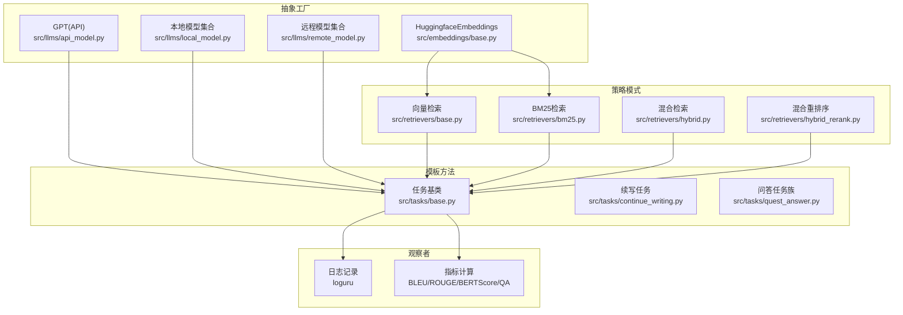
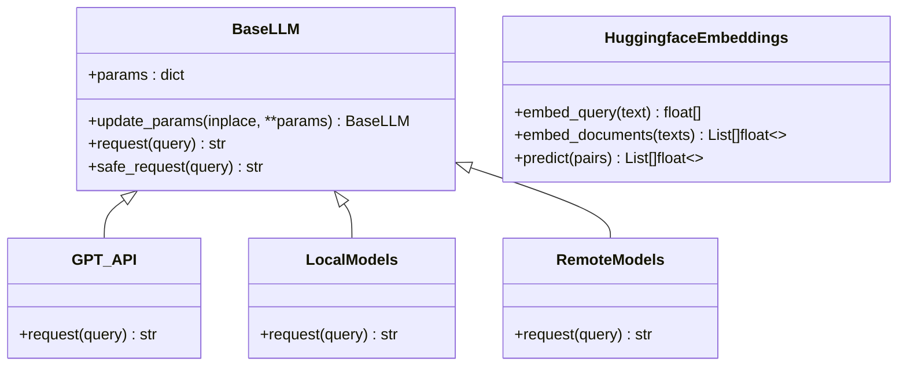
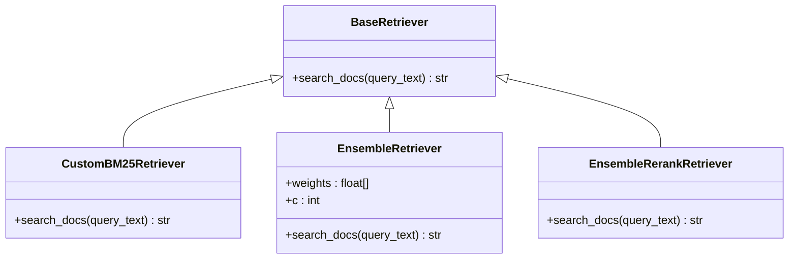
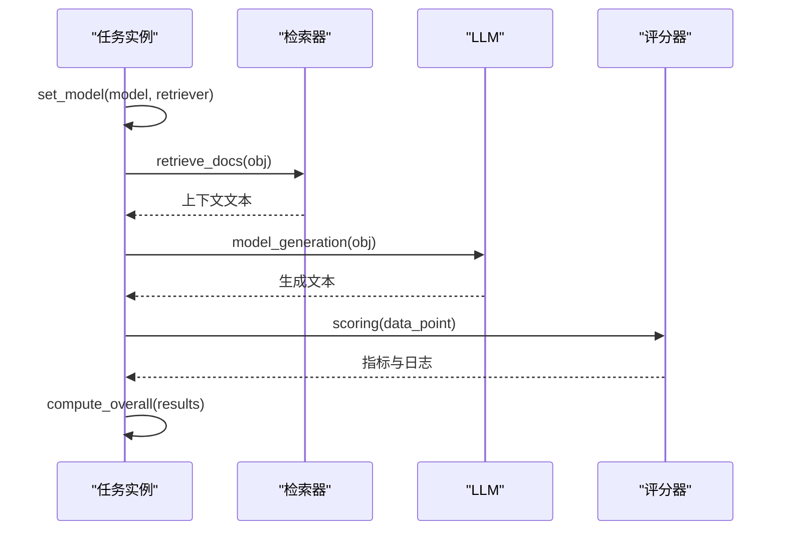
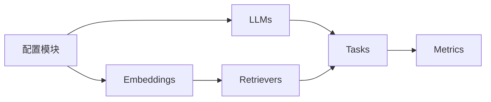

# 设计模式应用

<cite>
**本文引用的文件**
- [README.md](file://README.md)
- [quick_start.py](file://quick_start.py)
- [src/configs/config.py](file://src/configs/config.py)
- [src/datasets/base.py](file://src/datasets/base.py)
- [src/embeddings/base.py](file://src/embeddings/base.py)
- [src/llms/base.py](file://src/llms/base.py)
- [src/llms/api_model.py](file://src/llms/api_model.py)
- [src/llms/local_model.py](file://src/llms/local_model.py)
- [src/llms/remote_model.py](file://src/llms/remote_model.py)
- [src/retrievers/base.py](file://src/retrievers/base.py)
- [src/retrievers/bm25.py](file://src/retrievers/bm25.py)
- [src/retrievers/hybrid.py](file://src/retrievers/hybrid.py)
- [src/retrievers/hybrid_rerank.py](file://src/retrievers/hybrid_rerank.py)
- [src/tasks/base.py](file://src/tasks/base.py)
- [src/tasks/continue_writing.py](file://src/tasks/continue_writing.py)
- [src/tasks/quest_answer.py](file://src/tasks/quest_answer.py)
</cite>

## 目录
1. [引言](#引言)
2. [项目结构](#项目结构)
3. [核心组件](#核心组件)
4. [架构总览](#架构总览)
5. [详细组件分析](#详细组件分析)
6. [依赖分析](#依赖分析)
7. [性能考虑](#性能考虑)
8. [故障排查指南](#故障排查指南)
9. [结论](#结论)
10. [附录](#附录)

## 引言
本文件聚焦于CRUD-RAG系统中设计模式的应用与实践，围绕以下模式展开：抽象工厂（用于模型与嵌入的统一构建）、策略（用于检索器与任务执行流程的可替换性）、模板方法（用于任务执行流程的标准化与扩展）、以及观察者（通过日志与指标记录实现结果观测）。我们将结合系统架构与具体实现，解释这些模式如何提升系统的可扩展性、可维护性与可测试性，并给出技术权衡与最佳实践建议。

## 项目结构
CRUD-RAG采用按功能域分层的模块化组织方式，核心模块包括配置、数据集、嵌入、大语言模型、检索器、任务与评估指标等。整体结构清晰，便于通过设计模式进行解耦与扩展。

图表来源
- [src/configs/config.py:1-14](file://src/configs/config.py#L1-L14)
- [src/llms/base.py:1-47](file://src/llms/base.py#L1-L47)
- [src/llms/api_model.py:1-33](file://src/llms/api_model.py#L1-L33)
- [src/llms/local_model.py:1-114](file://src/llms/local_model.py#L1-L114)
- [src/llms/remote_model.py:1-111](file://src/llms/remote_model.py#L1-L111)
- [src/embeddings/base.py:1-88](file://src/embeddings/base.py#L1-L88)
- [src/retrievers/base.py:1-142](file://src/retrievers/base.py#L1-L142)
- [src/retrievers/bm25.py:1-92](file://src/retrievers/bm25.py#L1-L92)
- [src/retrievers/hybrid.py:1-81](file://src/retrievers/hybrid.py#L1-L81)
- [src/retrievers/hybrid_rerank.py:1-81](file://src/retrievers/hybrid_rerank.py#L1-L81)
- [src/tasks/base.py:1-74](file://src/tasks/base.py#L1-L74)
- [src/tasks/continue_writing.py:1-119](file://src/tasks/continue_writing.py#L1-L119)
- [src/tasks/quest_answer.py:1-134](file://src/tasks/quest_answer.py#L1-L134)

章节来源
- [README.md:27-68](file://README.md#L27-L68)

## 核心组件
本节从设计模式视角梳理系统的关键构件及其职责边界，明确各模块在整体流程中的角色与协作关系。

- 抽象工厂（模型与嵌入）
  - 通过基类定义统一接口，子类实现具体行为，便于在运行时选择不同实现（如本地、远程、API调用）。
  - 嵌入模型封装了跨编码器与双向编码器的自动识别与实例化逻辑，降低外部依赖差异带来的复杂度。

- 策略（检索器与任务）
  - 检索器策略：支持向量检索、BM25、混合检索与重排序策略，便于根据场景切换或组合。
  - 任务策略：任务基类定义统一流程，子类仅关注特定任务的提示词与评分逻辑，实现流程与算法的解耦。

- 模板方法（任务执行）
  - 任务基类提供标准执行流程（设置模型与检索器、检索上下文、生成文本、评分与汇总），子类覆盖关键步骤以适配不同任务。

- 观察者（日志与指标）
  - 通过日志记录与指标计算，形成对输出结果的“观察”，便于调试与评估。

章节来源
- [src/llms/base.py:1-47](file://src/llms/base.py#L1-L47)
- [src/embeddings/base.py:1-88](file://src/embeddings/base.py#L1-L88)
- [src/retrievers/base.py:1-142](file://src/retrievers/base.py#L1-L142)
- [src/retrievers/bm25.py:1-92](file://src/retrievers/bm25.py#L1-L92)
- [src/retrievers/hybrid.py:1-81](file://src/retrievers/hybrid.py#L1-L81)
- [src/retrievers/hybrid_rerank.py:1-81](file://src/retrievers/hybrid_rerank.py#L1-L81)
- [src/tasks/base.py:1-74](file://src/tasks/base.py#L1-L74)

## 架构总览
下图展示了系统中设计模式的总体应用：抽象工厂负责模型与嵌入的创建；策略模式贯穿检索器与任务；模板方法规范任务执行流程；观察者模式体现在日志与指标记录中。

图表来源
- [src/embeddings/base.py:1-88](file://src/embeddings/base.py#L1-L88)
- [src/llms/api_model.py:1-33](file://src/llms/api_model.py#L1-L33)
- [src/llms/local_model.py:1-114](file://src/llms/local_model.py#L1-L114)
- [src/llms/remote_model.py:1-111](file://src/llms/remote_model.py#L1-L111)
- [src/retrievers/base.py:1-142](file://src/retrievers/base.py#L1-L142)
- [src/retrievers/bm25.py:1-92](file://src/retrievers/bm25.py#L1-L92)
- [src/retrievers/hybrid.py:1-81](file://src/retrievers/hybrid.py#L1-L81)
- [src/retrievers/hybrid_rerank.py:1-81](file://src/retrievers/hybrid_rerank.py#L1-L81)
- [src/tasks/base.py:1-74](file://src/tasks/base.py#L1-L74)
- [src/tasks/continue_writing.py:1-119](file://src/tasks/continue_writing.py#L1-L119)
- [src/tasks/quest_answer.py:1-134](file://src/tasks/quest_answer.py#L1-L134)

## 详细组件分析

### 工厂模式：模型与嵌入的统一构建
- 抽象工厂职责
  - 模型工厂：以BaseLLM为抽象基类，API、本地与远程模型作为具体产品，统一参数管理与安全请求接口。
  - 嵌入工厂：HuggingfaceEmbeddings根据模型类型自动判断是否为交叉编码器，并实例化相应模型，屏蔽底层库差异。
- 应用优势
  - 解耦客户端与具体实现，便于新增模型或切换部署方式。
  - 统一参数更新与异常处理，提升可维护性与可测试性。
- 扩展方式
  - 新增模型：继承BaseLLM并实现request方法，保持update_params与safe_request的通用能力。
  - 新增嵌入：在HuggingfaceEmbeddings中扩展模型类型判断与实例化分支。

图表来源
- [src/llms/base.py:1-47](file://src/llms/base.py#L1-L47)
- [src/llms/api_model.py:1-33](file://src/llms/api_model.py#L1-L33)
- [src/llms/local_model.py:1-114](file://src/llms/local_model.py#L1-L114)
- [src/llms/remote_model.py:1-111](file://src/llms/remote_model.py#L1-L111)
- [src/embeddings/base.py:1-88](file://src/embeddings/base.py#L1-L88)

章节来源
- [src/llms/base.py:1-47](file://src/llms/base.py#L1-L47)
- [src/llms/api_model.py:1-33](file://src/llms/api_model.py#L1-L33)
- [src/llms/local_model.py:1-114](file://src/llms/local_model.py#L1-L114)
- [src/llms/remote_model.py:1-111](file://src/llms/remote_model.py#L1-L111)
- [src/embeddings/base.py:1-88](file://src/embeddings/base.py#L1-L88)

### 策略模式：检索器与任务的可替换性
- 检索器策略
  - 向量检索：基于Milvus的向量索引与查询引擎。
  - BM25检索：基于Elasticsearch的倒排检索。
  - 混合检索：融合向量与BM25结果，采用Reciprocal Rank Fusion（RRF）融合权重。
  - 混合重排序：在混合检索基础上引入交叉编码器重排序。
- 任务策略
  - 任务基类定义统一流程，子类仅实现提示词读取、生成与评分逻辑，便于扩展新任务。
- 应用优势
  - 通过组合与多态实现灵活切换与组合，提升系统适应性与可测试性。
- 扩展方式
  - 新增检索器：实现search_docs接口，接入统一的查询与返回格式。
  - 新增任务：继承BaseTask并覆盖set_model、retrieve_docs、model_generation、scoring、compute_overall等方法。

图表来源
- [src/retrievers/base.py:1-142](file://src/retrievers/base.py#L1-L142)
- [src/retrievers/bm25.py:1-92](file://src/retrievers/bm25.py#L1-L92)
- [src/retrievers/hybrid.py:1-81](file://src/retrievers/hybrid.py#L1-L81)
- [src/retrievers/hybrid_rerank.py:1-81](file://src/retrievers/hybrid_rerank.py#L1-L81)

章节来源
- [src/retrievers/base.py:1-142](file://src/retrievers/base.py#L1-L142)
- [src/retrievers/bm25.py:1-92](file://src/retrievers/bm25.py#L1-L92)
- [src/retrievers/hybrid.py:1-81](file://src/retrievers/hybrid.py#L1-L81)
- [src/retrievers/hybrid_rerank.py:1-81](file://src/retrievers/hybrid_rerank.py#L1-L81)
- [src/tasks/base.py:1-74](file://src/tasks/base.py#L1-L74)

### 模板方法：任务执行流程的标准化
- 流程定义
  - 任务基类提供标准流程：set_model、retrieve_docs、model_generation、scoring、compute_overall。
  - 子类仅需实现与任务相关的关键步骤，保证流程一致性与可复用性。
- 典型应用
  - 续写任务：读取提示模板、拼接上下文、生成文本、评分与汇总。
  - 问答任务族：支持单/双/三篇文档的问答变体，共享流程与指标计算。
- 优势
  - 降低重复代码，提升可维护性；便于单元测试与集成测试。

图表来源
- [src/tasks/base.py:1-74](file://src/tasks/base.py#L1-L74)
- [src/tasks/continue_writing.py:1-119](file://src/tasks/continue_writing.py#L1-L119)
- [src/tasks/quest_answer.py:1-134](file://src/tasks/quest_answer.py#L1-L134)

章节来源
- [src/tasks/base.py:1-74](file://src/tasks/base.py#L1-L74)
- [src/tasks/continue_writing.py:1-119](file://src/tasks/continue_writing.py#L1-L119)
- [src/tasks/quest_answer.py:1-134](file://src/tasks/quest_answer.py#L1-L134)

### 观察者模式：日志与指标记录
- 观察点
  - 日志记录：通过日志框架记录请求耗时、错误信息与运行状态。
  - 指标记录：BLEU、ROUGE、BERTScore、RAGQuestEval等指标的计算与保存。
- 价值
  - 提供系统运行状态的可观测性，便于问题定位与性能优化。
  - 将观测逻辑与业务流程解耦，提升可测试性与可维护性。

章节来源
- [src/tasks/continue_writing.py:1-119](file://src/tasks/continue_writing.py#L1-L119)
- [src/tasks/quest_answer.py:1-134](file://src/tasks/quest_answer.py#L1-L134)

## 依赖分析
- 模块内聚与耦合
  - 模型、嵌入、检索器与任务均通过抽象基类解耦，彼此之间通过接口交互，降低直接依赖。
  - 配置模块集中管理外部服务访问参数，避免硬编码与分散配置。
- 外部依赖与集成点
  - OpenAI API、本地transformers模型、远程推理服务、Elasticsearch与Milvus向量数据库。
- 循环依赖风险
  - 当前结构未见循环导入；若未来引入更复杂的任务组合，应避免双向依赖。

图表来源
- [src/configs/config.py:1-14](file://src/configs/config.py#L1-L14)
- [src/llms/base.py:1-47](file://src/llms/base.py#L1-L47)
- [src/embeddings/base.py:1-88](file://src/embeddings/base.py#L1-L88)
- [src/retrievers/base.py:1-142](file://src/retrievers/base.py#L1-L142)
- [src/tasks/base.py:1-74](file://src/tasks/base.py#L1-L74)

章节来源
- [src/configs/config.py:1-14](file://src/configs/config.py#L1-L14)
- [src/llms/base.py:1-47](file://src/llms/base.py#L1-L47)
- [src/embeddings/base.py:1-88](file://src/embeddings/base.py#L1-L88)
- [src/retrievers/base.py:1-142](file://src/retrievers/base.py#L1-L142)
- [src/tasks/base.py:1-74](file://src/tasks/base.py#L1-L74)

## 性能考虑
- 检索性能
  - 向量索引分片入库与Milvus批量写入策略减少单次操作压力，但需平衡分片大小与写入吞吐。
  - BM25与向量检索的融合与重排序会增加计算开销，建议根据资源情况调整top_k与权重。
- 生成性能
  - 安全请求包装与异常降级可避免单点失败影响整体流程，但需注意日志与统计成本。
  - 本地模型推理受显存与算力限制，远程模型需考虑网络延迟与并发控制。
- 指标计算
  - BLEU/ROUGE/BERTScore与RAGQuestEval均为CPU密集型或需要外部模型调用，建议批量化与缓存中间结果。

## 故障排查指南
- 模型访问失败
  - 检查配置项是否正确加载（API密钥、基础URL、本地路径、远程地址与令牌）。
  - 使用safe_request捕获异常并记录日志，定位具体错误来源。
- 检索无结果或性能差
  - 确认向量索引是否已构建完成且分片入库成功。
  - 调整similarity_top_k与chunk参数，检查Elasticsearch/Milvus连接状态。
- 任务执行异常
  - 核对提示模板是否存在与路径是否正确。
  - 检查任务输出字段与评分逻辑，确保生成文本符合预期格式。

章节来源
- [src/configs/config.py:1-14](file://src/configs/config.py#L1-L14)
- [src/llms/base.py:38-46](file://src/llms/base.py#L38-L46)
- [src/retrievers/base.py:56-88](file://src/retrievers/base.py#L56-L88)
- [src/tasks/continue_writing.py:53-61](file://src/tasks/continue_writing.py#L53-L61)
- [src/tasks/quest_answer.py:54-61](file://src/tasks/quest_answer.py#L54-L61)

## 结论
CRUD-RAG系统通过抽象工厂、策略、模板方法与观察者等设计模式，实现了模型、检索器与任务的高内聚低耦合，显著提升了系统的可扩展性、可维护性与可测试性。在实际工程中，建议持续关注外部依赖的稳定性与性能瓶颈，结合监控与日志完善观测体系，并通过参数化与配置化进一步降低部署与运维成本。

## 附录
- 快速开始与参数说明可参考项目自述文件与启动脚本，确保首次构建向量索引与正确配置模型参数。

章节来源
- [README.md:70-105](file://README.md#L70-L105)
- [quick_start.py](file://quick_start.py)